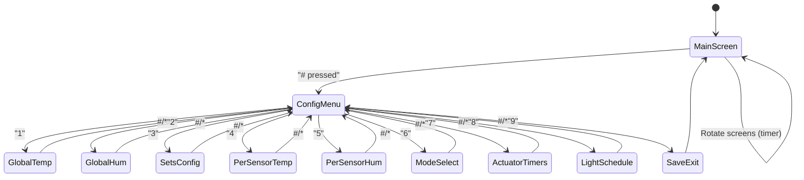

# System Manager UX (SysMgrUX) – Requirements

## 1. Purpose
The **SysMgrUX** component provides a **user interface** for configuring and monitoring the system managed by **SysMgr**.  
It handles **input from the KeypadMgr** (4×4 keypad) and **output to the LCD** (2×16 display).  
It abstracts user interaction logic from system control logic.

---

## 2. Scope
SysMgrUX allows the user to:
1. Configure global operational parameters (temperature, humidity).  
2. Enable/disable sensor sets (mapping sensors to actuators).  
3. Configure per-sensor operational thresholds.  
4. Configure actuator ON/OFF timing in **Hybrid** and **Manual** modes.  
5. Select the system mode (**Automatic, Hybrid, Manual, Fail-Safe**).  
6. Monitor real-time data:  
   - Average Temp & Humidity  
   - Per-sensor Temp & Humidity  
   - Active actuators  
7. Update **SysMgr** with new configuration.  
8. Store configuration persistently via **FlashMgr**.  

---

## 3. Interfaces

### 3.1 Inputs
- **KeypadMgr**  
  - `Status_t KeypadMgr_GetLastEvent(Keypad_Event_t *event_out);`  

- **SysMgr** (for monitoring current system status)  
  - `Status_t SYS_MGR_GetMode(SYS_MGR_Mode_t *mode);`  
  - `Status_t SYS_MGR_GetActuatorStates(SYS_MGR_ActuatorState_t *state);`  
  - `Status_t SYS_MGR_GetCriticalAlarmStatus(bool *active);`  
  - `Status_t TempHumCtrl_GetSystemAverageTemperature(float *out);`  
  - `Status_t TempHumCtrl_GetSystemAverageHumidity(float *out);`  
  - `Status_t TempHumCtrl_GetTemperature(TempHum_Sensor_ID_t id, float *out);`  
  - `Status_t TempHumCtrl_GetHumidity(TempHum_Sensor_ID_t id, float *out);`  

### 3.2 Outputs
- **LCD HAL**  
  - `HAL_CharDisplay_WriteChar`  
  - `HAL_CharDisplay_WriteString`  
  - `HAL_CharDisplay_SetCursor`  
  - `HAL_CharDisplay_ClearDisplay`  
  - `HAL_CharDisplay_Home`  
  - `HAL_CharDisplay_EnableCursor`  

- **SysMgr** (configuration updates)  
  - `Status_t SYS_MGR_SetMode(SYS_MGR_Mode_t mode);`  
  - `Status_t SYS_MGR_SetOperationalTemperature(float min, float max);`  
  - `Status_t SYS_MGR_SetOperationalHumidity(float min, float max);`  
  - `Status_t SYS_MGR_SetPerSensorConfig(sensor_id, thresholds);`  
  - `Status_t SYS_MGR_SetActuatorSchedule(actuator_id, schedule);`  
  - `Status_t SYS_MGR_SetFailSafeMode(bool enable);`  

- **FlashMgr** (persistent storage)  
  - `Status_t FlashMgr_WriteConfig(SystemConfig_t *config);`  
  - `Status_t FlashMgr_ReadConfig(SystemConfig_t *config_out);`  

---

## 4. Functional Requirements

### 4.1 Main Screens (rotating every 3–5s)
1. **Screen 1:** Average Temp & Humidity  
   - Example: `Avg T:24C H:50%`  
2. **Screen 2:** Per-Sensor Temp & Humidity  
   - Example: `S1:23C 45% S2:25C 55%`  
   - Scrolls if more than 2 sensors.  
3. **Screen 3:** Active actuators  
   - Example: `Fan:ON Heater:OFF`  

---

### 4.2 Config Menu
Accessible by pressing **Enter (#)**.  

#### Menu Options
1. `1: Global Temp` → Set min/max system temperature.  
2. `2: Global Hum` → Set min/max system humidity.  
3. `3: Sets Config` → Enable/disable specific sensor sets.  
4. `4: Per-Sensor Temp` → Configure thresholds for individual sensors.  
5. `5: Per-Sensor Hum` → Configure humidity thresholds for individual sensors.  
6. `6: Mode Select` → Choose Automatic / Hybrid / Manual.  
7. `7: Actuator Timers` → Set ON/OFF time for actuators (hybrid/manual).  
8. `8: Light Schedule` → Configure real-time ON/OFF for lights (RTC-based).  
9. `9: Exit & Save` → Save to FlashMgr, notify SysMgr, return to main screen.  

---

### 4.3 Input Handling
- Numeric keys (0–9) → Direct numeric entry.  
- `#` → Confirm input.  
- `*` → Cancel/back.  
- Multi-digit input supported (0–99 for temperature, 0–100 for humidity).  

---

### 4.4 Configuration Persistence
- Config is cached in RAM while editing.  
- Committed to FlashMgr:  
  - On **Exit & Save**.  
  - On **timeout** (user inactivity > e.g., 60s).  

---

### 4.5 Error Handling
- If user enters invalid value → display `Invalid!` and revert.  
- If sensor doesn’t support humidity → display `No Hum`.  
- If FlashMgr write fails → log via SysMon_ReportFaultStatus.  

---

## 5. State Machine

---

## 6. Non-Functional Requirements
- LCD update rate: ≤ 500 ms.  
- Keypad debounce handled by KeypadMgr.  
- Timeout in config menu: 60s → auto-save + return to main screen.  
- Low memory footprint: static menu strings.  

---
