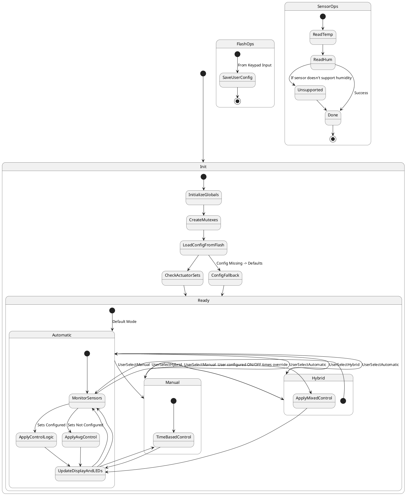

# SysMgr Requirements

## 1. Initialization
- Initialize all global variables.  
- Create required mutexes and semaphores.  
- Read the **system configuration** from flash (monitored Temp & Hum ranges, control modes).  
- Initialize sensor/actuator mapping information.  
- Validate configuration data. If invalid or not present, apply **default configuration values**.

---

## 2. Sensor & Actuator Management

### 2.1 Sensor Handling
- Some **temperature & humidity sensors** (e.g., NTC thermistors) do **not support humidity**.  
  - In this case, attempts to retrieve humidity shall return **unsupported**.  
  - System Manager shall gracefully handle this by excluding unsupported sensors from humidity calculations.  

### 2.2 Actuator Set Configuration
- **Configured Sets**:  
  Each temperature sensor can be mapped to a **fan & heater**, and each humidity sensor can be mapped to a **ventilator & pump**.  
  - Example:  
    - Temp sensor 1 → Fan 1 & Heater 1  
    - Hum sensor 1 → Ventilator 1 & Pump 1  
  - Control Logic:  
    - If sensor 1 temperature rises above threshold → Enable Fan 1.  
    - If sensor 1 temperature drops below threshold → Enable Heater 1.  
    - If sensor 1 humidity rises above threshold → Enable Ventilator 1 & Pump 1.  
    - When values return to normal → Disable corresponding actuators.  

- **Non-Configured Sets**:  
  - System Manager uses **average temperature & humidity** from all available sensors.  
  - Control Logic:  
    - If average temperature > threshold → Enable **all fans**.  
    - If average temperature < threshold → Enable **all heaters**.  
    - If average humidity > threshold → Enable **all ventilators & pumps**.  
    - If average humidity < threshold → Disable **all ventilators & pumps**.  

- **Partial Configurations**:  
  - If some sensors are configured into sets, but others are not →  
    - Configured sets follow **direct mapping rules**.  
    - Remaining sensors contribute to **average-based control**.

---

## 3. Operating Modes
- **Automatic Mode**:  
  - All actuators are supervised by System Manager.  
  - Both **configured** and **non-configured sets** are supported.  

- **Hybrid Mode**:  
  - User can choose some actuators to run **based on ON/OFF time schedule**.  
  - If an actuator is placed in manual schedule mode, its corresponding set mapping becomes **invalid** and is not automatically controlled.  

- **Manual Mode**:  
  - All actuators run strictly on **time schedules**.  
  - No automatic sensor monitoring or control is applied.  

---

## 4. User Interface & Feedback
- **Keypad**:  
  - Used to configure:  
    - System Mode  
    - Temperature ranges  
    - Humidity ranges  
    - ON/OFF schedules for actuators in Hybrid or Manual mode  
  - System Manager shall **write all user configuration** received from keypad to **flash** for persistence.  

- **LCD Display**:  
  - Shall show:  
    - Individual sensor Temp & Hum values  
    - Average Temp & Hum values  
    - Current operating mode  

- **LED Indication**:  
  - Each actuator has a corresponding LED.  
  - When actuator is enabled → LED ON.  
  - When actuator is disabled → LED OFF.  

---

## 5. Safety & Fault Handling
- If any actuator fails to operate, the failure shall be **reported via System Monitor**.  
- If a **critical condition** occurs (e.g., fire detection via high temperature):  
  - System Manager shall activate **Fail-Safe Mode**.  
  - All necessary actuators (fans, pumps, ventilators, lights) are forced ON for safety.  

---

## 6. Light Control
- Light is controlled based on **time schedule** configured by the user.  
- User specifies ON & OFF times via keypad.  
- Light actuator is **not controlled by sensor readings**.  

## Updated State Machine Diagram

