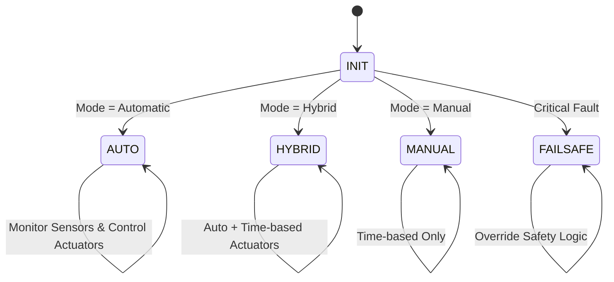
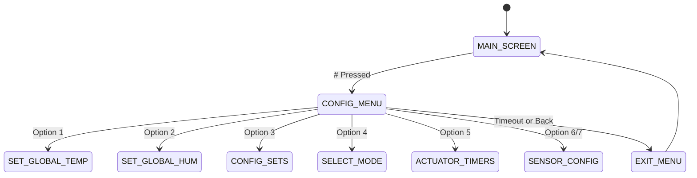

# System Manager (SysMgr) – Requirements Specification

## 1. Overview
The **System Manager (SysMgr)** is the central control component responsible for:
- Monitoring temperature and humidity sensors.  
- Controlling actuators (fans, heaters, pumps, ventilators, lights, LEDs).  
- Providing user interaction via **LCD (2×16)** and **Keypad (4×4)**.  
- Persisting user configurations in Flash/NVS.  
- Managing different operating modes: **Automatic, Hybrid, Manual, Fail-Safe**.  

The SysMgr ensures safe and reliable operation, provides feedback to the user, and maintains the latest configuration across resets.

---

## 2. Functional Requirements

### 2.1 Initialization
1. Initialize global state variables.  
2. Create mutex/semaphores for protecting shared state.  
3. Load system configuration from Flash/NVS.  
   - If invalid → fall back to default values.  
   - If user configuration menu is opened but not exited, system shall timeout and auto-store the data.  
4. Check if **actuator sets** are configured (mapping sensors ↔ actuators).  

---

### 2.2 Sensor Handling
1. Temperature & Humidity readings:
   - Some sensors (e.g., NTC) do not support humidity → return `E_NOT_SUPPORTED`.  
   - If per-sensor thresholds configured → these take precedence.  
   - Otherwise, use **global thresholds** (average).  

2. Sensor Modes:
   - **Sets Configured**:  
     - Each sensor controls its mapped actuators.  
   - **Sets Not Configured**:  
     - System computes **average Temp/Humidity** → controls *all actuators together*.  

---

### 2.3 Actuator Handling
1. Fans → **ON/OFF only** (no speed control).  
2. Each actuator type has a **single LED** representing its ON/OFF status:
   - All fans → 1 LED.  
   - All ventilators → 1 LED.  
   - All heaters → 1 LED.  
   - All pumps → 1 LED.  
   - System health → 1 LED.  
   - Lights → own control, time-based.  
3. If an actuator is not mapped to a set but exists → it operates based on **average Temp/Hum**.  
4. Actuator ON → corresponding LED ON, OFF → LED OFF.  
5. Light Actuator:  
   - Controlled by real-time clock schedule (e.g., ON at 21:00, OFF at 06:00).  

---

### 2.4 Modes of Operation
1. **Automatic Mode**  
   - SysMgr fully controls actuators based on thresholds.  
   - Supports both sets configured and not configured.  

2. **Hybrid Mode**  
   - User chooses some actuators for **time-based ON/OFF** control.  
   - Other actuators remain under automatic SysMgr control.  
   - If a set actuator is forced into time-based control → the set becomes invalid for that actuator.  

3. **Manual Mode**  
   - All actuators operate based on **time ON/OFF schedule** only.  
   - No sensor monitoring.  

4. **Fail-Safe Mode**  
   - Triggered by critical faults (e.g., fire alarm).  
   - Overrides all logic → applies predefined safety actions.  

---

### 2.5 Display & Keypad User Interface
- **Main LCD Screens (cyclic rotation)**:
  1. Average Temp & Hum  
  2. Per-Sensor Temp & Hum  
  3. Active Actuator Status  

- **Configuration Menu (Enter via # key)**:
  1. Set global operational temperature range (0–99 °C).  
  2. Set global operational humidity range (0–99 %).  
  3. Enable/Disable actuator sets.  
  4. Choose system mode (Automatic / Hybrid / Manual).  
  5. Configure ON/OFF times:  
     - For actuators in **Hybrid or Manual** modes.  
     - Format: **On time / Off time** (e.g., Fan = 1 min ON / 30s OFF).  
     - Lights = scheduled ON/OFF at RTC times.  
  6. Per-sensor configuration (only if sets enabled):  
     - Set operational temperature range.  
     - Set operational humidity range.  

- **Keypad Navigation**:
  - **Digits (0–9)** → numeric input (multi-digit allowed).  
  - **#** → Confirm (ENTER).  
  - **\*** → Cancel/Back.  

- **Timeout Handling**:  
  - If user leaves menu idle for **30s**, SysMgr:  
    - Saves all changes to Flash.  
    - Exits back to Idle screen.  

---

### 2.6 Data Persistence
1. All user configurations shall be written to Flash/NVS.  
2. Commit happens:  
   - On exit from configuration menu.  
   - On timeout if user leaves config open.  

---

### 2.7 Fault Handling
1. Any actuator/sensor/flash failure → report using:  
   ```
   SysMon_ReportFaultStatus(SystemMonitor_FaultId_t fault_id, SysMon_FaultStatus_t status);
   ```  
2. Critical alarms (e.g., fire temperature threshold) → enter Fail-Safe Mode.  

---

## 3. State Machine

### 3.1 System Manager – Main States


---

### 3.2 User Interface (LCD/Keypad) – Menu States


---

## 4. Non-Functional Requirements
1. All LCD/Keypad interactions must be **non-blocking** (use state machine).  
2. Mutex protection around shared state (sensor readings, config updates).  
3. Execution time of main periodic function < 10ms.  
4. Modular design: separate SysMgr logic, HAL drivers, and configuration files.  

---

## 5. Acceptance Criteria
1. User can open the config menu with `#` and navigate with numeric keys and `*` to cancel.  
2. Entered values are validated (e.g., 0–99 for temp/hum) and saved on exit/timeout.  
3. Per-sensor configs override global only when sets are enabled.  
4. LEDs reflect actuator states correctly.  
5. Critical faults trigger Fail-Safe and are reported to System Monitor.  

---

End of document.
