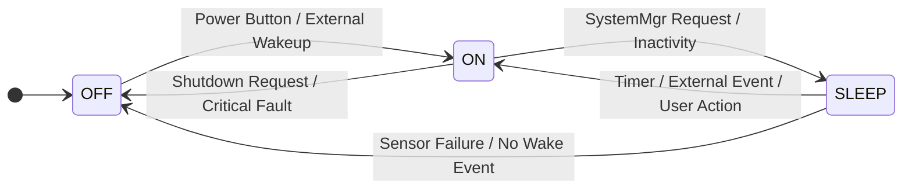
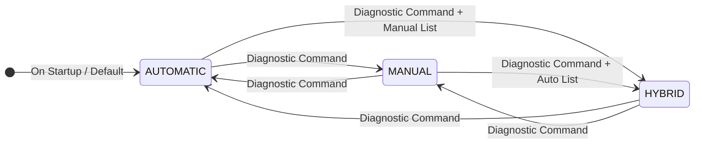

# Software Architecture Document (SAD) 

## 1. Introduction

### 1.1. Purpose

This Software Architecture Document (SAD) describes the high-level design and structure of the firmware for a the Environmental Monitoring & Control System.

The primary purpose of this document is to provide a clear, comprehensive, and consistent overview of the system's architecture, detailing its components, their interactions, and the key design decisions. It serves as a foundational reference for development, testing, maintenance, and future enhancements.

### 1.2. Scope

The scope of this document encompasses the entire software stack of the Environmental Monitoring & Control System firmware, from the hardware abstraction layer to the application logic and external communication services. It covers:

* The overall system structure and its decomposition into logical layers and modules.

* The runtime behavior, including OS tasks, their responsibilities, and inter-task communication mechanisms.

* The organization of the codebase within the file system and the build process.

* The mapping of software components to the underlying hardware.

* Key architectural design principles, such as modularity, real-time performance, and scalability.

This document does **not** cover specific low-level driver implementations (e.g., how an I2C transaction is performed at the bit level) or detailed algorithms within individual modules, which would be found in their respective design documents.

### 1.3. Definitions, Acronyms, and Abbreviations

* **SAD**: Software Architecture Document

* **RTE**: Runtime Environment

* **HAL**: ECU Abstraction Layer (or Embedded Control Unit Abstraction Layer)

* **MCU**: Microcontroller Unit

* **OS**: Operating System (FreeRTOS in this case)

* **BLE**: Bluetooth Low Energy

* **Wi-Fi**: Wireless Fidelity

* **Modbus**: A serial communication protocol

* **HWM**: High Water Mark (for stack usage)

* **CPU Load**: Percentage of CPU time spent on active tasks vs. idle task.

* **E_OK / E_NOK**: Standard return codes for success/failure.

### 1.4. References

* IEEE 1471-2000 (Recommended Practice for Architectural Description of Software-Intensive Systems) - Conceptual basis for architectural views.

* FreeRTOS Documentation (for RTOS concepts and APIs).

* ESP-IDF Programming Guide (for ESP32-specific details).

## 2. Architectural Goals and Constraints

### 2.1. Goals

* **Modularity and Decoupling**: Achieve high component modularity and low coupling between modules. This is primarily enforced by the **Runtime Environment (RTE)** pattern, ensuring that modules interact exclusively through well-defined service interfaces.

* **Maintainability**: The clear layering, modular design, and consistent communication mechanisms aim to make the codebase easy to understand, debug, and modify over its lifecycle.

* **Real-Time Performance**: Utilize FreeRTOS to manage concurrent tasks with defined priorities and periodicities, ensuring that critical operations meet their deadlines and the system remains responsive.

* **Scalability**: The architecture should easily accommodate future expansion, such as adding new sensors, actuators, communication protocols, or application features, with minimal impact on existing code.

* **Testability**: Decoupled modules and well-defined interfaces facilitate unit testing and integration testing.

* **Resource Efficiency**: Design for efficient use of microcontroller resources (CPU, RAM, Flash) inherent to embedded systems.

### 2.2. Constraints

* **FreeRTOS Operating System**: All concurrency and task management must adhere to FreeRTOS principles and APIs.

* **Microcontroller Platform**: The design assumes an ESP32-like microcontroller, leveraging its peripherals and development framework (e.g., ESP-IDF).

* **Communication Protocols**: Mandatory support for Modbus and Bluetooth (BLE), with optional Wi-Fi.

* **Limited Resources**: Embedded nature implies constraints on memory (RAM, Flash) and processing power.

* **C Programming Language**: The entire firmware is implemented in C.

## 3. Architectural Representation: The 4+1 View Model

The system architecture is described using the "4+1" view model, providing different perspectives for various stakeholders.

### 3.1. Logical View

The logical view describes the system's functional decomposition, key abstractions, and how components are structured into layers.

#### 3.1.1. Layered Architecture

The system employs a strict layered architecture to achieve separation of concerns and reduce interdependencies.

**(Conceptual Diagram: Layered Architecture)**

```
+--------------------------------------------------------------+
|                   Application Layer                          |
| +-----------+  +--------------+  +--------+  +-----------+   |
| |  SYS_MGR  |  |  SYS_STARTUP |  | Heater |  | Humadity  |   |
+--------------------------------------------------------------|
| +---------+ +---------+ +-----------+ +-------+ +--------+   |
| | FanCtrl | | DiagMgr | | LightCtrl | |SysMon | | BtnMgr |   |
+--------------------------------------------------------------|
| +--------+ +---------+ +-----------+ +--------+ +---------+  |
| | common | | Display | | TEMP_SENS | | Logger | | STORAGE |  |
+--------------------------------------------------------------|
| +-------+ +------+ +------+ +----------+ +-----------+       |
| | power | | pump | | Vent | | LightInd | | KeypadMgr |       |
+--------------------------------------------------------------|
+--------------------------------------------------------------+
|                  Runtime Environment (RTE)                   |
+--------------------------------------------------------------+
|                        Service Layer                         |
| +----+ +-----+ +------+ +--------+ +----------+ +---------+  |
| | OS | | OTA | | ComM | | MODBUS | | Security | | Factory |  |
+--------------------------------------------------------------+
|                   Hardware Abstraction Layer (HAL)           |
| +----------+ +---------+ +---------+ +----------+ +---------+|
| | HAL_GPIO | | HAL_PWM | | HAL_ADC | | HAL_UART | | HAL_BLE ||
+--------------------------------------------------------------+
| +-----------+  +------------+  +---------+  +----------+     |
| | HAL_TIMER |  | HAL_Modbus |  | HAL_I2C |  | HAL_WIFI |     |
+--------------------------------------------------------------+
|                       MCAL Hardware                          |
| +------+     +-----+     +-----+      +-----+    +-----+     |
| | GPIO |     | PWM |     | ADC |      | I2C |    | spi |     |
+--------------------------------------------------------------+
| +------+  +-----+  +-----+  +------+  +-------+  +--------+  |
| | UART |  | RTC |  | BLE |  | WIFI |  | FLASH |  | EEPROM |  |
+--------------------------------------------------------------+
```


#### 3.1.2. Layer Descriptions

* **Application Layer**:

  * **Purpose**: Implements the core business logic and high-level functionalities of the Environmental Monitoring & Control System.

  * **Modules**:

    * `systemMgr` (`sys_mgr`): The central control logic. Manages operational parameters, applies control algorithms (e.g., fan staging, heater control, pump control), and determines overall system state and alarms. It is the "brain" of the application. It manages the **SW Modes** (Automatic, Manual, Hybrid). It also receives power consumption data from the `power` module and can take corrective actions (e.g., overriding actuator control, preventing OTA updates) based on power constraints.


    * `fan`, `heater`, `pump`, `ventilator`, `light_control`: Modules encapsulating the control logic for specific actuators. They expose functions like `SetSpeed()`, `On()`, `Off()`.

    * `temp_sensor`, `humidity_sensor`: Modules for reading data from specific sensor types. They expose functions like `ReadTemperature()`, `ReadHumidity()`.

    * `character_display`: Manages interaction with character-based LCDs.

    * `light_indication`: Controls indicator LEDs.

    * `logger`: Provides a standardized logging mechanism for all layers.

    * `SystemMonitor`: **(Fault Manager)** Receives fault reports from other application components, monitors overall system health (CPU load, stack usage), stores active and historical faults, and **requests `systemMgr` to change its state or take corrective actions** (e.g., enter fail-safe mode) based on detected issues.

    * `diagnostic`: **(External Diagnostics Interface)** Responsible for retrieving fault information from `SystemMonitor` and exposing it to the outside world via communication interfaces. It also handles external configuration commands, initiates OTA updates (after checking power readiness with `systemMgr`), runs specific test cases, and manages system reboots. It includes logic for parsing incoming commands.

    * `NVM`: **(Non-Volatile Configuration Storage)** Provides a high-level, structured interface for other application modules (e.g., `systemMgr`) to persistently store and retrieve configuration parameters and application data in Flash or EEPROM. It uses MCAL Flash/EEPROM drivers via RTE services.

    * `power`: **(Power Management & Monitoring)** Manages the ECU's **Power Management Modes** (ON, OFF, Sleep) by interacting with HAL/MCAL power control features. It also continuously monitors and calculates the ECU's current, voltage, and power consumption, reporting this data to `systemMgr`.

    * `SystemStartup`: Contains the `app_main` entry point.

    * `common`: Other application-level utilities.


  * **Interaction**: 
    * Modules in this layer **do not** directly call functions in other application modules or middleware. All inter-module communication is exclusively routed through **RTE Service Functions**. They can, however, directly call functions within their own module or common utilities like `logger`.

* **Runtime Environment (RTE) Layer**:

  * **Purpose**: Acts as the central communication hub and task manager for the entire application. It decouples application modules from each other and from the middleware.

  * **Components**:

    * **RTE Service Functions**: A set of public functions (`RTE_Service_ModuleName_FunctionName()`) that serve as the *only* allowed interface for modules to interact. When a module needs to call another module's function, it calls the corresponding RTE Service, which then internally calls the target module's actual function. This enforces strict decoupling.

    * **FreeRTOS Tasks**: The RTE is responsible for creating and managing all FreeRTOS tasks in the system, including initialization tasks and permanent application tasks.

  * **Interaction**: The RTE directly calls functions in the Application Layer and Service Layer. Application modules call RTE Services.

* **Service Layer**:

    * **Purpose**: Provides high-level communication management, operating system services, and other core system services, abstracting complexities from the application layer.

    * **Modules**:

        * `ComM`: **(Communication Manager)** Acts as the central communication stack, managing and orchestrating all external communication protocols (Modbus, Bluetooth, Wi-Fi). It provides a unified interface to the Application and RTE layers for sending/receiving data, handling connection states, and routing messages. It interacts with the lower-level communication drivers in the HAL layer.

        * `os`: Encapsulates FreeRTOS APIs. While FreeRTOS is the core OS, its direct APIs are managed/wrapped here for consistency, though tasks are still created by RTE.

        * `ota`: **(Over-the-Air Update Service)** Manages the firmware update process, including downloading new firmware images (e.g., via `ComM`'s Wi-Fi services) and writing them to the Flash memory (using `MCAL_FLASH`). It is initiated by `Diagnostic`.

        * `security`: **(Security Services)** Provides cryptographic services, secure communication mechanisms (e.g., TLS, BLE encryption), and key management for the system. It can be utilized by `ComM` for secure channels.

    * **Interaction**: Service modules are primarily called by the `COM_MGR_Task` (which is part of RTE) or directly by RTE Services. `ComM` interacts with the underlying HAL communication drivers. When they need to provide data or commands to the application, they do so via RTE Service calls.


* **Hardware Abstraction Layer (HAL)**:

    * **Purpose**: Provides a higher level of abstraction for complex peripherals or combinations of MCAL functionalities, including the high-level drivers for communication protocols. It encapsulates more complex driver logic and provides a unified interface for specific hardware components or communication stacks.

    * **Modules**: Config (`cfg`), Source (`src`), Include (`inc`) files for various HAL components.
        * `Modbus`: Implements the Modbus RTU/TCP protocol driver, handling frame parsing, CRC, and register access. It interacts with `MCAL_UART`.
        * `Bluetooth`: Manages the Bluetooth (BLE/Classic) stack, including advertising, connections, and GATT services/characteristics. It interacts with native Bluetooth radio drivers (often part of MCAL or a vendor SDK).
        * `Wifi`: Handles Wi-Fi connectivity (STA/AP mode), network interface management, and basic socket operations. It interacts with native Wi-Fi radio drivers (often part of MCAL or a vendor SDK).

    * **Interaction**: HAL modules are called by the Service Layer (specifically `ComM`) or directly by RTE Services. They, in turn, call functions in the MCAL layer.

### 3.2. Process View

The process view describes the system's runtime behavior, focusing on the FreeRTOS tasks, their responsibilities, priorities, and communication mechanisms.

#### 3.2.1. Task Breakdown

All tasks are created and managed by the RTE. Priorities are assigned to ensure real-time responsiveness for critical functions.

* **`RTE_HwInitTask`**

  * **Responsibility**: Initializes all modules in the HAL layer.

  * **Periodicity**: Runs once at system startup.

  * **Priority**: `configMAX_PRIORITIES - 1` (Very High)

  * **Lifecycle**: Self-deletes after completing initialization.

* **`RTE_AppInitTask`**

  * **Responsibility**: Initializes all modules in the Application Layer (including `sys_mgr`, `system_monitor`, and `COM_MGR_Init`). Configures initial system parameters (e.g., operational ranges). Creates and starts all permanent application tasks.

  * **Periodicity**: Runs once after `RTE_HwInitTask` completes.

  * **Priority**: `configMAX_PRIORITIES - 2` (High)

  * **Lifecycle**: Self-deletes after completing initialization and starting permanent tasks.

* **`RTE_App_20ms_SensorReadTask`**

  * **Responsibility**: 
    * Periodically reads all environmental sensors (temperature, humidity, heatsink) via RTE services. It then uses RTE services to update the `sys_mgr` with the latest readings.

  * **Periodicity**: 20 ms

  * **Priority**: 6 (High)

* **`RTE_App_100ms_ActuatorControlTask`**

  * **Responsibility**: 
    * Periodically retrieves the current system state (sensor readings, operational parameters) from `sys_mgr` via RTE services. It then applies the control logic (e.g., fan staging, heater activation, pump control, ventilator scheduling) and commands the actuators via RTE services.

  * **Periodicity**: 100 ms

  * **Priority**: 5 (High)

* **`RTE_Service_100ms_ComMgrTask`**

  * **Responsibility**: 
    * Acts as the central orchestrator for all communication protocols. It periodically calls the `_Process()` functions of `modbus`, `bluetooth`, and `wifi`. It also handles data exchange: pulling system data from `sys_mgr` (via RTE) to expose externally, and pushing external commands/data (from middleware) to `sys_mgr` (via RTE).

  * **Periodicity**: 100 ms

  * **Priority**: 4 (Medium)

* **`RTE_Service_1000ms_DisplayIndicationTask`**

  * **Responsibility**: 
    * Periodically retrieves system status, sensor readings, and alarm states from `sys_mgr` via RTE services. It then updates the character displays and controls alarm indication LEDs (e.g., `LIGHT_INDICATION_ERROR`) via RTE services.
    * Handles general, lower-priority system-wide operations. This includes toggling system status LEDs, managing display backlights, and logging simulated time.
  
  * **Periodicity**: 1000 ms (1 second)

  * **Priority**: 3 (Medium)

* **`RTE_Service_1000ms_LogHealthMTask`**

  * **Responsibility**: 
    * Periodically calculates and logs system health metrics, including CPU load and stack High Water Marks (HWM) for all active tasks.

  * **Periodicity**: 1000 ms (1 seconds)

  * **Priority**: 1 (Lowest)

#### 3.2.2. Inter-Task Communication

* **Shared State with Mutexes**: The `sys_mgr` module maintains a central `sys_mgr_state_t` structure that holds all critical system data (current sensor readings, operational parameters, actuator states, alarm flags). Access to this shared structure is protected by a FreeRTOS Mutex (`sys_mgr_state_mutex`). Any task (via an RTE service) that needs to read from or write to this state must first acquire the mutex.

* **RTE Service Calls**: All inter-task and inter-module communication occurs through synchronous function calls to RTE Services. This simplifies the data flow and centralizes dependency management.

* **No Direct Queues/Semaphores (for Application Logic)**: Application-level modules do not directly use FreeRTOS queues or semaphores to communicate with each other. This complexity is hidden and managed internally by the RTE (if needed for specific asynchronous operations, though currently, the model is primarily synchronous via mutex-protected shared state).

### 3.3. Development View

The development view describes the system's organization within the file system and how the project is built.

#### 3.3.1. Directory Structure

```text

├── Application/
│   ├── SystemMonitor/                # Contains system_monitor
│   ├── SystemStartup/                # Contains startup.c (app_main entry point)
│   ├── common/                       # Contains common.h
│   ├── diagnostic/                   # (Placeholder for diagnostic features)
│   ├── display/                      # Contains character_display
│   ├── fan/                          # Contains fan
│   ├── heater/                       # Contains heater
│   ├── humadity/                     # Contains humidity_sensor 
│   ├── lightControl/                 # Contains light_control
│   ├── lightIndication/              # Contains light_indication
│   ├── logger/                       # Contains logger
│   ├── power/                        # (Placeholder for power management)
│   ├── pump/                         # Contains pump
│   ├── systemMgr/                    # Contains sys_mgr
│   ├── temperature/                  # Contains temp_sensor
│   ├── ventilator/                   # Contains ventilator
│   ├── KeypadMgr/                    # Contains KeypadMgr
│   ├── BtnMgr/                       # Contains BtnMgr
│   ├── cmake/                        # CMake configuration for Application modules
│   └── CMakeLists.txt                # Main CMakeLists for the Application layer
├── HAL/
│   ├── cfg/                          # Configuration files for HAL modules
│   ├── src/                          # Source files for HAL modules
│   ├── inc/                          # Include files for HAL modules
│   ├── cmake/                        # CMake configuration for HAL
│   └── CMakeLists.txt                # Main CMakeLists for the HAL layer
├── Mcal/
│   ├── adc/                          # MCAL ADC driver 
│   ├── uart/                         # MCAL UART driver 
│   ├── gpio/                         # MCAL GPIO driver 
│   ├── i2c/                          # MCAL I2C driver 
│   ├── pwm/                          # MCAL PWM driver 
│   ├── spi/                          # MCAL SPI driver 
│   ├── timers/                       # MCAL Timers driver 
│   ├── Bluetooth/                    # Bluetooth driver 
│   ├── Wifi/                         # WiFi driver 
│   ├── flash/                        # MCAL Flash driver 
│   ├── eeprom/                       # MCAL EEPROM driver (Optional) 
│   ├── cmake/                        # CMake configuration for MCAL
│   └── CMakeLists.txt                # Main CMakeLists for the MCAL layer
├── Service/
│   ├── modbus/                       # Modbus Middleware 
│   ├── os/                           # OS (FreeRTOS) related configurations/wrappers
│   ├── ComM/                         # Communication Manager 
|   ├── ota/                          # OTA Update Service
|   ├── Security/                     # Security Service
│   ├── NVM/                          # Contains storage 
│   ├── cmake/                        # CMake configuration for Service layer
│   └── CMakeLists.txt                # Main CMakeLists for the Service layer
├── Rte/
│   ├── cfg/                          # Configuration files for RTE
│   ├── inc/                          # Include files for RTE (Rte.h)
│   ├── src/                          # Source files for RTE (Rte.c)
│   ├── cmake/                        # CMake configuration for RTE
│   └── CMakeLists.txt                # Main CMakeLists for the RTE layer
├── cmake/
│   ├── esp32_flash.ld                # Linker script
│   ├── esp32_toolchain.cmake         # Toolchain definition for ESP32
│   ├── gcc_toolchain.cmake           # Generic GCC toolchain definition
│   └── project_global_settings.cmake # Global project settings
└── build/                            # Build output directory
```

#### 3.3.2. Build System

## Build System Overview

The project uses **CMake** as its build system, suitable for modular embedded development (e.g., ESP-IDF based).

- **Root `CMakeLists.txt`**: Defines the main project and integrates modular components under directories like `Application`, `HAL`, `Mcal`, `Service`, and `Rte`.

- **`Application/CMakeLists.txt`**: Builds the application logic as a static library, pulling in submodules like `SystemMonitor`, `fan`, `temperature`, etc. Includes middleware and interface layers.

- **`HAL/`, `Mcal/`, `Service/`, and `Rte/` `CMakeLists.txt`**: Each defines static libraries for hardware abstraction, microcontroller drivers, communication stacks (e.g., Modbus, Bluetooth, Wi-Fi), and runtime integration.


#### 3.3.4. Coding Standards and Conventions

* **Language**: All source code is written in **C**, following modular and layered architecture principles.

* **Naming Conventions**:

  * **Modules/Components**: Upper snake case — `MODULE_NAME` (e.g., `FAN_CTL`, `SYS_MGR`).

  * **Public Functions**: `MODULE_NAME_FunctionName()` — used for APIs exposed to other layers/modules  
    _Example_: `TEMP_SENS_ReadValue()`

  * **RTE Interfaces**: Prefixed with `RTE_` to reflect integration role  
    _Example_: `RTE_SetVentilationSpeed()`

  * **Internal/Static Functions**: Lower snake case — `module_name_function_name()`  
    _Example_: `temp_sens_filter_raw_data()`

  * **Constants & Macros**: Upper snake case with module prefix  
    _Example_: `FAN_CTL_MAX_SPEED`, `POWER_FAILURE_TIMEOUT_MS`

  * **Types & Enums**: PascalCase with `_t` suffix  
    _Example_: `FanSpeed_t`, `SystemState_t`

* **Error Handling**:
  * Return codes like `E_OK`, `E_NOK`, or detailed status codes (e.g., `TEMP_SENSOR_ERROR_TIMEOUT`)
  * Critical failures may trigger task termination, system reset, or fault logging.

* **Mutex Protection**:
  * All access to shared data structures (e.g., `sys_mgr_state_t`) is synchronized using **FreeRTOS mutexes** or **semaphores**.
  * Locking ensures thread safety in concurrent environments such as tasks and ISRs.

* **Logging**:
  * Unified logging macros:  
    `LOGI` (Info), `LOGW` (Warning), `LOGE` (Error), `LOGD` (Debug), `LOGV` (Verbose)
  * Logs should be non-blocking and module-aware, especially in real-time contexts.

### 3.4. Physical View

The physical view describes the mapping of software components to the hardware platform.

* **Microcontroller (MCU)**: The central processing unit (e.g., ESP32) that executes all OS tasks and hosts the entire software stack. It provides the core CPU, memory (RAM, Flash), and internal peripherals.

* **Internal Peripherals**:

  * **GPIOs**: Used for digital I/O (e.g., controlling LEDs, reading simple switches).

  * **PWM**: For controlling motor speeds (fans) or dimming lights.

  * **ADC**: For reading analog sensor values (e.g., some temperature/humidity sensors, or analog inputs from other devices).

  * **I2C**: For digital sensor communication (e.g., high-precision temperature/humidity sensors, character displays).

  * **UART**: For serial communication, specifically for Modbus RTU.

  * **Timers**: Used by OS for task scheduling and by `Service_Layer` for uptime tracking and delays.

* **External Interfaces**:

  * **Modbus RTU**: Communicates over UART to external Modbus masters/slaves.

  * **Bluetooth (BLE)**: Utilizes the MCU's integrated Bluetooth radio for wireless communication with mobile apps or other BLE devices.

  * **Wi-Fi**: Utilizes the MCU's integrated Wi-Fi radio for network connectivity (e.g., connecting to a local router, cloud services).

* **Sensors**: Physical devices that measure environmental parameters (e.g., DHT11/22 for temp/hum, NTC thermistors).

* **Actuators**: Physical devices that perform actions (e.g., DC fans, heating elements, water pumps, exhaust fans, lights).

* **Displays/Indicators**: Character LCDs, LEDs.

## 4. Key Architectural Design Decisions

### 4.1. The Runtime Environment (RTE) Pattern

#### RTE Design Decision

**Decision**: Implement a lightweight Runtime Environment (RTE) layer to decouple modules and manage inter-layer communication in a structured and scalable way.

- **Service Layer Communication** is routed through `RTE_Service_` **macros** (e.g., `RTE_Service_Modbus_Send`).
- **MCAL Access** is abstracted via `RTE_HAL_` **macros** (e.g., `RTE_HAL_ReadADC`), allowing hardware interaction without tight coupling.
- **Application Layer Communication** uses `RTE_App_` **macros** (e.g., `RTE_App_SetFanSpeed`), enabling clean data/control flow between high-level components.

**Rationale**:

- **Strong Decoupling**: Modules do not directly call each other, reducing compile-time and runtime dependencies. This makes individual modules more reusable and less prone to ripple effects from changes in other modules.

- **Improved Testability**: Each module can be unit-tested in isolation by mocking RTE macros, simplifying the creation of test harnesses.

- **Centralized Control**: The RTE acts as a single point for managing and potentially modifying communication flows, enforcing access control, or adding logging/profiling without altering individual modules.

- **Scalability**: Adding new features or modules primarily involves defining new RTE macros and implementing them in `Rte.c`, minimizing changes to existing application logic.

- **Use of Macros**: Using macros instead of functions allows for zero-overhead abstraction, inlining calls at compile-time, which is critical in embedded systems where performance and code size are constrained.

### 4.2. Communication with Orchestration

* **Decision**: Introduce a dedicated Service Layer for communication protocols (`modbus`, `bluetooth`, `wifi`) and centralize their management under a single `COMMUNICATION_MGR_Task` (within RTE).

* **Rationale**:

  * **Protocol Abstraction**: The application layer is entirely unaware of the specific communication protocols. It simply requests data or sends commands via generic `RTE_Service_ComM_...` calls.

  * **Modularity**: Each communication protocol is encapsulated in its own middleware module, making it easy to swap, update, or add new protocols without affecting other parts of the system.

  * **Resource Management**: A single communication task can better manage shared resources (e.g., UART for Modbus, network interfaces for Wi-Fi/Bluetooth) and prioritize communication needs.

  * **Simplified Application Logic**: Application modules do not need to deal with the complexities of Modbus registers, Bluetooth GATT profiles, or Wi-Fi connection states.

### 4.3. Task-Based Initialization

* **Decision**: Perform HAL and Application module initialization within dedicated, self-deleting OS tasks (`RTE_HwInitTask`, `RTE_AppInitTask`).

* **Rationale**:

  * **Sequential and Controlled Startup**: Ensures that initialization steps occur in a defined order (hardware before application, etc.).

  * **Leverage OS Features**: Allows initialization routines to use FreeRTOS features like `vTaskDelay()` for power-up sequences, mutexes for shared resource setup, or even temporary queues if needed during complex initialization.

  * **Resource Optimization**: Initialization tasks are temporary; they delete themselves after completing their job, freeing up their stack and TCB memory for permanent application tasks.

  * **Clear Separation**: Separates the one-time startup logic from the continuous runtime logic.

### 4.4. Shared Data with Mutexes

* **Decision**: Critical shared data is encapsulated within its owning module and accessed by other modules only through RTE services, with internal mutex protection.

* **Rationale**:

  * **Thread Safety**: Prevents race conditions and data corruption when multiple OS tasks concurrently access or modify the same data.

  * **Data Integrity**: Ensures that data is always in a consistent state.

  * **Encapsulation**: The mutex management is internal to the module, hiding the synchronization complexity from other modules.

## 5. Component Descriptions

### 5.1. `SystemStartup`

* **Role**: The absolute entry point of the application.

* **Responsibilities**:

  * Performs minimal essential hardware initialization (e.g., UART for early logging) by calling a base MCAL function.

  * Initializes the `logger` module.

  * Creates the very first FreeRTOS task, `RTE_HwInitTask`, by calling `RTE_Init()`.

  * Starts the FreeRTOS scheduler.

* **Dependencies**: 
  * `Rte.h`, `logger.h`, `hal_uart.h` , FreeRTOS headers.

### 5.2. `RTE`

* **Role**: The core of the Runtime Environment. It manages all tasks and provides the sole interface for inter-module communication.

* **Responsibilities (`Rte.c`)**:


| Task                            | Periodicity | Priority | Purpose                                        |
| ------------------------------- | ----------  | -------- | ---------------------------------------------- |
| `RTE_HwInitTask`                | Once        | Highest  | Init HAL                                       |
| `RTE_AppInitTask`               | Once        | High     | Init Application + Services                    |
| `RTE_App_20ms_SensorReadTask`   | 20ms        | High     | Read sensors and update system state           |
| `RTE_App_100ms_ActuatorControl` | 100ms       | High     | Run control logic and actuate outputs          |
| `RTE_Service_100ms_ComMgr`      | 100ms       | Medium   | Manage communication stack (Modbus, BLE, etc.) |
| `RTE_Service_1000ms_Display`    | 1000ms      | Medium   | UI updates: displays, indicators               |
| `RTE_Service_1000ms_LogHealth`  | 1000ms      | Low      | CPU load and stack HWM logging                 |


  * **`RTE_Init()`**: Creates `RTE_HwInitTask` and `RTE_AppInitTask()`.

  * **`RTE_HwInitTask()`**: Initializes **MCAL modules** , **HAL modules** and deletes itself.

  * **`RTE_AppInitTask()`**:  
    * Initializes **Service Layer** and **Application Layer**.
    * Configures initial system parameters.
    * Calls `RTE_StartAllPermanentTasks()`. 
    * Deletes itself.

  * **`RTE_StartAllPermanentTasks()`**: Contains all `xTaskCreate()` calls for the permanent application tasks :
    *  `RTE_SensorReadTask`
    *  `RTE_ActuatorControlTask` 
    *  `RTE_DisplayAlarmTask`
    *  `RTE_MainLoopTask`
    *  `SYS_MON_Task`
    *  `COMMUNICATION_MGR_Task`

  * **`RTE_SensorReadTask()`**: 
    * Periodically calls `RTE_Service_ProcessSensorReadings()`.

  * **`RTE_ActuatorControlTask()`**: 
    * Periodically calls `RTE_Service_ControlActuators()`.

  * **`RTE_DisplayAlarmTask()`**: 
    * Periodically calls `RTE_Service_UpdateDisplayAndAlarm()`.

  * **`RTE_MainLoopTask()`**: 
    * Handles general system heartbeat and low-priority tasks.

  * **`COM_MGR_Task()`**: 
    *The main communication task. Periodically calls `COMM_Process()` to manage all communication protocols.

  * **`RTE_Service_...()` functions**: 
    * Implement the actual routing of calls to the target modules (e.g., `RTE_Service_SetOperationalTemperature()` calls `Application/systemMgr/sys_mgr.c::SYS_MGR_SetOperationalTemperature()`).

* **Dependencies**: 
  * Directly includes headers from `Mcal/*/inc`, `HAL/inc`, `Service/*/inc`, `Application/*/inc`, and FreeRTOS headers.

#### 5.3. `SystemMgr`

* **Role**: Central application logic and state management.

* **Responsibilities**:

    * Manages operational temperature/humidity ranges and ventilator/light schedules.
    * Stores current sensor readings and actuator states.
    * Implements the fan staging, heater control, pump control, and ventilator control logic.
    * Manages fire alarm conditions and state.
    * Provides getter/setter functions for its internal state.
    * Responds to `SystemMonitor`'s requests: Changes system operating mode (e.g., enters fail-safe) based on commands from `SystemMonitor`.
    * Loads/Saves Configuration: Utilizes `Application/storage` (via RTE services) to load persistent configuration parameters at startup and save them when modified.
    * **Manages SW Modes**: Controls the overall system behavior based on the selected mode:
        * **Automatic (Default)**: All actuators are managed by SW based on sensor readings and schedules. This is the default mode if no configuration is set.
        * **Manual**: All actuators are managed directly by user inputs (OnTime/OffTime, On/Off commands).
        * **Hybrid**: User defines which specific actuators are automatic (sensor/schedule-based) and which are manual (user-controlled).
    * **Monitors Power Consumption**: Receives current, voltage, and calculated power data from `Application/power` (via RTE services).
    * **Power-Based Actuator Override**: Can override actuator commands (even in Manual or Hybrid mode) if voltage/power is outside safe operational ranges, ensuring system stability and preventing damage.
    * **OTA Power Readiness Check**: Provides the status of power readiness for OTA updates to `Diagnostic`.

* **Dependencies**:`logger.h`, `common.h` (for uptime), `Rte.h` (for calling RTE services to control actuators/display, `storage`, and `power` services), `freertos/semphr.h` (for mutex).

### 5.4. `SystemMonitor`

* **Role**: Monitors system health and acts as the **Fault Manager**.

* **Responsibilities**:

    * **Receives Fault Reports**: Acts as a central collection point for error/fault notifications from other application modules (e.g., `temperature` module reports a sensor read error, `Service/Bluetooth` reports an initialization failure).
    * **Stores Faults**: Maintains a record of active and historical faults, including timestamps and severity.
  
    * **System Health Metrics**: Calculates and provides CPU load and total minimum free stack (HWM) for all FreeRTOS tasks. These can also be considered "system faults" if they exceed predefined thresholds.
    * **Requests Corrective Actions**: Based on received fault reports or system health metrics exceeding thresholds, it **requests `systemMgr` (via RTE services) to change its state** (e.g., enter fail-safe mode) or take other corrective actions.
    * **Fault Status Query**: Provides functions for `Diagnostic` to query the current active faults and fault history.
    * **Periodic Logging**: Logs system health metrics and significant fault events.

* **Interaction**:
    * Receives fault reports from `Application SWC`,`Service Module`, etc. (these modules would call `RTE_Service_SystemMonitor_ReportFault()`).
    * Directly interacts with FreeRTOS APIs (e.g., `uxTaskGetSystemState()`, `uxTaskGetStackHighWaterMark()`) to gather raw system metrics.
    * Uses `Application/logger` for reporting.
    * Calls `RTE_Service_SYS_MGR_Set...()` to influence `systemMgr`'s state.
    * Provides data to `Diagnostic` via RTE services (`RTE_Service_SystemMonitor_GetFaultStatus()`).

* **Dependencies**: 
  * `logger.h`, `common.h`, `Rte.h` (for calling `systemMgr` services), FreeRTOS headers.
* 

### 5.5. `Diagnostic`

* **Role**: Provides the **external interface for system diagnostics and maintenance**.

* **Responsibilities**:

    * **Fault Retrieval and Reporting**: Queries `SystemMonitor` (via `RTE_Service_SystemMonitor_GetFaultStatus()`) for active and historical faults and exposes this information to external interfaces (BLE, Wi-Fi, Modbus).
    * **Configuration Management Interface**: Provides the interface for external entities to set system configurations (e.g., operational temperature ranges, schedules). These commands are then routed to `systemMgr` via RTE services (`RTE_Service_SYS_MGR_Set...()`).
    * **OTA Update Initiation**: Receives commands (e.g., via Wi-Fi) to initiate Over-the-Air (OTA) firmware updates. It **first checks with `systemMgr` (via `RTE_Service_SYS_MGR_GetOTAPowerReadiness()`) for sufficient power** before initiating the update process with the `Service/ota` module (via RTE services).
    * **Self-Test Execution**: Receives commands to run specific diagnostic test cases to verify system functionality (e.g., "test fan motor," "check sensor calibration"). These tests might involve calling other application modules via RTE services.
    * **System Reboot/Bank Selection**: Receives commands to trigger a system reboot, potentially to a specific firmware bank (e.g., factory bank for recovery). To return from OFF power mode, this module would also manage the wake-up from the power button (via `RTE_Service_POWER_GetWakeupSource()`).
    * **Command Parsing**: Contains the logic to parse incoming diagnostic and configuration commands received from the communication stack (via `COMM_Process()` in `Service/ComM` or specific RTE services).

* **Interaction**:
    * Queries `SystemMonitor` via RTE services.
    * Sends data/responses via communication services (`RTE_Service_ComM_SendData()`).
    * Calls `systemMgr` services (e.g., `RTE_Service_SetOperationalTemperature()`, `RTE_Service_SYS_MGR_GetOTAPowerReadiness()`) for configuration changes and power checks.
    * Calls `Service/ota` services (e.g., `RTE_Service_OTA_StartUpdate()`) to initiate firmware updates.
    * Calls `Application/power` services (e.g., `RTE_Service_POWER_GetWakeupSource()`) for system wake-up.
    * Calls other application modules (e.g., `fan`, `temperature`) via RTE services to execute self-tests.
    * Uses `Application/logger` for logging diagnostic activities.

* **Dependencies**: 
  * `diagnostic.h`, `logger.h`, `Rte.h` (for all necessary RTE services).
  

### 5.6. `ComM(Communication MGR)`

* **Role**: The central **Communication Manager (ComM)**, responsible for orchestrating and managing all external communication protocols. It acts as the unified communication stack for the system.

* **Responsibilities**:
    * **Protocol Orchestration**: Manages the state and operation of individual communication protocols (Modbus, Bluetooth, Wi-Fi) by interacting with their respective HAL drivers.
    * **Unified Interface**: Provides a high-level, abstract interface to the Application and RTE layers for all communication needs (e.g., `COMM_SendData(protocol_id, data)`, `COMM_ReadData(protocol_id, buffer)`).
    * **Message Routing**: Routes incoming messages from HAL communication drivers to the appropriate Application layer modules (e.g., `Diagnostic` for commands, `systemMgr` for specific data) via RTE services.
    * **Connection Management**: Manages connection states for wireless protocols (Bluetooth, Wi-Fi).
    * **Data Serialization/Deserialization (High-Level)**: Handles high-level data formatting for external communication, potentially using `security` services for encryption/decryption.
    * **Error Handling**: Reports communication stack-level errors (e.g., failure to route a message, protocol handler error) to `SystemMonitor`. It also propagates errors from HAL communication drivers.

* **Interaction**:
    * Called by `COM_MGR_MainTask` (in `Rte.c`) to process communication.
    * Uses `HAL/modbus`, `HAL/Bluetooth`, `HAL/Wifi` (via RTE services) to send and receive raw protocol data.
    * Uses `Service/security` (via RTE services) for secure communication.
    * Sends incoming parsed commands/data to `Application/diagnostic` or `Application/systemMgr` via RTE services.
    * Reports communication errors to `SystemMonitor` via RTE services.

* **Dependencies**: `logger.h`, `Rte.h` (for HAL communication drivers, `security`, `SystemMonitor`, `Diagnostic`, `systemMgr` services).

### 5.7. Microcontroller Abstraction Layer (MCAL) Modules

* **Role**: Provide direct, low-level hardware abstraction for specific MCU peripherals.

* **Responsibilities**: Encapsulate register-level access and provide a clean C API for each peripheral (e.g., `GPIO_SetPinDirection()`, `PWM_SetDutyCycle()`).

* **Dependencies**: Only MCU-specific headers (e.g., `driver/mcu_registers.h` or `<driver/gpio.h>`).

### 5.8. Hardware Abstraction Layer (HAL)

* **Role**:  It would typically provide higher-level drivers or composite drivers that utilize MCAL functions. For example, a `HAL_DisplayDriver` might use `Mcal/gpio` and `Mcal/i2c` to control an LCD.

* **Responsibilities**: Implement higher-level peripheral control logic.

* **Dependencies**: `Mcal/*/inc` headers.

### 5.9. Other Application Modules

* **Role**: Encapsulate specific hardware control or sensor reading logic.

* **Responsibilities**: Provide basic `_Init()` functions and functional APIs (e.g., `FAN_SetSpeed()`, `TEMP_SENSOR_ReadTemperature()`).
    * **Fault Reporting**: These modules are responsible for detecting specific errors within their domain (e.g., `temperature` module detects a sensor read error) and **reporting these faults to `SystemMonitor`** via an RTE service (e.g., `RTE_Service_SystemMonitor_ReportFault()`).

* **Dependencies**: Only their own `_config.h` and relevant `HAL/inc` or `Mcal/*/inc` headers (if they directly use MCAL/HAL functions, which is typically via RTE now). Their public functions are called by RTE Services.


#### 5.10. `flash`

* **Role**: Provides low-level, hardware-specific drivers for the internal Flash memory.

* **Responsibilities**:
    * **Initialization**: Initializes the Flash memory controller.
    * **Read/Write/Erase**: Provides basic block-level or page-level read, write, and erase operations for the Flash memory.
    * **Sector Management**: Handles sector/page size awareness and alignment.
    * **Error Reporting**: Reports low-level Flash operation failures (e.g., write protection error, erase failure).

* **Interaction**:
    * Used by `ota` for firmware updates.
    * Used by `Application` for persistent data storage.
    * Its public functions are exposed via RTE services for use by higher layers.

* **Dependencies**: MCU-specific Flash controller headers.

#### 5.11. `EEPROM` 

* **Role**: Provides low-level, hardware-specific drivers for an optional external EEPROM or simulated EEPROM in Flash.

* **Responsibilities**:
    * **Initialization**: Initializes the EEPROM interface (e.g., I2C if external, or Flash emulation if internal).
    * **Read/Write**: Provides byte-level or page-level read and write operations.
    * **Wear Leveling (if Flash-based)**: Manages wear-leveling algorithms if EEPROM is emulated on Flash.
    * **Error Reporting**: Reports low-level EEPROM operation failures.

* **Interaction**:
    * Used by `Application/storage` for persistent data storage, especially for frequently changing small data.
    * Its public functions are exposed via RTE services for use by higher layers.

* **Dependencies**: MCU-specific I2C driver (if external EEPROM) or `Mcal/flash` (if Flash emulation).

#### 5.12. `NVM` 

* **Role**: Provides a high-level, structured interface for non-volatile storage of application configuration and data.

* **Responsibilities**:
    * **Data Serialization/Deserialization**: Handles converting application-specific data structures (e.g., `systemMgr`'s operational parameters) into a byte stream for storage and vice-versa.
    * **Data Validation**: Implements checksums or CRCs to ensure data integrity.
    * **Read/Write Operations**: Provides abstract `NVM_ReadConfig()` and `NVM_WriteConfig()` functions.
    * **Memory Management**: Decides whether to use Flash or EEPROM (via RTE services to `Mcal/flash` or `Mcal/eeprom`) for different types of data based on size, frequency of writes, and wear-leveling considerations.
    * **Error Handling**: Reports errors during storage operations to `SystemMonitor` (e.g., `RTE_Service_SystemMonitor_ReportFault(FAULT_ID_STORAGE_WRITE_FAILURE, ...)`).

* **Interaction**:
    * Used by `Application/systemMgr` to load/save configurations.
    * Uses `Mcal/flash` and `Mcal/eeprom` (via RTE services) for actual read/write operations.
    * Reports errors to `SystemMonitor` via RTE services.

* **Dependencies**: `logger.h`, `Rte.h` (for `Mcal/flash`, `Mcal/eeprom`, and `SystemMonitor` services).

#### 5.13. `OTA`

* **Role**: Manages the Over-the-Air (OTA) firmware update process.

* **Responsibilities**:
    * **Firmware Download**: Handles downloading new firmware images from a remote server (e.g., via Wi-Fi HTTP/MQTT, using `Service/ComM`).
    * **Image Verification**: Verifies the integrity and authenticity of the downloaded firmware image (e.g., using checksums, digital signatures).
    * **Flash Programming**: Programs the new firmware image into a designated partition of the Flash memory (using `Mcal/flash` via RTE services).
    * **Bootloader Interaction**: Sets the appropriate boot partition for the next reboot.
    * **Update Status Reporting**: Reports the progress and status of the OTA update to `Diagnostic` (via RTE services).
    * **Error Handling**: Reports OTA-specific errors (e.g., download failure, verification failure, flash write error) to `SystemMonitor`.

* **Interaction**:
    * Initiated by `Application/diagnostic` via an RTE service (`RTE_Service_OTA_StartUpdate()`), **only after `Diagnostic` confirms sufficient power with `systemMgr`**.
    * Uses `Service/ComM` (via RTE services) for downloading.
    * Uses `Mcal/flash` (via RTE services) for programming.
    * Reports status/errors to `Application/diagnostic` and `SystemMonitor` via RTE services.

* **Dependencies**:`logger.h`, `Rte.h` (for `Service/Wifi`, `Mcal/flash`, `Application/diagnostic`, `SystemMonitor` services).

### New: 5.14. `security`

* **Role**: Provides cryptographic services and secure communication mechanisms for the system.

* **Responsibilities**:
    * **Encryption/Decryption**: Handles data encryption and decryption for secure communication channels (e.g., TLS for Wi-Fi, BLE encryption).
    * **Authentication**: Manages authentication protocols and mechanisms for secure connections.
    * **Key Management**: Secure storage, generation, and management of cryptographic keys (e.g., device certificates, private keys).
    * **Secure Random Number Generation (RNG)**: Provides cryptographically secure random numbers for various security operations.
    * **Firmware Integrity Verification (Optional)**: Can provide functions to verify the integrity and authenticity of firmware images at boot or before updates (complementary to OTA's verification).

* **Interaction**:
    * Used by `Service/Bluetooth` for BLE pairing and encryption.
    * Used by `Service/Wifi` for TLS/SSL connections (e.g., MQTT over TLS, HTTPS).
    * Potentially used by `Application/storage` to encrypt sensitive configuration data before writing to non-volatile memory.
    * Its public functions are exposed via RTE services for use by other Service or Application layers.

* **Dependencies**: Underlying MCAL modules for hardware cryptographic accelerators (if available, e.g., `Mcal/crypto_hw`), or integrated software cryptographic libraries (e.g., MbedTLS, TinyCrypt).

#### 5.15. `MODBUS`

* **Role**: Provides the Modbus RTU/TCP protocol driver at the Hardware Abstraction Layer.

* **Responsibilities**:
    * **Initialization**: Initializes Modbus-specific hardware (e.g., UART configuration) and protocol stack.
    * **Frame Handling**: Handles Modbus frame assembly, disassembly, and CRC calculation/verification.
    * **Register Mapping**: Manages the internal Modbus register map and provides functions to read/write raw register values.
    * **Data Exchange**: Provides functions for `Service/ComM` to send and receive Modbus frames.
    * **Error Reporting**: Reports low-level Modbus protocol errors (e.g., CRC errors, invalid function codes) to `Service/ComM`.

* **Interaction**:
    * Used by `Service/ComM` for Modbus communication.
    * Uses `Mcal/uart` (via RTE services) for serial communication.
    * Reports errors to `Service/ComM`.

* **Dependencies**:`logger.h`, `Rte/inc/Rte.h` (for `Mcal/uart` services).

#### 5.16. `Bluetooth`

* **Role**: Provides the Bluetooth (BLE/Classic) protocol driver at the Hardware Abstraction Layer.

* **Responsibilities**:
    * **Initialization**: Initializes the Bluetooth radio and stack.
    * **Advertising/Scanning**: Manages BLE advertising and scanning procedures.
    * **Connection Management**: Handles BLE connection establishment, maintenance, and termination.
    * **GATT Services/Characteristics**: Manages GATT service registration and characteristic read/write/notify operations.
    * **Data Exchange**: Provides functions for `Service/ComM` to send and receive Bluetooth data.
    * **Error Reporting**: Reports low-level Bluetooth errors (e.g., connection failure, GATT operation error) to `Service/ComM`.

* **Interaction**:
    * Used by `Service/ComM` for Bluetooth communication.
    * Uses `Service/security` (via RTE services) for pairing and encryption.
    * Interacts with native Bluetooth SDK APIs (often exposed via MCAL or a vendor-specific driver).
    * Reports errors to `Service/ComM`.

* **Dependencies**: `logger.h`, `Rte/inc/Rte.h` (for `Service/security` services).


#### 5.17. `wifi`

* **Role**: Provides the Wi-Fi connectivity driver at the Hardware Abstraction Layer.

* **Responsibilities**:
    * **Initialization**: Initializes the Wi-Fi radio and network stack.
    * **Station/AP Mode**: Manages Wi-Fi station (client) and Access Point modes.
    * **Connection Management**: Handles Wi-Fi network scanning, connection establishment, and re-connection.
    * **IP Layer Management**: Manages IP address assignment (DHCP client/server) and basic network configuration.
    * **Socket Interface**: Provides a basic socket interface (TCP/UDP) for `Service/ComM` to use for higher-level protocols (HTTP, MQTT).
    * **Error Reporting**: Reports low-level Wi-Fi errors (e.g., connection failure, IP acquisition failure) to `Service/ComM`.

* **Interaction**:
    * Used by `Service/ComM` for Wi-Fi communication.
    * Uses `Service/security` (via RTE services) for TLS/SSL connections.
    * Interacts with native Wi-Fi SDK APIs (often exposed via MCAL or a vendor-specific driver).
    * Reports errors to `Service/ComM`.

* **Dependencies**: `logger.h`, `Rte/inc/Rte.h` (for `Service/security` services).

#### 5.18. `PowerMgr` 

* **Role**: Manages the ECU's power management modes and monitors power consumption.

* **Responsibilities**:
    * **Power Mode Control**: Implements the logic to transition the ECU between **ON**, **OFF**, and **Sleep** power management modes, by controlling relevant hardware peripherals (clocks, power gates, low-power states) via MCAL/HAL.
        * **ON Mode**: Ensures all necessary components are powered and clocked for full operation.
        * **OFF Mode**: Puts the MCU into its deepest sleep/power-off state, minimizing consumption. Requires an external event (e.g., power button press) to wake up.
        * **Sleep Mode**: Enters a low-power state where non-essential peripherals are disabled, but the display (for Temp/Hum) and specific wake-up sources remain active.
    * **Current & Voltage Measurement**: Reads raw current and voltage values from dedicated sensors (via MCAL/ADC).
    * **Power Calculation**: Calculates instantaneous power consumption ($P = V \times I$).
    * **Power Data Reporting**: Provides current, voltage, and calculated power data to `systemMgr` (via RTE services).
    * **Wakeup Source Detection**: Detects and reports the source of a wake-up event (e.g., power button press, timer interrupt) when exiting a low-power state.
    * **Error Handling**: Reports power-related faults (e.g., sensor read failure, voltage out of range, failure to enter/exit power mode) to `SystemMonitor`.

* **Interaction**:
    * Receives power mode change requests from `systemMgr` via RTE services (`RTE_Service_POWER_SetMode()`).
    * Provides power consumption data to `systemMgr` via RTE services (`RTE_Service_POWER_GetConsumptionData()`).
    * Uses MCAL/ADC for current/voltage sensing.
    * Uses MCAL/HAL for low-level power control (e.g., clock gating, deep sleep commands).
    * Reports errors to `SystemMonitor` via RTE services.
    * Provides wake-up source information to `Diagnostic` via RTE services.

* **Dependencies**: `logger.h`, `Rte/inc/Rte.h` (for `Mcal/adc`, `SystemMonitor`, `systemMgr` services).

## 6. Error Handling and Fault Tolerance

Robust error handling and fault tolerance are critical for the reliability and safety of the embedded system. The architecture incorporates several mechanisms:

### 6.1. Fault Detection and Reporting

* **Distributed Detection**: Faults are detected at the lowest possible layer where the error occurs.
    * **MCAL**: Reports low-level hardware or driver errors (e.g., I2C bus error, UART frame error, Flash/EEPROM read/write/erase failure).
    * **HAL Layer (e.g., `HAL/modbus`, `HAL/Bluetooth`, `HAL/Wifi`)**: Reports failures in protocol handling or driver-level issues (e.g., Modbus CRC error, Bluetooth connection timeout, Wi-Fi authentication failure). These errors are typically reported to `Service/ComM`.
    * **Service Layer (e.g., `Service/ComM`, `Service/ota`, `Service/security`)**: Reports higher-level service failures (e.g., `ComM` fails to route a message, OTA download/verification failure, Security module failures like key loading error or crypto operation failure).
    * **Application Modules (e.g., `temperature`, `fan`, `storage`, `power`)**: Detect application-specific errors (e.g., sensor reading out of expected range, actuator feedback indicating a stuck state, failure to enable a communication module, corrupted configuration data read from storage, **voltage/current out of safe range, failure to enter/exit power mode**).
* **Centralized Reporting to `SystemMonitor`**: All detected faults, regardless of their origin, are ultimately reported to the `SystemMonitor` module via a dedicated RTE Service (e.g., `RTE_Service_SystemMonitor_ReportFault(fault_id, severity, data)`). This ensures `SystemMonitor` has a comprehensive view of system health.


* **Severity Levels**:
  - `LOW`: Transient, non-critical; retries possible.
  - `MEDIUM`: Affects a non-essential feature.
  - `HIGH`: Affects core functionality or safety.
  - `CRITICAL`: Requires system reboot or shutdown.

### 6.2. System Faults Table

This table provides a comprehensive list of potential faults based on the analysis of the SAD. The faults are categorized by the layer/domain where they are detected. All faults are reported to the `SystemMonitor` module by the detecting HAL, Service, or Application layer component.

| Domain | Fault ID Range | Fault ID Example | Description |
| :--- | :--- | :--- | :--- |
| **HAL** | `0x0100 - 0x01FF` | `0x0100` | **HAL_MODBUS_COMM_FAILURE**: A low-level Modbus communication error occurred (e.g., CRC error, framing error, or bus issue detected by the Modbus driver). |
| | | `0x0101` | **HAL_BT_CONNECTION_FAILURE**: A Bluetooth connection attempt failed or an established connection was lost. |
| | | `0x0102` | **HAL_WIFI_NETWORK_FAILURE**: A Wi-Fi network issue occurred (e.g., authentication failure, IP acquisition failure, or connection loss). |
| **Service** | `0x0200 - 0x02FF` | `0x0200` | **COMM_MESSAGE_ROUTE_ERROR**: A received message could not be routed to its intended Application module by `ComM`. |
| | | `0x0201` | **OTA_DOWNLOAD_FAILURE**: The firmware image download from the server failed. |
| | | `0x0202` | **OTA_VERIFICATION_FAILURE**: The downloaded firmware image failed a checksum or signature verification. |
| | | `0x0203` | **SEC_KEY_LOAD_FAILURE**: A cryptographic key could not be loaded from secure storage. |
| | | `0x0204` | **SEC_CRYPTO_OPERATION_FAILURE**: A cryptographic operation (e.g., encryption, decryption) failed. |
| | | `0x0205` | **COMM_PROTOCOL_INIT_FAILURE**: A communication protocol (Modbus, Bluetooth, Wi-Fi) failed to initialize within `ComM` (after HAL reports). |
| **Application** | `0x0300 - 0x03FF` | `0x0300` | **APP_TEMP_OUT_OF_RANGE**: Measured temperature is outside the expected physical range (e.g., -50C to 100C). |
| | | `0x0301` | **APP_HUM_OUT_OF_RANGE**: Measured humidity is outside the expected physical range (e.g., 0% to 100%). |
| | | `0x0302` | **APP_SENSOR_READ_FAILURE**: A specific sensor (e.g., temperature, humidity, current/voltage) failed to provide a valid reading after retries, possibly due to underlying hardware issues. |
| | | `0x0303` | **APP_STORAGE_CORRUPT_DATA**: A configuration block read from storage failed a checksum validation, indicating data corruption or underlying Flash/EEPROM hardware issues. |
| | | `0x0304` | **APP_ACTUATOR_FEEDBACK_ERROR**: Actuator feedback (if available) indicates a stuck motor, open circuit, or a state mismatch. |
| | | `0x0305` | **APP_VOLTAGE_LOW_CRITICAL**: The measured input voltage is critically low, requiring immediate action. |
| | | `0x0306` | **APP_VOLTAGE_HIGH_CRITICAL**: The measured input voltage is critically high, requiring immediate action. |
| | | `0x0307` | **APP_CURRENT_HIGH_CRITICAL**: The measured current consumption is critically high, indicating an overload or short circuit. |
| | | `0x0308` | **APP_POWER_MODE_TRANSITION_FAILURE**: The ECU failed to enter or exit a requested power management mode (ON, OFF, Sleep). |
| | | `0x0309` | **APP_CPU_OVERLOAD_WARNING**: The CPU load has consistently exceeded a predefined threshold, indicating performance issues. |
| | | `0x030A` | **APP_STACK_OVERFLOW_ERROR**: A FreeRTOS task's stack usage has exceeded its high water mark, indicating a potential crash. |
| | | `0x030B` | **APP_SYS_MGR_POWER_CONSTRAINT**: `systemMgr` has detected a power constraint (e.g., low voltage) and is overriding normal operation. |
| | | `0x030C` | **APP_DIAG_TEST_FAILURE**: A specific diagnostic test case failed to pass. |


| Fault ID | Fault Name             | Category | Criticality | Retry Count | Action Taken                     | Logged | Watchdog Reset | Debounced in HAL |
| -------- | ---------------------- | -------- | ----------- | ----------- | -------------------------------- | ------ | -------------- | ---------------- |
| F001     | Sensor Communication   | HW       | Medium      | 3           | Retry, then log fault            | Yes    | No             | Yes              |
| F002     | Actuator Timeout       | HW       | High        | 1           | Immediate reset                  | Yes    | Yes            | Yes              |
| F003     | CRC Error in Flash     | SW       | High        | 0           | Log fault, escalate              | Yes    | No             | N/A              |
| F004     | Modbus Frame Error     | SW       | Low         | 5           | Retry, log on failure            | Yes    | No             | No               |
| F005     | Overvoltage Detected   | HW       | Critical    | 0           | Log and reset                    | Yes    | Yes            | Yes              |
| F006     | Memory Allocation Fail | SW       | High        | 0           | Log fault, attempt safe fallback | Yes    | No             | N/A              |
| F007     | Temperature High       | HW       | Medium      | 2           | Throttle output, log fault       | Yes    | No             | Yes              |


### 6.3. Fault Management and Action (`SystemMonitor`'s Role)

* **Fault Storage**: `SystemMonitor` maintains a list of active faults and a history of past faults.
* **System Health Monitoring**: `SystemMonitor` continuously monitors global system metrics like CPU load and task stack usage. If these metrics exceed predefined thresholds, `SystemMonitor` itself registers these as system faults.
* **Corrective Action Requests**: Based on the severity and type of active faults, `SystemMonitor` is responsible for deciding and **requesting `systemMgr` (via RTE services) to take specific corrective actions**. This could include:
    * Changing operational parameters (e.g., reducing fan speed to prevent overheating).
    * Initiating a fail-safe state.
    * Triggering a system reboot (via `Diagnostic`).
* **Status Aggregation**: `SystemMonitor` aggregates the overall system health status, which can be queried by `Diagnostic`.

```
+-------------------+
| System Monitor    |
+--------+----------+
         |
         v
+-----------------------+
| Check System Faults   |<-------------------+
+-----------------------+                    |
         |                                   |
         v                                   |
+-----------------------+          No        |
| Any Fault Detected?   |--------------------+
+----------+------------+
           |
          Yes
           |
           v
+-----------------------+
| Map to Fault Category |
+-----------------------+
           |
           v
+----------------------------+
| Take Action Based on Fault|
| - Retry Logic              |
| - Log Fault (Flash)        |
| - Trigger Reset if Critical|
+----------------------------+
           |
           v
+-------------------------------+
| Notify Diagnostic System      |
| - Expose Fault for Retrieval  |
| - Provide SRC Code            |
+-------------------------------+
```


### 6.4. Fault Response and Recovery (`Diagnostic`'s Role & System-wide Mechanisms)

* **External Fault Reporting**: `Diagnostic` queries `SystemMonitor` for active and historical faults and exposes this information to external interfaces (BLE, Wi-Fi, Modbus) for remote monitoring and debugging.
* **Fail-Safe States**:
    * When `SystemMonitor` requests a fail-safe state, `systemMgr` (the central control logic) transitions the system into a safe, controlled mode. This involves commanding actuators to safe positions (e.g., turning off heaters, activating emergency ventilation, shutting down non-essential components) via RTE services.
    * Fail-safe actions take precedence over normal operational logic.
* **System Reboot**: `Diagnostic` can initiate a software reboot of the system, potentially to a specific firmware image (e.g., factory bank) for recovery from unrecoverable errors. This might be triggered by `SystemMonitor` (for critical internal faults) or by an external command (via `Diagnostic`'s interface).
* **Alarm Indication**: `systemMgr` (or `Diagnostic` directly for specific critical alarms) can activate visual (LEDs via `RTE_Service_LIGHT_INDICATION_On/Off`) or audible alarms (via `RTE_Service_UpdateDisplayAndAlarm`).

* All critical faults detected in the SystemMonitor or Hardware Abstraction Layer are mapped to hardware-level alarms.
* The diagnostic module:
  * Collects fault logs (from Flash)
  * Maps to standard SRC (Service Request Code) entries
  * Exposes faults via diagnostic interfaces (UART/Modbus)
* SRC example:
  * SRC_0x02: Watchdog Reset after Sensor Comm Fault
  * SRC_0x08: Memory Allocation Failure


### 6.5. Retry Logic

* **Transient Fault Handling**: For transient errors (e.g., a single sensor read failure, a temporary communication glitch), retry mechanisms are implemented at the layer where the error occurs.
    * **MCAL/HAL/Service Drivers**: Low-level drivers or middleware may have internal retries for bus communication or network operations.
    * **Application Modules**: Modules like `temperature` or `Bluetooth` might attempt a few retries before reporting a persistent failure to `SystemMonitor`.

* Retry logic for transient or recoverable faults is implemented at the SystemMonitor layer, but debounce handling is located in the HAL Layer.
* All retries are bounded by attempt counters and timeouts to avoid endless loops.

* If the retry fails, fault escalation follows the flow defined in section 6.2.

### 6.6. Watchdog Timers (WDG)

* **Hardware Watchdog**: A hardware watchdog timer is configured during system initialization (likely within MCAL or HAL setup). This watchdog must be periodically "fed" (reset) by a high-priority task (e.g., `RTE_MainLoopTask` or a dedicated watchdog task). If the watchdog is not fed within a configured timeout, it triggers a system reset, recovering from software deadlocks or infinite loops.
* **Software Watchdogs (Conceptual)**: For critical tasks, FreeRTOS software timers could be used to monitor if a specific task is executing within its expected timeframe. Failure to "pet" this software watchdog could trigger a fault report to `SystemMonitor` or a system reset.

* Watchdog timers are used to detect and recover from software stalls or system hangs.
* Before system reset triggered by watchdog expiry, the system:
* Logs SRC Fault Code to Flash/NVM.
* Fault is retrievable post-reset via diagnostics tools or on next boot.
* Ensures persistent fault traceability after hard resets.

## 7. Management Modes

The ECU operates in one of three distinct Power Management Modes, controlled by the `power` component. These modes define hardware behavior and power consumption levels.

### 7.1. Power Mode Management 
#### Power Management Mode Diagram

The diagram below illustrates the high-level ECU power states and their transitions:



#### State Transitions

- **OFF → ON**  
  - **Condition**: User presses the power button.  
  - **Action**: `Diagnostic` detects wake-up, notifies `systemMgr`, which requests `power` to transition to ON. A full system reboot and component initialization follow.

- **ON → SLEEP**  
  - **Condition**: `systemMgr` initiates sleep (inactivity, command, or config).  
  - **Action**: `power` reduces clocks, disables non-essentials, keeps display and minimal `temp`/`hum` loops. All actuators OFF.

- **ON → OFF**  
  - **Condition**: User shutdown or critical fault.  
  - **Action**: `systemMgr` requests shutdown. `power` executes graceful power-off into deep sleep.

- **SLEEP → ON**  
  - **Conditions**:
    1. Power button press  
    2. Diagnostic (e.g., BLE) request  
    3. OTA update trigger  
    4. Critical `temp`/`hum` threshold breach  
  - **Action**: `power` resumes full operation from low-power state.

- **SLEEP → OFF**  
  - **Condition**: Fatal condition during sleep (e.g., sensor disconnection, timeout without wake event).  
  - **Action**: Immediate shutdown and transition to OFF.

### 7.1. SW Mode Management 

The application's functional behavior is governed by three SW Modes, managed by the `Application/systemMgr` component. These modes define how actuators are controlled and how the system responds to sensor inputs and user commands. The ECU must be in the **ON** Power Management Mode for these states to be active.

#### SW Mode Diagram



#### State Transitions

- **Start → AUTOMATIC**
  - **Condition**: On ECU power-up.
  - **Action**: `systemMgr` loads the last known mode or defaults to AUTOMATIC. Internal algorithms control all actuators.

- **AUTOMATIC → MANUAL**
  - **Condition**: Diagnostic command.
  - **Action**: Internal control is disabled; user directly controls actuators.

- **MANUAL → AUTOMATIC**
  - **Condition**: Diagnostic command.
  - **Action**: Internal algorithms regain full control of actuators.

- **AUTOMATIC → HYBRID**
  - **Condition**: Diagnostic command + list of actuators to remain automatic.
  - **Action**: Mixed control – system controls some actuators, user controls others.

- **MANUAL → HYBRID**
  - **Condition**: Diagnostic command + list of actuators to become automatic.
  - **Action**: System takes over specified actuators, rest stay manual.

- **HYBRID → AUTOMATIC / MANUAL**
  - **Condition**: Diagnostic command.
  - **Action**: `systemMgr` applies logic of selected target mode to all actuators.


### 7.3. Interactions Between Power and SW Modes

The Power Management Modes and SW Modes operate at different levels of abstraction but are interconnected:

* **System Mode Requires ON Power Mode**: The "Automatic," "Manual," and "Hybrid" System Modes can only be active when the ECU is in the **ON** Power Management Mode. If the ECU transitions to "Sleep" or "OFF" power modes, the current System Mode becomes inactive, and actuator control is suspended or overridden as per the power mode's definition.
* **`systemMgr` Orchestrates Power Mode Changes**: `systemMgr` is the primary component that requests transitions between Power Management Modes. These requests can be driven by:
    * User commands (e.g., "Go to Sleep," "Shut Down") received via `Diagnostic`.
    * Internal logic (e.g., inactivity timer, specific operational conditions requiring low power).
    * Critical faults reported by `SystemMonitor` (e.g., unrecoverable error leading to shutdown).
* **Power Constraints Override System Mode**: The `Application/power` module continuously monitors current, voltage, and calculates power consumption. This data is reported to `systemMgr`.
    * If the voltage/power falls below or rises above safe operational thresholds, `systemMgr` can **override the current System Mode's actuator control** (even in Manual or Hybrid mode) to protect the hardware or ensure basic functionality. For instance, it might shut down high-power actuators or force a transition to a safer power state.
    * Critical operations like **OTA updates (initiated by `Diagnostic`) will be prevented by `systemMgr`** if the power module reports insufficient or unstable power, to avoid corrupting the firmware.
* **Wake-up from OFF/Sleep**: When the ECU transitions from "OFF" (via power button) or "Sleep" to "ON," the `SystemStartup` and `RTE` will re-initialize, and `systemMgr` will load the last configured System Mode (defaulting to Automatic if none is stored).

| Power Mode | Description | Est. Current | Wake Triggers |
|------------|-------------|--------------|----------------|
| OFF        | Deep sleep  | <1 μA        | Button press |
| SLEEP      | Low power, sensors on | ~5 mA | BLE, Timers |
| ON         | Full operation | ~30–50 mA | — |


## 8. Modbus Command Handling

All Modbus configuration writes (e.g., thresholds, limits) are:

- Validated  
- Written to NVM  
- Reflected in active configuration  

Commands follow a **modular register map structure**.

Errors (e.g., invalid writes) return appropriate **Modbus exception codes**.

## 9. Configuration Storage

| **Parameter**         | **Source**         | **Stored In** | **Backup Exists** | **Updated By**         |
|-----------------------|--------------------|----------------|-------------------|-------------------------|
| Sensor Thresholds     | Modbus/User Input  | NVM            | Yes               | Modbus Interface        |
| Operating Mode        | Default/Profile    | Flash          | Yes               | Application Init        |
| Last Fault Info       | System Monitor     | Flash          | No                | On Fault                |
| Network Settings      | Factory Setup      | NVM            | Yes               | Diagnostic Tool         |

- Configuration stored in structured format (**TLV** / **Key-Value**).
- **Checksum/CRC** validated on read.
- **Factory reset** option restores default configuration.


## 10. Scenarios

### 10.1. Scenario 1: Sensor Reading and Actuator Control

**Description**: This scenario illustrates the core control loop where sensor data is read and actuators are adjusted based on operational parameters.

1.  **Sensor Read (Process View)**: `RTE_SensorReadTask` wakes up (every 20 ms).
2.  **RTE Service Call (Logical View)**: `RTE_SensorReadTask` calls `RTE_Service_ProcessSensorReadings()`.
3.  **Sensor Data Acquisition (Logical View)**: `RTE_Service_ProcessSensorReadings()` internally calls `sys_mgr.c::SYS_MGR_ProcessSensorReadings()`. `SYS_MGR_ProcessSensorReadings()` then calls `RTE_Service_TEMP_SENSOR_Read()` and `RTE_Service_HUMIDITY_SENSOR_Read()`. These RTE services, in turn, call `temp_sensor.c::TEMP_SENSOR_ReadTemperature()` and `humidity_sensor.c::HUMIDITY_SENSOR_ReadHumidity()` (which internally use MCAL functions like `ecual_adc.c::ECUAL_ADC_Read()`).
    * **Fault Detection Example**: If `TEMP_SENSOR_ReadTemperature()` fails after retries, it calls `RTE_Service_SystemMonitor_ReportFault(FAULT_ID_TEMP_SENSOR_FAILURE, SEVERITY_HIGH, ...)`
4.  **State Update (Logical View)**: `SYS_MGR_ProcessSensorReadings()` acquires `sys_mgr_state_mutex`, updates `sys_mgr_state.current_room_temp_c` and `sys_mgr_state.current_room_humidity_p`, and releases the mutex.
5.  **Actuator Control (Process View)**: `RTE_ActuatorControlTask` wakes up (every 100 ms).
6.  **RTE Service Call (Logical View)**: `RTE_ActuatorControlTask` calls `RTE_Service_ControlActuators()`.
7.  **Control Logic (Logical View)**: `RTE_Service_ControlActuators()` internally calls `sys_mgr.c::SYS_MGR_ControlActuators()`. `SYS_MGR_ControlActuators()` acquires `sys_mgr_state_mutex` to read current sensor values and operational parameters.
8.  **Actuator Command (Logical View)**: Based on the control logic (e.g., if `current_room_temp_c` > `operational_temp_max`), `SYS_MGR_ControlActuators()` calls `RTE_Service_FAN_SetSpeed()` or `RTE_Service_HEATER_SetState()`.
9.  **Hardware Control (Logical View)**: The RTE Service (e.g., `RTE_Service_FAN_SetSpeed()`) internally calls `fan.c::FAN_SetSpeed()`, which then calls `Mcal/pwm/src/ecual_pwm.c::ECUAL_PWM_SetDutyCycle()` to control the physical fan.
10. **State Update (Logical View)**: `SYS_MGR_ControlActuators()` updates `sys_mgr_state.current_fan_stage`, `sys_mgr_state.heater_is_working`, etc., and releases the mutex.

**Sensor Reading Flow:**  
```
Sensor → HAL Driver → Sensor Manager → SystemMonitor → Application
```

**Actuator Control Flow:** 
```
Application → Actuator Manager → HAL Driver → Actuator
``` 


* All values are validated, debounced (if needed), and sampled periodically.
* On fault, control logic is suspended or failsafe paths engaged.


### 10.2. Scenario 2: Modbus Command to Change Operational Temperature

**Description**: An external Modbus master sends a command to update the system's operational temperature range.

1.  **Modbus Request Reception (Physical View)**: A Modbus master sends a "Write Multiple Registers" command over UART. The `Mcal/uart` driver receives the raw bytes.
2.  **HAL Protocol Processing (Logical View)**: `comm.c::COMM_Process()` (called by `COMMUNICATION_STACK_MainTask`) detects incoming Modbus data via `HAL/modbus/src/modbus.c::HAL_MODBUS_ProcessInput()`. `HAL_MODBUS_ProcessInput()` parses the Modbus frame, identifies it as a write command for `MODBUS_REG_SET_MIN_OP_TEMP_X100` and `MODBUS_REG_SET_MAX_OP_TEMP_X100`, and updates its internal simulated Modbus register map.
    * **Fault Detection Example (HAL)**: If `HAL_MODBUS_ProcessInput()` detects a CRC error, it might call `RTE_Service_ComM_ReportError(COMM_PROTOCOL_MODBUS, ERROR_MODBUS_CRC, ...)`
3.  **Service Layer Data Exchange (Logical View)**: `ComM` then reads these updated registers from `modbus` (e.g., using `RTE_Service_HAL_MODBUS_ReadHoldingRegister()`). `ComM` then routes this incoming command to the appropriate application module.
4.  **RTE Service Call (Logical View)**: `Service/ComM` calls `RTE_Service_DIAGNOSTIC_ProcessCommand(COMMAND_SET_OP_TEMP, new_min_temp, new_max_temp)`.
5.  **Application Logic (Logical View)**: `diagnostic.c::DIAGNOSTIC_ProcessCommand()` identifies the command and then calls `RTE_Service_SYS_MGR_SetOperationalTemperature(new_min_temp, new_max_temp)`.
6.  **System State Update (Logical View)**: The RTE Service `RTE_Service_SetOperationalTemperature()` internally calls `sys_mgr.c::SYS_MGR_SetOperationalTemperature()`. `SYS_MGR_SetOperationalTemperature()` acquires `sys_mgr_state_mutex`, updates `sys_mgr_state.operational_temp_min` and `sys_mgr_state.operational_temp_max`, and releases the mutex.
7.  **Subsequent Control (Process View)**: In the next cycle, `RTE_ActuatorControlTask` will read the *new* operational temperature range from `systemMgr` and adjust actuators accordingly.

### 10.3. Scenario 3: Bluetooth Data Broadcast (System Status)

**Description**: The system periodically broadcasts its current sensor readings and actuator statuses via Bluetooth Low Energy (BLE).

1.  **Communication Task Wakeup (Process View)**: `COMMUNICATION_STACK_MainTask` wakes up (every 100 ms).
2.  **Service Layer Processing (Logical View)**: `COMMUNICATION_STACK_MainTask` calls `comm.c::COMM_Process()`. `ComM` determines that it's time to broadcast system status via Bluetooth.
3.  **Data Acquisition (Logical View)**: `Service/ComM` needs to send the latest system data. It calls various RTE services to get this data from application modules:
    * `RTE_Service_GetCurrentSensorReadings()` (for temperature, humidity)
    * `RTE_Service_GetActuatorStates()` (for fan, heater, pump, ventilator status)
    * `RTE_Service_GetCPULoad()` (for CPU load)
    * `RTE_Service_LIGHT_GetState()` (for light status)
4.  **Data Formatting & Security (Logical View)**: `Service/ComM` formats the retrieved data into a suitable payload. If security is enabled, it calls `RTE_Service_SECURITY_EncryptData()` before sending.
5.  **HAL Transmission (Logical View)**: `Service/ComM` then calls `RTE_Service_HAL_BLUETOOTH_SendData(BT_CHAR_SENSOR_DATA_UUID, formatted_data, data_length)`.
    * **Fault Detection Example (HAL)**: If `HAL_BLUETOOTH_SendData()` fails (e.g., not connected), it might report an error to `ComM` via `RTE_Service_ComM_ReportError(COMM_PROTOCOL_BLUETOOTH, ERROR_BT_NOT_CONNECTED, ...)`. `ComM` then reports this to `SystemMonitor`.
6.  **Physical Transmission (Physical View)**: `HAL/Bluetooth/src/bluetooth.c::HAL_BLUETOOTH_SendData()` uses the underlying native Bluetooth APIs to send the data as a GATT notification or indication to connected BLE clients.

### 10.4. Scenario 4: External Diagnostic Query and Fail-Safe Activation

**Description**: An external diagnostic tool queries the system's fault status, and then commands a fail-safe mode based on a detected fault.

1.  **Diagnostic Query (External)**: An external tool connects via Wi-Fi and sends a "Get Faults" command.
2.  **Command Reception & Routing (HAL/Service Layers)**: The `HAL/Wifi` module receives the incoming Wi-Fi packet. It passes the raw data to `Service/ComM` via `RTE_Service_ComM_ReceiveData(COMM_PROTOCOL_WIFI, raw_data)`. `Service/ComM` parses the high-level command and, as per its responsibility, routes it to `diagnostic.c::DIAGNOSTIC_ProcessCommand(command_data)`.
3.  **Fault Retrieval (Logical View)**: `DIAGNOSTIC_ProcessCommand()` identifies the "Get Faults" command. It then calls `RTE_Service_SystemMonitor_GetFaultStatus()` to retrieve the current active faults and history from `SystemMonitor`.
4.  **Fault Reporting (Logical View)**: `Diagnostic` formats the retrieved fault data into a response message. It then calls `RTE_Service_ComM_SendData(COMM_PROTOCOL_WIFI, formatted_response_data)` to send the response. `ComM` handles sending this data via `HAL/Wifi`.
5.  **Fail-Safe Command (External)**: The external tool, seeing a critical fault (e.g., "Temperature Sensor Failure"), sends a "Activate Fail-Safe" command via Wi-Fi.
6.  **Command Reception & Routing (HAL/Service Layers)**: Similar to step 2, the command reaches `DIAGNOSTIC_ProcessCommand()` via `ComM`.
7.  **Fail-Safe Activation Request (Logical View)**: `DIAGNOSTIC_ProcessCommand()` identifies the "Activate Fail-Safe" command. It then calls `RTE_Service_SYS_MGR_SetFailSafeMode(true)` (a new RTE service).
8.  **System State Change (Logical View)**: `RTE_Service_SYS_MGR_SetFailSafeMode()` internally calls `Application/systemMgr/src/sys_mgr.c::SYS_MGR_SetFailSafeMode(true)`. `systemMgr` acquires its mutex, sets its internal fail-safe flag, and immediately commands all actuators to their safe states (e.g., `RTE_Service_HEATER_SetState(false)`, `RTE_Service_FAN_SetSpeed(100)`).
9.  **Alarm Indication (Logical View)**: `systemMgr` also triggers appropriate alarms via `RTE_Service_UpdateDisplayAndAlarm()` and `RTE_Service_LIGHT_INDICATION_On(LIGHT_INDICATION_CRITICAL_ALARM)`.
    

## 11. System Startup Sequence

**Flow:**

Power On → Bootloader Checks → Application Start  → Ready for Operation
                    ↳ Load Config from Flash/NVM  
                    ↳ Init Drivers (HAL)  
                    ↳ Init Middleware (Modbus, Diagnostics)  
                    ↳ Run Self-tests  
                    ↳ Start Scheduler/Task Loop  


**Startup Fault Handling:**

- **Critical faults:** Halt startup  
- **Non-critical faults:** Logged for diagnostics  
- **Indicators:** LED / Debug Output shows boot status


## 12. Future Considerations and Improvements

* **Event-Driven Communication**: For more complex inter-task communication, consider using FreeRTOS queues or event groups directly within RTE services, especially for asynchronous data flows or command passing. This would refine the internal RTE implementation without changing its public interface.
  
* **Testing Framework**: Develop a more comprehensive automated testing framework for unit, integration, and system tests. This is an external tooling consideration but crucial for development.


