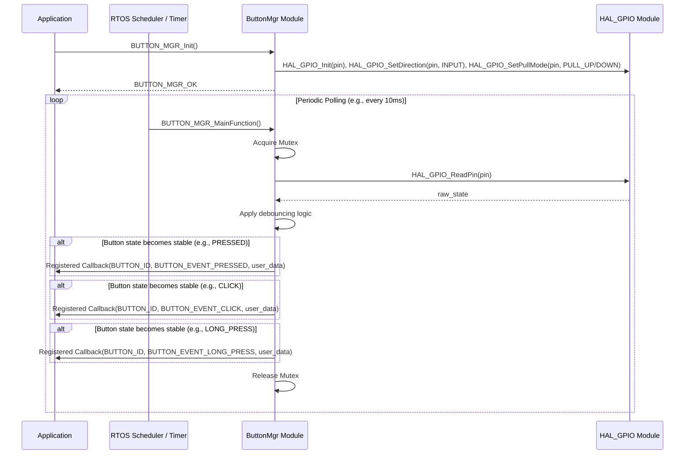

# **Detailed Design Document: ButtonMgr Component**

## **1. Introduction**

### **1.1. Purpose**

This document details the design of the **Button Manager (ButtonMgr)** component. Its primary purpose is to provide a robust and debounced interface for handling individual physical button inputs, abstracting the underlying GPIO hardware. It detects various input events (press, release, click, long press) and notifies higher-level application modules via a callback mechanism.

### **1.2. Scope**

The scope of this document covers the architecture, functional behavior, interfaces, dependencies, and resource considerations for the ButtonMgr module. It details how it manages individual button input states, performs debouncing, detects specific events, and provides a generic interface for event notification. The module interacts with lower-level GPIO drivers in the Hardware Abstraction Layer (HAL).

### **1.3. References**

* Software Architecture Document (SAD) - Environmental Monitoring & Control System (Final Version)  
* Detailed Design Document: HAL_GPIO (Hypothetical, as the actual HAL is platform-specific)  
* FreeRTOS Documentation (for mutex and timing functions)

## **2. Button Manager (ButtonMgr) Component Design**

### **2.1. Overview**

The ButtonMgr component is responsible for managing individual push-buttons. It handles the complexities of button debouncing, which prevents multiple rapid detections from a single physical press due to switch bounce. It also identifies different types of button interactions, such as simple presses, releases, clicks (short press-release cycles), and long presses.

### **2.2. Architecture**

The ButtonMgr follows a layered architecture, sitting above the GPIO HAL. It consists of:

* **Public Interface (button_mgr.h):** Defines the API for initialization, de-initialization, callback registration, and state querying.  
* **Configuration (button_mgr_cfg.h, button_mgr_cfg.c):** Contains compile-time configurable parameters for each button, such as GPIO pin, active level, debounce time, and long press duration.  
* **Implementation (button_mgr.c):** Contains the core logic for reading GPIOs, debouncing, state machine management, and invoking callbacks.  
* **Dependencies:** Relies on a GPIO HAL for direct hardware interaction and FreeRTOS for mutexes and system timing.

#### **2.2.1. Internal State Machine for Each Button**

Each button managed by the ButtonMgr maintains its own internal state to track:

* current_raw_state: The immediate, unfiltered reading from the GPIO.  
* debounced_state: The stable, debounced state of the button.  
* last_state_change_time: Timestamp of the last raw state change, used for debouncing.  
* press_start_time: Timestamp when the button was debouncedly pressed, used for click/long press detection.  
* long_press_event_fired: Flag to ensure the long press event is triggered only once per press cycle.

### **2.3. Functional Behavior**

The ButtonMgr operates on a polling basis, with its BUTTON_MGR_MainFunction being called periodically (e.g., every 10ms as defined by BUTTON_MGR_POLLING_INTERVAL_MS).

1. **Initialization (BUTTON_MGR_Init):**  
   * Creates a FreeRTOS mutex to protect shared data.  
   * Initializes each configured button's GPIO pin via the HAL_GPIO_Init, HAL_GPIO_SetDirection, and HAL_GPIO_SetPullMode functions.  
   * Reads the initial raw state and sets up initial runtime data for each button.  
2. **Periodic Processing (BUTTON_MGR_MainFunction):**  
   * Acquires the mutex (non-blocking).  
   * For each configured button:  
     * Reads the current raw state from the GPIO using HAL_GPIO_ReadPin.  
     * Compares the raw state with the current_raw_state to detect changes.  
     * If the raw state has been stable for debounce_time_ms (configured per button), the debounced_state is updated.  
     * **Event Detection:**  
       * **PRESSED:** If debounced_state transitions from false to true, the BUTTON_EVENT_PRESSED callback is invoked. press_start_time is recorded.  
       * **RELEASED:** If debounced_state transitions from true to false, the BUTTON_EVENT_RELEASED callback is invoked.  
       * **CLICK:** If BUTTON_EVENT_RELEASED occurs and the duration of the press (current_time_ms - press_start_time) is less than long_press_time_ms and long_press_event_fired is false, the BUTTON_EVENT_CLICK callback is invoked.  
       * **LONG_PRESS:** If debounced_state is true, long_press_event_fired is false, and the press duration exceeds long_press_time_ms, the BUTTON_EVENT_LONG_PRESS callback is invoked, and long_press_event_fired is set to true.  
   * Releases the mutex.  
3. **Callback Registration (BUTTON_MGR_RegisterCallback):** Allows application modules to register a function to be called when specific button events occur.  
4. **State Query (BUTTON_MGR_GetButtonState):** Provides the current debounced state of a specified button.  
5. **De-initialization (BUTTON_MGR_DeInit):** Cleans up resources, including deleting the mutex.

### **2.4. Interfaces**

#### **2.4.1. Provided Interfaces (button_mgr.h)**

* BUTTON_MGR_Status_t BUTTON_MGR_Init(void): Initializes the module.  
* BUTTON_MGR_Status_t BUTTON_MGR_DeInit(void): De-initializes the module.  
* BUTTON_MGR_Status_t BUTTON_MGR_RegisterCallback(BUTTON_ID_t button_id, BUTTON_MGR_Callback_t callback, void *user_data): Registers an event callback.  
* BUTTON_MGR_Status_t BUTTON_MGR_GetButtonState(BUTTON_ID_t button_id, bool *is_pressed): Gets the current debounced state of a button.  
* void BUTTON_MGR_MainFunction(void): Main processing function, to be called periodically.

#### **2.4.2. Required Interfaces (from HAL_GPIO)**

The button_mgr.c implementation requires the following hypothetical HAL GPIO functions:

* esp_err_t HAL_GPIO_Init(int gpio_pin): Initializes a specific GPIO pin.  
* esp_err_t HAL_GPIO_SetDirection(int gpio_pin, HAL_GPIO_Direction_t dir): Sets the direction (input/output) of a GPIO pin.  
* esp_err_t HAL_GPIO_SetPullMode(int gpio_pin, HAL_GPIO_PullMode_t pull_mode): Configures internal pull-up/pull-down resistors.  
* bool HAL_GPIO_ReadPin(int gpio_pin): Reads the digital state of a GPIO pin.

#### **2.4.3. Callbacks**

* typedef void (*BUTTON_MGR_Callback_t)(BUTTON_ID_t button_id, BUTTON_EVENT_t event_type, void *user_data): Function pointer type for button event callbacks.

### **2.5. Dependencies**

* **HAL_GPIO:** Direct dependency for hardware interaction.  
* **FreeRTOS:** Used for mutex (SemaphoreHandle_t) for thread safety and system tick count (xTaskGetTickCount) for timing.  
* **ESP-IDF Logging (esp_log.h):** Used for logging debug and error messages. This can be replaced with any other logging framework.

### **2.6. Resource Considerations**

* **Memory:**  
  * g_button_runtime_data: An array of BUTTON_MGR_ButtonRuntimeData_t structures, one for each BUTTON_ID_MAX. Memory usage is proportional to the number of configured buttons.  
  * g_button_mgr_mutex: One FreeRTOS mutex object.  
* **CPU:** The BUTTON_MGR_MainFunction is a polling function. Its CPU usage depends on the BUTTON_MGR_POLLING_INTERVAL_MS and the number of configured buttons. A shorter interval or more buttons will increase CPU load.  
* **Interrupts:** This design uses polling and does not directly rely on GPIO interrupts, simplifying the implementation but requiring periodic execution of BUTTON_MGR_MainFunction.

## **3. Interaction and Flow**

### **3.1. Sequence Diagram: Button Event Detection**

The following sequence diagram illustrates the typical flow of events from system initialization to the detection and notification of a button press.

## **4. Error Handling**

The ButtonMgr module implements robust error handling to ensure system stability.

* **Initialization Errors:** If BUTTON_MGR_Init fails (e.g., due to HAL_GPIO initialization errors, mutex creation failure), it will return an appropriate BUTTON_MGR_Status_t error code and log the issue using ESP_LOGE. The module will not be operational.  
* **Invalid Parameters:** Public API functions (e.g., BUTTON_MGR_RegisterCallback, BUTTON_MGR_GetButtonState) will validate input parameters (e.g., NULL pointers, invalid button_id). Invalid parameters will result in an error status return and logging.  
* **Mutex Handling:** The BUTTON_MGR_MainFunction attempts to acquire the mutex with a short timeout. If the mutex cannot be acquired, it will log a warning and skip the current processing cycle to avoid blocking the scheduler, ensuring the system remains responsive.  
* **HAL_GPIO Errors:** While HAL_GPIO_ReadPin is typically non-failing for reading, any potential errors from HAL_GPIO_Init, HAL_GPIO_SetDirection, or HAL_GPIO_SetPullMode during initialization are handled and propagated as BUTTON_MGR_Status_t errors.

## **5. Configuration**

The ButtonMgr module is highly configurable at compile-time to adapt to various hardware setups.

* **BUTTON_MGR_POLLING_INTERVAL_MS:** Defines how frequently BUTTON_MGR_MainFunction should be called (in milliseconds). A smaller value increases responsiveness but also CPU load.  
* **BUTTON_ID_MAX:** The maximum number of individual buttons the system will manage. This determines the size of internal data structures.  
* **BUTTON_MGR_ButtonConfig_t Array:** An array (typically in button_mgr_cfg.c) where each element defines a button's specific characteristics:  
  * gpio_pin: The GPIO pin number connected to the button.  
  * active_level: The electrical level (e.g., 0 for active low, 1 for active high) when the button is pressed.  
  * debounce_time_ms: The duration (in milliseconds) for which the button's raw state must be stable before its debounced state is updated.  
  * long_press_time_ms: The duration (in milliseconds) for which the button must be held down to trigger a BUTTON_EVENT_LONG_PRESS.

Example configuration in button_mgr_cfg.c:
```c
// Example configuration for two buttons  
const BUTTON_MGR_ButtonConfig_t g_button_configs[] = {  
    [BUTTON_ID_POWER] = {  
        .gpio_pin = 23,  
        .active_level = 0, // Active low (pulled up externally or internally)  
        .debounce_time_ms = 50,  
        .long_press_time_ms = 2000, // 2 seconds  
    },  
    [BUTTON_ID_MODE] = {  
        .gpio_pin = 22,  
        .active_level = 0,  
        .debounce_time_ms = 75,  
        .long_press_time_ms = 3000, // 3 seconds  
    },  
};
```
## **6. Testing**

### **6.1. Unit Testing**

* **Objective:** Verify the correctness of individual functions and logic blocks within button_mgr.c in isolation.  
* **Methodology:** Use a mocking framework (e.g., Google Mock, CMock) to simulate the behavior of HAL_GPIO functions and FreeRTOS API calls (xTaskGetTickCount, mutex functions).  
* **Test Cases:**  
  * **Debouncing:** Simulate noisy GPIO signals and verify that the debounced_state only changes after the debounce_time_ms.  
  * **Event Detection:**  
    * Test simple press-release cycles to trigger PRESSED and RELEASED events.  
    * Test short press-release cycles to trigger CLICK events.  
    * Test holding the button down for longer than long_press_time_ms to trigger LONG_PRESS (only once).  
    * Test releasing after a long press to ensure RELEASED is still triggered.  
  * **Callback Invocation:** Verify that the registered callback function is called with the correct BUTTON_ID_t and BUTTON_EVENT_t.  
  * **State Query:** Verify BUTTON_MGR_GetButtonState returns the correct debounced state.  
  * **Mutex Protection:** Test concurrent access scenarios (if applicable in a multi-threaded test environment) to ensure data integrity.  
  * **Error Conditions:** Test BUTTON_MGR_Init with simulated HAL errors, and API calls with invalid parameters.

### **6.2. Integration Testing**

* **Objective:** Verify the correct interaction between ButtonMgr, HAL_GPIO, and FreeRTOS.  
* **Methodology:** Run tests on a target board or a hardware-in-the-loop (HIL) setup.  
* **Test Cases:**  
  * **Hardware Interaction:** Connect physical buttons and verify that BUTTON_MGR_MainFunction correctly reads their states through HAL_GPIO.  
  * **Timing Accuracy:** Verify that debounce and long press timings are accurate on the target hardware.  
  * **Multi-Button Operation:** Test multiple buttons simultaneously to ensure no interference or unexpected behavior.  
  * **Concurrency:** Verify that ButtonMgr operates correctly when other FreeRTOS tasks are running.

### **6.3. System Testing**

* **Objective:** Verify the end-to-end functionality of button inputs within the complete system context.  
* **Methodology:** Perform tests on the fully integrated system, interacting with the application layer.  
* **Test Cases:**  
  * **Application Response:** Verify that button presses (click, long press) trigger the expected actions in the application (e.g., menu navigation, power on/off, mode changes).  
  * **User Experience:** Assess the responsiveness and feel of the buttons from a user's perspective.  
  * **Fault Injection:** Introduce scenarios like rapid, erratic button presses or holding buttons down during system boot-up to verify robustness.  
  * **Long-Term Operation:** Run the system with continuous button interaction for extended periods to check for stability, memory leaks, or performance degradation.

## **7. Future Enhancements**

* **Interrupt-Driven Input:** Currently, ButtonMgr relies on polling. For systems requiring lower power consumption or faster response to button presses, an enhancement would be to implement GPIO interrupt handlers in the HAL, which would then notify the ButtonMgr (e.g., via a FreeRTOS queue or semaphore) to process the event, reducing CPU load.  
* **Dynamic Configuration:** Allow changing debounce times or long press durations at runtime via a dedicated API, rather than only compile-time configuration.  
* **Multiple Callbacks per Button:** Enable multiple application modules to register their own callbacks for the same button, allowing for more flexible event handling.  
* **Button Grouping:** Add support for detecting combinations of button presses (e.g., "press button A and button B simultaneously").  
* **Power-Saving Modes:** Integrate with system power management to disable button polling or GPIO interrupts during deep sleep modes and re-enable them upon wake-up.
