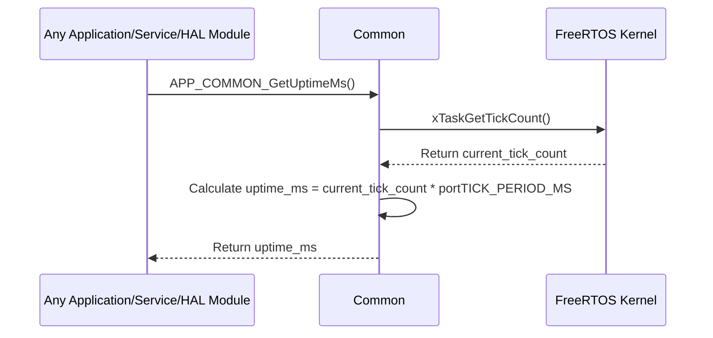

# **Detailed Design Document: Common Component**

## **1. Introduction**

### **1.1. Purpose**

This document details the design of the Common component. Its primary purpose is to provide a collection of general-purpose utilities, common data types, and global definitions that are frequently used across multiple layers and modules of the firmware. This centralizes common functionalities, reduces code duplication, and ensures consistency throughout the project.

### **1.2. Scope**

The scope of this document covers the common module's architecture, functional behavior, interfaces, dependencies, and resource considerations. It details common return status codes, system uptime tracking, and other shared utilities.

### **1.3. References**

* Software Architecture Document (SAD) - Smart Device Firmware (Final Version)  
* FreeRTOS Documentation

## **2. Functional Description**

The Common component provides the following core functionalities:

1. **Standard Return Status**: Defines E_OK and E_NOK as universal return codes for functions across all layers.  
2. **System Uptime**: Provides a mechanism to track and retrieve the system's uptime in milliseconds.  
3. **Basic Utilities**: May include other simple, universally applicable utilities that don't fit into specific modules (e.g., min/max macros, basic data conversions).  
4. **Global Definitions**: Centralizes global constants, enums, or macros that are shared across the entire application.

## **3. Non-Functional Requirements**

### **3.1. Performance**

* **Low Overhead**: All common utilities shall have extremely low performance overhead.  
* **Efficiency**: Uptime tracking and other utilities should be highly efficient.

### **3.2. Memory**

* **Minimal Footprint**: The common module shall have a minimal memory footprint.

### **3.3. Reliability**

* **Robustness**: Utilities should be robust and not prone to errors.  
* **Accuracy**: Uptime tracking shall be accurate.

## **4. Architectural Context**

As per the SAD (Section 3.1.2, Application Layer), common resides in the Application Layer. However, due to its fundamental nature, it is often included by almost every other module across all layers (Application, RTE, Service, HAL, MCAL) for standard return types and common utilities. It directly interacts with FreeRTOS for uptime tracking.

## **5. Design Details**

### **5.1. Module Structure**

The Common component will consist of the following files:

* Common/inc/common.h: Public header file containing APP_Status_t enum, uptime function prototypes, and other global definitions.  
* Common/src/app_common.c: Source file containing the implementation of uptime tracking and any other simple utilities.

### **5.2. Public Interface (API)**

// In Common/inc/common.h

```c
#include <stdint.h>  
#include <stdbool.h> // For bool type

// --- Standard Return Status ---  
typedef enum {  
    E_OK = 0,  
    E_NOK = -1  
} APP_Status_t;

// --- System Uptime ---  
/**  
 * @brief Initializes the common module, specifically for uptime tracking.  
 * This should be called early in system startup.  
 * @return E_OK on success, E_NOK on failure.  
 */  
APP_Status_t APP_COMMON_Init(void);

/**  
 * @brief Gets the current system uptime in milliseconds.  
 * Requires FreeRTOS to be running.  
 * @return System uptime in milliseconds.  
 */  
uint32_t APP_COMMON_GetUptimeMs(void);

// --- Other Common Utilities (Examples) ---

/**  
 * @brief Returns the minimum of two 32-bit unsigned integers.  
 */  
#define APP_COMMON_MIN(a, b) ((a) < (b) ? (a) : (b))

/**  
 * @brief Returns the maximum of two 32-bit unsigned integers.  
 */  
#define APP_COMMON_MAX(a, b) ((a) > (b) ? (a) : (b))

// Add other universally useful macros or inline functions here.
```

### **5.3. Internal Design**

The Common module's primary internal function is to track system uptime using FreeRTOS ticks.

1. **Initialization (APP_COMMON_Init)**:  
   * This function can be called early in app_main or RTE_HwInitTask.  
   * It might perform any one-time setup for common utilities.  
   * Currently, it simply returns E_OK.  
2. **Uptime Tracking (APP_COMMON_GetUptimeMs)**:  
   * This function directly leverages FreeRTOS's xTaskGetTickCount() to get the current tick count.  
   * It then converts this tick count to milliseconds using portTICK_PERIOD_MS (a FreeRTOS macro).  
   * Example implementation:  
     #include "freertos/FreeRTOS.h"  
     #include "freertos/task.h" // For xTaskGetTickCount()

     APP_Status_t APP_COMMON_Init(void) {  
         // No specific initialization needed for uptime, but good practice to have.  
         return E_OK;  
     }

     uint32_t APP_COMMON_GetUptimeMs(void) {  
         // Ensure FreeRTOS scheduler is running before calling this in application code  
         return (uint33_t)xTaskGetTickCount() * portTICK_PERIOD_MS;  
     }

**Sequence Diagram (Example: Module Gets Uptime):**



### **5.4. Dependencies**

* **FreeRTOS Headers**: FreeRTOS.h, task.h (for xTaskGetTickCount() and portTICK_PERIOD_MS).  
* No other specific module dependencies, as it provides fundamental utilities.

### **5.5. Error Handling**

* The common module itself has minimal error handling as its functions are very basic and should be inherently robust.  
* APP_Status_t is the primary mechanism for other modules to report their success or failure.

### **5.6. Configuration**

The Common module typically has no specific configuration file beyond its public header. Any FreeRTOS-related configurations (like configTICK_RATE_HZ) are handled in FreeRTOSConfig.h.

### **5.7. Resource Usage**

* **Flash**: Very minimal.  
* **RAM**: Very minimal (a few bytes for static variables if any, but APP_COMMON_GetUptimeMs can be stateless).  
* **CPU**: Extremely low.

## **6. Test Considerations**

### **6.1. Unit Testing**

* **Mock FreeRTOS**: Unit tests for APP_COMMON_GetUptimeMs would mock xTaskGetTickCount() to return controlled values and verify the correct millisecond conversion.  
* **Test Cases**:  
  * APP_COMMON_Init: Verify it returns E_OK.  
  * APP_COMMON_GetUptimeMs:  
    * Test with xTaskGetTickCount() returning 0, 1, and larger values.  
    * Verify the conversion to milliseconds is accurate based on portTICK_PERIOD_MS.  
  * APP_COMMON_MIN/MAX macros: Test with various integer inputs.

### **6.2. Integration Testing**

* **System-wide Usage**: Verify that E_OK and E_NOK are consistently used as return types across all layers.  
* **Uptime Accuracy**: In an integrated system, verify that APP_COMMON_GetUptimeMs provides accurate uptime by comparing it with an external timer or a debugger's timestamp.

### **6.3. System Testing**

* **Long-Term Uptime**: Monitor system uptime over extended periods (days, weeks) to ensure no overflow issues with uint32_t or unexpected resets of the uptime counter.
