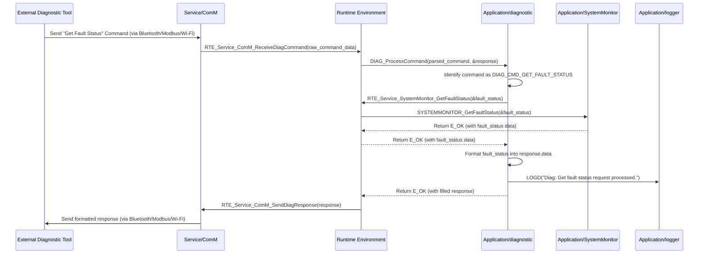

# **Detailed Design Document: Diag (Diagnostic) Component**

## **1. Introduction**

### **1.1. Purpose**

This document details the design of the Diag component. Its primary purpose is to provide the **external interface for system diagnostics and maintenance**. It is responsible for retrieving fault information from SystemMonitor, exposing it to external interfaces (Bluetooth, Wi-Fi, Modbus), handling external configuration commands, initiating OTA updates, running specific test cases, and managing system reboots. It includes logic for parsing incoming commands.

### **1.2. Scope**

The scope of this document covers the Diag module's architecture, functional behavior, interfaces, dependencies, and resource considerations. It details how Diag interacts with SystemMonitor for fault data, systemMgr for configuration and control, and ComM for external communication.

### **1.3. References**

* Software Architecture Document (SAD) - Environmental Monitoring & Control System (Final Version)  
* Detailed Design Document: RTE  
* Detailed Design Document: SystemMonitor  
* Detailed Design Document: systemMgr  
* Detailed Design Document: ComM  
* Detailed Design Document: OTA (conceptual, as it's a Service Layer module)  
* Detailed Design Document: Power (conceptual, as it's an Application Layer module)

## **2. Functional Description**

The Diag component provides the following core functionalities:

1. **Initialization (Diag_Init)**: Initialize internal data structures, command handlers, and prepare for receiving diagnostic requests.  
2. **Process Incoming Commands (DIAG_ProcessCommand)**: This is the central function for handling diagnostic and configuration commands received from external interfaces (via ComM). It parses the command, validates it, and dispatches it to the appropriate internal handler function.  
3. **Fault Retrieval and Reporting**: Query SystemMonitor for active and historical faults and format this information for external reporting via ComM.  
4. **Configuration Management Interface**: Act as the gateway for external entities to set system configurations (e.g., operational temperature ranges, schedules). These commands are then routed to systemMgr via RTE services.  
5. **OTA Update Initiation**: Receive commands to initiate Over-the-Air (OTA) firmware updates. It will check power readiness with systemMgr (which queries power module) before initiating the OTA service.  
6. **Self-Test Execution**: Receive commands to run specific diagnostic test cases to verify system functionality (e.g., "test fan motor," "check sensor calibration"). These tests might involve calling other application modules via RTE services.  
7. **System Reboot/Bank Selection**: Receive commands to trigger a system reboot, potentially to a specific firmware bank (e.g., factory bank for recovery).  
8. **Response Generation**: Generate appropriate responses to incoming commands, indicating success, failure, or returning requested data.

## **3. Non-Functional Requirements**

### **3.1. Performance**

* **Responsiveness**: Command processing shall be highly responsive, with minimal latency for critical diagnostic operations.  
* **Throughput**: Capable of handling a reasonable rate of incoming diagnostic commands without degrading system performance.

### **3.2. Memory**

* **Minimal Footprint**: The Diag module shall have a minimal memory footprint for its internal command tables and temporary data buffers.  
* **Command Buffer**: Sufficient buffer space for parsing incoming commands.

### **3.3. Reliability**

* **Robustness**: The module shall be robust against malformed commands or unexpected data, preventing crashes or unintended behavior.  
* **Security**: Must enforce security measures (e.g., authentication, authorization) for sensitive commands (covered by Security module and ComM integration).  
* **Fail-Safe Integration**: Must ensure that commands related to system state changes (e.g., reboot, OTA) are handled safely, especially considering power constraints.

## **4. Architectural Context**

As per the SAD (Section 3.1.2, Application Layer), Diag resides in the Application Layer. It acts as the external diagnostics interface, interacting with SystemMonitor for fault data, systemMgr for configuration and control, and ComM for communication. It does not run its own periodic task but is invoked by ComM (via RTE) when a diagnostic command is received.

## **5. Design Details**

### **5.1. Module Structure**

The Diag component will consist of the following files:

* Application/diagnostic/inc/diagnostic.h: Public header file containing function prototypes, data types for commands, and responses.  
* Application/diagnostic/src/diagnostic.c: Source file containing the implementation of Diag functions, command parsing, and dispatch logic.  
* Application/diagnostic/cfg/diagnostic_cfg.h: Configuration header for supported commands, test cases, and related parameters.

### **5.2. Public Interface (API)**

// In Application/diagnostic/inc/diagnostic.h
```c
#include "Application/common/inc/common.h" // For APP_Status_t  
#include <stdint.h>   // For uint32_t, uint8_t  
#include <stdbool.h>  // For bool

// --- Diagnostic Command IDs ---  
typedef enum {  
    DIAG_CMD_GET_FAULT_STATUS = 0x01,  
    DIAG_CMD_CLEAR_FAULT_HISTORY = 0x02,  
    DIAG_CMD_SET_OP_TEMP_RANGE = 0x03,  
    DIAG_CMD_INITIATE_OTA = 0x04,  
    DIAG_CMD_RUN_SELF_TEST = 0x05,  
    DIAG_CMD_REBOOT_SYSTEM = 0x06,  
    DIAG_CMD_GET_SYSTEM_INFO = 0x07,  
    // Add more commands as needed  
    DIAG_CMD_MAX_ID  
} Diag_CommandId_t;

// --- Diagnostic Response Codes ---  
typedef enum {  
    DIAG_RESP_OK = 0x00,  
    DIAG_RESP_INVALID_COMMAND = 0x01,  
    DIAG_RESP_INVALID_PARAM = 0x02,  
    DIAG_RESP_NOT_ALLOWED_IN_MODE = 0x03,  
    DIAG_RESP_POWER_INSUFFICIENT = 0x04,  
    DIAG_RESP_INTERNAL_ERROR = 0x05,  
    // Add more response codes  
} Diag_ResponseCode_t;

// Structure for a generic diagnostic command  
typedef struct {  
    Diag_CommandId_t command_id;  
    uint8_t          payload_len;  
    uint8_t          payload[DIAG_MAX_COMMAND_PAYLOAD_SIZE]; // Max size defined in config  
} Diag_Command_t;

// Structure for a generic diagnostic response  
typedef struct {  
    Diag_CommandId_t  command_id; // Echo back the command ID  
    Diag_ResponseCode_t response_code;  
    uint8_t           data_len;  
    uint8_t           data[DIAG_MAX_RESPONSE_DATA_SIZE]; // Max size defined in config  
} Diag_Response_t;

/**  
 * @brief Initializes the Diag module.  
 * @return E_OK on success, E_NOK on failure.  
 */  
APP_Status_t Diag_Init(void);

/**  
 * @brief Processes an incoming diagnostic command.  
 * This function is called by ComM (via RTE) when a diagnostic command is received.  
 * It parses the command, dispatches it, and generates a response.  
 * @param command Pointer to the received command structure.  
 * @param response Pointer to the response structure to fill.  
 * @return E_OK on successful processing, E_NOK if processing fails.  
 */  
APP_Status_t DIAG_ProcessCommand(const Diag_Command_t *command, Diag_Response_t *response);

// --- Internal Helper Function Prototypes (for clarity, not strictly public API) ---  
// These would be static functions in diagnostic.c, but listed here for design clarity.  
static APP_Status_t DiagMgr_get_fault_status(Diag_Response_t *response);  
static APP_Status_t DiagMgr_clear_fault_history(Diag_Response_t *response);  
static APP_Status_t DiagMgr_set_op_temp_range(const uint8_t *payload, uint8_t payload_len, Diag_Response_t *response);  
static APP_Status_t DiagMgr_initiate_ota(Diag_Response_t *response);  
static APP_Status_t DiagMgr_run_self_test(const uint8_t *payload, uint8_t payload_len, Diag_Response_t *response);  
static APP_Status_t DiagMgr_reboot_system(Diag_Response_t *response);  
static APP_Status_t DiagMgr_get_system_info(Diag_Response_t *response);
```
### **5.3. Internal Design**

The Diag module will implement a command dispatch table or a series of if-else if statements to process incoming commands. It will rely heavily on RTE services to interact with other modules.

1. **Initialization (Diag_Init)**:  
   ```c
   * Initialize any internal state (e.g., command counters, test flags).  
   * s_is_initialized = true;.  
   * Return E_OK.  
   ```
2. **Process Incoming Commands (DIAG_ProcessCommand)**:  
   * If !s_is_initialized, return E_NOK.  
   * Validate command and response pointers.  
   * Populate response->command_id = command->command_id;.  
   * Use a switch statement on command->command_id:  
     * **DIAG_CMD_GET_FAULT_STATUS**: Call DiagMgr_get_fault_status(response).  
     * **DIAG_CMD_CLEAR_FAULT_HISTORY**: Call DiagMgr_clear_fault_history(response).  
     * **DIAG_CMD_SET_OP_TEMP_RANGE**: Call DiagMgr_set_op_temp_range(command->payload, command->payload_len, response).  
     * **DIAG_CMD_INITIATE_OTA**: Call DiagMgr_initiate_ota(response).  
     * **DIAG_CMD_RUN_SELF_TEST**: Call DiagMgr_run_self_test(command->payload, command->payload_len, response).  
     * **DIAG_CMD_REBOOT_SYSTEM**: Call DiagMgr_reboot_system(response).  
     * **DIAG_CMD_GET_SYSTEM_INFO**: Call DiagMgr_get_system_info(response).  
     * **Default**: Set response->response_code = DIAG_RESP_INVALID_COMMAND; and log a warning.  
   * Return E_OK (or E_NOK if the command processing itself failed critically).  
3. **Command Handlers (Internal Static Functions)**:  
   * **DiagMgr_get_fault_status(Diag_Response_t *response)**:  
     * Declare SystemMonitor_FaultStatus_t fault_status;.  
     * Call RTE_Service_SystemMonitor_GetFaultStatus(&fault_status);.  
     * Format fault_status data into response->data.  
     * Set response->response_code = DIAG_RESP_OK;.  
     * Log LOGD("Diag: Get fault status request processed.");.  
   * **DiagMgr_clear_fault_history(Diag_Response_t *response)**:  
     * Call RTE_Service_SystemMonitor_ClearFaultHistory(); (assuming SystemMonitor provides this).  
     * Set response->response_code = DIAG_RESP_OK;.  
     * Log LOGI("Diag: Fault history cleared.");.  
   * **DiagMgr_set_op_temp_range(const uint8_t *payload, uint8_t payload_len, Diag_Response_t *response)**:  
     * Validate payload_len and parse min_temp and max_temp from payload.  
     * Call RTE_Service_SYS_MGR_SetOperationalTemperature(min_temp, max_temp);.  
     * Set response->response_code = DIAG_RESP_OK; or DIAG_RESP_INVALID_PARAM if validation fails.  
     * Log LOGD("Diag: Set operational temp range to %d-%d.", min_temp, max_temp);.  
   * **DiagMgr_initiate_ota(Diag_Response_t *response)**:  
     * **Check Power Readiness**: Call RTE_Service_SYS_MGR_GetPowerStatus(&power_status); (assuming systemMgr exposes this from power module).  
     * If power_status indicates insufficient power (e.g., POWER_STATUS_LOW_BATTERY or POWER_STATUS_UNSTABLE):  
       * Set response->response_code = DIAG_RESP_POWER_INSUFFICIENT;.  
       * Log LOGW("Diag: OTA initiation blocked due to insufficient power.");.  
     * Else:  
       * Call RTE_Service_OTA_InitiateUpdate();.  
       * Set response->response_code = DIAG_RESP_OK;.  
       * Log LOGI("Diag: OTA update initiated.");.  
   * **DiagMgr_run_self_test(const uint8_t *payload, uint8_t payload_len, Diag_Response_t *response)**:  
     * Parse test_id from payload.  
     * Use a switch statement on test_id:  
       * **Test Fan**: Call RTE_Service_FAN_RunSelfTest(); (assuming FanCtrl provides this).  
       * **Test Humidity Sensor**: Call RTE_Service_HUMIDITY_RunSelfTest();.  
       * **Default**: Set response->response_code = DIAG_RESP_INVALID_PARAM;.  
     * Set response->response_code = DIAG_RESP_OK; if test initiated successfully.  
     * Log LOGD("Diag: Self-test %d initiated.", test_id);.  
   * **DiagMgr_reboot_system(Diag_Response_t *response)**:  
     * Call RTE_Service_OS_Reboot(REBOOT_MODE_NORMAL); (assuming os module provides this).  
     * Set response->response_code = DIAG_RESP_OK; (though system will reboot before response is sent).  
     * Log LOGW("Diag: System reboot initiated by diagnostic command.");.  
   * **DiagMgr_get_system_info(Diag_Response_t *response)**:  
     * Retrieve system version, build date, uptime, etc., from systemMgr or common utilities via RTE services.  
     * Format data into response->data.  
     * Set response->response_code = DIAG_RESP_OK;.  
     * Log LOGD("Diag: System info requested.");.

**Sequence Diagram (Example: External Tool requests Fault Status):**

### **5.4. Dependencies**

* Application/common/inc/common.h: For APP_Status_t.  
* Application/logger/inc/logger.h: For logging diagnostic activities.  
* Rte/inc/Rte.h: For all necessary RTE services to interact with SystemMonitor, systemMgr, OTA, OS, and other application modules (e.g., fan, temperature) for self-tests.  
* Application/SystemMonitor/inc/system_monitor.h: For SystemMonitor_FaultStatus_t and fault IDs.  
* Application/systemMgr/inc/sys_mgr.h: For systemMgr's operational parameters and power status.  
* Service/ota/inc/ota.h: For OTA_InitiateUpdate() (via RTE service).  
* Service/os/inc/os.h: For OS_Reboot() (via RTE service).

### **5.5. Error Handling**

* **Input Validation**: DIAG_ProcessCommand will validate the incoming command structure and its payload_len. Individual command handlers will validate their specific payload parameters.  
* **Response Codes**: All responses will include a Diag_ResponseCode_t to indicate success or specific types of failure (e.g., INVALID_COMMAND, INVALID_PARAM, POWER_INSUFFICIENT).  
* **RTE Error Propagation**: Errors returned by RTE services (e.g., from SystemMonitor, systemMgr) will be checked, and Diag will return an appropriate E_NOK or Diag_ResponseCode_t to the caller.  
* **Security**: While Diag acts as the interface, the actual authentication and authorization for commands will be handled by the ComM and Security layers, ensuring that DIAG_ProcessCommand is only called with authenticated requests. Diag might still return DIAG_RESP_NOT_ALLOWED_IN_MODE if a command is valid but not permitted in the current system mode (e.g., manual mode prevents certain auto-config commands).  
* **Power Check for OTA**: Explicitly checks with systemMgr (which gets info from power) for sufficient power before initiating an OTA update, preventing bricking.

### **5.6. Configuration**

The Application/diagnostic/cfg/diagnostic_cfg.h file will contain:
```c
/* DIAG_MAX_COMMAND_PAYLOAD_SIZE: Maximum size of the payload for a diagnostic command.  
* DIAG_MAX_RESPONSE_DATA_SIZE: Maximum size of the data field in a diagnostic response.  
* DIAG_SUPPORTED_SELF_TESTS_COUNT: Number of self-test functions available.  
* DIAG_SELF_TEST_ID_FAN, DIAG_SELF_TEST_ID_HUMIDITY_SENSOR, etc.: Enums or macros for specific self-test IDs.*/

// Example: Application/diagnostic/cfg/diagnostic_cfg.h  
#ifndef DIAGNOSTIC_CFG_H  
#define DIAGNOSTIC_CFG_H

// Max payload and response data sizes for diagnostic commands/responses  
#define DIAG_MAX_COMMAND_PAYLOAD_SIZE   64  
#define DIAG_MAX_RESPONSE_DATA_SIZE     128

// Self-test IDs  
typedef enum {  
    DIAG_SELF_TEST_ID_NONE = 0,  
    DIAG_SELF_TEST_ID_FAN,  
    DIAG_SELF_TEST_ID_HEATER,  
    DIAG_SELF_TEST_ID_TEMP_SENSOR,  
    DIAG_SELF_TEST_ID_HUMIDITY_SENSOR,  
    // Add more self-test IDs as needed  
    DIAG_SUPPORTED_SELF_TESTS_COUNT  
} Diag_SelfTestId_t;

#endif // DIAGNOSTIC_CFG_H
```
### **5.7. Resource Usage**

* **Flash**: Moderate, for command parsing logic, dispatch table, and individual command handlers.  
* **RAM**: Low, for command/response buffers and internal state.  
* **CPU**: Low for basic command processing. Can be higher during self-test execution, depending on the complexity of the tests.

## **6. Test Considerations**

### **6.1. Unit Testing**

* **Mock Dependencies**: Unit tests for Diag will mock all RTE service calls (RTE_Service_SystemMonitor_GetFaultStatus(), RTE_Service_SYS_MGR_SetOperationalTemperature(), etc.), LOGGER_Log().  
* **Test Cases**:  
  * Diag_Init: Verify basic initialization.  
  * DIAG_ProcessCommand:  
    * Test with valid commands and payloads for all supported command IDs. Verify correct internal handler calls and response_code = DIAG_RESP_OK.  
    * Test with invalid command IDs (verify DIAG_RESP_INVALID_COMMAND).  
    * Test with valid command IDs but invalid/malformed payloads (verify DIAG_RESP_INVALID_PARAM).  
    * Test DIAG_CMD_INITIATE_OTA when systemMgr (mocked) reports insufficient power (verify DIAG_RESP_POWER_INSUFFICIENT).  
    * Test DIAG_CMD_REBOOT_SYSTEM (verify RTE_Service_OS_Reboot() is called).  
    * Test DIAG_CMD_RUN_SELF_TEST for various test_ids, verifying calls to appropriate RTE services for other modules.  
    * Verify logging for different scenarios.  
  * Individual DiagMgr_... functions: Test their specific logic in isolation, including parameter validation and interaction with mocked RTE services.

### **6.2. Integration Testing**

* **Diag-ComM Integration**: Verify that ComM correctly receives external diagnostic commands and passes them to Diag via RTE, and that Diag's responses are correctly sent back via ComM.  
* **Diag-SystemMonitor Integration**: Verify Diag can correctly query and retrieve fault status from SystemMonitor.  
* **Diag-systemMgr Integration**: Verify Diag can correctly send configuration commands to systemMgr and that systemMgr responds as expected.  
* **Diag-OTA Integration**: Verify Diag can initiate OTA updates, including the power readiness check.  
* **Self-Test Execution**: Trigger self-tests and verify that the target modules (e.g., fan, temperature) execute their test routines.  
* **Fault Injection**: Introduce faults (e.g., mock SystemMonitor to return an error) and verify Diag's error handling and response generation.

### **6.3. System Testing**

* **End-to-End Diagnostic Flow**: Use an external diagnostic tool (e.g., a custom PC application, Modbus master, BLE client) to send various commands and verify the system's response, including fault retrieval, configuration changes, and self-test execution.  
* **OTA Process**: Perform a full OTA update initiated via Diag's interface, verifying successful update and system reboot into the new firmware.  
* **Reboot Functionality**: Test system reboots triggered by Diag commands.  
* **Security Integration**: Verify that unauthorized diagnostic commands are rejected by the ComM/Security layers before reaching Diag.