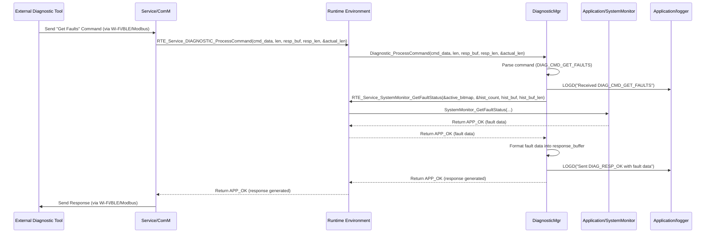

# **Detailed Design Document: DiagnosticMgr Component**

## **1. Introduction**

### **1.1. Purpose**

This document details the design of the DiagnosticMgr component. Its primary purpose is to provide the **external interface for system diagnostics and maintenance**. It is responsible for retrieving fault information from SystemMonitor, exposing it to external interfaces (BLE, Wi-Fi, Modbus), handling external configuration commands, initiating OTA updates, running specific test cases, and managing system reboots. It includes logic for parsing incoming commands.

### **1.2. Scope**

The scope of this document covers the diagnostic module's architecture, functional behavior, interfaces, dependencies, and resource considerations. It details how diagnostic interacts with SystemMonitor, systemMgr, Service/ComM, and Service/OTA via RTE services to provide comprehensive diagnostic capabilities.

### **1.3. References**

* Software Architecture Document (SAD) - Smart Device Firmware (Final Version)  
* Detailed Design Document: RTE  
* Detailed Design Document: Application/SystemMonitor  
* Detailed Design Document: Application/systemMgr  
* Detailed Design Document: Service_ComM  
* Detailed Design Document: Service_OTA

## **2. Functional Description**

The DiagnosticMgr component provides the following core functionalities:

1. **Initialization**: Initialize internal command handlers and prepare for diagnostic operations.  
2. **Command Parsing**: Parses incoming diagnostic and configuration commands received from the communication stack.  
3. **Fault Retrieval and Reporting**: Queries SystemMonitor for active and historical faults and formats this information for external reporting via communication interfaces.  
4. **Configuration Management Interface**: Provides the interface for external entities to set system configurations (e.g., operational temperature ranges, schedules).  
5. **OTA Update Initiation**: Receives commands to initiate Over-the-Air (OTA) firmware updates, after checking power readiness with systemMgr.  
6. **Self-Test Execution**: Receives commands to run specific diagnostic test cases to verify system functionality (e.g., "test fan motor," "check sensor calibration").  
7. **System Reboot/Bank Selection**: Receives commands to trigger a system reboot, potentially to a specific firmware bank (e.g., factory bank for recovery).  
8. **Response Generation**: Formats and sends appropriate responses back to the external diagnostic tool via the communication stack.  
9. **Logging**: Logs all diagnostic activities and command processing using the logger module.

## **3. Non-Functional Requirements**

### **3.1. Performance**

* **Responsiveness**: Respond to diagnostic queries and commands within acceptable latency.  
* **Efficiency**: Command parsing and response generation should be efficient.

### **3.2. Memory**

* **Minimal Footprint**: The diagnostic module shall have a minimal memory footprint.  
* **Buffer Management**: Efficiently manage buffers for incoming commands and outgoing responses.

### **3.3. Reliability**

* **Robustness**: The module must be robust against malformed commands or communication errors.  
* **Security**: Ensure that diagnostic commands (especially those affecting system state or initiating updates) are properly authenticated and authorized (e.g., via Service_Security or Service_ComM's secure channels). This design assumes Service_Security handles underlying authentication.  
* **Safety**: Prevent unintended system behavior from diagnostic commands.

## **4. Architectural Context**

As per the SAD (Section 3.1.2, Application Layer), diagnostic resides in the Application Layer. It is the external interface for diagnostics. It receives commands from Service/ComM (via COMMUNICATION_STACK_MainTask and an RTE service). It queries SystemMonitor for fault status, commands systemMgr for configuration changes or fail-safe modes, and initiates Service/OTA updates, all via RTE services.

## **5. Design Details**

### **5.1. Module Structure**

The DiagnosticMgr component will consist of the following files:

* DiagnosticMgr/inc/diagnostic.h: Public header file containing function prototypes, command ID definitions, and response structure definitions.  
* DiagnosticMgr/src/diagnostic.c: Source file containing the implementation of command parsing, handling, and response generation.  
* DiagnosticMgr/cfg/diagnostic_cfg.h: Configuration header for command definitions, self-test mappings, and response formats.

### **5.2. Public Interface (API)**

// In DiagnosticMgr/inc/diagnostic.h
```c
#include "Application/common/inc/app_common.h" // For APP_Status_t  
#include "Application/SystemMonitor/inc/system_monitor.h" // For SystemMonitor_Fault_t

// --- Diagnostic Command IDs ---  
typedef enum {  
    DIAG_CMD_GET_STATUS = 0x01,  
    DIAG_CMD_GET_FAULTS = 0x02,  
    DIAG_CMD_CLEAR_FAULTS = 0x03,  
    DIAG_CMD_SET_TEMP_RANGE = 0x10,  
    DIAG_CMD_ACTIVATE_FAIL_SAFE = 0x20,  
    DIAG_CMD_INITIATE_OTA = 0x30,  
    DIAG_CMD_RUN_SELF_TEST = 0x40,  
    DIAG_CMD_REBOOT = 0x50,  
    // Add more commands as needed  
} Diagnostic_CommandId_t;

// --- Diagnostic Response Codes ---  
typedef enum {  
    DIAG_RESP_OK = 0x00,  
    DIAG_RESP_INVALID_COMMAND = 0x01,  
    DIAG_RESP_INVALID_PARAM = 0x02,  
    DIAG_RESP_OPERATION_FAILED = 0x03,  
    DIAG_RESP_NOT_AUTHORIZED = 0x04,  
    DIAG_RESP_OTA_POWER_LOW = 0x05, // Specific for OTA  
    // Add more as needed  
} Diagnostic_ResponseCode_t;

// --- Public Functions ---

/**  
 * @brief Initializes the Diagnostic module.  
 * This function should be called once during application initialization.  
 * @return APP_OK on success, APP_ERROR on failure.  
 */  
APP_Status_t Diagnostic_Init(void);

/**  
 * @brief Processes an incoming diagnostic/configuration command.  
 * This function is typically called by COMMUNICATION_STACK_MainTask (via RTE_Service_DIAGNOSTIC_ProcessCommand).  
 * It parses the command, executes the requested action, and generates a response.  
 * @param command Pointer to the incoming command data.  
 * @param len Length of the command data.  
 * @param response_buffer Pointer to a buffer to store the response.  
 * @param response_buffer_len Size of the response buffer.  
 * @param actual_response_len Pointer to store the actual length of the generated response.  
 * @return APP_OK on successful command processing, APP_ERROR if command parsing or execution fails.  
 */  
APP_Status_t Diagnostic_ProcessCommand(const uint8_t *command, uint16_t len,  
                                       uint8_t *response_buffer, uint16_t response_buffer_len,  
                                       uint16_t *actual_response_len);
```

### **5.3. Internal Design**

The DiagnosticMgr module will implement a command dispatch table to handle various incoming commands. It will rely heavily on RTE services to interact with other modules and the communication stack.

1. **Initialization (Diagnostic_Init)**:  
   * Initialize any internal state variables.  
   * Return APP_OK.  
2. **Command Processing (Diagnostic_ProcessCommand)**:  
   * Called by COMMUNICATION_STACK_MainTask (via RTE_Service_DIAGNOSTIC_ProcessCommand).  
   * **Input Validation**: Validate command, len, response_buffer, response_buffer_len.  
   * **Command Parsing**:  
     * Extract Diagnostic_CommandId_t from the command data.  
     * Extract any command-specific parameters.  
   * **Authentication/Authorization (Conceptual)**: If security is enabled, this is where Service_Security might be used to verify the command's authenticity or the user's authorization. If not authorized, generate DIAG_RESP_NOT_AUTHORIZED.  
   * **Command Dispatch**: Use a switch statement or a function pointer table based on command_id:  
     * **DIAG_CMD_GET_STATUS**:  
       * Call RTE_Service_SystemMonitor_GetCPULoad(), RTE_Service_SystemMonitor_GetTotalMinFreeStack().  
       * Format system status into response_buffer.  
     * **DIAG_CMD_GET_FAULTS**:  
       * Call RTE_Service_SystemMonitor_GetFaultStatus() to retrieve active faults and history.  
       * Format fault data into response_buffer.  
     * **DIAG_CMD_CLEAR_FAULTS**:  
       * Extract fault_id parameter.  
       * Call RTE_Service_SystemMonitor_ClearFault(fault_id).  
       * Generate DIAG_RESP_OK or DIAG_RESP_OPERATION_FAILED.  
     * **DIAG_CMD_SET_TEMP_RANGE**:  
       * Extract min_temp, max_temp parameters.  
       * Call RTE_Service_SYS_MGR_SetOperationalTemperature(min_temp, max_temp).  
       * Generate DIAG_RESP_OK or DIAG_RESP_INVALID_PARAM.  
     * **DIAG_CMD_ACTIVATE_FAIL_SAFE**:  
       * Extract enable parameter.  
       * Call RTE_Service_SYS_MGR_SetFailSafeMode(enable).  
       * Generate DIAG_RESP_OK.  
     * **DIAG_CMD_INITIATE_OTA**:  
       * Extract download_url parameter.  
       * **Power Readiness Check**: Call RTE_Service_SYS_MGR_CheckPowerReadinessForOTA(&ready).  
       * If ready is false, generate DIAG_RESP_OTA_POWER_LOW and return.  
       * Call RTE_Service_OTA_StartUpdate(download_url).  
       * Generate DIAG_RESP_OK or DIAG_RESP_OPERATION_FAILED.  
     * **DIAG_CMD_RUN_SELF_TEST**:  
       * Extract test_id parameter.  
       * Call specific RTE services for self-tests (e.g., RTE_Service_FAN_RunSelfTest(), RTE_Service_TEMP_SENSOR_RunSelfTest()).  
       * Aggregate results and generate response.  
     * **DIAG_CMD_REBOOT**:  
       * Call RTE_Service_DIAGNOSTIC_RequestReboot(). (This RTE service would likely just trigger an internal flag for the main loop task or a direct MCU reset call).  
       * Generate DIAG_RESP_OK.  
     * **Default**: If command ID is unknown, generate DIAG_RESP_INVALID_COMMAND.  
   * **Response Generation**: Populate response_buffer with the response code and any results. Set *actual_response_len.  
   * Log the command and response using logger.  
   * Return APP_OK on successful processing, APP_ERROR if a fundamental issue occurred (e.g., buffer too small).

**Sequence Diagram (Example: External Tool Requests Faults):**

### **5.4. Dependencies**

* **Application/common/inc/app_common.h**: For APP_Status_t.  
* **Application/logger/inc/logger.h**: For logging diagnostic activities.  
* **Application/SystemMonitor/inc/system_monitor.h**: For SystemMonitor_Fault_t and fault IDs.  
* **Rte/inc/Rte.h**: For calling all necessary RTE services to interact with SystemMonitor, systemMgr, Service/OTA, and Service/ComM.

### **5.5. Error Handling**

* **Command Validation**: Diagnostic_ProcessCommand will validate incoming command format and parameters. Invalid commands will result in DIAG_RESP_INVALID_COMMAND or DIAG_RESP_INVALID_PARAM responses.  
* **Underlying Service Failures**: If an RTE service call to SystemMonitor, systemMgr, or Service/OTA returns APP_ERROR, Diagnostic will generate an appropriate DIAG_RESP_OPERATION_FAILED response.  
* **Power Check for OTA**: Explicitly checks systemMgr for power readiness before initiating OTA.  
* **Logging**: All command processing, successes, and failures will be logged.

### **5.6. Configuration**

The DiagnosticMgr/cfg/diagnostic_cfg.h file will contain:

* **Command ID Definitions**: Macros for Diagnostic_CommandId_t.  
* **Response Code Definitions**: Macros for Diagnostic_ResponseCode_t.  
* **Self-Test Mappings**: (Optional) Configuration table mapping test_id to the RTE services that execute the actual self-test logic in other application modules.  
* **Max Command/Response Lengths**: DIAG_MAX_COMMAND_LEN, DIAG_MAX_RESPONSE_LEN.

// Example: DiagnosticMgr/cfg/diagnostic_cfg.h
```c
#define DIAG_MAX_COMMAND_LEN            64  // Max bytes for an incoming command  
#define DIAG_MAX_RESPONSE_LEN           256 // Max bytes for an outgoing response

// Define specific test IDs and their corresponding RTE calls (conceptual)  
// typedef struct {  
//     uint32_t test_id;  
//     APP_Status_t (*test_function)(void); // Function pointer to an RTE service  
// } Diagnostic_SelfTest_t;  
// extern const Diagnostic_SelfTest_t diagnostic_self_tests[];
```

### **5.7. Resource Usage**

* **Flash**: Moderate, for command parsing logic, dispatch table, and response formatting.  
* **RAM**: Moderate, for command and response buffers (DIAG_MAX_COMMAND_LEN, DIAG_MAX_RESPONSE_LEN).  
* **CPU**: Low to moderate, depending on the complexity of command parsing and the number of RTE service calls required for each command.

## **6. Test Considerations**

### **6.1. Unit Testing**

* **Mock Dependencies**: Unit tests for diagnostic will mock RTE_Service_SystemMonitor_GetFaultStatus(), RTE_Service_SystemMonitor_ClearFault(), RTE_Service_SYS_MGR_SetOperationalTemperature(), RTE_Service_SYS_MGR_SetFailSafeMode(), RTE_Service_SYS_MGR_CheckPowerReadinessForOTA(), RTE_Service_OTA_StartUpdate(), RTE_Service_DIAGNOSTIC_RequestReboot(), and logger.  
* **Test Cases**:  
  * Diagnostic_Init: Verify basic initialization.  
  * Diagnostic_ProcessCommand:  
    * Test with valid commands (e.g., DIAG_CMD_GET_STATUS, DIAG_CMD_GET_FAULTS, DIAG_CMD_SET_TEMP_RANGE, DIAG_CMD_INITIATE_OTA). Verify correct RTE service calls and expected responses (DIAG_RESP_OK).  
    * Test with invalid command IDs (verify DIAG_RESP_INVALID_COMMAND).  
    * Test with valid command ID but invalid parameters (verify DIAG_RESP_INVALID_PARAM).  
    * Test scenarios where underlying RTE service calls return APP_ERROR (verify DIAG_RESP_OPERATION_FAILED).  
    * Test DIAG_CMD_INITIATE_OTA when RTE_Service_SYS_MGR_CheckPowerReadinessForOTA() returns false (verify DIAG_RESP_OTA_POWER_LOW).  
    * Test DIAG_CMD_CLEAR_FAULTS with FAULT_ID_NONE and specific IDs.  
    * Verify logging for all scenarios.  
  * Response Buffer Handling: Test with response_buffer_len being too small (verify APP_ERROR return from Diagnostic_ProcessCommand).

### **6.2. Integration Testing**

* **Diagnostic-ComM Integration**: Verify that Diagnostic correctly receives commands from Service/ComM (via COMMUNICATION_STACK_MainTask and RTE) and sends responses back.  
* **Diagnostic-SystemMonitor Integration**: Verify that Diagnostic can accurately query and clear faults from SystemMonitor.  
* **Diagnostic-SystemMgr Integration**: Verify that Diagnostic can correctly change systemMgr's operational parameters and trigger fail-safe modes.  
* **Diagnostic-OTA Integration**: Verify that Diagnostic can successfully initiate OTA updates, including the power readiness check.  
* **Self-Test Integration**: If self-tests are implemented, verify that Diagnostic can trigger them and receive their results.  
* **Security Testing**: If authentication/authorization is implemented, verify that unauthorized commands are rejected.

### **6.3. System Testing**

* **End-to-End Diagnostics**: Use an external diagnostic tool to comprehensively test all diagnostic commands and verify their functionality and responses in a real-world environment.  
* **Fault Injection and Verification**: Introduce faults into the system (e.g., unplugging a sensor, causing a communication error) and verify that Diagnostic can retrieve and report these faults correctly.  
* **OTA Process**: Perform a full OTA update initiated via Diagnostic and verify successful firmware upgrade.  
* **System Reboot**: Test remote reboot commands.  
* **Robustness**: Stress test the diagnostic interface with high command rates or malformed commands to ensure stability.
