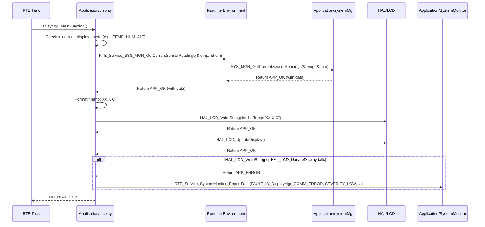

# **Detailed Design Document: Display Component**

## **1. Introduction**

### **1.1. Purpose**

This document details the design of the Display component. Its primary purpose is to provide a high-level interface for managing and updating the character-based LCD display within the smart device. It abstracts the complexities of the underlying hardware drivers (e.g., I2C or GPIO for LCD communication). This module is responsible for presenting system information, sensor readings, and alarm statuses to the user.

### **1.2. Scope**

The scope of this document covers the Display module's architecture, functional behavior, interfaces, dependencies, and resource considerations. It details how Display receives data from systemMgr (via RTE services) and renders it on the LCD, managing display modes and updates.

### **1.3. References**

* Software Architecture Document (SAD) - Environmental Monitoring & Control System (Final Version)  
* Detailed Design Document: RTE  
* Detailed Design Document: systemMgr  
* Detailed Design Document: HAL_I2C (if I2C LCD)  
* Detailed Design Document: HAL_GPIO (if parallel LCD or for backlight control)  
* LCD Module Datasheet (e.g., HD44780-compatible LCD)

## **2. Functional Description**

The Display component provides the following core functionalities:

1. **Initialization (Display_Init)**: Initialize the LCD hardware (via HAL drivers) and prepare its internal state for display operations.  
2. **Update Display Content (DisplayMgr_Update)**: This is the module's primary function for rendering information. It receives data (e.g., temperature, humidity, alarm status) and formats it for presentation on the LCD. This function is typically called periodically by RTE_DisplayAlarmTask.  
3. **Manage Display Modes (DisplayMgr_SetMode, DisplayMgr_CycleMode)**: Control which information is currently shown on the display (e.g., alternating temperature/humidity, version number, min/max readings, alarm status).  
4. **Control Backlight (DisplayMgr_SetBacklight)**: Turn the LCD backlight ON or OFF.  
5. **Error Reporting**: Detect and report any failures during display operations (e.g., LCD communication error) to the SystemMonitor via RTE_Service_SystemMonitor_ReportFault().

## **3. Non-Functional Requirements**

### **3.1. Performance**

* **Responsiveness**: Display updates shall be performed with sufficient frequency to ensure a smooth user experience and timely presentation of information (defined by DisplayMgr_UPDATE_PERIOD_MS).  
* **Readability**: Display content shall be clear and easy to read under various lighting conditions.

### **3.2. Memory**

* **Minimal Footprint**: The Display module shall have a minimal memory footprint for its internal buffers and state.

### **3.3. Reliability**

* **Robustness**: The module shall be robust against communication errors with the LCD, attempting retries or reporting faults without crashing the system.  
* **Consistency**: Displayed information shall be consistent with the actual system state.

## **4. Architectural Context**

As per the SAD (Section 3.1.2, Application Layer), Display resides in the Application Layer. It is primarily driven by the RTE_DisplayAlarmTask, which periodically calls DisplayMgr_Update(). It receives data from systemMgr via RTE services and interacts with HAL drivers (e.g., HAL_I2C, HAL_GPIO) for physical LCD communication.

## **5. Design Details**

### **5.1. Module Structure**

The Display component will consist of the following files:

* Application/display/inc/display.h: Public header file containing function prototypes, data types for display modes, and error codes.  
* Application/display/src/display.c: Source file containing the implementation of display logic, content formatting, and LCD communication.  
* Application/display/cfg/display_cfg.h: Configuration header for LCD dimensions, character mappings, and update timing.

### **5.2. Public Interface (API)**

// In Application/display/inc/display.h
```c
#include "Application/common/inc/app_common.h" // For APP_Status_t  
#include <stdint.h>   // For uint32_t, uint8_t  
#include <stdbool.h>  // For bool

// --- Display Mode Definitions ---  
typedef enum {  
    DisplayMgr_MODE_VERSION = 0,         // SyRS-02-03-03: Display version on power-on  
    DisplayMgr_MODE_TEMP_HUM_ALT,        // SyRS-02-03-02: Alternating temp/humidity  
    DisplayMgr_MODE_MIN_MAX_TEMP,        // SyRS-02-03-04: Min/Max recorded temperatures  
    DisplayMgr_MODE_ALARM_STATUS,        // SyRS-02-03-05: Alarm status  
    DisplayMgr_MODE_SETPOINT_CONFIG,     // SyRS-02-06-04: Set point configuration mode  
    // Add more modes as needed (e.g., current fan speed, specific actuator status)  
    DisplayMgr_MODE_COUNT  
} Display_Mode_t;

// --- Public Functions ---

/**  
 * @brief Initializes the Display module and the underlying LCD hardware.  
 * This function should be called once during system initialization.  
 * @return APP_OK on success, APP_ERROR on failure.  
 */  
APP_Status_t Display_Init(void);

/**  
 * @brief Updates the content on the LCD display based on the current display mode  
 * and system data retrieved from systemMgr. This function is called periodically.  
 * @return APP_OK on successful update, APP_ERROR on communication failure.  
 */  
APP_Status_t DisplayMgr_Update(void);

/**  
 * @brief Sets the current display mode.  
 * @param mode The desired display mode.  
 * @return APP_OK on success, APP_ERROR if the mode is invalid.  
 */  
APP_Status_t DisplayMgr_SetMode(Display_Mode_t mode);

/**  
 * @brief Cycles to the next display mode in a predefined sequence.  
 * This is typically triggered by a user button press (SyRS-02-06-01).  
 * @return APP_OK on success, APP_ERROR if cycling fails.  
 */  
APP_Status_t DisplayMgr_CycleMode(void);

/**  
 * @brief Controls the LCD backlight.  
 * @param enable True to turn backlight ON, false to turn OFF.  
 * @return APP_OK on success, APP_ERROR on failure.  
 */  
APP_Status_t DisplayMgr_SetBacklight(bool enable);

/**  
 * @brief Sets the current setpoint context for DisplayMgr_MODE_SETPOINT_CONFIG.  
 * This allows the display to show the correct function name and value.  
 * @param function_id An ID representing the function being configured (e.g., FAN_ID_1, HEATER_ID_MAIN).  
 * @param setpoint_value The current setpoint value to display.  
 * @return APP_OK on success, APP_ERROR on invalid input.  
 */  
APP_Status_t DisplayMgr_SetSetpointContext(uint32_t function_id, int32_t setpoint_value);

// --- Internal Periodic Runnable Prototype (called by RTE) ---  
// This function is declared here so RTE can call it.  
/**  
 * @brief Internal periodic function for display updates.  
 * This is the same as DisplayMgr_Update, but explicitly marked for RTE use.  
 */  
void DisplayMgr_MainFunction(void);
```
### **5.3. Internal Design**

The Display module will manage its own internal state, including the current display mode, and will format data retrieved from systemMgr before sending it to the LCD driver via HAL.

1. **Internal State**:
   ```c  
   static Display_Mode_t s_current_display_mode = DisplayMgr_MODE_VERSION;  
   static uint32_t s_last_mode_change_time_ms = 0; // For alternating displays  
   static uint32_t s_current_setpoint_function_id = 0; // For setpoint config mode  
   static int32_t s_current_setpoint_value = 0;       // For setpoint config mode  
   static bool s_is_initialized = false;
   ```
   * All these variables will be initialized in Display_Init().  
2. **Initialization (Display_Init)**:  
   * Initialize internal state variables.  
   * Call HAL_LCD_Init() (assuming a generic HAL LCD driver, which would internally use HAL_I2C or HAL_GPIO).  
   * If HAL_LCD_Init() fails, report FAULT_ID_DisplayMgr_INIT_FAILED to SystemMonitor and return APP_ERROR.  
   * Set s_is_initialized = true;.  
   * Call DisplayMgr_SetMode(DisplayMgr_MODE_VERSION) to show version on startup.  
   * Return APP_OK.  
3. **Update Display Content (DisplayMgr_Update / DisplayMgr_MainFunction)**:  
   * If !s_is_initialized, return immediately.  
   * Clear the LCD: HAL_LCD_ClearDisplay().  
   * Use a switch statement on s_current_display_mode:  
     * **DisplayMgr_MODE_VERSION**:  
       * Retrieve version string from systemMgr via RTE_Service_SYS_MGR_GetVersion().  
       * Write "Version X.Y" to LCD using HAL_LCD_WriteString().  
       * After DisplayMgr_VERSION_SHOW_TIME_MS, transition to DisplayMgr_MODE_TEMP_HUM_ALT.  
     * **DisplayMgr_MODE_TEMP_HUM_ALT**:  
       * Retrieve current temperature and humidity from systemMgr via RTE_Service_SYS_MGR_GetCurrentSensorReadings().  
       * Alternate between "Temp: XX.X C" and "Hum: YY.Y %" every DisplayMgr_ALT_PERIOD_MS using APP_COMMON_GetUptimeMs() and s_last_mode_change_time_ms.  
       * Check for out-of-range conditions (SyRS-02-03-05). If systemMgr reports an alarm for temp/hum, display "ALARM!" or flash the reading.  
     * **DisplayMgr_MODE_MIN_MAX_TEMP**:  
       * Retrieve min/max temperatures from systemMgr via RTE_Service_SYS_MGR_GetMinMaxTemperatures().  
       * Display "Min: XX.X C" and "Max: YY.Y C".  
     * **DisplayMgr_MODE_ALARM_STATUS**:  
       * Retrieve active alarm status from SystemMonitor via RTE_Service_SystemMonitor_GetFaultStatus().  
       * Display a summary of active alarms (e.g., "ALARM: TEMP HIGH" or "NO ALARMS").  
     * **DisplayMgr_MODE_SETPOINT_CONFIG**:  
       * Display the function name based on s_current_setpoint_function_id (e.g., "Fan 1 Setpoint").  
       * Display the s_current_setpoint_value.  
       * This mode is typically entered and exited by systemMgr or diagnostic via DisplayMgr_SetMode and DisplayMgr_SetSetpointContext.  
     * **Default**: Clear display or show an error message.  
   * If any HAL_LCD_... function returns an error, report FAULT_ID_DisplayMgr_COMM_ERROR to SystemMonitor.  
4. **Set Display Mode (DisplayMgr_SetMode)**:  
   * Validate mode.  
   * Set s_current_display_mode = mode;.  
   * Reset s_last_mode_change_time_ms = APP_COMMON_GetUptimeMs();.  
   * Log LOGD("Display: Mode set to %d", mode);.  
   * Return APP_OK.  
5. **Cycle Display Mode (DisplayMgr_CycleMode)**:  
   * Calculate the next mode: s_current_display_mode = (s_current_display_mode + 1) % DisplayMgr_MODE_COUNT;.  
   * Skip DisplayMgr_MODE_SETPOINT_CONFIG if not actively in a configuration session.  
   * Call DisplayMgr_SetMode(s_current_display_mode).  
   * Return APP_OK.  
6. **Control Backlight (DisplayMgr_SetBacklight)**:  
   * Call HAL_LCD_SetBacklight(enable) (assuming HAL LCD driver provides this).  
   * If HAL_LCD_SetBacklight fails, report FAULT_ID_DisplayMgr_BACKLIGHT_ERROR to SystemMonitor.  
   * Return APP_OK.  
7. **Set Setpoint Context (DisplayMgr_SetSetpointContext)**:  
   * Store function_id and setpoint_value in internal static variables.  
   * This function is primarily used by systemMgr or diagnostic when entering/exiting a configuration flow.

**Sequence Diagram (Example: Displaying Temperature/Humidity):**

### **5.4. Dependencies**

* app_common.h: For APP_Status_t, APP_OK/APP_ERROR, and APP_COMMON_GetUptimeMs().  
* logger.h: For internal logging.  
* Rte.h: For calling RTE_Service_SystemMonitor_ReportFault() and RTE_Service_SYS_MGR_Get...() functions.  
* hal_lcd.h (conceptual): A generic HAL interface for the LCD, which would abstract I2C or GPIO details. This hal_lcd.h would internally use HAL_I2C or HAL_GPIO.  
* system_monitor.h: For FAULT_ID_DisplayMgr_... definitions.

### **5.5. Error Handling**

* **Initialization Failure**: If HAL_LCD_Init() fails, Display_Init() reports FAULT_ID_DisplayMgr_INIT_FAILED to SystemMonitor.  
* **Communication Errors**: If any HAL_LCD_... function fails during display updates (e.g., HAL_LCD_WriteString), DisplayMgr_Update() reports FAULT_ID_DisplayMgr_COMM_ERROR to SystemMonitor.  
* **Backlight Errors**: If HAL_LCD_SetBacklight() fails, DisplayMgr_SetBacklight() reports FAULT_ID_DisplayMgr_BACKLIGHT_ERROR to SystemMonitor.  
* **Input Validation**: Public API functions validate input parameters (e.g., valid Display_Mode_t).  
* **Return Status**: All public API functions return APP_ERROR on failure.

### **5.6. Configuration**

The Application/display/cfg/display_cfg.h file will contain:
```c
/* DisplayMgr_LCD_ROWS, DisplayMgr_LCD_COLUMNS: Dimensions of the LCD.  
* DisplayMgr_VERSION_SHOW_TIME_MS: How long the version number is displayed on startup.  
* DisplayMgr_ALT_PERIOD_MS: Period for alternating between temperature and humidity.  
* DisplayMgr_UPDATE_PERIOD_MS: The frequency at which DisplayMgr_MainFunction() is called by RTE.  
* DisplayMgr_DEFAULT_BACKLIGHT_ON_TIME_MS: Default duration for backlight to stay on after activation.  
* Macros for character mappings or custom symbols if needed.*/

// Example: Application/display/cfg/display_cfg.h  
#ifndef DisplayMgr_CFG_H  
#define DisplayMgr_CFG_H

#define DisplayMgr_LCD_ROWS                2  
#define DisplayMgr_LCD_COLUMNS             16

#define DisplayMgr_VERSION_SHOW_TIME_MS    3000 // 3 seconds  
#define DisplayMgr_ALT_PERIOD_MS           2000 // 2 seconds for alternating temp/hum

#define DisplayMgr_UPDATE_PERIOD_MS        100  // DisplayMgr_MainFunction called every 100 ms

#define DisplayMgr_DEFAULT_BACKLIGHT_ON_TIME_MS 10000 // 10 seconds

// Custom characters or symbols can be defined here if needed by the LCD driver  
// #define DisplayMgr_CHAR_DEGREE_CELSIUS     0xDF // Example for custom degree symbol

#endif // DisplayMgr_CFG_H
```
### **5.7. Resource Usage**

* **Flash**: Moderate, for content formatting logic, string handling, and various display modes.  
* **RAM**: Low, for internal state variables and temporary string buffers (e.g., for sprintf operations).  
* **CPU**: Low for periodic updates, as most time is spent waiting for LCD communication.

## **6. Test Considerations**

### **6.1. Unit Testing**

* **Mock Dependencies**: Unit tests for Display will mock HAL_LCD_Init(), HAL_LCD_ClearDisplay(), HAL_LCD_WriteString(), HAL_LCD_SetBacklight(), RTE_Service_SystemMonitor_ReportFault(), and RTE_Service_SYS_MGR_Get...().  
* **Test Cases**:  
  * Display_Init: Verify HAL_LCD_Init() is called and internal state is initialized. Test initialization failure and fault reporting.  
  * DisplayMgr_Update (or DisplayMgr_MainFunction):  
    * Test all Display_Mode_t scenarios (version, temp/hum, min/max, alarm, setpoint). Mock systemMgr data accordingly. Verify correct HAL_LCD_WriteString() calls and content.  
    * Test alternating display logic (temp/hum).  
    * Test communication failures (mock HAL_LCD_WriteString to return error) and verify FAULT_ID_DisplayMgr_COMM_ERROR is reported.  
  * DisplayMgr_SetMode: Test setting valid/invalid modes. Verify s_current_display_mode and s_last_mode_change_time_ms are updated.  
  * DisplayMgr_CycleMode: Test cycling through modes, including skipping SETPOINT_CONFIG if not active.  
  * DisplayMgr_SetBacklight: Test turning ON/OFF. Verify HAL_LCD_SetBacklight() calls and error reporting.  
  * DisplayMgr_SetSetpointContext: Verify internal storage of context.

### **6.2. Integration Testing**

* **Display-HAL_LCD Integration**: Verify Display correctly interfaces with the actual HAL LCD driver.  
* **Display-systemMgr Integration**: Verify Display accurately retrieves and presents data from systemMgr (sensor readings, min/max, version).  
* **Display-SystemMonitor Integration**: Verify Display can correctly show alarm statuses based on data from SystemMonitor.  
* **User Interaction**: Test physical button presses (via Application/buttons and systemMgr) triggering DisplayMgr_CycleMode and DisplayMgr_SetSetpointContext.  
* **Fault Reporting**: Trigger HAL LCD errors (e.g., by disconnecting LCD) and verify Display reports faults to SystemMonitor.

### **6.3. System Testing**

* **End-to-End Display Functionality**: Verify all display modes, updates, backlight control, and alarm indications work correctly in the integrated system.  
* **Power-On Sequence**: Verify the version number is displayed correctly on startup, then transitions to alternating temp/hum.  
* **Mode Transitions**: Test all user-triggered display mode transitions.  
* **Alarm Indication**: Simulate alarm conditions (e.g., high temperature) and verify the display correctly indicates the alarm.  
* **Long-Term Operation**: Run the system for extended periods to ensure display reliability and no memory leaks.