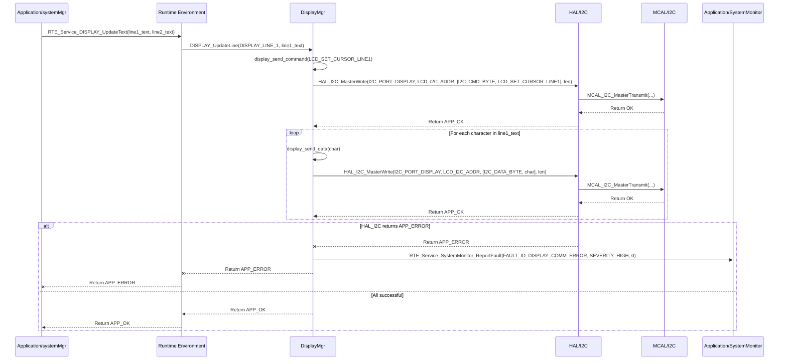

# **Detailed Design Document: DisplayMgr Component**

## **1. Introduction**

### **1.1. Purpose**

This document details the design of the DisplayMgr component. Its primary purpose is to manage the interaction with the character-based LCD (Liquid Crystal Display) used for displaying system status, sensor readings, and alarms. It provides a high-level, easy-to-use interface for other application modules to update the display content, abstracting the low-level display driver details.

### **1.2. Scope**

The scope of this document covers the display module's architecture, functional behavior, interfaces, dependencies, and resource considerations. It details how display receives display requests from systemMgr (via RTE services) and interacts with the underlying HAL_I2C (assuming an I2C-controlled LCD) or MCAL_GPIO (for direct GPIO-controlled LCD) for physical display updates.

### **1.3. References**

* Software Architecture Document (SAD) - Smart Device Firmware (Final Version)  
* Detailed Design Document: RTE  
* Detailed Design Document: HAL_I2C (if I2C LCD)  
* MCAL GPIO Driver Specification (if GPIO LCD)  
* LCD Datasheet (e.g., HD44780 compatible LCD)

## **2. Functional Description**

The DisplayMgr component provides the following core functionalities:

1. **Initialization**: Initialize the LCD hardware and clear its content.  
2. **Text Display**: Write text strings to specific lines or positions on the LCD.  
3. **Clear Display**: Clear the entire LCD screen or specific lines.  
4. **Backlight Control**: Control the LCD backlight (on/off, or brightness if supported).  
5. **Custom Characters**: Support loading and displaying custom characters (if supported by LCD).  
6. **Error Reporting**: Report any failures during display operations (e.g., initialization failure, communication error with LCD) to the SystemMonitor via RTE_Service_SystemMonitor_ReportFault().

## **3. Non-Functional Requirements**

### **3.1. Performance**

* **Responsiveness**: Display updates should appear promptly after a request.  
* **Efficiency**: Display update operations should be efficient to minimize CPU overhead.

### **3.2. Memory**

* **Minimal Footprint**: The display module shall have a minimal memory footprint.  
* **Buffer Management**: Efficiently manage any internal display buffers.

### **3.3. Reliability**

* **Robustness**: The module shall handle communication errors with the LCD gracefully.  
* **Readability**: Displayed text must be clear and legible.  
* **Safety**: Ensure display does not show corrupted or misleading information.

## **4. Architectural Context**

As per the SAD (Section 3.1.2, Application Layer), display resides in the Application Layer. It receives display update requests from systemMgr (via RTE_Service_DISPLAY_UpdateText()). It then interacts with the appropriate HAL or MCAL drivers (e.g., HAL_I2C for I2C LCD, or MCAL_GPIO for direct parallel LCD) to send commands and data to the physical LCD.

## **5. Design Details**

### **5.1. Module Structure**

The DisplayMgr component will consist of the following files:

* DisplayMgr/inc/display.h: Public header file containing function prototypes and any display-specific definitions (e.g., line numbers).  
* DisplayMgr/src/display.c: Source file containing the implementation of display control logic.  
* DisplayMgr/cfg/display_cfg.h: Configuration header for LCD type, dimensions (rows/columns), communication interface (I2C address/GPIO pins), and backlight control pin.

### **5.2. Public Interface (API)**

// In DisplayMgr/inc/display.h
```c
#include "Application/common/inc/app_common.h" // For APP_Status_t

// --- Display Line Definitions (Example for 2x16 LCD) ---  
#define DISPLAY_LINE_1  0  
#define DISPLAY_LINE_2  1  
#define DISPLAY_MAX_LINES 2  
#define DISPLAY_MAX_COLUMNS 16

// --- Public Functions ---

/**  
 * @brief Initializes the Display module and the LCD hardware.  
 * Clears the display and sets up the backlight.  
 * @return APP_OK on success, APP_ERROR on failure.  
 */  
APP_Status_t DISPLAY_Init(void);

/**  
 * @brief Updates the text on a specific line of the LCD.  
 * @param line_num The line number to update (e.g., DISPLAY_LINE_1).  
 * @param text The null-terminated string to display.  
 * @return APP_OK on success, APP_ERROR on failure.  
 */  
APP_Status_t DISPLAY_UpdateLine(uint8_t line_num, const char *text);

/**  
 * @brief Clears the entire LCD screen.  
 * @return APP_OK on success, APP_ERROR on failure.  
 */  
APP_Status_t DISPLAY_ClearScreen(void);

/**  
 * @brief Controls the LCD backlight.  
 * @param enable True to turn on backlight, false to turn off.  
 * @return APP_OK on success, APP_ERROR on failure.  
 */  
APP_Status_t DISPLAY_SetBacklight(bool enable);

// Add functions for custom characters, cursor control if needed
```

### **5.3. Internal Design**

The DisplayMgr module will encapsulate the specific commands and sequences required to control the LCD. It will use the configured communication interface (I2C or GPIO) to send these commands.

1. **Initialization (DISPLAY_Init)**:  
   * **Communication Interface Init**:  
     * If DISPLAY_COMM_INTERFACE_I2C is configured: Call HAL_I2C_Init() for the relevant port.  
     * If DISPLAY_COMM_INTERFACE_GPIO is configured: Call MCAL_GPIO_Init() for all LCD data/control pins.  
   * **LCD Hardware Init Sequence**: Send the specific initialization commands to the LCD as per its datasheet (e.g., function set, display on/off, clear display).  
   * **Backlight Control**: Call DISPLAY_SetBacklight(true) (or as configured).  
   * If any underlying communication or LCD command fails, report FAULT_ID_DISPLAY_INIT_FAILED to SystemMonitor via RTE_Service_SystemMonitor_ReportFault().  
   * Return APP_OK.  
2. **Update Line (DISPLAY_UpdateLine)**:  
   * Validate line_num and text length (truncate if too long for the line).  
   * Send LCD command to set cursor to the beginning of line_num.  
   * Send the text string character by character as data to the LCD.  
   * Pad with spaces if the text is shorter than the line length to clear previous content.  
   * If any underlying communication fails, report FAULT_ID_DISPLAY_COMM_ERROR to SystemMonitor.  
   * Return APP_OK.  
3. **Clear Screen (DISPLAY_ClearScreen)**:  
   * Send the LCD "clear display" command.  
   * Send the LCD "return home" command.  
   * Return APP_OK.  
4. **Set Backlight (DISPLAY_SetBacklight)**:  
   * If DISPLAY_BACKLIGHT_GPIO_PIN is defined: Call MCAL_GPIO_SetState(DISPLAY_BACKLIGHT_GPIO_PIN, enable ? MCAL_GPIO_STATE_HIGH : MCAL_GPIO_STATE_LOW).  
   * If DISPLAY_BACKLIGHT_PWM_CHANNEL is defined: Call RTE_Service_FAN_SetSpeed(DISPLAY_BACKLIGHT_PWM_CHANNEL, enable ? 100 : 0) (or a specific RTE_Service_PWM_SetDutyCycle if available).  
   * Return APP_OK.  
5. **Internal LCD Communication Functions**:  
   * display_send_command(uint8_t command): Sends a command byte to the LCD.  
   * display_send_data(uint8_t data): Sends a data byte to the LCD.  
   * These functions will internally use either HAL_I2C_MasterWrite() (for I2C LCDs, encapsulating the I2C expander commands) or MCAL_GPIO_SetPinState() (for parallel LCDs, controlling data/control lines).  
   * They should include small delays (vTaskDelay(1)) between commands/data as required by the LCD datasheet.

**Sequence Diagram (Example: Update Display Line - I2C LCD):**


### **5.4. Dependencies**

* **Application/common/inc/app_common.h**: For APP_Status_t.  
* **Application/logger/inc/logger.h**: For logging display errors.  
* **Rte/inc/Rte.h**: For calling RTE_Service_SystemMonitor_ReportFault().  
* **HAL/inc/hal_i2c.h**: If using an I2C-controlled LCD.  
* **Mcal/gpio/inc/mcal_gpio.h**: If using a direct GPIO-controlled LCD or for backlight control.  
* **Service/os/inc/service_os.h**: For delays (SERVICE_OS_DelayMs).

### **5.5. Error Handling**

* **Communication Errors**: If HAL_I2C or MCAL_GPIO operations fail, display will log the error and report FAULT_ID_DISPLAY_COMM_ERROR to SystemMonitor.  
* **Initialization Failure**: If LCD initialization sequence fails, FAULT_ID_DISPLAY_INIT_FAILED is reported.  
* **Input Validation**: Validate line_num and text length to prevent buffer overflows or writing to invalid display areas.

### **5.6. Configuration**

The DisplayMgr/cfg/display_cfg.h file will contain:

* **LCD Type**: Define DISPLAY_TYPE_LCD_16x2, DISPLAY_TYPE_LCD_20x4, etc.  
* **Communication Interface**: Define DISPLAY_COMM_INTERFACE_I2C or DISPLAY_COMM_INTERFACE_GPIO.  
* **For I2C LCD**: DISPLAY_I2C_PORT_ID, DISPLAY_I2C_SLAVE_ADDRESS.  
* **For GPIO LCD**: DISPLAY_GPIO_RS_PIN, DISPLAY_GPIO_EN_PIN, DISPLAY_GPIO_D4_PIN to D7_PIN.  
* **Backlight Control**: DISPLAY_BACKLIGHT_GPIO_PIN or DISPLAY_BACKLIGHT_PWM_CHANNEL.  
* **LCD Command/Data Delays**: DISPLAY_CMD_DELAY_US, DISPLAY_DATA_DELAY_US.

// Example: DisplayMgr/cfg/display_cfg.h
```c
#define DISPLAY_TYPE_LCD_16x2           1 // Example: 16 characters, 2 lines

// Choose communication interface  
#define DISPLAY_COMM_INTERFACE_I2C      1  
#define DISPLAY_COMM_INTERFACE_GPIO     0

#if DISPLAY_COMM_INTERFACE_I2C  
#define DISPLAY_I2C_PORT_ID             HAL_I2C_PORT_0  
#define DISPLAY_I2C_SLAVE_ADDRESS       0x27 // Common I2C address for PCF8574 based LCDs  
#elif DISPLAY_COMM_INTERFACE_GPIO  
// Define GPIO pins for parallel interface (RS, EN, D4-D7)  
#define DISPLAY_GPIO_RS_PIN             12  
#define DISPLAY_GPIO_EN_PIN             13  
#define DISPLAY_GPIO_D4_PIN             14  
#define DISPLAY_GPIO_D5_PIN             15  
#define DISPLAY_GPIO_D6_PIN             16  
#define DISPLAY_GPIO_D7_PIN             17  
#endif

// Backlight control (choose one)  
#define DISPLAY_BACKLIGHT_GPIO_PIN      25 // Example GPIO pin  
// #define DISPLAY_BACKLIGHT_PWM_CHANNEL   HAL_PWM_CHANNEL_DISPLAY_BACKLIGHT // If PWM controlled

// LCD timing delays in microseconds (refer to datasheet)  
#define DISPLAY_CMD_DELAY_US            2000 // 2ms  
#define DISPLAY_DATA_DELAY_US           50   // 50us
```

### **5.7. Resource Usage**

* **Flash**: Low to moderate, depending on the complexity of the LCD driver and custom character definitions.  
* **RAM**: Low, for internal buffers (e.g., a small buffer to hold the current display content for comparison, if implemented).  
* **CPU**: Low. Display updates are typically not very frequent, and the operations are simple.

## **6. Test Considerations**

### **6.1. Unit Testing**

* **Mock Dependencies**: Unit tests for display will mock HAL_I2C_MasterWrite() or MCAL_GPIO_SetPinState(), RTE_Service_SystemMonitor_ReportFault(), and SERVICE_OS_DelayMs().  
* **Test Cases**:  
  * DISPLAY_Init: Mock underlying communication init. Verify LCD command sequence is sent correctly. Verify backlight state. Test initialization failure and fault reporting.  
  * DISPLAY_UpdateLine:  
    * Test writing text to different lines. Mock communication to verify correct cursor positioning commands and data bytes are sent.  
    * Test with text shorter/longer than line length (verify padding/truncation).  
    * Test with invalid line_num.  
    * Test communication errors and verify fault reporting.  
  * DISPLAY_ClearScreen: Verify LCD clear command is sent.  
  * DISPLAY_SetBacklight: Verify correct GPIO state or PWM duty cycle is commanded.

### **6.2. Integration Testing**

* **Display-HAL/MCAL Integration**: Verify that display correctly interfaces with the actual HAL_I2C or MCAL_GPIO drivers and the physical LCD.  
* **Visual Verification**: Visually inspect the LCD to ensure text is displayed correctly, updates are timely, and backlight control works.  
* **Fault Injection**: Disconnect LCD power or communication lines and verify that display reports FAULT_ID_DISPLAY_COMM_ERROR to SystemMonitor.

### **6.3. System Testing**

* **End-to-End Display Updates**: Verify that systemMgr updates (e.g., current temperature, alarm messages) are correctly reflected on the LCD.  
* **Long-Term Operation**: Run the system for extended periods to ensure display reliability and no unexpected behavior (e.g., flickering, blanking).  
* **Power Cycling**: Verify that the display initializes correctly after power cycles.
