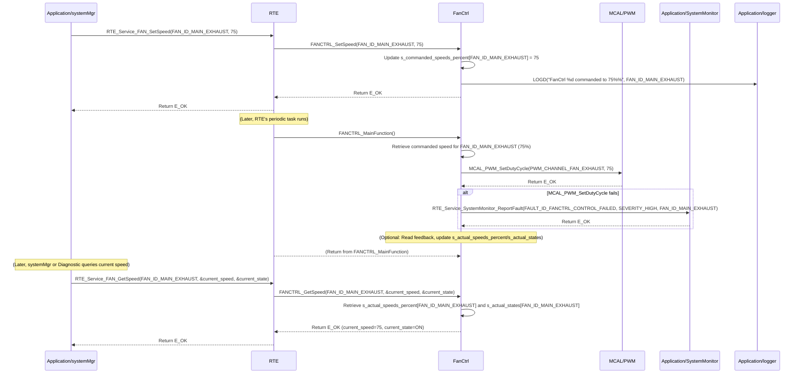

# **Detailed Design Document: FanCtrl (Fan Control) Component**

## **1. Introduction**

### **1.1. Purpose**

This document details the design of the FanCtrl component. Its primary purpose is to provide a high-level interface for controlling and monitoring various fan types (e.g., DC fans via PWM, relay-controlled AC fans) within the system. It abstracts the complexities of the underlying hardware drivers (PWM, GPIO). This module is designed to **periodically monitor its commanded state/speed and apply it to the hardware**, ensuring consistent fan operation. It also provides an interface to retrieve the current fan speed or state.

### **1.2. Scope**

The scope of this document covers the FanCtrl module's architecture, functional behavior, interfaces, dependencies, and resource considerations. It details how FanCtrl manages its own periodic application of commanded states to the hardware and provides the current fan status to modules like systemMgr (via RTE services).

### **1.3. References**

* Software Architecture Document (SAD) - Smart Device Firmware (Final Version)  
* Detailed Design Document: RTE  
* Detailed Design Document: MCAL_PWM (for PWM-controlled fans)  
* Detailed Design Document: MCAL_GPIO (for relay-controlled fans or feedback)  
* Detailed Design Document: MCAL_ADC (if analog feedback for speed)  
* Fan Motor Datasheet (e.g., DC fan, AC fan with relay, variable speed fan)

## **2. Functional Description**

The FanCtrl component provides the following core functionalities:

1. **Initialization (FanCtrl_Init)**: Initialize all configured fan control hardware (PWM channels, GPIOs for relays/feedback). **All module internal variables, including the commanded speed/state and current feedback, shall be initialized to safe default values (e.g., OFF state, 0% speed).**  
2. **Set Commanded Speed/State (FANCTRL_SetSpeed)**: This function allows other modules (e.g., systemMgr) to command a desired fan speed (for PWM fans) or state (ON/OFF for relay fans). This function **only updates the internal commanded state**; the actual hardware control is performed periodically by FANCTRL_MainFunction.  
3. **Periodic Control & Feedback (FANCTRL_MainFunction)**: This is the module's primary periodic function. It is responsible for:  
   * Reading the internally stored commanded speed/state.  
   * Applying this commanded value to the physical fan hardware using the appropriate MCAL/HAL drivers.  
   * (Optional) Reading feedback from the fan (e.g., tachometer, current sensor) to determine its actual operating speed/state.  
   * (Optional) Comparing actual feedback with the commanded state and reporting discrepancies or failures to SystemMonitor.  
   * Reporting faults to SystemMonitor (including the actuatorId) if the fan fails to respond or feedback indicates a malfunction.  
4. **Get Current Speed/State (FANCTRL_GetSpeed)**: Provide a non-blocking interface to retrieve the last applied commanded speed/state, or the actual measured speed/state if feedback is implemented.  
5. **Error Reporting**: Detect and report any failures during fan control (e.g., hardware not responding, feedback out of range) to the SystemMonitor via RTE_Service_SystemMonitor_ReportFault().

## **3. Non-Functional Requirements**

### **3.1. Performance**

* **Responsiveness (Control)**: The FANCTRL_MainFunction should execute frequently enough to ensure the fan responds promptly to commanded changes (defined by FANCTRL_CONTROL_PERIOD_MS).  
* **Responsiveness (Getter)**: The FANCTRL_GetSpeed() function shall be non-blocking and return immediately, as it only retrieves an already stored value.  
* **Control Accuracy**: PWM duty cycle or relay state shall accurately reflect the commanded speed/state.

### **3.2. Memory**

* **Minimal Footprint**: The FanCtrl module shall have a minimal memory footprint, considering the number of configured fans.

### **3.3. Reliability**

* **Robustness**: The module shall be robust against hardware control failures.  
* **Fail-Safe**: In case of critical errors, the fan should transition to a safe state (e.g., turn off or go to a predefined speed).  
* **Feedback Monitoring (Optional but Recommended)**: If feedback is implemented, the module should detect and report discrepancies between commanded and actual states.

## **4. Architectural Context**

As per the SAD (Section 3.1.2, Application Layer), FanCtrl resides in the Application Layer. It manages its own actuator control process via its FANCTRL_MainFunction, which is called periodically by a generic RTE periodic task (e.g., RTE_PeriodicTask_HighPrio_100ms). Other modules, such as systemMgr, will command FanCtrl using FANCTRL_SetSpeed(actuatorId, speed/state) and query its status using FANCTRL_GetSpeed(actuatorId).

## **5. Design Details**

### **5.1. Module Structure**

The FanCtrl component will consist of the following files:

* Application/fan/inc/fanctrl.h: Public header file containing function prototypes and fan-specific definitions.  
* Application/fan/src/fanctrl.c: Source file containing the implementation of fan control logic and the internal periodic update function.  
* Application/fan/cfg/fanctrl_cfg.h: Configuration header for fan types, control interface details (e.g., PWM channels, GPIO pins), and periodic control settings.

### **5.2. Public Interface (API)**

// In Application/fan/inc/fanctrl.h
```c
#include "Application/common/inc/common.h" // For APP_Status_t  
#include <stdint.h> // For uint32_t  
#include <stdbool.h> // For bool

// --- Fan State/Speed Definitions ---  
typedef enum {  
    FANCTRL_STATE_OFF = 0,  
    FANCTRL_STATE_ON,  
    // Add more states if needed for multi-speed relay fans  
} FanCtrl_State_t;

// For PWM fans, speed is typically 0-100%  
#define FANCTRL_MIN_PWM_SPEED_PERCENT   0  
#define FANCTRL_MAX_PWM_SPEED_PERCENT   100

// --- Public Functions ---

/**  
 * @brief Initializes the FanCtrl module and all configured fan control hardware.  
 * All module-internal variables and fan states are initialized to a safe,  
 * known state (e.g., OFF or 0% speed).  
 * @return E_OK on success, E_NOK on failure.  
 */  
APP_Status_t FanCtrl_Init(void);

/**  
 * @brief Commands a desired fan speed (for PWM fans) or state (ON/OFF for relay fans).  
 * This function only updates the internal commanded state. The actual hardware control  
 * is performed periodically by FANCTRL_MainFunction.  
 * @param actuatorId The unique ID of the fan to control.  
 * @param speed_percent For PWM fans: desired speed in percentage (0-100).  
 * For relay fans: interpreted as ON (if > 0) or OFF (if 0).  
 * @return E_OK on successful command update, E_NOK if the actuatorId is invalid  
 * or the speed_percent is out of range.  
 */  
APP_Status_t FanCtrl_SetSpeed(uint32_t actuatorId, uint8_t speed_percent);

/**  
 * @brief Gets the last commanded speed/state, or the actual measured speed/state if feedback is implemented.  
 * This is a non-blocking getter function.  
 * @param actuatorId The unique ID of the fan to retrieve data from.  
 * @param speed_percent Pointer to store the current speed in percentage (0-100).  
 * @param state Pointer to store the current ON/OFF state.  
 * @return E_OK on successful retrieval, E_NOK if the actuatorId is invalid,  
 * or any pointer is NULL.  
 */  
APP_Status_t FanCtrl_GetSpeed(uint32_t actuatorId, uint8_t *speed_percent, FanCtrl_State_t *state);

// --- Internal Periodic Runnable Prototype (called by RTE) ---  
// This function is declared here so RTE can call it.  
/**  
 * @brief Performs the periodic fan control, applying the commanded state to hardware,  
 * and optionally reading feedback. This function is intended to be called periodically by an RTE task.  
 */  
void FanCtrl_MainFunction(void);
```
### **5.3. Internal Design**

The FanCtrl module will manage its own fan control cycle for multiple fans.

1. **Internal State**:  
```c
   // Array to store the latest commanded speed for each fan (0-100%)  
   static uint8_t s_commanded_speeds_percent[FANCTRL_COUNT];  
   // Array to store the latest reported actual speed (if feedback is implemented)  
   static uint8_t s_actual_speeds_percent[FANCTRL_COUNT];  
   // Array to store the latest reported actual state (ON/OFF)  
   static FanCtrl_State_t s_actual_states[FANCTRL_COUNT];  
   static bool s_is_initialized = false; // Module initialization status
```
   * All these variables will be initialized in FanCtrl_Init(). s_commanded_speeds_percent will be initialized to 0. s_actual_speeds_percent will be initialized to 0. s_actual_states will be initialized to FANCTRL_STATE_OFF.  
2. **Initialization (FanCtrl_Init)**:  
   * **Zeroing Variables**:  
     * Initialize all elements of s_commanded_speeds_percent to 0.  
     * Initialize all elements of s_actual_speeds_percent to 0.  
     * Initialize all elements of s_actual_states to FANCTRL_STATE_OFF.  
     * s_is_initialized = false;.  
   * **Control Interface Init (for each configured fan)**:  
     * Iterate through fan_configs array (defined in fanctrl_cfg.h).  
     * For each fan_config:  
       * Based on fan_config.type:  
         * If FANCTRL_TYPE_PWM: Call MCAL_PWM_Init() for the fan_config.pwm_channel.  
         * If FANCTRL_TYPE_RELAY: Call MCAL_GPIO_Init() for the fan_config.relay_gpio_pin (as output).  
       * (Optional) If feedback is configured:  
         * If FANCTRL_FEEDBACK_TYPE_TACHOMETER: Call MCAL_GPIO_Init() for the fan_config.feedback_gpio_pin (as input with interrupt).  
         * If FANCTRL_FEEDBACK_TYPE_ANALOG_ADC: Call MCAL_ADC_Init() for the fan_config.feedback_adc_channel.  
       * If any underlying MCAL/HAL initialization fails, report FAULT_ID_FANCTRL_INIT_FAILED to SystemMonitor with fan_config.id as data. Log an error.  
   * s_is_initialized = true; on overall success.  
   * Return E_OK.  
3. **Set Commanded Speed/State (FANCTRL_SetSpeed)**:  
   * If !s_is_initialized, return E_NOK and log a warning.  
   * Validate actuatorId. If actuatorId >= FANCTRL_COUNT, return E_NOK and log a warning.  
   * Validate speed_percent (0-100). If out of range, clamp or return E_NOK.  
   * Update s_commanded_speeds_percent[actuatorId] = speed_percent;.  
   * Log LOGD("FanCtrl %d commanded to %d%%", actuatorId, speed_percent);  
   * Return E_OK.  
4. **Periodic Control & Feedback (FANCTRL_MainFunction)**:  
   * This function is called periodically by a generic RTE task (e.g., RTE_PeriodicTask_HighPrio_100ms).  
   * If !s_is_initialized, return immediately.  
   * **Iterate through all configured fans**:  
     * For each fan_config in fan_configs:  
       * **Apply Commanded State**:  
         * Retrieve commanded_speed = s_commanded_speeds_percent[fan_config.id].  
         * If fan_config.type == FANCTRL_TYPE_PWM:  
           * Call MCAL_PWM_SetDutyCycle(fan_config.pwm_channel, commanded_speed).  
         * If fan_config.type == FANCTRL_TYPE_RELAY:  
           * MCAL_GPIO_WritePin(fan_config.relay_gpio_pin, (commanded_speed > 0) ? GPIO_STATE_HIGH : GPIO_STATE_LOW).  
       * **Read Feedback (Optional)**:  
         * If fan_config.feedback_type is configured:  
           * Read raw feedback data using appropriate MCAL/HAL function.  
           * Convert raw data to actual speed/state.  
           * Update s_actual_speeds_percent[fan_config.id] and s_actual_states[fan_config.id].  
           * **Feedback Validation**: Compare s_actual_speeds_percent[fan_config.id] with s_commanded_speeds_percent[fan_config.id]. If there's a significant deviation or unexpected state (e.g., commanded ON but actual OFF), report FAULT_ID_FANCTRL_FEEDBACK_MISMATCH to SystemMonitor with fan_config.id as data (severity MEDIUM).  
       * If any MCAL/HAL call fails during control, report FAULT_ID_FANCTRL_CONTROL_FAILED to SystemMonitor with fan_config.id as data (severity HIGH). Log an error.  
5. **Get Current Speed/State (FANCTRL_GetSpeed)**:  
   * Validate pointers (speed_percent, state). If NULL, return E_NOK and log a warning.  
   * Validate actuatorId. If actuatorId >= FANCTRL_COUNT, return E_NOK and log a warning.  
   * Copy s_actual_speeds_percent[actuatorId] to *speed_percent.  
   * Copy s_actual_states[actuatorId] to *state.  
   * Return E_OK.

**Sequence Diagram (Example: systemMgr commands fan speed, FanCtrl applies it):**

### **5.4. Dependencies**

* Application/common/inc/common.h: For APP_Status_t.  
* Application/logger/inc/logger.h: For logging errors and warnings.  
* Application/SystemMonitor/inc/system_monitor.h: For SystemMonitor_FaultId_t (e.g., FAULT_ID_FANCTRL_INIT_FAILED, FAULT_ID_FANCTRL_CONTROL_FAILED, FAULT_ID_FANCTRL_FEEDBACK_MISMATCH).  
* Rte/inc/Rte.h: For calling RTE_Service_SystemMonitor_ReportFault().  
* Mcal/pwm/inc/mcal_pwm.h: If using PWM-controlled fans.  
* Mcal/gpio/inc/mcal_gpio.h: If using relay-controlled fans or GPIO-based tachometer feedback.  
* Mcal/adc/inc/mcal_adc.h: If using analog feedback for fan speed.  
* Service/os/inc/service_os.h: For delays (SERVICE_OS_DelayMs, SERVICE_OS_DelayUs) if needed for specific fan control protocols.

### **5.5. Error Handling**

* **Initialization Failure**: If underlying MCAL/HAL initialization for any fan fails, FAULT_ID_FANCTRL_INIT_FAILED is reported to SystemMonitor with the actuatorId.  
* **Control Failure**: If applying the commanded state to hardware fails (e.g., PWM driver error, GPIO write error) in FANCTRL_MainFunction(), FAULT_ID_FANCTRL_CONTROL_FAILED is reported to SystemMonitor with the actuatorId.  
* **Feedback Mismatch (Optional)**: If feedback is implemented and indicates a significant deviation from the commanded state, FAULT_ID_FANCTRL_FEEDBACK_MISMATCH is reported to SystemMonitor.  
* **Input Validation**: FANCTRL_SetSpeed and FANCTRL_GetSpeed validate their actuatorId and pointers to prevent invalid access or NULL dereferences.

### **5.6. Configuration**

The Application/fan/cfg/fanctrl_cfg.h file will contain:

* **Fan Count**: FANCTRL_COUNT.  
* **Fan IDs**: Define unique enum values for each fan (e.g., FAN_ID_MAIN_EXHAUST, FAN_ID_AUX_COOLING).  
* **Fan Type Enums**: FanCtrl_Type_t (e.g., FANCTRL_TYPE_PWM, FANCTRL_TYPE_RELAY).  
* **Feedback Type Enums (Optional)**: FanCtrl_FeedbackType_t (e.g., FANCTRL_FEEDBACK_TYPE_NONE, FANCTRL_FEEDBACK_TYPE_TACHOMETER, FANCTRL_FEEDBACK_TYPE_ANALOG_ADC).  
* **Fan Configuration Array**: An array of FanCtrl_Config_t structures, defining each fan's properties:  
  * id: Unique actuatorId.  
  * type: FANCTRL_TYPE_PWM or FANCTRL_TYPE_RELAY.  
  * control_details: Union or struct containing specific control parameters (e.g., pwm_channel, relay_gpio_pin).  
  * feedback_type: FANCTRL_FEEDBACK_TYPE_NONE, FANCTRL_FEEDBACK_TYPE_TACHOMETER, FANCTRL_FEEDBACK_TYPE_ANALOG_ADC.  
  * feedback_details (Optional): Union or struct for feedback parameters (e.g., tachometer_gpio_pin, adc_channel).  
* **Periodic Control Settings**:  
  * FANCTRL_CONTROL_PERIOD_MS: The frequency at which FANCTRL_MainFunction() is called by RTE.

// Example: Application/fan/cfg/fanctrl_cfg.h
```c
#include "Mcal/pwm/inc/mcal_pwm.h" // Example for PWM channel definitions  
#include "Mcal/gpio/inc/mcal_gpio.h" // Example for GPIO pin definitions  
#include "Mcal/adc/inc/mcal_adc.h" // Example for ADC channel definitions

// --- Fan Type Enums ---  
typedef enum {  
    FANCTRL_TYPE_PWM,  
    FANCTRL_TYPE_RELAY  
    // Add more types as needed  
} FanCtrl_Type_t;

// --- Fan Feedback Type Enums ---  
typedef enum {  
    FANCTRL_FEEDBACK_TYPE_NONE,  
    FANCTRL_FEEDBACK_TYPE_TACHOMETER, // Pulse counting  
    FANCTRL_FEEDBACK_TYPE_ANALOG_ADC  // Analog voltage proportional to speed  
    // Add more types as needed  
} FanCtrl_FeedbackType_t;

// --- Fan Control Details Union ---  
typedef union {  
    struct {  
        uint8_t pwm_channel;  
    } pwm;  
    struct {  
        uint8_t relay_gpio_pin;  
    } relay;  
} FanCtrl_ControlDetails_t;

// --- Fan Feedback Details Union (Optional) ---  
typedef union {  
    struct {  
        uint8_t tachometer_gpio_pin;  
        // Add parameters for pulse-to-RPM conversion  
    } tachometer;  
    struct {  
        uint8_t adc_channel;  
        float voltage_to_speed_slope;  
        float voltage_to_speed_offset;  
    } analog_adc;  
} FanCtrl_FeedbackDetails_t;

// --- Fan Configuration Structure ---  
typedef struct {  
    uint32_t id; // Unique ID for this fan instance  
    FanCtrl_Type_t type;  
    FanCtrl_ControlDetails_t control_details;  
    FanCtrl_FeedbackType_t feedback_type;  
    FanCtrl_FeedbackDetails_t feedback_details; // Optional, only if feedback_type != NONE  
} FanCtrl_Config_t;

// --- Fan IDs ---  
typedef enum {  
    FAN_ID_MAIN_EXHAUST = 0,  
    FAN_ID_AUX_COOLING,  
    // Add more fan IDs as needed  
    FANCTRL_COUNT // Total number of configured fans  
} FanCtrl_Id_t;

// --- Array of Fan Configurations ---  
const FanCtrl_Config_t fan_configs[FANCTRL_COUNT] = {  
    {  
        .id = FAN_ID_MAIN_EXHAUST,  
        .type = FANCTRL_TYPE_PWM,  
        .control_details.pwm = {  
            .pwm_channel = MCAL_PWM_CHANNEL_0  
        },  
        .feedback_type = FANCTRL_FEEDBACK_TYPE_TACHOMETER,  
        .feedback_details.tachometer = {  
            .tachometer_gpio_pin = MCAL_GPIO_PIN_10  
        }  
    },  
    {  
        .id = FAN_ID_AUX_COOLING,  
        .type = FANCTRL_TYPE_RELAY,  
        .control_details.relay = {  
            .relay_gpio_pin = MCAL_GPIO_PIN_11  
        },  
        .feedback_type = FANCTRL_FEEDBACK_TYPE_NONE // No feedback for this fan  
    },  
    // Add more fan configurations here  
};

// --- Periodic Control Settings for FANCTRL_MainFunction() ---  
#define FANCTRL_CONTROL_PERIOD_MS             100 // FANCTRL_MainFunction called every 100 ms
```
### **5.7. Resource Usage**

* **Flash**: Low to moderate, depending on the number of fan types and feedback mechanisms supported.  
* **RAM**: Low, for internal state arrays (s_commanded_speeds_percent, s_actual_speeds_percent, s_actual_states) proportional to FANCTRL_COUNT, and temporary buffers.  
* **CPU**: Low, as FANCTRL_MainFunction involves simple read/write operations to MCAL/HAL and minimal processing.

## **6. Test Considerations**

### **6.1. Unit Testing**

* **Mock Dependencies**: Unit tests for FanCtrl will mock MCAL_PWM_Init(), MCAL_PWM_SetDutyCycle(), MCAL_GPIO_Init(), MCAL_GPIO_WritePin(), MCAL_GPIO_ReadPin() (for tachometer), MCAL_ADC_Read() (for analog feedback), RTE_Service_SystemMonitor_ReportFault().  
* **Test Cases**:  
  * FanCtrl_Init: Verify correct MCAL/HAL initialization calls for all configured fans. Test initialization failure and fault reporting per fan. Verify internal variables are initialized (e.g., speeds to 0, states to OFF).  
  * FANCTRL_SetSpeed:  
    * Test setting valid speeds (0-100%). Verify internal s_commanded_speeds_percent is updated.  
    * Test with invalid actuatorId (out of range).  
    * Test with out-of-range speed_percent (e.g., >100).  
  * FANCTRL_MainFunction:  
    * Test applying commanded speeds for PWM fans: Set s_commanded_speeds_percent and verify MCAL_PWM_SetDutyCycle() is called with the correct value.  
    * Test applying commanded states for relay fans: Set s_commanded_speeds_percent (0 or >0) and verify MCAL_GPIO_WritePin() is called with the correct state.  
    * Test feedback (if implemented): Mock MCAL_GPIO_ReadPin() or MCAL_ADC_Read() to simulate various actual speeds. Verify s_actual_speeds_percent and s_actual_states are updated correctly.  
    * Test feedback mismatch: Mock feedback to be inconsistent with commanded state and verify FAULT_ID_FANCTRL_FEEDBACK_MISMATCH is reported.  
    * Test MCAL/HAL control failure: Mock MCAL_PWM_SetDutyCycle() or MCAL_GPIO_WritePin() to return an error and verify FAULT_ID_FANCTRL_CONTROL_FAILED is reported.  
  * FANCTRL_GetSpeed:  
    * Test after FANCTRL_SetSpeed() and FANCTRL_MainFunction(): Verify it returns the last updated s_actual_speeds_percent and s_actual_states.  
    * Test with invalid actuatorId.  
    * Test with NULL pointers.

### **6.2. Integration Testing**

* **FanCtrl-MCAL/HAL Integration**: Verify that FanCtrl correctly interfaces with the actual MCAL/HAL drivers and all physical fans.  
* **RTE Integration**: Verify that FANCTRL_MainFunction() is called periodically by the configured RTE task.  
* **SystemMgr Integration**: Verify that systemMgr correctly commands fan speeds via FANCTRL_SetSpeed() and retrieves status via FANCTRL_GetSpeed().  
* **Fault Injection**: Disconnect fan motors, block fan blades (if safe), or introduce errors on control/feedback lines, and verify that FanCtrl reports appropriate faults to SystemMonitor.

### **6.3. System Testing**

* **End-to-End Control Loop**: Verify that the system's overall control loop (e.g., temperature reading -> systemMgr fan control logic -> FanCtrl actuation) functions correctly.  
* **Operational Range Testing**: Test fan operation across its full commanded speed range (0-100%) and verify physical fan response.  
* **Long-Term Reliability**: Run the system for extended periods to ensure continuous and reliable fan control, observing fault reports and fan performance.