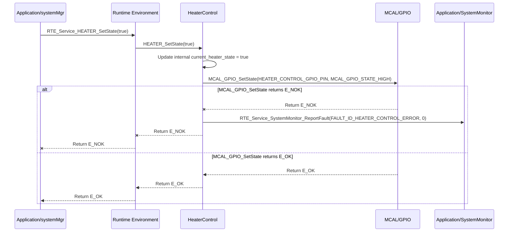

# **Detailed Design Document: HeaterControl Component**

## **1. Introduction**

### **1.1. Purpose**

This document details the design of the HeaterControl component. Its primary purpose is to provide a high-level interface for controlling the heating element (e.g., a simple on/off resistive heater or a multi-stage heater) within the environmental monitoring and control system. It abstracts the complexities of the underlying GPIO (General Purpose Input/Output) driver used to switch the heater's relay, allowing systemMgr to simply command the heater's state (on/off).

### **1.2. Scope**

The scope of this document covers the heater module's architecture, functional behavior, interfaces, dependencies, and resource considerations. It details how heater receives control commands from systemMgr (via RTE services) and interacts with the underlying MCAL_GPIO driver for physical heater control.

### **1.3. References**

* Software Architecture Document (SAD) - Smart Device Firmware (Final Version)  
* Detailed Design Document: RTE  
* Detailed Design Document: MCAL_GPIO  
* Heater Element Datasheet (Conceptual)  
* Relay Module Datasheet (Conceptual)

## **2. Functional Description**

The HeaterControl component provides the following core functionalities:

1. **Initialization**: Initialize the GPIO pin connected to the heater's control relay to a safe default state (e.g., heater off).  
2. **Set Heater State**: Turn the heating element on or off.  
3. **Get Heater State**: Retrieve the currently commanded state of the heater.  
4. **Error Reporting**: Report any failures during heater control (e.g., GPIO initialization failure, inability to set pin state) to the SystemMonitor via RTE_Service_SystemMonitor_ReportFault().

## **3. Non-Functional Requirements**

### **3.1. Performance**

* **Responsiveness**: Heater state changes should be applied promptly after a command.

### **3.2. Memory**

* **Minimal Footprint**: The heater module shall have a minimal memory footprint.

### **3.3. Reliability**

* **Robustness**: The module shall be robust against invalid state commands or underlying hardware failures.  
* **Fail-Safe**: In case of critical errors, the heater should revert to a safe state (e.g., off) to prevent overheating or fire hazards.

## **4. Architectural Context**

As per the SAD (Section 3.1.2, Application Layer), heater resides in the Application Layer. It receives heater control commands from systemMgr (via RTE_Service_HEATER_SetState()). It then interacts with the MCAL_GPIO driver to toggle the relay controlling the physical heating element.

## **5. Design Details**

### **5.1. Module Structure**

The HeaterControl component will consist of the following files:

* HeaterControl/inc/heater.h: Public header file containing function prototypes and heater-specific definitions.  
* HeaterControl/src/heater.c: Source file containing the implementation of heater control logic.  
* HeaterControl/cfg/heater_cfg.h: Configuration header for the heater control GPIO pin and default state.

### **5.2. Public Interface (API)**

// In HeaterControl/inc/heater.h

```c
#include "Application/common/inc/common.h" // For APP_Status_t  
#include <stdbool.h> // For bool

// --- Public Functions ---

/**  
 * @brief Initializes the Heater module and its associated GPIO pin.  
 * Sets the heater to a safe default state (e.g., off).  
 * @return E_OK on success, E_NOK on failure.  
 */  
APP_Status_t HEATER_Init(void);

/**  
 * @brief Sets the state of the heating element (on or off).  
 * @param on True to turn the heater on, false to turn it off.  
 * @return E_OK on success, E_NOK on failure.  
 */  
APP_Status_t HEATER_SetState(bool on);

/**  
 * @brief Gets the currently commanded state of the heater.  
 * @param state Pointer to store the current heater state (true for on, false for off).  
 * @return E_OK on success, E_NOK on failure.  
 */  
APP_Status_t HEATER_GetState(bool *state);

// Add API for reading heater feedback (e.g., temperature sensor near heater) if applicable  
// APP_Status_t HEATER_GetTemperature(float *temperature);
```

### **5.3. Internal Design**

The HeaterControl module will maintain the current commanded heater state internally. It will translate the boolean state into a GPIO high/low signal and interact with the MCAL layer.

1. **Initialization (HEATER_Init)**:  
   * Call MCAL_GPIO_Init() for the HEATER_CONTROL_GPIO_PIN, configuring it as an output.  
   * Set the heater to its default safe state (e.g., HEATER_SetState(false) to turn it off).  
   * If MCAL_GPIO_Init() fails, report FAULT_ID_HEATER_INIT_FAILED to SystemMonitor via RTE_Service_SystemMonitor_ReportFault().  
   * Return E_OK.  
2. **Set Heater State (HEATER_SetState)**:  
   * Update an internal static bool current_heater_state;.  
   * Call MCAL_GPIO_SetState(HEATER_CONTROL_GPIO_PIN, on ? MCAL_GPIO_STATE_HIGH : MCAL_GPIO_STATE_LOW).  
   * If MCAL_GPIO_SetState() fails, report FAULT_ID_HEATER_CONTROL_ERROR to SystemMonitor.  
   * Return E_OK.  
3. **Get Heater State (HEATER_GetState)**:  
   * Validate state pointer.  
   * Copy the current_heater_state to the provided pointer.  
   * Return E_OK.

**Sequence Diagram (Example: systemMgr Turns Heater On):**



### **5.4. Dependencies**

* **Application/common/inc/common.h**: For APP_Status_t.  
* **Application/logger/inc/logger.h**: For logging heater control events and errors.  
* **Application/SystemMonitor/inc/system_monitor.h**: For SystemMonitor_FaultId_t (e.g., FAULT_ID_HEATER_INIT_FAILED).  
* **Rte/inc/Rte.h**: For calling RTE_Service_SystemMonitor_ReportFault().  
* **Mcal/gpio/inc/mcal_gpio.h**: For GPIO control of the heater relay.

### **5.5. Error Handling**

* **Initialization Failure**: If GPIO initialization fails, FAULT_ID_HEATER_INIT_FAILED is reported to SystemMonitor.  
* **Control Hardware Failure**: If MCAL_GPIO_SetState() returns an error, FAULT_ID_HEATER_CONTROL_ERROR is reported.  
* **Fail-Safe**: In a critical system fault (managed by systemMgr and SystemMonitor), systemMgr would command HEATER_SetState(false) to turn the heater off as a primary safety measure.

### **5.6. Configuration**

The HeaterControl/cfg/heater_cfg.h file will contain:

* HEATER_CONTROL_GPIO_PIN: The specific GPIO pin connected to the heater's control relay.  
* HEATER_DEFAULT_STATE_ON: A boolean indicating the default state (false for off, true for on). Typically false.

// Example: HeaterControl/cfg/heater_cfg.h

# define HEATER_CONTROL_GPIO_PIN         20 // Example GPIO pin for heater relay control  
# define HEATER_DEFAULT_STATE_ON         false // Heater is off by default

### **5.7. Resource Usage**

* **Flash**: Low.  
* **RAM**: Very low, primarily for current_heater_state.  
* **CPU**: Very low. GPIO toggling is a fast operation.

## **6. Test Considerations**

### **6.1. Unit Testing**

* **Mock Dependencies**: Unit tests for heater will mock MCAL_GPIO_Init(), MCAL_GPIO_SetState(), and RTE_Service_SystemMonitor_ReportFault().  
* **Test Cases**:  
  * HEATER_Init: Verify correct MCAL initialization calls and default heater state. Test initialization failure and fault reporting.  
  * HEATER_SetState:  
    * Test with true and false states. Mock MCAL_GPIO_SetState() to verify correct GPIO level is commanded.  
    * Test underlying MCAL failures (e.g., MCAL_GPIO_SetState returns E_NOK) and verify FAULT_ID_HEATER_CONTROL_ERROR is reported.  
  * HEATER_GetState: Verify it returns the last commanded state.

### **6.2. Integration Testing**

* **Heater-MCAL Integration**: Verify that heater correctly interfaces with the actual MCAL_GPIO driver and the physical heater relay.  
* **Visual/Electrical Verification**: Observe the relay state (e.g., LED on relay module) or measure voltage across the heater terminals to confirm on/off state.  
* **SystemMgr Control**: Verify that systemMgr can effectively turn the heater on and off via RTE_Service_HEATER_SetState().  
* **Fault Injection**: Disconnect the heater relay control wire or cause a short on the GPIO and verify that heater reports FAULT_ID_HEATER_CONTROL_ERROR (if feedback mechanisms are in place, otherwise it's a passive module).

### **6.3. System Testing**

* **End-to-End Control Loop**: Verify that the system's overall control loop (sensor read -> systemMgr logic -> heater control) functions correctly across the entire operational temperature range.  
* **Safety Testing**: Verify that the heater correctly turns off in fail-safe scenarios (e.g., critical temperature sensor failure).  
* **Long-Term Operation**: Run the system for extended periods to ensure heater control reliability.
