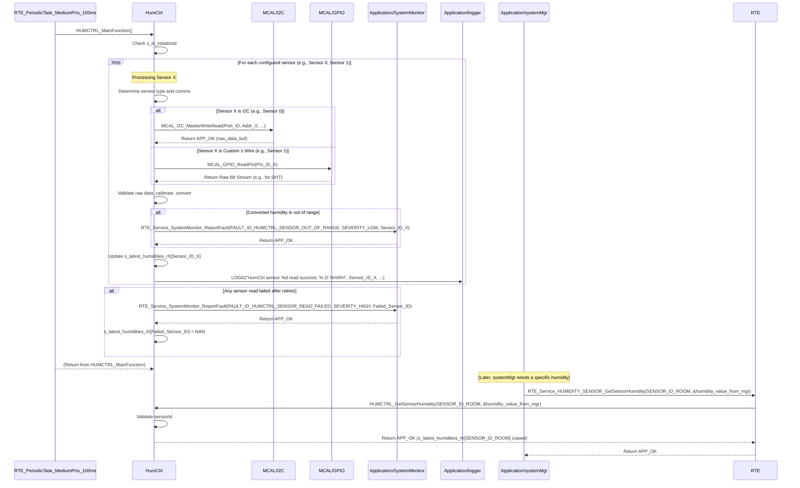

# **Detailed Design Document: HumCtrl (Humidity Control) Component**

## **1. Introduction**

### **1.1. Purpose**

This document details the design of the HumCtrl component. Its primary purpose is to provide a high-level interface for acquiring humidity data from multiple humidity sensors. It abstracts the complexities of the underlying analog (ADC) or digital (I2C, SPI, or custom GPIO protocol) sensor drivers. This module is designed to **periodically read all configured sensors, process their data, and maintain the latest valid humidity internally for each sensor**, allowing other modules like systemMgr to simply request these readily available, up-to-date values by specifying a sensorId.

### **1.2. Scope**

The scope of this document covers the HumCtrl module's architecture, functional behavior, interfaces, dependencies, and resource considerations. It details how HumCtrl manages its own periodic sensor reads for multiple sensors and provides the latest humidity values to modules like systemMgr (via RTE services).

### **1.3. References**

* Software Architecture Document (SAD) - Smart Device Firmware (Final Version)  
* Detailed Design Document: RTE  
* Detailed Design Document: MCAL_ADC (if analog humidity sensor)  
* Detailed Design Document: MCAL_I2C (if I2C humidity sensor)  
* Detailed Design Document: MCAL_SPI (if SPI humidity sensor)  
* Detailed Design Document: MCAL_GPIO (if custom digital protocol)  
* Humidity Sensor Datasheet (e.g., DHT11/22, SHT3x, HIH-4030)

## **2. Functional Description**

The HumCtrl component provides the following core functionalities:

1. **Initialization (HumCtrl_Init)**: Initialize all configured sensor communication interfaces and perform any sensor-specific power-up or configuration sequences. **All module internal variables, including the storage for sensor readings, shall be initialized to safe default values (e.g., zeroes or NaN for floating-point values).**  
2. **Periodic Sensor Read & Update (HUMCTRL_MainFunction)**: This is the module's primary periodic function. It is responsible for:  
   * Iterating through all configured humidity sensors.  
   * Acquiring the current humidity value from each sensor.  
   * Performing raw data validation, calibration, and conversion to Relative Humidity (RH).  
   * Storing the **latest valid humidity reading** in an internal array, indexed by sensorId.  
   * Implementing retry logic for transient sensor read failures for each sensor.  
   * Reporting faults to SystemMonitor (including the sensorId) if reads consistently fail or are out of range.  
3. **Get Latest Humidity (HUMCTRL_GetSensorHumidity)**: Provide a non-blocking interface to retrieve the last successfully read and stored humidity value for a specific sensorId.  
4. **Error Reporting**: Detect and report any failures during sensor communication or data acquisition (e.g., sensor not responding, CRC error, out-of-range reading) to the SystemMonitor via RTE_Service_SystemMonitor_ReportFault().

## **3. Non-Functional Requirements**

### **3.1. Performance**

* **Accuracy**: Humidity measurements shall be accurate within specified tolerances (refer to HwReqirement.md).  
* **Update Rate**: The HUMCTRL_MainFunction should execute frequently enough to provide fresh data for the control loop (defined by HUMCTRL_READ_PERIOD_MS).  
* **Responsiveness (Getter)**: The HUMCTRL_GetSensorHumidity() function shall be non-blocking and return immediately, as it only retrieves an already stored value.

### **3.2. Memory**

* **Minimal Footprint**: The HumCtrl module shall have a minimal memory footprint, considering the number of configured sensors.

### **3.3. Reliability**

* **Robustness**: The module shall be robust against sensor communication errors or invalid readings.  
* **Data Validity**: Implement checks for out-of-range or obviously erroneous sensor data.  
* **Retry Mechanism**: Implement a retry mechanism for transient sensor read failures.

## **4. Architectural Context**

As per the SAD (Section 3.1.2, Application Layer), HumCtrl resides in the Application Layer. It manages its own sensor reading process via its HUMCTRL_MainFunction, which is called periodically by a generic RTE periodic task (e.g., RTE_PeriodicTask_MediumPrio_100ms). Other modules, such as systemMgr, will then query HumCtrl using HUMCTRL_GetSensorHumidity(sensorId) to obtain the latest available humidity data for a specific sensor.

## **5. Design Details**

### **5.1. Module Structure**

The HumCtrl component will consist of the following files:

* Application/humctrl/inc/humctrl.h: Public header file containing function prototypes and humidity-specific definitions.  
* Application/humctrl/src/humctrl.c: Source file containing the implementation of humidity sensor reading logic and the internal periodic update function.  
* Application/humctrl/cfg/humctrl_cfg.h: Configuration header for sensor types, communication interface details (e.g., ADC channels, I2C addresses), calibration parameters, and periodic read settings.

### **5.2. Public Interface (API)**

// In Application/humctrl/inc/humctrl.h
```c
#include "Application/common/inc/app_common.h" // For APP_Status_t  
#include <stdint.h> // For uint32_t  
#include <stdbool.h> // For bool

// --- Public Functions ---

/**  
 * @brief Initializes the HumCtrl module and all configured humidity sensor hardware.  
 * All module-internal variables and sensor data storage are initialized to a safe,  
 * known state (e.g., zeroes or NaN).  
 * @return APP_OK on success, APP_ERROR on failure.  
 */  
APP_Status_t HumCtrl_Init(void);

/**  
 * @brief Gets the last successfully read and stored humidity value for a specific sensor.  
 * This is a non-blocking getter function. The actual sensor reading for all sensors is  
 * performed periodically by the internal HumCtrl_MainFunction.  
 * @param sensorId The unique ID of the sensor to retrieve data from.  
 * @param humidity_rh Pointer to store the latest humidity value in Relative Humidity (%).  
 * @return APP_OK on successful retrieval, APP_ERROR if the sensorId is invalid,  
 * the pointer is NULL, or no valid data is available for that sensor.  
 */  
APP_Status_t HumCtrl_GetSensorHumidity(uint32_t sensorId, float *humidity_rh);

// --- Internal Periodic Runnable Prototype (called by RTE) ---  
// This function is declared here so RTE can call it.  
/**  
 * @brief Performs the periodic humidity sensor reading, validation, and internal data update  
 * for all configured sensors. This function is intended to be called periodically by an RTE task.  
 */  
void HumCtrl_MainFunction(void);
```
### **5.3. Internal Design**

The HumCtrl module will manage its own sensor reading cycle for multiple sensors.

1. **Internal State**:  
```c
   // Array to store the latest valid humidity reading for each sensor  
   static float s_latest_humidities_rh[HUMCTRL_SENSOR_COUNT];  
   // Array to store the timestamp of the last successful read for each sensor  
   static uint32_t s_last_read_timestamps_ms[HUMCTRL_SENSOR_COUNT];  
   static bool s_is_initialized = false; // Module initialization status
```
   * All these variables will be initialized in HumCtrl_Init(). s_latest_humidities_rh elements will be initialized to NAN (Not a Number) or a specific error value to indicate no valid data yet.  
2. **Initialization (HumCtrl_Init)**:  
   * **Zeroing Variables**:  
     * Initialize all elements of s_latest_humidities_rh to NAN.  
     * Initialize all elements of s_last_read_timestamps_ms to 0.  
     * s_is_initialized = false;.  
   * **Communication Interface Init (for each configured sensor)**:  
     * Iterate through humctrl_sensor_configs array (defined in humctrl_cfg.h).  
     * For each sensor_config:  
       * Based on sensor_config.type:  
         * If HUMCTRL_SENSOR_TYPE_ANALOG_ADC: Call MCAL_ADC_Init() for the sensor_config.adc_channel.  
         * If HUMCTRL_SENSOR_TYPE_I2C: Call MCAL_I2C_Init() for the sensor_config.i2c_port and sensor_config.i2c_address.  
         * If HUMCTRL_SENSOR_TYPE_ONE_WIRE_CUSTOM: Call MCAL_GPIO_Init() for custom 1-wire pin.  
       * Perform any sensor-specific power-up or configuration.  
       * If any underlying MCAL/HAL initialization fails, report FAULT_ID_HUMCTRL_SENSOR_INIT_FAILED to SystemMonitor with sensor_config.id as data. Log an error.  
   * s_is_initialized = true; on overall success.  
   * Return APP_OK.  
3. **Periodic Sensor Read & Update (HUMCTRL_MainFunction)**:  
   * This function is called periodically by a generic RTE task (e.g., RTE_PeriodicTask_MediumPrio_100ms).  
   * If !s_is_initialized, return immediately.  
   * **Iterate through all configured sensors**:  
     * For each sensor_config in humctrl_sensor_configs:  
       * Implement a retry loop (HUMCTRL_READ_RETRIES times).  
       * Inside the loop:  
         * **Read Raw Data based on sensor_config.type**:  
           * Call appropriate MCAL/HAL function using sensor_config details.  
         * **Data Validation and CRC**: Check for valid sensor response, and if applicable, verify CRC (e.g., for DHT series).  
         * If data is valid:  
           * **Calibration and Conversion**: Apply calibration factors from sensor_config to convert raw sensor data into Relative Humidity (%).  
           * **Range Check**: If the converted humidity is outside HUMCTRL_MIN_VALID_RH or HUMCTRL_MAX_VALID_RH (defined in config), report FAULT_ID_HUMCTRL_SENSOR_OUT_OF_RANGE to SystemMonitor with sensor_config.id as data (severity LOW). The value can optionally be clamped or the read considered invalid.  
           * Update s_latest_humidities_rh[sensor_config.id] with the new valid reading.  
           * Update s_last_read_timestamps_ms[sensor_config.id] = APP_COMMON_GetUptimeMs().  
           * Log LOGD("HumCtrl sensor %d read success: %.1f %%RH", sensor_config.id, s_latest_humidities_rh[sensor_config.id]);  
           * Break retry loop for this sensor.  
         * If data is invalid or CRC fails, increment retry counter and continue loop. Log a warning LOGW("HumCtrl sensor %d read failed, retry %d", sensor_config.id, retry_count);.  
       * If all retries for this sensor fail:  
         * Report FAULT_ID_HUMCTRL_SENSOR_READ_FAILED to SystemMonitor with sensor_config.id as data (severity HIGH).  
         * Set s_latest_humidities_rh[sensor_config.id] = NAN; to indicate no valid data.  
4. **Get Latest Humidity (HUMCTRL_GetSensorHumidity)**:  
   * Validate humidity_rh pointer. If NULL, return APP_ERROR and log a warning.  
   * Validate sensorId. If sensorId >= HUMCTRL_SENSOR_COUNT, return APP_ERROR and log a warning.  
   * Copy s_latest_humidities_rh[sensorId] to *humidity_rh.  
   * Return APP_OK.

**Sequence Diagram (Example: Periodic Humidity Reading for Multiple Sensors and systemMgr Query):**


### **5.4. Dependencies**

* **Application/common/inc/app_common.h**: For APP_Status_t, APP_COMMON_GetUptimeMs().  
* **Application/logger/inc/logger.h**: For logging sensor errors and warnings.  
* **Application/SystemMonitor/inc/system_monitor.h**: For SystemMonitor_FaultId_t (e.g., FAULT_ID_HUMCTRL_SENSOR_INIT_FAILED, FAULT_ID_HUMCTRL_SENSOR_READ_FAILED, FAULT_ID_HUMCTRL_SENSOR_OUT_OF_RANGE).  
* **Rte/inc/Rte.h**: For calling RTE_Service_SystemMonitor_ReportFault().  
* **Mcal/adc/inc/mcal_adc.h**: If using an analog humidity sensor.  
* **Mcal/i2c/inc/mcal_i2c.h**: If using an I2C humidity sensor.  
* **Mcal/spi/inc/mcal_spi.h**: If using an SPI humidity sensor.  
* **Mcal/gpio/inc/mcal_gpio.h**: If using custom digital protocol (e.g., DHT series).  
* **Service/os/inc/service_os.h**: For delays (SERVICE_OS_DelayMs, SERVICE_OS_DelayUs) needed for some protocols.  
* <math.h> for NAN (Not a Number) if used for s_latest_humidities_rh initialization.

### **5.5. Error Handling**

* **Initialization Failure**: If underlying MCAL/HAL initialization for any sensor fails, FAULT_ID_HUMCTRL_SENSOR_INIT_FAILED is reported to SystemMonitor with the sensorId.  
* **Communication/Read Failure**: If a sensor's communication fails or returns invalid data after retries in HUMCTRL_MainFunction(), FAULT_ID_HUMCTRL_SENSOR_READ_FAILED is reported to SystemMonitor with the sensorId. The corresponding s_latest_humidities_rh[sensorId] will be set to NAN to indicate invalid data.  
* **Data Out of Range**: If the converted humidity value is outside the configured valid range, FAULT_ID_HUMCTRL_SENSOR_OUT_OF_RANGE is reported to SystemMonitor with the sensorId.  
* **Input Validation**: HUMCTRL_GetSensorHumidity validates its sensorId and output pointer to prevent invalid access or NULL dereferences.  
* **Retry Logic**: The internal retry mechanism helps mitigate transient communication issues for each sensor independently.

### **5.6. Configuration**

The Application/humctrl/cfg/humctrl_cfg.h file will contain:

* **Sensor Count**: HUMCTRL_SENSOR_COUNT.  
* **Sensor IDs**: Define unique enum values for each sensor (e.g., HUMCTRL_SENSOR_ID_ROOM, HUMCTRL_SENSOR_ID_DUCT).  
* **Sensor Configuration Array**: An array of HumCtrl_SensorConfig_t structures, defining each sensor's properties:  
  * id: Unique sensorId.  
  * type: HUMCTRL_SENSOR_TYPE_ANALOG_ADC, HUMCTRL_SENSOR_TYPE_I2C, HUMCTRL_SENSOR_TYPE_ONE_WIRE_CUSTOM, etc.  
  * comm_details: Union or struct containing specific communication parameters (e.g., adc_channel, i2c_port, i2c_address, gpio_pin).  
  * calibration_slope, calibration_offset: For converting raw readings.  
  * read_delay_ms: Sensor-specific conversion time or delay.  
* **Periodic Read Settings**:  
  * HUMCTRL_READ_PERIOD_MS: The frequency at which HUMCTRL_MainFunction() is called by RTE.  
  * HUMCTRL_READ_RETRIES: Number of times to retry a read on failure per sensor.  
  * HUMCTRL_READ_RETRY_DELAY_MS: Delay between retries.  
* **Valid Data Range**: HUMCTRL_MIN_VALID_RH, HUMCTRL_MAX_VALID_RH for sanity checks.

// Example: Application/humctrl/cfg/humctrl_cfg.h
```c
#include "Mcal/adc/inc/mcal_adc.h" // Example for ADC channel definitions  
#include "Mcal/i2c/inc/mcal_i2c.h" // Example for I2C port definitions  
#include "Mcal/gpio/inc/mcal_gpio.h" // Example for GPIO pin definitions (for DHT)

// --- Sensor Type Enums ---  
typedef enum {  
    HUMCTRL_SENSOR_TYPE_ANALOG_ADC,  
    HUMCTRL_SENSOR_TYPE_I2C,  
    HUMCTRL_SENSOR_TYPE_ONE_WIRE_CUSTOM // For sensors like DHT11/22 that use custom 1-wire protocol on GPIO  
    // Add more types as needed  
} HumCtrl_SensorType_t;

// --- Sensor Communication Details Union ---  
// This union allows storing specific communication parameters for each sensor type  
typedef union {  
    struct {  
        uint8_t adc_channel;  
    } analog_adc;  
    struct {  
        uint8_t i2c_port;  
        uint8_t i2c_address;  
    } i2c;  
    struct {  
        uint8_t gpio_pin; // For custom 1-wire protocols like DHT  
    } one_wire_custom;  
    // Add more structs for other sensor types  
} HumCtrl_SensorCommDetails_t;

// --- Sensor Configuration Structure ---  
typedef struct {  
    uint32_t id; // Unique ID for this sensor instance  
    HumCtrl_SensorType_t type;  
    HumCtrl_SensorCommDetails_t comm_details;  
    float calibration_slope;  
    float calibration_offset;  
    uint32_t read_delay_ms; // Sensor-specific conversion time or delay  
} HumCtrl_SensorConfig_t;

// --- Sensor IDs ---  
typedef enum {  
    HUMCTRL_SENSOR_ID_ROOM = 0,  
    HUMCTRL_SENSOR_ID_DUCT,  
    // Add more sensor IDs as needed  
    HUMCTRL_SENSOR_COUNT // Total number of configured sensors  
} HumCtrl_SensorId_t;

// --- Array of Sensor Configurations ---  
const HumCtrl_SensorConfig_t humctrl_sensor_configs[HUMCTRL_SENSOR_COUNT] = {  
    {  
        .id = HUMCTRL_SENSOR_ID_ROOM,  
        .type = HUMCTRL_SENSOR_TYPE_I2C,  
        .comm_details.i2c = {  
            .i2c_port = MCAL_I2C_PORT_0,  
            .i2c_address = 0x40 // Example for SHT30  
        },  
        .calibration_slope = 1.0f,  
        .calibration_offset = 0.0f,  
        .read_delay_ms = 15 // Example read delay for SHT30  
    },  
    {  
        .id = HUMCTRL_SENSOR_ID_DUCT,  
        .type = HUMCTRL_SENSOR_TYPE_ONE_WIRE_CUSTOM,  
        .comm_details.one_wire_custom = {  
            .gpio_pin = MCAL_GPIO_PIN_2 // Example for DHT22 on GPIO2  
        },  
        .calibration_slope = 1.0f,  
        .calibration_offset = 0.0f,  
        .read_delay_ms = 2000 // DHT sensors require longer read intervals  
    },  
    // Add more sensor configurations here  
};

// --- Periodic Read Settings for HUMCTRL_MainFunction() ---  
#define HUMCTRL_READ_PERIOD_MS             2000 // HUMCTRL_MainFunction called every 2 seconds  
#define HUMCTRL_READ_RETRIES               2    // Number of times to retry a read on failure per sensor  
#define HUMCTRL_READ_RETRY_DELAY_MS        50   // Delay between retries (if sensor allows)

// --- Valid humidity range for sanity checks ---  
#define HUMCTRL_MIN_VALID_RH                0.0f  
#define HUMCTRL_MAX_VALID_RH                100.0f
```
### **5.7. Resource Usage**

* **Flash**: Low to moderate, depending on the complexity of the sensor protocols and number of sensor types supported.  
* **RAM**: Low, for internal state arrays (s_latest_humidities_rh, s_last_read_timestamps_ms) proportional to HUMCTRL_SENSOR_COUNT, and temporary read buffers.  
* **CPU**: Low to moderate, depending on sensor types and HUMCTRL_READ_PERIOD_MS. The periodic nature ensures CPU usage is spread out.

## **6. Test Considerations**

### **6.1. Unit Testing**

* **Mock Dependencies**: Unit tests for HumCtrl will mock MCAL_ADC_Read(), MCAL_I2C_MasterWriteRead(), MCAL_GPIO_ReadPin(), SERVICE_OS_DelayMs(), APP_COMMON_GetUptimeMs(), and RTE_Service_SystemMonitor_ReportFault().  
* **Test Cases**:  
  * HumCtrl_Init: Verify correct MCAL/HAL initialization calls for all configured sensors. Test initialization failure and fault reporting per sensor. Verify internal variables are initialized (e.g., s_latest_humidities_rh elements to NAN).  
  * HUMCTRL_MainFunction:  
    * Test successful reads for all configured sensors: Mock raw data to simulate various humidities. Verify correct conversion, update of s_latest_humidities_rh[sensorId], and s_last_read_timestamps_ms[sensorId] for each.  
    * Test read failures for individual sensors: Mock MCAL/HAL calls to return errors or invalid data for specific sensorIds. Verify retry logic, LOGW messages, and FAULT_ID_HUMCTRL_SENSOR_READ_FAILED after all retries for that sensor. Verify s_latest_humidities_rh[sensorId] is set to NAN.  
    * Test CRC errors (for digital sensors like DHT).  
    * Test out-of-range raw data and verify FAULT_ID_HUMCTRL_SENSOR_OUT_OF_RANGE is reported for the specific sensorId.  
  * HUMCTRL_GetSensorHumidity:  
    * Test after successful HUMCTRL_MainFunction(): Verify it returns the last updated value for the specified sensorId.  
    * Test before any HUMCTRL_MainFunction() or after a specific sensor's HUMCTRL_MainFunction() failed: Verify it returns NAN (or appropriate error value) for that sensorId.  
    * Test with invalid sensorId (out of range).  
    * Test with NULL humidity_rh pointer.

### **6.2. Integration Testing**

* **HumCtrl-MCAL/HAL Integration**: Verify that HumCtrl correctly interfaces with the actual MCAL/HAL drivers and all physical humidity sensors.  
* **Accuracy Verification**: Compare HumCtrl's reported values (via HUMCTRL_GetSensorHumidity()) with calibrated external hygrometers for each sensor.  
* **RTE Integration**: Verify that HUMCTRL_MainFunction() is called periodically by the configured RTE task.  
* **SystemMgr Integration**: Verify that systemMgr correctly retrieves and uses the latest humidity data from HumCtrl via HUMCTRL_GetSensorHumidity(sensorId).  
* **Fault Injection**: Disconnect individual humidity sensors, or introduce noise on their communication lines, and verify that HumCtrl reports FAULT_ID_HUMCTRL_SENSOR_READ_FAILED to SystemMonitor for the specific sensor and its s_latest_humidities_rh[sensorId] becomes NAN.

### **6.3. System Testing**

* **End-to-End Control Loop**: Verify that the system's overall control loop (sensor read -> systemMgr logic -> actuator control) functions correctly based on humidity readings from all relevant sensors.  
* **Environmental Chambers**: Test the system in controlled humidity environments (e.g., climate chamber) to verify performance across the operating range of all sensors.  
* **Long-Term Reliability**: Run the system for extended periods to ensure continuous and reliable humidity monitoring from all sensors, observing fault reports and data validity.