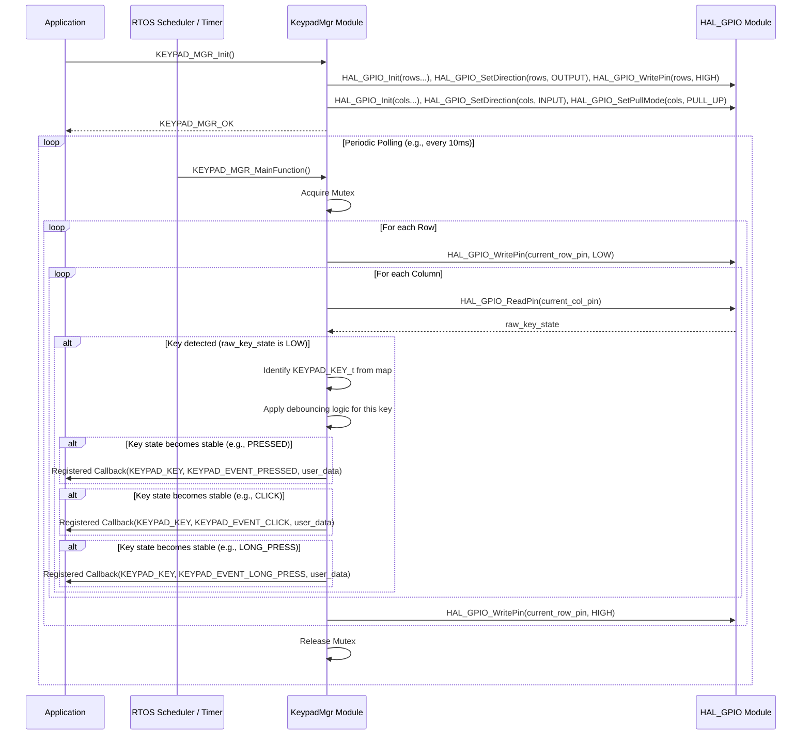

# **Detailed Design Document: KeypadMgr Component**

## **1. Introduction**

### **1.1. Purpose**

This document details the design of the **Keypad Manager (KeypadMgr)** component. Its primary purpose is to provide a robust and debounced interface for handling matrix keypad inputs, abstracting the underlying GPIO hardware. It detects various input events (press, release, click, long press) and notifies higher-level application modules via a callback mechanism.

### **1.2. Scope**

The scope of this document covers the architecture, functional behavior, interfaces, dependencies, and resource considerations for the KeypadMgr module. It details how it manages keypad input states through scanning, performs debouncing, detects specific events, and provides a generic interface for event notification. The module interacts with lower-level GPIO drivers in the Hardware Abstraction Layer (HAL).

### **1.3. References**

* Software Architecture Document (SAD) - Environmental Monitoring & Control System (Final Version)  
* Detailed Design Document: HAL_GPIO (Hypothetical, as the actual HAL is platform-specific)  
* FreeRTOS Documentation (for mutex and timing functions)

## **2. Keypad Manager (KeypadMgr) Component Design**

### **2.1. Overview**

The KeypadMgr component is designed to manage matrix keypads (e.g., 4x4, 4x3). It implements a scanning algorithm to detect key presses, handles debouncing for each key, and identifies various key events (press, release, click, long press), similar to the ButtonMgr but adapted for a matrix layout.

### **2.2. Architecture**

The KeypadMgr also follows a layered architecture, sitting above the GPIO HAL. It comprises:

* **Public Interface (keypad_mgr.h):** Defines the API for initialization, de-initialization, callback registration, and state querying for individual keys.  
* **Configuration (keypad_mgr_cfg.h, keypad_mgr_cfg.c):** Contains compile-time configurable parameters for the keypad, including row/column GPIOs, keypad dimensions, debounce time, long press duration, and the key mapping.  
* **Implementation (keypad_mgr.c):** Contains the core logic for keypad scanning, debouncing, state machine management for each key, and invoking callbacks.  
* **Dependencies:** Relies on a GPIO HAL for direct hardware interaction and FreeRTOS for mutexes and system timing.

#### **2.2.1. Internal State Machine for Each Key**

Each potential key on the keypad (defined by KEYPAD_KEY_MAX) maintains its own internal state, similar to the individual buttons in ButtonMgr, to track:

* current_raw_state: The immediate, unfiltered state of the key.  
* debounced_state: The stable, debounced state of the key.  
* last_state_change_time: Timestamp of the last raw state change, used for debouncing.  
* press_start_time: Timestamp when the key was debouncedly pressed, used for click/long press detection.  
* long_press_event_fired: Flag to ensure the long press event is triggered only once per press cycle.

### **2.3. Functional Behavior**

The KeypadMgr operates on a polling basis, with its KEYPAD_MGR_MainFunction being called periodically (e.g., every 10ms as defined by KEYPAD_MGR_POLLING_INTERVAL_MS).

1. **Initialization (KEYPAD_MGR_Init):**  
   * Creates a FreeRTOS mutex.  
   * Initializes all row GPIOs as outputs and drives them to a default high state using HAL_GPIO_Init, HAL_GPIO_SetDirection, and HAL_GPIO_WritePin.  
   * Initializes all column GPIOs as inputs with internal pull-up resistors using HAL_GPIO_Init, HAL_GPIO_SetDirection, and HAL_GPIO_SetPullMode.  
   * Initializes runtime data for all possible keys based on KEYPAD_KEY_MAX.  
2. **Periodic Processing (KEYPAD_MGR_MainFunction):**  
   * Acquires the mutex (non-blocking).  
   * **Keypad Scanning Loop:**  
     * Iterates through each row:  
       * Drives the current row's GPIO pin LOW (active state).  
       * Reads the state of all column GPIO pins using HAL_GPIO_ReadPin.  
       * If a column pin is read as LOW, it indicates a key press at the intersection of the current row and that column.  
       * Based on the g_keypad_key_map, the corresponding KEYPAD_KEY_t is identified.  
       * For each detected key state:  
         * Applies debouncing logic similar to ButtonMgr, using KEYPAD_DEBOUNCE_TIME_MS.  
         * Detects and triggers KEYPAD_EVENT_PRESSED, KEYPAD_EVENT_RELEASED, KEYPAD_EVENT_CLICK, and KEYPAD_EVENT_LONG_PRESS events via registered callbacks, using KEYPAD_LONG_PRESS_TIME_MS.  
       * Drives the current row's GPIO pin HIGH again before moving to the next row.  
   * Releases the mutex.  
3. **Callback Registration (KEYPAD_MGR_RegisterCallback):** Allows application modules to register a function to be called when specific key events occur.  
4. **State Query (KEYPAD_MGR_GetKeypadState):** Provides the current debounced state of a specified key.  
5. **De-initialization (KEYPAD_MGR_DeInit):** Cleans up resources, including deleting the mutex and optionally resetting GPIOs.

### **2.4. Interfaces**

#### **2.4.1. Provided Interfaces (keypad_mgr.h)**

* KEYPAD_MGR_Status_t KEYPAD_MGR_Init(void): Initializes the module.  
* KEYPAD_MGR_Status_t KEYPAD_MGR_DeInit(void): De-initializes the module.  
* KEYPAD_MGR_Status_t KEYPAD_MGR_RegisterCallback(KEYPAD_KEY_t key_id, KEYPAD_MGR_Callback_t callback, void *user_data): Registers an event callback.  
* KEYPAD_MGR_Status_t KEYPAD_MGR_GetKeypadState(KEYPAD_KEY_t key_id, bool *is_pressed): Gets the current debounced state of a key.  
* void KEYPAD_MGR_MainFunction(void): Main processing function, to be called periodically.

#### **2.4.2. Required Interfaces (from HAL_GPIO)**

The keypad_mgr.c implementation requires the following hypothetical HAL GPIO functions:

* esp_err_t HAL_GPIO_Init(int gpio_pin): Initializes a specific GPIO pin.  
* esp_err_t HAL_GPIO_SetDirection(int gpio_pin, HAL_GPIO_Direction_t dir): Sets the direction (input/output) of a GPIO pin.  
* esp_err_t HAL_GPIO_SetPullMode(int gpio_pin, HAL_GPIO_PullMode_t pull_mode): Configures internal pull-up/pull-down resistors.  
* esp_err_t HAL_GPIO_WritePin(int gpio_pin, bool level): Writes a digital state (high/low) to a GPIO pin.  
* bool HAL_GPIO_ReadPin(int gpio_pin): Reads the digital state of a GPIO pin.

#### **2.4.3. Callbacks**

* typedef void (*KEYPAD_MGR_Callback_t)(KEYPAD_KEY_t key_id, KEYPAD_EVENT_t event_type, void *user_data): Function pointer type for key event callbacks.

### **2.5. Dependencies**

* **HAL_GPIO:** Direct dependency for hardware interaction.  
* **FreeRTOS:** Used for mutex (SemaphoreHandle_t) for thread safety and system tick count (xTaskGetTickCount) for timing.  
* **ESP-IDF Logging (esp_log.h):** Used for logging debug and error messages. This can be replaced with any other logging framework.

### **2.6. Resource Considerations**

* **Memory:**  
  * g_keypad_key_runtime_data: An array of KEYPAD_MGR_KeyRuntimeData_t structures, one for each KEYPAD_KEY_MAX. Memory usage is proportional to the total number of possible keys.  
  * g_keypad_mgr_mutex: One FreeRTOS mutex object.  
* **CPU:** The KEYPAD_MGR_MainFunction is a polling function that performs a matrix scan. Its CPU usage depends on KEYPAD_MGR_POLLING_INTERVAL_MS, KEYPAD_NUM_ROWS, and KEYPAD_NUM_COLS. A shorter interval or larger keypad will increase CPU load.  
* **Interrupts:** This design uses polling for keypad scanning and does not directly rely on GPIO interrupts, simplifying the implementation but requiring periodic execution of KEYPAD_MGR_MainFunction.

## **3. Interaction and Flow**

### **3.1. Sequence Diagram: Keypad Event Detection**

The following sequence diagram illustrates the typical flow of events from system initialization to the detection and notification of a key press on a matrix keypad.

## **4. Error Handling**

The KeypadMgr module implements robust error handling to ensure system stability.

* **Initialization Errors:** If KEYPAD_MGR_Init fails (e.g., due to HAL_GPIO initialization errors, mutex creation failure), it will return an appropriate KEYPAD_MGR_Status_t error code and log the issue using ESP_LOGE. The module will not be operational.  
* **Invalid Parameters:** Public API functions (e.g., KEYPAD_MGR_RegisterCallback, KEYPAD_MGR_GetKeypadState) will validate input parameters (e.g., NULL pointers, invalid key_id). Invalid parameters will result in an error status return and logging.  
* **Mutex Handling:** The KEYPAD_MGR_MainFunction attempts to acquire the mutex with a short timeout. If the mutex cannot be acquired, it will log a warning and skip the current processing cycle to avoid blocking the scheduler, ensuring the system remains responsive.  
* **HAL_GPIO Errors:** While HAL_GPIO_ReadPin is typically non-failing for reading, any potential errors from HAL_GPIO_Init, HAL_GPIO_SetDirection, HAL_GPIO_SetPullMode, or HAL_GPIO_WritePin during initialization or scanning are handled and propagated as KEYPAD_MGR_Status_t errors.

## **5. Configuration**

The KeypadMgr module is highly configurable at compile-time to adapt to various keypad dimensions and hardware setups.

* **KEYPAD_MGR_POLLING_INTERVAL_MS:** Defines how frequently KEYPAD_MGR_MainFunction should be called (in milliseconds). A smaller value increases responsiveness but also CPU load.  
* **KEYPAD_NUM_ROWS and KEYPAD_NUM_COLS:** The dimensions of the matrix keypad.  
* **KEYPAD_KEY_MAX:** The total number of possible keys on the keypad (e.g., KEYPAD_NUM_ROWS * KEYPAD_NUM_COLS). This determines the size of internal data structures.  
* **KEYPAD_DEBOUNCE_TIME_MS:** The duration (in milliseconds) for which a key's raw state must be stable before its debounced state is updated. This value is applied globally to all keys.  
* **KEYPAD_LONG_PRESS_TIME_MS:** The duration (in milliseconds) for which a key must be held down to trigger a KEYPAD_EVENT_LONG_PRESS. This value is applied globally to all keys.  
* **g_keypad_row_gpio_pins and g_keypad_col_gpio_pins Arrays:** Arrays (typically in keypad_mgr_cfg.c) defining the GPIO pins connected to the rows and columns of the keypad, respectively.  
* **g_keypad_key_map Array:** A 2D array (e.g., KEYPAD_NUM_ROWS x KEYPAD_NUM_COLS) that maps each physical intersection (row, column) to its corresponding KEYPAD_KEY_t enumeration value. This allows for flexible key assignments.

Example configuration in keypad_mgr_cfg.c for a 4x4 keypad:
```c
// Example configuration for a 4x4 keypad  
const int g_keypad_row_gpio_pins[KEYPAD_NUM_ROWS] = {18, 19, 21, 22};  
const int g_keypad_col_gpio_pins[KEYPAD_NUM_COLS] = {23, 25, 26, 27};

const KEYPAD_KEY_t g_keypad_key_map[KEYPAD_NUM_ROWS][KEYPAD_NUM_COLS] = {  
    {KEYPAD_KEY_1, KEYPAD_KEY_2, KEYPAD_KEY_3, KEYPAD_KEY_A},  
    {KEYPAD_KEY_4, KEYPAD_KEY_5, KEYPAD_KEY_6, KEYPAD_KEY_B},  
    {KEYPAD_KEY_7, KEYPAD_KEY_8, KEYPAD_KEY_9, KEYPAD_KEY_C},  
    {KEYPAD_KEY_STAR, KEYPAD_KEY_0, KEYPAD_KEY_HASH, KEYPAD_KEY_D},  
};
```
## **6. Testing**

### **6.1. Unit Testing**

* **Objective:** Verify the correctness of individual functions and logic blocks within keypad_mgr.c in isolation.  
* **Methodology:** Use a mocking framework (e.g., Google Mock, CMock) to simulate the behavior of HAL_GPIO functions and FreeRTOS API calls (xTaskGetTickCount, mutex functions).  
* **Test Cases:**  
  * **Scanning Logic:** Simulate HAL_GPIO_ReadPin and HAL_GPIO_WritePin to ensure the scanning algorithm correctly identifies pressed keys based on the g_keypad_key_map.  
  * **Debouncing:** Simulate noisy key signals and verify that the debounced_state only changes after KEYPAD_DEBOUNCE_TIME_MS.  
  * **Event Detection:**  
    * Test simple press-release cycles to trigger PRESSED and RELEASED events for individual keys.  
    * Test short press-release cycles to trigger CLICK events.  
    * Test holding a key down for longer than KEYPAD_LONG_PRESS_TIME_MS to trigger LONG_PRESS (only once).  
    * Test releasing after a long press to ensure RELEASED is still triggered.  
  * **Callback Invocation:** Verify that the registered callback function is called with the correct KEYPAD_KEY_t and KEYPAD_EVENT_t.  
  * **State Query:** Verify KEYPAD_MGR_GetKeypadState returns the correct debounced state for a given key.  
  * **Mutex Protection:** Test concurrent access scenarios (if applicable in a multi-threaded test environment) to ensure data integrity during scanning.  
  * **Error Conditions:** Test KEYPAD_MGR_Init with simulated HAL errors, and API calls with invalid parameters.

### **6.2. Integration Testing**

* **Objective:** Verify the correct interaction between KeypadMgr, HAL_GPIO, and FreeRTOS.  
* **Methodology:** Run tests on a target board or a hardware-in-the-loop (HIL) setup.  
* **Test Cases:**  
  * **Hardware Interaction:** Connect a physical keypad and verify that KEYPAD_MGR_MainFunction correctly scans and reads key states through HAL_GPIO.  
  * **Timing Accuracy:** Verify that debounce and long press timings are accurate on the target hardware.  
  * **Multiple Key Presses:** Test pressing multiple keys simultaneously (if the keypad hardware supports it for ghosting/masking) and verify expected behavior.  
  * **Concurrency:** Verify that KeypadMgr operates correctly when other FreeRTOS tasks are running.

### **6.3. System Testing**

* **Objective:** Verify the end-to-end functionality of keypad inputs within the complete system context.  
* **Methodology:** Perform tests on the fully integrated system, interacting with the application layer.  
* **Test Cases:**  
  * **Application Response:** Verify that key presses (click, long press) trigger the expected actions in the application (e.g., numerical input, menu navigation, password entry).  
  * **User Experience:** Assess the responsiveness and feel of the keypad from a user's perspective.  
  * **Fault Injection:** Introduce scenarios like rapid, erratic key presses, holding keys down during system boot-up, or partial keypad disconnections to verify robustness.  
  * **Long-Term Operation:** Run the system with continuous keypad interaction for extended periods to check for stability, memory leaks, or performance degradation.

## **7. Future Enhancements**

* **Interrupt-Driven Column Monitoring:** Instead of continuous polling of rows, an enhancement could involve configuring column pins as interrupts. When a column changes state (indicating a key press), an interrupt would trigger the KeypadMgr to perform a quick scan of the rows to identify the specific key. This would significantly reduce CPU load, especially in low-power applications.  
* **Dynamic Configuration:** Allow changing debounce times or long press durations at runtime via a dedicated API, rather than only compile-time configuration.  
* **Multiple Callbacks per Key:** Enable multiple application modules to register their own callbacks for the same key, allowing for more flexible event handling.  
* **Ghosting/Masking Handling:** Implement more advanced algorithms to detect and handle ghosting (false key presses) or masking (missed key presses) issues that can occur with certain keypad matrix designs when multiple keys are pressed simultaneously.  
* **Power-Saving Modes:** Integrate with system power management to disable keypad scanning during deep sleep modes and re-enable it upon wake-up.
