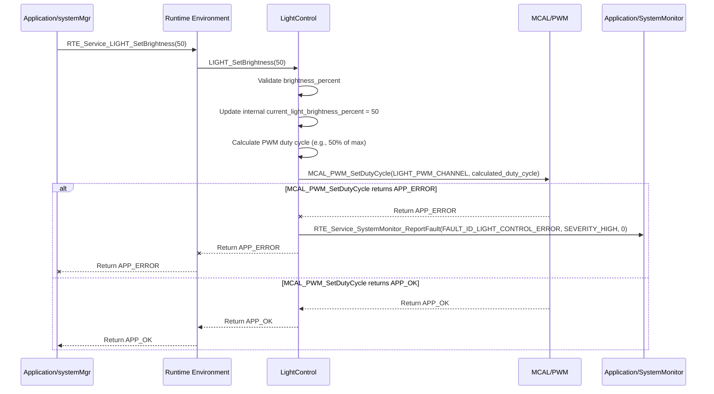

# **Detailed Design Document: LightControl Component**

## **1. Introduction**

### **1.1. Purpose**

This document details the design of the LightControl component. Its primary purpose is to provide a high-level interface for controlling lighting elements (e.g., on/off lights, dimmable lights) within the environmental monitoring and control system. It abstracts the complexities of the underlying GPIO (General Purpose Input/Output) or PWM (Pulse Width Modulation) drivers, allowing systemMgr to command light states or brightness levels without needing to know hardware specifics.

### **1.2. Scope**

The scope of this document covers the lightControl module's architecture, functional behavior, interfaces, dependencies, and resource considerations. It details how lightControl receives control commands from systemMgr (via RTE services) and interacts with the underlying MCAL_GPIO or MCAL_PWM drivers for physical light control.

### **1.3. References**

* Software Architecture Document (SAD) - Smart Device Firmware (Final Version)  
* Detailed Design Document: RTE  
* Detailed Design Document: MCAL_GPIO  
* Detailed Design Document: MCAL_PWM  
* Lighting Element Datasheet (Conceptual)  
* Relay Module Datasheet (Conceptual, if non-dimmable lights)

## **2. Functional Description**

The LightControl component provides the following core functionalities:

1. **Initialization**: Initialize the light control hardware (e.g., GPIO pins for relays, PWM channels for dimming) to a safe default state (e.g., lights off).  
2. **Set Light State**: Turn the lighting element on or off.  
3. **Set Brightness (Optional)**: For dimmable lights, set the brightness level (e.g., 0-100%).  
4. **Get Light State/Brightness**: Retrieve the currently commanded state or brightness of the lights.  
5. **Error Reporting**: Report any failures during light control (e.g., GPIO/PWM initialization failure, inability to set state/brightness) to the SystemMonitor via RTE_Service_SystemMonitor_ReportFault().

## **3. Non-Functional Requirements**

### **3.1. Performance**

* **Responsiveness**: Light state/brightness changes should be applied promptly after a command.  
* **Smooth Dimming (Optional)**: For dimmable lights, brightness transitions should be smooth to avoid flickering or abrupt changes.

### **3.2. Memory**

* **Minimal Footprint**: The lightControl module shall have a minimal memory footprint.

### **3.3. Reliability**

* **Robustness**: The module shall be robust against invalid commands or underlying hardware failures.  
* **Fail-Safe**: In case of critical errors, lights should revert to a safe state (e.g., off or full brightness for emergency lighting, depending on system requirements).

## **4. Architectural Context**

As per the SAD (Section 3.1.2, Application Layer), lightControl resides in the Application Layer. It receives light control commands from systemMgr (via RTE_Service_LIGHT_SetState() or RTE_Service_LIGHT_SetBrightness()). It then interacts with the appropriate MCAL drivers (MCAL_GPIO for on/off, MCAL_PWM for dimming) to control the physical lighting elements.

## **5. Design Details**

### **5.1. Module Structure**

The LightControl component will consist of the following files:

* LightControl/inc/lightControl.h: Public header file containing function prototypes and light-specific definitions.  
* LightControl/src/lightControl.c: Source file containing the implementation of light control logic.  
* LightControl/cfg/lightControl_cfg.h: Configuration header for light type, control pins/channels, and default states.

### **5.2. Public Interface (API)**

// In LightControl/inc/lightControl.h
```c
#include "Application/common/inc/app_common.h" // For APP_Status_t  
#include <stdbool.h> // For bool  
#include <stdint.h>  // For uint8_t

// --- Public Functions ---

/**  
 * @brief Initializes the Light Control module and its associated hardware.  
 * Sets the lights to a safe default state (e.g., off).  
 * @return APP_OK on success, APP_ERROR on failure.  
 */  
APP_Status_t LIGHT_Init(void);

/**  
 * @brief Sets the state of the lighting element (on or off).  
 * For dimmable lights, this might correspond to 0% or 100% brightness.  
 * @param on True to turn the light on, false to turn it off.  
 * @return APP_OK on success, APP_ERROR on failure.  
 */  
APP_Status_t LIGHT_SetState(bool on);

#if LIGHT_CONTROL_DIMMABLE_SUPPORT  
/**  
 * @brief Sets the brightness of the lighting element.  
 * Only applicable for dimmable lights.  
 * @param brightness_percent The desired brightness in percentage (0-100).  
 * @return APP_OK on success, APP_ERROR on failure.  
 */  
APP_Status_t LIGHT_SetBrightness(uint8_t brightness_percent);  
#endif

/**  
 * @brief Gets the currently commanded state of the light.  
 * @param state Pointer to store the current light state (true for on, false for off).  
 * @return APP_OK on success, APP_ERROR on failure.  
 */  
APP_Status_t LIGHT_GetState(bool *state);

#if LIGHT_CONTROL_DIMMABLE_SUPPORT  
/**  
 * @brief Gets the currently commanded brightness of the light.  
 * @param brightness_percent Pointer to store the current brightness in percentage (0-100).  
 * @return APP_OK on success, APP_ERROR on failure.  
 */  
APP_Status_t LIGHT_GetBrightness(uint8_t *brightness_percent);  
#endif
```

### **5.3. Internal Design**

The LightControl module will maintain the current commanded light state and brightness internally. It will translate these into appropriate GPIO states or PWM duty cycles and interact with the MCAL layer.

1. **Initialization (LIGHT_Init)**:  
   * **Control Hardware Init**:  
     * If LIGHT_CONTROL_TYPE_ON_OFF is configured: Call MCAL_GPIO_Init() for the LIGHT_CONTROL_GPIO_PIN.  
     * If LIGHT_CONTROL_TYPE_DIMMABLE_PWM is configured: Call MCAL_PWM_Init() for the LIGHT_PWM_CHANNEL.  
   * Set the light to its default safe state (e.g., LIGHT_SetState(false) to turn it off).  
   * If any underlying MCAL initialization fails, report FAULT_ID_LIGHT_INIT_FAILED to SystemMonitor via RTE_Service_SystemMonitor_ReportFault().  
   * Return APP_OK.  
2. **Set Light State (LIGHT_SetState)**:  
   * Update an internal static bool current_light_state;.  
   * **Control Logic based on LIGHT_CONTROL_TYPE**:  
     * If LIGHT_CONTROL_TYPE_ON_OFF:  
       * Call MCAL_GPIO_SetState(LIGHT_CONTROL_GPIO_PIN, on ? MCAL_GPIO_STATE_HIGH : MCAL_GPIO_STATE_LOW).  
     * If LIGHT_CONTROL_TYPE_DIMMABLE_PWM:  
       * Call MCAL_PWM_SetDutyCycle(LIGHT_PWM_CHANNEL, on ? LIGHT_PWM_MAX_DUTY_CYCLE : 0).  
       * Also update current_light_brightness_percent to 100 or 0.  
   * If any underlying MCAL call fails, report FAULT_ID_LIGHT_CONTROL_ERROR to SystemMonitor.  
   * Return APP_OK.  
3. **Set Brightness (LIGHT_SetBrightness)** (if LIGHT_CONTROL_DIMMABLE_SUPPORT):  
   * Validate brightness_percent (ensure it's within 0-100). If invalid, report FAULT_ID_LIGHT_INVALID_BRIGHTNESS_CMD to SystemMonitor.  
   * Update current_light_brightness_percent.  
   * Calculate the PWM duty cycle based on brightness_percent and LIGHT_PWM_MAX_DUTY_CYCLE.  
   * Call MCAL_PWM_SetDutyCycle(LIGHT_PWM_CHANNEL, calculated_duty_cycle).  
   * Update current_light_state based on brightness_percent > 0.  
   * If MCAL_PWM_SetDutyCycle() fails, report FAULT_ID_LIGHT_CONTROL_ERROR to SystemMonitor.  
   * Return APP_OK.  
4. **Get Light State (LIGHT_GetState)**:  
   * Validate state pointer.  
   * Copy the current_light_state to the provided pointer.  
   * Return APP_OK.  
5. **Get Brightness (LIGHT_GetBrightness)** (if LIGHT_CONTROL_DIMMABLE_SUPPORT):  
   * Validate brightness_percent pointer.  
   * Copy the current_light_brightness_percent to the provided pointer.  
   * Return APP_OK.

**Sequence Diagram (Example: systemMgr Sets Light Brightness - PWM Control):**

### **5.4. Dependencies**

* **Application/common/inc/app_common.h**: For APP_Status_t.  
* **Application/logger/inc/logger.h**: For logging light control events and errors.  
* **Application/SystemMonitor/inc/system_monitor.h**: For SystemMonitor_FaultId_t (e.g., FAULT_ID_LIGHT_INIT_FAILED).  
* **Rte/inc/Rte.h**: For calling RTE_Service_SystemMonitor_ReportFault().  
* **Mcal/gpio/inc/mcal_gpio.h**: If using GPIOs for on/off light control.  
* **Mcal/pwm/inc/mcal_pwm.h**: If using PWM for dimmable light control.

### **5.5. Error Handling**

* **Initialization Failure**: If GPIO or PWM initialization fails, FAULT_ID_LIGHT_INIT_FAILED is reported to SystemMonitor.  
* **Invalid Brightness Command**: If LIGHT_SetBrightness receives an invalid brightness_percent (e.g., >100), FAULT_ID_LIGHT_INVALID_BRIGHTNESS_CMD is reported.  
* **Control Hardware Failure**: If MCAL_GPIO_SetState() or MCAL_PWM_SetDutyCycle() returns an error, FAULT_ID_LIGHT_CONTROL_ERROR is reported.  
* **Fail-Safe**: In a critical system fault (managed by systemMgr and SystemMonitor), systemMgr would command LIGHT_SetState(false) to turn off lights if they are non-essential, or LIGHT_SetState(true) for emergency lighting.

### **5.6. Configuration**

The LightControl/cfg/lightControl_cfg.h file will contain:

* **Light Control Type**: Define LIGHT_CONTROL_TYPE_ON_OFF or LIGHT_CONTROL_TYPE_DIMMABLE_PWM.  
* **Dimmable Support Flag**: LIGHT_CONTROL_DIMMABLE_SUPPORT (boolean, derived from type).  
* **For On/Off Control**:  
  * LIGHT_CONTROL_GPIO_PIN: The specific GPIO pin connected to the light's control relay.  
* **For Dimmable PWM Control**:  
  * LIGHT_PWM_CHANNEL: The specific PWM channel ID.  
  * LIGHT_PWM_FREQUENCY_HZ: The PWM frequency.  
  * LIGHT_PWM_MAX_DUTY_CYCLE: The maximum duty cycle value.  
* **Default State**: LIGHT_DEFAULT_STATE_ON (boolean).  
* **Default Brightness**: LIGHT_DEFAULT_BRIGHTNESS_PERCENT (for dimmable lights).

// Example: LightControl/cfg/lightControl_cfg.h
```c
// Choose light control type  
#define LIGHT_CONTROL_TYPE_ON_OFF       0  
#define LIGHT_CONTROL_TYPE_DIMMABLE_PWM 1

#if LIGHT_CONTROL_TYPE_DIMMABLE_PWM  
#define LIGHT_CONTROL_DIMMABLE_SUPPORT  true  
#define LIGHT_PWM_CHANNEL               MCAL_PWM_CHANNEL_1  
#define LIGHT_PWM_FREQUENCY_HZ          1000 // 1 kHz  
#define LIGHT_PWM_MAX_DUTY_CYCLE        1023 // For 10-bit PWM resolution  
#else  
#define LIGHT_CONTROL_DIMMABLE_SUPPORT  false  
#define LIGHT_CONTROL_GPIO_PIN          22 // Example GPIO pin for on/off light relay  
#endif

#define LIGHT_DEFAULT_STATE_ON          false // Lights are off by default  
#define LIGHT_DEFAULT_BRIGHTNESS_PERCENT 0    // Default brightness is off
```

### **5.7. Resource Usage**

* **Flash**: Low.  
* **RAM**: Very low, primarily for current_light_state and current_light_brightness_percent.  
* **CPU**: Very low. GPIO toggling is fast, and PWM updates are typically hardware-accelerated.

## **6. Test Considerations**

### **6.1. Unit Testing**

* **Mock Dependencies**: Unit tests for lightControl will mock MCAL_GPIO_Init(), MCAL_GPIO_SetState(), MCAL_PWM_Init(), MCAL_PWM_SetDutyCycle(), and RTE_Service_SystemMonitor_ReportFault().  
* **Test Cases**:  
  * LIGHT_Init: Verify correct MCAL initialization calls and default light state/brightness. Test initialization failure and fault reporting.  
  * LIGHT_SetState:  
    * Test with true and false states. Mock MCAL calls to verify correct GPIO level or PWM duty cycle is commanded.  
    * Test underlying MCAL failures and verify FAULT_ID_LIGHT_CONTROL_ERROR is reported.  
  * LIGHT_SetBrightness (if dimmable):  
    * Test with valid brightness_percent values (0, 50, 100). Mock MCAL calls to verify correct duty cycle is commanded.  
    * Test with invalid brightness_percent values (e.g., 101, -1). Verify FAULT_ID_LIGHT_INVALID_BRIGHTNESS_CMD is reported.  
    * Test underlying MCAL failures and verify FAULT_ID_LIGHT_CONTROL_ERROR is reported.  
  * LIGHT_GetState/LIGHT_GetBrightness: Verify they return the last commanded state/brightness.

### **6.2. Integration Testing**

* **LightControl-MCAL Integration**: Verify that lightControl correctly interfaces with the actual MCAL_GPIO or MCAL_PWM drivers and the physical lighting elements.  
* **Visual Verification**: Observe the lights' behavior (on/off, dimming) in response to commands.  
* **SystemMgr Control**: Verify that systemMgr can effectively control the lights via RTE services.  
* **Fault Injection**: Disconnect light control wires or cause a short on the GPIO/PWM output and verify that lightControl reports FAULT_ID_LIGHT_CONTROL_ERROR (if feedback mechanisms are in place, otherwise it's a passive module).

### **6.3. System Testing**

* **End-to-End Control Loop**: Verify that the system's overall control logic (e.g., scheduled lighting, or lighting tied to occupancy sensors if implemented) functions correctly.  
* **Long-Term Operation**: Run the system for extended periods to ensure light control reliability.
