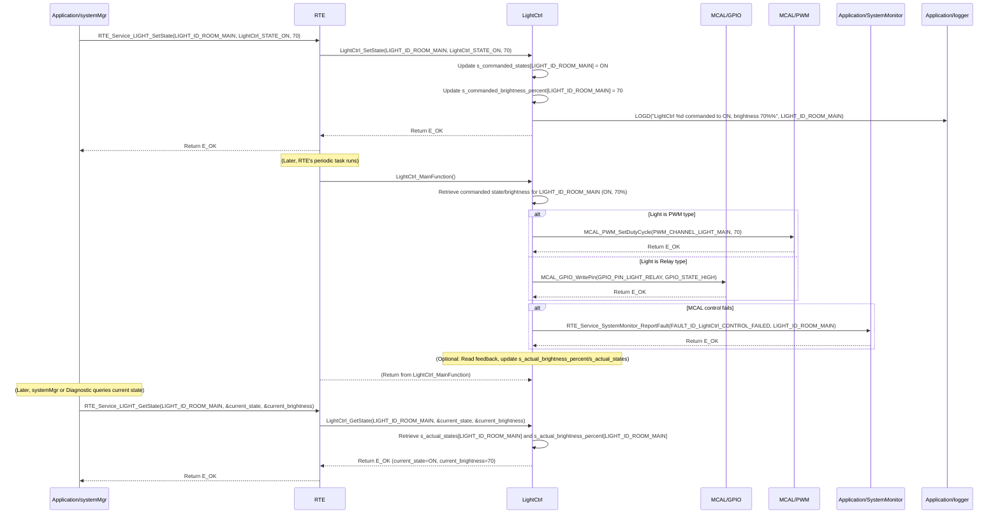

# **Detailed Design Document: LightCtrl (Light Control) Component**

## **1. Introduction**

### **1.1. Purpose**

This document details the design of the LightCtrl component. Its primary purpose is to provide a high-level interface for controlling and monitoring lighting elements within the smart device. This typically involves controlling relays for ON/OFF operation or potentially PWM for dimmable lights. It abstracts the complexities of the underlying hardware drivers (e.g., GPIO for relays, PWM for dimming). This module is designed to **periodically monitor its commanded state (ON/OFF or brightness) and apply it to the hardware**, ensuring consistent light operation. It also provides an interface to retrieve the current light state.

### **1.2. Scope**

The scope of this document covers the LightCtrl module's architecture, functional behavior, interfaces, dependencies, and resource considerations. It details how LightCtrl manages its own periodic application of commanded states to the hardware and provides the current light status to modules like systemMgr (via RTE services).

### **1.3. References**

* Software Architecture Document (SAD) - Smart Device Firmware (Final Version)  
* Detailed Design Document: RTE  
* Detailed Design Document: MCAL_GPIO (for relay-controlled lights)  
* Detailed Design Document: MCAL_PWM (for PWM-controlled dimmable lights)  
* Lighting Element Datasheet (e.g., LED strip, incandescent bulb with relay)

## **2. Functional Description**

The LightCtrl component provides the following core functionalities:

1. **Initialization (LightCtrl_Init)**: Initialize all configured light control hardware (GPIOs for relays, PWM channels). **All module internal variables, including the commanded state/brightness and current feedback, shall be initialized to safe default values (e.g., OFF state, 0% brightness).**  
2. **Set Commanded State/Brightness (LightCtrl_SetState)**: This function allows other modules (e.g., systemMgr) to command a desired light state (ON/OFF) or brightness (for dimmable lights). This function **only updates the internal commanded state**; the actual hardware control is performed periodically by LightCtrl_MainFunction.  
3. **Periodic Control & Feedback (LightCtrl_MainFunction)**: This is the module's primary periodic function. It is responsible for:  
   * Reading the internally stored commanded state/brightness.  
   * Applying this commanded value to the physical light hardware using the appropriate MCAL/HAL drivers.  
   * (Optional) Reading feedback from the light (e.g., current sensor, light sensor) to determine its actual operating state/brightness.  
   * (Optional) Comparing actual feedback with the commanded state and reporting discrepancies or failures to SystemMonitor.  
   * Reporting faults to SystemMonitor (including the actuatorId) if the light fails to respond or feedback indicates a malfunction.  
4. **Get Current State/Brightness (LightCtrl_GetState)**: Provide a non-blocking interface to retrieve the last applied commanded state/brightness, or the actual measured state/brightness if feedback is implemented.  
5. **Error Reporting**: Detect and report any failures during light control (e.g., hardware not responding, feedback out of range) to the SystemMonitor via RTE_Service_SystemMonitor_ReportFault().

## **3. Non-Functional Requirements**

### **3.1. Performance**

* **Responsiveness (Control)**: The LightCtrl_MainFunction should execute frequently enough to ensure the light responds promptly to commanded changes (defined by LightCtrl_CONTROL_PERIOD_MS).  
* **Responsiveness (Getter)**: The LightCtrl_GetState() function shall be non-blocking and return immediately, as it only retrieves an already stored value.  
* **Control Accuracy**: Relay state or PWM duty cycle shall accurately reflect the commanded state/brightness.

### **3.2. Memory**

* **Minimal Footprint**: The LightCtrl module shall have a minimal memory footprint, considering the number of configured lights.

### **3.3. Reliability**

* **Robustness**: The module shall be robust against hardware control failures.  
* **Fail-Safe**: In case of critical errors, the light should transition to a safe state (e.g., turn off).  
* **Feedback Monitoring (Optional but Recommended)**: If feedback is implemented, the module should detect and report discrepancies between commanded and actual states.

## **4. Architectural Context**

As per the SAD (Section 3.1.2, Application Layer), LightCtrl resides in the Application Layer. It manages its own actuator control process via its LightCtrl_MainFunction, which is called periodically by a generic RTE periodic task (e.g., RTE_PeriodicTask_MediumPrio_100ms). Other modules, such as systemMgr, will command LightCtrl using LightCtrl_SetState(actuatorId, state/brightness) and query its status using LightCtrl_GetState(actuatorId).

## **5. Design Details**

### **5.1. Module Structure**

The LightCtrl component will consist of the following files:

* Application/lightControl/inc/lightctrl.h: Public header file containing function prototypes and light-specific definitions.  
* Application/lightControl/src/lightctrl.c: Source file containing the implementation of light control logic and the internal periodic update function.  
* Application/lightControl/cfg/lightctrl_cfg.h: Configuration header for light types, control interface details (e.g., GPIO pins, PWM channels), and periodic control settings.

### **5.2. Public Interface (API)**

// In Application/lightControl/inc/lightctrl.h

```c
#include "Application/common/inc/common.h" // For APP_Status_t  
#include <stdint.h> // For uint32_t  
#include <stdbool.h> // For bool

// --- Light State/Brightness Definitions ---  
typedef enum {  
    LightCtrl_STATE_OFF = 0,  
    LightCtrl_STATE_ON,  
} LightCtrl_State_t;

// For PWM lights, brightness is typically 0-100%  
#define LightCtrl_MIN_BRIGHTNESS_PERCENT   0  
#define LightCtrl_MAX_BRIGHTNESS_PERCENT   100

// --- Public Functions ---

/**  
 * @brief Initializes the LightCtrl module and all configured light control hardware.  
 * All module-internal variables and light states are initialized to a safe,  
 * known state (e.g., OFF or 0% brightness).  
 * @return E_OK on success, E_NOK on failure.  
 */  
APP_Status_t LightCtrl_Init(void);

/**  
 * @brief Commands a desired light state (ON/OFF) or brightness (for PWM lights).  
 * This function only updates the internal commanded state. The actual hardware control  
 * is performed periodically by LightCtrl_MainFunction.  
 * @param actuatorId The unique ID of the light to control.  
 * @param state The desired state (LightCtrl_STATE_ON or LightCtrl_STATE_OFF).  
 * @param brightness_percent For PWM lights: desired brightness in percentage (0-100).  
 * For relay lights: this parameter is ignored.  
 * @return E_OK on successful command update, E_NOK if the actuatorId is invalid  
 * or the state/brightness_percent is out of range.  
 */  
APP_Status_t LightCtrl_SetState(uint32_t actuatorId, LightCtrl_State_t state, uint8_t brightness_percent);

/**  
 * @brief Gets the last commanded state/brightness, or the actual measured state/brightness if feedback is implemented.  
 * This is a non-blocking getter function.  
 * @param actuatorId The unique ID of the light to retrieve data from.  
 * @param state Pointer to store the current ON/OFF state.  
 * @param brightness_percent Pointer to store the current brightness in percentage (0-100), relevant for PWM.  
 * @return E_OK on successful retrieval, E_NOK if the actuatorId is invalid,  
 * or any pointer is NULL.  
 */  
APP_Status_t LightCtrl_GetState(uint32_t actuatorId, LightCtrl_State_t *state, uint8_t *brightness_percent);

// --- Internal Periodic Runnable Prototype (called by RTE) ---  
// This function is declared here so RTE can call it.  
/**  
 * @brief Performs the periodic light control, applying the commanded state to hardware,  
 * and optionally reading feedback. This function is intended to be called periodically by an RTE task.  
 */  
void LightCtrl_MainFunction(void);
```

### **5.3. Internal Design**

The LightCtrl module will manage its own light control cycle for multiple lights.

1. **Internal State**:  

   ```c
   // Array to store the latest commanded state for each light  
   static LightCtrl_State_t s_commanded_states[LightCtrl_COUNT];  
   // Array to store the latest commanded brightness for each light (0-100%)  
   static uint8_t s_commanded_brightness_percent[LightCtrl_COUNT];  
   // Array to store the latest reported actual state (if feedback is implemented)  
   static LightCtrl_State_t s_actual_states[LightCtrl_COUNT];  
   // Array to store the latest reported actual brightness (if feedback is implemented)  
   static uint8_t s_actual_brightness_percent[LightCtrl_COUNT];  
   static bool s_is_initialized = false; // Module initialization status
   ```

   * All these variables will be initialized in LightCtrl_Init(). s_commanded_states and s_actual_states will be initialized to LightCtrl_STATE_OFF. s_commanded_brightness_percent and s_actual_brightness_percent will be initialized to 0.  
2. **Initialization (LightCtrl_Init)**:  
   * **Zeroing Variables**:  
     * Initialize all elements of s_commanded_states to LightCtrl_STATE_OFF.  
     * Initialize all elements of s_commanded_brightness_percent to 0.  
     * Initialize all elements of s_actual_states to LightCtrl_STATE_OFF.  
     * Initialize all elements of s_actual_brightness_percent to 0.  
     * s_is_initialized = false;.  
   * **Control Interface Init (for each configured light)**:  
     * Iterate through light_configs array (defined in lightctrl_cfg.h).  
     * For each light_config:  
       * Based on light_config.type:  
         * If LightCtrl_TYPE_RELAY: Call MCAL_GPIO_Init() for the light_config.relay_gpio_pin (as output).  
         * If LightCtrl_TYPE_PWM: Call MCAL_PWM_Init() for the light_config.pwm_channel.  
       * (Optional) If feedback is configured:  
         * If LightCtrl_FEEDBACK_TYPE_CURRENT_SENSOR: Call MCAL_ADC_Init() for the light_config.feedback_adc_channel.  
         * If LightCtrl_FEEDBACK_TYPE_LIGHT_SENSOR: Call MCAL_ADC_Init() for the light_config.feedback_adc_channel.  
       * If any underlying MCAL/HAL initialization fails, report FAULT_ID_LightCtrl_INIT_FAILED to SystemMonitor with light_config.id as data. Log an error.  
   * s_is_initialized = true; on overall success.  
   * Return E_OK.  
3. **Set Commanded State/Brightness (LightCtrl_SetState)**:  
   * If !s_is_initialized, return E_NOK and log a warning.  
   * Validate actuatorId. If actuatorId >= LightCtrl_COUNT, return E_NOK and log a warning.  
   * Validate state (ON/OFF). If invalid, return E_NOK.  
   * Validate brightness_percent (0-100). If out of range, clamp or return E_NOK.  
   * Update s_commanded_states[actuatorId] = state;.  
   * Update s_commanded_brightness_percent[actuatorId] = brightness_percent;.  
   * Log LOGD("LightCtrl %d commanded to %s, brightness %d%%", actuatorId, (state == LightCtrl_STATE_ON) ? "ON" : "OFF", brightness_percent);  
   * Return E_OK.  
4. **Periodic Control & Feedback (LightCtrl_MainFunction)**:  
   * This function is called periodically by a generic RTE task (e.g., RTE_PeriodicTask_MediumPrio_100ms).  
   * If !s_is_initialized, return immediately.  
   * **Iterate through all configured lights**:  
     * For each light_config in light_configs:  
       * **Apply Commanded State/Brightness**:  
         * Retrieve commanded_state = s_commanded_states[light_config.id].  
         * Retrieve commanded_brightness = s_commanded_brightness_percent[light_config.id].  
         * If light_config.type == LightCtrl_TYPE_RELAY:  
           * MCAL_GPIO_WritePin(light_config.relay_gpio_pin, (commanded_state == LightCtrl_STATE_ON) ? GPIO_STATE_HIGH : GPIO_STATE_LOW).  
         * If light_config.type == LightCtrl_TYPE_PWM:  
           * If commanded_state == LightCtrl_STATE_ON:  
             MCAL_PWM_SetDutyCycle(light_config.pwm_channel, commanded_brightness).  
             Else (LightCtrl_STATE_OFF):  
             MCAL_PWM_SetDutyCycle(light_config.pwm_channel, 0).  
       * **Read Feedback (Optional)**:  
         * If light_config.feedback_type is configured:  
           * Read raw feedback data using appropriate MCAL/HAL function.  
           * Convert raw data to actual brightness/state.  
           * Update s_actual_brightness_percent[light_config.id] and s_actual_states[light_config.id].  
           * **Feedback Validation**: Compare s_actual_brightness_percent[light_config.id] with s_commanded_brightness_percent[light_config.id] (if PWM) or s_actual_states[light_config.id] with s_commanded_states[light_config.id]. If there's a significant deviation or unexpected state, report FAULT_ID_LightCtrl_FEEDBACK_MISMATCH to SystemMonitor with light_config.id as data (severity MEDIUM).  
       * If any MCAL/HAL call fails during control, report FAULT_ID_LightCtrl_CONTROL_FAILED to SystemMonitor with light_config.id as data (severity HIGH). Log an error.  
5. **Get Current State/Brightness (LightCtrl_GetState)**:  
   * Validate pointers (state, brightness_percent). If NULL, return E_NOK and log a warning.  
   * Validate actuatorId. If actuatorId >= LightCtrl_COUNT, return E_NOK and log a warning.  
   * Copy s_actual_states[actuatorId] to *state.  
   * Copy s_actual_brightness_percent[actuatorId] to *brightness_percent.  
   * Return E_OK.

**Sequence Diagram (Example: systemMgr commands light state, LightCtrl applies it):**



### **5.4. Dependencies**

* Application/common/inc/common.h: For APP_Status_t.  
* Application/logger/inc/logger.h: For logging errors and warnings.  
* Application/SystemMonitor/inc/system_monitor.h: For SystemMonitor_FaultId_t (e.g., FAULT_ID_LightCtrl_INIT_FAILED, FAULT_ID_LightCtrl_CONTROL_FAILED, FAULT_ID_LightCtrl_FEEDBACK_MISMATCH).  
* Rte/inc/Rte.h: For calling RTE_Service_SystemMonitor_ReportFault().  
* Mcal/gpio/inc/mcal_gpio.h: For relay control.  
* Mcal/pwm/inc/mcal_pwm.h: If using PWM-controlled lights.  
* Mcal/adc/inc/mcal_adc.h: If using analog feedback for current/light intensity monitoring.  
* Service/os/inc/service_os.h: For delays (SERVICE_OS_DelayMs, SERVICE_OS_DelayUs) if needed for specific light control protocols.

### **5.5. Error Handling**

* **Initialization Failure**: If underlying MCAL/HAL initialization for any light fails, FAULT_ID_LightCtrl_INIT_FAILED is reported to SystemMonitor with the actuatorId.  
* **Control Failure**: If applying the commanded state to hardware fails (e.g., GPIO write error, PWM driver error) in LightCtrl_MainFunction(), FAULT_ID_LightCtrl_CONTROL_FAILED is reported to SystemMonitor with the actuatorId.  
* **Feedback Mismatch (Optional)**: If feedback is implemented and indicates a significant deviation from the commanded state/brightness, FAULT_ID_LightCtrl_FEEDBACK_MISMATCH is reported to SystemMonitor.  
* **Input Validation**: LightCtrl_SetState and LightCtrl_GetState validate their actuatorId and pointers to prevent invalid access or NULL dereferences.

### **5.6. Configuration**

The Application/lightControl/cfg/lightctrl_cfg.h file will contain:

* **Light Count**: LightCtrl_COUNT.  
* **Light IDs**: Define unique enum values for each light (e.g., LIGHT_ID_ROOM_MAIN, LIGHT_ID_INDICATOR_AUX).  
* **Light Type Enums**: LightCtrl_Type_t (e.g., LightCtrl_TYPE_RELAY, LightCtrl_TYPE_PWM).  
* **Feedback Type Enums (Optional)**: LightCtrl_FeedbackType_t (e.g., LightCtrl_FEEDBACK_TYPE_NONE, LightCtrl_FEEDBACK_TYPE_CURRENT_SENSOR, LightCtrl_FEEDBACK_TYPE_LIGHT_SENSOR).  
* **Light Configuration Array**: An array of LightCtrl_Config_t structures, defining each light's properties:  
  * id: Unique actuatorId.  
  * type: LightCtrl_TYPE_RELAY or LightCtrl_TYPE_PWM.  
  * control_details: Union or struct containing specific control parameters (e.g., relay_gpio_pin, pwm_channel).  
  * feedback_type: LightCtrl_FEEDBACK_TYPE_NONE, LightCtrl_FEEDBACK_TYPE_CURRENT_SENSOR, LightCtrl_FEEDBACK_TYPE_LIGHT_SENSOR.  
  * feedback_details (Optional): Union or struct for feedback parameters (e.g., adc_channel, current_threshold_on, light_threshold_on).  
* **Periodic Control Settings**:  
  * LightCtrl_CONTROL_PERIOD_MS: The frequency at which LightCtrl_MainFunction() is called by RTE.

// Example: Application/lightControl/cfg/lightctrl_cfg.h

```c
#include "Mcal/gpio/inc/mcal_gpio.h" // Example for GPIO pin definitions  
#include "Mcal/pwm/inc/mcal_pwm.h" // Example for PWM channel definitions  
#include "Mcal/adc/inc/mcal_adc.h" // Example for ADC channel definitions

// --- Light Type Enums ---  
typedef enum {  
    LightCtrl_TYPE_RELAY,  
    LightCtrl_TYPE_PWM,  
    // Add more types as needed (e.g., DALI, DMX)  
} LightCtrl_Type_t;

// --- Light Feedback Type Enums ---  
typedef enum {  
    LightCtrl_FEEDBACK_TYPE_NONE,  
    LightCtrl_FEEDBACK_TYPE_CURRENT_SENSOR, // Analog current sensor feedback  
    LightCtrl_FEEDBACK_TYPE_LIGHT_SENSOR    // Ambient light sensor feedback  
    // Add more types as needed  
} LightCtrl_FeedbackType_t;

// --- Light Control Details Union ---  
typedef union {  
    struct {  
        uint8_t relay_gpio_pin;  
    } relay;  
    struct {  
        uint8_t pwm_channel;  
    } pwm;  
} LightCtrl_ControlDetails_t;

// --- Light Feedback Details Union (Optional) ---  
typedef union {  
    struct {  
        uint8_t adc_channel;  
        float current_threshold_on;  // Minimum current to consider light "ON"  
        float current_threshold_off; // Maximum current to consider light "OFF"  
    } current_sensor;  
    struct {  
        uint8_t adc_channel;  
        float light_threshold_on; // Minimum lux/voltage to consider light "ON"  
    } light_sensor;  
} LightCtrl_FeedbackDetails_t;

// --- Light Configuration Structure ---  
typedef struct {  
    uint32_t id; // Unique ID for this light instance  
    LightCtrl_Type_t type;  
    LightCtrl_ControlDetails_t control_details;  
    LightCtrl_FeedbackType_t feedback_type;  
    LightCtrl_FeedbackDetails_t feedback_details; // Optional, only if feedback_type != NONE  
} LightCtrl_Config_t;

// --- Light IDs ---  
typedef enum {  
    LIGHT_ID_ROOM_MAIN = 0,  
    LIGHT_ID_INDICATOR_AUX,  
    // Add more light IDs as needed  
    LightCtrl_COUNT // Total number of configured lights  
} LightCtrl_Id_t;

// --- Array of Light Configurations ---  
const LightCtrl_Config_t light_configs[LightCtrl_COUNT] = {  
    {  
        .id = LIGHT_ID_ROOM_MAIN,  
        .type = LightCtrl_TYPE_PWM,  
        .control_details.pwm = {  
            .pwm_channel = MCAL_PWM_CHANNEL_2  
        },  
        .feedback_type = LightCtrl_FEEDBACK_TYPE_CURRENT_SENSOR,  
        .feedback_details.current_sensor = {  
            .adc_channel = MCAL_ADC_CHANNEL_1,  
            .current_threshold_on = 0.1f, // Amps  
            .current_threshold_off = 0.05f // Amps  
        }  
    },  
    {  
        .id = LIGHT_ID_INDICATOR_AUX,  
        .type = LightCtrl_TYPE_RELAY,  
        .control_details.relay = {  
            .relay_gpio_pin = MCAL_GPIO_PIN_18  
        },  
        .feedback_type = LightCtrl_FEEDBACK_TYPE_NONE // No feedback for this light  
    },  
    // Add more light configurations here (e.g., for SyRS-02-02-02: 4 lighting control relays)  
    {  
        .id = 2, // Example for a third light  
        .type = LightCtrl_TYPE_RELAY,  
        .control_details.relay = {  
            .relay_gpio_pin = MCAL_GPIO_PIN_19  
        },  
        .feedback_type = LightCtrl_FEEDBACK_TYPE_NONE  
    },  
    {  
        .id = 3, // Example for a fourth light  
        .type = LightCtrl_TYPE_RELAY,  
        .control_details.relay = {  
            .relay_gpio_pin = MCAL_GPIO_PIN_20  
        },  
        .feedback_type = LightCtrl_FEEDBACK_TYPE_NONE  
    },  
    {  
        .id = 4, // Example for a fifth light  
        .type = LightCtrl_TYPE_RELAY,  
        .control_details.relay = {  
            .relay_gpio_pin = MCAL_GPIO_PIN_21  
        },  
        .feedback_type = LightCtrl_FEEDBACK_TYPE_NONE  
    },  
};

// --- Periodic Control Settings for LightCtrl_MainFunction() ---  
#define LightCtrl_CONTROL_PERIOD_MS             100 // LightCtrl_MainFunction called every 100 ms
```

### **5.7. Resource Usage**

* **Flash**: Low to moderate, depending on the number of light types and feedback mechanisms supported.  
* **RAM**: Low, for internal state arrays (s_commanded_states, s_commanded_brightness_percent, s_actual_states, s_actual_brightness_percent) proportional to LightCtrl_COUNT, and temporary buffers.  
* **CPU**: Low, as LightCtrl_MainFunction involves simple read/write operations to MCAL/HAL and minimal processing.

## **6. Test Considerations**

### **6.1. Unit Testing**

* **Mock Dependencies**: Unit tests for LightCtrl will mock MCAL_GPIO_Init(), MCAL_GPIO_WritePin(), MCAL_PWM_Init(), MCAL_PWM_SetDutyCycle(), MCAL_ADC_Init(), MCAL_ADC_Read(), RTE_Service_SystemMonitor_ReportFault().  
* **Test Cases**:  
  * LightCtrl_Init: Verify correct MCAL/HAL initialization calls for all configured lights. Test initialization failure and fault reporting per light. Verify internal variables are initialized (e.g., states to OFF, brightness to 0).  
  * LightCtrl_SetState:  
    * Test setting valid states (ON/OFF) and brightness (0-100%). Verify internal s_commanded_states and s_commanded_brightness_percent are updated.  
    * Test with invalid actuatorId (out of range).  
    * Test with invalid state or out-of-range brightness_percent.  
  * LightCtrl_MainFunction:  
    * Test applying commanded states/brightness for relay and PWM lights.  
    * Test feedback (if implemented): Mock MCAL/HAL reads to simulate various actual brightness/states. Verify s_actual_brightness_percent and s_actual_states are updated correctly.  
    * Test feedback mismatch: Mock feedback to be inconsistent with commanded state/brightness and verify FAULT_ID_LightCtrl_FEEDBACK_MISMATCH is reported.  
    * Test MCAL/HAL control failure: Mock MCAL/HAL write functions to return an error and verify FAULT_ID_LightCtrl_CONTROL_FAILED is reported.  
  * LightCtrl_GetState:  
    * Test after LightCtrl_SetState() and LightCtrl_MainFunction(): Verify it returns the last updated s_actual_states and s_actual_brightness_percent.  
    * Test with invalid actuatorId.  
    * Test with NULL pointers.

### **6.2. Integration Testing**

* **LightCtrl-MCAL/HAL Integration**: Verify that LightCtrl correctly interfaces with the actual MCAL/HAL drivers and all physical lights.  
* **RTE Integration**: Verify that LightCtrl_MainFunction() is called periodically by the configured RTE task.  
* **SystemMgr Integration**: Verify that systemMgr correctly commands light states/brightness via LightCtrl_SetState() and retrieves status via LightCtrl_GetState().  
* **Fault Injection**: Disconnect light elements, or introduce errors on control/feedback lines, and verify that LightCtrl reports appropriate faults to SystemMonitor.

### **6.3. System Testing**

* **End-to-End Control Loop**: Verify that the system's overall control loop (e.g., schedule-based lighting control -> systemMgr light control logic -> LightCtrl actuation) functions correctly.  
* **Operational Range Testing**: Test light operation across its full commanded range (ON/OFF, 0-100% brightness) and verify physical light response.  
* **Long-Term Reliability**: Run the system for extended periods to ensure continuous and reliable light control, observing fault reports and light performance.
