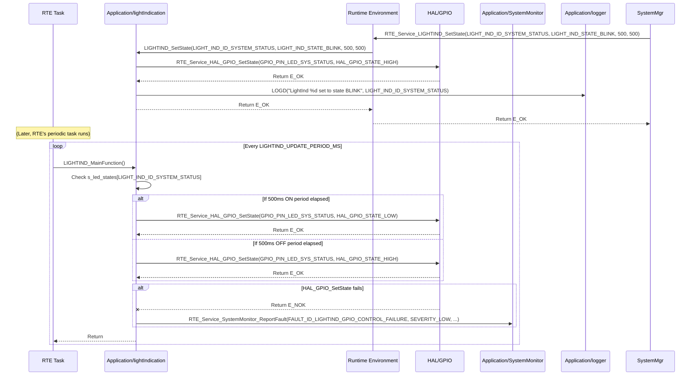

# **Detailed Design Document: LightInd (Light Indication) Component**

## **1. Introduction**

### **1.1. Purpose**

This document details the design of the LightInd component. Its primary purpose is to provide a high-level interface for controlling and managing various **LED indicators** on the smart device. It abstracts the complexities of the underlying hardware drivers (e.g., GPIO for direct LED control). This module is responsible for displaying system status, active states of actuators, and alarm conditions to the user, fulfilling requirements like SyRS-02-03-01 and SyRS-02-05-02.

### **1.2. Scope**

The scope of this document covers the LightInd module's architecture, functional behavior, interfaces, dependencies, and resource considerations. It details how LightInd receives commands from systemMgr or diagnostic (via RTE services) and controls the physical LEDs, including blinking patterns.

### **1.3. References**

* Software Architecture Document (SAD) - Environmental Monitoring & Control System (Final Version)  
* Detailed Design Document: RTE  
* Detailed Design Document: SystemMonitor  
* Detailed Design Document: HAL_GPIO (for LED control)  
* LED Datasheets

## **2. Functional Description**

The LightInd component provides the following core functionalities:

1. **Initialization (LightInd_Init)**: Initialize all configured LED indicator GPIO pins (via HAL_GPIO) to their default OFF state.  
2. **Set LED State (LIGHTIND_SetState)**: Allows other modules (e.g., systemMgr, diagnostic) to command a specific LED to be ON or OFF.  
3. **Set LED Blinking Pattern (LIGHTIND_SetBlink)**: Allows commanding an LED to blink at a specified rate (ON/OFF periods).  
4. **Periodic Update (LIGHTIND_MainFunction)**: This is the module's primary periodic function. It is responsible for managing the blinking patterns of all configured LEDs, toggling their states at the appropriate times.  
5. **Error Reporting**: Detect and report any failures during LED control (e.g., GPIO write error) to the SystemMonitor via RTE_Service_SystemMonitor_ReportFault().

## **3. Non-Functional Requirements**

### **3.1. Performance**

* **Responsiveness**: LED state changes (ON/OFF) shall be immediate. Blinking patterns shall be smooth and accurate.  
* **Update Rate**: LIGHTIND_MainFunction shall execute frequently enough to ensure smooth blinking patterns (defined by LIGHTIND_UPDATE_PERIOD_MS).

### **3.2. Memory**

* **Minimal Footprint**: The LightInd module shall have a minimal memory footprint for its internal state variables (e.g., current state, blink counters for each LED).

### **3.3. Reliability**

* **Robustness**: The module shall be robust against invalid LED IDs or hardware control failures.  
* **Consistency**: LED indications shall consistently reflect the system's actual status.

## **4. Architectural Context**

As per the SAD (Section 3.1.2, Application Layer), LightInd resides in the Application Layer. It is responsible for controlling indicator LEDs. It is primarily driven by the RTE_DisplayAlarmTask or RTE_MainLoopTask, which periodically calls LIGHTIND_MainFunction(). Other application modules (e.g., systemMgr, diagnostic) interact with LightInd via RTE services to command LED states.

## **5. Design Details**

### **5.1. Module Structure**

The LightInd component will consist of the following files:

* Application/lightIndication/inc/lightIndication.h: Public header file containing function prototypes, LED IDs, and state definitions.  
* Application/lightIndication/src/lightIndication.c: Source file containing the implementation of LED control logic and the internal periodic update function.  
* Application/lightIndication/cfg/lightIndication_cfg.h: Configuration header for LED GPIO pin mappings, default states, and blinking parameters.

### **5.2. Public Interface (API)**

// In Application/lightIndication/inc/lightIndication.h
```c
#include "Application/common/inc/common.h" // For APP_Status_t  
#include <stdint.h>   // For uint32_t, uint8_t  
#include <stdbool.h>  // For bool

// --- LED Indicator IDs (SyRS-02-03-01) ---  
typedef enum {  
    LIGHT_IND_ID_SYSTEM_STATUS = 0, // LED1 (blinking when operational)  
    LIGHT_IND_ID_COOLING_ACTIVE,    // LED2  
    LIGHT_IND_ID_LIGHTING_ACTIVE,   // LED3  
    LIGHT_IND_ID_PUMP_ACTIVE,       // LED4  
    LIGHT_IND_ID_COMM_ACTIVE,       // LED5  
    LIGHT_IND_ID_ALARM_FAULT,       // Additional for SyRS-02-05-02 (LED1 for faults)  
    // Add more if needed  
    LIGHT_IND_COUNT // Total number of configured LEDs  
} LightInd_Id_t;

// --- LED State Definitions ---  
typedef enum {  
    LIGHT_IND_STATE_OFF = 0,  
    LIGHT_IND_STATE_ON,  
    LIGHT_IND_STATE_BLINK,  
} LightInd_State_t;

/**  
 * @brief Initializes the LightInd module and all configured LED GPIO pins.  
 * All LEDs are set to their default OFF state initially.  
 * @return E_OK on success, E_NOK on failure.  
 */  
APP_Status_t LightInd_Init(void);

/**  
 * @brief Sets the state of a specific LED indicator (ON/OFF/BLINK).  
 * If set to BLINK, the blink_on_ms and blink_off_ms parameters define the blinking pattern.  
 * If set to ON/OFF, blinking parameters are ignored.  
 * @param led_id The ID of the LED to control.  
 * @param state The desired state (LIGHT_IND_STATE_ON, LIGHT_IND_STATE_OFF, LIGHT_IND_STATE_BLINK).  
 * @param blink_on_ms The ON duration in milliseconds for blinking (ignored if state is ON/OFF).  
 * @param blink_off_ms The OFF duration in milliseconds for blinking (ignored if state is ON/OFF).  
 * @return E_OK on success, E_NOK if the led_id is invalid or parameters are out of range.  
 */  
APP_Status_t LIGHTIND_SetState(LightInd_Id_t led_id, LightInd_State_t state, uint32_t blink_on_ms, uint32_t blink_off_ms);

// --- Internal Periodic Runnable Prototype (called by RTE) ---  
// This function is declared here so RTE can call it.  
/**  
 * @brief Performs periodic updates for LED blinking patterns.  
 * This function is intended to be called periodically by an RTE task.  
 */  
void LIGHTIND_MainFunction(void);
```
### **5.3. Internal Design**

The LightInd module will manage the state and blinking logic for each configured LED.

1. **Internal State**:  
   ```c
   // Structure to hold the state for each LED  
   typedef struct {  
       LightInd_State_t    commanded_state;  
       bool                current_hardware_state; // True if LED is currently ON  
       uint32_t            blink_on_period_ms;  
       uint32_t            blink_off_period_ms;  
       uint32_t            last_toggle_time_ms;  
   } LightInd_LedState_t;

   static LightInd_LedState_t s_led_states[LIGHT_IND_COUNT];  
   static bool s_is_initialized = false; // Module initialization status
   ```
   * All these variables will be initialized in LightInd_Init().  
2. **Initialization (LightInd_Init)**:  
   * **Zeroing Variables**:  
     * Initialize all elements of s_led_states to LIGHT_IND_STATE_OFF, current_hardware_state = false, and blink periods to 0.  
   * **GPIO Initialization (for each configured LED)**:  
     * Iterate through light_ind_configs array (defined in lightIndication_cfg.h).  
     * For each light_ind_config:  
       * Call RTE_Service_HAL_GPIO_SetState(light_ind_config.gpio_pin, HAL_GPIO_STATE_LOW) to ensure all LEDs are initially OFF.  
       * If this fails, report FAULT_ID_LIGHTIND_GPIO_INIT_FAILURE to SystemMonitor.  
   * s_is_initialized = true; on overall success.  
   * Return E_OK.  
3. **Set LED State (LIGHTIND_SetState)**:  
   * If !s_is_initialized, return E_NOK and log a warning.  
   * Validate led_id. If led_id >= LIGHT_IND_COUNT, return E_NOK and log a warning.  
   * Get the corresponding LightInd_LedConfig_t from light_ind_configs.  
   * Update s_led_states[led_id].commanded_state = state;.  
   * If state == LIGHT_IND_STATE_ON:  
     * s_led_states[led_id].current_hardware_state = true;  
     * Call RTE_Service_HAL_GPIO_SetState(light_ind_config.gpio_pin, HAL_GPIO_STATE_HIGH);  
   * Else if state == LIGHT_IND_STATE_OFF:  
     * s_led_states[led_id].current_hardware_state = false;  
     * Call RTE_Service_HAL_GPIO_SetState(light_ind_config.gpio_pin, HAL_GPIO_STATE_LOW);  
   * Else if state == LIGHT_IND_STATE_BLINK:  
     * s_led_states[led_id].blink_on_period_ms = blink_on_ms;  
     * s_led_states[led_id].blink_off_period_ms = blink_off_ms;  
     * s_led_states[led_id].last_toggle_time_ms = APP_COMMON_GetUptimeMs();  
     * Initialize to ON state for blinking:  
       * s_led_states[led_id].current_hardware_state = true;  
       * RTE_Service_HAL_GPIO_SetState(light_ind_config.gpio_pin, HAL_GPIO_STATE_HIGH);  
   * If any RTE_Service_HAL_GPIO_SetState call fails, report FAULT_ID_LIGHTIND_GPIO_CONTROL_FAILURE to SystemMonitor.  
   * Log LOGD("LightInd %d set to state %d", led_id, state);.  
   * Return E_OK.  
4. **Periodic Update (LIGHTIND_MainFunction)**:  
   * This function is called periodically by an RTE task (e.g., RTE_DisplayAlarmTask).  
   * If !s_is_initialized, return immediately.  
   * Get current uptime: uint32_t current_time_ms = APP_COMMON_GetUptimeMs();.  
   * **Iterate through all configured LEDs**:  
     * For each led_id from 0 to LIGHT_IND_COUNT - 1:  
       * Get LightInd_LedState_t *led_state = &s_led_states[led_id];.  
       * Get LightInd_LedConfig_t *led_config = &light_ind_configs[led_id];.  
       * If led_state->commanded_state == LIGHT_IND_STATE_BLINK:  
         * If led_state->current_hardware_state == true (LED is ON):  
           * If (current_time_ms - led_state->last_toggle_time_ms) >= led_state->blink_on_period_ms:  
             * Toggle LED to OFF: RTE_Service_HAL_GPIO_SetState(led_config->gpio_pin, HAL_GPIO_STATE_LOW);  
             * led_state->current_hardware_state = false;  
             * led_state->last_toggle_time_ms = current_time_ms;  
         * Else (led_state->current_hardware_state == false, LED is OFF):  
           * If (current_time_ms - led_state->last_toggle_time_ms) >= led_state->blink_off_period_ms:  
             * Toggle LED to ON: RTE_Service_HAL_GPIO_SetState(led_config->gpio_pin, HAL_GPIO_STATE_HIGH);  
             * led_state->current_hardware_state = true;  
             * led_state->last_toggle_time_ms = current_time_ms;  
       * If any RTE_Service_HAL_GPIO_SetState call fails during blinking, report FAULT_ID_LIGHTIND_GPIO_CONTROL_FAILURE to SystemMonitor.

**Sequence Diagram (Example: System Status LED Blinking):**

### **5.4. Dependencies**

* Application/common/inc/common.h: For APP_Status_t, E_OK/E_NOK, and APP_COMMON_GetUptimeMs().  
* Application/logger/inc/logger.h: For internal logging.  
* Rte/inc/Rte.h: For calling RTE_Service_SystemMonitor_ReportFault() and RTE_Service_HAL_GPIO_SetState().  
* Application/SystemMonitor/inc/system_monitor.h: For FAULT_ID_LIGHTIND_... definitions.  
* HAL/inc/hal_gpio.h: For HAL_GPIO_State_t and HAL_GPIO_SetState().  
* Application/lightIndication/cfg/lightIndication_cfg.h: For LED configurations.

### **5.5. Error Handling**

* **Initialization Failure**: If RTE_Service_HAL_GPIO_SetState() fails during LightInd_Init(), FAULT_ID_LIGHTIND_GPIO_INIT_FAILURE is reported to SystemMonitor.  
* **GPIO Control Errors**: If RTE_Service_HAL_GPIO_SetState() fails during LIGHTIND_SetState() or LIGHTIND_MainFunction(), FAULT_ID_LIGHTIND_GPIO_CONTROL_FAILURE is reported to SystemMonitor.  
* **Input Validation**: LIGHTIND_SetState validates led_id and parameters.  
* **Return Status**: All public API functions return E_NOK on failure.

### **5.6. Configuration**

The Application/lightIndication/cfg/lightIndication_cfg.h file will contain:

* **LED GPIO Mappings**: An array of LightInd_LedConfig_t structures, mapping each LightInd_Id_t to its physical GPIO pin.  
* **Periodic Update Rate**: LIGHTIND_UPDATE_PERIOD_MS: The frequency at which LIGHTIND_MainFunction() is called by RTE.
```c
// Example: Application/lightIndication/cfg/lightIndication_cfg.h  
#ifndef LIGHT_INDICATION_CFG_H  
#define LIGHT_INDICATION_CFG_H

#include "Application/lightIndication/inc/lightIndication.h" // For LightInd_Id_t  
#include "HAL/inc/hal_gpio.h" // For HAL_GPIO_Pin_t (if needed, or directly use uint8_t)

// Structure to map LED ID to its GPIO pin  
typedef struct {  
    LightInd_Id_t id;  
    uint8_t       gpio_pin;  
} LightInd_LedConfig_t;

// Array defining the configuration for each LED indicator  
const LightInd_LedConfig_t light_ind_configs[LIGHT_IND_COUNT] = {  
    { .id = LIGHT_IND_ID_SYSTEM_STATUS,  .gpio_pin = HAL_GPIO_PIN_LED1 }, // Example: LED1  
    { .id = LIGHT_IND_ID_COOLING_ACTIVE, .gpio_pin = HAL_GPIO_PIN_LED2 }, // Example: LED2  
    { .id = LIGHT_IND_ID_LIGHTING_ACTIVE, .gpio_pin = HAL_GPIO_PIN_LED3 }, // Example: LED3  
    { .id = LIGHT_IND_ID_PUMP_ACTIVE,    .gpio_pin = HAL_GPIO_PIN_LED4 }, // Example: LED4  
    { .id = LIGHT_IND_ID_COMM_ACTIVE,    .gpio_pin = HAL_GPIO_PIN_LED5 }, // Example: LED5  
    { .id = LIGHT_IND_ID_ALARM_FAULT,    .gpio_pin = HAL_GPIO_PIN_LED1 }, // Example: Re-use LED1 for fault (SyRS-02-05-02)  
};

// Periodic update rate for LIGHTIND_MainFunction  
#define LIGHTIND_UPDATE_PERIOD_MS       50 // 50 ms (for smooth blinking)

// Example GPIO pin definitions (these would be in HAL/cfg/hal_gpio_cfg.h)  
#ifndef HAL_GPIO_PIN_LED1  
#define HAL_GPIO_PIN_LED1               2  // Example GPIO pin for LED1  
#define HAL_GPIO_PIN_LED2               3  // Example GPIO pin for LED2  
#define HAL_GPIO_PIN_LED3               4  // Example GPIO pin for LED3  
#define HAL_GPIO_PIN_LED4               5  // Example GPIO pin for LED4  
#define HAL_GPIO_PIN_LED5               6  // Example GPIO pin for LED5  
#endif

#endif // LIGHT_INDICATION_CFG_H
```
### **5.7. Resource Usage**

* **Flash**: Low, for the module's code and the light_ind_configs array.  
* **RAM**: Low, for the s_led_states array (proportional to LIGHT_IND_COUNT).  
* **CPU**: Very low, as LIGHTIND_MainFunction involves simple time checks and a few GPIO writes.

## **6. Test Considerations**

### **6.1. Unit Testing**

* **Mock Dependencies**: Unit tests for LightInd will mock RTE_Service_HAL_GPIO_SetState(), RTE_Service_SystemMonitor_ReportFault(), and APP_COMMON_GetUptimeMs().  
* **Test Cases**:  
  * LightInd_Init: Verify RTE_Service_HAL_GPIO_SetState() is called for all LEDs to set them OFF. Test initialization failure and fault reporting.  
  * LIGHTIND_SetState:  
    * Test setting LEDs to ON and OFF. Verify RTE_Service_HAL_GPIO_SetState() is called with the correct state.  
    * Test setting an LED to BLINK with various blink_on_ms/blink_off_ms. Verify initial state is ON and last_toggle_time_ms is set.  
    * Test with invalid led_id.  
    * Test scenarios where RTE_Service_HAL_GPIO_SetState() fails (verify E_NOK return and fault reporting).  
  * LIGHTIND_MainFunction:  
    * Mock APP_COMMON_GetUptimeMs() to simulate time passing.  
    * Test blinking logic: Verify LEDs toggle ON/OFF at the correct intervals for configured blinking patterns.  
    * Verify that LEDs set to ON or OFF remain in that state and are not affected by the blinking logic.  
    * Test RTE_Service_HAL_GPIO_SetState() failure during blinking (verify fault reporting).

### **6.2. Integration Testing**

* **LightInd-HAL_GPIO Integration**: Verify LightInd correctly interfaces with the actual HAL_GPIO driver to control physical LEDs.  
* **LightInd-systemMgr/diagnostic Integration**: Verify systemMgr and diagnostic can correctly command LED states (ON/OFF/Blink) via RTE services, and that the physical LEDs respond as expected.  
* **Blinking Patterns**: Visually confirm that all configured blinking patterns (e.g., system status, alarm) are accurate.  
* **Fault Reporting**: Trigger HAL_GPIO_SetState() errors (e.g., by simulating GPIO driver issues) and verify LightInd reports faults to SystemMonitor.

### **6.3. System Testing**

* **End-to-End Indication**: Verify that all system status, actuator active states, and alarm indications are correctly displayed by the LEDs throughout various operational scenarios.  
* **Alarm Indication**: Simulate alarm conditions (e.g., high temperature, critical fault) and verify the ALARM_FAULT LED (LED1 as per SyRS-02-05-02) activates with the correct pattern.  
* **Power-On Status**: Verify SYSTEM_STATUS LED starts blinking correctly on power-on.  
* **Long-Term Reliability**: Run the system for extended periods to ensure continuous and reliable LED operation.