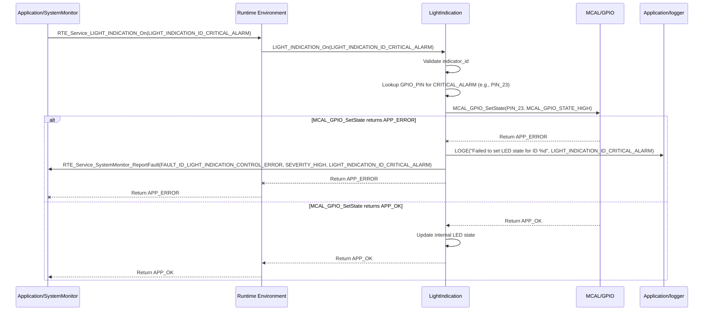

# **Detailed Design Document: LightIndication Component**

## **1. Introduction**

### **1.1. Purpose**

This document details the design of the LightIndication component. Its primary purpose is to provide a standardized, high-level interface for controlling various indicator LEDs (Light Emitting Diodes) on the device. These LEDs are used to provide visual feedback on system status, alarms, communication activity, or operational modes. It abstracts the direct GPIO control, allowing other modules (e.g., systemMgr, SystemMonitor, ComM) to easily manage indicator states.

### **1.2. Scope**

The scope of this document covers the lightIndication module's architecture, functional behavior, interfaces, dependencies, and resource considerations. It details how lightIndication receives commands from various application and service modules (via RTE services) and interacts with the underlying MCAL_GPIO driver for physical LED control.

### **1.3. References**

* Software Architecture Document (SAD) - Smart Device Firmware (Final Version)  
* Detailed Design Document: RTE  
* Detailed Design Document: MCAL_GPIO  
* LED Datasheet (Conceptual)

## **2. Functional Description**

The LightIndication component provides the following core functionalities:

1. **Initialization**: Initialize the GPIO pins connected to the indicator LEDs to a safe default state (e.g., all LEDs off).  
2. **Turn LED On**: Activate a specific indicator LED.  
3. **Turn LED Off**: Deactivate a specific indicator LED.  
4. **Toggle LED**: Toggle the state of a specific indicator LED.  
5. **Set LED Blink Pattern (Optional)**: Configure an LED to blink at a specific rate or pattern (requires internal timer management or FreeRTOS software timers).  
6. **Error Reporting**: Report any failures during LED control (e.g., GPIO initialization failure, invalid LED ID) to the SystemMonitor via RTE_Service_SystemMonitor_ReportFault().

## **3. Non-Functional Requirements**

### **3.1. Performance**

* **Responsiveness**: LED state changes should be applied promptly after a command.  
* **Low Overhead**: LED control should have minimal CPU overhead.

### **3.2. Memory**

* **Minimal Footprint**: The lightIndication module shall have a minimal memory footprint.

### **3.3. Reliability**

* **Robustness**: The module shall be robust against invalid LED IDs or underlying hardware failures.  
* **Clear Indication**: LEDs should provide clear and unambiguous visual feedback.

## **4. Architectural Context**

As per the SAD (Section 3.1.2, Application Layer), lightIndication resides in the Application Layer. It receives commands to control specific LEDs from modules like systemMgr (for operational modes), SystemMonitor (for alarms), or ComM (for communication status) via RTE_Service_LIGHT_INDICATION_On()/Off(). It then interacts with the MCAL_GPIO driver to toggle the physical LEDs.

## **5. Design Details**

### **5.1. Module Structure**

The LightIndication component will consist of the following files:

* LightIndication/inc/lightIndication.h: Public header file containing function prototypes and definitions for unique LED IDs.  
* LightIndication/src/lightIndication.c: Source file containing the implementation of LED control logic.  
* LightIndication/cfg/lightIndication_cfg.h: Configuration header for mapping LED IDs to GPIO pins and defining default states.

### **5.2. Public Interface (API)**

// In LightIndication/inc/lightIndication.h
```c
#include "Application/common/inc/app_common.h" // For APP_Status_t  
#include <stdbool.h> // For bool  
#include <stdint.h>  // For uint32_t

// --- Indicator LED IDs ---  
// Define unique IDs for each indicator LED in the system.  
typedef enum {  
    LIGHT_INDICATION_ID_SYSTEM_STATUS = 0, // General system heartbeat/status  
    LIGHT_INDICATION_ID_WIFI_STATUS,       // Wi-Fi connection status  
    LIGHT_INDICATION_ID_BLE_STATUS,        // BLE connection status  
    LIGHT_INDICATION_ID_MODBUS_ACTIVITY,   // Modbus communication activity  
    LIGHT_INDICATION_ID_CRITICAL_ALARM,    // Critical fault/alarm indicator  
    LIGHT_INDICATION_ID_HEATER_ACTIVE,     // Heater active indicator  
    LIGHT_INDICATION_ID_FAN_ACTIVE,        // Fan active indicator  
    // Add more as needed  
    LIGHT_INDICATION_ID_COUNT  
} LIGHT_INDICATION_ID_t;

// --- Public Functions ---

/**  
 * @brief Initializes the Light Indication module and all associated LED GPIO pins.  
 * Sets all LEDs to a safe default state (e.g., off).  
 * @return APP_OK on success, APP_ERROR on failure.  
 */  
APP_Status_t LIGHT_INDICATION_Init(void);

/**  
 * @brief Turns on a specific indicator LED.  
 * @param indicator_id The ID of the LED to turn on.  
 * @return APP_OK on success, APP_ERROR on failure.  
 */  
APP_Status_t LIGHT_INDICATION_On(LIGHT_INDICATION_ID_t indicator_id);

/**  
 * @brief Turns off a specific indicator LED.  
 * @param indicator_id The ID of the LED to turn off.  
 * @return APP_OK on success, APP_ERROR on failure.  
 */  
APP_Status_t LIGHT_INDICATION_Off(LIGHT_INDICATION_ID_t indicator_id);

/**  
 * @brief Toggles the state of a specific indicator LED.  
 * @param indicator_id The ID of the LED to toggle.  
 * @return APP_OK on success, APP_ERROR on failure.  
 */  
APP_Status_t LIGHT_INDICATION_Toggle(LIGHT_INDICATION_ID_t indicator_id);

// Optional: For blinking patterns, requires internal timer management  
// APP_Status_t LIGHT_INDICATION_SetBlinkPattern(LIGHT_INDICATION_ID_t indicator_id, uint32_t on_time_ms, uint32_t off_time_ms);  
// APP_Status_t LIGHT_INDICATION_StopBlink(LIGHT_INDICATION_ID_t indicator_id);
```

### **5.3. Internal Design**

The LightIndication module will maintain the current state of each LED internally. It will use a lookup table to map logical LIGHT_INDICATION_ID_t to physical GPIO pins and interact with the MCAL layer.

1. **Initialization (LIGHT_INDICATION_Init)**:  
   * Iterate through a configuration array (e.g., led_configs in lightIndication_cfg.h).  
   * For each configured LED:  
     * Call MCAL_GPIO_Init() for its associated GPIO_PIN, configuring it as an output.  
     * Set the LED to its default state (e.g., off).  
   * If any MCAL_GPIO_Init() fails, report FAULT_ID_LIGHT_INDICATION_INIT_FAILED to SystemMonitor.  
   * Return APP_OK.  
2. **Turn On (LIGHT_INDICATION_On)**:  
   * Validate indicator_id.  
   * Look up the corresponding GPIO_PIN from the configuration.  
   * Call MCAL_GPIO_SetState(GPIO_PIN, MCAL_GPIO_STATE_HIGH) (assuming active-high LEDs).  
   * Update the internal state for this LED.  
   * If MCAL_GPIO_SetState() fails, report FAULT_ID_LIGHT_INDICATION_CONTROL_ERROR to SystemMonitor.  
   * Return APP_OK.  
3. **Turn Off (LIGHT_INDICATION_Off)**:  
   * Validate indicator_id.  
   * Look up the corresponding GPIO_PIN.  
   * Call MCAL_GPIO_SetState(GPIO_PIN, MCAL_GPIO_STATE_LOW).  
   * Update the internal state for this LED.  
   * If MCAL_GPIO_SetState() fails, report FAULT_ID_LIGHT_INDICATION_CONTROL_ERROR to SystemMonitor.  
   * Return APP_OK.  
4. **Toggle (LIGHT_INDICATION_Toggle)**:  
   * Validate indicator_id.  
   * Look up the corresponding GPIO_PIN.  
   * Read the current state of the pin using MCAL_GPIO_GetState().  
   * Call MCAL_GPIO_SetState() to set the opposite state.  
   * Update the internal state.  
   * If any MCAL call fails, report FAULT_ID_LIGHT_INDICATION_CONTROL_ERROR to SystemMonitor.  
   * Return APP_OK.

**Sequence Diagram (Example: SystemMonitor Activates Critical Alarm LED):**


### **5.4. Dependencies**

* **Application/common/inc/app_common.h**: For APP_Status_t.  
* **Application/logger/inc/logger.h**: For logging LED control errors.  
* **Application/SystemMonitor/inc/system_monitor.h**: For SystemMonitor_FaultId_t (e.g., FAULT_ID_LIGHT_INDICATION_INIT_FAILED).  
* **Rte/inc/Rte.h**: For calling RTE_Service_SystemMonitor_ReportFault().  
* **Mcal/gpio/inc/mcal_gpio.h**: For GPIO control of the LEDs.

### **5.5. Error Handling**

* **Initialization Failure**: If any LED's GPIO initialization fails, FAULT_ID_LIGHT_INDICATION_INIT_FAILED is reported to SystemMonitor.  
* **Invalid LED ID**: If an invalid indicator_id is provided, the function will return APP_ERROR and log a warning.  
* **Control Hardware Failure**: If MCAL_GPIO_SetState() returns an error, FAULT_ID_LIGHT_INDICATION_CONTROL_ERROR is reported.

### **5.6. Configuration**

The LightIndication/cfg/lightIndication_cfg.h file will contain:

* **LED Configuration Array**: An array of structures mapping LIGHT_INDICATION_ID_t to their respective GPIO_PIN and DEFAULT_STATE.  
* LIGHT_INDICATION_LED_COUNT: Total number of configured LEDs.

// Example: LightIndication/cfg/lightIndication_cfg.h
```c

#define LIGHT_INDICATION_LED_COUNT      5 // Number of LEDs to manage

// Structure to define an LED configuration  
typedef struct {  
    LIGHT_INDICATION_ID_t id;  
    uint8_t gpio_pin;  
    bool default_state_on; // true for on, false for off  
} LIGHT_INDICATION_Config_t;

// Array of LED configurations  
const LIGHT_INDICATION_Config_t light_indication_led_configs[LIGHT_INDICATION_LED_COUNT] = {  
    { .id = LIGHT_INDICATION_ID_SYSTEM_STATUS,  .gpio_pin = 2,  .default_state_on = false },  
    { .id = LIGHT_INDICATION_ID_WIFI_STATUS,    .gpio_pin = 4,  .default_state_on = false },  
    { .id = LIGHT_INDICATION_ID_BLE_STATUS,     .gpio_pin = 5,  .default_state_on = false },  
    { .id = LIGHT_INDICATION_ID_MODBUS_ACTIVITY,.gpio_pin = 16, .default_state_on = false },  
    { .id = LIGHT_INDICATION_ID_CRITICAL_ALARM,.gpio_pin = 23, .default_state_on = false }  
};
```
### **5.7. Resource Usage**

* **Flash**: Low.  
* **RAM**: Low, for the internal state array of LEDs (current_led_states) and the configuration array.  
* **CPU**: Very low. GPIO toggling is a fast operation.

## **6. Test Considerations**

### **6.1. Unit Testing**

* **Mock Dependencies**: Unit tests for lightIndication will mock MCAL_GPIO_Init(), MCAL_GPIO_SetState(), MCAL_GPIO_GetState(), and RTE_Service_SystemMonitor_ReportFault().  
* **Test Cases**:  
  * LIGHT_INDICATION_Init: Verify correct MCAL initialization calls for all configured LEDs and their default states. Test initialization failure and fault reporting.  
  * LIGHT_INDICATION_On/Off:  
    * Test with valid indicator_ids. Mock MCAL_GPIO_SetState() to verify correct GPIO levels are commanded.  
    * Test with invalid indicator_ids. Verify APP_ERROR return and error logging.  
    * Test underlying MCAL failures and verify FAULT_ID_LIGHT_INDICATION_CONTROL_ERROR is reported.  
  * LIGHT_INDICATION_Toggle: Test toggling for valid IDs. Verify state changes.  
  * (Optional) Blinking: If implemented, test setting and stopping blink patterns.

### **6.2. Integration Testing**

* **LightIndication-MCAL Integration**: Verify that lightIndication correctly interfaces with the actual MCAL_GPIO driver and the physical LEDs.  
* **Visual Verification**: Visually observe the LEDs to ensure they turn on/off/toggle as commanded.  
* **SystemMgr/SystemMonitor/ComM Control**: Verify that various modules can effectively control their respective indicator LEDs via RTE services.  
* **Fault Injection**: Disconnect an LED or cause a short on its GPIO pin and verify that lightIndication reports FAULT_ID_LIGHT_INDICATION_CONTROL_ERROR (if feedback mechanisms are in place, otherwise it's a passive module).

### **6.3. System Testing**

* **End-to-End Indication**: Verify that system status, communication activity, and alarms are correctly reflected by the indicator LEDs during normal operation and fault conditions.  
* **Long-Term Operation**: Run the system for extended periods to ensure continuous and reliable LED indication.
