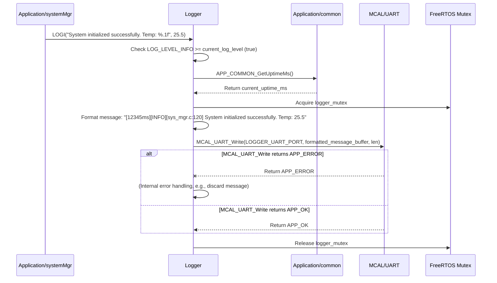

# **Detailed Design Document: Logger Component**

## **1. Introduction**

### **1.1. Purpose**

This document details the design of the Logger component. Its primary purpose is to provide a **standardized, system-wide logging mechanism** for debugging, monitoring, and error reporting. It centralizes log messages from all software layers (MCAL, HAL, Service, Application, RTE) and directs them to a configurable output destination (e.g., UART for console, internal buffer, external Flash). This ensures consistent log formatting and easy access to system events.

### **1.2. Scope**

The scope of this document covers the logger module's architecture, functional behavior, interfaces, dependencies, and resource considerations. It details how logger receives log messages from any part of the firmware and uses underlying MCAL drivers (e.g., MCAL_UART) to output them.

### **1.3. References**

* Software Architecture Document (SAD) - Smart Device Firmware (Final Version)  
* Detailed Design Document: MCAL_UART  
* FreeRTOS Documentation (for thread safety)

## **2. Functional Description**

The Logger component provides the following core functionalities:

1. **Initialization**: Initialize the logging output destination (e.g., UART peripheral).  
2. **Log Message API**: Provide a set of macros/functions for different log levels (e.g., Info, Warning, Error, Debug, Verbose) to submit log messages.  
3. **Log Level Filtering**: Allow dynamic or compile-time configuration of the minimum log level to be output.  
4. **Timestamping**: Automatically add a timestamp (using system uptime) to each log message.  
5. **Thread Safety**: Ensure that multiple tasks can log concurrently without corrupting log messages (e.g., using a mutex or a FreeRTOS queue).  
6. **Output Destination**: Direct log messages to a configurable output (e.g., UART console, internal RAM buffer, external Flash).  
7. **Error Handling**: Handle potential failures in outputting log messages (e.g., UART buffer full) gracefully.

## **3. Non-Functional Requirements**

### **3.1. Performance**

* **Low Overhead**: Logging operations should have minimal impact on system performance, especially for high-frequency logs.  
* **Non-Blocking (Preferably)**: Logging should ideally be non-blocking to avoid stalling critical tasks.

### **3.2. Memory**

* **Minimal Footprint**: The logger module code and any internal buffers shall have a minimal memory footprint.

### **3.3. Reliability**

* **Robustness**: The logger should be robust and not crash the system, even if its output destination fails.  
* **Consistency**: Log messages should be consistently formatted.  
* **Completeness**: Critical errors should always be logged.

## **4. Architectural Context**

As per the SAD (Section 3.1.2, Application Layer), logger resides in the Application Layer. However, due to its cross-cutting nature, it is an exception to the strict layering and can be called directly by any module in any layer (MCAL, HAL, Service, Application, RTE) to report events. It uses MCAL_UART for console output and Application/common for timestamps.

## **5. Design Details**

### **5.1. Module Structure**

The Logger component will consist of the following files:

* Logger/inc/logger.h: Public header file containing log level definitions and logging macros/functions.  
* Logger/src/logger.c: Source file containing the implementation of the logging logic, including outputting to UART.  
* Logger/cfg/logger_cfg.h: Configuration header for default log level, output destination, and buffer sizes.

### **5.2. Public Interface (API)**

// In Logger/inc/logger.h

```c
#include <stdint.h> // For uint32_t  
#include <stdarg.h> // For va_list (if using vprintf-style functions)

// --- Log Levels ---  
typedef enum {  
    LOG_LEVEL_NONE = 0, // No logging  
    LOG_LEVEL_ERROR,    // Critical errors that require immediate attention  
    LOG_LEVEL_WARNING,  // Potentially problematic situations  
    LOG_LEVEL_INFO,     // General information, system events  
    LOG_LEVEL_DEBUG,    // Debugging information, detailed flow  
    LOG_LEVEL_VERBOSE   // Most detailed, verbose logging  
} LOG_LEVEL_t;

// --- Logging Macros ---  
// These macros provide a convenient way to log messages with file/line info.  
// They internally call logger_printf_impl with the appropriate log level.

#define LOGE(format, ...) logger_printf_impl(LOG_LEVEL_ERROR, __FILE__, __LINE__, format, ##__VA_ARGS__)  
#define LOGW(format, ...) logger_printf_impl(LOG_LEVEL_WARNING, __FILE__, __LINE__, format, ##__VA_ARGS__)  
#define LOGI(format, ...) logger_printf_impl(LOG_LEVEL_INFO, __FILE__, __LINE__, format, ##__VA_ARGS__)  
#define LOGD(format, ...) logger_printf_impl(LOG_LEVEL_DEBUG, __FILE__, __LINE__, format, ##__VA_ARGS__)  
#define LOGV(format, ...) logger_printf_impl(LOG_LEVEL_VERBOSE, __FILE__, __LINE__, format, ##__VA_ARGS__)

// --- Public Functions ---

/**  
 * @brief Initializes the Logger module.  
 * This function should be called very early in system startup (e.g., app_main).  
 * It initializes the configured logging output destination (e.g., UART).  
 */  
void LOGGER_Init(void);

/**  
 * @brief Sets the global minimum log level. Messages with lower severity will be filtered out.  
 * @param level The new minimum log level.  
 */  
void LOGGER_SetLogLevel(LOG_LEVEL_t level);

/**  
 * @brief Internal implementation function for logging.  
 * Typically not called directly by application code; use LOGE, LOGW, etc. macros instead.  
 * @param level The log level of the message.  
 * @param file The source file where the log originated (__FILE__).  
 * @param line The line number where the log originated (__LINE__).  
 * @param format The format string for the log message.  
 * @param ... Variable arguments for the format string.  
 */  
void logger_printf_impl(LOG_LEVEL_t level, const char *file, int line, const char *format, ...);
```

### **5.3. Internal Design**

The Logger module will manage a log level filter, format log messages, and ensure thread-safe output to the configured destination.

1. **Initialization (LOGGER_Init)**:  
   * Initialize the chosen output interface:  
     * If LOGGER_OUTPUT_UART is configured: Call MCAL_UART_Init() for the LOGGER_UART_PORT with appropriate baud rate.  
     * If LOGGER_OUTPUT_BUFFER is configured: Initialize a circular buffer in RAM.  
     * If LOGGER_OUTPUT_FLASH is configured: Initialize Service_NvM or MCAL_FLASH for log storage.  
   * Set the initial current_log_level from logger_cfg.h.  
   * Create a FreeRTOS mutex (logger_mutex) to protect the output operation.  
   * Return void (logging should not block or fail critically).  
2. **Set Log Level (LOGGER_SetLogLevel)**:  
   * Update the current_log_level variable.  
3. **logger_printf_impl (Core Logging Logic)**:  
   * **Log Level Check**: Check if the level of the incoming message is greater than or equal to current_log_level. If not, return immediately.  
   * **Timestamp**: Get system uptime using APP_COMMON_GetUptimeMs().  
   * **Mutex Acquisition**: Acquire logger_mutex to ensure exclusive access to the output.  
   * **Format Message**:  
     * Format the log prefix (timestamp, level, file:line) into a temporary buffer.  
     * Use vsnprintf to format the user's format string and arguments into the same or another temporary buffer.  
     * Concatenate prefix and message.  
   * **Output to Destination**:  
     * If LOGGER_OUTPUT_UART: Call MCAL_UART_Write() to send the formatted string.  
     * If LOGGER_OUTPUT_BUFFER: Copy the formatted string to the internal circular buffer.  
     * If LOGGER_OUTPUT_FLASH: Write the formatted string to Flash memory (potentially in chunks or after accumulating).  
   * **Mutex Release**: Release logger_mutex.  
   * **Error Handling**: If MCAL_UART_Write() or other output operations fail, log an internal error (without using the failing logger) or simply discard the message. The logger should never crash the system.

**Sequence Diagram (Example: Application Module Logs an Info Message):**


### **5.4. Dependencies**

* **Application/common/inc/app_common.h**: For APP_COMMON_GetUptimeMs().  
* **Mcal/uart/inc/mcal_uart.h**: If LOGGER_OUTPUT_UART is used.  
* **Service/os/inc/service_os.h**: For FreeRTOS mutexes (SERVICE_OS_CreateMutex, SERVICE_OS_AcquireMutex, SERVICE_OS_ReleaseMutex).  
* <stdio.h>, <stdarg.h>, <string.h>: For string formatting and manipulation.

### **5.5. Error Handling**

* **Output Failures**: If the chosen output mechanism fails (e.g., UART buffer full, Flash write error), the logger should attempt to handle it gracefully (e.g., discard the message, use a fallback output) without crashing the system.  
* **Thread Safety**: The use of logger_mutex prevents race conditions when multiple tasks try to log simultaneously.

### **5.6. Configuration**

The Logger/cfg/logger_cfg.h file will contain:

* **Default Log Level**: LOGGER_DEFAULT_LOG_LEVEL.  
* **Output Destination**: Define one of LOGGER_OUTPUT_UART, LOGGER_OUTPUT_BUFFER, LOGGER_OUTPUT_FLASH.  
* **For UART Output**: LOGGER_UART_PORT, LOGGER_UART_BAUDRATE.  
* **For Buffer Output**: LOGGER_BUFFER_SIZE_BYTES.  
* **Max Message Length**: LOGGER_MAX_MESSAGE_LENGTH_BYTES.  
* **Enable File/Line Info**: LOGGER_ENABLE_FILE_LINE_INFO (boolean).

// Example: Logger/cfg/logger_cfg.h
```c
#define LOGGER_DEFAULT_LOG_LEVEL        LOG_LEVEL_INFO

// Choose logging output destination (only one should be 1)  
#define LOGGER_OUTPUT_UART              1  
#define LOGGER_OUTPUT_BUFFER            0  
#define LOGGER_OUTPUT_FLASH             0

#if LOGGER_OUTPUT_UART  
#define LOGGER_UART_PORT                MCAL_UART_PORT_0  
#define LOGGER_UART_BAUDRATE            115200  
#endif

#if LOGGER_OUTPUT_BUFFER  
#define LOGGER_BUFFER_SIZE_BYTES        4096 // 4KB circular buffer  
#endif

#define LOGGER_MAX_MESSAGE_LENGTH_BYTES 256 // Max length of a single formatted log message

#define LOGGER_ENABLE_FILE_LINE_INFO    true // Include __FILE__ and __LINE__ in logs
```
### **5.7. Resource Usage**

* **Flash**: Low.  
* **RAM**: Moderate, primarily for internal buffers used for formatting messages and potentially for the circular log buffer. LOGGER_MAX_MESSAGE_LENGTH_BYTES directly impacts this.  
* **CPU**: Low. Logging is typically a low-priority background task. vsnprintf can be CPU-intensive if messages are very long or complex.

## **6. Test Considerations**

### **6.1. Unit Testing**

* **Mock Dependencies**: Unit tests for logger will mock APP_COMMON_GetUptimeMs(), MCAL_UART_Init(), MCAL_UART_Write(), and FreeRTOS mutex APIs.  
* **Test Cases**:  
  * LOGGER_Init: Verify correct MCAL initialization calls for the chosen output.  
  * LOGGER_SetLogLevel: Verify that messages below the set level are filtered out.  
  * logger_printf_impl (via macros):  
    * Test different log levels (ERROR, INFO, DEBUG, VERBOSE) and verify filtering.  
    * Test with various format strings and arguments.  
    * Verify timestamping and file/line info (if enabled).  
    * Mock MCAL_UART_Write() to verify correct formatted string is passed.  
    * Test MCAL_UART_Write() returning an error and verify graceful handling (no crash).  
  * Thread Safety: Use multiple simulated tasks to call logging macros concurrently and verify that log messages are not interleaved or corrupted (requires mocking FreeRTOS task/mutex scheduling).

### **6.2. Integration Testing**

* **Logger-MCAL Integration**: Verify that logger correctly outputs messages to the physical UART console or other configured destination.  
* **System-wide Logging**: Verify that all modules across all layers are correctly using the logger macros and that their messages appear in the output.  
* **Performance Impact**: Monitor CPU load and task responsiveness with and without logging enabled (or at different log levels) to ensure minimal impact.  
* **Buffer Overflow (if applicable)**: For buffer-based logging, test scenarios where the buffer fills up and verify correct circular buffer behavior.

### **6.3. System Testing**

* **Long-Term Logging**: Run the system for extended periods and analyze the log output for unexpected errors, warnings, or abnormal behavior.  
* **Fault Injection**: Introduce system faults (e.g., disconnect a sensor, cause a communication error) and verify that relevant error messages are correctly logged by the affected modules via logger.
