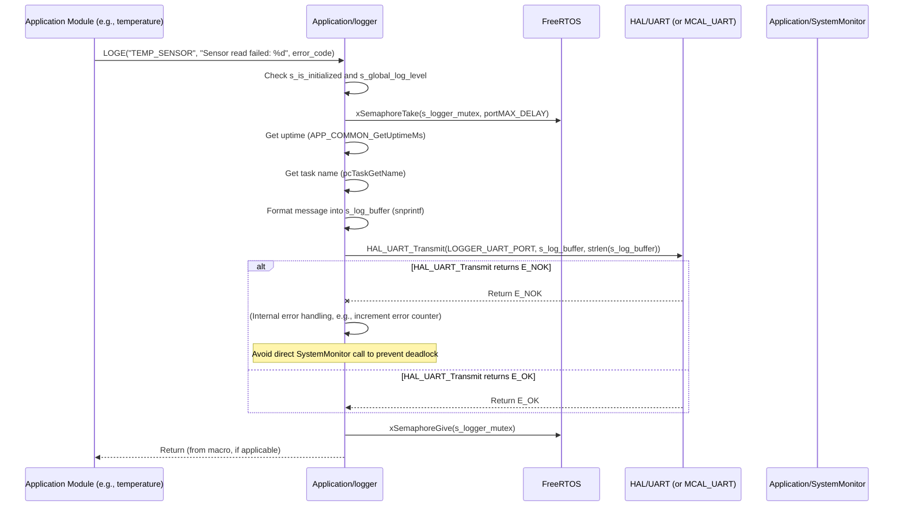

# **Detailed Design Document: Logger Component**

## **1. Introduction**

### **1.1. Purpose**

This document details the design of the Logger component. Its primary purpose is to provide a **standardized, flexible, and efficient logging mechanism** for all layers and modules within the Environmental Monitoring & Control System firmware. It abstracts the underlying output mechanism (e.g., UART, JTAG, network) and allows for configurable log levels. This fulfills the need for debugging, monitoring system behavior, and recording important events.

### **1.2. Scope**

The scope of this document covers the Logger module's architecture, functional behavior, interfaces, dependencies, and resource considerations. It details how Logger receives log messages from various modules, filters them based on severity, formats them, and outputs them to the configured destination.

### **1.3. References**

* Software Architecture Document (SAD) - Environmental Monitoring & Control System (Final Version)  
* Detailed Design Document: RTE  
* Detailed Design Document: HAL_UART (if UART is used for logging)  
* Detailed Design Document: MCAL_UART (if UART is used for logging)

## **2. Functional Description**

The Logger component provides the following core functionalities:

1. **Initialization (LOGGER_Init)**: Initialize the logging mechanism, including the underlying output peripheral (e.g., UART) and setting the initial global log level. This function is called very early in the system startup.  
2. **Log Message (LOGGER_Log)**: Receive a log message, including its severity level, source module tag, and format string with arguments. It filters the message based on the current log level, formats it, and sends it to the output sink.  
3. **Set Global Log Level (LOGGER_SetGlobalLevel)**: Dynamically change the minimum severity level required for a message to be logged. Messages below this level are discarded.  
4. **Error Reporting**: While Logger itself is critical for reporting, it should also handle internal errors gracefully (e.g., if the output buffer overflows or the underlying UART fails). Critical internal errors might be reported to SystemMonitor if possible, but the primary goal is to remain operational for other modules' logging.

## **3. Non-Functional Requirements**

### **3.1. Performance**

* **Low Overhead**: Logging operations shall have minimal impact on system performance, especially for high-frequency logs.  
* **Non-Blocking (where possible)**: Critical path logging should be non-blocking to avoid stalling tasks. This might involve using a circular buffer or asynchronous output.  
* **Speed**: Log messages should be processed and output quickly.

### **3.2. Memory**

* **Minimal Footprint**: The Logger code and data shall have a minimal memory footprint.  
* **Buffer Management**: Efficient use of internal buffers for formatting and transmission.

### **3.3. Reliability**

* **Robustness**: The module shall be robust against malformed log messages or failures in the output mechanism, preventing system crashes.  
* **Persistence (Optional)**: For critical events, the logger could optionally support writing to non-volatile memory (e.g., via Nvm module) for post-mortem analysis. (This is a future consideration, not a core requirement for initial design).  
* **Thread Safety**: Logging functions should be thread-safe to allow concurrent calls from multiple FreeRTOS tasks.

## **4. Architectural Context**

As per the SAD (Section 3.1.2, Application Layer), Logger resides in the Application Layer. It is a foundational utility module, used by all other layers and modules for debugging and runtime information. It is initialized very early by SystemStartup and directly interacts with lower-level communication drivers (e.g., HAL_UART or MCAL_UART) for output.

## **5. Design Details**

### **5.1. Module Structure**

The Logger component will consist of the following files:

* Application/logger/inc/logger.h: Public header file containing function prototypes, log level definitions, and logging macros.  
* Application/logger/src/logger.c: Source file containing the implementation of logging logic, message formatting, and output handling.  
* Application/logger/cfg/logger_cfg.h: Configuration header for default log level, output buffer size, and output interface selection.

### **5.2. Public Interface (API)**

// In Application/logger/inc/logger.h
```c
#include "Application/common/inc/common.h" // For APP_Status_t  
#include <stdint.h>   // For uint32_t  
#include <stdarg.h>   // For va_list

// --- Log Severity Levels ---  
typedef enum {  
    LOG_LEVEL_NONE = 0, // No logging  
    LOG_LEVEL_ERROR,    // Critical errors, system might be unstable  
    LOG_LEVEL_WARNING,  // Non-critical issues, potential problems  
    LOG_LEVEL_INFO,     // General information, important events  
    LOG_LEVEL_DEBUG,    // Detailed debug information  
    LOG_LEVEL_VERBOSE,  // Very detailed, typically for development  
    LOG_LEVEL_COUNT  
} LOG_Level_t;

/**  
 * @brief Initializes the Logger module and its underlying output mechanism.  
 * This function should be called very early in system startup.  
 * @return E_OK on success, E_NOK on failure.  
 */  
APP_Status_t LOGGER_Init(void);

/**  
 * @brief Sets the global minimum log level. Messages with severity below this level  
 * will be discarded.  
 * @param level The new global log level.  
 */  
void LOGGER_SetGlobalLevel(LOG_Level_t level);

/**  
 * @brief Logs a message with a specified severity level and format.  
 * This is the internal function called by the public macros.  
 * @param level The severity level of the message.  
 * @param tag A string tag indicating the source module (e.g., "SYS_MGR", "HAL_ADC").  
 * @param format The format string (printf-style).  
 * @param ... Variable arguments for the format string.  
 */  
void LOGGER_Log(LOG_Level_t level, const char *tag, const char *format, ...);

// --- Public Logging Macros (Recommended for usage) ---  
// These macros automatically pass the file and line, or a predefined tag.  
// For simplicity in this design, we'll use a fixed tag for now,  
// but in real implementation, __FILE__ and __LINE__ are often used.

#define LOGE(tag, format, ...) LOGGER_Log(LOG_LEVEL_ERROR, tag, format, ##__VA_ARGS__)  
#define LOGW(tag, format, ...) LOGGER_Log(LOG_LEVEL_WARNING, tag, format, ##__VA_ARGS__)  
#define LOGI(tag, format, ...) LOGGER_Log(LOG_LEVEL_INFO, tag, format, ##__VA_ARGS__)  
#define LOGD(tag, format, ...) LOGGER_Log(LOG_LEVEL_DEBUG, tag, format, ##__VA_ARGS__)  
#define LOGV(tag, format, ...) LOGGER_Log(LOG_LEVEL_VERBOSE, tag, format, ##__VA_ARGS__)
```

### **5.3. Internal Design**

The Logger module will use a combination of a global log level, a mutex for thread safety, and a formatted output buffer.

1. **Internal State**:
   ```c  
   static LOG_Level_t s_global_log_level = LOG_LEVEL_INFO; // Default level  
   static char s_log_buffer[LOGGER_MAX_LOG_MESSAGE_SIZE]; // Buffer for formatted message  
   static bool s_is_initialized = false;

   // Mutex to protect access to the log buffer and output interface  
   static SemaphoreHandle_t s_logger_mutex;
   ```
   * LOGGER_Init() will initialize these variables and create the mutex.  
2. **Initialization (LOGGER_Init)**:  
   * Create s_logger_mutex using xSemaphoreCreateMutex(). If creation fails, return E_NOK immediately (as logging won't be possible).  
   * Acquire mutex.  
   * Initialize the underlying output interface. This could be:  
     * HAL_UART_Init(LOGGER_UART_PORT, LOGGER_UART_BAUD_RATE); (if using HAL_UART)  
     * Or directly MCAL_UART_Init(LOGGER_UART_PORT, LOGGER_UART_BAUD_RATE); (if no HAL_UART exists yet for logging).  
   * If output interface initialization fails, release mutex, set s_is_initialized = false;, and return E_NOK.  
   * Set s_global_log_level = LOGGER_DEFAULT_LOG_LEVEL; (from config).  
   * Release mutex.  
   * Set s_is_initialized = true;.  
   * Return E_OK.  
3. **Set Global Log Level (LOGGER_SetGlobalLevel)**:  
   * Acquire s_logger_mutex.  
   * Validate level (ensure it's within LOG_LEVEL_NONE to LOG_LEVEL_VERBOSE).  
   * Set s_global_log_level = level;.  
   * Release mutex.  
4. **Log Message (LOGGER_Log)**:  
   * If !s_is_initialized, return immediately (cannot log if not initialized).  
   * If level > s_global_log_level, return immediately (message filtered out).  
   * Acquire s_logger_mutex.  
   * Get current uptime: uint32_t uptime_ms = APP_COMMON_GetUptimeMs();.  
   * Get current task name: const char* task_name = pcTaskGetName(NULL); (if FreeRTOS is running).  
   * **Format Message**: Use snprintf to format the message into s_log_buffer. Include timestamp, task name (if available), log level string, and tag.  
     * Example format: "[<Uptime_ms>] [<TaskName>] <LEVEL> <TAG>: <Message>rn"  
     * vsnprintf(s_log_buffer, sizeof(s_log_buffer), format, args);  
   * **Output Message**: Send the formatted message from s_log_buffer to the configured output interface.  
     * Example: HAL_UART_Transmit(LOGGER_UART_PORT, (uint8_t*)s_log_buffer, strlen(s_log_buffer));  
     * Or: MCAL_UART_Transmit(LOGGER_UART_PORT, (uint8_t*)s_log_buffer, strlen(s_log_buffer));  
   * If the output transmission fails (e.g., UART buffer full, hardware error), log an internal error (e.g., to a very basic, raw output if possible, or increment a counter for SystemMonitor to pick up later). Do NOT report to SystemMonitor directly here to avoid circular dependencies and deadlocks.  
   * Release mutex.

**Sequence Diagram (Example: Module Logs an Error):**

### **5.4. Dependencies**

* Application/common/inc/common.h: For APP_Status_t, E_OK/E_NOK, and APP_COMMON_GetUptimeMs().  
* HAL/inc/hal_uart.h (or Mcal/uart/inc/mcal_uart.h): For the underlying UART output.  
* freertos/FreeRTOS.h, freertos/task.h, freertos/semphr.h: For mutex and task name retrieval.  
* stdarg.h, stdio.h, string.h: For vsnprintf, strlen.  
* Application/logger/cfg/logger_cfg.h: For configuration parameters.

### **5.5. Error Handling**

* **Initialization Failure**: If xSemaphoreCreateMutex() or the underlying UART initialization fails, LOGGER_Init() returns E_NOK. Subsequent LOGGER_Log calls will immediately return if s_is_initialized is false.  
* **Thread Safety**: A FreeRTOS mutex (s_logger_mutex) protects the shared log buffer and the output interface to prevent corruption from concurrent access.  
* **Output Failures**: If the underlying HAL_UART_Transmit (or MCAL_UART_Transmit) fails, LOGGER_Log will not attempt to report this to SystemMonitor directly to avoid circular dependencies or potential deadlocks. Instead, it might increment an internal error counter or attempt a very basic, unbuffered raw output if a fallback is available. The primary goal is to ensure Logger itself doesn't cause system instability.  
* **Buffer Overflow**: snprintf is used to prevent buffer overflows, truncating messages if they exceed LOGGER_MAX_LOG_MESSAGE_SIZE.  
* **Log Level Filtering**: Messages below the s_global_log_level are discarded early, reducing processing overhead.

### **5.6. Configuration**

The Application/logger/cfg/logger_cfg.h file will contain:

* LOGGER_DEFAULT_LOG_LEVEL: The initial global log level.  
* LOGGER_MAX_LOG_MESSAGE_SIZE: Maximum size of a single formatted log message buffer.  
* LOGGER_UART_PORT, LOGGER_UART_BAUD_RATE: Configuration for the UART peripheral used for logging.  
* LOGGER_ENABLE_TIMESTAMP: Macro to enable/disable timestamp in logs.  
* LOGGER_ENABLE_TASK_NAME: Macro to enable/disable task name in logs.
```c
// Example: Application/logger/cfg/logger_cfg.h  
#ifndef LOGGER_CFG_H  
#define LOGGER_CFG_H

#include "Application/logger/inc/logger.h" // For LOG_Level_t

#define LOGGER_DEFAULT_LOG_LEVEL        LOG_LEVEL_INFO  
#define LOGGER_MAX_LOG_MESSAGE_SIZE     256 // Max characters for a single log message

// UART configuration for logging output  
#define LOGGER_UART_PORT                0   // Example: UART0  
#define LOGGER_UART_BAUD_RATE           115200

// Features to include in log messages  
#define LOGGER_ENABLE_TIMESTAMP         1   // 1 to enable, 0 to disable  
#define LOGGER_ENABLE_TASK_NAME         1   // 1 to enable, 0 to disable

#endif // LOGGER_CFG_H
```
### **5.7. Resource Usage**

* **Flash**: Low, for the module's code and string literals.  
* **RAM**: Low, primarily for the s_log_buffer (LOGGER_MAX_LOG_MESSAGE_SIZE bytes) and the mutex handle.  
* **CPU**: Very low for filtered messages. Moderate for messages that are formatted and transmitted, but snprintf is efficient, and UART transmission is typically handled by hardware/DMA.

## **6. Test Considerations**

### **6.1. Unit Testing**

* **Mock Dependencies**: Unit tests for Logger will mock HAL_UART_Init(), HAL_UART_Transmit(), APP_COMMON_GetUptimeMs(), and FreeRTOS mutex/task functions (xSemaphoreCreateMutex, xSemaphoreTake, xSemaphoreGive, pcTaskGetName).  
* **Test Cases**:  
  * LOGGER_Init: Verify mutex creation and underlying UART initialization. Test initialization failure scenarios.  
  * LOGGER_SetGlobalLevel: Verify the s_global_log_level is updated correctly and invalid levels are handled.  
  * LOGGER_Log:  
    * Test logging messages at various levels (ERROR, INFO, DEBUG, VERBOSE). Verify that messages below s_global_log_level are *not* processed (i.e., HAL_UART_Transmit is not called).  
    * Test message formatting: Verify timestamp, task name, level string, and tag are correctly included in the s_log_buffer.  
    * Test long messages: Verify snprintf truncates messages that exceed LOGGER_MAX_LOG_MESSAGE_SIZE without overflowing the buffer.  
    * Test concurrent calls from multiple mocked tasks (verify mutex protection prevents data corruption).  
    * Test HAL_UART_Transmit() failure (verify internal error handling, no deadlock).  
    * Test calling LOGGER_Log before LOGGER_Init (should do nothing).

### **6.2. Integration Testing**

* **Logger-UART Integration**: Verify that Logger correctly sends messages to the actual UART peripheral and they appear on a terminal.  
* **Cross-Module Logging**: Integrate Logger with other application modules (e.g., systemMgr, temperature, HAL_ADC) and verify that their LOGx calls produce expected output.  
* **Log Level Filtering**: Dynamically change the log level at runtime (e.g., via a diagnostic command) and verify that messages are filtered correctly.  
* **Thread Safety**: Run multiple FreeRTOS tasks that log concurrently and verify no message corruption or crashes occur.  
* **Performance Impact**: Monitor CPU load and task execution times with and without verbose logging to assess performance overhead.

### **6.3. System Testing**

* **Full System Logging**: Verify that the entire system produces meaningful logs during normal operation, startup, and error conditions.  
* **Error Traceability**: Introduce faults (e.g., disconnect a sensor, simulate a communication error) and verify that Logger captures the relevant error messages from various modules.  
* **Long-Term Logging**: Run the system for extended periods and verify continuous, stable logging without memory leaks or crashes.