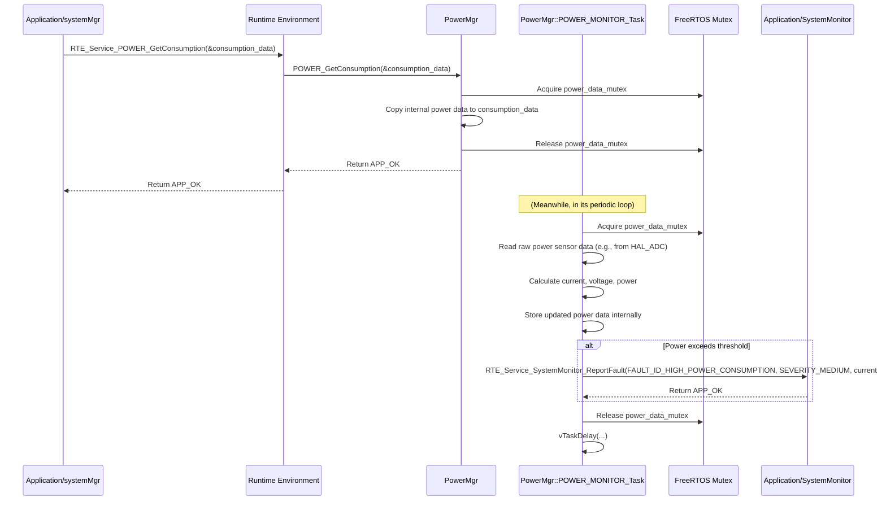

# **Detailed Design Document: PowerMgr Component**

## **1. Introduction**

### **1.1. Purpose**

This document details the design of the PowerMgr component. Its primary purpose is to manage the ECU's **Power Management Modes** (ON, OFF, Sleep) and to continuously monitor and calculate the ECU's current, voltage, and power consumption. It reports this data to systemMgr, allowing systemMgr to take corrective actions (e.g., overriding actuator control, preventing OTA updates) based on power constraints.

### **1.2. Scope**

The scope of this document covers the power module's architecture, functional behavior, interfaces, dependencies, and resource considerations. It details how power interacts with HAL/MCAL power control features and ADC drivers for monitoring, and provides power consumption data to systemMgr via RTE services.

### **1.3. References**

* Software Architecture Document (SAD) - Smart Device Firmware (Final Version)  
* Detailed Design Document: RTE  
* Detailed Design Document: Application/systemMgr  
* Detailed Design Document: HAL_ADC (if ADC-based power monitoring)  
* MCAL GPIO Driver Specification (for power control pins)  
* Power Monitoring IC Datasheet (e.g., INA219, if used)

## **2. Functional Description**

The PowerMgr component provides the following core functionalities:

1. **Initialization**: Initialize power monitoring hardware (e.g., ADC channels, power monitoring ICs) and power control pins.  
2. **Power Mode Control**: Provides functions to set the ECU into different power management modes (e.g., active, sleep, deep sleep).  
3. **Current/Voltage/Power Monitoring**: Continuously reads raw data from sensors (e.g., ADC for voltage/current shunts, or I2C for dedicated power monitoring ICs) and calculates real-time current, voltage, and power consumption.  
4. **Power Data Reporting**: Provides an RTE service (RTE_Service_POWER_GetConsumption()) for systemMgr to query the latest power consumption data.  
5. **Threshold Monitoring**: (Optional) Detects if power consumption exceeds or falls below predefined thresholds and can report these as faults to SystemMonitor.  
6. **Error Reporting**: Report any failures during power monitoring or control (e.g., sensor read failure, invalid power mode) to the SystemMonitor via RTE_Service_SystemMonitor_ReportFault().

## **3. Non-Functional Requirements**

### **3.1. Performance**

* **Accuracy**: Power consumption measurements shall be accurate within specified tolerances.  
* **Update Rate**: Power data should be updated frequently enough to enable responsive power management.  
* **Transition Speed**: Power mode transitions should be fast and seamless.

### **3.2. Memory**

* **Minimal Footprint**: The power module shall have a minimal memory footprint.

### **3.3. Reliability**

* **Robustness**: The module shall be robust against sensor read errors or power fluctuations.  
* **Safety**: Ensure that power mode transitions are safe and do not lead to system instability or data loss.  
* **Fail-Safe**: In case of critical power issues (e.g., brownout), the module should assist in transitioning to a safe state.

## **4. Architectural Context**

As per the SAD (Section 3.1.2, Application Layer), power resides in the Application Layer. It manages the ECU's power states and monitors consumption. It interacts with HAL_ADC or HAL_I2C (if an I2C power monitor is used) for reading sensor data, and MCAL_GPIO for direct power control pins. It reports power data to systemMgr via RTE_Service_POWER_GetConsumption(), and systemMgr uses this information for its internal logic and to make decisions regarding OTA updates.

## **5. Design Details**

### **5.1. Module Structure**

The PowerMgr component will consist of the following files:

* PowerMgr/inc/power.h: Public header file containing function prototypes, power mode definitions, and data structures for consumption.  
* PowerMgr/src/power.c: Source file containing the implementation of power management logic and monitoring.  
* PowerMgr/cfg/power_cfg.h: Configuration header for power monitoring hardware details (ADC channels, calibration, IC addresses) and power mode definitions.

### **5.2. Public Interface (API)**

// In PowerMgr/inc/power.h
```c
#include "Application/common/inc/app_common.h" // For APP_Status_t

// --- Power Management Modes ---  
typedef enum {  
    POWER_MODE_ACTIVE = 0,  
    POWER_MODE_SLEEP,  
    POWER_MODE_DEEP_SLEEP,  
    // Add more modes as needed  
} Power_Mode_t;

// --- Power Consumption Data Structure ---  
typedef struct {  
    float current_ma;   // Current consumption in milliamperes  
    float voltage_mv;   // Voltage in millivolts  
    float power_mw;     // Power consumption in milliwatts  
} Power_Consumption_t;

// --- Public Functions ---

/**  
 * @brief Initializes the Power module and power monitoring hardware.  
 * This function should be called once during application initialization.  
 * @return APP_OK on success, APP_ERROR on failure.  
 */  
APP_Status_t POWER_Init(void);

/**  
 * @brief Sets the ECU into a specified power management mode.  
 * @param mode The desired power mode.  
 * @return APP_OK on success, APP_ERROR on failure.  
 */  
APP_Status_t POWER_SetMode(Power_Mode_t mode);

/**  
 * @brief Gets the current power consumption data.  
 * This function is typically called by systemMgr (via RTE_Service_POWER_GetConsumption).  
 * @param consumption Pointer to a Power_Consumption_t structure to fill with data.  
 * @return APP_OK on success, APP_ERROR on failure.  
 */  
APP_Status_t POWER_GetConsumption(Power_Consumption_t *consumption);

// --- Internal Task Prototype (implemented in .c, declared in Rte.h) ---  
// void POWER_MONITOR_Task(void *pvParameters); // If continuous monitoring in a task
```

### **5.3. Internal Design**

The PowerMgr module will have a dedicated task (POWER_MONITOR_Task) if continuous monitoring is required. It will perform ADC reads or I2C communication to get raw sensor data, then apply calibration and conversion to calculate actual power values.

1. **Initialization (POWER_Init)**:  
   * **Monitoring Hardware Init**:  
     * If ADC-based: Call HAL_ADC_Init() for relevant channels.  
     * If I2C power monitor IC: Call HAL_I2C_Init() for the relevant port and initialize the IC (e.g., INA219_Init()).  
   * **Power Control Pins Init**: Call MCAL_GPIO_Init() for any GPIOs controlling power rails or sleep modes.  
   * Create POWER_MONITOR_Task using RTE_Service_OS_CreateTask().  
   * If any underlying initialization fails, report FAULT_ID_POWER_INIT_FAILED to SystemMonitor.  
   * Return APP_OK.  
2. **Set Mode (POWER_SetMode)**:  
   * Validate mode.  
   * Use a switch statement based on mode:  
     * POWER_MODE_ACTIVE: Ensure all necessary peripherals are powered, clocks are at full speed.  
     * POWER_MODE_SLEEP: Configure MCU peripherals for low power, enter light sleep mode (e.g., esp_light_sleep_start()).  
     * POWER_MODE_DEEP_SLEEP: Configure MCU for deep sleep (e.g., esp_deep_sleep_start()), potentially losing RAM context.  
   * Report FAULT_ID_POWER_MODE_SET_FAILED if transition fails.  
   * Return APP_OK.  
3. **Get Consumption (POWER_GetConsumption)**:  
   * Called by systemMgr via RTE_Service_POWER_GetConsumption().  
   * Acquire power_data_mutex (if POWER_MONITOR_Task updates shared data).  
   * Copy the latest calculated Power_Consumption_t data to the consumption buffer.  
   * Release power_data_mutex.  
   * Return APP_OK.  
4. **POWER_MONITOR_Task(void *pvParameters)**:  
   * This is the dedicated FreeRTOS task for continuous power monitoring.  
   * **Periodicity**: Defined in power_cfg.h (e.g., 1000 ms).  
   * **Loop**:  
     * Acquire power_data_mutex.  
     * **Read Raw Data**:  
       * If ADC-based: Call HAL_ADC_Read() for voltage and current shunt channels.  
       * If I2C power monitor IC: Call HAL_I2C_MasterWriteRead() to read current/voltage registers from the IC.  
     * **Calibration and Calculation**: Apply calibration factors (from power_cfg.h) to raw ADC/IC readings to convert to real-world units (mV, mA). Calculate power (mW = mV * mA / 1000).  
     * Store calculated current_ma, voltage_mv, power_mw in an internal Power_Consumption_t structure.  
     * **Threshold Check (Optional)**: If power_mw exceeds POWER_CONSUMPTION_THRESHOLD_MW, report FAULT_ID_HIGH_POWER_CONSUMPTION to SystemMonitor.  
     * Release power_data_mutex.  
     * vTaskDelay(pdMS_TO_TICKS(POWER_MONITOR_TASK_PERIOD_MS)).  
   * **Error Handling**: If sensor read fails, report FAULT_ID_POWER_SENSOR_READ_FAILED to SystemMonitor.

**Sequence Diagram (Example: systemMgr Queries Power Consumption):**

### **5.4. Dependencies**

* **Application/common/inc/app_common.h**: For APP_Status_t.  
* **Application/logger/inc/logger.h**: For logging power events and errors.  
* **Application/SystemMonitor/inc/system_monitor.h**: For SystemMonitor_FaultId_t (e.g., FAULT_ID_POWER_INIT_FAILED).  
* **Rte/inc/Rte.h**: For calling RTE_Service_SystemMonitor_ReportFault() and RTE_Service_OS_CreateTask().  
* **HAL/inc/hal_adc.h**: If using ADC for power monitoring.  
* **HAL/inc/hal_i2c.h**: If using an I2C power monitoring IC.  
* **Mcal/gpio/inc/mcal_gpio.h**: For direct GPIO control of power rails or sleep pins.  
* **FreeRTOS Headers**: FreeRTOS.h, task.h, semphr.h (for mutex).

### **5.5. Error Handling**

* **Initialization Failure**: If power monitoring hardware or control pins fail to initialize, FAULT_ID_POWER_INIT_FAILED is reported.  
* **Sensor Read Errors**: If ADC or I2C reads for power sensors fail, FAULT_ID_POWER_SENSOR_READ_FAILED is reported.  
* **Power Mode Set Failure**: If POWER_SetMode fails to transition to the requested mode, FAULT_ID_POWER_MODE_SET_FAILED is reported.  
* **Threshold Exceeded**: If power consumption exceeds configured thresholds, FAULT_ID_HIGH_POWER_CONSUMPTION is reported to SystemMonitor.  
* **Mutex Protection**: Access to the internal Power_Consumption_t data must be protected by a mutex.

### **5.6. Configuration**

The PowerMgr/cfg/power_cfg.h file will contain:

* **Power Monitoring Type**: Define POWER_MONITOR_TYPE_ADC or POWER_MONITOR_TYPE_I2C_IC.  
* **For ADC-based Monitoring**:  
  * POWER_VOLTAGE_ADC_CHANNEL, POWER_CURRENT_ADC_CHANNEL.  
  * Calibration factors (e.g., POWER_VOLTAGE_CAL_FACTOR_MV_PER_LSB, POWER_CURRENT_CAL_FACTOR_MA_PER_LSB).  
* **For I2C IC-based Monitoring**:  
  * POWER_MONITOR_IC_I2C_PORT_ID, POWER_MONITOR_IC_I2C_SLAVE_ADDRESS.  
* **Power Control GPIOs**: POWER_ENABLE_GPIO_PIN, POWER_SLEEP_GPIO_PIN (if direct control).  
* **Monitoring Task Period**: POWER_MONITOR_TASK_PERIOD_MS.  
* **Power Thresholds**: POWER_CONSUMPTION_THRESHOLD_MW.

// Example: PowerMgr/cfg/power_cfg.h
```c
// Choose power monitoring hardware  
#define POWER_MONITOR_TYPE_ADC      1  
#define POWER_MONITOR_TYPE_I2C_IC   0

#if POWER_MONITOR_TYPE_ADC  
#define POWER_VOLTAGE_ADC_CHANNEL           HAL_ADC_CHANNEL_0  
#define POWER_CURRENT_ADC_CHANNEL           HAL_ADC_CHANNEL_1  
#define POWER_VOLTAGE_CAL_FACTOR_MV_PER_LSB 3.3f / 4095.0f * 1000.0f // Example for 3.3V, 12-bit ADC  
#define POWER_CURRENT_CAL_FACTOR_MA_PER_LSB 0.5f // Example for current shunt  
#elif POWER_MONITOR_TYPE_I2C_IC  
#define POWER_MONITOR_IC_I2C_PORT_ID        HAL_I2C_PORT_0  
#define POWER_MONITOR_IC_I2C_SLAVE_ADDRESS  0x40 // Example for INA219  
#endif

// Power control GPIOs (if direct control is needed)  
#define POWER_ENABLE_GPIO_PIN               26  
#define POWER_SLEEP_GPIO_PIN                27

#define POWER_MONITOR_TASK_PERIOD_MS        1000 // Monitor every 1 second

#define POWER_CONSUMPTION_THRESHOLD_MW      1500 // Report fault if power > 1.5W
```

### **5.7. Resource Usage**

* **Flash**: Low to moderate, depending on the complexity of power monitoring (e.g., specific IC drivers).  
* **RAM**: Low, for internal data structures and buffers.  
* **CPU**: Low. Periodic sampling and calculation are generally efficient.

## **6. Test Considerations**

### **6.1. Unit Testing**

* **Mock Dependencies**: Unit tests for power will mock HAL_ADC_Read(), HAL_I2C_MasterWriteRead(), MCAL_GPIO_SetState(), RTE_Service_SystemMonitor_ReportFault(), and FreeRTOS task/mutex APIs.  
* **Test Cases**:  
  * POWER_Init: Verify initialization of underlying hardware drivers and task creation. Test failure scenarios.  
  * POWER_SetMode: Test setting different power modes. Mock MCAL_GPIO_SetState() or native sleep functions. Verify correct state transitions.  
  * POWER_GetConsumption: Verify it returns the latest calculated data. Test mutex protection.  
  * POWER_MONITOR_Task:  
    * Mock raw sensor reads to simulate various current/voltage values. Verify correct calculation of current_ma, voltage_mv, power_mw.  
    * Simulate power exceeding POWER_CONSUMPTION_THRESHOLD_MW and verify FAULT_ID_HIGH_POWER_CONSUMPTION is reported to SystemMonitor.  
    * Test sensor read failures and verify FAULT_ID_POWER_SENSOR_READ_FAILED is reported.

### **6.2. Integration Testing**

* **Power-HAL/MCAL Integration**: Verify that power correctly interfaces with the actual ADC, I2C, or GPIO drivers and the physical power monitoring/control hardware.  
* **Power-SystemMgr Integration**: Verify that systemMgr correctly receives and uses power consumption data from power for its logic (e.g., preventing OTA if power is low).  
* **Power Mode Transitions**: Verify that POWER_SetMode correctly transitions the ECU into different power states (e.g., measure current consumption in sleep modes).  
* **Accuracy Verification**: Compare power's reported current/voltage/power with external measurement equipment (multimeter, power analyzer).  
* **Fault Injection**: Simulate power monitoring sensor failures (e.g., disconnect a shunt resistor, cause I2C communication error) and verify power reports faults to SystemMonitor.

### **6.3. System Testing**

* **End-to-End Power Management**: Verify that the system's overall power consumption aligns with expectations across different operational modes and loads.  
* **OTA Power Readiness**: Test the full OTA update process, ensuring systemMgr (using power's data) correctly allows/prevents OTA based on power conditions.  
* **Long-Term Monitoring**: Run the system for extended periods to ensure stable and continuous power monitoring.  
* **Battery Life (if applicable)**: If battery-powered, perform battery life tests to validate power management strategies.
