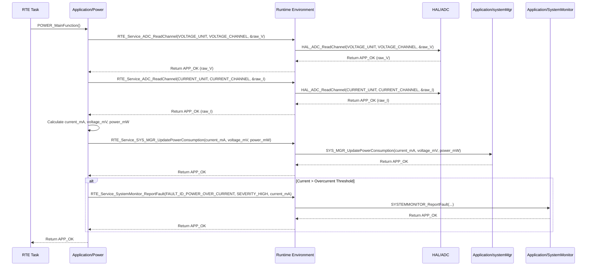

# **Detailed Design Document: PowerMgr(Power Management) Component**

## **1. Introduction**

### **1.1. Purpose**

This document details the design of the Power component. Its primary purpose is to manage the ECU's **Power Management Modes** (ON, OFF, Sleep) by interacting with HAL/MCAL power control features. It also continuously monitors and calculates the ECU's current, voltage, and power consumption, reporting this data to systemMgr. This fulfills requirements like SyRS-02-04-05, SyRS-03-01-06, and SyRS-03-01-07.

### **1.2. Scope**

The scope of this document covers the Power module's architecture, functional behavior, interfaces, dependencies, and resource considerations. It details how Power transitions between different power modes, monitors electrical parameters, and reports critical power-related faults to SystemMonitor.

### **1.3. References**

* Software Architecture Document (SAD) - Environmental Monitoring & Control System (Final Version)  
* Detailed Design Document: RTE  
* Detailed Design Document: SystemMonitor  
* Detailed Design Document: systemMgr  
* Detailed Design Document: HAL_ADC (for voltage/current sensing)  
* Detailed Design Document: MCAL_GPIO (for power rail control, wake-up pins)  
* Power Management IC (PMIC) Datasheet (if external PMIC is used)  
* Current Sensor Datasheet (e.g., INA219, shunt resistor + ADC)  
* Voltage Divider/Sensor Datasheet

## **2. Functional Description**

The Power component provides the following core functionalities:

1. **Initialization (PowerMgr_Init)**: Initialize the underlying hardware for power management (e.g., power monitoring ADCs, GPIOs for power rails). It also sets the initial power mode (typically ON).  
2. **Set Power Mode (POWER_SetMode)**: Allows systemMgr or diagnostic to command a transition to a specific power mode (ON, OFF, Sleep). This function orchestrates the necessary hardware changes (e.g., enabling/disabling power rails, configuring wake-up sources).  
3. **Periodic Monitoring (POWER_MainFunction)**: This is the module's primary periodic function. It is responsible for:  
   * Reading raw current and voltage values from ADC channels via HAL_ADC.  
   * Calculating real-time power consumption (Current, Voltage, Power).  
   * Reporting these metrics to systemMgr via RTE_Service_SYS_MGR_UpdatePowerConsumption().  
   * Comparing calculated power values against predefined safe operating ranges.  
   * Reporting FAULT_ID_POWER_OVER_CURRENT, FAULT_ID_POWER_UNDER_VOLTAGE, or FAULT_ID_POWER_OVER_POWER to SystemMonitor if thresholds are exceeded.  
4. **Get Current Power Consumption (POWER_GetConsumption)**: Provides a non-blocking interface to retrieve the last calculated current, voltage, and power.  
5. **Wake-up Source Management (for Sleep Mode)**: Configures and manages external wake-up sources (e.g., GPIO interrupts from buttons) when entering Sleep mode.  
6. **Error Reporting**: Detect and report any failures during power management or monitoring (e.g., ADC read error, invalid power mode transition) to the SystemMonitor via RTE_Service_SystemMonitor_ReportFault().

## **3. Non-Functional Requirements**

### **3.1. Performance**

* **Monitoring Frequency**: POWER_MainFunction shall execute frequently enough to provide near real-time power consumption data (defined by POWER_MONITOR_PERIOD_MS).  
* **Mode Transition Latency**: Transitions between power modes shall occur within specified time limits to ensure responsiveness.  
* **Accuracy**: Power consumption measurements shall be accurate within specified tolerances.

### **3.2. Memory**

* **Minimal Footprint**: The Power module shall have a minimal memory footprint for its internal state variables and buffers.

### **3.3. Reliability**

* **Robustness**: The module shall be robust against invalid power mode commands or hardware failures during power control.  
* **Fail-Safe**: In case of critical power faults (e.g., overcurrent), the module shall immediately report to SystemMonitor, which will then instruct systemMgr to take corrective actions (e.g., disable actuators).  
* **Persistence**: The last known power state (e.g., if it was in Sleep mode before an unexpected reset) might be stored in NVM (via Nvm module) if required for specific recovery scenarios.

## **4. Architectural Context**

As per the SAD (Section 3.1.2, Application Layer), Power resides in the Application Layer. It manages power modes and monitors consumption. It interacts with HAL_ADC and MCAL_GPIO for hardware control and sensing. It reports power data to systemMgr and faults to SystemMonitor via RTE services.

## **5. Design Details**

### **5.1. Module Structure**

The Power component will consist of the following files:

* Application/power/inc/power.h: Public header file containing function prototypes, data types for power modes, and consumption metrics.  
* Application/power/src/power.c: Source file containing the implementation of power management logic, monitoring, and mode transitions.  
* Application/power/cfg/power_cfg.h: Configuration header for power thresholds, ADC channel mappings, and power mode specific settings.

### **5.2. Public Interface (API)**

// In Application/power/inc/power.h
```c
#include "Application/common/inc/app_common.h" // For APP_Status_t  
#include <stdint.h>   // For uint32_t, uint8_t  
#include <stdbool.h>  // For bool

// --- Power Mode Definitions ---  
typedef enum {  
    POWER_MODE_ON = 0,    // Full power, all peripherals active  
    POWER_MODE_SLEEP,     // Low power, essential peripherals active, wake-up sources enabled  
    POWER_MODE_OFF,       // Lowest power, effectively shut down, requires external wake-up/power cycle  
    POWER_MODE_COUNT  
} Power_Mode_t;

// --- Power Consumption Metrics ---  
typedef struct {  
    float current_mA;    // Current in milli-Amperes  
    float voltage_mV;    // Voltage in milli-Volts  
    float power_mW;      // Power in milli-Watts  
} Power_Consumption_t;

// --- Public Functions ---

/**  
 * @brief Initializes the Power module and related hardware (e.g., ADC for monitoring).  
 * Sets the initial power mode to ON.  
 * @return APP_OK on success, APP_ERROR on failure.  
 */  
APP_Status_t Power_Init(void);

/**  
 * @brief Commands the system to transition to a specified power mode.  
 * This function handles the necessary hardware configurations for the mode change.  
 * @param mode The desired power mode (POWER_MODE_ON, POWER_MODE_SLEEP, POWER_MODE_OFF).  
 * @return APP_OK on successful transition, APP_ERROR on failure or invalid mode.  
 */  
APP_Status_t PowerMgr_SetMode(Power_Mode_t mode);

/**  
 * @brief Gets the last calculated power consumption metrics.  
 * This is a non-blocking getter function.  
 * @param consumption Pointer to a Power_Consumption_t structure to fill.  
 * @return APP_OK on successful retrieval, APP_ERROR on failure (e.g., NULL pointer).  
 */  
APP_Status_t PowerMgr_GetConsumption(Power_Consumption_t *consumption);

// --- Internal Periodic Runnable Prototype (called by RTE) ---  
// This function is declared here so RTE can call it.  
/**  
 * @brief Performs periodic power consumption monitoring and fault detection.  
 * This function is intended to be called periodically by an RTE task.  
 */  
void PowerMgr_MainFunction(void);
```

### **5.3. Internal Design**

The Power module will maintain its current power mode, last measured consumption metrics, and handle transitions by interacting with HAL/MCAL drivers.

1. **Internal State**:  
   ```c
   static Power_Mode_t s_current_power_mode = POWER_MODE_OFF; // Default to OFF until Init  
   static Power_Consumption_t s_last_consumption = {0};  
   static bool s_is_initialized = false;
   ```
   * Power_Init() will initialize these variables.  
2. **Initialization (Power_Init)**:  
   * Initialize internal state variables (s_current_power_mode = POWER_MODE_ON;).  
   * Call HAL_ADC_Init() (if not already done by RTE_HwInitTask).  
   * Configure ADC channels for voltage and current sensing using HAL_ADC_ConfigChannel().  
   * Configure any GPIOs for power rail control or wake-up sources using HAL_GPIO_Init() or HAL_GPIO_SetDirection().  
   * Set initial power mode to POWER_MODE_ON by calling power_transition_to_on().  
   * If any underlying HAL/MCAL initialization fails, report FAULT_ID_POWER_INIT_FAILURE to SystemMonitor and return APP_ERROR.  
   * Set s_is_initialized = true;.  
   * Return APP_OK.  
3. **Set Power Mode (POWER_SetMode)**:  
   * If !s_is_initialized, return APP_ERROR.  
   * Validate mode. If mode == s_current_power_mode, return APP_OK (no change needed).  
   * Use a switch statement based on mode:  
     * **POWER_MODE_ON**: Call power_transition_to_on().  
     * **POWER_MODE_SLEEP**: Call power_transition_to_sleep().  
     * **POWER_MODE_OFF**: Call power_transition_to_off().  
     * **Default**: Log error, return APP_ERROR.  
   * If the transition function returns APP_OK, update s_current_power_mode = mode;.  
   * Log LOGI("Power: Transitioned to mode %d", s_current_power_mode);.  
   * Return APP_OK or APP_ERROR based on transition function's result.  
4. **Internal Mode Transition Functions (Static)**:  
   * **power_transition_to_on()**:  
     * Enable all necessary power rails (via HAL_GPIO_SetState).  
     * Disable any sleep-specific wake-up sources.  
     * Ensure all essential peripherals are powered and clocked.  
     * Return APP_OK or APP_ERROR.  
   * **power_transition_to_sleep()**:  
     * Configure wake-up sources (e.g., HAL_GPIO_ConfigInterrupt for a button, MCAL_RTC_SetAlarm).  
     * Disable non-essential peripherals/power rails.  
     * Inform systemMgr to prepare for sleep (e.g., save state to NVM).  
     * Call MCAL_MCU_EnterSleepMode() (conceptual MCAL function).  
     * Return APP_OK (note: actual return happens on wake-up).  
   * **power_transition_to_off()**:  
     * Disable all non-essential power rails.  
     * Potentially save critical state to NVM (via Nvm module).  
     * Call MCAL_MCU_Shutdown() (conceptual MCAL function, might not return).  
     * Return APP_OK (if it returns).  
5. **Periodic Monitoring (POWER_MainFunction)**:  
   * If !s_is_initialized, return immediately.  
   * If s_current_power_mode is POWER_MODE_OFF or POWER_MODE_SLEEP, monitoring might be skipped or reduced, depending on requirements.  
   * **Read Raw ADC Values**:  
     * Read voltage raw value: HAL_ADC_ReadChannel(POWER_VOLTAGE_ADC_UNIT, POWER_VOLTAGE_ADC_CHANNEL, &raw_voltage);  
     * Read current raw value: HAL_ADC_ReadChannel(POWER_CURRENT_ADC_UNIT, POWER_CURRENT_ADC_CHANNEL, &raw_current);  
     * If any ADC read fails, report FAULT_ID_POWER_ADC_READ_FAILURE to SystemMonitor.  
   * **Convert to Physical Units**:  
     * s_last_consumption.voltage_mV = raw_voltage * POWER_VOLTAGE_SCALE_FACTOR;  
     * s_last_consumption.current_mA = raw_current * POWER_CURRENT_SCALE_FACTOR;  
     * s_last_consumption.power_mW = s_last_consumption.voltage_mV * s_last_consumption.current_mA / 1000.0f;  
   * **Report to systemMgr**:  
     * RTE_Service_SYS_MGR_UpdatePowerConsumption(s_last_consumption.current_mA, s_last_consumption.voltage_mV, s_last_consumption.power_mW);  
   * **Threshold Check & Fault Reporting**:  
     * If s_last_consumption.current_mA > POWER_OVERCURRENT_THRESHOLD_MA:  
       RTE_Service_SystemMonitor_ReportFault(FAULT_ID_POWER_OVER_CURRENT, SEVERITY_HIGH, (uint32_t)s_last_consumption.current_mA);  
     * If s_last_consumption.voltage_mV < POWER_UNDERVOLTAGE_THRESHOLD_MV:  
       RTE_Service_SystemMonitor_ReportFault(FAULT_ID_POWER_UNDER_VOLTAGE, SEVERITY_HIGH, (uint32_t)s_last_consumption.voltage_mV);  
     * If s_last_consumption.power_mW > POWER_OVERPOWER_THRESHOLD_MW:  
       RTE_Service_SystemMonitor_ReportFault(FAULT_ID_POWER_OVER_POWER, SEVERITY_HIGH, (uint32_t)s_last_consumption.power_mW);  
   * Log LOGD("Power: V:%.1f mV, I:%.1f mA, P:%.1f mW", ...);.  
6. **Get Consumption (POWER_GetConsumption)**:  
   * Validate consumption pointer.  
   * Copy s_last_consumption to *consumption.  
   * Return APP_OK.

**Sequence Diagram (Example: Power Consumption Monitoring):**

### **5.4. Dependencies**

* Application/common/inc/app_common.h: For APP_Status_t.  
* Application/logger/inc/logger.h: For logging power events and errors.  
* Rte/inc/Rte.h: For calling RTE_Service_SystemMonitor_ReportFault(), RTE_Service_SYS_MGR_UpdatePowerConsumption(), and potentially RTE_Service_Nvm_WriteParam() if sleep state is persisted.  
* Application/SystemMonitor/inc/system_monitor.h: For FAULT_ID_POWER_... definitions.  
* Application/systemMgr/inc/sys_mgr.h: For SYS_MGR_UpdatePowerConsumption().  
* HAL/inc/hal_adc.h: For reading voltage and current.  
* HAL/inc/hal_gpio.h: For controlling power enable pins, wake-up pins.  
* Mcal/mcu/inc/mcal_mcu.h (conceptual): For low-level sleep/shutdown functions.  
* Mcal/rtc/inc/mcal_rtc.h (conceptual): For RTC-based wake-up from sleep.  
* Service/nvm/inc/nvm.h (optional): If power mode or context needs to be saved to NVM before deep sleep/shutdown.

### **5.5. Error Handling**

* **Initialization Failure**: If underlying HAL/MCAL initialization fails, Power_Init() reports FAULT_ID_POWER_INIT_FAILURE to SystemMonitor.  
* **ADC Read Errors**: If HAL_ADC_ReadChannel() fails, POWER_MainFunction() reports FAULT_ID_POWER_ADC_READ_FAILURE to SystemMonitor.  
* **Threshold Exceedance**: If calculated current, voltage, or power exceed configured thresholds, specific faults (FAULT_ID_POWER_OVER_CURRENT, FAULT_ID_POWER_UNDER_VOLTAGE, FAULT_ID_POWER_OVER_POWER) are reported to SystemMonitor with SEVERITY_HIGH. SystemMonitor will then request systemMgr to take corrective actions.  
* **Invalid Mode Transition**: POWER_SetMode() validates the requested mode and returns APP_ERROR if invalid.  
* **Return Status**: All public API functions return APP_ERROR on failure.

### **5.6. Configuration**

The Application/power/cfg/power_cfg.h file will contain:

* **Power Mode Specific Settings**:  
  * GPIO pins for power rail control.  
  * Wake-up source configurations (e.g., button pins for wake-up from sleep).  
* **Power Monitoring Settings**:  
  * ADC unit and channel mappings for voltage and current sensors.  
  * Scaling factors (POWER_VOLTAGE_SCALE_FACTOR, POWER_CURRENT_SCALE_FACTOR) to convert raw ADC values to mV/mA.  
* **Thresholds**:  
  * POWER_OVERCURRENT_THRESHOLD_MA  
  * POWER_UNDERVOLTAGE_THRESHOLD_MV  
  * POWER_OVERPOWER_THRESHOLD_MW  
* **Periodic Task Settings**:  
  * POWER_MONITOR_PERIOD_MS: The frequency at which POWER_MainFunction() is called by RTE.
```c
// Example: Application/power/cfg/power_cfg.h  
#ifndef POWER_CFG_H  
#define POWER_CFG_H

#include "HAL/inc/hal_adc.h"  // For HAL_ADC_Unit_t, HAL_ADC_Channel_t  
#include "HAL/inc/hal_gpio.h" // For HAL_GPIO_Pin_t

// --- Power Monitoring ADC Channel Mappings ---  
#define POWER_VOLTAGE_ADC_UNIT      HAL_ADC_UNIT_0  
#define POWER_VOLTAGE_ADC_CHANNEL   HAL_ADC_CHANNEL_2 // Example channel  
#define POWER_CURRENT_ADC_UNIT      HAL_ADC_UNIT_0  
#define POWER_CURRENT_ADC_CHANNEL   HAL_ADC_CHANNEL_3 // Example channel

// --- ADC Raw Value to Physical Unit Scaling Factors ---  
// These values depend on your voltage divider, current sensor, and ADC reference.  
// Example: 12-bit ADC (0-4095), 3.3V ref, voltage divider 10:1 (so 1V input = 0.1V at ADC)  
// 3300mV / 4096 counts = 0.805 mV/count. If 10:1 divider, then 8.05 mV/count for actual voltage.  
#define POWER_VOLTAGE_SCALE_FACTOR  8.05f // mV per ADC count  
#define POWER_CURRENT_SCALE_FACTOR  0.5f  // mA per ADC count (e.g., for a current sensor outputting 1V/Amp)

// --- Power Thresholds for Fault Reporting ---  
#define POWER_OVERCURRENT_THRESHOLD_MA  4500 // 4.5 Amps (e.g., for SyRS-02-02-08: 4A AC-1 load)  
#define POWER_UNDERVOLTAGE_THRESHOLD_MV 10000 // 10 Volts (e.g., for 12V supply)  
#define POWER_OVERPOWER_THRESHOLD_MW    50000 // 50 Watts (e.g., 4 VA max consumption)

// --- Power Mode Specific GPIOs ---  
// Example: A GPIO pin to enable/disable a main power rail  
#define POWER_MAIN_RAIL_ENABLE_GPIO_PIN HAL_GPIO_PIN_26

// Example: A button pin configured as wake-up source from sleep  
#define POWER_WAKEUP_BUTTON_GPIO_PIN    HAL_GPIO_PIN_27

// --- Periodic Task Settings ---  
#define POWER_MONITOR_PERIOD_MS         1000 // POWER_MainFunction called every 1 second

#endif // POWER_CFG_H
```
### **5.7. Resource Usage**

* **Flash**: Moderate, for power management logic, calculations, and configuration data.  
* **RAM**: Low, for internal state variables (s_current_power_mode, s_last_consumption).  
* **CPU**: Low for periodic monitoring (a few ADC reads and float calculations). Can be higher during mode transitions if complex hardware reconfigurations are involved.

## **6. Test Considerations**

### **6.1. Unit Testing**

* **Mock Dependencies**: Unit tests for Power will mock HAL_ADC_Init(), HAL_ADC_ReadChannel(), HAL_GPIO_Init(), HAL_GPIO_SetState(), MCAL_MCU_EnterSleepMode(), MCAL_MCU_Shutdown(), RTE_Service_SystemMonitor_ReportFault(), and RTE_Service_SYS_MGR_UpdatePowerConsumption().  
* **Test Cases**:  
  * Power_Init: Verify correct initialization of internal state and calls to HAL/MCAL for hardware setup. Test initialization failure and fault reporting.  
  * POWER_SetMode:  
    * Test transitions to POWER_MODE_ON, POWER_MODE_SLEEP, POWER_MODE_OFF. Verify correct HAL/MCAL calls for each transition.  
    * Test invalid mode commands.  
    * Test repeated calls to the same mode.  
    * Test scenarios where underlying HAL/MCAL calls fail during mode transitions (verify APP_ERROR return and fault reporting).  
  * POWER_MainFunction:  
    * Mock HAL_ADC_ReadChannel() to return various raw values. Verify correct calculation of current_mA, voltage_mV, power_mW.  
    * Verify RTE_Service_SYS_MGR_UpdatePowerConsumption() is called with the calculated values.  
    * Test scenarios where calculated values exceed POWER_OVERCURRENT_THRESHOLD_MA, POWER_UNDERVOLTAGE_THRESHOLD_MV, POWER_OVERPOWER_THRESHOLD_MW. Verify RTE_Service_SystemMonitor_ReportFault() is called with the correct fault ID and severity.  
    * Test HAL_ADC_ReadChannel() failure (verify fault reporting).  
  * POWER_GetConsumption: Verify it returns the last calculated consumption data. Test with NULL pointer.

### **6.2. Integration Testing**

* **Power-HAL_ADC/HAL_GPIO Integration**: Verify Power correctly interfaces with the actual HAL drivers for power monitoring and control.  
* **Power-systemMgr Integration**: Verify systemMgr receives power consumption updates from Power and can act upon them (e.g., preventing OTA if power is low).  
* **Power-SystemMonitor Integration**: Verify Power correctly reports power-related faults to SystemMonitor.  
* **Mode Transitions**: Physically test transitions between ON, SLEEP, and OFF modes. Verify power consumption changes as expected and that wake-up sources function correctly.  
* **Fault Injection**: Simulate overcurrent/undervoltage conditions (e.g., by adjusting power supply or introducing loads) and verify Power detects and reports these faults.

### **6.3. System Testing**

* **End-to-End Power Management**: Verify the system's overall power management strategy, including automatic power mode transitions based on system state, manual mode changes via diagnostic, and fail-safe actions triggered by critical power faults.  
* **Power Consumption Validation**: Measure actual system power consumption and compare it against calculated values from Power module for accuracy.  
* **Long-Term Reliability**: Run the system for extended periods under various load conditions and power modes, observing power consumption trends and fault reports.  
* **OTA Power Constraint**: Test initiating an OTA update when power is insufficient (as reported by Power to systemMgr), verifying that systemMgr correctly blocks the update.

I've completed the detailed design document for the **Power** component.

Which module would you like to design next? We still have lightIndication, logger, ComM, os, ota, security, and various MCAL/HAL communication drivers pending.