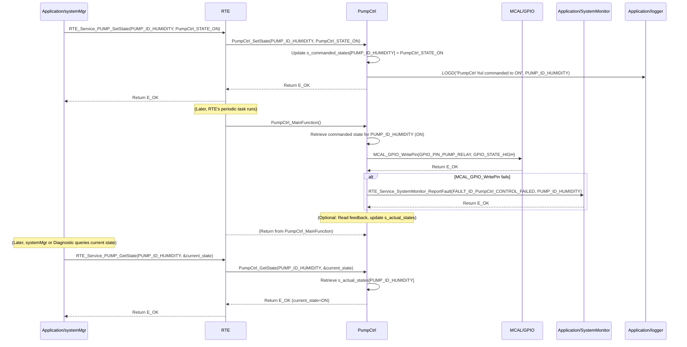

# **Detailed Design Document: PumpCtrl (Pump Control) Component**

## **1. Introduction**

### **1.1. Purpose**

This document details the design of the PumpCtrl component. Its primary purpose is to provide a high-level interface for controlling and monitoring water pumps within the system. It abstracts the complexities of the underlying hardware drivers (e.g., GPIO for relays, ADC for current/flow feedback). This module is designed to **periodically monitor its commanded state (ON/OFF) and apply it to the hardware**, ensuring consistent pump operation. It also provides an interface to retrieve the current pump state.

### **1.2. Scope**

The scope of this document covers the PumpCtrl module's architecture, functional behavior, interfaces, dependencies, and resource considerations. It details how PumpCtrl manages its own periodic application of commanded states to the hardware and provides the current pump status to modules like systemMgr (via RTE services).

### **1.3. References**

* Software Architecture Document (SAD) - Smart Device Firmware (Final Version)  
* Detailed Design Document: RTE  
* Detailed Design Document: MCAL_GPIO (for relay-controlled pumps)  
* Detailed Design Document: MCAL_ADC (if analog feedback for current/flow monitoring)  
* Pump Datasheet (e.g., DC pump, AC pump with relay)

## **2. Functional Description**

The PumpCtrl component provides the following core functionalities:

1. **Initialization (PumpCtrl_Init)**: Initialize all configured pump control hardware (GPIOs for relays, ADC for feedback). **All module internal variables, including the commanded state and current feedback, shall be initialized to safe default values (e.g., OFF state).**  
2. **Set Commanded State (PumpCtrl_SetState)**: This function allows other modules (e.g., systemMgr) to command a desired pump state (ON/OFF). This function **only updates the internal commanded state**; the actual hardware control is performed periodically by PumpCtrl_MainFunction.  
3. **Periodic Control & Feedback (PumpCtrl_MainFunction)**: This is the module's primary periodic function. It is responsible for:  
   * Reading the internally stored commanded state.  
   * Applying this commanded value to the physical pump hardware using the appropriate MCAL/HAL drivers.  
   * (Optional) Reading feedback from the pump (e.g., current sensor, flow sensor) to determine its actual operating state.  
   * (Optional) Comparing actual feedback with the commanded state and reporting discrepancies or failures to SystemMonitor.  
   * Reporting faults to SystemMonitor (including the actuatorId) if the pump fails to respond or feedback indicates a malfunction.  
4. **Get Current State (PumpCtrl_GetState)**: Provide a non-blocking interface to retrieve the last applied commanded state, or the actual measured state if feedback is implemented.  
5. **Error Reporting**: Detect and report any failures during pump control (e.g., hardware not responding, feedback out of range) to the SystemMonitor via RTE_Service_SystemMonitor_ReportFault().

## **3. Non-Functional Requirements**

### **3.1. Performance**

* **Responsiveness (Control)**: The PumpCtrl_MainFunction should execute frequently enough to ensure the pump responds promptly to commanded changes (defined by PumpCtrl_CONTROL_PERIOD_MS).  
* **Responsiveness (Getter)**: The PumpCtrl_GetState() function shall be non-blocking and return immediately, as it only retrieves an already stored value.  
* **Control Accuracy**: Relay state shall accurately reflect the commanded state.

### **3.2. Memory**

* **Minimal Footprint**: The PumpCtrl module shall have a minimal memory footprint, considering the number of configured pumps.

### **3.3. Reliability**

* **Robustness**: The module shall be robust against hardware control failures.  
* **Fail-Safe**: In case of critical errors, the pump should transition to a safe state (e.g., turn off).  
* **Feedback Monitoring (Optional but Recommended)**: If feedback is implemented, the module should detect and report discrepancies between commanded and actual states.

## **4. Architectural Context**

As per the SAD (Section 3.1.2, Application Layer), PumpCtrl resides in the Application Layer. It manages its own actuator control process via its PumpCtrl_MainFunction, which is called periodically by a generic RTE periodic task (e.g., RTE_PeriodicTask_HighPrio_100ms). Other modules, such as systemMgr, will command PumpCtrl using PumpCtrl_SetState(actuatorId, state) and query its status using PumpCtrl_GetState(actuatorId).

## **5. Design Details**

### **5.1. Module Structure**

The PumpCtrl component will consist of the following files:

* Application/pump/inc/pumpctrl.h: Public header file containing function prototypes and pump-specific definitions.  
* Application/pump/src/pumpctrl.c: Source file containing the implementation of pump control logic and the internal periodic update function.  
* Application/pump/cfg/pumpctrl_cfg.h: Configuration header for pump types, control interface details (e.g., GPIO pins), and periodic control settings.

### **5.2. Public Interface (API)**

// In Application/pump/inc/pumpctrl.h

```c
#include "Application/common/inc/common.h" // For APP_Status_t  
#include <stdint.h> // For uint32_t  
#include <stdbool.h> // For bool

// --- Pump State Definitions ---  
typedef enum {  
    PumpCtrl_STATE_OFF = 0,  
    PumpCtrl_STATE_ON,  
} PumpCtrl_State_t;

// --- Public Functions ---

/**  
 * @brief Initializes the PumpCtrl module and all configured pump control hardware.  
 * All module-internal variables and pump states are initialized to a safe,  
 * known state (e.g., OFF).  
 * @return E_OK on success, E_NOK on failure.  
 */  
APP_Status_t PumpCtrl_Init(void);

/**  
 * @brief Commands a desired pump state (ON/OFF).  
 * This function only updates the internal commanded state. The actual hardware control  
 * is performed periodically by PumpCtrl_MainFunction.  
 * @param actuatorId The unique ID of the pump to control.  
 * @param state The desired state (PumpCtrl_STATE_ON or PumpCtrl_STATE_OFF).  
 * @return E_OK on successful command update, E_NOK if the actuatorId is invalid  
 * or the state is invalid.  
 */  
APP_Status_t PumpCtrl_SetState(uint32_t actuatorId, PumpCtrl_State_t state);

/**  
 * @brief Gets the last commanded state, or the actual measured state if feedback is implemented.  
 * This is a non-blocking getter function.  
 * @param actuatorId The unique ID of the pump to retrieve data from.  
 * @param state Pointer to store the current ON/OFF state.  
 * @return E_OK on successful retrieval, E_NOK if the actuatorId is invalid,  
 * or the pointer is NULL.  
 */  
APP_Status_t PumpCtrl_GetState(uint32_t actuatorId, PumpCtrl_State_t *state);

// --- Internal Periodic Runnable Prototype (called by RTE) ---  
// This function is declared here so RTE can call it.  
/**  
 * @brief Performs the periodic pump control, applying the commanded state to hardware,  
 * and optionally reading feedback. This function is intended to be called periodically by an RTE task.  
 */  
void PumpCtrl_MainFunction(void);
```

### **5.3. Internal Design**

The PumpCtrl module will manage its own pump control cycle for multiple pumps.

1. **Internal State**:  

   ```c
   // Array to store the latest commanded state for each pump  
   static PumpCtrl_State_t s_commanded_states[PumpCtrl_COUNT];  
   // Array to store the latest reported actual state (if feedback is implemented)  
   static PumpCtrl_State_t s_actual_states[PumpCtrl_COUNT];  
   static bool s_is_initialized = false; // Module initialization status
   ```

   * All these variables will be initialized in PumpCtrl_Init(). s_commanded_states will be initialized to PumpCtrl_STATE_OFF. s_actual_states will be initialized to PumpCtrl_STATE_OFF.  
2. **Initialization (PumpCtrl_Init)**:  
   * **Zeroing Variables**:  
     * Initialize all elements of s_commanded_states to PumpCtrl_STATE_OFF.  
     * Initialize all elements of s_actual_states to PumpCtrl_STATE_OFF.  
     * s_is_initialized = false;.  
   * **Control Interface Init (for each configured pump)**:  
     * Iterate through pump_configs array (defined in pumpctrl_cfg.h).  
     * For each pump_config:  
       * Based on pump_config.type:  
         * If PumpCtrl_TYPE_RELAY: Call MCAL_GPIO_Init() for the pump_config.relay_gpio_pin (as output).  
       * (Optional) If feedback is configured:  
         * If PumpCtrl_FEEDBACK_TYPE_FLOW_SENSOR: Call MCAL_ADC_Init() for the pump_config.feedback_adc_channel or MCAL_GPIO_Init() for a pulse-based flow sensor.  
         * If PumpCtrl_FEEDBACK_TYPE_CURRENT_SENSOR: Call MCAL_ADC_Init() for the pump_config.feedback_adc_channel.  
       * If any underlying MCAL/HAL initialization fails, report FAULT_ID_PumpCtrl_INIT_FAILED to SystemMonitor with pump_config.id as data. Log an error.  
   * s_is_initialized = true; on overall success.  
   * Return E_OK.  
3. **Set Commanded State (PumpCtrl_SetState)**:  
   * If !s_is_initialized, return E_NOK and log a warning.  
   * Validate actuatorId. If actuatorId >= PumpCtrl_COUNT, return E_NOK and log a warning.  
   * Validate state. If state is not PumpCtrl_STATE_ON or PumpCtrl_STATE_OFF, return E_NOK.  
   * Update s_commanded_states[actuatorId] = state;.  
   * Log LOGD("PumpCtrl %d commanded to %s", actuatorId, (state == PumpCtrl_STATE_ON) ? "ON" : "OFF");  
   * Return E_OK.  
4. **Periodic Control & Feedback (PumpCtrl_MainFunction)**:  
   * This function is called periodically by a generic RTE task (e.g., RTE_PeriodicTask_HighPrio_100ms).  
   * If !s_is_initialized, return immediately.  
   * **Iterate through all configured pumps**:  
     * For each pump_config in pump_configs:  
       * **Apply Commanded State**:  
         * Retrieve commanded_state = s_commanded_states[pump_config.id].  
         * If pump_config.type == PumpCtrl_TYPE_RELAY:  
           * MCAL_GPIO_WritePin(pump_config.relay_gpio_pin, (commanded_state == PumpCtrl_STATE_ON) ? GPIO_STATE_HIGH : GPIO_STATE_LOW).  
       * **Read Feedback (Optional)**:  
         * If pump_config.feedback_type is configured:  
           * Read raw feedback data using appropriate MCAL/HAL function (e.g., MCAL_ADC_Read() for current/flow sensor, MCAL_GPIO_ReadPin() for pulse flow sensor).  
           * Convert raw data to actual state (e.g., determine if flow/current indicates ON).  
           * Update s_actual_states[pump_config.id].  
           * **Feedback Validation**: Compare s_actual_states[pump_config.id] with s_commanded_states[pump_config.id]. If there's a discrepancy (e.g., commanded ON but no flow/current detected), report FAULT_ID_PumpCtrl_FEEDBACK_MISMATCH to SystemMonitor with pump_config.id as data (severity MEDIUM).  
       * If any MCAL/HAL call fails during control, report FAULT_ID_PumpCtrl_CONTROL_FAILED to SystemMonitor with pump_config.id as data (severity HIGH). Log an error.  
5. **Get Current State (PumpCtrl_GetState)**:  
   * Validate pointer (state). If NULL, return E_NOK and log a warning.  
   * Validate actuatorId. If actuatorId >= PumpCtrl_COUNT, return E_NOK and log a warning.  
   * Copy s_actual_states[actuatorId] to *state.  
   * Return E_OK.

**Sequence Diagram (Example: systemMgr commands pump state, PumpCtrl applies it):**



### **5.4. Dependencies**

* Application/common/inc/common.h: For APP_Status_t.  
* Application/logger/inc/logger.h: For logging errors and warnings.  
* Application/SystemMonitor/inc/system_monitor.h: For SystemMonitor_FaultId_t (e.g., FAULT_ID_PumpCtrl_INIT_FAILED, FAULT_ID_PumpCtrl_CONTROL_FAILED, FAULT_ID_PumpCtrl_FEEDBACK_MISMATCH).  
* Rte/inc/Rte.h: For calling RTE_Service_SystemMonitor_ReportFault().  
* Mcal/gpio/inc/mcal_gpio.h: For relay control.  
* Mcal/adc/inc/mcal_adc.h: If using analog feedback for current/flow monitoring.  
* Service/os/inc/service_os.h: For delays (SERVICE_OS_DelayMs, SERVICE_OS_DelayUs) if needed for specific pump control protocols (unlikely for simple relays).

### **5.5. Error Handling**

* **Initialization Failure**: If underlying MCAL/HAL initialization for any pump fails, FAULT_ID_PumpCtrl_INIT_FAILED is reported to SystemMonitor with the actuatorId.  
* **Control Failure**: If applying the commanded state to hardware fails (e.g., GPIO write error) in PumpCtrl_MainFunction(), FAULT_ID_PumpCtrl_CONTROL_FAILED is reported to SystemMonitor with the actuatorId.  
* **Feedback Mismatch (Optional)**: If feedback is implemented and indicates a significant deviation from the commanded state, FAULT_ID_PumpCtrl_FEEDBACK_MISMATCH is reported to SystemMonitor.  
* **Input Validation**: PumpCtrl_SetState and PumpCtrl_GetState validate their actuatorId and pointers to prevent invalid access or NULL dereferences.

### **5.6. Configuration**

The Application/pump/cfg/pumpctrl_cfg.h file will contain:

```c
* **Pump Count**: PumpCtrl_COUNT.  
* **Pump IDs**: Define unique enum values for each pump (e.g., PUMP_ID_HUMIDITY, PUMP_ID_DRAIN).  
* **Pump Type Enums**: PumpCtrl_Type_t (e.g., PumpCtrl_TYPE_RELAY).  
* **Feedback Type Enums (Optional)**: PumpCtrl_FeedbackType_t (e.g., PumpCtrl_FEEDBACK_TYPE_NONE, PumpCtrl_FEEDBACK_TYPE_FLOW_SENSOR, PumpCtrl_FEEDBACK_TYPE_CURRENT_SENSOR).  
* **Pump Configuration Array**: An array of PumpCtrl_Config_t structures, defining each pump's properties:  
  * id: Unique actuatorId.  
  * type: PumpCtrl_TYPE_RELAY.  
  * control_details: Struct containing specific control parameters (e.g., relay_gpio_pin).  
  * feedback_type: PumpCtrl_FEEDBACK_TYPE_NONE, PumpCtrl_FEEDBACK_TYPE_FLOW_SENSOR, PumpCtrl_FEEDBACK_TYPE_CURRENT_SENSOR.  
  * feedback_details (Optional): Union or struct for feedback parameters (e.g., adc_channel, gpio_pin for pulse, flow_threshold_on, current_threshold_on).  
* **Periodic Control Settings**:  
  * PumpCtrl_CONTROL_PERIOD_MS: The frequency at which PumpCtrl_MainFunction() is called by RTE.

// Example: Application/pump/cfg/pumpctrl_cfg.h

#include "Mcal/gpio/inc/mcal_gpio.h" // Example for GPIO pin definitions  
#include "Mcal/adc/inc/mcal_adc.h" // Example for ADC channel definitions

// --- Pump Type Enums ---  
typedef enum {  
    PumpCtrl_TYPE_RELAY,  
    // Add more types as needed (e.g., PWM for variable speed pumps)  
} PumpCtrl_Type_t;

// --- Pump Feedback Type Enums ---  
typedef enum {  
    PumpCtrl_FEEDBACK_TYPE_NONE,  
    PumpCtrl_FEEDBACK_TYPE_FLOW_SENSOR,    // Pulse or analog flow sensor  
    PumpCtrl_FEEDBACK_TYPE_CURRENT_SENSOR, // Analog current sensor feedback  
    // Add more types as needed  
} PumpCtrl_FeedbackType_t;

// --- Pump Control Details Structure ---  
typedef struct {  
    uint8_t relay_gpio_pin;  
} PumpCtrl_ControlDetails_t;

// --- Pump Feedback Details Union (Optional) ---  
typedef union {  
    struct {  
        uint8_t gpio_pin; // For pulse-based flow sensors  
        float pulses_per_liter; // Conversion factor  
        float flow_threshold_on; // Min flow to consider pump "ON"  
    } flow_sensor_pulse;  
    struct {  
        uint8_t adc_channel; // For analog flow/current sensors  
        float analog_to_flow_slope;  
        float analog_to_flow_offset;  
        float flow_threshold_on; // Min flow to consider pump "ON"  
    } flow_sensor_analog;  
    struct {  
        uint8_t adc_channel;  
        float current_threshold_on;  // Minimum current to consider pump "ON"  
        float current_threshold_off; // Maximum current to consider pump "OFF"  
    } current_sensor;  
} PumpCtrl_FeedbackDetails_t;

// --- Pump Configuration Structure ---  
typedef struct {  
    uint32_t id; // Unique ID for this pump instance  
    PumpCtrl_Type_t type;  
    PumpCtrl_ControlDetails_t control_details;  
    PumpCtrl_FeedbackType_t feedback_type;  
    PumpCtrl_FeedbackDetails_t feedback_details; // Optional, only if feedback_type != NONE  
} PumpCtrl_Config_t;

// --- Pump IDs ---  
typedef enum {  
    PUMP_ID_HUMIDITY = 0, // As per SyRS-02-02-05  
    PUMP_ID_DRAIN,        // Example for another pump  
    // Add more pump IDs as needed  
    PumpCtrl_COUNT // Total number of configured pumps  
} PumpCtrl_Id_t;

// --- Array of Pump Configurations ---  
const PumpCtrl_Config_t pump_configs[PumpCtrl_COUNT] = {  
    {  
        .id = PUMP_ID_HUMIDITY,  
        .type = PumpCtrl_TYPE_RELAY,  
        .control_details.relay_gpio_pin = MCAL_GPIO_PIN_13,  
        .feedback_type = PumpCtrl_FEEDBACK_TYPE_FLOW_SENSOR, // Example: flow sensor  
        .feedback_details.flow_sensor_pulse = {  
            .gpio_pin = MCAL_GPIO_PIN_14,  
            .pulses_per_liter = 450.0f, // Example value  
            .flow_threshold_on = 0.1f    // Liters/second  
        }  
    },  
    {  
        .id = PUMP_ID_DRAIN,  
        .type = PumpCtrl_TYPE_RELAY,  
        .control_details.relay_gpio_pin = MCAL_GPIO_PIN_15,  
        .feedback_type = PumpCtrl_FEEDBACK_TYPE_NONE // No feedback for this pump  
    },  
    // Add more pump configurations here  
};

// --- Periodic Control Settings for PumpCtrl_MainFunction() ---  
#define PumpCtrl_CONTROL_PERIOD_MS             100 // PumpCtrl_MainFunction called every 100 ms
```

### **5.7. Resource Usage**

* **Flash**: Low to moderate, depending on the number of pump types and feedback mechanisms supported.  
* **RAM**: Low, for internal state arrays (s_commanded_states, s_actual_states) proportional to PumpCtrl_COUNT, and temporary buffers.  
* **CPU**: Low, as PumpCtrl_MainFunction involves simple read/write operations to MCAL/HAL and minimal processing.

## **6. Test Considerations**

### **6.1. Unit Testing**

* **Mock Dependencies**: Unit tests for PumpCtrl will mock MCAL_GPIO_Init(), MCAL_GPIO_WritePin(), MCAL_ADC_Init(), MCAL_ADC_Read(), MCAL_GPIO_ReadPin() (for pulse flow sensor), RTE_Service_SystemMonitor_ReportFault().  
* **Test Cases**:  
  * PumpCtrl_Init: Verify correct MCAL/HAL initialization calls for all configured pumps. Test initialization failure and fault reporting per pump. Verify internal variables are initialized (e.g., states to OFF).  
  * PumpCtrl_SetState:  
    * Test setting valid states (ON/OFF). Verify internal s_commanded_states is updated.  
    * Test with invalid actuatorId (out of range).  
    * Test with invalid state value.  
  * PumpCtrl_MainFunction:  
    * Test applying commanded states for relay pumps: Set s_commanded_states and verify MCAL_GPIO_WritePin() is called with the correct state.  
    * Test feedback (if implemented): Mock MCAL_ADC_Read() or MCAL_GPIO_ReadPin() to simulate various flow/current readings. Verify s_actual_states is updated correctly based on thresholds.  
    * Test feedback mismatch: Mock feedback to be inconsistent with commanded state (e.g., commanded ON, but no flow detected) and verify FAULT_ID_PumpCtrl_FEEDBACK_MISMATCH is reported.  
    * Test MCAL/HAL control failure: Mock MCAL_GPIO_WritePin() to return an error and verify FAULT_ID_PumpCtrl_CONTROL_FAILED is reported.  
  * PumpCtrl_GetState:  
    * Test after PumpCtrl_SetState() and PumpCtrl_MainFunction(): Verify it returns the last updated s_actual_states.  
    * Test with invalid actuatorId.  
    * Test with NULL pointer.

### **6.2. Integration Testing**

* **PumpCtrl-MCAL/HAL Integration**: Verify that PumpCtrl correctly interfaces with the actual MCAL/HAL drivers and all physical pumps.  
* **RTE Integration**: Verify that PumpCtrl_MainFunction() is called periodically by the configured RTE task.  
* **SystemMgr Integration**: Verify that systemMgr correctly commands pump states via PumpCtrl_SetState() and retrieves status via PumpCtrl_GetState().  
* **Fault Injection**: Disconnect pump motors, block flow (if safe), or introduce errors on control/feedback lines, and verify that PumpCtrl reports appropriate faults to SystemMonitor.

### **6.3. System Testing**

* **End-to-End Control Loop**: Verify that the system's overall control loop (e.g., humidity reading -> systemMgr pump control logic -> PumpCtrl actuation) functions correctly.  
* **Operational Range Testing**: Test pump operation across its full ON/OFF states and verify physical pump response.  
* **Long-Term Reliability**: Run the system for extended periods to ensure continuous and reliable pump control, observing fault reports and pump performance.
