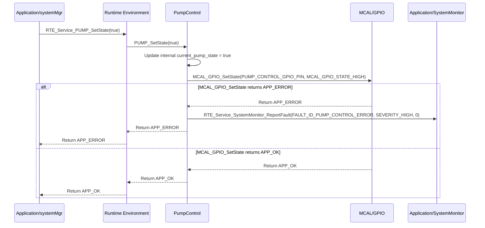

# **Detailed Design Document: PumpControl Component**

## **1. Introduction**

### **1.1. Purpose**

This document details the design of the PumpControl component. Its primary purpose is to provide a high-level interface for controlling a water pump (e.g., for irrigation, water circulation, or drainage) within the environmental monitoring and control system. It abstracts the complexities of the underlying GPIO (General Purpose Input/Output) driver used to switch the pump's relay, allowing systemMgr to simply command the pump's state (on/off).

### **1.2. Scope**

The scope of this document covers the pump module's architecture, functional behavior, interfaces, dependencies, and resource considerations. It details how pump receives control commands from systemMgr (via RTE services) and interacts with the underlying MCAL_GPIO driver for physical pump control.

### **1.3. References**

* Software Architecture Document (SAD) - Smart Device Firmware (Final Version)  
* Detailed Design Document: RTE  
* Detailed Design Document: MCAL_GPIO  
* Water Pump Datasheet (Conceptual)  
* Relay Module Datasheet (Conceptual)

## **2. Functional Description**

The PumpControl component provides the following core functionalities:

1. **Initialization**: Initialize the GPIO pin connected to the pump's control relay to a safe default state (e.g., pump off).  
2. **Set Pump State**: Turn the water pump on or off.  
3. **Get Pump State**: Retrieve the currently commanded state of the pump.  
4. **Error Reporting**: Report any failures during pump control (e.g., GPIO initialization failure, inability to set pin state) to the SystemMonitor via RTE_Service_SystemMonitor_ReportFault().

## **3. Non-Functional Requirements**

### **3.1. Performance**

* **Responsiveness**: Pump state changes should be applied promptly after a command.

### **3.2. Memory**

* **Minimal Footprint**: The pump module shall have a minimal memory footprint.

### **3.3. Reliability**

* **Robustness**: The module shall be robust against invalid state commands or underlying hardware failures.  
* **Fail-Safe**: In case of critical errors (e.g., water level sensor failure, leakage detection), the pump should revert to a safe state (e.g., off) to prevent flooding or dry-running.

## **4. Architectural Context**

As per the SAD (Section 3.1.2, Application Layer), pump resides in the Application Layer. It receives pump control commands from systemMgr (via RTE_Service_PUMP_SetState()). It then interacts with the MCAL_GPIO driver to toggle the relay controlling the physical water pump.

## **5. Design Details**

### **5.1. Module Structure**

The PumpControl component will consist of the following files:

* PumpControl/inc/pump.h: Public header file containing function prototypes and pump-specific definitions.  
* PumpControl/src/pump.c: Source file containing the implementation of pump control logic.  
* PumpControl/cfg/pump_cfg.h: Configuration header for the pump control GPIO pin and default state.

### **5.2. Public Interface (API)**

// In PumpControl/inc/pump.h
```c
#include "Application/common/inc/app_common.h" // For APP_Status_t  
#include <stdbool.h> // For bool

// --- Public Functions ---

/**  
 * @brief Initializes the Pump module and its associated GPIO pin.  
 * Sets the pump to a safe default state (e.g., off).  
 * @return APP_OK on success, APP_ERROR on failure.  
 */  
APP_Status_t PUMP_Init(void);

/**  
 * @brief Sets the state of the water pump (on or off).  
 * @param on True to turn the pump on, false to turn it off.  
 * @return APP_OK on success, APP_ERROR on failure.  
 */  
APP_Status_t PUMP_SetState(bool on);

/**  
 * @brief Gets the currently commanded state of the pump.  
 * @param state Pointer to store the current pump state (true for on, false for off).  
 * @return APP_OK on success, APP_ERROR on failure.  
 */  
APP_Status_t PUMP_GetState(bool *state);

// Add API for reading pump feedback (e.g., flow sensor, pressure sensor) if applicable  
// APP_Status_t PUMP_GetFlowRate(float *flow_lpm);
```
### **5.3. Internal Design**

The PumpControl module will maintain the current commanded pump state internally. It will translate the boolean state into a GPIO high/low signal and interact with the MCAL layer.

1. **Initialization (PUMP_Init)**:  
   * Call MCAL_GPIO_Init() for the PUMP_CONTROL_GPIO_PIN, configuring it as an output.  
   * Set the pump to its default safe state (e.g., PUMP_SetState(false) to turn it off).  
   * If MCAL_GPIO_Init() fails, report FAULT_ID_PUMP_INIT_FAILED to SystemMonitor via RTE_Service_SystemMonitor_ReportFault().  
   * Return APP_OK.  
2. **Set Pump State (PUMP_SetState)**:  
   * Update an internal static bool current_pump_state;.  
   * Call MCAL_GPIO_SetState(PUMP_CONTROL_GPIO_PIN, on ? MCAL_GPIO_STATE_HIGH : MCAL_GPIO_STATE_LOW).  
   * If MCAL_GPIO_SetState() fails, report FAULT_ID_PUMP_CONTROL_ERROR to SystemMonitor.  
   * Return APP_OK.  
3. **Get Pump State (PUMP_GetState)**:  
   * Validate state pointer.  
   * Copy the current_pump_state to the provided pointer.  
   * Return APP_OK.

**Sequence Diagram (Example: systemMgr Turns Pump On):**

### **5.4. Dependencies**

* **Application/common/inc/app_common.h**: For APP_Status_t.  
* **Application/logger/inc/logger.h**: For logging pump control events and errors.  
* **Application/SystemMonitor/inc/system_monitor.h**: For SystemMonitor_FaultId_t (e.g., FAULT_ID_PUMP_INIT_FAILED).  
* **Rte/inc/Rte.h**: For calling RTE_Service_SystemMonitor_ReportFault().  
* **Mcal/gpio/inc/mcal_gpio.h**: For GPIO control of the pump relay.

### **5.5. Error Handling**

* **Initialization Failure**: If GPIO initialization fails, FAULT_ID_PUMP_INIT_FAILED is reported to SystemMonitor.  
* **Control Hardware Failure**: If MCAL_GPIO_SetState() returns an error, FAULT_ID_PUMP_CONTROL_ERROR is reported.  
* **Fail-Safe**: In a critical system fault (managed by systemMgr and SystemMonitor), systemMgr would command PUMP_SetState(false) to turn the pump off as a primary safety measure against flooding or dry-running.

### **5.6. Configuration**

The PumpControl/cfg/pump_cfg.h file will contain:

* PUMP_CONTROL_GPIO_PIN: The specific GPIO pin connected to the pump's control relay.  
* PUMP_DEFAULT_STATE_ON: A boolean indicating the default state (false for off, true for on). Typically false.

// Example: PumpControl/cfg/pump_cfg.h
```c
#define PUMP_CONTROL_GPIO_PIN           24 // Example GPIO pin for pump relay control  
#define PUMP_DEFAULT_STATE_ON           false // Pump is off by default
```
### **5.7. Resource Usage**

* **Flash**: Low.  
* **RAM**: Very low, primarily for current_pump_state.  
* **CPU**: Very low. GPIO toggling is a fast operation.

## **6. Test Considerations**

### **6.1. Unit Testing**

* **Mock Dependencies**: Unit tests for pump will mock MCAL_GPIO_Init(), MCAL_GPIO_SetState(), and RTE_Service_SystemMonitor_ReportFault().  
* **Test Cases**:  
  * PUMP_Init: Verify correct MCAL initialization calls and default pump state. Test initialization failure and fault reporting.  
  * PUMP_SetState:  
    * Test with true and false states. Mock MCAL_GPIO_SetState() to verify correct GPIO level is commanded.  
    * Test underlying MCAL failures (e.g., MCAL_GPIO_SetState returns APP_ERROR) and verify FAULT_ID_PUMP_CONTROL_ERROR is reported.  
  * PUMP_GetState: Verify it returns the last commanded state.

### **6.2. Integration Testing**

* **Pump-MCAL Integration**: Verify that pump correctly interfaces with the actual MCAL_GPIO driver and the physical pump relay.  
* **Visual/Electrical Verification**: Observe the relay state (e.g., LED on relay module) or measure voltage across the pump terminals to confirm on/off state.  
* **SystemMgr Control**: Verify that systemMgr can effectively turn the pump on and off via RTE_Service_PUMP_SetState().  
* **Fault Injection**: Disconnect the pump relay control wire or cause a short on the GPIO and verify that pump reports FAULT_ID_PUMP_CONTROL_ERROR (if feedback mechanisms are in place, otherwise it's a passive module).

### **6.3. System Testing**

* **End-to-End Control Loop**: Verify that the system's overall control logic (e.g., water level sensor -> systemMgr logic -> pump control) functions correctly.  
* **Safety Testing**: Verify that the pump correctly turns off in fail-safe scenarios (e.g., water level sensor failure, leakage detection).  
* **Long-Term Operation**: Run the system for extended periods to ensure pump control reliability.
