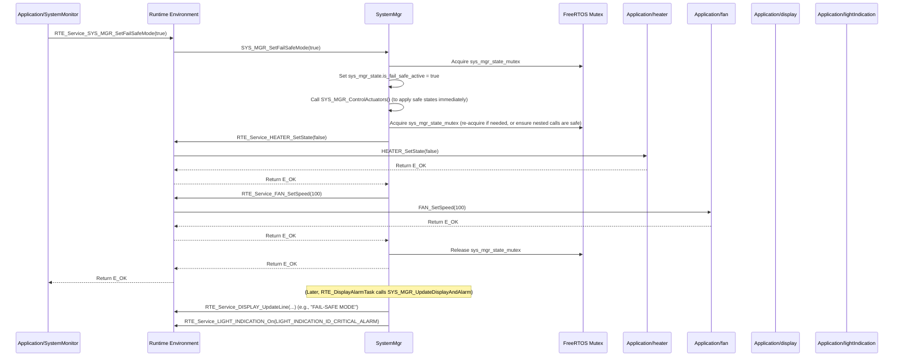

# **Detailed Design Document: SystemMgr Component**

## **1. Introduction**

### **1.1. Purpose**

This document details the design of the SystemMgr component. It serves as the **central control logic and state manager** for the entire environmental monitoring and control system. Its primary purpose is to manage operational parameters, apply control algorithms based on sensor readings, determine overall system state and alarms, and command actuators. It also manages system modes (Automatic, Manual, Hybrid) and responds to requests from SystemMonitor for fail-safe activation.

### **1.2. Scope**

The scope of this document covers the systemMgr module's architecture, functional behavior, interfaces, dependencies, and resource considerations. It details how systemMgr interacts with temperature, humidity, fan, heater, pump, ventilator, lightControl, display, lightIndication, SystemMonitor, storage, and power modules via RTE services.

### **1.3. References**

* Software Architecture Document (SAD) - Smart Device Firmware (Final Version)  
* Detailed Design Document: RTE  
* Detailed Design Document: Application/temperature  
* Detailed Design Document: Application/humidity  
* Detailed Design Document: Application/fan  
* Detailed Design Document: Application/heater  
* Detailed Design Document: Application/pump  
* Detailed Design Document: Application/ventilator  
* Detailed Design Document: Application/lightControl  
* Detailed Design Document: Application/display  
* Detailed Design Document: Application/lightIndication  
* Detailed Design Document: Application/SystemMonitor  
* Detailed Design Document: Application/storage  
* Detailed Design Document: Application/power  
* FreeRTOS Documentation (for mutexes)

## **2. Functional Description**

The SystemMgr component provides the following core functionalities:

1. **Initialization**: Initialize its internal state, acquire mutexes, and load operational parameters from storage.  
2. **System/SW/App Mode Management**: Manages and transitions between different operational modes (e.g., Automatic, Manual, Hybrid).  
3. **Sensor Data Processing**: Receives and processes current sensor readings (temperature, humidity) from temperature and humidity modules.  
4. **Control Algorithms**: Implements the core control logic, such as:  
   * Fan staging based on temperature.  
   * Heater activation/deactivation.  
   * Pump control (e.g., based on humidity or external water level sensors).  
   * Ventilator scheduling.  
   * Light control (e.g., based on schedule or occupancy).  
5. **Actuator Command**: Commands the fan, heater, pump, ventilator, and lightControl modules to set their states/speeds.  
6. **Alarm Management**: Manages fire alarm conditions and other critical system alarms, triggering visual/audible indications via display and lightIndication.  
7. **Display/Alarm Update**: Periodically updates the display and lightIndication modules with current status, sensor readings, and alarm states.  
8. **Power Readiness Check**: Provides a function to check if power conditions are sufficient for critical operations like OTA updates (using data from power module).  
9. **Fail-Safe Mode Activation**: Responds to requests from SystemMonitor to enter a predefined fail-safe mode, overriding normal control logic and driving actuators to safe states.  
10. **Operational Parameter Management**: Stores and retrieves operational parameters (e.g., min/max temperature thresholds, schedules) using storage.  
11. **Error Reporting**: Reports application-specific errors (e.g., invalid operational parameters) to SystemMonitor.

## **3. Non-Functional Requirements**

### **3.1. Performance**

* **Real-Time Responsiveness**: Control loops must meet their deadlines to ensure stable environmental control.  
* **Efficiency**: Control algorithms should be computationally efficient.

### **3.2. Memory**

* **Efficient State Storage**: The sys_mgr_state_t structure should be optimized for memory usage.

### **3.3. Reliability**

* **Data Integrity**: Ensure the internal state (sys_mgr_state_t) is always consistent and protected by mutexes.  
* **Robustness**: The control logic should be robust against noisy sensor data or temporary actuator failures.  
* **Safety**: The fail-safe mechanism must be highly reliable to prevent hazardous conditions.  
* **Persistence**: Operational parameters should persist across power cycles (handled by storage).

## **4. Architectural Context**

As per the SAD (Section 3.1.2, Application Layer), systemMgr resides in the Application Layer and is the central "brain." It is called by RTE_SensorReadTask (for ProcessSensorReadings), RTE_ActuatorControlTask (for ControlActuators), and RTE_DisplayAlarmTask (for UpdateDisplayAndAlarm). It interacts with almost all other application modules and some service modules via RTE services. It holds the central sys_mgr_state_t protected by a mutex.

## **5. Design Details**

### **5.1. Module Structure**

The SystemMgr component will consist of the following files:

* SystemMgr/inc/sys_mgr.h: Public header file containing function prototypes, sys_mgr_state_t definition, and mode definitions.  
* SystemMgr/src/sys_mgr.c: Source file containing the implementation of control algorithms, state management, and interaction with other modules.  
* SystemMgr/cfg/sys_mgr_cfg.h: Configuration header for default operational parameters, control thresholds, and alarm settings.

### **5.2. Public Interface (API)**

// In SystemMgr/inc/sys_mgr.h
```c
#include "Application/common/inc/common.h" // For APP_Status_t  
#include <stdbool.h> // For bool  
#include <stdint.h>  // For uint8_t

// --- System/SW/App Modes ---  
typedef enum {  
    SYS_MGR_MODE_AUTOMATIC = 0, // Fully automated control based on sensors  
    SYS_MGR_MODE_MANUAL,        // Actuators controlled directly by external commands  
    SYS_MGR_MODE_HYBRID,        // Mixed control (e.g., fans auto, lights manual)  
    SYS_MGR_MODE_FAIL_SAFE,     // Emergency mode, overrides all other control  
    SYS_MGR_MODE_COUNT  
} SYS_MGR_Mode_t;

// --- Operational Parameters (stored persistently) ---  
typedef struct {  
    float operational_temp_min_c;  
    float operational_temp_max_c;  
    float operational_humidity_min_p; // percentage  
    float operational_humidity_max_p; // percentage  
    uint8_t fan_stage_threshold_temp_c[3]; // Example: thresholds for 3 fan stages  
    // Add schedules, light settings, pump thresholds, etc.  
} SystemOperationalParams_t;

// --- System Manager State (internal, protected by mutex) ---  
typedef struct {  
    SYS_MGR_Mode_t current_mode;  
    bool is_fail_safe_active;  
    float current_room_temp_c;  
    float current_room_humidity_p;  
    bool heater_is_working;  
    uint8_t current_fan_speed_percent;  
    bool pump_is_active;  
    bool ventilator_is_active;  
    bool light_is_on;  
    uint8_t current_light_brightness_percent;  
    bool fire_alarm_active;  
    // Add more state variables as needed  
    SystemOperationalParams_t operational_params; // Current active parameters  
} SYS_MGR_State_t;

// --- Public Functions ---

/**  
 * @brief Initializes the System Manager module.  
 * Loads operational parameters from storage and sets initial system mode.  
 * @return E_OK on success, E_NOK on failure.  
 */  
APP_Status_t SYS_MGR_Init(void);

/**  
 * @brief Processes the latest sensor readings and updates internal state.  
 * Called periodically by RTE_SensorReadTask.  
 * @return E_OK on success, E_NOK on failure.  
 */  
APP_Status_t SYS_MGR_ProcessSensorReadings(void);

/**  
 * @brief Applies control algorithms and commands actuators based on current state and mode.  
 * Called periodically by RTE_ActuatorControlTask.  
 * @return E_OK on success, E_NOK on failure.  
 */  
APP_Status_t SYS_MGR_ControlActuators(void);

/**  
 * @brief Updates the display and alarm indicators based on current system state.  
 * Called periodically by RTE_DisplayAlarmTask.  
 * @return E_OK on success, E_NOK on failure.  
 */  
APP_Status_t SYS_MGR_UpdateDisplayAndAlarm(void);

/**  
 * @brief Sets the operational temperature range.  
 * @param min_temp The minimum desired temperature in Celsius.  
 * @param max_temp The maximum desired temperature in Celsius.  
 * @return E_OK on success, E_NOK on failure.  
 */  
APP_Status_t SYS_MGR_SetOperationalTemperature(float min_temp, float max_temp);

/**  
 * @brief Gets the current operational temperature range.  
 * @param min_temp Pointer to store the minimum desired temperature.  
 * @param max_temp Pointer to store the maximum desired temperature.  
 * @return E_OK on success, E_NOK on failure.  
 */  
APP_Status_t SYS_MGR_GetOperationalTemperature(float *min_temp, float *max_temp);

/**  
 * @brief Sets the system's operational mode (Automatic, Manual, Hybrid, Fail-Safe).  
 * @param mode The desired system mode.  
 * @return E_OK on success, E_NOK on failure.  
 */  
APP_Status_t SYS_MGR_SetMode(SYS_MGR_Mode_t mode);

/**  
 * @brief Gets the current system's operational mode.  
 * @param mode Pointer to store the current system mode.  
 * @return E_OK on success, E_NOK on failure.  
 */  
APP_Status_t SYS_MGR_GetMode(SYS_MGR_Mode_t *mode);

/**  
 * @brief Activates or deactivates the fail-safe mode.  
 * This function is primarily called by SystemMonitor in response to critical faults.  
 * @param enable True to activate fail-safe, false to deactivate.  
 * @return E_OK on success, E_NOK on failure.  
 */  
APP_Status_t SYS_MGR_SetFailSafeMode(bool enable);

/**  
 * @brief Checks if the system has sufficient power for critical operations like OTA updates.  
 * This function queries the Power module.  
 * @param ready Pointer to a boolean to store the readiness status.  
 * @return E_OK on success, E_NOK on failure.  
 */  
APP_Status_t SYS_MGR_CheckPowerReadinessForOTA(bool *ready);

// Add more getters for sensor readings, actuator states, alarm status etc.  
APP_Status_t SYS_MGR_GetCurrentSensorReadings(float *temp, float *humidity);  
APP_Status_t SYS_MGR_GetActuatorStates(bool *heater_on, uint8_t *fan_speed, bool *pump_on, bool *ventilator_on, bool *light_on);  
APP_Status_t SYS_MGR_GetFireAlarmStatus(bool *active);
```

### **5.3. Internal Design**

The SystemMgr module will maintain its entire state in a SYS_MGR_State_t structure, protected by a FreeRTOS mutex. Its core logic resides in ProcessSensorReadings, ControlActuators, and UpdateDisplayAndAlarm functions, which are called periodically by RTE tasks.

1. **Internal State**:  
   * static SYS_MGR_State_t sys_mgr_state;  
   * static SemaphoreHandle_t sys_mgr_state_mutex;  
2. **Initialization (SYS_MGR_Init)**:  
   * Create sys_mgr_state_mutex using SERVICE_OS_CreateMutex().  
   * Initialize sys_mgr_state with default values.  
   * Call RTE_Service_STORAGE_ReadConfig(STORAGE_CONFIG_ID_SYSTEM_OPERATIONAL_PARAMS, &sys_mgr_state.operational_params, sizeof(SystemOperationalParams_t)) to load saved parameters.  
   * If read fails, use hardcoded defaults and report FAULT_ID_STORAGE_READ_FAILED to SystemMonitor.  
   * Set initial current_mode to SYS_MGR_MODE_AUTOMATIC.  
   * Return E_OK.  
3. **Process Sensor Readings (SYS_MGR_ProcessSensorReadings)**:  
   * Acquire sys_mgr_state_mutex.  
   * Call RTE_Service_TEMP_SENSOR_Read(&sys_mgr_state.current_room_temp_c).  
   * Call RTE_Service_HUMIDITY_SENSOR_Read(&sys_mgr_state.current_room_humidity_p).  
   * (Optional) Implement sensor data validation (e.g., check for reasonable ranges). If invalid, report FAULT_ID_SENSOR_DATA_INVALID to SystemMonitor.  
   * Release sys_mgr_state_mutex.  
   * Return E_OK.  
4. **Control Actuators (SYS_MGR_ControlActuators)**:  
   * Acquire sys_mgr_state_mutex.  
   * **Check Fail-Safe Mode**: If sys_mgr_state.is_fail_safe_active is true:  
     * Override all normal control logic.  
     * Call RTE_Service_HEATER_SetState(false).  
     * Call RTE_Service_FAN_SetSpeed(100) (or other safe speed).  
     * Call RTE_Service_PUMP_SetState(true) (if drainage is fail-safe).  
     * Call RTE_Service_VENTILATOR_SetState(true).  
     * Call RTE_Service_LIGHT_SetState(false) (or true for emergency lights).  
     * Release sys_mgr_state_mutex and return.  
   * **Control Logic based on current_mode**:  
     * **SYS_MGR_MODE_AUTOMATIC**:  
       * **Temperature Control (Fan/Heater)**:  
         * If current_room_temp_c > operational_params.operational_temp_max_c:  
           * Calculate fan speed based on delta (e.g., staging). Call RTE_Service_FAN_SetSpeed().  
           * Call RTE_Service_HEATER_SetState(false).  
         * Else if current_room_temp_c < operational_params.operational_temp_min_c:  
           * Call RTE_Service_HEATER_SetState(true).  
           * Call RTE_Service_FAN_SetSpeed(0).  
         * Else (within range): RTE_Service_HEATER_SetState(false), RTE_Service_FAN_SetSpeed(0).  
       * **Humidity Control (Pump/Ventilator)**:  
         * If current_room_humidity_p > operational_params.operational_humidity_max_p:  
           * Call RTE_Service_PUMP_SetState(true).  
           * Call RTE_Service_VENTILATOR_SetState(true).  
         * Else: RTE_Service_PUMP_SetState(false), RTE_Service_VENTILATOR_SetState(false).  
       * **Light Control**: (e.g., based on time schedule or light sensor if integrated).  
     * **SYS_MGR_MODE_MANUAL**:  
       * Actuators are controlled only by external commands (e.g., from diagnostic via RTE_Service_FAN_SetSpeed, etc.). systemMgr does not actively control them here.  
     * **SYS_MGR_MODE_HYBRID**:  
       * Mix of automatic and manual logic.  
   * Update sys_mgr_state with the new actuator states.  
   * Release sys_mgr_state_mutex.  
   * Return E_OK.  
5. **Update Display and Alarm (SYS_MGR_UpdateDisplayAndAlarm)**:  
   * Acquire sys_mgr_state_mutex.  
   * **Display Update**:  
     * Format current temperature and humidity into strings.  
     * Call RTE_Service_DISPLAY_UpdateLine(DISPLAY_LINE_1, temp_string).  
     * Call RTE_Service_DISPLAY_UpdateLine(DISPLAY_LINE_2, humidity_string).  
   * **Alarm Indication**:  
     * Check sys_mgr_state.fire_alarm_active. If true, call RTE_Service_LIGHT_INDICATION_On(LIGHT_INDICATION_ID_CRITICAL_ALARM). Else, RTE_Service_LIGHT_INDICATION_Off().  
     * (Optional) Indicate current mode, actuator states via other LEDs.  
   * Release sys_mgr_state_mutex.  
   * Return E_OK.  
6. **Set Operational Temperature (SYS_MGR_SetOperationalTemperature)**:  
   * Acquire sys_mgr_state_mutex.  
   * Validate min_temp, max_temp (e.g., min_temp <= max_temp). If invalid, report FAULT_ID_INVALID_TEMP_RANGE to SystemMonitor.  
   * Update sys_mgr_state.operational_params.operational_temp_min_c and max_temp_c.  
   * Call RTE_Service_STORAGE_WriteConfig(STORAGE_CONFIG_ID_SYSTEM_OPERATIONAL_PARAMS, &sys_mgr_state.operational_params, sizeof(SystemOperationalParams_t)) to save persistently.  
   * Release sys_mgr_state_mutex.  
   * Return E_OK.  
7. **Set Fail-Safe Mode (SYS_MGR_SetFailSafeMode)**:  
   * Acquire sys_mgr_state_mutex.  
   * Set sys_mgr_state.is_fail_safe_active = enable;.  
   * If enabling fail-safe, immediately call SYS_MGR_ControlActuators() to apply safe states.  
   * Release sys_mgr_state_mutex.  
   * Return E_OK.  
8. **Check Power Readiness for OTA (SYS_MGR_CheckPowerReadinessForOTA)**:  
   * Acquire sys_mgr_state_mutex.  
   * Call RTE_Service_POWER_GetConsumption(&power_data).  
   * Check power_data.voltage_mv against SYS_MGR_OTA_MIN_VOLTAGE_MV (from sys_mgr_cfg.h).  
   * Set *ready = (power_data.voltage_mv >= SYS_MGR_OTA_MIN_VOLTAGE_MV).  
   * Release sys_mgr_state_mutex.  
   * Return E_OK.

**Sequence Diagram (Example: SystemMonitor Triggers Fail-Safe):**


### **5.4. Dependencies**

* **Application/common/inc/common.h**: For APP_Status_t.  
* **Application/logger/inc/logger.h**: For logging system events and errors.  
* **Application/SystemMonitor/inc/system_monitor.h**: For SystemMonitor_FaultId_t (e.g., FAULT_ID_INVALID_TEMP_RANGE).  
* **Rte/inc/Rte.h**: For calling all necessary RTE services (RTE_Service_TEMP_SENSOR_Read(), RTE_Service_HUMIDITY_SENSOR_Read(), RTE_Service_FAN_SetSpeed(), etc., RTE_Service_SystemMonitor_ReportFault(), RTE_Service_STORAGE_ReadConfig(), RTE_Service_STORAGE_WriteConfig(), RTE_Service_POWER_GetConsumption()).  
* **FreeRTOS Headers**: FreeRTOS.h, semphr.h (for sys_mgr_state_mutex).

### **5.5. Error Handling**

* **Mutex Protection**: All access to sys_mgr_state must be protected by sys_mgr_state_mutex to prevent race conditions.  
* **Input Validation**: Validate parameters for SetOperationalTemperature, SetMode, etc. Report invalid inputs as faults to SystemMonitor.  
* **Sensor Read Failures**: If RTE_Service_TEMP_SENSOR_Read() or RTE_Service_HUMIDITY_SENSOR_Read() return E_NOK, systemMgr should use the last valid reading or a default safe value, and SystemMonitor would have already been notified by the sensor modules.  
* **Actuator Command Failures**: If RTE_Service_FAN_SetSpeed() or other actuator commands return E_NOK, systemMgr should log this, but continue operation. SystemMonitor would have been notified by the actuator modules.  
* **Storage Failures**: If RTE_Service_STORAGE_ReadConfig()/WriteConfig() fail, systemMgr should use default parameters and report a fault to SystemMonitor.  
* **Fail-Safe Override**: The is_fail_safe_active flag is critical for overriding normal control logic during emergencies, ensuring safety.

### **5.6. Configuration**

The SystemMgr/cfg/sys_mgr_cfg.h file will contain:

* **Default Operational Parameters**: Initial values for SystemOperationalParams_t if storage read fails.  
* **Control Algorithm Thresholds**: Specific temperature/humidity thresholds for fan staging, heater activation, etc.  
* **Alarm Thresholds**: (e.g., SYS_MGR_FIRE_TEMP_THRESHOLD_C).  
* **OTA Power Threshold**: SYS_MGR_OTA_MIN_VOLTAGE_MV.

// Example: SystemMgr/cfg/sys_mgr_cfg.h
```c
// Default Operational Parameters (used if storage read fails)  
#define SYS_MGR_DEFAULT_TEMP_MIN_C          20.0f  
#define SYS_MGR_DEFAULT_TEMP_MAX_C          25.0f  
#define SYS_MGR_DEFAULT_HUMIDITY_MIN_P      40.0f  
#define SYS_MGR_DEFAULT_HUMIDITY_MAX_P      60.0f

// Fan Staging Thresholds (example for 3 stages)  
#define SYS_MGR_FAN_STAGE_1_TEMP_C          26.0f // Activate fan stage 1 above this  
#define SYS_MGR_FAN_STAGE_2_TEMP_C          28.0f // Activate fan stage 2 above this  
#define SYS_MGR_FAN_STAGE_3_TEMP_C          30.0f // Activate fan stage 3 above this

// Heater Control Thresholds  
#define SYS_MGR_HEATER_ACTIVATION_TEMP_C    18.0f // Activate heater below this

// Fire Alarm Threshold  
#define SYS_MGR_FIRE_TEMP_THRESHOLD_C       60.0f // Trigger fire alarm if temp > 60C

// OTA Power Readiness Threshold  
#define SYS_MGR_OTA_MIN_VOLTAGE_MV          3000 // Minimum voltage (3.0V) for OTA
```

### **5.7. Resource Usage**

* **Flash**: Moderate, for control algorithms and state management logic.  
* **RAM**: Moderate, for the SYS_MGR_State_t structure and the mutex.  
* **CPU**: Moderate, as it contains the core control logic. Its periodic execution needs to be efficient.

## **6. Test Considerations**

### **6.1. Unit Testing**

* **Mock Dependencies**: Unit tests for systemMgr will mock all RTE_Service_...() calls (sensors, actuators, display, SystemMonitor, storage, power) and FreeRTOS mutex APIs.  
* **Test Cases**:  
  * SYS_MGR_Init: Verify mutex creation and initial state. Mock RTE_Service_STORAGE_ReadConfig() to test loading saved parameters and falling back to defaults.  
  * SYS_MGR_ProcessSensorReadings: Mock sensor reads to simulate various temperatures/humidities. Verify sys_mgr_state updates and mutex protection.  
  * SYS_MGR_ControlActuators:  
    * Test SYS_MGR_MODE_AUTOMATIC: Simulate various sensor readings (above/below thresholds) and verify correct RTE_Service_FAN_SetSpeed(), RTE_Service_HEATER_SetState(), etc., calls.  
    * Test SYS_MGR_MODE_FAIL_SAFE: Verify all actuators are commanded to safe states, overriding normal logic.  
    * Test SYS_MGR_MODE_MANUAL: Verify no automatic control actions are taken.  
    * Verify mutex protection.  
  * SYS_MGR_UpdateDisplayAndAlarm: Verify correct RTE_Service_DISPLAY_UpdateLine() and RTE_Service_LIGHT_INDICATION_On()/Off() calls based on sys_mgr_state.  
  * SYS_MGR_SetOperationalTemperature: Test valid/invalid ranges. Verify sys_mgr_state update and RTE_Service_STORAGE_WriteConfig() call.  
  * SYS_MGR_SetFailSafeMode: Verify is_fail_safe_active flag is set and ControlActuators is called.  
  * SYS_MGR_CheckPowerReadinessForOTA: Mock RTE_Service_POWER_GetConsumption() to return various voltages and verify correct ready status.

### **6.2. Integration Testing**

* **SystemMgr-Sensor/Actuator Integration**: Verify that systemMgr correctly reads from temperature/humidity and commands fan/heater/pump/ventilator/lightControl via RTE.  
* **SystemMgr-SystemMonitor Integration**: Verify that systemMgr responds correctly to SystemMonitor's SetFailSafeMode requests.  
* **SystemMgr-Storage Integration**: Verify that systemMgr can persistently save and load its operational parameters.  
* **SystemMgr-Power Integration**: Verify CheckPowerReadinessForOTA accurately reflects power conditions.  
* **End-to-End Control Logic**: Run the system in an environment where temperature/humidity can be controlled and verify that systemMgr's control algorithms correctly manage the actuators.

### **6.3. System Testing**

* **Full System Operation**: Run the entire system for extended periods under various environmental conditions and operational modes.  
* **Fail-Safe Scenarios**: Simulate critical faults (e.g., force a temperature sensor failure, trigger a fire alarm condition) and verify that systemMgr correctly enters fail-safe mode and commands actuators to safe states.  
* **Mode Transitions**: Test transitions between Automatic, Manual, Hybrid, and Fail-Safe modes.  
* **Power-Dependent Operations**: Test OTA updates when power is low and verify systemMgr correctly prevents them.  
* **User Interaction**: Verify that manual overrides (if implemented via diagnostic) correctly affect systemMgr's behavior.
