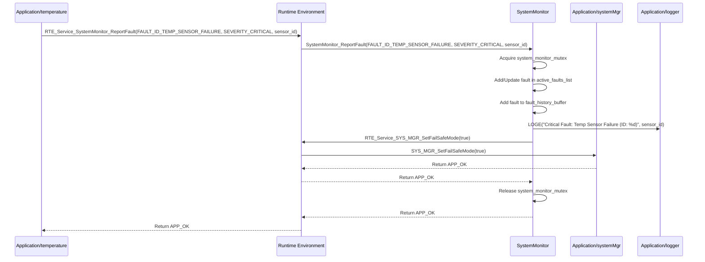

# **Detailed Design Document: SystemMonitor Component**

## **1. Introduction**

### **1.1. Purpose**

This document details the design of the SystemMonitor component. As the central **Fault Manager** of the system, its primary purpose is to monitor overall system health, collect fault reports from all other modules, store active and historical faults, and initiate corrective actions by requesting systemMgr to change its state (e.g., enter fail-safe mode) based on detected issues.

### **1.2. Scope**

The scope of this document covers the SystemMonitor module's architecture, functional behavior, interfaces, dependencies, and resource considerations. It details how SystemMonitor receives fault reports, calculates system health metrics, manages fault states, and interacts with systemMgr and diagnostic via RTE services.

### **1.3. References**

* Software Architecture Document (SAD) - Smart Device Firmware (Final Version)  
* Detailed Design Document: RTE  
* Detailed Design Document: Application/systemMgr  
* Detailed Design Document: Application/diagnostic  
* FreeRTOS Documentation

## **2. Functional Description**

The SystemMonitor component provides the following core functionalities:

1. **Initialization**: Initialize internal fault lists, health metric variables, and mutexes.  
2. **Fault Reporting Interface**: Provides a public RTE service (RTE_Service_SystemMonitor_ReportFault()) for any module in the system to report a detected fault.  
3. **Fault Storage and Management**: Stores active faults in a dynamic list or fixed-size array and maintains a history of past faults (e.g., in a circular buffer).  
4. **System Health Monitoring**: Periodically calculates CPU load and monitors the minimum free stack (High Water Mark - HWM) for all FreeRTOS tasks.  
5. **Threshold Monitoring**: Compares system health metrics (CPU load, HWM) against predefined thresholds and registers them as internal system faults if thresholds are exceeded.  
6. **Corrective Action Requests**: Based on the severity and type of active faults, it requests systemMgr (via RTE_Service_SYS_MGR_SetFailSafeMode()) to take specific corrective actions, such as entering a fail-safe mode.  
7. **Fault Status Query**: Provides an RTE service (RTE_Service_SystemMonitor_GetFaultStatus()) for Diagnostic to retrieve the current active faults and fault history.  
8. **Logging**: Logs all received fault reports and periodic system health metrics using the logger module.

## **3. Non-Functional Requirements**

### **3.1. Performance**

* **Low Overhead**: Fault reporting and health monitoring should have minimal impact on system performance.  
* **Timely Detection**: Critical faults should be detected and processed promptly.

### **3.2. Memory**

* **Efficient Fault Storage**: Fault lists and history should use memory efficiently, especially on resource-constrained devices.  
* **Configurable Size**: The size of fault history should be configurable.

### **3.3. Reliability**

* **Robustness**: The module must be robust against invalid fault reports or internal data corruption.  
* **Fault Persistence (Conceptual)**: For critical faults, the ability to persist fault logs across reboots (e.g., using Service_NvM) is desirable. This design focuses on in-RAM logs.  
* **Accuracy**: CPU load and stack usage calculations should be accurate.

## **4. Architectural Context**

As per the SAD (Section 3.1.2, Application Layer), SystemMonitor resides in the Application Layer. It acts as the central fault manager. Other application modules and service modules report faults to it via RTE_Service_SystemMonitor_ReportFault(). SystemMonitor then requests systemMgr to take corrective actions via RTE_Service_SYS_MGR_Set...(). Application/diagnostic queries SystemMonitor for fault status via RTE_Service_SystemMonitor_GetFaultStatus(). SystemMonitor runs in its own low-priority task (SYS_MON_Task).

## **5. Design Details**

### **5.1. Module Structure**

The SystemMonitor component will consist of the following files:

* SystemMonitor/inc/system_monitor.h: Public header file containing function prototypes, data types (e.g., Fault_t, SystemHealth_t), and fault ID definitions.  
* SystemMonitor/src/system_monitor.c: Source file containing the implementation of SystemMonitor's functions, its internal task, and fault management logic.  
* SystemMonitor/cfg/system_monitor_cfg.h: Configuration header for fault thresholds, history size, and fault ID definitions.

### **5.2. Public Interface (API)**

// In SystemMonitor/inc/system_monitor.h
```c
#include "Application/common/inc/app_common.h" // For APP_Status_t  
#include "Rte/inc/Rte.h" // For RTE service calls

// --- Fault ID Definitions ---  
// Define a comprehensive list of unique fault IDs.  
// These should be categorized and clearly documented.  
// Example categories:  
// SYSTEM_FAULTS (CPU load, stack overflow, watchdog)  
// SENSOR_FAULTS (temp sensor failure, humidity sensor failure)  
// ACTUATOR_FAULTS (fan motor failure, heater open circuit)  
// COMM_FAULTS (Modbus CRC, BLE connection, WiFi auth fail)  
// NVM_FAULTS (data corruption, write failure)  
// OTA_FAULTS (download fail, verification fail)  
// ...  
typedef enum {  
    FAULT_ID_NONE = 0,  
    // System Faults  
    FAULT_ID_CPU_OVERLOAD,  
    FAULT_ID_STACK_OVERFLOW,  
    FAULT_ID_WATCHDOG_RESET,  
    // Sensor Faults  
    FAULT_ID_TEMP_SENSOR_FAILURE,  
    FAULT_ID_HUMIDITY_SENSOR_FAILURE,  
    FAULT_ID_TEMP_SENSOR_OUT_OF_RANGE,  
    // Actuator Faults  
    FAULT_ID_FAN_MOTOR_FAILURE,  
    FAULT_ID_HEATER_OPEN_CIRCUIT,  
    // Communication Faults  
    FAULT_ID_MODBUS_CRC_ERROR,  
    FAULT_ID_BLE_INIT_FAILURE,  
    FAULT_ID_WIFI_AUTH_FAILURE,  
    // NvM Faults  
    FAULT_ID_NVM_DATA_CORRUPT,  
    FAULT_ID_NVM_WRITE_FAILED,  
    // OTA Faults  
    FAULT_ID_OTA_DOWNLOAD_FAILED,  
    FAULT_ID_OTA_VERIFICATION_FAILED,  
    // Add more as needed  
    FAULT_ID_COUNT  
} SystemMonitor_FaultId_t;

// Enum for fault severity  
typedef enum {  
    FAULT_SEVERITY_INFO = 0,    // Informational, no immediate action  
    FAULT_SEVERITY_LOW,         // Minor issue, might need attention  
    FAULT_SEVERITY_MEDIUM,      // Moderate issue, might affect functionality  
    FAULT_SEVERITY_HIGH,        // Significant issue, requires attention  
    FAULT_SEVERITY_CRITICAL,    // System critical, requires immediate action (e.g., fail-safe)  
    FAULT_SEVERITY_FATAL        // Unrecoverable, system reset  
} SystemMonitor_FaultSeverity_t;

// Structure to represent an active fault  
typedef struct {  
    SystemMonitor_FaultId_t id;  
    SystemMonitor_FaultSeverity_t severity;  
    uint32_t timestamp_ms;      // When the fault was first detected  
    uint32_t data;              // Optional: context-specific data (e.g., sensor value, error code)  
    uint32_t count;             // How many times this fault has occurred  
    bool active;                // True if currently active  
} SystemMonitor_Fault_t;

// --- Public Functions ---

/**  
 * @brief Initializes the SystemMonitor module.  
 * This function should be called once during application initialization.  
 * It initializes internal data structures and creates the SYS_MON_Task.  
 * @return APP_OK on success, APP_ERROR on failure.  
 */  
APP_Status_t SystemMonitor_Init(void);

/**  
 * @brief Reports a fault to the SystemMonitor.  
 * This function is called by other modules (via RTE_Service_SystemMonitor_ReportFault).  
 * @param fault_id The ID of the fault being reported.  
 * @param severity The severity of the fault.  
 * @param data Optional context-specific data related to the fault.  
 * @return APP_OK on success, APP_ERROR on failure.  
 */  
APP_Status_t SystemMonitor_ReportFault(SystemMonitor_FaultId_t fault_id,  
                                       SystemMonitor_FaultSeverity_t severity,  
                                       uint32_t data);

/**  
 * @brief Gets the current status of active faults and fault history.  
 * This function is typically called by the Diagnostic module (via RTE_Service_SystemMonitor_GetFaultStatus).  
 * @param active_faults_bitmap Pointer to store a bitmap of active fault IDs (optional, for quick check).  
 * @param fault_history_count Pointer to store the number of entries in the fault history.  
 * @param fault_history_buffer Optional: Pointer to a buffer to copy fault history entries.  
 * @param buffer_size Optional: Size of the fault history buffer.  
 * @return APP_OK on success, APP_ERROR on failure.  
 */  
APP_Status_t SystemMonitor_GetFaultStatus(uint32_t *active_faults_bitmap,  
                                          uint32_t *fault_history_count,  
                                          SystemMonitor_Fault_t *fault_history_buffer,  
                                          uint32_t buffer_size);

/**  
 * @brief Clears a specific active fault or all faults.  
 * @param fault_id The ID of the fault to clear (FAULT_ID_NONE to clear all active faults).  
 * @return APP_OK on success, APP_ERROR on failure.  
 */  
APP_Status_t SystemMonitor_ClearFault(SystemMonitor_FaultId_t fault_id);

// --- Internal Task Prototype (implemented in .c, declared in Rte.h) ---  
// void SYS_MON_Task(void *pvParameters);
```

### **5.3. Internal Design**

The SystemMonitor module will manage internal data structures for active faults and fault history, protected by a mutex. Its dedicated task will periodically collect system health metrics and perform threshold checks.

1. **Initialization (SystemMonitor_Init)**:  
   * Initialize active_faults_list (e.g., an array of SystemMonitor_Fault_t with active = false).  
   * Initialize fault_history_buffer (e.g., a circular buffer of SystemMonitor_Fault_t).  
   * Create a FreeRTOS mutex (system_monitor_mutex) to protect access to these data structures.  
   * Create SYS_MON_Task using RTE_Service_OS_CreateTask().  
   * Return APP_OK.  
2. **Fault Reporting (SystemMonitor_ReportFault)**:  
   * Called by other modules via RTE_Service_SystemMonitor_ReportFault().  
   * Acquire system_monitor_mutex.  
   * Check if the fault_id is already in active_faults_list.  
     * If active: Update its timestamp, increment count.  
     * If new: Find an empty slot, populate SystemMonitor_Fault_t (ID, severity, timestamp, data, count=1, active=true).  
   * Add the fault entry (or updated entry) to fault_history_buffer (circularly).  
   * **Corrective Action Logic**: If severity is FAULT_SEVERITY_CRITICAL or FATAL, or if a specific fault ID triggers a predefined action:  
     * Call RTE_Service_SYS_MGR_SetFailSafeMode(true).  
     * If FAULT_SEVERITY_FATAL, also call RTE_Service_DIAGNOSTIC_RequestReboot().  
   * Log the fault using logger.  
   * Release system_monitor_mutex.  
   * Return APP_OK.  
3. **Get Fault Status (SystemMonitor_GetFaultStatus)**:  
   * Called by Diagnostic via RTE_Service_SystemMonitor_GetFaultStatus().  
   * Acquire system_monitor_mutex.  
   * Populate active_faults_bitmap by iterating active_faults_list.  
   * Set fault_history_count.  
   * If fault_history_buffer is provided, copy the relevant entries from the internal circular buffer.  
   * Release system_monitor_mutex.  
   * Return APP_OK.  
4. **Clear Fault (SystemMonitor_ClearFault)**:  
   * Called by Diagnostic or internal logic.  
   * Acquire system_monitor_mutex.  
   * If fault_id is FAULT_ID_NONE, clear all active faults (set active = false for all entries in active_faults_list).  
   * Otherwise, find the specific fault_id in active_faults_list and set active = false.  
   * Release system_monitor_mutex.  
   * Return APP_OK.  
5. **SYS_MON_Task(void *pvParameters)**:  
   * This is the dedicated FreeRTOS task for SystemMonitor.  
   * **Periodicity**: Defined in system_monitor_cfg.h (e.g., 5 seconds).  
   * **Loop**:  
     * Acquire system_monitor_mutex.  
     * **CPU Load Calculation**:  
       * Use uxTaskGetSystemState() to get task statistics.  
       * Calculate CPU load based on idle task runtime.  
       * Compare against SYSTEM_MONITOR_CPU_LOAD_THRESHOLD_PERCENT. If exceeded, report FAULT_ID_CPU_OVERLOAD to SystemMonitor_ReportFault() (internally, without mutex acquisition).  
     * **Stack Usage Monitoring**:  
       * Iterate through all tasks (obtained via uxTaskGetSystemState()).  
       * For each task, get its HWM using uxTaskGetStackHighWaterMark().  
       * If HWM is below a critical threshold (e.g., SYSTEM_MONITOR_MIN_FREE_STACK_THRESHOLD_BYTES), report FAULT_ID_STACK_OVERFLOW with task handle/name as data.  
       * Calculate total minimum free stack.  
     * Log current CPU load and stack usage using logger.  
     * Release system_monitor_mutex.  
     * vTaskDelay(pdMS_TO_TICKS(SYSTEM_MONITOR_TASK_PERIOD_MS)).

**Sequence Diagram (Example: Sensor Module Reports Fault):**


### **5.4. Dependencies**

* **Application/common/inc/app_common.h**: For APP_Status_t.  
* **Application/logger/inc/logger.h**: For logging fault events and health metrics.  
* **Rte/inc/Rte.h**: For calling RTE_Service_SYS_MGR_SetFailSafeMode(), RTE_Service_DIAGNOSTIC_RequestReboot(), and for its own task creation (RTE_Service_OS_CreateTask()).  
* **FreeRTOS Headers**: FreeRTOS.h, task.h, semphr.h (for mutex).

### **5.5. Error Handling**

* **Internal Robustness**: SystemMonitor itself must be highly robust. Its internal functions should validate inputs and protect shared data with mutexes. Errors within SystemMonitor should be logged but not cause a system crash.  
* **Fault Reporting**: All modules are responsible for reporting faults to SystemMonitor.  
* **Corrective Actions**: SystemMonitor initiates corrective actions (e.g., fail-safe mode, reboot) based on fault severity and predefined rules.  
* **Mutex Protection**: All access to active_faults_list and fault_history_buffer must be protected by system_monitor_mutex.

### **5.6. Configuration**

The SystemMonitor/cfg/system_monitor_cfg.h file will contain:

* **Fault ID Definitions**: A comprehensive list of SystemMonitor_FaultId_t values.  
* **Fault Severity Mappings**: Mapping of specific fault IDs to default SystemMonitor_FaultSeverity_t.  
* **Active Fault List Size**: SYSTEM_MONITOR_MAX_ACTIVE_FAULTS.  
* **Fault History Buffer Size**: SYSTEM_MONITOR_FAULT_HISTORY_SIZE.  
* **Health Monitoring Thresholds**:  
  * SYSTEM_MONITOR_CPU_LOAD_THRESHOLD_PERCENT (e.g., 80%).  
  * SYSTEM_MONITOR_MIN_FREE_STACK_THRESHOLD_BYTES (e.g., 256 bytes).  
* **Task Period**: SYSTEM_MONITOR_TASK_PERIOD_MS.  
* **Corrective Action Mappings**: (Optional) Configuration for which fault IDs or severities trigger specific systemMgr actions.

// Example: SystemMonitor/cfg/system_monitor_cfg.h
```c
#define SYSTEM_MONITOR_MAX_ACTIVE_FAULTS        10   // Max concurrent faults  
#define SYSTEM_MONITOR_FAULT_HISTORY_SIZE       50   // Number of historical faults to store

#define SYSTEM_MONITOR_CPU_LOAD_THRESHOLD_PERCENT   85 // Report fault if CPU load exceeds 85%  
#define SYSTEM_MONITOR_MIN_FREE_STACK_THRESHOLD_BYTES 256 // Report fault if any task's HWM drops below 256 bytes

#define SYSTEM_MONITOR_TASK_PERIOD_MS           5000 // Run every 5 seconds
```

### **5.7. Resource Usage**

* **Flash**: Moderate, for the SystemMonitor code and fault ID definitions.  
* **RAM**: Moderate, primarily for active_faults_list and fault_history_buffer. The size depends directly on SYSTEM_MONITOR_MAX_ACTIVE_FAULTS and SYSTEM_MONITOR_FAULT_HISTORY_SIZE.  
* **CPU**: Low. The periodic health checks and fault processing are designed to be efficient.

## **6. Test Considerations**

### **6.1. Unit Testing**

* **Mock Dependencies**: Unit tests for SystemMonitor will mock logger, RTE_Service_SYS_MGR_SetFailSafeMode(), RTE_Service_DIAGNOSTIC_RequestReboot(), and FreeRTOS task/mutex APIs.  
* **Test Cases**:  
  * SystemMonitor_Init: Verify mutex creation and internal data structure initialization.  
  * SystemMonitor_ReportFault:  
    * Test reporting new faults (various IDs, severities, data). Verify addition to active list and history.  
    * Test reporting existing active faults (verify update, not new entry).  
    * Test critical faults (e.g., FAULT_SEVERITY_CRITICAL) and verify RTE_Service_SYS_MGR_SetFailSafeMode(true) is called.  
    * Test FAULT_SEVERITY_FATAL and verify RTE_Service_DIAGNOSTIC_RequestReboot() is called.  
    * Verify logging.  
  * SystemMonitor_GetFaultStatus: Test retrieving active faults (bitmap) and history. Test with empty and full history.  
  * SystemMonitor_ClearFault: Test clearing specific faults and all faults. Verify removal from active list.  
  * SYS_MON_Task:  
    * Mock FreeRTOS uxTaskGetSystemState() and uxTaskGetStackHighWaterMark() to simulate various CPU loads and stack usage.  
    * Verify FAULT_ID_CPU_OVERLOAD and FAULT_ID_STACK_OVERFLOW are reported when thresholds are exceeded.  
    * Verify periodic logging.  
  * Mutex Protection: Use a multithreaded unit test environment to verify that concurrent calls to SystemMonitor_ReportFault and SystemMonitor_GetFaultStatus do not lead to race conditions when mutexes are used.

### **6.2. Integration Testing**

* **SystemMonitor-RTE-SystemMgr Integration**: Verify that SystemMonitor correctly reports faults to RTE and that RTE correctly dispatches SystemMonitor's requests to systemMgr (e.g., SetFailSafeMode).  
* **Fault Reporting from Other Modules**: Integrate SystemMonitor with a few application modules (e.g., temperature, Service/Bluetooth) and verify that when these modules detect errors, they correctly report them to SystemMonitor via the RTE service.  
* **Health Monitoring Accuracy**: Run the system under controlled loads and verify that SystemMonitor's reported CPU load and stack usage are accurate.  
* **Fault Action Verification**: Trigger a critical fault (e.g., by forcing a sensor read to fail persistently) and verify that systemMgr enters the expected fail-safe state.

### **6.3. System Testing**

* **Overall Fault Tolerance**: Introduce various real-world faults (e.g., unplugging sensors, disconnecting communication cables, simulating power dips) and verify that SystemMonitor detects them, reports them, and triggers appropriate system responses.  
* **Long-Term Fault Logging**: Run the system for extended periods and verify that the fault history is correctly maintained and can be retrieved.  
* **Performance under Faults**: Assess system performance (responsiveness, CPU load) when multiple faults are active or during fault recovery.  
* **Resource Consumption**: Monitor RAM usage for fault lists and history to ensure it stays within limits.
