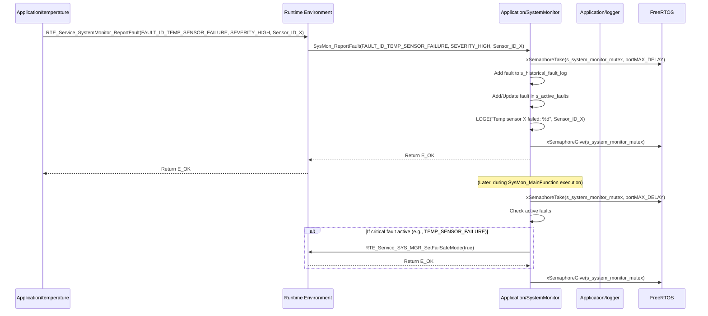

# **Detailed Design Document: SystemMonitor (Fault Manager) Component**

## **1. Introduction**

### **1.1. Purpose**

This document details the design of the SystemMonitor component. Its primary purpose is to act as the **central Fault Manager** for the Environmental Monitoring & Control System. It is responsible for receiving and storing fault reports from various modules, monitoring overall system health (CPU load, stack usage), and requesting corrective actions from systemMgr based on detected issues.

### **1.2. Scope**

The scope of this document covers the SystemMonitor module's architecture, functional behavior, interfaces, dependencies, and resource considerations. It details how SystemMonitor collects, categorizes, stores, and processes fault information, and how it interacts with other application modules and the Runtime Environment (RTE) to maintain system robustness and reliability.

### **1.3. References**

* Software Architecture Document (SAD) - Environmental Monitoring & Control System (Final Version)  
* Detailed Design Document: RTE  
* Detailed Design Document: systemMgr  
* Detailed Design Document: diagnostic  
* FreeRTOS Documentation

## **2. Functional Description**

The SystemMonitor component provides the following core functionalities:

1. **Initialization (SystemMonitor_Init)**: Initialize internal data structures for fault storage and system health metrics.  
2. **Report Fault (SysMon_ReportFault)**: Receive fault notifications from other modules, classify them by severity and domain, and record them in an internal fault log.  
3. **Periodic Monitoring (SysMon_MainFunction)**: This is the module's primary periodic function. It is responsible for:  
   * Calculating and monitoring CPU load.  
   * Monitoring FreeRTOS task stack High Water Marks (HWM).  
   * Periodically logging system health metrics.  
   * Evaluating active faults and system health against predefined thresholds.  
   * **Requesting corrective actions** from systemMgr (via RTE services) if critical faults or resource exhaustion are detected.  
4. **Get System Health Metrics (SysMon_GetCPULoad, SysMon_GetTotalMinFreeStack)**: Provide non-blocking interfaces to retrieve current CPU load and overall minimum free stack.  
5. **Get Fault Status (SysMon_GetFaultStatus)**: Provide a non-blocking interface for the diagnostic module to retrieve active and historical fault records.

## **3. Non-Functional Requirements**

### **3.1. Performance**

* **Responsiveness (Fault Reporting)**: SysMon_ReportFault shall be highly responsive and non-blocking to ensure immediate fault capture.  
* **Update Rate (Monitoring)**: SysMon_MainFunction shall execute frequently enough to provide timely monitoring of system health (defined by SysMon_MONITOR_PERIOD_MS).  
* **Efficiency**: CPU load and stack monitoring shall have minimal overhead on system performance.

### **3.2. Memory**

* **Fault Log Footprint**: The fault log shall have a configurable, bounded memory footprint to prevent excessive RAM usage.  
* **Metric Storage**: Minimal RAM usage for storing current CPU load and stack HWM.

### **3.3. Reliability**

* **Robustness**: The module shall be robust against invalid fault reports or unexpected system states.  
* **Data Integrity**: Fault records shall be stored reliably.  
* **Fail-Safe Integration**: Must reliably request systemMgr to enter fail-safe modes when critical faults occur.

## **4. Architectural Context**

As per the SAD (Section 3.1.2, Application Layer), SystemMonitor resides in the Application Layer. It acts as the central fault manager. Other application modules report faults to it via RTE services. SystemMonitor itself runs in a low-priority FreeRTOS task (SYS_MON_Task) and uses RTE services to communicate with systemMgr (for corrective actions) and diagnostic (for external reporting).

## **5. Design Details**

### **5.1. Module Structure**

The SystemMonitor component will consist of the following files:

* Application/SystemMonitor/inc/system_monitor.h: Public header file containing function prototypes, data types for faults, and system health metrics.  
* Application/SystemMonitor/src/system_monitor.c: Source file containing the implementation of SystemMonitor functions and its internal logic.  
* Application/SystemMonitor/cfg/system_monitor_cfg.h: Configuration header for fault IDs, severity levels, thresholds, and fault log size.

### **5.2. Public Interface (API)**

// In Application/SystemMonitor/inc/system_monitor.h
```c
#include "Application/common/inc/common.h" // For APP_Status_t  
#include <stdint.h>   // For uint32_t  
#include <stdbool.h>  // For bool

// --- Fault Definitions ---  
// Example Fault IDs (should be comprehensive in config file)  
typedef enum {  
    FAULT_ID_NONE = 0,  
    FAULT_ID_TEMP_SENSOR_FAILURE,  
    FAULT_ID_HUMIDITY_SENSOR_FAILURE,  
    FAULT_ID_FAN_CONTROL_FAILURE,  
    FAULT_ID_MODBUS_CRC_ERROR,  
    FAULT_ID_BT_INIT_FAILURE,  
    FAULT_ID_CPU_OVERLOAD,  
    FAULT_ID_STACK_OVERFLOW_RISK,  
    // Add more fault IDs as needed  
    FAULT_ID_COUNT  
} SystemMonitor_FaultId_t;

// Example Fault Severity  
typedef enum {  
    SEVERITY_NONE,  
    SEVERITY_LOW,      // Minor issue, informational  
    SEVERITY_MEDIUM,   // Non-critical, but requires attention  
    SEVERITY_HIGH,     // Critical, requires immediate action, might trigger fail-safe  
    SEVERITY_CRITICAL  // System-impacting, likely requires reboot or immediate shutdown  
} SystemMonitor_FaultSeverity_t;

// Structure for a single fault record  
typedef struct {  
    SystemMonitor_FaultId_t     id;  
    SystemMonitor_FaultSeverity_t severity;  
    uint32_t                    timestamp_ms; // Uptime when fault occurred  
    uint32_t                    data;         // Additional fault-specific data (e.g., sensor ID, error code)  
    bool                        is_active;    // True if fault is currently active  
} SystemMonitor_FaultRecord_t;

// Structure for overall fault status (for Diagnostic module)  
typedef struct {  
    uint32_t                      active_fault_count;  
    uint32_t                      historical_fault_count;  
    SystemMonitor_FaultRecord_t   active_faults[SysMon_MAX_ACTIVE_FAULTS];  
    // Note: Historical faults might be retrieved via an iterator or separate function  
} SystemMonitor_FaultStatus_t;

// --- Public Functions ---

/**  
 * @brief Initializes the SystemMonitor module.  
 * Clears fault logs and resets system health metrics.  
 * @return E_OK on success, E_NOK on failure.  
 */  
APP_Status_t SystemMonitor_Init(void);

/**  
 * @brief Reports a fault to the SystemMonitor.  
 * This function is called by other modules when they detect an error.  
 * @param fault_id The ID of the fault being reported.  
 * @param severity The severity level of the fault.  
 * @param data Optional data related to the fault (e.g., sensor ID, error code).  
 * @return E_OK on success, E_NOK if the fault could not be recorded.  
 */  
APP_Status_t SysMon_ReportFault(SystemMonitor_FaultId_t fault_id,  
                                       SystemMonitor_FaultSeverity_t severity,  
                                       uint32_t data);

/**  
 * @brief Performs periodic system health monitoring and fault evaluation.  
 * This function is intended to be called periodically by the SYS_MON_Task.  
 */  
void SysMon_MainFunction(void);

/**  
 * @brief Retrieves the current CPU load percentage.  
 * @return Current CPU load in percentage (0-100).  
 */  
uint8_t SysMon_GetCPULoad(void);

/**  
 * @brief Retrieves the total minimum free stack (High Water Mark) across all tasks.  
 * @return Total minimum free stack in bytes.  
 */  
uint32_t SysMon_GetTotalMinFreeStack(void);

/**  
 * @brief Retrieves the current fault status (active faults).  
 * This function is primarily for the Diagnostic module.  
 * @param status Pointer to a SystemMonitor_FaultStatus_t structure to fill.  
 * @return E_OK on success, E_NOK on failure (e.g., NULL pointer).  
 */  
APP_Status_t SysMon_GetFaultStatus(SystemMonitor_FaultStatus_t *status);
```
### **5.3. Internal Design**

The SystemMonitor module will maintain internal data structures for active and historical faults, and variables for system health metrics. It will use FreeRTOS APIs to gather raw CPU and stack data.

1. **Internal State**:  
   ```c
   // Circular buffer for historical faults  
   static SystemMonitor_FaultRecord_t s_historical_fault_log[SysMon_HISTORY_SIZE];  
   static uint32_t s_history_write_idx = 0;  
   static uint32_t s_history_count = 0;

   // Array for active faults (can be cleared/set)  
   static SystemMonitor_FaultRecord_t s_active_faults[SysMon_MAX_ACTIVE_FAULTS];  
   static uint32_t s_active_fault_count = 0;

   static uint8_t  s_current_cpu_load_percent = 0;  
   static uint32_t s_total_min_free_stack_bytes = 0;  
   static bool     s_is_initialized = false;

   // Mutex to protect access to internal fault logs and metrics  
   static SemaphoreHandle_t s_system_monitor_mutex;
   ```
   * SystemMonitor_Init() will initialize all these variables, create the mutex, and clear fault logs.  
2. **Initialization (SystemMonitor_Init)**:  
   * Create s_system_monitor_mutex. If creation fails, log a critical error and return E_NOK.  
   * Acquire mutex.  
   * Clear s_historical_fault_log and s_active_faults (e.g., set id to FAULT_ID_NONE).  
   * Reset s_history_write_idx, s_history_count, s_active_fault_count.  
   * Reset s_current_cpu_load_percent, s_total_min_free_stack_bytes.  
   * Release mutex.  
   * Set s_is_initialized = true;.  
   * Return E_OK.  
3. **Report Fault (SysMon_ReportFault)**:  
   * If !s_is_initialized, return E_NOK.  
   * Acquire s_system_monitor_mutex.  
   * Validate fault_id and severity.  
   * Create a new SystemMonitor_FaultRecord_t with provided details and APP_COMMON_GetUptimeMs(). Set is_active = true.  
   * **Add to Historical Log**: Add the new record to s_historical_fault_log (circular buffer logic).  
   * **Add to Active Faults**: Check if this fault id is already active. If not, add it to s_active_faults. If it is, update its timestamp and data. Handle SysMon_MAX_ACTIVE_FAULTS overflow (e.g., overwrite oldest active fault or return error).  
   * Log the fault using LOGE or LOGW based on severity.  
   * Release mutex.  
   * Return E_OK.  
4. **Periodic Monitoring (SysMon_MainFunction)**:  
   * If !s_is_initialized, return immediately.  
   * Acquire s_system_monitor_mutex.  
   * **CPU Load Calculation**: Use FreeRTOS API uxTaskGetSystemState() to get task statistics and calculate CPU load. Update s_current_cpu_load_percent.  
   * **Stack Usage Monitoring**: Iterate through all tasks (obtained via uxTaskGetSystemState()) and get their HWM using uxTaskGetStackHighWaterMark(). Calculate s_total_min_free_stack_bytes.  
   * **Threshold Evaluation**:  
     * If s_current_cpu_load_percent exceeds SysMon_CPU_LOAD_THRESHOLD_PERCENT, call SysMon_ReportFault(FAULT_ID_CPU_OVERLOAD, SEVERITY_MEDIUM, s_current_cpu_load_percent).  
     * If s_total_min_free_stack_bytes falls below SysMon_MIN_FREE_STACK_THRESHOLD_BYTES, call SysMon_ReportFault(FAULT_ID_STACK_OVERFLOW_RISK, SEVERITY_HIGH, s_total_min_free_stack_bytes).  
     * (Future) Evaluate active faults and their severity. If a critical fault (SEVERITY_HIGH or CRITICAL) is active, call RTE_Service_SYS_MGR_SetFailSafeMode(true) to request systemMgr to enter fail-safe.  
   * **Periodic Logging**: Log current CPU load and stack usage using LOGI.  
   * Release mutex.  
5. **Getters (SysMon_GetCPULoad, SysMon_GetTotalMinFreeStack, SysMon_GetFaultStatus)**:  
   * Acquire s_system_monitor_mutex.  
   * Return the requested internal state (s_current_cpu_load_percent, s_total_min_free_stack_bytes, or copy s_active_faults to status structure).  
   * Release mutex.  
   * For SysMon_GetFaultStatus, ensure the status pointer is not NULL before copying data.

**Sequence Diagram (Example: Module reports fault to SystemMonitor):**

### **5.4. Dependencies**

* Application/common/inc/common.h: For APP_Status_t, APP_COMMON_GetUptimeMs().  
* Application/logger/inc/logger.h: For logging system health and fault events.  
* Rte/inc/Rte.h: For calling RTE_Service_SYS_MGR_SetFailSafeMode() and for being called by other modules (RTE_Service_SystemMonitor_ReportFault(), RTE_Service_SystemMonitor_GetCPULoad(), etc.).  
* FreeRTOS headers (freertos/FreeRTOS.h, freertos/task.h, freertos/semphr.h): For task statistics, stack HWM, and mutex.

### **5.5. Error Handling**

* **Initialization Failure**: If mutex creation fails, SystemMonitor_Init will return E_NOK.  
* **Mutex Protection**: All access to internal state (s_historical_fault_log, s_active_faults, system metrics) is protected by s_system_monitor_mutex to ensure thread safety.  
* **Input Validation**: SysMon_ReportFault validates fault_id and severity. SysMon_GetFaultStatus validates the input pointer.  
* **Fault Log Overflow**: The historical fault log uses a circular buffer. The active fault log has a fixed size; if it overflows, older active faults might be overwritten or new faults might be rejected, depending on the chosen strategy (overwriting is generally preferred for continuous operation).  
* **Reporting to systemMgr**: SystemMonitor's primary "error handling" for critical issues is to report them to systemMgr via RTE, allowing systemMgr to take system-level corrective actions (e.g., fail-safe mode).

### **5.6. Configuration**

The Application/SystemMonitor/cfg/system_monitor_cfg.h file will contain:

* **Fault ID Definitions**: A comprehensive enum of all possible fault IDs in the system.  
* **Severity Mapping**: Potentially a table mapping fault IDs to default severities.  
* **Fault Log Sizes**:  
  * SysMon_HISTORY_SIZE: Maximum number of historical faults to store.  
  * SysMon_MAX_ACTIVE_FAULTS: Maximum number of concurrently active faults.  
* **Monitoring Thresholds**:  
  * SysMon_CPU_LOAD_THRESHOLD_PERCENT: CPU load percentage above which a fault is reported.  
  * SysMon_MIN_FREE_STACK_THRESHOLD_BYTES: Minimum free stack (HWM) below which a fault is reported.  
* **Periodic Task Settings**:  
  * SysMon_MONITOR_PERIOD_MS: The frequency at which SysMon_MainFunction() is called by SYS_MON_Task.

// Example: Application/SystemMonitor/cfg/system_monitor_cfg.h
```c
#ifndef SYSTEM_MONITOR_CFG_H  
#define SYSTEM_MONITOR_CFG_H

#include "Application/SystemMonitor/inc/system_monitor.h" // For SystemMonitor_FaultId_t

// --- Fault ID Definitions (Example Subset) ---  
// This enum should be extended to cover all possible faults in the system.  
// It's crucial for consistent fault identification across modules.  
typedef enum {  
    // General System Faults  
    FAULT_ID_SYS_INIT_ERROR = FAULT_ID_COUNT, // Start from previous count to avoid overlap  
    FAULT_ID_TASK_WATCHDOG_TIMEOUT,  
    FAULT_ID_NVM_WRITE_FAILURE,  
    FAULT_ID_NVM_READ_FAILURE,

    // Sensor Faults (reported by TempCtrl, HumCtrl, etc.)  
    FAULT_ID_TEMP_SENSOR_COMM_ERROR,  
    FAULT_ID_TEMP_SENSOR_OUT_OF_RANGE,  
    FAULT_ID_HUMIDITY_SENSOR_COMM_ERROR,  
    FAULT_ID_HUMIDITY_SENSOR_OUT_OF_RANGE,

    // Actuator Faults (reported by FanCtrl, HeatCtrl, PumpCtrl, VentCtrl, LightCtrl)  
    FAULT_ID_FAN_CONTROL_COMM_ERROR,  
    FAULT_ID_FAN_FEEDBACK_MISMATCH,  
    FAULT_ID_HEATER_CONTROL_COMM_ERROR,  
    FAULT_ID_HEATER_FEEDBACK_MISMATCH,  
    FAULT_ID_PUMP_CONTROL_COMM_ERROR,  
    FAULT_ID_PUMP_FEEDBACK_MISMATCH,  
    FAULT_ID_VENT_CONTROL_COMM_ERROR,  
    FAULT_ID_VENT_FEEDBACK_MISMATCH,  
    FAULT_ID_LIGHT_CONTROL_COMM_ERROR,  
    FAULT_ID_LIGHT_FEEDBACK_MISMATCH,

    // Communication Faults (reported by ComM, HAL/Modbus, HAL/Bluetooth, HAL/Wifi)  
    FAULT_ID_MODBUS_COMM_ERROR,  
    FAULT_ID_MODBUS_CRC_ERROR,  
    FAULT_ID_BLUETOOTH_COMM_ERROR,  
    FAULT_ID_BLUETOOTH_AUTH_FAILED,  
    FAULT_ID_WIFI_CONN_FAILED,  
    FAULT_ID_WIFI_NO_IP,

    // Power Management Faults (reported by Power module)  
    FAULT_ID_POWER_OVER_CURRENT,  
    FAULT_ID_POWER_UNDER_VOLTAGE,

    // Diagnostic/OTA Faults  
    FAULT_ID_OTA_DOWNLOAD_FAILED,  
    FAULT_ID_OTA_INTEGRITY_CHECK_FAILED,

    // System Health Faults (reported by SystemMonitor itself)  
    FAULT_ID_CPU_OVERLOAD_PERSISTENT,  
    FAULT_ID_STACK_OVERFLOW_RISK_PERSISTENT,

    // Total count of defined faults  
    SysMon_TOTAL_FAULT_IDS  
} SystemMonitor_ConfiguredFaultId_t;

// --- Fault Log Sizes ---  
#define SysMon_HISTORY_SIZE          50   // Number of historical fault records  
#define SysMon_MAX_ACTIVE_FAULTS     10   // Max concurrent active faults

// --- Monitoring Thresholds ---  
#define SysMon_CPU_LOAD_THRESHOLD_PERCENT         85  // % CPU load  
#define SysMon_MIN_FREE_STACK_THRESHOLD_BYTES     512 // Bytes

// --- Periodic Task Settings ---  
#define SysMon_MONITOR_PERIOD_MS                  5000 // 5 seconds

#endif // SYSTEM_MONITOR_CFG_H
```
### **5.7. Resource Usage**

* **Flash**: Low to moderate, depending on the size of the fault ID enum and configuration.  
* **RAM**: Moderate, primarily for s_historical_fault_log and s_active_faults arrays, proportional to SysMon_HISTORY_SIZE and SysMon_MAX_ACTIVE_FAULTS.  
* **CPU**: Low, as SysMon_MainFunction is typically a low-priority task and its calculations are not computationally intensive. Mutex operations add minimal overhead.

## **6. Test Considerations**

### **6.1. Unit Testing**

* **Mock Dependencies**: Unit tests for SystemMonitor will mock FreeRTOS APIs (uxTaskGetSystemState, uxTaskGetStackHighWaterMark, mutex functions), APP_COMMON_GetUptimeMs(), LOGGER_Log(), and RTE_Service_SYS_MGR_SetFailSafeMode().  
* **Test Cases**:  
  * SystemMonitor_Init: Verify mutex creation, log clearing, and variable initialization. Test initialization failure.  
  * SysMon_ReportFault:  
    * Test reporting various fault IDs, severities, and data. Verify correct recording in historical and active logs.  
    * Test adding duplicate active faults (should update timestamp/data, not add new entry).  
    * Test active fault log overflow (verify behavior, e.g., oldest overwritten).  
    * Verify LOGGER_Log() is called with appropriate severity.  
    * Test with invalid fault_id or severity.  
  * SysMon_MainFunction:  
    * Mock FreeRTOS APIs to simulate various CPU loads and stack usages. Verify s_current_cpu_load_percent and s_total_min_free_stack_bytes are updated correctly.  
    * Test when CPU load/stack usage exceeds thresholds. Verify SysMon_ReportFault is called for FAULT_ID_CPU_OVERLOAD or FAULT_ID_STACK_OVERFLOW_RISK.  
    * Test when a critical fault is active in s_active_faults. Verify RTE_Service_SYS_MGR_SetFailSafeMode(true) is called.  
    * Verify periodic logging.  
  * SysMon_GetCPULoad, SysMon_GetTotalMinFreeStack: Verify they return the latest calculated values.  
  * SysMon_GetFaultStatus: Test retrieving active faults. Verify correct data is copied. Test with NULL input pointer.

### **6.2. Integration Testing**

* **Fault Reporting Integration**: Integrate SystemMonitor with other application modules (e.g., temperature, fan, ComM) and verify that they correctly report faults to SystemMonitor via RTE services.  
* **systemMgr Interaction**: Verify that SystemMonitor correctly requests systemMgr to enter fail-safe mode when critical faults are active.  
* **diagnostic Integration**: Verify that diagnostic can successfully query and retrieve fault information from SystemMonitor.  
* **Resource Monitoring**: Run the system under various loads (stress CPU, consume stack) and verify that SystemMonitor accurately detects and reports CPU overload and stack risks.

### **6.3. System Testing**

* **End-to-End Fault Handling**: Introduce physical faults (e.g., disconnect a sensor, short an actuator output if safe) and verify the entire fault handling chain: detection by module -> reporting to SystemMonitor -> SystemMonitor requesting systemMgr action -> systemMgr entering fail-safe -> diagnostic reporting fault externally.  
* **Long-Term Reliability**: Run the system for extended periods, observing the fault log and system health metrics for any unexpected behavior or resource leaks.  
* **Watchdog Interaction**: Ensure that SystemMonitor's tasks do not cause watchdog resets and that its monitoring capabilities are robust even during system stress.