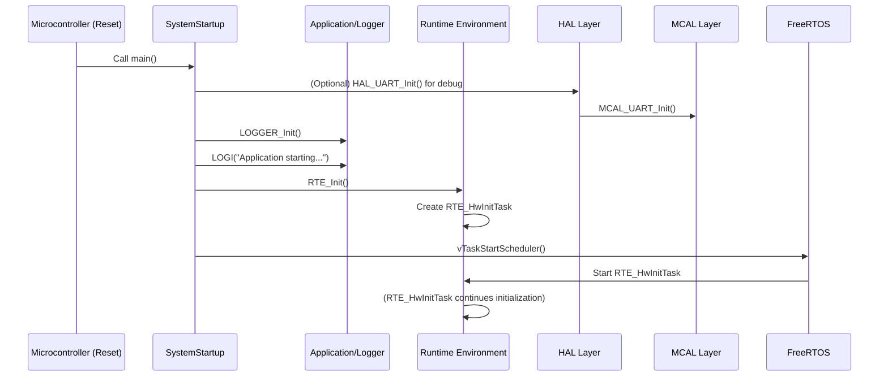

# Detailed Design Document: SystemStartup Component

## 1. Introduction

### 1.1. Purpose
This document details the design of the SystemStartup component, which serves as the absolute entry point for the Environmental Monitoring & Control System firmware. Its primary purpose is to perform essential initializations and seamlessly transition control to the Runtime Environment (RTE) to begin the FreeRTOS task scheduling.

### 1.2. Scope
The scope of this document covers the SystemStartup module's architecture, functional behavior, interfaces, dependencies, and resource considerations. It details the sequence of operations from the microcontroller's reset vector to the start of the FreeRTOS scheduler.

### 1.3. References
- Software Architecture Document (SAD) - Environmental Monitoring & Control System (Final Version)
- FreeRTOS Documentation
- ESP-IDF Programming Guide (or equivalent MCU SDK documentation)

## 2. Functional Description
The SystemStartup component is responsible for the very first steps of the firmware execution after the microcontroller reset. Its core functions are:

- **Minimal Hardware Initialization**: Initialize only the most essential hardware peripherals required for early system operation, primarily for logging capabilities.
- **Logger Initialization**: Bring up the system's logging mechanism to enable early debug output.
- **RTE Initialization**: Call the `RTE_Init()` function, which is responsible for creating the initial hardware initialization task (`RTE_HwInitTask`).
- **Scheduler Start**: Initiate the FreeRTOS scheduler, transferring control to the operating system to manage subsequent tasks.

## 3. Non-Functional Requirements

### 3.1. Performance
- **Startup Time**: The SystemStartup sequence shall complete as quickly as possible to minimize overall system boot time.
- **Deterministic Execution**: The execution flow shall be deterministic, ensuring consistent startup behavior.

### 3.2. Memory
- **Minimal Footprint**: The SystemStartup code and data shall have a minimal memory footprint (Flash and RAM), as it runs before the full memory management setup.

### 3.3. Reliability
- **Robustness**: The startup sequence shall be robust against unexpected conditions, ensuring a consistent boot process.
- **Error Handling**: Critical errors during startup (e.g., logger initialization failure) should be handled gracefully, potentially leading to a system reset or a defined error state.

## 4. Architectural Context
As per the SAD (Section 3.1.2, Application Layer), SystemStartup is an Application Layer module. It is the first software component to execute. It directly interacts with the RTE layer to initiate the task scheduling and indirectly with MCAL for basic hardware setup and Application/logger for logging.

## 5. Design Details

### 5.1. Module Structure
The SystemStartup component will consist of the following files:

- `Application/SystemStartup/inc/startup.h`: Header file for any public interfaces (though typically minimal for this module).
- `Application/SystemStartup/src/startup.c`: Source file containing the `main()` function (or equivalent entry point) and the startup logic.

### 5.2. Public Interface (API)
Typically, SystemStartup does not expose a public API for other modules to call, as it is the system's entry point. The main entry function, usually `main()` for ESP-IDF, is called by the underlying SDK/bootloader.

```c
// In Application/SystemStartup/src/startup.c (main entry point)
void main(void); // Or equivalent, depending on SDK
```

### 5.3. Internal Design
The `main()` function will implement the following sequential logic:

#### Early Hardware Setup (Optional/Minimal):
If the MCU SDK requires very early, non-FreeRTOS-dependent setup for a basic peripheral like UART for logging, it will be performed here. This might involve a call to a HAL function that encapsulates MCAL calls.

Example:
```c
HAL_UART_Init(UART_DEBUG_PORT, BAUD_RATE_115200);
```

#### Logger Initialization:
Initialize the Application/logger module. This makes `LOGI`, `LOGE`, etc., available for subsequent startup messages.

Call:
```c
LOGGER_Init();
```

#### Log Startup Message:
Output a message indicating the start of the application.

Example:
```c
LOGI("SystemStartup", "Application starting...");
```

#### RTE Initialization:
Call the `RTE_Init()` function. As per SAD, `RTE_Init()` is responsible for creating `RTE_HwInitTask`, which will then handle further hardware and application initialization in a FreeRTOS context.

Call:
```c
RTE_Init();
```

#### Start FreeRTOS Scheduler:
This is the final step in `main()`. After this call, FreeRTOS takes over, and tasks (starting with `RTE_HwInitTask`) begin executing according to their priorities.

Call:
```c
vTaskStartScheduler(); // This function typically does not return.
```

#### Sequence Diagram



### 5.4. Dependencies
- `Rte/inc/Rte.h`: For calling `RTE_Init()`.
- `Application/logger/inc/logger.h`: For initializing the logger.
- `HAL/inc/hal_uart.h` (or similar): For minimal early UART initialization (if required by the specific MCU/SDK before FreeRTOS).
- FreeRTOS headers: For `vTaskStartScheduler()`.

### 5.5. Error Handling
Minimal Error Handling: Given its very early execution context, SystemStartup has limited error handling capabilities.

- **Logger Availability**: The primary error handling mechanism is to ensure the logger is initialized as early as possible so that any subsequent failures can be logged.
- **Fatal Errors**: If `LOGGER_Init()` or `RTE_Init()` fails, the system may enter an infinite loop, perform a software reset, or halt, depending on the underlying SDK's default behavior for unhandled exceptions. Explicit error checks and infinite loops could be added for critical failures:

```c
if (LOGGER_Init() != APP_OK) { while(1); }
```

### 5.6. Configuration
SystemStartup typically has no external configuration parameters. Its behavior is fixed.

### 5.7. Resource Usage
- **Flash**: Minimal, primarily for the `main()` function code.
- **RAM**: Minimal stack space for `main()` before the scheduler starts.
- **CPU**: Executes sequentially and quickly once at boot.

## 6. Test Considerations

### 6.1. Unit Testing
- **Limited Unit Testing**: Due to its nature as the system entry point, SystemStartup is difficult to unit test in isolation using traditional methods.
- **Focus on Integration**: Testing primarily occurs during integration and system testing.

### 6.2. Integration Testing
- **Successful Boot**: Verify that the system boots successfully, logs the startup message, and the initial FreeRTOS tasks (starting with `RTE_HwInitTask`) are created and begin execution.
- **Early Logging**: Confirm that logging works correctly immediately after `LOGGER_Init()`.
- **Scheduler Start**: Verify that `vTaskStartScheduler()` is called and the system transitions to a multi-tasking environment.

### 6.3. System Testing
- **Full System Boot**: Verify the complete boot sequence, including all hardware and software initialization, leading to a fully operational system.
- **Reset Behavior**: Test system behavior after various reset sources (power-on reset, software reset, watchdog reset).
