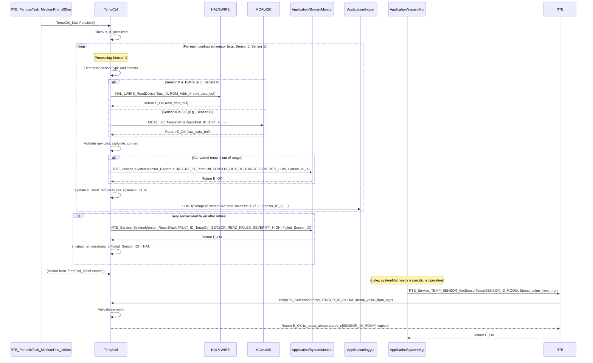

# **Detailed Design Document: TempCtrl (Temperature Control) Component**

## **1. Introduction**

### **1.1. Purpose**

This document details the design of the TempCtrl component. Its primary purpose is to provide a high-level interface for acquiring temperature data from multiple temperature sensors. It abstracts the complexities of the underlying analog (ADC) or digital (I2C, SPI, 1-Wire, or custom GPIO protocol) sensor drivers. This module is designed to **periodically read all configured sensors, process their data, and maintain the latest valid temperature internally for each sensor**, allowing other modules like systemMgr to simply request these readily available, up-to-date values by specifying a sensorId.

### **1.2. Scope**

The scope of this document covers the TempCtrl module's architecture, functional behavior, interfaces, dependencies, and resource considerations. It details how TempCtrl manages its own periodic sensor reads for multiple sensors and provides the latest temperature values to modules like systemMgr (via RTE services).

### **1.3. References**

* Software Architecture Document (SAD) - Smart Device Firmware (Final Version)  
* Detailed Design Document: RTE  
* Detailed Design Document: MCAL_ADC (if analog temperature sensor)  
* Detailed Design Document: MCAL_I2C (if I2C temperature sensor)  
* Detailed Design Document: MCAL_SPI (if SPI temperature sensor)  
* Detailed Design Document: MCAL_GPIO (if custom digital protocol or NTC with external ADC)  
* Detailed Design Document: HAL_1WIRE (if 1-Wire sensors like DS18B20 are used)  
* Temperature Sensor Datasheet (e.g., NTC, DS18B20, LM35, PT100, K-type thermocouple)

## **2. Functional Description**

The TempCtrl component provides the following core functionalities:

1. **Initialization (TempCtrl_Init)**: Initialize all configured sensor communication interfaces and perform any sensor-specific power-up or configuration sequences. **All module internal variables, including the storage for sensor readings, shall be initialized to safe default values (e.g., zeroes or NaN for floating-point values).**  
2. **Periodic Sensor Read & Update (TempCtrl_MainFunction)**: This is the module's primary periodic function. It is responsible for:  
   * Iterating through all configured temperature sensors.  
   * Acquiring the current temperature value from each sensor.  
   * Performing raw data validation, calibration, and conversion to Celsius for each reading.  
   * Storing the **latest valid temperature reading** in an internal array, indexed by sensorId.  
   * Implementing retry logic for transient sensor read failures for each sensor.  
   * Reporting faults to SystemMonitor (including the sensorId) if reads consistently fail or are out of range.  
3. **Get Latest Temperature (TempCtrl_GetSensorTemp)**: Provide a non-blocking interface to retrieve the last successfully read and stored temperature value for a specific sensorId.  
4. **Error Reporting**: Detect and report any failures during sensor communication or data acquisition (e.g., sensor not responding, CRC error, out-of-range reading) to the SystemMonitor via RTE_Service_SystemMonitor_ReportFault().

## **3. Non-Functional Requirements**

### **3.1. Performance**

* **Accuracy**: Temperature measurements shall be accurate within specified tolerances (refer to HwReqirement.md).  
* **Update Rate**: The TempCtrl_MainFunction should execute frequently enough to provide fresh data for the control loop (defined by TEMPCTRL_READ_PERIOD_MS).  
* **Responsiveness (Getter)**: The TempCtrl_GetSensorTemp() function shall be non-blocking and return immediately, as it only retrieves an already stored value.

### **3.2. Memory**

* **Minimal Footprint**: The TempCtrl module shall have a minimal memory footprint, considering the number of configured sensors.

### **3.3. Reliability**

* **Robustness**: The module shall be robust against sensor communication errors or invalid readings.  
* **Data Validity**: Implement checks for out-of-range or obviously erroneous sensor data.  
* **Retry Mechanism**: Implement a retry mechanism for transient sensor read failures.

## **4. Architectural Context**

As per the SAD (Section 3.1.2, Application Layer), TempCtrl resides in the Application Layer. It manages its own sensor reading process via its TempCtrl_MainFunction, which is called periodically by a generic RTE periodic task (e.g., RTE_PeriodicTask_MediumPrio_100ms). Other modules, such as systemMgr, will then query TempCtrl using TempCtrl_GetSensorTemp(sensorId) to obtain the latest available temperature data for a specific sensor.

## **5. Design Details**

### **5.1. Module Structure**

The TempCtrl component will consist of the following files:

* Application/tempctrl/inc/tempctrl.h: Public header file containing function prototypes and temperature-specific definitions.  
* Application/tempctrl/src/tempctrl.c: Source file containing the implementation of temperature sensor reading logic and the internal periodic update function.  
* Application/tempctrl/cfg/tempctrl_cfg.h: Configuration header for sensor types, communication interface details (e.g., ADC channels, I2C addresses, 1-Wire bus IDs), calibration parameters, and periodic read settings.

### **5.2. Public Interface (API)**

// In Application/tempctrl/inc/tempctrl.h
```c
#include "Application/common/inc/common.h" 
// For APP_Status_t  
#include <stdint.h> // For uint32_t  
#include <stdbool.h> // For bool

// --- Public Functions ---

/**  
 * @brief Initializes the TempCtrl module and all configured temperature sensor hardware.  
 * All module-internal variables and sensor data storage are initialized to a safe,  
 * known state (e.g., zeroes or NaN).  
 * @return E_OK on success, E_NOK on failure.  
 */  
APP_Status_t TempCtrl_Init(void);

/**  
 * @brief Gets the last successfully read and stored temperature value for a specific sensor.  
 * This is a non-blocking getter function. The actual sensor reading for all sensors is  
 * performed periodically by the internal TempCtrl_MainFunction.  
 * @param sensorId The unique ID of the sensor to retrieve data from.  
 * @param temperature_c Pointer to store the latest temperature value in Celsius.  
 * @return E_OK on successful retrieval, E_NOK if the sensorId is invalid,  
 * the pointer is NULL, or no valid data is available for that sensor.  
 */  
APP_Status_t TempCtrl_GetSensorTemp(uint32_t sensorId, float *temperature_c);

// --- Internal Periodic Runnable Prototype (called by RTE) ---  
// This function is declared here so RTE can call it.  
/**  
 * @brief Performs the periodic temperature sensor reading, validation, and internal data update  
 * for all configured sensors. This function is intended to be called periodically by an RTE task.  
 */  
void TempCtrl_MainFunction(void);
```

### **5.3. Internal Design**

The TempCtrl module will manage its own sensor reading cycle for multiple sensors.

1. **Internal State**:  
```c
   // Array to store the latest valid temperature reading for each sensor  
   static float s_latest_temperatures_c[TempCtrl_SENSOR_COUNT];  
   // Array to store the timestamp of the last successful read for each sensor  
   static uint32_t s_last_read_timestamps_ms[TempCtrl_SENSOR_COUNT];  
   static bool s_is_initialized = false; // Module initialization status
```
   * All these variables will be initialized in TempCtrl_Init(). s_latest_temperatures_c elements will be initialized to NAN (Not a Number) or a specific error value to indicate no valid data yet.  
2. **Initialization (TempCtrl_Init)**:  
   * **Zeroing Variables**:  
     * Initialize all elements of s_latest_temperatures_c to NAN.  
     * Initialize all elements of s_last_read_timestamps_ms to 0.  
     * s_is_initialized = false;.  
   * **Communication Interface Init (for each configured sensor)**:  
     * Iterate through tempctrl_sensor_configs array (defined in tempctrl_cfg.h).  
     * For each sensor_config:  
       * Based on sensor_config.type:  
         * If TempCtrl_SENSOR_TYPE_ANALOG_ADC: Call MCAL_ADC_Init() for the sensor_config.adc_channel.  
         * If TempCtrl_SENSOR_TYPE_I2C: Call MCAL_I2C_Init() for the sensor_config.i2c_port and sensor_config.i2c_address.  
         * If TempCtrl_SENSOR_TYPE_1WIRE_DS18B20: Call HAL_1WIRE_Init() for the sensor_config.one_wire_bus_id.  
       * Perform any sensor-specific power-up or configuration.  
       * If any underlying MCAL/HAL initialization fails, report FAULT_ID_TempCtrl_SENSOR_INIT_FAILED to SystemMonitor with sensor_config.id as data. Log an error.  
   * s_is_initialized = true; on overall success.  
   * Return E_OK.  
3. **Periodic Sensor Read & Update (TempCtrl_MainFunction)**:  
   * This function is called periodically by a generic RTE task (e.g., RTE_PeriodicTask_MediumPrio_100ms).  
   * If !s_is_initialized, return immediately.  
   * **Iterate through all configured sensors**:  
     * For each sensor_config in tempctrl_sensor_configs:  
       * Implement a retry loop (TempCtrl_READ_RETRIES times).  
       * Inside the loop:  
         * **Read Raw Data based on sensor_config.type**:  
           * Call appropriate MCAL/HAL function using sensor_config details.  
         * **Data Validation and CRC**: Check for valid sensor response, and if applicable, verify CRC.  
         * If data is valid:  
           * **Calibration and Conversion**: Apply calibration factors from sensor_config to convert raw data into Celsius.  
           * **Range Check**: If the converted temperature is outside TempCtrl_MIN_VALID_C or TempCtrl_MAX_VALID_C (defined in config), report FAULT_ID_TempCtrl_SENSOR_OUT_OF_RANGE to SystemMonitor with sensor_config.id as data (severity LOW). The value can optionally be clamped or the read considered invalid.  
           * Update s_latest_temperatures_c[sensor_config.id] with the new valid reading.  
           * Update s_last_read_timestamps_ms[sensor_config.id] = APP_COMMON_GetUptimeMs().  
           * Log LOGD("TempCtrl sensor %d read success: %.1f C", sensor_config.id, s_latest_temperatures_c[sensor_config.id]);  
           * Break retry loop for this sensor.  
         * If data is invalid or CRC fails, increment retry counter and continue loop. Log a warning LOGW("TempCtrl sensor %d read failed, retry %d", sensor_config.id, retry_count);.  
       * If all retries for this sensor fail:  
         * Report FAULT_ID_TempCtrl_SENSOR_READ_FAILED to SystemMonitor with sensor_config.id as data (severity HIGH).  
         * Set s_latest_temperatures_c[sensor_config.id] = NAN; to indicate no valid data.  
4. **Get Latest Temperature (TempCtrl_GetSensorTemp)**:  
   * Validate temperature_c pointer. If NULL, return E_NOK and log a warning.  
   * Validate sensorId. If sensorId >= TempCtrl_SENSOR_COUNT, return E_NOK and log a warning.  
   * Copy s_latest_temperatures_c[sensorId] to *temperature_c.  
   * Return E_OK.

**Sequence Diagram (Example: Periodic Temperature Reading for Multiple Sensors and systemMgr Query):**

### **5.4. Dependencies**

* **Application/common/inc/common.h**: For APP_Status_t, APP_COMMON_GetUptimeMs().  
* **Application/logger/inc/logger.h**: For logging sensor errors and warnings.  
* **Application/SystemMonitor/inc/system_monitor.h**: For SystemMonitor_FaultId_t (e.g., FAULT_ID_TempCtrl_SENSOR_INIT_FAILED, FAULT_ID_TempCtrl_SENSOR_READ_FAILED, FAULT_ID_TempCtrl_SENSOR_OUT_OF_RANGE).  
* **Rte/inc/Rte.h**: For calling RTE_Service_SystemMonitor_ReportFault().  
* **Mcal/adc/inc/mcal_adc.h**: If using an analog temperature sensor.  
* **Mcal/i2c/inc/mcal_i2c.h**: If using an I2C temperature sensor.  
* **Mcal/spi/inc/mcal_spi.h**: If using an SPI temperature sensor.  
* **Mcal/gpio/inc/mcal_gpio.h**: If using custom digital protocol.  
* **HAL/1wire/inc/hal_1wire.h**: If using 1-Wire sensors like DS18B20.  
* **Service/os/inc/service_os.h**: For delays (SERVICE_OS_DelayMs, SERVICE_OS_DelayUs) needed for some protocols.  
* <math.h> for NAN (Not a Number) if used for s_latest_temperatures_c initialization.

### **5.5. Error Handling**

* **Initialization Failure**: If underlying MCAL/HAL initialization for any sensor fails, FAULT_ID_TempCtrl_SENSOR_INIT_FAILED is reported to SystemMonitor with the sensorId.  
* **Communication/Read Failure**: If a sensor's communication fails or returns invalid data after retries in TempCtrl_MainFunction(), FAULT_ID_TempCtrl_SENSOR_READ_FAILED is reported to SystemMonitor with the sensorId. The corresponding s_latest_temperatures_c[sensorId] will be set to NAN to indicate invalid data.  
* **Data Out of Range**: If the converted temperature value is outside the configured valid range, FAULT_ID_TempCtrl_SENSOR_OUT_OF_RANGE is reported to SystemMonitor with the sensorId.  
* **Input Validation**: TempCtrl_GetSensorTemp validates its sensorId and output pointer to prevent invalid access or NULL dereferences.  
* **Retry Logic**: The internal retry mechanism helps mitigate transient communication issues for each sensor independently.

### **5.6. Configuration**

The Application/tempctrl/cfg/tempctrl_cfg.h file will contain:

* **Sensor Count**: TempCtrl_SENSOR_COUNT.  
* **Sensor IDs**: Define unique enum values for each sensor (e.g., TempCtrl_SENSOR_ID_ROOM, TempCtrl_SENSOR_ID_OUTDOOR).  
* **Sensor Configuration Array**: An array of TempCtrl_SensorConfig_t structures, defining each sensor's properties:  
  * id: Unique sensorId.  
  * type: TempCtrl_SENSOR_TYPE_ANALOG_ADC, TempCtrl_SENSOR_TYPE_I2C, TempCtrl_SENSOR_TYPE_1WIRE_DS18B20, etc.  
  * comm_details: Union or struct containing specific communication parameters (e.g., adc_channel, i2c_port, i2c_address, one_wire_bus_id, ds18b20_rom_address).  
  * calibration_slope, calibration_offset: For converting raw readings.  
  * read_delay_ms: Sensor-specific conversion time or delay.  
* **Periodic Read Settings**:  
  * TempCtrl_READ_PERIOD_MS: The frequency at which TempCtrl_MainFunction() is called by RTE.  
  * TempCtrl_READ_RETRIES: Number of times to retry a read on failure per sensor.  
  * TempCtrl_READ_RETRY_DELAY_MS: Delay between retries.  
* **Valid Data Range**: TempCtrl_MIN_VALID_C, TempCtrl_MAX_VALID_C for sanity checks.

// Example: Application/tempctrl/cfg/tempctrl_cfg.h
```c
#include "Mcal/adc/inc/mcal_adc.h" // Example for ADC channel definitions  
#include "Mcal/i2c/inc/mcal_i2c.h" // Example for I2C port definitions  
#include "HAL/1wire/inc/hal_1wire.h" // Example for 1-Wire bus definitions

// --- Sensor Type Enums ---  
typedef enum {  
    TempCtrl_SENSOR_TYPE_ANALOG_ADC,  
    TempCtrl_SENSOR_TYPE_I2C,  
    TempCtrl_SENSOR_TYPE_1WIRE_DS18B20  
    // Add more types as needed  
} TempCtrl_SensorType_t;

// --- Sensor Communication Details Union ---  
// This union allows storing specific communication parameters for each sensor type  
typedef union {  
    struct {  
        uint8_t adc_channel;  
    } analog_adc;  
    struct {  
        uint8_t i2c_port;  
        uint8_t i2c_address;  
    } i2c;  
    struct {  
        uint8_t one_wire_bus_id;  
        uint8_t ds18b20_rom_address[8]; // Unique ROM address for DS18B20  
    } one_wire;  
    // Add more structs for other sensor types  
} TempCtrl_SensorCommDetails_t;

// --- Sensor Configuration Structure ---  
typedef struct {  
    uint32_t id; // Unique ID for this sensor instance  
    TempCtrl_SensorType_t type;  
    TempCtrl_SensorCommDetails_t comm_details;  
    float calibration_slope;  
    float calibration_offset;  
    uint32_t read_delay_ms; // Sensor-specific conversion time or delay  
} TempCtrl_SensorConfig_t;

// --- Sensor IDs ---  
typedef enum {  
    TempCtrl_SENSOR_ID_ROOM = 0,  
    TempCtrl_SENSOR_ID_OUTDOOR,  
    TempCtrl_SENSOR_ID_HEATER_EXHAUST,  
    // Add more sensor IDs as needed  
    TempCtrl_SENSOR_COUNT // Total number of configured sensors  
} TempCtrl_SensorId_t;

// --- Array of Sensor Configurations ---  
const TempCtrl_SensorConfig_t tempctrl_sensor_configs[TempCtrl_SENSOR_COUNT] = {  
    {  
        .id = TempCtrl_SENSOR_ID_ROOM,  
        .type = TempCtrl_SENSOR_TYPE_1WIRE_DS18B20,  
        .comm_details.one_wire = {  
            .one_wire_bus_id = HAL_1WIRE_BUS_0,  
            .ds18b20_rom_address = {0x28, 0xAA, 0xBB, 0xCC, 0xDD, 0xEE, 0xFF, 0x01}  
        },  
        .calibration_slope = 1.0f,  
        .calibration_offset = 0.0f,  
        .read_delay_ms = 750 // Max conversion time for DS18B20  
    },  
    {  
        .id = TempCtrl_SENSOR_ID_OUTDOOR,  
        .type = TempCtrl_SENSOR_TYPE_I2C,  
        .comm_details.i2c = {  
            .i2c_port = MCAL_I2C_PORT_0,  
            .i2c_address = 0x48 // Example for TMP102  
        },  
        .calibration_slope = 1.0f,  
        .calibration_offset = 0.0f,  
        .read_delay_ms = 100 // Example read delay for I2C sensor  
    },  
    // Add more sensor configurations here  
};

// --- Periodic Read Settings for TempCtrl_MainFunction() ---  
#define TempCtrl_READ_PERIOD_MS             1000 // TempCtrl_MainFunction called every 1 second  
#define TempCtrl_READ_RETRIES               3    // Number of times to retry a read on failure per sensor  
#define TempCtrl_READ_RETRY_DELAY_MS        100  // Delay between retries (if sensor allows)

// --- Valid temperature range for sanity checks ---  
#define TempCtrl_MIN_VALID_C                -20.0f  
#define TempCtrl_MAX_VALID_C                100.0f
```

### **5.7. Resource Usage**

* **Flash**: Low to moderate, depending on the complexity of the sensor protocols and number of sensor types supported.  
* **RAM**: Low, for internal state arrays (s_latest_temperatures_c, s_last_read_timestamps_ms) proportional to TempCtrl_SENSOR_COUNT, and temporary read buffers.  
* **CPU**: Low to moderate, depending on sensor types and TempCtrl_READ_PERIOD_MS. The periodic nature ensures CPU usage is spread out.

## **6. Test Considerations**

### **6.1. Unit Testing**

* **Mock Dependencies**: Unit tests for TempCtrl will mock MCAL_ADC_Read(), MCAL_I2C_MasterWriteRead(), HAL_1WIRE_ReadDevice(), SERVICE_OS_DelayMs(), APP_COMMON_GetUptimeMs(), and RTE_Service_SystemMonitor_ReportFault().  
* **Test Cases**:  
  * TempCtrl_Init: Verify correct MCAL/HAL initialization calls for all configured sensors. Test initialization failure and fault reporting per sensor. Verify internal variables are initialized (e.g., s_latest_temperatures_c elements to NAN).  
  * TempCtrl_MainFunction:  
    * Test successful reads for all configured sensors: Mock raw data to simulate various temperatures. Verify correct conversion, update of s_latest_temperatures_c[sensorId], and s_last_read_timestamps_ms[sensorId] for each.  
    * Test read failures for individual sensors: Mock MCAL/HAL calls to return errors or invalid data for specific sensorIds. Verify retry logic, LOGW messages, and FAULT_ID_TempCtrl_SENSOR_READ_FAILED after all retries for that sensor. Verify s_latest_temperatures_c[sensorId] is set to NAN.  
    * Test CRC errors (for digital sensors like DS18B20).  
    * Test out-of-range raw data and verify FAULT_ID_TempCtrl_SENSOR_OUT_OF_RANGE is reported for the specific sensorId.  
  * TempCtrl_GetSensorTemp:  
    * Test after successful TempCtrl_MainFunction(): Verify it returns the last updated value for the specified sensorId.  
    * Test before any TempCtrl_MainFunction() or after a specific sensor's TempCtrl_MainFunction() failed: Verify it returns NAN (or appropriate error value) for that sensorId.  
    * Test with invalid sensorId (out of range).  
    * Test with NULL temperature_c pointer.

### **6.2. Integration Testing**

* **TempCtrl-MCAL/HAL Integration**: Verify that TempCtrl correctly interfaces with the actual MCAL/HAL drivers and all physical temperature sensors.  
* **Accuracy Verification**: Compare TempCtrl's reported values (via TempCtrl_GetSensorTemp()) with calibrated external thermometers for each sensor.  
* **RTE Integration**: Verify that TempCtrl_MainFunction() is called periodically by the configured RTE task.  
* **SystemMgr Integration**: Verify that systemMgr correctly retrieves and uses the latest temperature data from TempCtrl via TempCtrl_GetSensorTemp(sensorId).  
* **Fault Injection**: Disconnect individual temperature sensors, or introduce noise on their communication lines, and verify that TempCtrl reports FAULT_ID_TempCtrl_SENSOR_READ_FAILED to SystemMonitor for the specific sensor and its s_latest_temperatures_c[sensorId] becomes NAN.

### **6.3. System Testing**

* **End-to-End Control Loop**: Verify that the system's overall control loop (sensor read -> systemMgr logic -> actuator control) functions correctly based on temperature readings from all relevant sensors.  
* **Environmental Chambers**: Test the system in controlled temperature environments (e.g., climate chamber) to verify performance across the operating range of all sensors.  
* **Long-Term Reliability**: Run the system for extended periods to ensure continuous and reliable temperature monitoring from all sensors, observing fault reports and data validity.