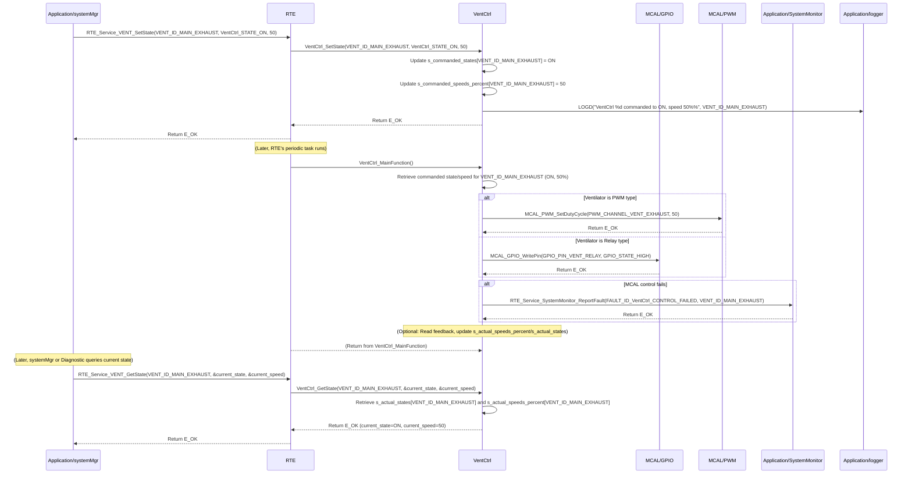

# **Detailed Design Document: VentCtrl (Ventilator Control) Component**

## **1. Introduction**

### **1.1. Purpose**

This document details the design of the VentCtrl component. Its primary purpose is to provide a high-level interface for controlling and monitoring ventilation systems within the smart device. This typically involves controlling relays for ON/OFF operation or potentially PWM for variable speed ventilators. It abstracts the complexities of the underlying hardware drivers (e.g., GPIO for relays, PWM for speed control, ADC for feedback). This module is designed to **periodically monitor its commanded state (ON/OFF or speed) and apply it to the hardware**, ensuring consistent ventilation operation. It also provides an interface to retrieve the current ventilator state.

### **1.2. Scope**

The scope of this document covers the VentCtrl module's architecture, functional behavior, interfaces, dependencies, and resource considerations. It details how VentCtrl manages its own periodic application of commanded states to the hardware and provides the current ventilator status to modules like systemMgr (via RTE services).

### **1.3. References**

* Software Architecture Document (SAD) - Smart Device Firmware (Final Version)  
* Detailed Design Document: RTE  
* Detailed Design Document: MCAL_GPIO (for relay-controlled ventilators)  
* Detailed Design Document: MCAL_PWM (for PWM-controlled ventilators)  
* Detailed Design Document: MCAL_ADC (if analog feedback for speed/current monitoring)  
* Ventilator System Datasheet (e.g., exhaust fan, intake fan, variable speed blower)

## **2. Functional Description**

The VentCtrl component provides the following core functionalities:

1. **Initialization (VentCtrl_Init)**: Initialize all configured ventilator control hardware (GPIOs for relays, PWM channels, ADC for feedback). **All module internal variables, including the commanded state/speed and current feedback, shall be initialized to safe default values (e.g., OFF state, 0% speed).**  
2. **Set Commanded State/Speed (VentCtrl_SetState)**: This function allows other modules (e.g., systemMgr) to command a desired ventilator state (ON/OFF) or speed (for variable speed ventilators). This function **only updates the internal commanded state**; the actual hardware control is performed periodically by VentCtrl_MainFunction.  
3. **Periodic Control & Feedback (VentCtrl_MainFunction)**: This is the module's primary periodic function. It is responsible for:  
   * Reading the internally stored commanded state/speed.  
   * Applying this commanded value to the physical ventilator hardware using the appropriate MCAL/HAL drivers.  
   * (Optional) Reading feedback from the ventilator (e.g., current sensor, speed sensor) to determine its actual operating state/speed.  
   * (Optional) Comparing actual feedback with the commanded state and reporting discrepancies or failures to SystemMonitor.  
   * Reporting faults to SystemMonitor (including the actuatorId) if the ventilator fails to respond or feedback indicates a malfunction.  
4. **Get Current State/Speed (VentCtrl_GetState)**: Provide a non-blocking interface to retrieve the last applied commanded state/speed, or the actual measured state/speed if feedback is implemented.  
5. **Error Reporting**: Detect and report any failures during ventilator control (e.g., hardware not responding, feedback out of range) to the SystemMonitor via RTE_Service_SystemMonitor_ReportFault().

## **3. Non-Functional Requirements**

### **3.1. Performance**

* **Responsiveness (Control)**: The VentCtrl_MainFunction should execute frequently enough to ensure the ventilator responds promptly to commanded changes (defined by VentCtrl_CONTROL_PERIOD_MS).  
* **Responsiveness (Getter)**: The VentCtrl_GetState() function shall be non-blocking and return immediately, as it only retrieves an already stored value.  
* **Control Accuracy**: Relay state or PWM duty cycle shall accurately reflect the commanded state/speed.

### **3.2. Memory**

* **Minimal Footprint**: The VentCtrl module shall have a minimal memory footprint, considering the number of configured ventilators.

### **3.3. Reliability**

* **Robustness**: The module shall be robust against hardware control failures.  
* **Fail-Safe**: In case of critical errors, the ventilator should transition to a safe state (e.g., turn off or go to a predefined speed).  
* **Feedback Monitoring (Optional but Recommended)**: If feedback is implemented, the module should detect and report discrepancies between commanded and actual states.

## **4. Architectural Context**

As per the SAD (Section 3.1.2, Application Layer), VentCtrl resides in the Application Layer. It manages its own actuator control process via its VentCtrl_MainFunction, which is called periodically by a generic RTE periodic task (e.g., RTE_PeriodicTask_HighPrio_100ms). Other modules, such as systemMgr, will command VentCtrl using VentCtrl_SetState(actuatorId, state/speed) and query its status using VentCtrl_GetState(actuatorId).

## **5. Design Details**

### **5.1. Module Structure**

The VentCtrl component will consist of the following files:

* Application/ventilator/inc/ventctrl.h: Public header file containing function prototypes and ventilator-specific definitions.  
* Application/ventilator/src/ventctrl.c: Source file containing the implementation of ventilator control logic and the internal periodic update function.  
* Application/ventilator/cfg/ventctrl_cfg.h: Configuration header for ventilator types, control interface details (e.g., GPIO pins, PWM channels), and periodic control settings.

### **5.2. Public Interface (API)**

// In Application/ventilator/inc/ventctrl.h

```c
#include "Application/common/inc/common.h" // For APP_Status_t  
#include <stdint.h> // For uint32_t  
#include <stdbool.h> // For bool

// --- Ventilator State/Speed Definitions ---  
typedef enum {  
    VentCtrl_STATE_OFF = 0,  
    VentCtrl_STATE_ON,  
} VentCtrl_State_t;

// For PWM ventilators, speed is typically 0-100%  
#define VentCtrl_MIN_PWM_SPEED_PERCENT   0  
#define VentCtrl_MAX_PWM_SPEED_PERCENT   100

// --- Public Functions ---

/**  
 * @brief Initializes the VentCtrl module and all configured ventilator control hardware.  
 * All module-internal variables and ventilator states are initialized to a safe,  
 * known state (e.g., OFF or 0% speed).  
 * @return E_OK on success, E_NOK on failure.  
 */  
APP_Status_t VentCtrl_Init(void);

/**  
 * @brief Commands a desired ventilator state (ON/OFF) or speed (for PWM ventilators).  
 * This function only updates the internal commanded state. The actual hardware control  
 * is performed periodically by VentCtrl_MainFunction.  
 * @param actuatorId The unique ID of the ventilator to control.  
 * @param state The desired state (VentCtrl_STATE_ON or VentCtrl_STATE_OFF).  
 * @param speed_percent For PWM ventilators: desired speed in percentage (0-100).  
 * For relay ventilators: this parameter is ignored.  
 * @return E_OK on successful command update, E_NOK if the actuatorId is invalid  
 * or the state/speed_percent is out of range.  
 */  
APP_Status_t VentCtrl_SetState(uint32_t actuatorId, VentCtrl_State_t state, uint8_t speed_percent);

/**  
 * @brief Gets the last commanded state/speed, or the actual measured state/speed if feedback is implemented.  
 * This is a non-blocking getter function.  
 * @param actuatorId The unique ID of the ventilator to retrieve data from.  
 * @param state Pointer to store the current ON/OFF state.  
 * @param speed_percent Pointer to store the current speed in percentage (0-100), relevant for PWM.  
 * @return E_OK on successful retrieval, E_NOK if the actuatorId is invalid,  
 * or any pointer is NULL.  
 */  
APP_Status_t VentCtrl_GetState(uint32_t actuatorId, VentCtrl_State_t *state, uint8_t *speed_percent);

// --- Internal Periodic Runnable Prototype (called by RTE) ---  
// This function is declared here so RTE can call it.  
/**  
 * @brief Performs the periodic ventilator control, applying the commanded state to hardware,  
 * and optionally reading feedback. This function is intended to be called periodically by an RTE task.  
 */  
void VentCtrl_MainFunction(void);
```

### **5.3. Internal Design**

The VentCtrl module will manage its own ventilator control cycle for multiple ventilators.

1. **Internal State**:

```c
   // Array to store the latest commanded state for each ventilator  
   static VentCtrl_State_t s_commanded_states[VentCtrl_COUNT];  
   // Array to store the latest commanded speed for each ventilator (0-100%)  
   static uint8_t s_commanded_speeds_percent[VentCtrl_COUNT];  
   // Array to store the latest reported actual state (if feedback is implemented)  
   static VentCtrl_State_t s_actual_states[VentCtrl_COUNT];  
   // Array to store the latest reported actual speed (if feedback is implemented)  
   static uint8_t s_actual_speeds_percent[VentCtrl_COUNT];  
   static bool s_is_initialized = false; // Module initialization status
```

* All these variables will be initialized in VentCtrl_Init(). s_commanded_states and s_actual_states will be initialized to VentCtrl_STATE_OFF. s_commanded_speeds_percent and s_actual_speeds_percent will be initialized to 0.  

2. **Initialization (VentCtrl_Init)**:  
   * **Zeroing Variables**:  
     * Initialize all elements of s_commanded_states to VentCtrl_STATE_OFF.  
     * Initialize all elements of s_commanded_speeds_percent to 0.  
     * Initialize all elements of s_actual_states to VentCtrl_STATE_OFF.  
     * Initialize all elements of s_actual_speeds_percent to 0.  
     * s_is_initialized = false;.  
   * **Control Interface Init (for each configured ventilator)**:  
     * Iterate through vent_configs array (defined in ventctrl_cfg.h).  
     * For each vent_config:  
       * Based on vent_config.type:  
         * If VentCtrl_TYPE_RELAY: Call MCAL_GPIO_Init() for the vent_config.relay_gpio_pin (as output).  
         * If VentCtrl_TYPE_PWM: Call MCAL_PWM_Init() for the vent_config.pwm_channel.  
       * (Optional) If feedback is configured:  
         * If VentCtrl_FEEDBACK_TYPE_TACHOMETER: Call MCAL_GPIO_Init() for the vent_config.feedback_gpio_pin (as input with interrupt).  
         * If VentCtrl_FEEDBACK_TYPE_ANALOG_ADC: Call MCAL_ADC_Init() for the vent_config.feedback_adc_channel.  
       * If any underlying MCAL/HAL initialization fails, report FAULT_ID_VentCtrl_INIT_FAILED to SystemMonitor with vent_config.id as data. Log an error.  
   * s_is_initialized = true; on overall success.  
   * Return E_OK.  
3. **Set Commanded State/Speed (VentCtrl_SetState)**:  
   * If !s_is_initialized, return E_NOK and log a warning.  
   * Validate actuatorId. If actuatorId >= VentCtrl_COUNT, return E_NOK and log a warning.  
   * Validate state (ON/OFF). If invalid, return E_NOK.  
   * Validate speed_percent (0-100). If out of range, clamp or return E_NOK.  
   * Update s_commanded_states[actuatorId] = state;.  
   * Update s_commanded_speeds_percent[actuatorId] = speed_percent;.  
   * Log LOGD("VentCtrl %d commanded to %s, speed %d%%", actuatorId, (state == VentCtrl_STATE_ON) ? "ON" : "OFF", speed_percent);  
   * Return E_OK.  
4. **Periodic Control & Feedback (VentCtrl_MainFunction)**:  
   * This function is called periodically by a generic RTE task (e.g., RTE_PeriodicTask_HighPrio_100ms).  
   * If !s_is_initialized, return immediately.  
   * **Iterate through all configured ventilators**:  
     * For each vent_config in vent_configs:  
       * **Apply Commanded State/Speed**:  
         * Retrieve commanded_state = s_commanded_states[vent_config.id].  
         * Retrieve commanded_speed = s_commanded_speeds_percent[vent_config.id].  
         * If vent_config.type == VentCtrl_TYPE_RELAY:  
           * MCAL_GPIO_WritePin(vent_config.relay_gpio_pin, (commanded_state == VentCtrl_STATE_ON) ? GPIO_STATE_HIGH : GPIO_STATE_LOW).  
         * If vent_config.type == VentCtrl_TYPE_PWM:  
           * If commanded_state == VentCtrl_STATE_ON:  
             MCAL_PWM_SetDutyCycle(vent_config.pwm_channel, commanded_speed).  
             Else (VentCtrl_STATE_OFF):  
             MCAL_PWM_SetDutyCycle(vent_config.pwm_channel, 0).  
       * **Read Feedback (Optional)**:  
         * If vent_config.feedback_type is configured:  
           * Read raw feedback data using appropriate MCAL/HAL function.  
           * Convert raw data to actual speed/state.  
           * Update s_actual_speeds_percent[vent_config.id] and s_actual_states[vent_config.id].  
           * **Feedback Validation**: Compare s_actual_speeds_percent[vent_config.id] with s_commanded_speeds_percent[vent_config.id] (if PWM) or s_actual_states[vent_config.id] with s_commanded_states[vent_config.id]. If there's a significant deviation or unexpected state, report FAULT_ID_VentCtrl_FEEDBACK_MISMATCH to SystemMonitor with vent_config.id as data (severity MEDIUM).  
       * If any MCAL/HAL call fails during control, report FAULT_ID_VentCtrl_CONTROL_FAILED to SystemMonitor with vent_config.id as data (severity HIGH). Log an error.  
5. **Get Current State/Speed (VentCtrl_GetState)**:  
   * Validate pointers (state, speed_percent). If NULL, return E_NOK and log a warning.  
   * Validate actuatorId. If actuatorId >= VentCtrl_COUNT, return E_NOK and log a warning.  
   * Copy s_actual_states[actuatorId] to *state.  
   * Copy s_actual_speeds_percent[actuatorId] to *speed_percent.  
   * Return E_OK.

**Sequence Diagram (Example: systemMgr commands ventilator state, VentCtrl applies it):**



### **5.4. Dependencies**

* Application/common/inc/common.h: For APP_Status_t.  
* Application/logger/inc/logger.h: For logging errors and warnings.  
* Application/SystemMonitor/inc/system_monitor.h: For SystemMonitor_FaultId_t (e.g., FAULT_ID_VentCtrl_INIT_FAILED, FAULT_ID_VentCtrl_CONTROL_FAILED, FAULT_ID_VentCtrl_FEEDBACK_MISMATCH).  
* Rte/inc/Rte.h: For calling RTE_Service_SystemMonitor_ReportFault().  
* Mcal/gpio/inc/mcal_gpio.h: For relay control or GPIO-based feedback.  
* Mcal/pwm/inc/mcal_pwm.h: If using PWM-controlled ventilators.  
* Mcal/adc/inc/mcal_adc.h: If using analog feedback for speed/current monitoring.  
* Service/os/inc/service_os.h: For delays (SERVICE_OS_DelayMs, SERVICE_OS_DelayUs) if needed for specific ventilator control protocols.

### **5.5. Error Handling**

* **Initialization Failure**: If underlying MCAL/HAL initialization for any ventilator fails, FAULT_ID_VentCtrl_INIT_FAILED is reported to SystemMonitor with the actuatorId.  
* **Control Failure**: If applying the commanded state to hardware fails (e.g., GPIO write error, PWM driver error) in VentCtrl_MainFunction(), FAULT_ID_VentCtrl_CONTROL_FAILED is reported to SystemMonitor with the actuatorId.  
* **Feedback Mismatch (Optional)**: If feedback is implemented and indicates a significant deviation from the commanded state/speed, FAULT_ID_VentCtrl_FEEDBACK_MISMATCH is reported to SystemMonitor.  
* **Input Validation**: VentCtrl_SetState and VentCtrl_GetState validate their actuatorId and pointers to prevent invalid access or NULL dereferences.

### **5.6. Configuration**

The Application/ventilator/cfg/ventctrl_cfg.h file will contain:

* **Ventilator Count**: VentCtrl_COUNT.  
* **Ventilator IDs**: Define unique enum values for each ventilator (e.g., VENT_ID_MAIN_EXHAUST, VENT_ID_INTAKE_FAN).  
* **Ventilator Type Enums**: VentCtrl_Type_t (e.g., VentCtrl_TYPE_RELAY, VentCtrl_TYPE_PWM).  
* **Feedback Type Enums (Optional)**: VentCtrl_FeedbackType_t (e.g., VentCtrl_FEEDBACK_TYPE_NONE, VentCtrl_FEEDBACK_TYPE_TACHOMETER, VentCtrl_FEEDBACK_TYPE_ANALOG_ADC).  
* **Ventilator Configuration Array**: An array of VentCtrl_Config_t structures, defining each ventilator's properties:  
  * id: Unique actuatorId.  
  * type: VentCtrl_TYPE_RELAY or VentCtrl_TYPE_PWM.  
  * control_details: Union or struct containing specific control parameters (e.g., relay_gpio_pin, pwm_channel).  
  * feedback_type: VentCtrl_FEEDBACK_TYPE_NONE, VentCtrl_FEEDBACK_TYPE_TACHOMETER, VentCtrl_FEEDBACK_TYPE_ANALOG_ADC.  
  * feedback_details (Optional): Union or struct for feedback parameters (e.g., tachometer_gpio_pin, adc_channel).  
* **Periodic Control Settings**:  
  * VentCtrl_CONTROL_PERIOD_MS: The frequency at which VentCtrl_MainFunction() is called by RTE.

// Example: Application/ventilator/cfg/ventctrl_cfg.h

```c
#include "Mcal/gpio/inc/mcal_gpio.h" // Example for GPIO pin definitions  
#include "Mcal/pwm/inc/mcal_pwm.h" // Example for PWM channel definitions  
#include "Mcal/adc/inc/mcal_adc.h" // Example for ADC channel definitions

// --- Ventilator Type Enums ---  
typedef enum {  
    VentCtrl_TYPE_RELAY,  
    VentCtrl_TYPE_PWM,  
    // Add more types as needed  
} VentCtrl_Type_t;

// --- Ventilator Feedback Type Enums ---  
typedef enum {  
    VentCtrl_FEEDBACK_TYPE_NONE,  
    VentCtrl_FEEDBACK_TYPE_TACHOMETER, // Pulse counting  
    VentCtrl_FEEDBACK_TYPE_ANALOG_ADC  // Analog voltage proportional to speed/current  
    // Add more types as needed  
} VentCtrl_FeedbackType_t;

// --- Ventilator Control Details Union ---  
typedef union {  
    struct {  
        uint8_t relay_gpio_pin;  
    } relay;  
    struct {  
        uint8_t pwm_channel;  
    } pwm;  
} VentCtrl_ControlDetails_t;

// --- Ventilator Feedback Details Union (Optional) ---  
typedef union {  
    struct {  
        uint8_t tachometer_gpio_pin;  
        // Add parameters for pulse-to-RPM conversion  
    } tachometer;  
    struct {  
        uint8_t adc_channel;  
        float voltage_to_speed_slope;  
        float voltage_to_speed_offset;  
    } analog_adc;  
} VentCtrl_FeedbackDetails_t;

// --- Ventilator Configuration Structure ---  
typedef struct {  
    uint32_t id; // Unique ID for this ventilator instance  
    VentCtrl_Type_t type;  
    VentCtrl_ControlDetails_t control_details;  
    VentCtrl_FeedbackType_t feedback_type;  
    VentCtrl_FeedbackDetails_t feedback_details; // Optional, only if feedback_type != NONE  
} VentCtrl_Config_t;

// --- Ventilator IDs ---  
typedef enum {  
    VENT_ID_MAIN_EXHAUST = 0,  
    VENT_ID_INTAKE_FAN,  
    // Add more ventilator IDs as needed  
    VentCtrl_COUNT // Total number of configured ventilators  
} VentCtrl_Id_t;

// --- Array of Ventilator Configurations ---  
const VentCtrl_Config_t vent_configs[VentCtrl_COUNT] = {  
    {  
        .id = VENT_ID_MAIN_EXHAUST,  
        .type = VentCtrl_TYPE_PWM,  
        .control_details.pwm = {  
            .pwm_channel = MCAL_PWM_CHANNEL_1  
        },  
        .feedback_type = VentCtrl_FEEDBACK_TYPE_TACHOMETER,  
        .feedback_details.tachometer = {  
            .tachometer_gpio_pin = MCAL_GPIO_PIN_16  
        }  
    },  
    {  
        .id = VENT_ID_INTAKE_FAN,  
        .type = VentCtrl_TYPE_RELAY,  
        .control_details.relay = {  
            .relay_gpio_pin = MCAL_GPIO_PIN_17  
        },  
        .feedback_type = VentCtrl_FEEDBACK_TYPE_NONE // No feedback for this ventilator  
    },  
    // Add more ventilator configurations here  
};

// --- Periodic Control Settings for VentCtrl_MainFunction() ---  
#define VentCtrl_CONTROL_PERIOD_MS             100 // VentCtrl_MainFunction called every 100 ms
```

### **5.7. Resource Usage**

* **Flash**: Low to moderate, depending on the number of ventilator types and feedback mechanisms supported.  
* **RAM**: Low, for internal state arrays (s_commanded_states, s_commanded_speeds_percent, s_actual_states, s_actual_speeds_percent) proportional to VentCtrl_COUNT, and temporary buffers.  
* **CPU**: Low, as VentCtrl_MainFunction involves simple read/write operations to MCAL/HAL and minimal processing.

## **6. Test Considerations**

### **6.1. Unit Testing**

* **Mock Dependencies**: Unit tests for VentCtrl will mock MCAL_GPIO_Init(), MCAL_GPIO_WritePin(), MCAL_PWM_Init(), MCAL_PWM_SetDutyCycle(), MCAL_ADC_Init(), MCAL_ADC_Read(), MCAL_GPIO_ReadPin() (for tachometer), RTE_Service_SystemMonitor_ReportFault().  
* **Test Cases**:  
  * VentCtrl_Init: Verify correct MCAL/HAL initialization calls for all configured ventilators. Test initialization failure and fault reporting per ventilator. Verify internal variables are initialized (e.g., states to OFF, speeds to 0).  
  * VentCtrl_SetState:  
    * Test setting valid states (ON/OFF) and speeds (0-100%). Verify internal s_commanded_states and s_commanded_speeds_percent are updated.  
    * Test with invalid actuatorId (out of range).  
    * Test with invalid state or out-of-range speed_percent.  
  * VentCtrl_MainFunction:  
    * Test applying commanded states/speeds for relay and PWM ventilators.  
    * Test feedback (if implemented): Mock MCAL/HAL reads to simulate various actual speeds/states. Verify s_actual_speeds_percent and s_actual_states are updated correctly.  
    * Test feedback mismatch: Mock feedback to be inconsistent with commanded state/speed and verify FAULT_ID_VentCtrl_FEEDBACK_MISMATCH is reported.  
    * Test MCAL/HAL control failure: Mock MCAL/HAL write functions to return an error and verify FAULT_ID_VentCtrl_CONTROL_FAILED is reported.  
  * VentCtrl_GetState:  
    * Test after VentCtrl_SetState() and VentCtrl_MainFunction(): Verify it returns the last updated s_actual_states and s_actual_speeds_percent.  
    * Test with invalid actuatorId.  
    * Test with NULL pointers.

### **6.2. Integration Testing**

* **VentCtrl-MCAL/HAL Integration**: Verify that VentCtrl correctly interfaces with the actual MCAL/HAL drivers and all physical ventilators.  
* **RTE Integration**: Verify that VentCtrl_MainFunction() is called periodically by the configured RTE task.  
* **SystemMgr Integration**: Verify that systemMgr correctly commands ventilator states/speeds via VentCtrl_SetState() and retrieves status via VentCtrl_GetState().  
* **Fault Injection**: Disconnect ventilator motors, block airflow (if safe), or introduce errors on control/feedback lines, and verify that VentCtrl reports appropriate faults to SystemMonitor.

### **6.3. System Testing**

* **End-to-End Control Loop**: Verify that the system's overall control loop (e.g., temperature/humidity reading -> systemMgr ventilation control logic -> VentCtrl actuation) functions correctly.  
* **Operational Range Testing**: Test ventilator operation across its full commanded range (ON/OFF, 0-100% speed) and verify physical ventilator response.  
* **Long-Term Reliability**: Run the system for extended periods to ensure continuous and reliable ventilator control, observing fault reports and ventilator performance.
