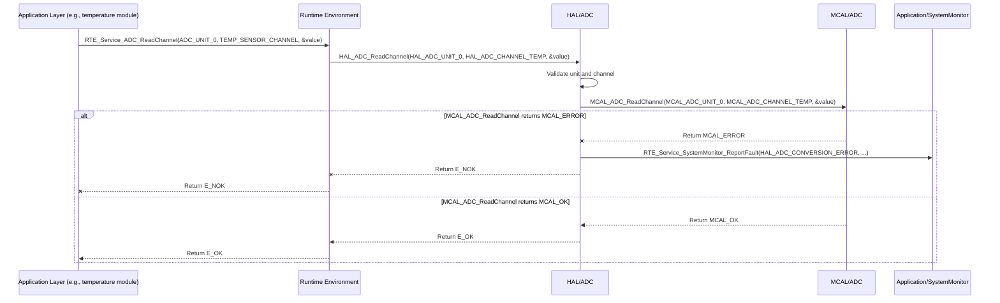

# Detailed Design Document: HAL_ADC Component

## 1. Introduction

### 1.1. Purpose

This document details the design of the `HAL_ADC` component, which provides a hardware abstraction layer for Analog-to-Digital Converter (ADC) functionalities. Its primary purpose is to offer a standardized, microcontroller-independent interface for configuring and performing analog-to-digital conversions, abstracting the low-level register access and specific MCU details from higher layers.

### 1.2. Scope

The scope of this document covers the `HAL_ADC` module's architecture, functional behavior, interfaces, dependencies, and resource considerations. It details how the HAL layer interacts with the underlying Microcontroller Abstraction Layer (MCAL) for ADC operations.

### 1.3. References

* Software Architecture Document (SAD) - Environmental Monitoring & Control System (Final Version)

* MCAL ADC Driver Specification (Conceptual, as it's the lower layer)

* MCU Datasheet / Reference Manual (for specific ADC capabilities)

## 2. Functional Description

The `HAL_ADC` component provides the following core functionalities:

1. **ADC Initialization**: Initialize the ADC peripheral, including resolution, attenuation, and calibration.

2. **Channel Configuration**: Configure individual ADC channels for conversion, specifying input pins.

3. **Analog Value Conversion**: Perform a single analog-to-digital conversion on a specified channel and return the digital value.

4. **Error Reporting**: Report any failures during ADC operations (e.g., initialization failure, conversion error, invalid channel) to the `SystemMonitor` via `RTE_Service_SystemMonitor_ReportFault()`.

## 3. Non-Functional Requirements

### 3.1. Performance

* **Conversion Speed**: ADC conversions shall be performed within specified time limits to meet real-time requirements of sensor readings.

* **Accuracy**: The digital output shall accurately reflect the analog input voltage within the specified error margins.

* **Repeatability**: Consecutive conversions of a stable analog input shall yield consistent results.

### 3.2. Memory

* **Minimal Footprint**: The `HAL_ADC` code and data shall have a minimal memory footprint.

* **Configuration Storage**: Configuration data for ADC channels shall be stored efficiently.

### 3.3. Reliability

* **Robustness**: The module shall handle invalid channel configurations or hardware access failures gracefully.

* **Stability**: The ADC operation shall not be affected by noise or external interference beyond specified limits.

## 4. Architectural Context

As per the SAD (Section 3.1.2, HAL Layer), `HAL_ADC` resides in the Hardware Abstraction Layer. It acts as an intermediary between Application Layer components (e.g., `Application/temperature`, `Application/power`) and the `MCAL_ADC` driver. `HAL_ADC` translates generic ADC requests into MCAL-specific calls.

## 5. Design Details

### 5.1. Module Structure

The `HAL_ADC` component will consist of the following files:

* `HAL/inc/hal_adc.h`: Public header file containing function prototypes, data types, and error codes.

* `HAL/src/hal_adc.c`: Source file containing the implementation of the HAL_ADC functions.

* `HAL/cfg/hal_adc_cfg.h`: Configuration header for static ADC channel definitions and initial settings.

### 5.2. Public Interface (API)

```c
// In HAL/inc/hal_adc.h

// Enum for ADC unit (if MCU has multiple ADC units)
typedef enum {
    HAL_ADC_UNIT_0,
    HAL_ADC_UNIT_1,
    // Add more units if applicable
    HAL_ADC_UNIT_COUNT
} HAL_ADC_Unit_t;

// Enum for ADC channel
typedef enum {
    HAL_ADC_CHANNEL_0,
    HAL_ADC_CHANNEL_1,
    // ...
    HAL_ADC_CHANNEL_MAX // Max number of channels
} HAL_ADC_Channel_t;

// Enum for ADC resolution (e.g., 10-bit, 12-bit)
typedef enum {
    HAL_ADC_RESOLUTION_8BIT,
    HAL_ADC_RESOLUTION_10BIT,
    HAL_ADC_RESOLUTION_12BIT,
    // Add more if applicable
} HAL_ADC_Resolution_t;

// Enum for ADC attenuation (for voltage range)
typedef enum {
    HAL_ADC_ATTEN_0DB,   // 0-1.2V
    HAL_ADC_ATTEN_2_5DB, // 0-1.5V
    HAL_ADC_ATTEN_6DB,   // 0-2.2V
    HAL_ADC_ATTEN_11DB,  // 0-3.9V
    // Add more if applicable
} HAL_ADC_Attenuation_t;

// Structure for initial ADC channel configuration
typedef struct {
    HAL_ADC_Unit_t unit;
    HAL_ADC_Channel_t channel;
    HAL_ADC_Attenuation_t attenuation;
} HAL_ADC_ChannelConfig_t;

/**
 * @brief Initializes the ADC peripheral and all configured channels.
 * This function should be called once during system initialization.
 * It iterates through the `hal_adc_initial_config` array.
 * @return E_OK on success, E_NOK if any part of initialization fails.
 */
APP_Status_t HAL_ADC_Init(void);

/**
 * @brief Reads an analog value from a specified ADC channel.
 * @param unit The ADC unit to use.
 * @param channel The ADC channel to read.
 * @param raw_value Pointer to store the raw digital value.
 * @return E_OK on success, E_NOK on failure.
 */
APP_Status_t HAL_ADC_ReadChannel(HAL_ADC_Unit_t unit, HAL_ADC_Channel_t channel, uint32_t *raw_value);

/**
 * @brief Performs calibration for a specific ADC unit (if supported by MCAL).
 * @param unit The ADC unit to calibrate.
 * @return E_OK on success, E_NOK on failure.
 */
APP_Status_t HAL_ADC_Calibrate(HAL_ADC_Unit_t unit);

### 5.3. Internal Design

The `HAL_ADC` module will primarily act as a wrapper around the `MCAL_ADC` functions. It will perform input validation, translate parameters, and handle error reporting before delegating the actual hardware access to the MCAL layer.

1.  **Initialization (`HAL_ADC_Init`)**:

    * This function will **first initialize the global ADC peripheral settings** (e.g., resolution) by calling `MCAL_ADC_Init(mcal_resolution)`. If this fails, it reports `HAL_ADC_DRIVER_FAILURE` and returns `E_NOK`.

    * It will then **loop through the `hal_adc_initial_config` array** defined in `HAL/cfg/hal_adc_cfg.h`.

    * For each entry in the array:

        * Validate the `unit` and `channel` against predefined ranges.

        * Translate `HAL_ADC_Attenuation_t` into `MCAL_ADC` specific enums/macros.

        * Call `MCAL_ADC_ConfigChannel(mcal_unit, mcal_channel, mcal_attenuation)`.

        * If `MCAL_ADC_ConfigChannel` returns an error for *any* channel, report `HAL_ADC_CONFIG_FAILURE` to `SystemMonitor`. The function should continue to attempt to initialize remaining channels but will ultimately return `E_NOK` if any configuration fails.

    * If all channels are initialized successfully, return `E_OK`.

2.  **Read Channel (`HAL_ADC_ReadChannel`)**:

    * Validate `unit` and `channel`.

    * Call `MCAL_ADC_ReadChannel(mcal_unit, mcal_channel, raw_value)`.

    * If `MCAL_ADC_ReadChannel` returns an error, report `HAL_ADC_CONVERSION_ERROR` to `SystemMonitor`.

3.  **Calibrate (`HAL_ADC_Calibrate`)**:

    * Validate `unit`.

    * Call `MCAL_ADC_Calibrate(mcal_unit)`.

    * If `MCAL_ADC_Calibrate` returns an error, report `HAL_ADC_CALIBRATION_FAILURE` to `SystemMonitor`.

**Sequence Diagram (Example: HAL_ADC_ReadChannel):**



### 5.4. Dependencies

* **`Mcal/adc/inc/mcal_adc.h`**: For calling low-level ADC driver functions.

* **`Application/logger/inc/logger.h`**: For internal logging.

* **`Rte/inc/Rte.h`**: For calling `RTE_Service_SystemMonitor_ReportFault()`.

* **`Application/common/inc/common.h`**: For `APP_Status_t` and `E_OK`/`E_NOK`.

* **`HAL/cfg/hal_adc_cfg.h`**: For the `hal_adc_initial_config` array and `HAL_ADC_ChannelConfig_t` structure.

### 5.5. Error Handling

* **Input Validation**: All public API functions will validate input parameters (e.g., valid unit/channel number).

* **MCAL Error Propagation**: Errors returned by `MCAL_ADC` functions will be caught by `HAL_ADC`.

* **Fault Reporting**: Upon detection of an error (invalid input, MCAL failure), `HAL_ADC` will report a specific fault ID (e.g., `HAL_ADC_DRIVER_FAILURE`, `HAL_ADC_CONFIG_FAILURE`, `HAL_ADC_CONVERSION_ERROR`, `HAL_ADC_CALIBRATION_FAILURE`) to `SystemMonitor` via the RTE service.

* **Return Status**: All public API functions will return `E_NOK` on failure. `HAL_ADC_Init` will return `E_NOK` if *any* critical initialization step or channel configuration fails.

### 5.6. Configuration

The `HAL/cfg/hal_adc_cfg.h` file will contain:

* Macros or enums for mapping logical channel names (e.g., `TEMP_SENSOR_ADC_CHANNEL`, `POWER_MON_VOLTAGE_CHANNEL`) to physical ADC channels.

* The `hal_adc_initial_config` array, which defines the initial configuration for all ADC channels used by the system.

* The size of the `hal_adc_initial_config` array.

* Default ADC resolution and other global settings.

```c
// Example: HAL/cfg/hal_adc_cfg.h
#define TEMP_SENSOR_ADC_CHANNEL         HAL_ADC_CHANNEL_0
#define HUMIDITY_SENSOR_ADC_CHANNEL     HAL_ADC_CHANNEL_1
#define POWER_MON_VOLTAGE_CHANNEL       HAL_ADC_CHANNEL_2
#define POWER_MON_CURRENT_CHANNEL       HAL_ADC_CHANNEL_3

// Initial configuration array
extern const HAL_ADC_ChannelConfig_t hal_adc_initial_config[];
extern const uint32_t hal_adc_initial_config_size;

// Global ADC settings
#define HAL_ADC_DEFAULT_RESOLUTION      HAL_ADC_RESOLUTION_12BIT
```

### 5.7. Resource Usage

* **Flash**: Moderate, depending on the number of API functions and the size of the `hal_adc_initial_config` array.

* **RAM**: Minimal for internal state.

* **CPU**: Low for individual conversions, but can increase with high sampling rates or complex post-processing (which would be handled by higher layers).

## 6. Test Considerations

### 6.1. Unit Testing

* **Mock MCAL_ADC**: Unit tests for `HAL_ADC` will mock the `MCAL_ADC` functions to isolate `HAL_ADC`'s logic.

* **Test Cases**:

  * `HAL_ADC_Init`: Test with a valid `hal_adc_initial_config` array. Verify `MCAL_ADC_Init` and `MCAL_ADC_ConfigChannel` calls. Test scenarios where MCAL calls fail (verify `E_NOK` return and `SystemMonitor` fault reporting).

  * `HAL_ADC_ReadChannel`: Test valid/invalid unit/channel. Verify correct `MCAL_ADC_ReadChannel` calls and return values. Test error propagation from MCAL.

  * `HAL_ADC_Calibrate`: Test valid/invalid unit. Verify `MCAL_ADC_Calibrate` call and error propagation.

  * Error reporting: Verify that `RTE_Service_SystemMonitor_ReportFault()` is called with the correct fault ID on various error conditions.

### 6.2. Integration Testing

* **HAL-MCAL Integration**: Verify that `HAL_ADC` correctly interfaces with the actual `MCAL_ADC` driver.

* **Sensor Readings**: Connect actual analog sensors (temperature, humidity, current, voltage) and verify that `HAL_ADC_ReadChannel` returns plausible values.

* **Calibration**: If hardware supports it, verify `HAL_ADC_Calibrate` improves accuracy.

* **Fault Reporting**: Trigger MCAL errors (e.g., by simulating hardware issues) and verify that `HAL_ADC` reports faults to `SystemMonitor`.

### 6.3. System Testing

* **Full System Functionality**: Verify that all application features relying on ADC (e.g., temperature/humidity monitoring, power consumption calculation, power-based actuator overrides) work correctly within the integrated system.

* **Accuracy and Resolution**: Verify end-to-end accuracy and resolution of sensor readings.

* **Power Modes**: Ensure ADC behaves correctly during power mode transitions (e.g., low-power states, re-initialization on wake-up).

* @return E_OK on success, E_NOK on failure.
 */
APP_Status_t HAL_ADC_Calibrate(HAL_ADC_Unit_t unit);
