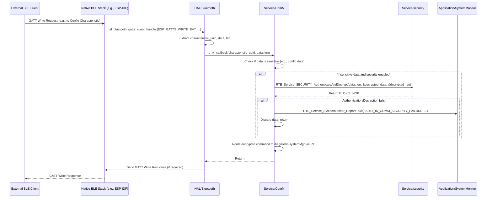

# **Detailed Design Document: HAL_Bluetooth Component**

## **1. Introduction**

### **1.1. Purpose**

This document details the design of the HAL_Bluetooth component. Its primary purpose is to provide a **hardware abstraction layer for Bluetooth Low Energy (BLE) functionalities**, specifically managing the BLE stack (GAP, GATT), advertising, connections, and characteristic read/write/notify operations. It abstracts the complexities of the native Bluetooth SDK/drivers from the higher ComM service layer. This fulfills requirements like SRS-05-02-01 (BLE 4.0 or higher) and SRS-05-02-02 (expose GATT-based services to ComM).

### **1.2. Scope**

The scope of this document covers the HAL_Bluetooth module's architecture, functional behavior, interfaces, dependencies, and resource considerations. It details how HAL_Bluetooth interacts with the underlying native Bluetooth drivers (often part of the MCAL or a vendor SDK) and provides an interface for the ComM module to manage BLE connections and exchange data.

### **1.3. References**

* Software Architecture Document (SAD) - Environmental Monitoring & Control System (Final Version)  
* System Requirements Specification (SyRS) - Environmental Monitoring & Control System (Updated)  
* Software Requirements Specification (SRS) - Environmental Monitoring & Control System (Updated)  
* Detailed Design Document: RTE  
* Detailed Design Document: ComM  
* Detailed Design Document: SystemMonitor  
* Detailed Design Document: SECURITY  
* Bluetooth Core Specification (BLE portions)  
* Native Bluetooth SDK Documentation (e.g., ESP-IDF Bluetooth APIs)

## **2. Functional Description**

The HAL_Bluetooth component provides the following core functionalities:

1. **Initialization (HAL_BLUETOOTH_Init)**: Initialize the native Bluetooth stack (controller, host, GAP, GATT server) and configure basic BLE parameters (e.g., device name, advertising parameters).  
2. **GATT Service/Characteristic Management**: Define and register custom GATT services and characteristics as required by the application (e.g., for sensor data, actuator control, configuration, OTA).  
3. **Advertising Control (HAL_BLUETOOTH_StartAdvertising, HAL_BLUETOOTH_StopAdvertising)**: Start and stop BLE advertising to allow other devices to discover and connect to the smart device.  
4. **Connection Management**: Handle BLE connection events (connection established, disconnected) and manage multiple connections if supported.  
5. **Data Transmission (HAL_BLUETOOTH_SendNotification, HAL_BLUETOOTH_SendIndication)**: Send data to connected BLE clients via GATT notifications or indications.  
6. **Data Reception (Callbacks)**: Process incoming GATT write requests from connected clients. This typically involves a callback mechanism where the native Bluetooth stack invokes a HAL_Bluetooth internal function, which then processes the data and potentially passes it to ComM.  
7. **Connection State Reporting**: Report changes in connection status to ComM.  
8. **Error Reporting**: Detect and report any failures during Bluetooth operations (e.g., stack initialization failure, advertising error, connection error, GATT operation failure) to the SystemMonitor via RTE_Service_SystemMonitor_ReportFault().

## **3. Non-Functional Requirements**

### **3.1. Performance**

* **Latency**: BLE advertising and connection establishment shall be responsive. Data exchange (notifications/indications) should have minimal latency.  
* **Throughput**: Capable of handling the expected data rates for sensor data updates and OTA firmware transfer over BLE.

### **3.2. Memory**

* **Minimal Footprint**: The HAL_Bluetooth code and data shall have a minimal memory footprint, considering the BLE stack's own memory requirements.  
* **Buffer Management**: Efficient use of transmit/receive buffers for GATT operations.

### **3.3. Reliability**

* **Robustness**: The module shall be robust against connection drops, invalid GATT operations, or native stack errors, preventing system crashes.  
* **Connection Stability**: Maintain stable BLE connections under various environmental conditions.  
* **Protocol Conformance**: Strictly adhere to BLE 4.0 (or higher) specification for GAP and GATT.

## **4. Architectural Context**

As per the SAD (Section 3.1.2, HAL Layer), HAL_Bluetooth resides in the Hardware Abstraction Layer. It provides the low-level BLE stack management and GATT interaction for the ComM service layer. ComM will call HAL_BLUETOOTH_StartAdvertising to enable discovery, HAL_BLUETOOTH_SendNotification to send data, and will receive incoming data via callbacks registered with HAL_Bluetooth. HAL_Bluetooth interacts directly with the native Bluetooth SDK/drivers provided by the MCU vendor.

## **5. Design Details**

### **5.1. Module Structure**

The HAL_Bluetooth component will consist of the following files:

* HAL/Bluetooth/inc/hal_bluetooth.h: Public header file containing function prototypes, data types (e.g., characteristic UUIDs), and error codes.  
* HAL/Bluetooth/src/hal_bluetooth.c: Source file containing the implementation of BLE stack initialization, GATT server logic, and event handling.  
* HAL/Bluetooth/cfg/hal_bluetooth_cfg.h: Configuration header for device name, advertising parameters, and GATT service/characteristic definitions.

### **5.2. Public Interface (API)**

// In HAL/Bluetooth/inc/hal_bluetooth.h
```c
#include "Application/common/inc/common.h" // For APP_Status_t  
#include <stdint.h>   // For uint32_t, uint8_t  
#include <stdbool.h>  // For bool

// Define common UUIDs for services and characteristics (example)  
#define HAL_BLUETOOTH_SERVICE_UUID_ENV_MONITORING   0x181A // Example: Environmental Sensing Service  
#define HAL_BLUETOOTH_CHAR_UUID_TEMPERATURE         0x2A6E // Example: Temperature Characteristic  
#define HAL_BLUETOOTH_CHAR_UUID_HUMIDITY            0x2A6F // Example: Humidity Characteristic  
#define HAL_BLUETOOTH_SERVICE_UUID_OTA              0x1234 // Custom OTA Service  
#define HAL_BLUETOOTH_CHAR_UUID_OTA_DATA            0x5678 // Custom OTA Data Characteristic  
#define HAL_BLUETOOTH_CHAR_UUID_CONFIG              0xABCD // Custom Config Characteristic

// Function pointer for incoming GATT write callback (to be registered by ComM)  
typedef void (*HAL_BLUETOOTH_RxCallback_t)(uint16_t characteristic_uuid, const uint8_t *data, uint16_t len);

// Function pointer for connection state change callback (to be registered by ComM)  
typedef void (*HAL_BLUETOOTH_ConnectionCallback_t)(bool connected);

/**  
 * @brief Initializes the HAL_Bluetooth module and the native BLE stack.  
 * This function should be called once during system initialization.  
 * @return E_OK on success, E_NOK on failure.  
 */  
APP_Status_t HAL_BLUETOOTH_Init(void);

/**  
 * @brief Registers callback functions for incoming data and connection state changes.  
 * @param rx_callback Function to call when data is received on a characteristic.  
 * @param conn_callback Function to call when connection state changes.  
 * @return E_OK on success, E_NOK on failure.  
 */  
APP_Status_t HAL_BLUETOOTH_RegisterCallbacks(HAL_BLUETOOTH_RxCallback_t rx_callback,  
                                             HAL_BLUETOOTH_ConnectionCallback_t conn_callback);

/**  
 * @brief Starts BLE advertising to make the device discoverable.  
 * @return E_OK on success, E_NOK on failure.  
 */  
APP_Status_t HAL_BLUETOOTH_StartAdvertising(void);

/**  
 * @brief Stops BLE advertising.  
 * @return E_OK on success, E_NOK on failure.  
 */  
APP_Status_t HAL_BLUETOOTH_StopAdvertising(void);

/**  
 * @brief Sends a GATT notification to all connected clients for a specific characteristic.  
 * @param characteristic_uuid The UUID of the characteristic to notify.  
 * @param data Pointer to the data to send.  
 * @param len Length of the data.  
 * @return E_OK on successful transmission, E_NOK on failure.  
 */  
APP_Status_t HAL_BLUETOOTH_SendNotification(uint16_t characteristic_uuid, const uint8_t *data, uint16_t len);

/**  
 * @brief Sends a GATT indication to all connected clients for a specific characteristic.  
 * Indications require a confirmation from the client.  
 * @param characteristic_uuid The UUID of the characteristic to indicate.  
 * @param data Pointer to the data to send.  
 * @param len Length of the data.  
 * @return E_OK on successful transmission, E_NOK on failure.  
 */  
APP_Status_t HAL_BLUETOOTH_SendIndication(uint16_t characteristic_uuid, const uint8_t *data, uint16_t len);

/**  
 * @brief Processes internal Bluetooth stack events and manages connections.  
 * This function should be called periodically (e.g., by ComM's main function).  
 * It might trigger internal callbacks or update connection states.  
 */  
void HAL_BLUETOOTH_Process(void);

/**  
 * @brief Gets the current connection status of the Bluetooth module.  
 * @return True if at least one client is connected, false otherwise.  
 */  
bool HAL_BLUETOOTH_IsConnected(void);
```
### **5.3. Internal Design**

The HAL_Bluetooth module will wrap the native Bluetooth SDK's APIs. It will manage the GATT server, handle various BLE events (GAP, GATT), and invoke the registered callbacks for ComM.

1. **Internal State Variables**:  
   static HAL_BLUETOOTH_RxCallback_t s_rx_callback = NULL;  
   static HAL_BLUETOOTH_ConnectionCallback_t s_conn_callback = NULL;  
   static bool s_is_initialized = false;  
   static bool s_is_advertising = false;  
   static uint16_t s_connected_client_count = 0; // Number of currently connected clients  
   // Native SDK specific handles/pointers (e.g., esp_gatt_if_t, esp_ble_adv_params_t, etc.)

2. **Initialization (HAL_BLUETOOTH_Init)**:  
   * Initialize the native Bluetooth controller and host stack (e.g., esp_bt_controller_init(), esp_bluedroid_init(), esp_bluedroid_enable()).  
   * Register GAP and GATT callbacks with the native SDK (e.g., esp_ble_gap_register_callback(hal_bluetooth_gap_event_handler), esp_ble_gatts_register_callback(hal_bluetooth_gatts_event_handler)). These hal_bluetooth_..._event_handler functions will be internal static functions in hal_bluetooth.c.  
   * Configure and create GATT services and characteristics as defined in hal_bluetooth_cfg.h (e.g., esp_ble_gatts_create_service(), esp_ble_gatts_add_char()).  
   * If any step fails, report FAULT_ID_HAL_BLUETOOTH_INIT_FAILURE to SystemMonitor and return E_NOK.  
   * Set s_is_initialized = true;.  
   * Log LOGI("HAL_Bluetooth: Initialized successfully.");.  
   * Return E_OK.  
3. **Register Callbacks (HAL_BLUETOOTH_RegisterCallbacks)**:  
   * Validate rx_callback and conn_callback are not NULL.  
   * s_rx_callback = rx_callback;  
   * s_conn_callback = conn_callback;  
   * Return E_OK.  
4. **Advertising Control (HAL_BLUETOOTH_StartAdvertising, HAL_BLUETOOTH_StopAdvertising)**:  
   * Validate s_is_initialized.  
   * Configure advertising parameters (e.g., esp_ble_adv_params_t) and advertising data (e.g., esp_ble_adv_data_t) as defined in hal_bluetooth_cfg.h.  
   * Call native SDK advertising start/stop functions (e.g., esp_ble_gap_start_advertising(), esp_ble_gap_stop_advertising()).  
   * Update s_is_advertising state.  
   * Report FAULT_ID_HAL_BLUETOOTH_ADV_FAILURE on error.  
5. **Data Transmission (HAL_BLUETOOTH_SendNotification, HAL_BLUETOOTH_SendIndication)**:  
   * Validate s_is_initialized, characteristic_uuid, data, len.  
   * Check if any clients are connected (s_connected_client_count > 0). If not, log debug and return E_OK (no one to send to).  
   * Retrieve the GATT handle for the given characteristic_uuid.  
   * Call native SDK functions (e.g., esp_ble_gatts_send_indicate(), esp_ble_gatts_send_notify()).  
   * Report FAULT_ID_HAL_BLUETOOTH_TX_FAILURE on error.  
6. **Process (HAL_BLUETOOTH_Process)**:  
   * If !s_is_initialized, return immediately.  
   * This function primarily serves as a periodic trigger for any internal polling or state machine updates within the native Bluetooth stack that are not purely event-driven. For many modern BLE SDKs (like ESP-IDF), most operations are asynchronous and handled by event handlers, so this function might primarily serve to ensure the stack's internal tasks are running or to check for internal timeouts.  
   * It's crucial that native Bluetooth event handlers (e.g., hal_bluetooth_gatts_event_handler) are properly implemented to:  
     * **Handle ESP_GATTS_WRITE_EVT**: When a client writes to a characteristic, this event handler will be triggered.  
       * Extract characteristic_uuid, data, len.  
       * Call s_rx_callback(characteristic_uuid, data, len) to pass data to ComM.  
       * Handle write response if required.  
     * **Handle ESP_GATTS_CONNECT_EVT / ESP_GATTS_DISCONNECT_EVT**:  
       * Update s_connected_client_count.  
       * Call s_conn_callback(true/false) to inform ComM about connection state changes.  
     * **Handle ESP_GATTS_CREATE_EVT / ESP_GATTS_ADD_CHAR_EVT**: Store GATT handles for future use.  
     * **Handle ESP_GAP_BLE_ADV_START_COMPLETE_EVT**: Update s_is_advertising.  
7. **Is Connected (HAL_BLUETOOTH_IsConnected)**:  
   * Returns s_connected_client_count > 0.

**Sequence Diagram (Example: BLE Data Reception - Client Write):**

### **5.4. Dependencies**

* **Native Bluetooth SDK Headers**: (e.g., esp_bt.h, esp_gap_ble_api.h, esp_gatts_api.h for ESP-IDF). These are the direct interface to the MCU's Bluetooth capabilities.  
* Application/logger/inc/logger.h: For internal logging.  
* Rte/inc/Rte.h: For calling RTE_Service_SystemMonitor_ReportFault().  
* Application/common/inc/common.h: For APP_Status_t, E_OK/E_NOK.  
* HAL/Bluetooth/cfg/hal_bluetooth_cfg.h: For configuration parameters.  
* Service/ComM/inc/comm.h: For ComM's callback types (though HAL_BLUETOOTH defines its own function pointer types).

### **5.5. Error Handling**

* **Native SDK Error Codes**: Errors returned by native Bluetooth SDK functions will be caught by HAL_Bluetooth.  
* **Fault Reporting**: Upon detection of an error (e.g., stack initialization failure, advertising start failure, GATT operation error), HAL_Bluetooth will report a specific fault ID (e.g., FAULT_ID_HAL_BLUETOOTH_INIT_FAILURE, FAULT_ID_HAL_BLUETOOTH_ADV_FAILURE, FAULT_ID_HAL_BLUETOOTH_TX_FAILURE) to SystemMonitor via the RTE service.  
* **Input Validation**: Public API functions will validate input parameters.  
* **Return Status**: All public API functions will return E_NOK on failure.

### **5.6. Configuration**

The HAL/Bluetooth/cfg/hal_bluetooth_cfg.h file will contain:

* HAL_BLUETOOTH_DEVICE_NAME: The name advertised by the device.  
* HAL_BLUETOOTH_ADV_INTERVAL_MS: Advertising interval.  
* Definitions for all custom GATT services and characteristics (UUIDs, properties, permissions).  
* HAL_BLUETOOTH_MAX_MTU_SIZE: Maximum Transmission Unit for GATT.
```c
// Example: HAL/Bluetooth/cfg/hal_bluetooth_cfg.h  
#ifndef HAL_BLUETOOTH_CFG_H  
#define HAL_BLUETOOTH_CFG_H

#define HAL_BLUETOOTH_DEVICE_NAME           "SmartEnvMonitor"  
#define HAL_BLUETOOTH_ADV_INTERVAL_MS       1000 // 1 second advertising interval

// --- GATT Service and Characteristic Definitions ---  
// Define your custom services and characteristics here.  
// These are examples and would need to be properly defined with UUIDs and properties.  
// The actual GATT table setup would be done in hal_bluetooth.c using native SDK calls.

// Service UUIDs  
#define HAL_BLUETOOTH_SERVICE_UUID_ENV_MONITORING   0x181A // Standard BLE Environmental Sensing Service  
#define HAL_BLUETOOTH_SERVICE_UUID_CONTROL          0xA001 // Custom Control Service  
#define HAL_BLUETOOTH_SERVICE_UUID_OTA              0xA002 // Custom OTA Service

// Characteristic UUIDs for Environmental Monitoring Service  
#define HAL_BLUETOOTH_CHAR_UUID_TEMPERATURE         0x2A6E // Standard Temperature Characteristic  
#define HAL_BLUETOOTH_CHAR_UUID_HUMIDITY            0x2A6F // Standard Humidity Characteristic

// Characteristic UUIDs for Control Service  
#define HAL_BLUETOOTH_CHAR_UUID_FAN_SPEED_SET       0xB001 // Write: Set fan speed  
#define HAL_BLUETOOTH_CHAR_UUID_HEATER_STATE_SET    0xB002 // Write: Set heater state  
#define HAL_BLUETOOTH_CHAR_UUID_SYSTEM_MODE_SET     0xB003 // Write: Set system mode (Auto/Manual/Hybrid)

// Characteristic UUIDs for OTA Service  
#define HAL_BLUETOOTH_CHAR_UUID_OTA_CONTROL         0xC001 // Write: Start/Stop OTA, Get status  
#define HAL_BLUETOOTH_CHAR_UUID_OTA_DATA            0xC002 // Write: OTA firmware data chunks

// Max MTU size for GATT (adjust based on platform capabilities and performance needs)  
#define HAL_BLUETOOTH_MAX_MTU_SIZE          256 // Example: 256 bytes

#endif // HAL_BLUETOOTH_CFG_H
```
### **5.7. Resource Usage**

* **Flash**: High, as it includes the BLE stack code (controller and host).  
* **RAM**: High, due to the BLE stack's internal buffers, connection contexts, and GATT database.  
* **CPU**: Moderate to High, depending on the activity (advertising, active connections, data transfer rates). Hardware acceleration for crypto (if used by BLE stack) can reduce CPU load.

## **6. Test Considerations**

### **6.1. Unit Testing**

* **Mock Native Bluetooth SDK**: Unit tests for HAL_Bluetooth will heavily mock the native Bluetooth SDK APIs to isolate HAL_Bluetooth's logic. This includes mocking esp_bt_controller_init(), esp_ble_gap_register_callback(), esp_ble_gatts_create_service(), esp_ble_gap_start_advertising(), esp_ble_gatts_send_notify(), and simulating incoming events via the registered internal event handlers.  
* **Test Cases**:  
  * HAL_BLUETOOTH_Init: Test successful initialization and mocked native SDK failures (verify E_NOK and fault reporting).  
  * HAL_BLUETOOTH_RegisterCallbacks: Test valid/invalid callbacks.  
  * HAL_BLUETOOTH_StartAdvertising/StopAdvertising: Test starting/stopping advertising. Verify native SDK calls. Test mocked failures.  
  * HAL_BLUETOOTH_SendNotification/SendIndication: Test sending data with valid/invalid UUIDs, data, and lengths. Test when no clients are connected. Test mocked native SDK failures.  
  * HAL_BLUETOOTH_Process: Verify it runs without issues. (Primary testing for this module is via event handlers).  
  * **Event Handling (simulated)**:  
    * Simulate ESP_GATTS_CONNECT_EVT/DISCONNECT_EVT: Verify s_connected_client_count updates and s_conn_callback is called correctly.  
    * Simulate ESP_GATTS_WRITE_EVT: Verify s_rx_callback is called with correct characteristic UUID, data, and length.  
    * Simulate ESP_GATTS_READ_EVT: Verify correct response is prepared (if HAL_Bluetooth handles read requests directly).  
  * Error reporting: Verify that RTE_Service_SystemMonitor_ReportFault() is called with the correct fault ID on various error conditions.

### **6.2. Integration Testing**

* **HAL-Native SDK Integration**: Verify that HAL_Bluetooth correctly interfaces with the actual native Bluetooth SDK on the target hardware.  
* **Device Discovery**: Use a mobile phone or another BLE device to discover the SmartEnvMonitor device.  
* **Connection/Disconnection**: Establish and break BLE connections. Verify connection callbacks are triggered.  
* **GATT Service/Characteristic Access**: Use a BLE client app to browse GATT services, read characteristics (if readable), write to characteristics (e.g., config), and subscribe to notifications/indications (e.g., sensor data).  
* **Data Exchange**: Send sensor data notifications from the device and verify reception on the client. Send commands from the client and verify they are received by ComM via HAL_Bluetooth.  
* **OTA Data Transfer**: If OTA is integrated, test transferring firmware chunks over BLE.  
* **Security (Pairing/Encryption)**: Test BLE pairing and encrypted communication if enabled by the underlying stack and SECURITY module.  
* **Error Injection**: Introduce BLE communication errors (e.g., move out of range, interfere with radio) and verify HAL_Bluetooth reports faults to SystemMonitor.

### **6.3. System Testing**

* **End-to-End BLE Communication**: Verify that the entire BLE communication path (from external client through ComM and HAL_Bluetooth to application logic) functions correctly for monitoring, control, and OTA.  
* **Concurrent Operations**: Test BLE communication while other system functions (e.g., sensor reading, actuator control, Modbus communication) are active.  
* **Stress Testing**: Maintain multiple simultaneous BLE connections (if supported) and high data rates for extended periods to ensure stability.  
* **Power Modes**: Ensure BLE behaves correctly during power mode transitions (e.g., advertising/connection in low-power modes).