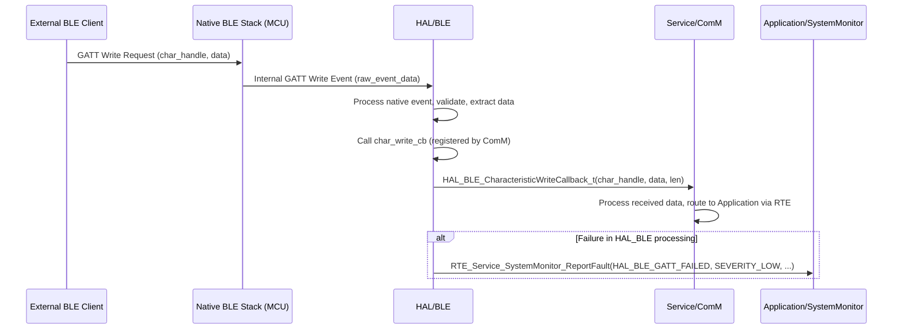

# **Detailed Design Document: HAL_BLE Component**

## **1. Introduction**

### **1.1. Purpose**

This document details the design of the HAL_BLE component, which provides a hardware abstraction layer for Bluetooth Low Energy (BLE) functionalities. Its primary purpose is to offer a standardized, microcontroller-independent interface for managing BLE advertising, connections, GATT services, and characteristic operations, abstracting the complexities of the underlying Bluetooth stack and specific MCU details from the ComM module in the Service Layer.

### **1.2. Scope**

The scope of this document covers the HAL_BLE module's architecture, functional behavior, interfaces, dependencies, and resource considerations. It details how the HAL layer interacts with the native Bluetooth stack (which might be part of the MCAL or a vendor-provided SDK).

### **1.3. References**

* Software Architecture Document (SAD) - Smart Device Firmware (Final Version)  
* Bluetooth Core Specification (BLE portions)  
* MCU Bluetooth Stack Documentation (e.g., ESP-IDF Bluetooth APIs)

## **2. Functional Description**

The HAL_BLE component provides the following core functionalities:

1. **BLE Stack Initialization**: Initialize the native Bluetooth Low Energy stack, including controller and host layers, GAP, and GATT.  
2. **GAP (Generic Access Profile) Management**: Start/stop BLE advertising, manage connection parameters, and handle pairing/bonding.  
3. **GATT (Generic Attribute Profile) Server**: Define and register custom GATT services and characteristics. Handle read/write requests from clients and send notifications/indications.  
4. **Data Transmission**: Send data to connected BLE clients via GATT notifications or indications.  
5. **Data Reception**: Receive data from connected BLE clients via GATT write requests.  
6. **Event Handling**: Provide a mechanism to register callbacks for key BLE events (e.g., connection established/lost, characteristic write, pairing complete).  
7. **Error Reporting**: Report any failures during BLE operations (e.g., stack initialization failure, advertising failure, connection error, GATT operation error) to the SystemMonitor via RTE_Service_SystemMonitor_ReportFault().

## **3. Non-Functional Requirements**

### **3.1. Performance**

* **Connection Speed**: Establish BLE connections quickly.  
* **Throughput**: Support data transfer rates adequate for system status updates and configuration.  
* **Responsiveness**: Respond to BLE client requests within acceptable latency.

### **3.2. Memory**

* **Minimal Footprint**: The HAL_BLE code and data shall have a minimal memory footprint, considering the embedded constraints.  
* **Buffer Management**: Efficiently manage internal buffers for advertising data, GATT operations, and received/transmitted data.

### **3.3. Reliability**

* **Robustness**: The module shall handle BLE stack errors, connection drops, and invalid GATT operations gracefully.  
* **Fault Isolation**: Failures in BLE communication should be isolated and reported without crashing the system.  
* **Security**: Support BLE pairing and encryption as per security requirements (SRS-07-01-01).

## **4. Architectural Context**

As per the SAD (Section 3.1.2, HAL Layer), HAL_BLE resides in the Hardware Abstraction Layer. It acts as an intermediary between the Service/ComM module and the native Bluetooth stack (which is often provided by the MCU vendor and might sit conceptually below MCAL or be integrated with it). HAL_BLE translates generic BLE requests from ComM into native stack API calls.

## **5. Design Details**

### **5.1. Module Structure**

The HAL_BLE component will consist of the following files:

* HAL/inc/hal_ble.h: Public header file containing function prototypes, data types, and error codes.  
* HAL/src/hal_ble.c: Source file containing the implementation of the HAL_BLE functions.  
* HAL/cfg/hal_ble_cfg.h: Configuration header for static BLE parameters (e.g., device name, advertising intervals, GATT service/characteristic UUIDs).

### **5.2. Public Interface (API)**
```c
// In HAL/inc/hal_ble.h

// Enum for BLE status/error codes  
typedef enum {  
    HAL_BLE_OK = 0,  
    HAL_BLE_ERROR_INIT_FAILED,  
    HAL_BLE_ERROR_ADV_FAILED,  
    HAL_BLE_ERROR_GATT_FAILED,  
    HAL_BLE_ERROR_INVALID_PARAM,  
    HAL_BLE_ERROR_NOT_CONNECTED,  
    HAL_BLE_ERROR_SECURITY_FAILED,  
    // Add more specific errors as needed  
} HAL_BLE_Status_t;

// Enum for BLE connection state  
typedef enum {  
    HAL_BLE_STATE_DISCONNECTED,  
    HAL_BLE_STATE_ADVERTISING,  
    HAL_BLE_STATE_CONNECTED  
} HAL_BLE_ConnectionState_t;

// Function pointer for BLE connection state changes  
typedef void (*HAL_BLE_ConnectionStateCallback_t)(HAL_BLE_ConnectionState_t state);

// Function pointer for GATT characteristic write events  
typedef void (*HAL_BLE_CharacteristicWriteCallback_t)(uint16_t char_handle, const uint8_t *data, uint16_t len);

// Function pointer for BLE pairing/security events  
typedef void (*HAL_BLE_SecurityCallback_t)(bool success);

/**  
 * @brief Initializes the HAL_BLE module and the underlying BLE stack.  
 * This function should be called once during system initialization.  
 * @param conn_state_cb Callback for connection state changes.  
 * @param char_write_cb Callback for characteristic write events.  
 * @param security_cb Callback for security/pairing events.  
 * @return HAL_BLE_OK on success, an error code on failure.  
 */  
HAL_BLE_Status_t HAL_BLE_Init(HAL_BLE_ConnectionStateCallback_t conn_state_cb,  
                              HAL_BLE_CharacteristicWriteCallback_t char_write_cb,  
                              HAL_BLE_SecurityCallback_t security_cb);

/**  
 * @brief Starts BLE advertising.  
 * @return HAL_BLE_OK on success, an error code on failure.  
 */  
HAL_BLE_Status_t HAL_BLE_StartAdvertising(void);

/**  
 * @brief Stops BLE advertising.  
 * @return HAL_BLE_OK on success, an error code on failure.  
 */  
HAL_BLE_Status_t HAL_BLE_StopAdvertising(void);

/**  
 * @brief Sends data to a connected BLE client via a GATT characteristic notification/indication.  
 * @param char_handle The GATT characteristic handle to send data from.  
 * @param data Pointer to the data to send.  
 * @param len Length of the data.  
 * @return HAL_BLE_OK on success, an error code on failure.  
 */  
HAL_BLE_Status_t HAL_BLE_SendData(uint16_t char_handle, const uint8_t *data, uint16_t len);

/**  
 * @brief Disconnects the current BLE connection (if any).  
 * @return HAL_BLE_OK on success, an error code on failure.  
 */  
HAL_BLE_Status_t HAL_BLE_Disconnect(void);
```

### **5.3. Internal Design**

The HAL_BLE module will wrap the native Bluetooth stack APIs. It will handle the registration of GATT services and characteristics, manage advertising parameters, and act as the central point for dispatching BLE events to the registered callbacks.

1. **Initialization (HAL_BLE_Init)**:  
   * Validate input callback pointers.  
   * Store the provided callbacks internally.  
   * Call native BLE stack initialization functions (e.g., esp_bt_controller_init(), esp_bluedroid_init(), esp_ble_gap_register_callback(), esp_ble_gatts_register_callback()).  
   * Define and register GATT services and characteristics as per hal_ble_cfg.h. This involves calling native GATT API functions (e.g., esp_ble_gatts_create_service(), esp_ble_gatts_add_char()).  
   * Configure GAP parameters (e.g., device name, advertising data).  
   * If any native BLE API call fails, report HAL_BLE_ERROR_INIT_FAILED to SystemMonitor.  
   * Implement internal native BLE event handlers (e.g., gap_event_handler, gatts_event_handler). These handlers will process raw BLE events and then call the appropriate HAL_BLE registered callbacks.  
2. **Advertising Control (HAL_BLE_StartAdvertising, HAL_BLE_StopAdvertising)**:  
   * Call native BLE advertising functions (e.g., esp_ble_gap_start_advertising(), esp_ble_gap_stop_advertising()).  
   * Report HAL_BLE_ERROR_ADV_FAILED if native calls fail.  
3. **Data Transmission (HAL_BLE_SendData)**:  
   * Validate char_handle, data, and len.  
   * Ensure a BLE connection is active.  
   * Call native GATT notification/indication functions (e.g., esp_ble_gatts_send_indicate(), esp_ble_gatts_send_notify()).  
   * Report HAL_BLE_ERROR_GATT_FAILED or HAL_BLE_ERROR_NOT_CONNECTED if native calls fail or no connection.  
4. **Disconnect (HAL_BLE_Disconnect)**:  
   * Call native BLE disconnect function (e.g., esp_ble_gap_disconnect()).  
   * Report HAL_BLE_ERROR_NOT_CONNECTED if no active connection.  
5. **Internal Event Handling**:  
   * The HAL_BLE module will have internal static functions that act as the direct callbacks for the native BLE stack's events (e.g., esp_gap_cb, esp_gatts_cb for ESP-IDF).  
   * These internal handlers will:  
     * Process the native event data.  
     * Update internal HAL_BLE state (e.g., connection status).  
     * Translate native event data into HAL_BLE specific formats.  
     * Call the HAL_BLE_ConnectionStateCallback_t, HAL_BLE_CharacteristicWriteCallback_t, or HAL_BLE_SecurityCallback_t registered by ComM.  
     * Report any unexpected native errors to SystemMonitor.

**Sequence Diagram (Example: BLE Client Writes to Characteristic):**

### **5.4. Dependencies**

* **Native Bluetooth Stack Headers**: Specific to the MCU/SDK (e.g., esp_bt.h, esp_gap_ble_api.h, esp_gatts_api.h for ESP-IDF). These are considered part of the MCAL or an integrated vendor driver.  
* **Application/logger/inc/logger.h**: For internal logging.  
* **Rte/inc/Rte.h**: For calling RTE_Service_SystemMonitor_ReportFault().  
* **Application/common/inc/app_common.h**: For APP_Status_t (though HAL_BLE_Status_t is more specific).  
* **HAL/cfg/hal_ble_cfg.h**: For BLE advertising, GATT service/characteristic definitions, and security parameters.

### **5.5. Error Handling**

* **Input Validation**: All public API functions will validate input parameters.  
* **Native Stack Error Propagation**: Errors returned by native BLE stack APIs will be caught by HAL_BLE.  
* **Fault Reporting**: Upon detection of an error (invalid input, native stack failure, BLE protocol error), HAL_BLE will report a specific fault ID (e.g., HAL_BLE_ERROR_INIT_FAILED, HAL_BLE_ERROR_ADV_FAILED, HAL_BLE_ERROR_GATT_FAILED, HAL_BLE_ERROR_SECURITY_FAILED) to SystemMonitor via the RTE service.  
* **Return Status**: All public API functions will return HAL_BLE_Status_t indicating success or specific error.

### **5.6. Configuration**

The HAL/cfg/hal_ble_cfg.h file will contain:

* BLE device name.  
* Advertising parameters (interval, type).  
* Definition of GATT services (UUIDs) and characteristics (UUIDs, properties, permissions).  
* Security parameters (e.g., I/O capabilities for pairing, bonding requirements).
```c
// Example: HAL/cfg/hal_ble_cfg.h  
#define BLE_DEVICE_NAME             "SmartDevice_EnvMon"  
#define BLE_ADV_INTERVAL_MIN_MS     100  
#define BLE_ADV_INTERVAL_MAX_MS     200

// Service and Characteristic UUIDs (example)  
#define BLE_SVC_ENVIRONMENT_UUID    0xFF01  
#define BLE_CHAR_TEMPERATURE_UUID   0xFF02  
#define BLE_CHAR_HUMIDITY_UUID      0xFF03  
#define BLE_CHAR_CONTROL_UUID       0xFF04

// Security settings  
#define BLE_SECURITY_IO_CAP         BLE_IO_CAP_NO_INPUT_NO_OUTPUT // Example: Just Works pairing  
#define BLE_SECURITY_BONDING_REQ    true
```
### **5.7. Resource Usage**

* **Flash**: Moderate to high, depending on the complexity of the BLE stack and GATT profile.  
* **RAM**: Moderate to high, as the BLE stack often requires significant RAM for buffers, connection contexts, and internal state.  
* **CPU**: Moderate, especially during connection establishment, data transfer, and security operations.

## **6. Test Considerations**

### **6.1. Unit Testing**

* **Mock Native BLE Stack**: Unit tests for HAL_BLE will mock the native BLE stack APIs to isolate HAL_BLE's logic.  
* **Test Cases**:  
  * HAL_BLE_Init: Test valid/invalid callback registrations. Verify native stack initialization calls and GATT service/characteristic registration. Test error propagation.  
  * HAL_BLE_StartAdvertising/StopAdvertising: Verify native advertising calls.  
  * HAL_BLE_SendData: Test valid/invalid characteristic handles, data. Verify native send calls. Test behavior when not connected.  
  * HAL_BLE_Disconnect: Verify native disconnect calls.  
  * Internal Event Handlers: Simulate native BLE events (e.g., connection, disconnection, write request) and verify that the correct HAL_BLE callbacks are invoked with the correct data.  
  * Security: Test simulated pairing success/failure and verify HAL_BLE_SecurityCallback_t is called.  
  * Error reporting: Verify that RTE_Service_SystemMonitor_ReportFault() is called with the correct fault ID on various error conditions.

### **6.2. Integration Testing**

* **HAL-Native Stack Integration**: Verify that HAL_BLE correctly interfaces with the actual native Bluetooth stack.  
* **BLE Client Interaction**: Use a generic BLE client app (e.g., nRF Connect, LightBlue) or a custom test script to:  
  * Discover the device and its services/characteristics.  
  * Connect/disconnect.  
  * Read/write characteristics.  
  * Enable/disable notifications/indications and verify data reception.  
  * Test pairing and bonding procedures.  
* **Stress Testing**: Test rapid connection/disconnection, high-frequency data transfer, and long-term stability.  
* **Fault Reporting**: Trigger native BLE stack errors (e.g., by disabling Bluetooth on the MCU, or causing resource exhaustion) and verify that HAL_BLE reports faults to SystemMonitor.

### **6.3. System Testing**

* **End-to-End Communication**: Verify that the entire BLE communication path (e.g., mobile app -> HAL_BLE -> ComM -> systemMgr and back) functions correctly.  
* **Security Compliance**: Verify that BLE pairing and encryption work as specified in the security requirements.  
* **Coexistence**: If other wireless protocols (Wi-Fi) are active, verify that BLE performance is not significantly degraded.  
* **Power Modes**: Ensure BLE behaves correctly during power mode transitions (e.g., low-power advertising, quick wake-up on connection).
