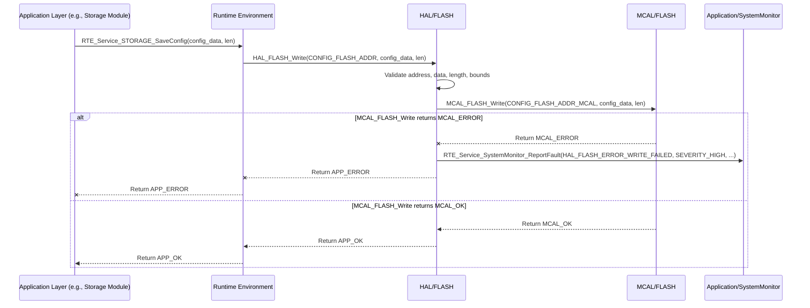

# **Detailed Design Document: HAL_FLASH Component**

## **1. Introduction**

### **1.1. Purpose**

This document details the design of the HAL_FLASH component, which provides a hardware abstraction layer for accessing the microcontroller's internal or external Flash memory. Its primary purpose is to offer a standardized, microcontroller-independent interface for erasing, writing, and reading data from Flash, abstracting the low-level memory operations and specific MCU details from higher layers (e.g., Application/storage, Service/ota).

### **1.2. Scope**

The scope of this document covers the HAL_FLASH module's architecture, functional behavior, interfaces, dependencies, and resource considerations. It details how the HAL layer interacts with the underlying Microcontroller Abstraction Layer (MCAL) for Flash operations.

### **1.3. References**

* Software Architecture Document (SAD) - Smart Device Firmware (Final Version)  
* MCAL Flash Driver Specification (Conceptual, as it's the lower layer)  
* MCU Datasheet / Reference Manual (for specific Flash memory capabilities)

## **2. Functional Description**

The HAL_FLASH component provides the following core functionalities:

1. **Flash Initialization**: Initialize the Flash memory interface.  
2. **Sector Erase**: Erase a specific sector or block of Flash memory.  
3. **Page Write**: Write a block of data to a specific Flash address.  
4. **Byte/Block Read**: Read data from a specific Flash address.  
5. **Error Reporting**: Report any failures during Flash operations (e.g., initialization failure, erase failure, write failure, read error, invalid address/length) to the SystemMonitor via RTE_Service_SystemMonitor_ReportFault().

## **3. Non-Functional Requirements**

### **3.1. Performance**

* **Write/Erase Speed**: Flash write and erase operations shall be performed within acceptable timeframes, especially critical for OTA updates.  
* **Read Speed**: Flash read operations shall be fast to minimize impact on system performance.  
* **Endurance**: The Flash memory interface shall support the specified number of erase/write cycles.

### **3.2. Memory**

* **Minimal Footprint**: The HAL_FLASH code and data shall have a minimal memory footprint.  
* **Buffer Management**: Efficiently manage internal buffers for write/read operations (if necessary).

### **3.3. Reliability**

* **Data Integrity**: Ensure data written to Flash is reliably stored and retrieved without corruption.  
* **Robustness**: The module shall handle invalid memory access attempts or hardware failures gracefully.  
* **Safety**: Prevent accidental erasure of critical firmware sections.

## **4. Architectural Context**

As per the SAD (Section 3.1.2, HAL Layer), HAL_FLASH resides in the Hardware Abstraction Layer. It acts as an intermediary between higher layers like Application/storage (for persistent configuration) and Service/ota (for firmware updates), and the MCAL_FLASH driver. HAL_FLASH translates generic Flash access requests into MCAL-specific calls.

## **5. Design Details**

### **5.1. Module Structure**

The HAL_FLASH component will consist of the following files:

* HAL/inc/hal_flash.h: Public header file containing function prototypes, data types, and error codes.  
* HAL/src/hal_flash.c: Source file containing the implementation of the HAL_FLASH functions.  
* HAL/cfg/hal_flash_cfg.h: Configuration header for Flash memory layout (base addresses, sector sizes, total size).

### **5.2. Public Interface (API)**
```c
// In HAL/inc/hal_flash.h

// Enum for Flash status/error codes  
typedef enum {  
    HAL_FLASH_OK = 0,  
    HAL_FLASH_ERROR_INIT_FAILED,  
    HAL_FLASH_ERROR_ERASE_FAILED,  
    HAL_FLASH_ERROR_WRITE_FAILED,  
    HAL_FLASH_ERROR_READ_FAILED,  
    HAL_FLASH_ERROR_INVALID_ADDRESS,  
    HAL_FLASH_ERROR_INVALID_LENGTH,  
    HAL_FLASH_ERROR_ALIGNMENT_ERROR,  
    // Add more specific errors as needed  
} HAL_FLASH_Status_t;

/**  
 * @brief Initializes the HAL_FLASH module and the underlying Flash memory interface.  
 * This function should be called once during system initialization.  
 * @return HAL_FLASH_OK on success, an error code on failure.  
 */  
HAL_FLASH_Status_t HAL_FLASH_Init(void);

/**  
 * @brief Erases a specified sector of Flash memory.  
 * @param sector_address The start address of the sector to erase. This address  
 * must be sector-aligned as defined in hal_flash_cfg.h.  
 * @return HAL_FLASH_OK on success, an error code on failure.  
 */  
HAL_FLASH_Status_t HAL_FLASH_EraseSector(uint32_t sector_address);

/**  
 * @brief Writes a block of data to Flash memory.  
 * The write operation might be page-aligned depending on the underlying hardware.  
 * @param address The start address to write to.  
 * @param data_out Pointer to the data buffer to write.  
 * @param data_len Length of the data to write.  
 * @return HAL_FLASH_OK on success, an error code on failure.  
 */  
HAL_FLASH_Status_t HAL_FLASH_Write(uint32_t address, const uint8_t *data_out, uint33_t data_len);

/**  
 * @brief Reads a block of data from Flash memory.  
 * @param address The start address to read from.  
 * @param data_in Pointer to the buffer to store read data.  
 * @param data_len Length of the data to read.  
 * @return HAL_FLASH_OK on success, an error code on failure.  
 */  
HAL_FLASH_Status_t HAL_FLASH_Read(uint32_t address, uint8_t *data_in, uint33_t data_len);

/**  
 * @brief Gets the size of a Flash sector.  
 * @return The size of a Flash sector in bytes.  
 */  
uint32_t HAL_FLASH_GetSectorSize(void);

/**  
 * @brief Gets the total size of the usable Flash memory.  
 * @return The total size of Flash memory in bytes.  
 */  
uint32_t HAL_FLASH_GetTotalSize(void);
```

### **5.3. Internal Design**

The HAL_FLASH module will act as a wrapper around the MCAL_FLASH functions. It will perform input validation (address alignment, bounds checking), parameter translation, and handle error reporting before delegating the actual memory access to the MCAL layer.

1. **Initialization (HAL_FLASH_Init)**:  
   * Call MCAL_FLASH_Init().  
   * If MCAL_FLASH_Init returns an error, report HAL_FLASH_ERROR_INIT_FAILED to SystemMonitor.  
   * Return HAL_FLASH_OK on success.  
2. **Erase Sector (HAL_FLASH_EraseSector)**:  
   * Validate sector_address for alignment (must be a multiple of HAL_FLASH_SECTOR_SIZE) and bounds (within usable Flash region).  
   * Call MCAL_FLASH_EraseSector(mcal_sector_address).  
   * If MCAL_FLASH_EraseSector returns an error, report HAL_FLASH_ERROR_ERASE_FAILED to SystemMonitor.  
3. **Write (HAL_FLASH_Write)**:  
   * Validate address, data_out, and data_len. Perform bounds checking.  
   * If the underlying MCAL requires page-aligned writes, HAL_FLASH might need to buffer and manage partial page writes or return HAL_FLASH_ERROR_ALIGNMENT_ERROR. For simplicity, assume MCAL_FLASH_Write handles byte-level writes or that HAL_FLASH buffers to page size.  
   * Call MCAL_FLASH_Write(mcal_address, data_out, data_len).  
   * If MCAL_FLASH_Write returns an error, report HAL_FLASH_ERROR_WRITE_FAILED to SystemMonitor.  
4. **Read (HAL_FLASH_Read)**:  
   * Validate address, data_in, and data_len. Perform bounds checking.  
   * Call MCAL_FLASH_Read(mcal_address, data_in, data_len).  
   * If MCAL_FLASH_Read returns an error, report HAL_FLASH_ERROR_READ_FAILED to SystemMonitor.  
5. **Get Size Information (HAL_FLASH_GetSectorSize, HAL_FLASH_GetTotalSize)**:  
   * These functions simply return the values defined in hal_flash_cfg.h.

**Sequence Diagram (Example: HAL_FLASH_Write):**


### **5.4. Dependencies**

* **Mcal/flash/inc/mcal_flash.h**: For calling low-level Flash driver functions.  
* **Application/logger/inc/logger.h**: For internal logging.  
* **Rte/inc/Rte.h**: For calling RTE_Service_SystemMonitor_ReportFault().  
* **Application/common/inc/app_common.h**: For APP_Status_t (though HAL_FLASH_Status_t is more specific).  
* **HAL/cfg/hal_flash_cfg.h**: For Flash memory layout configuration.

### **5.5. Error Handling**

* **Input Validation**: All public API functions will validate input parameters (e.g., valid addresses, non-NULL pointers, lengths within bounds).  
* **MCAL Error Propagation**: Errors returned by MCAL_FLASH functions will be caught by HAL_FLASH.  
* **Fault Reporting**: Upon detection of an error (invalid input, MCAL failure), HAL_FLASH will report a specific fault ID (e.g., HAL_FLASH_ERROR_INIT_FAILED, HAL_FLASH_ERROR_ERASE_FAILED, HAL_FLASH_ERROR_WRITE_FAILED, HAL_FLASH_ERROR_READ_FAILED, HAL_FLASH_ERROR_INVALID_ADDRESS) to SystemMonitor via the RTE service.  
* **Return Status**: All public API functions will return HAL_FLASH_Status_t indicating success or specific error.

### **5.6. Configuration**

The HAL/cfg/hal_flash_cfg.h file will contain:

* Base address of the usable Flash region.  
* Total usable Flash size.  
* Flash sector/block size.  
* Any specific memory map definitions (e.g., for bootloader, application banks, data storage).
```c
// Example: HAL/cfg/hal_flash_cfg.h  
#define HAL_FLASH_BASE_ADDRESS      0x00000000 // Example: Start of Flash  
#define HAL_FLASH_TOTAL_SIZE_BYTES  (2 * 1024 * 1024) // Example: 2 MB Flash  
#define HAL_FLASH_SECTOR_SIZE_BYTES (4 * 1024)      // Example: 4 KB sectors

// Define specific regions for application, data, etc.  
#define HAL_FLASH_APP_BANK_A_ADDR   0x00010000  
#define HAL_FLASH_APP_BANK_A_SIZE   0x00100000 // 1MB  
#define HAL_FLASH_CONFIG_DATA_ADDR  0x00110000  
#define HAL_FLASH_CONFIG_DATA_SIZE  0x00001000 // 4KB for config
```

### **5.7. Resource Usage**

* **Flash**: Minimal for the driver code itself.  
* **RAM**: Minimal for internal state. May require small buffers for write/read operations if MCAL has specific alignment/size requirements.  
* **CPU**: Low for read operations. Higher for erase/write operations due to their blocking nature and internal Flash controller operations.

## **6. Test Considerations**

### **6.1. Unit Testing**

* **Mock MCAL_FLASH**: Unit tests for HAL_FLASH will mock the MCAL_FLASH functions to isolate HAL_FLASH's logic.  
* **Test Cases**:  
  * HAL_FLASH_Init: Verify MCAL_FLASH_Init call and error propagation.  
  * HAL_FLASH_EraseSector: Test valid/invalid (unaligned, out-of-bounds) sector addresses. Verify MCAL_FLASH_EraseSector calls and error propagation.  
  * HAL_FLASH_Write: Test valid/invalid addresses, data, lengths (including boundary conditions, partial writes). Verify MCAL_FLASH_Write calls and error propagation.  
  * HAL_FLASH_Read: Test valid/invalid addresses, buffers, lengths. Verify MCAL_FLASH_Read calls and error propagation.  
  * HAL_FLASH_GetSectorSize/GetTotalSize: Verify correct return values from configuration.  
  * Error reporting: Verify that RTE_Service_SystemMonitor_ReportFault() is called with the correct fault ID on various error conditions.

### **6.2. Integration Testing**

* **HAL-MCAL Integration**: Verify that HAL_FLASH correctly interfaces with the actual MCAL_FLASH driver.  
* **Read/Write/Erase Cycles**: Perform sequences of erase, write, and read operations to verify data integrity.  
* **Boundary Conditions**: Test writing/reading at the very beginning, end, and across sector boundaries of the usable Flash region.  
* **Power Cycling**: Test data persistence across power cycles after write operations.  
* **Endurance Testing (Long-term)**: If possible, perform automated erase/write cycles to stress test Flash endurance, though this is often done at a lower driver level or during hardware validation.  
* **Fault Injection**: Simulate MCAL errors (e.g., by modifying MCAL return values in a test environment) to verify HAL_FLASH's error handling and reporting.

### **6.3. System Testing**

* **Configuration Persistence**: Verify that application configurations (e.g., operational ranges, schedules) saved via Application/storage (which uses HAL_FLASH) persist across reboots.  
* **OTA Updates**: Verify the entire OTA update process, including downloading new firmware (written to Flash via HAL_FLASH), and successful booting into the new firmware.  
* **System Robustness**: Observe system behavior during and after Flash operations to ensure no unexpected crashes or performance degradation.
