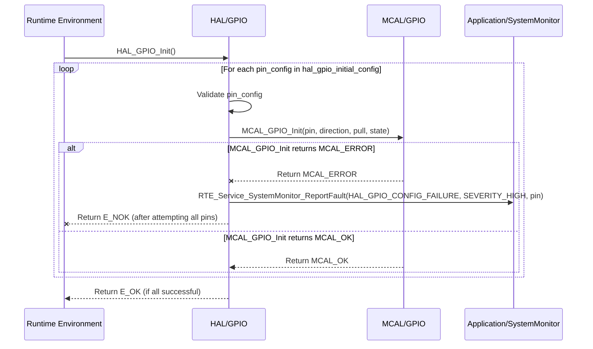

# Detailed Design Document: HAL_GPIO Component

## 1. Introduction

### 1.1. Purpose  
This document details the design of the HAL_GPIO component, which provides a hardware abstraction layer for General Purpose Input/Output (GPIO) pins. Its primary purpose is to offer a standardized, microcontroller-independent interface for configuring and controlling GPIO pins, abstracting the low-level register access and specific MCU details from higher layers.

### 1.2. Scope  
The scope of this document covers the HAL_GPIO module's architecture, functional behavior, interfaces, dependencies, and resource considerations. It details how the HAL layer interacts with the underlying Microcontroller Abstraction Layer (MCAL) for GPIO operations.

### 1.3. References  
- Software Architecture Document (SAD) - Environmental Monitoring & Control System (Final Version)  
- MCAL GPIO Driver Specification (Conceptual, as it's the lower layer)  
- MCU Datasheet / Reference Manual (for specific GPIO capabilities)

## 2. Functional Description  
The HAL_GPIO component provides the following core functionalities:  
- Pin Initialization: Configure individual GPIO pins for input or output, including pull-up/down resistors, drive strength, and initial state, based on a predefined configuration.  
- Digital Output Control: Set the state (high/low) of GPIO pins configured as outputs.  
- Digital Input Read: Read the current state (high/low) of GPIO pins configured as inputs.  
- Interrupt Configuration (Optional): Configure GPIO pins to trigger interrupts on specific edge transitions (rising, falling, both) and register callback functions.  
- Error Reporting: Report any failures during GPIO operations (e.g., invalid pin, configuration error) to the SystemMonitor via RTE_Service_SystemMonitor_ReportFault().

## 3. Non-Functional Requirements

### 3.1. Performance  
- Responsiveness: GPIO operations (setting/reading state) shall be highly responsive with minimal latency.  
- Throughput: High-frequency toggling or reading operations shall be supported where hardware permits.

### 3.2. Memory  
- Minimal Footprint: The HAL_GPIO code and data shall have a minimal memory footprint.  
- Configuration Storage: Configuration data for pins shall be stored efficiently.

### 3.3. Reliability  
- Robustness: The module shall handle invalid pin configurations or hardware access failures gracefully.  
- Safety: Incorrect GPIO operations (e.g., writing to an input pin) shall be prevented or flagged as errors.

## 4. Architectural Context  
As per the SAD (Section 3.1.2, HAL Layer), HAL_GPIO resides in the Hardware Abstraction Layer. It acts as an intermediary between Application/Service Layer components (via RTE services) and the MCAL_GPIO driver. HAL_GPIO translates generic GPIO requests into MCAL-specific calls.

## 5. Design Details

### 5.1. Module Structure  
The HAL_GPIO component will consist of the following files:  
- HAL/inc/hal_gpio.h: Public header file containing function prototypes, data types, and error codes.  
- HAL/src/hal_gpio.c: Source file containing the implementation of the HAL_GPIO functions.  
- HAL/cfg/hal_gpio_cfg.h: Configuration header for static pin definitions and initial settings.

### 5.2. Public Interface (API)  
```c
// In HAL/inc/hal_gpio.h

// Enum for pin direction
typedef enum {
    HAL_GPIO_DIRECTION_INPUT,
    HAL_GPIO_DIRECTION_OUTPUT
} HAL_GPIO_Direction_t;

// Enum for pin state
typedef enum {
    HAL_GPIO_STATE_LOW = 0,
    HAL_GPIO_STATE_HIGH = 1
} HAL_GPIO_State_t;

// Enum for pull-up/down resistors
typedef enum {
    HAL_GPIO_PULL_NONE,
    HAL_GPIO_PULL_UP,
    HAL_GPIO_PULL_DOWN
} HAL_GPIO_PullMode_t;

// Enum for interrupt trigger type
typedef enum {
    HAL_GPIO_INT_NONE,
    HAL_GPIO_INT_RISING_EDGE,
    HAL_GPIO_INT_FALLING_EDGE,
    HAL_GPIO_INT_BOTH_EDGES
} HAL_GPIO_InterruptTrigger_t;

// Function pointer for GPIO interrupt callbacks
typedef void (*HAL_GPIO_InterruptCallback_t)(uint8_t gpio_pin);

/**
 * @brief Initializes all GPIO pins based on the predefined configuration array.
 * This function should be called once during system initialization.
 * @return E_OK on success, E_NOK if any pin fails to initialize.
 */
APP_Status_t HAL_GPIO_Init(void);

/**
 * @brief Sets the state of an output GPIO pin.
 * @param gpio_pin The GPIO pin number.
 * @param state The desired state (HIGH/LOW).
 * @return E_OK on success, E_NOK on failure.
 */
APP_Status_t HAL_GPIO_SetState(uint8_t gpio_pin, HAL_GPIO_State_t state);

/**
 * @brief Toggles the state of an output GPIO pin.
 * @param gpio_pin The GPIO pin number.
 * @return E_OK on success, E_NOK on failure.
 */
APP_Status_t HAL_GPIO_ToggleState(uint8_t gpio_pin);

/**
 * @brief Reads the state of an input GPIO pin.
 * @param gpio_pin The GPIO pin number.
 * @param state Pointer to store the read state.
 * @return E_OK on success, E_NOK on failure.
 */
APP_Status_t HAL_GPIO_ReadState(uint8_t gpio_pin, HAL_GPIO_State_t *state);

/**
 * @brief Configures an interrupt for a GPIO pin.
 * @param gpio_pin The GPIO pin number.
 * @param trigger_type The type of edge trigger.
 * @param callback The function to call when the interrupt occurs.
 * @return E_OK on success, E_NOK on failure.
 */
APP_Status_t HAL_GPIO_ConfigInterrupt(uint8_t gpio_pin, HAL_GPIO_InterruptTrigger_t trigger_type,
                                      HAL_GPIO_InterruptCallback_t callback);

/**
 * @brief Enables the interrupt for a configured GPIO pin.
 * @param gpio_pin The GPIO pin number.
 * @return E_OK on success, E_NOK on failure.
 */
APP_Status_t HAL_GPIO_EnableInterrupt(uint8_t gpio_pin);

/**
 * @brief Disables the interrupt for a configured GPIO pin.
 * @param gpio_pin The GPIO pin number.
 * @return E_OK on success, E_NOK on failure.
 */
APP_Status_t HAL_GPIO_DisableInterrupt(uint8_t gpio_pin);
```

### 5.3. Internal Design

The HAL_GPIO module will primarily act as a wrapper around the MCAL_GPIO functions. It will perform input validation and error reporting before delegating the actual hardware access to the MCAL layer.

**Initialization (HAL_GPIO_Init):**  
This function will loop through the `hal_gpio_initial_config` array defined in `HAL/cfg/hal_gpio_cfg.h`.  
For each entry in the array:  
- Validate the `gpio_pin` against a predefined range.  
- Translate `HAL_GPIO_Direction_t`, `HAL_GPIO_PullMode_t`, and `HAL_GPIO_State_t` into MCAL_GPIO specific enums/macros.  
- Call `MCAL_GPIO_Init(mcal_pin, mcal_direction, mcal_pull, mcal_state)`.  
- If `MCAL_GPIO_Init` returns an error for any pin, report `HAL_GPIO_CONFIG_FAILURE` to SystemMonitor and return `E_NOK`. The loop should ideally continue to attempt to initialize remaining pins, or the design could specify halting on the first error depending on criticality. For this design, we'll assume it attempts all, but returns `E_NOK` if any fail.  
- If all pins are initialized successfully, return `E_OK`.  

**Set State (HAL_GPIO_SetState, HAL_GPIO_ToggleState):**  
- Validate `gpio_pin` and ensure it's configured as an output.  
- Call `MCAL_GPIO_SetState(mcal_pin, mcal_state)`.  
- If `MCAL_GPIO_SetState` returns an error, report `HAL_GPIO_STATE_ERROR` to SystemMonitor.  

**Read State (HAL_GPIO_ReadState):**  
- Validate `gpio_pin` and ensure it's configured as an input.  
- Call `MCAL_GPIO_ReadState(mcal_pin, &mcal_state)`.  
- Translate `mcal_state` back to `HAL_GPIO_State_t`.  
- If `MCAL_GPIO_ReadState` returns an error, report `HAL_GPIO_STATE_ERROR` to SystemMonitor.  

**Interrupt Configuration (HAL_GPIO_ConfigInterrupt, HAL_GPIO_EnableInterrupt, HAL_GPIO_DisableInterrupt):**  
- Maintain an internal array or map to store `HAL_GPIO_InterruptCallback_t` functions indexed by `gpio_pin`.  
- Validate `gpio_pin` and `trigger_type`.  
- Translate `HAL_GPIO_InterruptTrigger_t` to MCAL_GPIO specific values.  
- Call `MCAL_GPIO_ConfigInterrupt(mcal_pin, mcal_trigger, internal_isr_handler)`. The `internal_isr_handler` will be a generic ISR in HAL_GPIO that retrieves the correct `HAL_GPIO_InterruptCallback_t` from the internal map and calls it.  
- Call `MCAL_GPIO_EnableInterrupt(mcal_pin)` / `MCAL_GPIO_DisableInterrupt(mcal_pin)`.  
- Report `HAL_GPIO_INTERRUPT_FAILURE` if any MCAL call fails.  

**Sequence Diagram (Example: HAL_GPIO_Init - Module Level):**



### 5.4. Dependencies

- `Mcal/gpio/inc/mcal_gpio.h`: For calling low-level GPIO driver functions.  
- `Application/logger/inc/logger.h`: For internal logging.  
- `Rte/inc/Rte.h`: For calling `RTE_Service_SystemMonitor_ReportFault()`.  
- `Application/common/inc/common.h`: For `APP_Status_t` and `E_OK`/`E_NOK`.  
- `HAL/cfg/hal_gpio_cfg.h`: For the `hal_gpio_initial_config` array and `HAL_GPIO_ConfigEntry_t` structure.  

---

### 5.5. Error Handling

- **Input Validation:** All public API functions will validate input parameters (e.g., valid pin number, correct direction for operation).  
- **MCAL Error Propagation:** Errors returned by MCAL_GPIO functions will be caught by HAL_GPIO.  
- **Fault Reporting:** Upon detection of an error (invalid input, MCAL failure), HAL_GPIO will report a specific fault ID (e.g., `HAL_GPIO_CONFIG_FAILURE`, `HAL_GPIO_STATE_ERROR`, `HAL_GPIO_INTERRUPT_FAILURE`) to SystemMonitor via the RTE service.  
- **Return Status:** All public API functions will return `E_NOK` on failure. `HAL_GPIO_Init` will return `E_NOK` if any pin fails to initialize.  

---

### 5.6. Configuration

The `HAL/cfg/hal_gpio_cfg.h` file will contain:  
- Macros or enums for mapping logical pin names (e.g., `LED1_GPIO_PIN`) to physical MCU pin numbers.  
- The `hal_gpio_initial_config` array, which defines the initial configuration for all GPIO pins used by the system.  
- The size of the `hal_gpio_initial_config` array.  

~~~~c
// Example: HAL/cfg/hal_gpio_cfg.h
#define LED1_GPIO_PIN           2
#define BUTTON1_GPIO_PIN        4
#define FAN_PWM_GPIO_PIN        5

// Initial configuration array (optional, can be done via HAL_GPIO_Init calls)
typedef struct {
    uint8_t pin;
    HAL_GPIO_Direction_t direction;
    HAL_GPIO_PullMode_t pull_mode;
    HAL_GPIO_State_t initial_state;
} HAL_GPIO_ConfigEntry_t;

extern const HAL_GPIO_ConfigEntry_t hal_gpio_initial_config[];
extern const uint32_t hal_gpio_initial_config_size;
~~~~

---

### 5.7. Resource Usage

- **Flash:** Moderate, depending on the number of API functions and interrupt handlers, and the size of the `hal_gpio_initial_config` array.  
- **RAM:** Minimal for internal state (e.g., callback function pointers for interrupts).  
- **CPU:** Very low for basic operations, higher for interrupt handling and during the initial `HAL_GPIO_Init` loop.  

---

### 6. Test Considerations

#### 6.1. Unit Testing

- **Mock MCAL_GPIO:** Unit tests for HAL_GPIO will mock the MCAL_GPIO functions to isolate HAL_GPIO's logic.  
- **Test Cases:**  
  - `HAL_GPIO_Init`: Test with a valid `hal_gpio_initial_config` array. Verify that `MCAL_GPIO_Init` is called for each entry. Test scenarios where `MCAL_GPIO_Init` fails for one or more pins (verify `E_NOK` return and SystemMonitor fault reporting).  
  - `HAL_GPIO_SetState`/`ToggleState`: Test setting/toggling valid output pins. Test behavior on input pins (should return error). Verify correct MCAL calls.  
  - `HAL_GPIO_ReadState`: Test reading valid input pins. Test behavior on output pins (should return error). Verify correct MCAL calls and state translation.  
  - `HAL_GPIO_ConfigInterrupt`: Test valid/invalid pin, all trigger types. Verify callback registration and MCAL interrupt configuration calls.  
  - Error reporting: Verify that `RTE_Service_SystemMonitor_ReportFault()` is called with the correct fault ID on error conditions.  

#### 6.2. Integration Testing

- **HAL-MCAL Integration:** Verify that HAL_GPIO correctly interfaces with the actual MCAL_GPIO driver.  
- **Basic I/O:** Connect LEDs and buttons/switches to GPIOs and verify their functionality through HAL_GPIO calls.  
- **Interrupts:** Verify that configured GPIO interrupts trigger the correct HAL_GPIO callbacks.  
- **Fault Reporting:** Trigger MCAL errors (e.g., by simulating hardware issues if possible) and verify that HAL_GPIO reports faults to SystemMonitor.  

#### 6.3. System Testing

- **Full System Functionality:** Verify that all application features relying on GPIOs (e.g., LED indications, button presses, actuator control via relays) work correctly within the integrated system.  
- **Power Modes:** Ensure GPIOs behave correctly during power mode transitions (e.g., retaining state in sleep, re-initializing on wake-up).  
