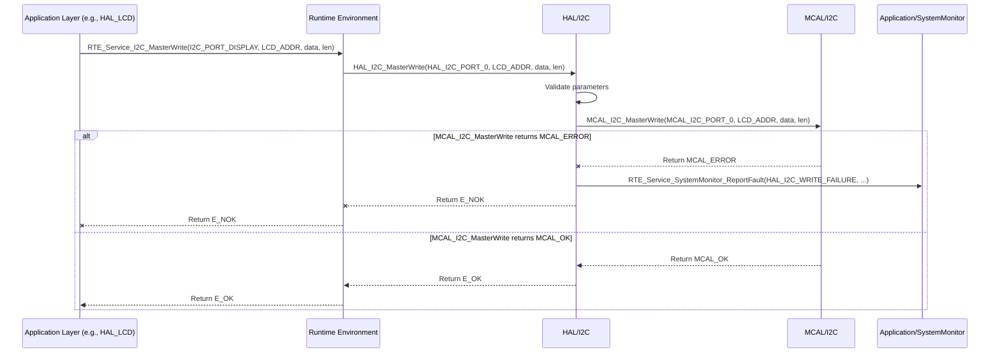

# **Detailed Design Document: HAL_I2C Component**

## **1. Introduction**

### **1.1. Purpose**

This document details the design of the HAL_I2C component, which provides a hardware abstraction layer for Inter-Integrated Circuit (I2C) communication. Its primary purpose is to offer a standardized, microcontroller-independent interface for configuring and performing I2C master operations, abstracting the low-level register access and specific MCU details from higher layers. It will support communication with I2C-based sensors (e.g., some temperature/humidity sensors) and displays (e.g., character LCDs with I2C expanders).

### **1.2. Scope**

The scope of this document covers the HAL_I2C module's architecture, functional behavior, interfaces, dependencies, and resource considerations. It details how the HAL layer interacts with the underlying Microcontroller Abstraction Layer (MCAL) for I2C operations.

### **1.3. References**

* Software Architecture Document (SAD) - Environmental Monitoring & Control System (Final Version)  
* MCAL I2C Driver Specification (Conceptual, as it's the lower layer)  
* MCU Datasheet / Reference Manual (for specific I2C capabilities)  
* I2C Bus Specification (NXP/Philips)

## **2. Functional Description**

The HAL_I2C component provides the following core functionalities:

1. **I2C Initialization**: Configure the I2C peripheral, including bus speed (baud rate), master/slave mode (this design focuses on master mode), and GPIO pins for SDA and SCL.  
2. **I2C Write**: Transmit data bytes to a specified I2C slave device at a given address.  
3. **I2C Read**: Read data bytes from a specified I2C slave device at a given address.  
4. **I2C Write-Read (Combined)**: Perform a combined write followed by a read operation without releasing the bus, common for reading registers from sensor devices.  
5. **Error Reporting**: Report any failures during I2C operations (e.g., NACK, bus arbitration loss, timeout) to the SystemMonitor via RTE_Service_SystemMonitor_ReportFault().

## **3. Non-Functional Requirements**

### **3.1. Performance**

* **Communication Speed**: I2C transactions shall meet the specified bus speeds (e.g., 100 kHz, 400 kHz) to ensure timely data exchange with peripherals.  
* **Responsiveness**: I2C operations shall be non-blocking where possible (e.g., using DMA or interrupts internally in MCAL) or have clearly defined timeouts to prevent system stalls.  
* **Throughput**: Capable of handling multiple I2C transactions per second.

### **3.2. Memory**

* **Minimal Footprint**: The HAL_I2C code and data shall have a minimal memory footprint.  
* **Buffer Management**: Efficient use of transmit/receive buffers.

### **3.3. Reliability**

* **Robustness**: The module shall handle bus errors (e.g., NACK, arbitration loss, bus stuck low) gracefully, attempting recovery or reporting faults.  
* **Data Integrity**: Ensure data transmitted and received over I2C is uncorrupted.  
* **Thread Safety**: If multiple tasks might access the I2C bus, internal mutex protection will be implemented (or assumed to be handled by MCAL if it provides a blocking, single-access interface). For this design, we'll assume the MCAL handles concurrency or that higher layers ensure single access.

## **4. Architectural Context**

As per the SAD (Section 3.1.2, HAL Layer), HAL_I2C resides in the Hardware Abstraction Layer. It acts as an intermediary between Service Layer modules (e.g., HAL_DisplayDriver for LCDs, or HAL_SensorDriver for I2C sensors) and the MCAL_I2C driver. HAL_I2C translates generic I2C requests into MCAL-specific calls.

## **5. Design Details**

### **5.1. Module Structure**

The HAL_I2C component will consist of the following files:

* HAL/inc/hal_i2c.h: Public header file containing function prototypes, data types, and error codes.  
* HAL/src/hal_i2c.c: Source file containing the implementation of the HAL_I2C functions.  
* HAL/cfg/hal_i2c_cfg.h: Configuration header for I2C bus definitions (e.g., port, speed, SDA/SCL pins).

### **5.2. Public Interface (API)**

// In HAL/inc/hal_i2c.h

```c
#include "Application/common/inc/common.h" // For APP_Status_t  
#include <stdint.h>   // For uint8_t, uint16_t

// Enum for I2C bus ports (if MCU has multiple I2C peripherals)  
typedef enum {  
    HAL_I2C_PORT_0,  
    HAL_I2C_PORT_1,  
    // Add more ports if applicable  
    HAL_I2C_PORT_COUNT  
} HAL_I2C_Port_t;

// Enum for I2C bus speed  
typedef enum {  
    HAL_I2C_SPEED_100KHZ,  
    HAL_I2C_SPEED_400KHZ,  
    // Add more speeds if applicable (e.g., 1MHz)  
} HAL_I2C_Speed_t;

// Structure for I2C bus configuration  
typedef struct {  
    HAL_I2C_Port_t  port;  
    HAL_I2C_Speed_t speed;  
    uint8_t         sda_gpio_pin;  
    uint8_t         scl_gpio_pin;  
} HAL_I2C_Config_t;

/**  
 * @brief Initializes the specified I2C bus.  
 * This function should be called once for each I2C bus used during system initialization.  
 * @param config Pointer to the configuration structure for the I2C bus.  
 * @return E_OK on success, E_NOK on failure.  
 */  
APP_Status_t HAL_I2C_Init(const HAL_I2C_Config_t *config);

/**  
 * @brief Writes data to an I2C slave device.  
 * @param port The I2C bus port to use.  
 * @param slave_address The 7-bit I2C slave address.  
 * @param data Pointer to the data buffer to write.  
 * @param data_len The number of bytes to write.  
 * @return E_OK on success, E_NOK on failure (e.g., NACK, timeout).  
 */  
APP_Status_t HAL_I2C_MasterWrite(HAL_I2C_Port_t port, uint8_t slave_address,  
                                 const uint8_t *data, uint16_t data_len);

/**  
 * @brief Reads data from an I2C slave device.  
 * @param port The I2C bus port to use.  
 * @param slave_address The 7-bit I2C slave address.  
 * @param data Pointer to the buffer to store read data.  
 * @param data_len The number of bytes to read.  
 * @return E_OK on success, E_NOK on failure (e.g., NACK, timeout).  
 */  
APP_Status_t HAL_I2C_MasterRead(HAL_I2C_Port_t port, uint8_t slave_address,  
                                uint8_t *data, uint16_t data_len);

/**  
 * @brief Performs a combined I2C write then read operation.  
 * This is typically used to write a register address and then read its value.  
 * @param port The I2C bus port to use.  
 * @param slave_address The 7-bit I2C slave address.  
 * @param write_data Pointer to the data buffer to write (e.g., register address).  
 * @param write_len The number of bytes to write.  
 * @param read_data Pointer to the buffer to store read data.  
 * @param read_len The number of bytes to read.  
 * @return E_OK on success, E_NOK on failure.  
 */  
APP_Status_t HAL_I2C_MasterWriteRead(HAL_I2C_Port_t port, uint8_t slave_address,  
                                     const uint8_t *write_data, uint16_t write_len,  
                                     uint8_t *read_data, uint16_t read_len);
```

### **5.3. Internal Design**

The HAL_I2C module will primarily act as a wrapper around the MCAL_I2C functions. It will perform input validation and error reporting before delegating the actual hardware access to the MCAL layer.

1. **Initialization (HAL_I2C_Init)**:  
   * Validate the config pointer and its contents (e.g., valid port, sda_gpio_pin, scl_gpio_pin).  
   * Translate HAL_I2C_Speed_t into MCAL_I2C specific baud rate values.  
   * Call MCAL_I2C_Init(mcal_port, mcal_speed, mcal_sda_pin, mcal_scl_pin).  
   * If MCAL_I2C_Init returns an error, report HAL_I2C_INIT_FAILURE to SystemMonitor and return E_NOK.  
   * Return E_OK.  
2. **Master Write (HAL_I2C_MasterWrite)**:  
   * Validate port, slave_address, data pointer, and data_len.  
   * Call MCAL_I2C_MasterWrite(mcal_port, mcal_slave_address, mcal_data, mcal_data_len).  
   * If MCAL_I2C_MasterWrite returns an error (e.g., NACK, timeout), report HAL_I2C_WRITE_FAILURE to SystemMonitor.  
   * Return E_OK or E_NOK based on MCAL return.  
3. **Master Read (HAL_I2C_MasterRead)**:  
   * Validate port, slave_address, data pointer, and data_len.  
   * Call MCAL_I2C_MasterRead(mcal_port, mcal_slave_address, mcal_data, mcal_data_len).  
   * If MCAL_I2C_MasterRead returns an error, report HAL_I2C_READ_FAILURE to SystemMonitor.  
   * Return E_OK or E_NOK.  
4. **Master Write-Read (HAL_I2C_MasterWriteRead)**:  
   * Validate all input parameters.  
   * Call MCAL_I2C_MasterWriteRead(mcal_port, mcal_slave_address, mcal_write_data, mcal_write_len, mcal_read_data, mcal_read_len).  
   * If MCAL_I2C_MasterWriteRead returns an error, report HAL_I2C_WRITEREAD_FAILURE to SystemMonitor.  
   * Return E_OK or E_NOK.

**Sequence Diagram (Example: HAL_I2C_MasterWrite):**



### **5.4. Dependencies**

* Mcal/i2c/inc/mcal_i2c.h: For calling low-level I2C driver functions.  
* Application/logger/inc/logger.h: For internal logging.  
* Rte/inc/Rte.h: For calling RTE_Service_SystemMonitor_ReportFault().  
* Application/common/inc/common.h: For APP_Status_t and E_OK/E_NOK.  
* HAL/cfg/hal_i2c_cfg.h: For the HAL_I2C_Config_t structure and any predefined bus configurations.

### **5.5. Error Handling**

* **Input Validation**: All public API functions will validate input parameters (e.g., valid port, non-NULL data pointers, non-zero lengths).  
* **MCAL Error Propagation**: Errors returned by MCAL_I2C functions (e.g., NACK, timeout, bus error) will be caught by HAL_I2C.  
* **Fault Reporting**: Upon detection of an error (invalid input, MCAL failure), HAL_I2C will report a specific fault ID (e.g., HAL_I2C_INIT_FAILURE, HAL_I2C_WRITE_FAILURE, HAL_I2C_READ_FAILURE, HAL_I2C_WRITEREAD_FAILURE) to SystemMonitor via the RTE service. The severity can be adjusted based on the criticality of the I2C device.  
* **Return Status**: All public API functions will return E_NOK on failure.

### **5.6. Configuration**

The HAL/cfg/hal_i2c_cfg.h file will contain:

```c
/* Macros or enums for mapping logical I2C bus names (e.g., I2C_BUS_DISPLAY, I2C_BUS_SENSORS) to physical HAL_I2C_Port_t values.  
* Definitions for the HAL_I2C_Config_t structures for each I2C bus used in the system, specifying their speed and associated GPIO pins.
*/
// Example: HAL/cfg/hal_i2c_cfg.h  
#ifndef HAL_I2C_CFG_H  
#define HAL_I2C_CFG_H

#include "HAL/inc/hal_i2c.h" // For HAL_I2C_Config_t, etc.  
#include "Mcal/gpio/inc/mcal_gpio.h" // For MCAL_GPIO_PIN_X definitions

// Define logical I2C bus ports  
#define I2C_BUS_DISPLAY     HAL_I2C_PORT_0  
#define I2C_BUS_SENSORS     HAL_I2C_PORT_1 // If a second I2C bus is available/needed

// Configuration for I2C_BUS_DISPLAY  
const HAL_I2C_Config_t hal_i2c_config_display = {  
    .port = I2C_BUS_DISPLAY,  
    .speed = HAL_I2C_SPEED_100KHZ,  
    .sda_gpio_pin = MCAL_GPIO_PIN_22, // Example SDA pin  
    .scl_gpio_pin = MCAL_GPIO_PIN_23  // Example SCL pin  
};

// Configuration for I2C_BUS_SENSORS (if applicable)  
const HAL_I2C_Config_t hal_i2c_config_sensors = {  
    .port = I2C_BUS_SENSORS,  
    .speed = HAL_I2C_SPEED_400KHZ,  
    .sda_gpio_pin = MCAL_GPIO_PIN_24, // Example SDA pin  
    .scl_gpio_pin = MCAL_GPIO_PIN_25  // Example SCL pin  
};

#endif // HAL_I2C_CFG_H
```

### **5.7. Resource Usage**

* **Flash**: Moderate, for I2C protocol handling, error checks, and configuration data.  
* **RAM**: Low, for internal state variables and temporary buffers during transactions.  
* **CPU**: Can be low for simple blocking operations, but higher if MCAL uses interrupts/DMA and requires more complex state management.

## **6. Test Considerations**

### **6.1. Unit Testing**

* **Mock MCAL_I2C**: Unit tests for HAL_I2C will mock the MCAL_I2C functions to isolate HAL_I2C's logic.  
* **Test Cases**:  
  * HAL_I2C_Init: Test with valid/invalid HAL_I2C_Config_t. Verify MCAL_I2C_Init is called with correct parameters. Test scenarios where MCAL_I2C_Init fails (verify E_NOK return and SystemMonitor fault reporting).  
  * HAL_I2C_MasterWrite: Test with valid data/address. Test NULL data/zero length. Test scenarios where MCAL_I2C_MasterWrite returns NACK/timeout (verify E_NOK and fault reporting).  
  * HAL_I2C_MasterRead: Similar tests for read operations.  
  * HAL_I2C_MasterWriteRead: Test combined operations.  
  * Error reporting: Verify that RTE_Service_SystemMonitor_ReportFault() is called with the correct fault ID and severity on various error conditions.

### **6.2. Integration Testing**

* **HAL-MCAL Integration**: Verify that HAL_I2C correctly interfaces with the actual MCAL_I2C driver.  
* **Peripheral Communication**: Connect actual I2C slave devices (e.g., an LCD with an I2C expander, a temperature sensor) and verify HAL_I2C can successfully write to and read from them.  
* **Bus Error Simulation**: Introduce I2C bus errors (e.g., pull SDA/SCL low, disconnect a device) and verify HAL_I2C detects and reports these faults to SystemMonitor.  
* **Multi-Device/Multi-Port**: If multiple devices or I2C ports are used, verify they operate concurrently without interference.

### **6.3. System Testing**

* **End-to-End Functionality**: Verify that application features relying on I2C (e.g., display updates, I2C sensor readings) work correctly within the integrated system.  
* **Long-Term Reliability**: Run the system for extended periods to ensure stable I2C communication and proper error handling under continuous operation.  
* **Power Modes**: Ensure I2C peripheral behaves correctly during power mode transitions (e.g., re-initialization on wake-up from sleep).
