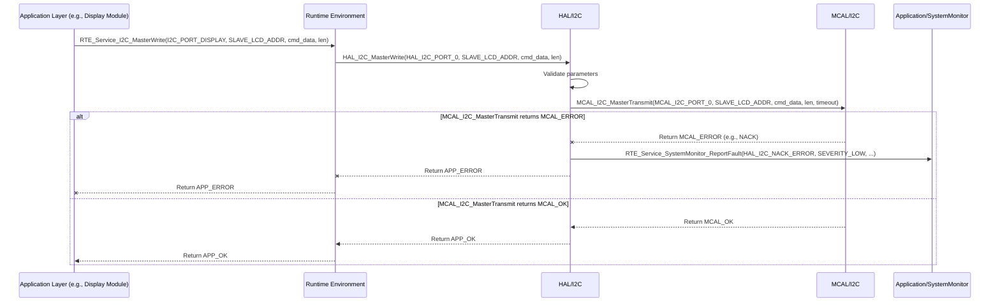

# **Detailed Design Document: HAL_I2C Component**

## **1. Introduction**

### **1.1. Purpose**

This document details the design of the HAL_I2C component, which provides a hardware abstraction layer for Inter-Integrated Circuit (I2C) communication peripherals. Its primary purpose is to offer a standardized, microcontroller-independent interface for managing I2C bus operations, abstracting the low-level register access and specific MCU details from higher layers.

### **1.2. Scope**

The scope of this document covers the HAL_I2C module's architecture, functional behavior, interfaces, dependencies, and resource considerations. It details how the HAL layer interacts with the underlying Microcontroller Abstraction Layer (MCAL) for I2C operations.

### **1.3. References**

* Software Architecture Document (SAD) - Smart Device Firmware (Final Version)  
* MCAL I2C Driver Specification (Conceptual, as it's the lower layer)  
* MCU Datasheet / Reference Manual (for specific I2C capabilities)  
* I2C Bus Specification

## **2. Functional Description**

The HAL_I2C component provides the following core functionalities:

1. I2C Initialization: Configure specific I2C master units, including clock speed (baud rate), GPIO pins for SDA/SCL, and optional pull-up resistors.  
2. Master Transmit: Send a block of bytes to a specific I2C slave device address.  
3. Master Receive: Receive a block of bytes from a specific I2C slave device address.  
4. Master Transmit-Receive (Combined): Perform a combined write-then-read operation (e.g., sending a register address then reading data from that address).  
5. Error Reporting: Report any failures during I2C operations (e.g., initialization failure, NACK, arbitration loss, bus timeout) to the SystemMonitor via RTE_Service_SystemMonitor_ReportFault().

## **3. Non-Functional Requirements**

### **3.1. Performance**

* Speed: Support standard and fast-mode I2C clock speeds (e.g., 100 kHz, 400 kHz).  
* Reliability: Ensure robust data transfer over the I2C bus, minimizing data corruption or loss.  
* Blocking/Non-Blocking (Optional): Support both blocking (synchronous) and potentially non-blocking (asynchronous, with callbacks) operations for flexibility. This design focuses on blocking for simplicity.

### **3.2. Memory**

* Minimal Footprint: The HAL_I2C code and data shall have a minimal memory footprint.  
* Buffer Management: Efficiently manage transmit and receive buffers for I2C transactions.

### **3.3. Reliability**

* Robustness: The module shall handle bus errors (e.g., NACK, arbitration loss, bus hang) gracefully.  
* Fault Isolation: Failures in I2C communication should be isolated and reported without crashing the system.  
* Timeout Handling: Implement timeouts for I2C transactions to prevent indefinite waiting.

## **4. Architectural Context**

As per the SAD (Section 3.1.2, HAL Layer), HAL_I2C resides in the Hardware Abstraction Layer. It acts as an intermediary between higher layers (e.g., Application/display, Application/temperature for digital I2C sensors) and the MCAL_I2C driver. HAL_I2C translates generic I2C requests into MCAL-specific calls.

## **5. Design Details**

### **5.1. Module Structure**

The HAL_I2C component will consist of the following files:

* HAL/inc/hal_i2c.h: Public header file containing function prototypes, data types, and error codes.  
* HAL/src/hal_i2c.c: Source file containing the implementation of the HAL_I2C functions.  
* HAL/cfg/hal_i2c_cfg.h: Configuration header for static I2C bus definitions and initial settings.

### **5.2. Public Interface (API)**
```c
// In HAL/inc/hal_i2c.h

// Enum for I2C port IDs (logical identifiers for each hardware I2C instance)  
typedef enum {  
    HAL_I2C_PORT_0,  
    HAL_I2C_PORT_1,  
    // Add more I2C ports as needed based on hardware availability  
    HAL_I2C_PORT_COUNT  
} HAL_I2C_PortId_t;

// Structure for initial I2C bus configuration  
typedef struct {  
    HAL_I2C_PortId_t port_id;  
    uint32_t clk_speed_hz;  // I2C clock speed in Hz (e.g., 100000 for 100kHz)  
    uint8_t sda_gpio_pin;   // GPIO pin for SDA  
    uint8_t scl_gpio_pin;   // GPIO pin for SCL  
    bool sda_pullup_enable; // Enable internal pull-up for SDA  
    bool scl_pullup_enable; // Enable internal pull-up for SCL  
    uint32_t timeout_ms;    // Default transaction timeout in milliseconds  
} HAL_I2C_Config_t;

/**  
 * @brief Initializes all configured I2C peripherals based on the predefined array.  
 * This function should be called once during system initialization.  
 * @return APP_OK on success, APP_ERROR if any I2C port fails to initialize.  
 */  
APP_Status_t HAL_I2C_Init(void);

/**  
 * @brief Performs an I2C master write operation.  
 * @param port_id The ID of the I2C port to use.  
 * @param slave_address The 7-bit I2C slave address.  
 * @param data_out Pointer to the data buffer to transmit.  
 * @param data_out_len Length of the data to transmit.  
 * @return APP_OK on success, APP_ERROR on failure.  
 */  
APP_Status_t HAL_I2C_MasterWrite(HAL_I2C_PortId_t port_id, uint8_t slave_address,  
                                 const uint8_t *data_out, uint16_t data_out_len);

/**  
 * @brief Performs an I2C master read operation.  
 * @param port_id The ID of the I2C port to use.  
 * @param slave_address The 7-bit I2C slave address.  
 * @param data_in Pointer to the buffer to store received data.  
 * @param data_in_len Length of the data to receive.  
 * @return APP_OK on success, APP_ERROR on failure.  
 */  
APP_Status_t HAL_I2C_MasterRead(HAL_I2C_PortId_t port_id, uint8_t slave_address,  
                                uint8_t *data_in, uint16_t data_in_len);

/**  
 * @brief Performs a combined I2C master write-then-read operation.  
 * This is typically used to write a register address and then read data from it.  
 * @param port_id The ID of the I2C port to use.  
 * @param slave_address The 7-bit I2C slave address.  
 * @param data_out Pointer to the data buffer to transmit (e.g., register address).  
 * @param data_out_len Length of the data to transmit.  
 * @param data_in Pointer to the buffer to store received data.  
 * @param data_in_len Length of the data to receive.  
 * @return APP_OK on success, APP_ERROR on failure.  
 */  
APP_Status_t HAL_I2C_MasterWriteRead(HAL_I2C_PortId_t port_id, uint8_t slave_address,  
                                     const uint8_t *data_out, uint16_t data_out_len,  
                                     uint8_t *data_in, uint16_t data_in_len);
```
### **5.3. Internal Design**

The HAL_I2C module will act as a wrapper around the MCAL_I2C functions. It will perform input validation, parameter translation, and handle error reporting before delegating the actual hardware access to the MCAL layer.

1. **Initialization (HAL_I2C_Init)**:  
   * This function will **loop through the hal_i2c_initial_config array** defined in HAL/cfg/hal_i2c_cfg.h.  
   * For each entry in the array:  
     * Validate the port_id against HAL_I2C_PORT_COUNT.  
     * Call MCAL_I2C_Init(mcal_port_id, mcal_clk_speed, mcal_sda_pin, mcal_scl_pin, mcal_sda_pullup, mcal_scl_pullup).  
     * If MCAL_I2C_Init returns an error for *any* port, report HAL_I2C_INIT_FAILURE to SystemMonitor. The function should continue to attempt to initialize remaining ports but will ultimately return APP_ERROR if any initialization fails.  
   * If all I2C ports are initialized successfully, return APP_OK.  
2. **Master Write (HAL_I2C_MasterWrite)**:  
   * Validate port_id, slave_address, data_out, and data_out_len.  
   * Call MCAL_I2C_MasterTransmit(mcal_port_id, mcal_slave_address, data_out, data_out_len, config->timeout_ms).  
   * If MCAL_I2C_MasterTransmit returns an error, translate the MCAL error code into a HAL_I2C specific fault (e.g., HAL_I2C_NACK_ERROR, HAL_I2C_BUS_TIMEOUT, HAL_I2C_ARBITRATION_LOSS) and report to SystemMonitor.  
3. **Master Read (HAL_I2C_MasterRead)**:  
   * Validate port_id, slave_address, data_in, and data_in_len.  
   * Call MCAL_I2C_MasterReceive(mcal_port_id, mcal_slave_address, data_in, data_in_len, config->timeout_ms).  
   * If MCAL_I2C_MasterReceive returns an error, translate and report the fault to SystemMonitor.  
4. **Master Write-Read (HAL_I2C_MasterWriteRead)**:  
   * Validate all input parameters.  
   * This function will typically perform two sequential MCAL calls:  
     * MCAL_I2C_MasterTransmit(mcal_port_id, mcal_slave_address, data_out, data_out_len, config->timeout_ms, true /* no_stop_bit */). The true for no_stop_bit is crucial to keep the bus active for the subsequent read.  
     * MCAL_I2C_MasterReceive(mcal_port_id, mcal_slave_address, data_in, data_in_len, config->timeout_ms).  
   * If either MCAL call returns an error, translate and report the fault to SystemMonitor. Ensure proper error handling if the first transmit fails before the receive.

**Sequence Diagram (Example: HAL_I2C_MasterWrite):**

### **5.4. Dependencies**

* **Mcal/i2c/inc/mcal_i2c.h**: For calling low-level I2C driver functions.  
* **Application/logger/inc/logger.h**: For internal logging.  
* **Rte/inc/Rte.h**: For calling RTE_Service_SystemMonitor_ReportFault().  
* **Application/common/inc/app_common.h**: For APP_Status_t and APP_OK/APP_ERROR.  
* **HAL/cfg/hal_i2c_cfg.h**: For the hal_i2c_initial_config array and HAL_I2C_Config_t structure.

### **5.5. Error Handling**

* **Input Validation**: All public API functions will validate input parameters (e.g., valid port_id, non-NULL pointers, valid lengths, valid slave address).  
* **MCAL Error Propagation**: Errors returned by MCAL_I2C functions will be caught by HAL_I2C.  
* **Fault Reporting**: Upon detection of an error (invalid input, MCAL failure, I2C bus error), HAL_I2C will report a specific fault ID (e.g., HAL_I2C_INIT_FAILURE, HAL_I2C_NACK_ERROR, HAL_I2C_ARBITRATION_LOSS, HAL_I2C_BUS_TIMEOUT, HAL_I2C_TRANSACTION_FAILURE) to SystemMonitor via the RTE service.  
* **Return Status**: All public API functions will return APP_ERROR on failure. HAL_I2C_Init will return APP_ERROR if *any* port fails to initialize.

### **5.6. Configuration**

The HAL/cfg/hal_i2c_cfg.h file will contain:

* Macros or enums for logical I2C port IDs (e.g., I2C_PORT_DISPLAY_LCD, I2C_PORT_TEMP_HUM_SENSOR).  
* The hal_i2c_initial_config array, which defines the initial configuration for all I2C peripherals used by the system.  
* The size of the hal_i2c_initial_config array.
  
```c
// Example: HAL/cfg/hal_i2c_cfg.h  
#define I2C_PORT_DISPLAY_LCD            HAL_I2C_PORT_0  
#define I2C_PORT_TEMP_HUM_SENSOR        HAL_I2C_PORT_1

// Initial configuration array  
extern const HAL_I2C_Config_t hal_i2c_initial_config[];  
extern const uint32_t hal_i2c_initial_config_size;
```

### **5.7. Resource Usage**

* **Flash**: Moderate, depending on the number of API functions and the size of the hal_i2c_initial_config array.  
* **RAM**: Minimal for internal state and transaction buffers.  
* **CPU**: Low for individual transactions. Can increase with high data rates, frequent transactions, or complex error recovery.

## **6. Test Considerations**

### **6.1. Unit Testing**

* **Mock MCAL_I2C**: Unit tests for HAL_I2C will mock the MCAL_I2C functions to isolate HAL_I2C's logic.  
* **Test Cases**:  
  * HAL_I2C_Init: Test with a valid hal_i2c_initial_config array. Verify MCAL_I2C_Init calls for each entry. Test scenarios where MCAL calls fail (verify APP_ERROR return and SystemMonitor fault reporting).  
  * HAL_I2C_MasterWrite: Test valid/invalid parameters. Mock MCAL_I2C_MasterTransmit to simulate success, NACK, timeout, arbitration loss. Verify correct return status and fault reporting.  
  * HAL_I2C_MasterRead: Similar to write, test valid/invalid parameters and mock MCAL_I2C_MasterReceive for various outcomes.  
  * HAL_I2C_MasterWriteRead: Test combined operations, ensuring correct sequential calls to MCAL_I2C_MasterTransmit (with no stop bit) and MCAL_I2C_MasterReceive. Test error handling if the write part fails before the read.  
  * Error reporting: Verify that RTE_Service_SystemMonitor_ReportFault() is called with the correct fault ID on various error conditions.

### **6.2. Integration Testing**

* **HAL-MCAL Integration**: Verify that HAL_I2C correctly interfaces with the actual MCAL_I2C driver.  
* **Loopback Test (Conceptual)**: While true I2C loopback is complex, a simple test might involve connecting two I2C ports on the same MCU (if available) or using an external I2C slave emulator.  
* **External Device Communication**: Connect to actual I2C slave devices (e.g., LCD, temperature sensor, EEPROM) and verify successful communication (write/read data).  
* **Error Injection**: Introduce I2C bus errors (e.g., disconnecting SDA/SCL during a transaction, causing NACKs by addressing a non-existent slave) to verify that HAL_I2C detects and reports these faults correctly to SystemMonitor.  
* **Throughput Test**: Test communication at different clock speeds with varying data lengths to assess performance and stability.

### **6.3. System Testing**

* **End-to-End Functionality**: Verify that all application features relying on I2C (e.g., display updates, digital sensor readings) work correctly within the integrated system.  
* **Long-Term Stability**: Run the system for extended periods with active I2C communication to detect any issues related to bus hangs, memory leaks, or unhandled errors.  
* **Power Modes**: Ensure I2C peripherals behave correctly during power mode transitions (e.g., low-power states, re-initialization on wake-up).
