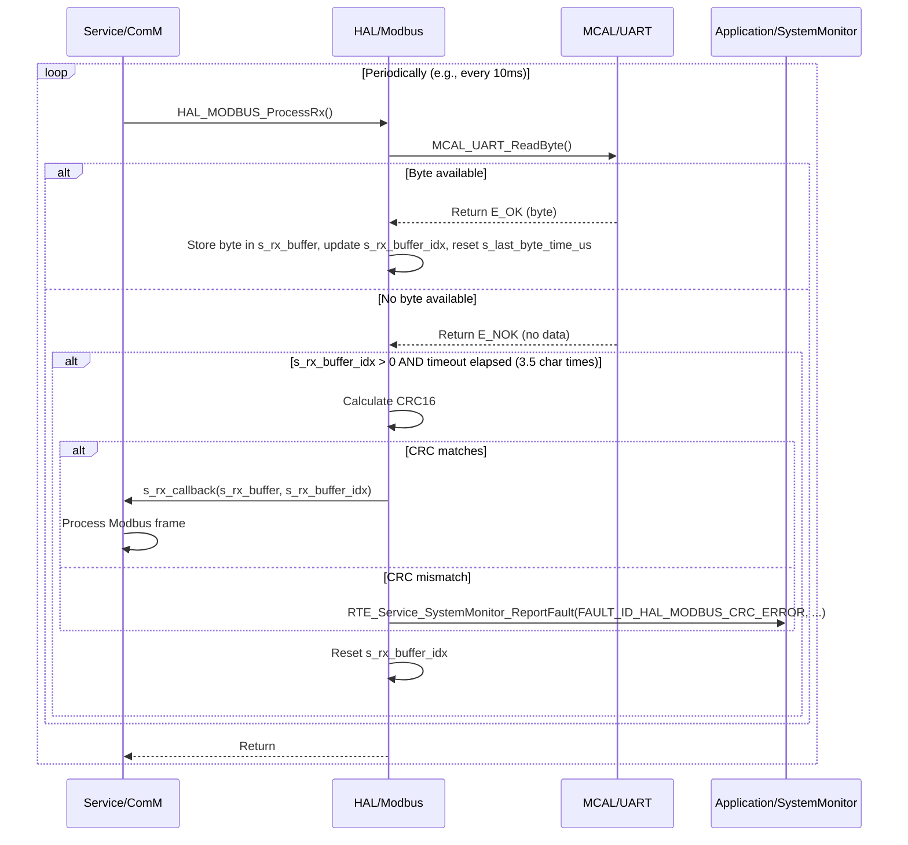

# **Detailed Design Document: HAL_Modbus Component**

## **1. Introduction**

### **1.1. Purpose**

This document details the design of the HAL_Modbus component. Its primary purpose is to provide a **hardware abstraction layer for the Modbus RTU protocol**, specifically handling the low-level UART communication, frame assembly/disassembly, and CRC calculation. It abstracts the complexities of direct UART interaction and Modbus frame handling from the higher ComM service layer. This fulfills requirements like SRS-05-03-01 (Modbus RTU over UART), SRS-05-03-04 (supported function codes), and SRS-05-03-02 (master/slave roles).

### **1.2. Scope**

The scope of this document covers the HAL_Modbus module's architecture, functional behavior, interfaces, dependencies, and resource considerations. It details how HAL_Modbus interacts with the underlying MCAL_UART driver for serial communication and provides an interface for the ComM module to send and receive Modbus frames.

### **1.3. References**

* Software Architecture Document (SAD) - Environmental Monitoring & Control System (Final Version)  
* System Requirements Specification (SyRS) - Environmental Monitoring & Control System (Updated)  
* Software Requirements Specification (SRS) - Environmental Monitoring & Control System (Updated)  
* Detailed Design Document: RTE  
* Detailed Design Document: ComM  
* Detailed Design Document: MCAL_UART  
* Modbus RTU Specification (Official Document)

## **2. Functional Description**

The HAL_Modbus component provides the following core functionalities:

1. **Initialization (HAL_MODBUS_Init)**: Initialize the underlying MCAL_UART peripheral with Modbus-specific settings (baud rate, parity, stop bits) and set up internal buffers.  
2. **Modbus Frame Transmission (HAL_MODBUS_TransmitFrame)**: Accepts a complete Modbus RTU frame (including address, function code, data, and CRC) and transmits it over the configured UART interface.  
3. **Modbus Frame Reception (HAL_MODBUS_ProcessRx)**: Continuously monitors the UART for incoming bytes, assembles them into a Modbus frame, validates the frame (e.g., length, CRC), and, if valid, passes the complete frame to a registered callback. This function is typically called periodically by ComM.  
4. **CRC Calculation**: Implements the Modbus RTU CRC-16 calculation algorithm.  
5. **Timeout Management**: Handles inter-character and frame timeouts as per Modbus RTU specification (e.g., 3.5 character times).  
6. **Error Reporting**: Detect and report any failures during Modbus operations (e.g., UART error, CRC mismatch, frame timeout) to the SystemMonitor via RTE_Service_SystemMonitor_ReportFault().

## **3. Non-Functional Requirements**

### **3.1. Performance**

* **Latency**: Modbus frame processing (Rx and Tx) shall be efficient to minimize communication latency.  
* **Throughput**: Capable of handling Modbus communication at specified baud rates without dropping frames.

### **3.2. Memory**

* **Minimal Footprint**: The HAL_Modbus code and data shall have a minimal memory footprint.  
* **Buffer Management**: Efficient use of transmit/receive buffers for Modbus frames.

### **3.3. Reliability**

* **Robustness**: The module shall be robust against noisy lines, incomplete frames, or invalid data, preventing system crashes.  
* **Data Integrity**: Must correctly calculate and verify Modbus CRC-16 to ensure data integrity.  
* **Protocol Conformance**: Strictly adhere to the Modbus RTU specification for timing and frame structure.

## **4. Architectural Context**

As per the SAD (Section 3.1.2, HAL Layer), HAL_Modbus resides in the Hardware Abstraction Layer. It provides the low-level Modbus RTU framing and UART interaction for the ComM service layer. ComM will call HAL_MODBUS_TransmitFrame to send data and periodically call HAL_MODBUS_ProcessRx to check for incoming frames. HAL_Modbus interacts directly with MCAL_UART.

## **5. Design Details**

### **5.1. Module Structure**

The HAL_Modbus component will consist of the following files:

* HAL/Modbus/inc/hal_modbus.h: Public header file containing function prototypes, data types, and error codes.  
* HAL/Modbus/src/hal_modbus.c: Source file containing the implementation of Modbus RTU logic.  
* HAL/Modbus/cfg/hal_modbus_cfg.h: Configuration header for UART settings, buffer sizes, and timeouts.

### **5.2. Public Interface (API)**
```c
// In HAL/Modbus/inc/hal_modbus.h

#include "Application/common/inc/common.h" // For APP_Status_t  
#include <stdint.h>   // For uint32_t, uint8_t  
#include <stdbool.h>  // For bool

// Max Modbus frame size (e.g., 256 bytes including address, function, data, CRC)  
#define HAL_MODBUS_MAX_FRAME_SIZE       256

// Function pointer for Modbus frame received callback (to be registered by ComM)  
typedef void (*HAL_MODBUS_RxCallback_t)(const uint8_t *frame_data, uint16_t frame_len);

/**  
 * @brief Initializes the HAL_Modbus module and the underlying MCAL_UART.  
 * This function should be called once during system initialization.  
 * @return E_OK on success, E_NOK on failure.  
 */  
APP_Status_t HAL_MODBUS_Init(void);

/**  
 * @brief Registers a callback function to be invoked when a complete, valid Modbus frame is received.  
 * @param callback The function pointer to the callback.  
 * @return E_OK on success, E_NOK on failure.  
 */  
APP_Status_t HAL_MODBUS_RegisterRxCallback(HAL_MODBUS_RxCallback_t callback);

/**  
 * @brief Transmits a complete Modbus RTU frame over UART.  
 * The frame_data must include address, function code, data, and CRC.  
 * @param frame_data Pointer to the Modbus frame data.  
 * @param frame_len Length of the Modbus frame.  
 * @return E_OK on successful transmission, E_NOK on failure.  
 */  
APP_Status_t HAL_MODBUS_TransmitFrame(const uint8_t *frame_data, uint16_t frame_len);

/**  
 * @brief Processes incoming UART data to assemble Modbus RTU frames.  
 * This function should be called periodically (e.g., by ComM's main function).  
 * It handles byte reception, timeout detection, and frame validation.  
 */  
void HAL_MODBUS_ProcessRx(void);
```
### **5.3. Internal Design**

The HAL_Modbus module will manage the UART communication, internal receive buffer, and state machine for Modbus frame reception.

1. **Internal State Variables**:  
   ```c
   static uint8_t s_rx_buffer[HAL_MODBUS_MAX_FRAME_SIZE];  
   static uint16_t s_rx_buffer_idx = 0;  
   static uint32_t s_last_byte_time_us = 0; // Microseconds for inter-character timeout  
   static HAL_MODBUS_RxCallback_t s_rx_callback = NULL;  
   static bool s_is_initialized = false;
   ```
2. **Initialization (HAL_MODBUS_Init)**:  
   * Initialize s_rx_buffer_idx = 0;, s_last_byte_time_us = 0;.  
   * Call MCAL_UART_Init(HAL_MODBUS_UART_PORT, HAL_MODBUS_BAUD_RATE, HAL_MODBUS_PARITY, HAL_MODBUS_STOP_BITS). If this fails, report FAULT_ID_HAL_MODBUS_UART_INIT_FAILURE to SystemMonitor and return E_NOK.  
   * Set s_is_initialized = true;.  
   * Return E_OK.  
3. **Register Rx Callback (HAL_MODBUS_RegisterRxCallback)**:  
   * Validate callback is not NULL.  
   * s_rx_callback = callback;  
   * Return E_OK.  
4. **Transmit Frame (HAL_MODBUS_TransmitFrame)**:  
   * If !s_is_initialized, return E_NOK.  
   * Validate frame_data and frame_len (e.g., frame_len <= HAL_MODBUS_MAX_FRAME_SIZE).  
   * Call MCAL_UART_Transmit(HAL_MODBUS_UART_PORT, frame_data, frame_len).  
   * If MCAL_UART_Transmit returns an error, report FAULT_ID_HAL_MODBUS_TX_FAILURE to SystemMonitor.  
   * Return E_OK or E_NOK based on MCAL_UART_Transmit result.  
5. **Process Rx (HAL_MODBUS_ProcessRx)**:  
   * If !s_is_initialized, return immediately.  
   * Get current time: uint32_t current_time_us = APP_COMMON_GetUptimeUs(); (assuming APP_COMMON provides microsecond uptime).  
   * **Read Bytes from UART**:  
     * Loop while MCAL_UART_ReadByte(HAL_MODBUS_UART_PORT, &received_byte) returns E_OK:  
       * Reset timeout timer: s_last_byte_time_us = current_time_us;  
       * Add byte to buffer: s_rx_buffer[s_rx_buffer_idx++] = received_byte;  
       * Check for buffer overflow: If s_rx_buffer_idx >= HAL_MODBUS_MAX_FRAME_SIZE, report FAULT_ID_HAL_MODBUS_RX_OVERFLOW, reset s_rx_buffer_idx = 0;, and discard current frame.  
       * **Check for complete frame (end of frame timeout)**: Modbus RTU frames are delimited by a silent interval of at least 3.5 character times. This is the primary frame detection mechanism.  
         * If s_rx_buffer_idx > 0 and (current_time_us - s_last_byte_time_us) > HAL_MODBUS_FRAME_TIMEOUT_US:  
           * **Validate CRC**: Calculate CRC-16 for s_rx_buffer (excluding the last two CRC bytes). Compare with the received CRC.  
           * If CRC matches:  
             * If s_rx_callback != NULL, call s_rx_callback(s_rx_buffer, s_rx_buffer_idx).  
             * Log LOGD("HAL_Modbus: Rx frame valid, len %d", s_rx_buffer_idx);.  
           * Else (CRC mismatch):  
             * Report FAULT_ID_HAL_MODBUS_CRC_ERROR to SystemMonitor.  
             * Log LOGW("HAL_Modbus: Rx frame CRC error, len %d", s_rx_buffer_idx);.  
           * Reset for next frame: s_rx_buffer_idx = 0;  
           * s_last_byte_time_us = current_time_us; // Reset to avoid immediate re-trigger  
   * **Handle Incomplete Frame Timeout**: If no new bytes are received for a prolonged period (s_rx_buffer_idx > 0 and (current_time_us - s_last_byte_time_us) > HAL_MODBUS_FRAME_TIMEOUT_US but no new byte came in this cycle):  
     * This indicates an incomplete frame or a very long silent interval.  
     * Report FAULT_ID_HAL_MODBUS_FRAME_TIMEOUT (if s_rx_buffer_idx > 0).  
     * Reset s_rx_buffer_idx = 0;  
     * s_last_byte_time_us = current_time_us;  
6. **CRC Calculation (hal_modbus_calculate_crc16)**:  
   * Internal static helper function.  
   * Implements the standard Modbus RTU CRC-16 algorithm.

**Sequence Diagram (Example: HAL_MODBUS_ProcessRx - Frame Reception):**

### **5.4. Dependencies**

* Mcal/uart/inc/mcal_uart.h: For low-level UART driver functions (MCAL_UART_Init, MCAL_UART_Transmit, MCAL_UART_ReadByte).  
* Application/logger/inc/logger.h: For internal logging.  
* Rte/inc/Rte.h: For calling RTE_Service_SystemMonitor_ReportFault().  
* Application/common/inc/common.h: For APP_Status_t, E_OK/E_NOK, and APP_COMMON_GetUptimeUs().  
* HAL/Modbus/cfg/hal_modbus_cfg.h: For configuration parameters.

### **5.5. Error Handling**

* **Input Validation**: Public API functions will validate inputs (e.g., frame_data not NULL, frame_len within bounds).  
* **UART Driver Errors**: Errors returned by MCAL_UART functions are caught by HAL_Modbus and reported.  
* **CRC Mismatch**: If the calculated CRC does not match the received CRC, FAULT_ID_HAL_MODBUS_CRC_ERROR is reported.  
* **Frame Timeout**: If a complete frame is not received within the specified timeout, FAULT_ID_HAL_MODBUS_FRAME_TIMEOUT is reported.  
* **Receive Buffer Overflow**: If s_rx_buffer_idx exceeds HAL_MODBUS_MAX_FRAME_SIZE, FAULT_ID_HAL_MODBUS_RX_OVERFLOW is reported, and the current frame is discarded.  
* **Fault Reporting**: All critical errors are reported to SystemMonitor via RTE_Service_SystemMonitor_ReportFault().  
* **Return Status**: Public API functions return E_NOK on failure.

### **5.6. Configuration**

The HAL/Modbus/cfg/hal_modbus_cfg.h file will contain:

* HAL_MODBUS_UART_PORT: The MCAL UART port to use for Modbus.  
* HAL_MODBUS_BAUD_RATE: Baud rate (e.g., 9600, 19200).  
* HAL_MODBUS_PARITY: Parity setting (e.g., MCAL_UART_PARITY_EVEN, MCAL_UART_PARITY_NONE).  
* HAL_MODBUS_STOP_BITS: Number of stop bits.  
* HAL_MODBUS_MAX_FRAME_SIZE: Maximum size of a Modbus RTU frame.  
* HAL_MODBUS_CHARACTER_TIME_US: Time for one character transmission in microseconds (used for 3.5 character timeout).  
* HAL_MODBUS_FRAME_TIMEOUT_US: Calculated 3.5 character time timeout for frame completion.
```c
// Example: HAL/Modbus/cfg/hal_modbus_cfg.h  
#ifndef HAL_MODBUS_CFG_H  
#define HAL_MODBUS_CFG_H

#include "Mcal/uart/inc/mcal_uart.h" // For MCAL_UART_Port_t, MCAL_UART_Parity_t etc.

// UART configuration for Modbus  
#define HAL_MODBUS_UART_PORT            MCAL_UART_PORT_0  
#define HAL_MODBUS_BAUD_RATE            19200  
#define HAL_MODBUS_PARITY               MCAL_UART_PARITY_EVEN  
#define HAL_MODBUS_STOP_BITS            MCAL_UART_STOP_BITS_1

// Modbus RTU Timing Parameters  
// Calculate character time: (1 start bit + 8 data bits + 1 parity bit + 1 stop bit) = 11 bits per character  
// Or (1 start bit + 8 data bits + 2 stop bits) = 11 bits per character if no parity  
// For 19200 baud, 1 bit time = 1/19200 s = 52.08 us  
// 1 character time = 11 bits * 52.08 us/bit = 572.88 us  
#define HAL_MODBUS_BITS_PER_CHAR        11 // 1 start + 8 data + 1 parity + 1 stop  
#define HAL_MODBUS_BIT_TIME_US(baud)    (1000000 / (baud))  
#define HAL_MODBUS_CHARACTER_TIME_US    (HAL_MODBUS_BITS_PER_CHAR * HAL_MODBUS_BIT_TIME_US(HAL_MODBUS_BAUD_RATE))

// Modbus RTU silence interval (3.5 character times) for frame detection  
#define HAL_MODBUS_FRAME_TIMEOUT_US     (3 * HAL_MODBUS_CHARACTER_TIME_US + (HAL_MODBUS_CHARACTER_TIME_US / 2))

// Max Modbus frame size (e.g., 256 bytes including address, function, data, CRC)  
#define HAL_MODBUS_MAX_FRAME_SIZE       256

#endif // HAL_MODBUS_CFG_H
```
### **5.7. Resource Usage**

* **Flash**: Moderate, for Modbus RTU logic and CRC calculation.  
* **RAM**: Moderate, primarily for the s_rx_buffer (HAL_MODBUS_MAX_FRAME_SIZE bytes).  
* **CPU**: Low during idle. Moderate during active reception/transmission, as it involves byte-by-byte processing and CRC calculation. HAL_MODBUS_ProcessRx should be called frequently enough to catch inter-character timeouts.

## **6. Test Considerations**

### **6.1. Unit Testing**

* **Mock MCAL_UART**: Unit tests for HAL_Modbus will mock the MCAL_UART functions (MCAL_UART_Init, MCAL_UART_Transmit, MCAL_UART_ReadByte) to isolate HAL_Modbus's logic.  
* **Mock APP_COMMON_GetUptimeUs**: To simulate time passing for timeout tests.  
* **Test Cases**:  
  * HAL_MODBUS_Init: Test successful initialization and mocked MCAL_UART_Init failure (verify E_NOK and fault reporting).  
  * HAL_MODBUS_RegisterRxCallback: Test valid/invalid callback.  
  * HAL_MODBUS_TransmitFrame: Test with valid/invalid frame lengths, NULL data. Verify MCAL_UART_Transmit is called with correct data. Test MCAL_UART_Transmit failure.  
  * HAL_MODBUS_ProcessRx:  
    * **Complete Frame**: Simulate receiving a complete, valid Modbus frame byte-by-byte (using mocked MCAL_UART_ReadByte). Verify s_rx_callback is called with the correct frame and length.  
    * **CRC Error**: Simulate a frame with incorrect CRC. Verify FAULT_ID_HAL_MODBUS_CRC_ERROR is reported.  
    * **Inter-character Timeout**: Simulate bytes arriving with delays longer than HAL_MODBUS_CHARACTER_TIME_US (but less than HAL_MODBUS_FRAME_TIMEOUT_US for partial frame). Verify s_rx_buffer_idx resets and no callback is triggered prematurely.  
    * **Frame Timeout**: Simulate a partial frame followed by a silence longer than HAL_MODBUS_FRAME_TIMEOUT_US. Verify FAULT_ID_HAL_MODBUS_FRAME_TIMEOUT is reported and buffer resets.  
    * **Buffer Overflow**: Simulate a frame larger than HAL_MODBUS_MAX_FRAME_SIZE. Verify FAULT_ID_HAL_MODBUS_RX_OVERFLOW is reported and buffer resets.  
    * **No Data**: Call HAL_MODBUS_ProcessRx repeatedly with no incoming bytes.  
  * CRC Calculation: Unit test the internal hal_modbus_calculate_crc16 function with known Modbus CRC test vectors.  
  * Error reporting: Verify RTE_Service_SystemMonitor_ReportFault() is called with the correct fault ID on various error conditions.

### **6.2. Integration Testing**

* **HAL-MCAL Integration**: Verify HAL_Modbus correctly interfaces with the actual MCAL_UART driver.  
* **Loopback Test**: Connect UART Tx to Rx and send/receive Modbus frames to verify correct framing and CRC.  
* **External Modbus Master/Slave**: Use a real Modbus master/slave device to communicate with the system. Verify that HAL_Modbus correctly transmits and receives frames.  
* **Error Injection**: Introduce communication errors (e.g., disconnect UART, inject noise) and verify HAL_Modbus reports faults to SystemMonitor.  
* **Timing Accuracy**: Verify that Modbus RTU timing (inter-character, frame timeouts) is met under various baud rates.

### **6.3. System Testing**

* **End-to-End Modbus Communication**: Verify that the entire Modbus communication path (from external master/slave through ComM and HAL_Modbus to application logic) functions correctly.  
* **Stress Testing**: Run Modbus communication at high rates and for extended periods to ensure stability and no buffer overflows or missed frames.  
* **Fault Tolerance**: Verify system behavior when Modbus communication fails (e.g., SystemMonitor receives faults, systemMgr takes corrective action if configured).