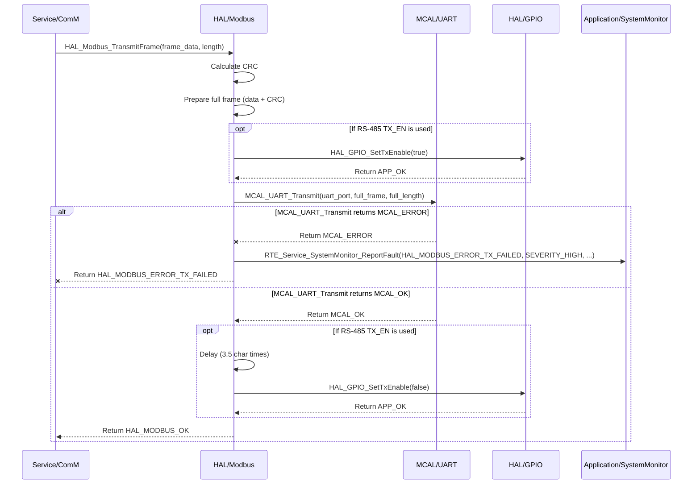

# Detailed Design Document: HAL_Modbus Component

## 1. Introduction

### 1.1. Purpose
This document details the design of the HAL_Modbus component, which provides a hardware abstraction layer for the Modbus RTU serial communication protocol. Its primary purpose is to offer a standardized interface for sending and receiving Modbus frames over UART, abstracting the low-level UART operations and Modbus frame handling details from the higher layers (specifically the ComM module in the Service Layer).

### 1.2. Scope
The scope of this document covers the HAL_Modbus module's architecture, functional behavior, interfaces, dependencies, and resource considerations. It details how the HAL layer interacts with the underlying Microcontroller Abstraction Layer (MCAL) for UART operations and provides Modbus frame-level services to the ComM module.

### 1.3. References
- Software Architecture Document (SAD) - Smart Device Firmware (Final Version)  
- Modbus RTU Specification  
- MCAL UART Driver Specification (Conceptual, as it's the lower layer)  
- MCU Datasheet / Reference Manual (for specific UART capabilities)  

---

## 2. Functional Description
The HAL_Modbus component provides the following core functionalities:

- **Initialization:** Initialize the underlying UART peripheral and configure Modbus-specific parameters (e.g., baud rate, parity, stop bits).
- **Frame Transmission:** Send a complete Modbus RTU frame over UART. This includes calculating and appending the CRC.
- **Frame Reception:** Receive a complete Modbus RTU frame from UART, including CRC validation and timeout handling.
- **Bus Arbitration:** Manage the RS-485 bus direction (transmit/receive enable) to prevent bus contention.
- **Error Reporting:** Report any failures during Modbus operations (e.g., UART initialization failure, CRC error, timeout, bus contention) to the SystemMonitor via `RTE_Service_SystemMonitor_ReportFault()`.

---

## 3. Non-Functional Requirements

### 3.1. Performance
- **Throughput:** Support Modbus communication at specified baud rates (e.g., 9600, 19200, 38400 bps).
- **Latency:** Minimize the latency between receiving a request and sending a response.
- **Reliability:** Ensure robust frame transmission and reception, minimizing data corruption.

### 3.2. Memory
- **Minimal Footprint:** The HAL_Modbus code and data shall have a minimal memory footprint.
- **Buffer Management:** Efficiently manage transmit and receive buffers for Modbus frames.

### 3.3. Reliability
- **Robustness:** The module shall handle communication errors (e.g., noise, incomplete frames, CRC mismatches) gracefully.
- **Fault Isolation:** Failures in Modbus communication should be isolated and reported without crashing the system.
- **Timeout Handling:** Implement timeouts for frame reception to prevent indefinite waiting.

---

## 4. Architectural Context
As per the SAD (Section 3.1.2, HAL Layer), HAL_Modbus resides in the Hardware Abstraction Layer. It acts as a driver for the Modbus protocol, utilizing the MCAL_UART module for serial communication. It provides its services to the ComM module in the Service Layer, which then orchestrates overall communication.

---

## 5. Design Details

### 5.1. Module Structure
The HAL_Modbus component will consist of the following files:

- `HAL/inc/hal_modbus.h`: Public header file containing function prototypes, data types, and error codes.
- `HAL/src/hal_modbus.c`: Source file containing the implementation of the HAL_Modbus functions.
- `HAL/cfg/hal_modbus_cfg.h`: Configuration header for static Modbus parameters (e.g., UART port, baud rate, default slave ID).

### 5.2. Public Interface (API)
```c
// In HAL/inc/hal_modbus.h

#define HAL_MODBUS_MAX_FRAME_SIZE 256 // Example max frame size

// Enum for Modbus errors
typedef enum {
    HAL_MODBUS_OK = 0,
    HAL_MODBUS_ERROR_INIT_FAILED,
    HAL_MODBUS_ERROR_TX_FAILED,
    HAL_MODBUS_ERROR_RX_TIMEOUT,
    HAL_MODBUS_ERROR_RX_CRC_MISMATCH,
    HAL_MODBUS_ERROR_INVALID_PARAM,
    HAL_MODBUS_ERROR_BUS_BUSY,
    // Add more specific errors as needed
} HAL_Modbus_Status_t;

// Enum for UART parity
typedef enum {
    HAL_MODBUS_PARITY_NONE,
    HAL_MODBUS_PARITY_EVEN,
    HAL_MODBUS_PARITY_ODD
} HAL_Modbus_Parity_t;

// Structure for Modbus configuration
typedef struct {
    uint8_t uart_port_id;      // MCAL_UART port ID
    uint32_t baud_rate;
    HAL_Modbus_Parity_t parity;
    uint8_t stop_bits;
    uint8_t data_bits;
    uint32_t rx_timeout_ms;    // Receive timeout in milliseconds
    uint8_t rs485_tx_en_gpio;  // GPIO pin for RS-485 Transmit Enable (if applicable)
} HAL_Modbus_Config_t;

/**
 * @brief Initializes the HAL_Modbus module and its underlying UART peripheral.
 * This function should be called once during system initialization.
 * @param config Pointer to the Modbus configuration structure.
 * @return HAL_MODBUS_OK on success, an error code on failure.
 */
HAL_Modbus_Status_t HAL_Modbus_Init(const HAL_Modbus_Config_t *config);

/**
 * @brief Transmits a Modbus RTU frame.
 * This function calculates and appends the CRC to the frame before transmission.
 * @param frame_data Pointer to the raw frame data (excluding CRC).
 * @param frame_length Length of the raw frame data.
 * @return HAL_MODBUS_OK on success, an error code on failure.
 */
HAL_Modbus_Status_t HAL_Modbus_TransmitFrame(const uint8_t *frame_data, uint16_t frame_length);

/**
 * @brief Receives a Modbus RTU frame.
 * This function handles reception, timeout, and CRC validation.
 * @param rx_buffer Pointer to the buffer to store the received frame.
 * @param buffer_size Size of the receive buffer.
 * @param received_length Pointer to store the actual length of the received frame.
 * @return HAL_MODBUS_OK on successful reception and CRC validation, an error code on failure.
 */
HAL_Modbus_Status_t HAL_Modbus_ReceiveFrame(uint8_t *rx_buffer, uint16_t buffer_size, uint16_t *received_length);

/**
 * @brief Sets the RS-485 bus direction (Transmit Enable).
 * @param enable True to enable transmit, false to enable receive.
 * @return HAL_MODBUS_OK on success, an error code on failure.
 */
HAL_Modbus_Status_t HAL_Modbus_SetTxEnable(bool enable);

```

### 5.3. Internal Design
The HAL_Modbus module will manage the Modbus RTU frame structure, CRC calculation, and interact with MCAL_UART for byte-level transmission and reception. It will also handle the RS-485 Transmit Enable (TX_EN) pin if required by the hardware.

#### Initialization (`HAL_Modbus_Init`):
- Validate the input config pointer and parameters.
- Store the configuration internally.
- Call `MCAL_UART_Init(config->uart_port_id, config->baud_rate, config->parity, config->stop_bits, config->data_bits)`. If this fails, report `HAL_MODBUS_ERROR_INIT_FAILED` to SystemMonitor and return `APP_ERROR`.
- If `config->rs485_tx_en_gpio` is valid, initialize this GPIO pin as an output using `HAL_GPIO_Init()` and set it to a default receive state (e.g., low). If this fails, report `HAL_MODBUS_ERROR_INIT_FAILED`.
- Return `HAL_MODBUS_OK` on success.

#### Frame Transmission (`HAL_Modbus_TransmitFrame`):
- Validate `frame_data` and `frame_length`. Ensure `frame_length + 2` (for CRC) does not exceed `HAL_MODBUS_MAX_FRAME_SIZE`.
- Calculate the 16-bit Modbus RTU CRC for `frame_data`.
- Allocate a temporary buffer to hold the complete frame (data + CRC).
- Copy `frame_data` to the temporary buffer, then append the calculated CRC.
- If `rs485_tx_en_gpio` is configured, call `HAL_Modbus_SetTxEnable(true)` to enable transmit mode.
- Call `MCAL_UART_Transmit(uart_port_id, complete_frame_buffer, complete_frame_length)`.
- After transmission, if `rs485_tx_en_gpio` is configured, add a short delay (e.g., 3.5 character times as per Modbus spec) to ensure the last byte is sent, then call `HAL_Modbus_SetTxEnable(false)` to switch back to receive mode.
- If `MCAL_UART_Transmit` fails, report `HAL_MODBUS_ERROR_TX_FAILED` to SystemMonitor.

#### Frame Reception (`HAL_Modbus_ReceiveFrame`):
- Validate `rx_buffer`, `buffer_size`, and `received_length`.
- Call `MCAL_UART_Receive(uart_port_id, rx_buffer, buffer_size, config->rx_timeout_ms, &bytes_read)`.  
  Assume this function returns `bytes_read` after timeout or full buffer.
- If `bytes_read` is 0 or less than 3 (min frame size: 1 byte data + 2 bytes CRC), report `HAL_MODBUS_ERROR_RX_TIMEOUT` or `HAL_MODBUS_ERROR_INVALID_PARAM` and return error.
- Extract the received CRC from the last two bytes of `rx_buffer`.
- Calculate the CRC for the received data (excluding the received CRC).
- Compare calculated CRC with received CRC. If they don't match, report `HAL_MODBUS_ERROR_RX_CRC_MISMATCH` and return error.
- Set `*received_length` to `bytes_read - 2`.
- Return `HAL_MODBUS_OK` on success.

#### Set Transmit Enable (`HAL_Modbus_SetTxEnable`):
- If `rs485_tx_en_gpio` is configured, call `HAL_GPIO_SetState(rs485_tx_en_gpio, enable ? HAL_GPIO_STATE_HIGH : HAL_GPIO_STATE_LOW)`.
- If `HAL_GPIO_SetState` fails, report `HAL_MODBUS_ERROR_BUS_BUSY` (or more specific GPIO error) to SystemMonitor.

#### Sequence Diagram (Example: HAL_Modbus_TransmitFrame)



---

### 5.4. Dependencies
- `Mcal/uart/inc/mcal_uart.h`: For byte-level UART transmission and reception.
- `HAL/inc/hal_gpio.h`: For controlling the RS-485 Transmit Enable (TX_EN) pin.
- `Application/logger/inc/logger.h`: For internal logging.
- `Rte/inc/Rte.h`: For calling `RTE_Service_SystemMonitor_ReportFault()`.
- `Application/common/inc/app_common.h`: For `APP_Status_t` and `APP_OK`/`APP_ERROR` (though `HAL_Modbus_Status_t` is more specific for this module).
- `HAL/cfg/hal_modbus_cfg.h`: For the `HAL_Modbus_Config_t` structure and default configuration.

---

### 5.5. Error Handling
- **Input Validation:** All public API functions will validate input parameters (e.g., non-NULL pointers, valid lengths).
- **MCAL Error Propagation:** Errors returned by `MCAL_UART` or `HAL_GPIO` functions will be caught by `HAL_Modbus`.
- **CRC Validation:** `HAL_Modbus_ReceiveFrame` will perform CRC validation and report `HAL_MODBUS_ERROR_RX_CRC_MISMATCH` if it fails.
- **Timeout Handling:** `HAL_Modbus_ReceiveFrame` will return `HAL_MODBUS_ERROR_RX_TIMEOUT` if a complete frame is not received within the configured timeout.
- **Fault Reporting:** Upon detection of an error, `HAL_Modbus` will report a specific fault ID (e.g., `FAULT_ID_MODBUS_UART_INIT_FAILED`, `FAULT_ID_MODBUS_TX_FAILED`, `FAULT_ID_MODBUS_RX_TIMEOUT`, `FAULT_ID_MODBUS_CRC_ERROR`) to SystemMonitor via the `RTE_Service_SystemMonitor_ReportFault()` service.
- **Return Status:** All public API functions will return `HAL_Modbus_Status_t` indicating success or specific error.

---

### 5.6. Configuration
The `HAL/cfg/hal_modbus_cfg.h` file will contain:
- The `HAL_Modbus_Config_t` structure instance defining the UART port, baud rate, parity, stop bits, data bits, receive timeout, and RS-485 TX_EN GPIO pin.
- Macros for default Modbus parameters.

```c
// Example: HAL/cfg/hal_modbus_cfg.h
#define HAL_MODBUS_DEFAULT_UART_PORT        MCAL_UART_PORT_0
#define HAL_MODBUS_DEFAULT_BAUD_RATE        9600
#define HAL_MODBUS_DEFAULT_PARITY           HAL_MODBUS_PARITY_NONE
#define HAL_MODBUS_DEFAULT_STOP_BITS        1
#define HAL_MODBUS_DEFAULT_DATA_BITS        8
#define HAL_MODBUS_DEFAULT_RX_TIMEOUT_MS    100 // 100 ms timeout for frame reception
#define HAL_MODBUS_RS485_TX_EN_GPIO_PIN     GPIO_PIN_RS485_TX_EN // Define this in HAL_GPIO_cfg.h

extern const HAL_Modbus_Config_t hal_modbus_config;
```
---

### 5.7. Resource Usage

- **Flash**: Moderate, for protocol logic (CRC calculation, frame assembly/disassembly) and driver functions.
- **RAM**: Moderate, for transmit and receive buffers (`HAL_MODBUS_MAX_FRAME_SIZE`).
- **CPU**: Low for basic operations. Can increase with high baud rates and frequent communication, especially during CRC calculation.

---

## 6. Test Considerations

### 6.1. Unit Testing

**Mock MCAL_UART & HAL_GPIO**: Unit tests for HAL_Modbus will mock `MCAL_UART` (for byte-level TX/RX) and `HAL_GPIO` (for TX_EN control) to isolate HAL_Modbus's logic.

#### Test Cases

- **HAL_Modbus_Init**:
  - Test valid/invalid configurations.
  - Verify `MCAL_UART_Init` and `HAL_GPIO_Init` calls.
  - Test error propagation.

- **HAL_Modbus_TransmitFrame**:
  - Test with various valid frame data and lengths.
  - Verify correct CRC calculation and `MCAL_UART_Transmit` calls.
  - Verify `HAL_Modbus_SetTxEnable` is called correctly before/after transmission if configured.
  - Test with invalid `frame_data` (NULL) or `frame_length` (too long/too short).
  - Test error propagation from `MCAL_UART_Transmit`.

- **HAL_Modbus_ReceiveFrame**:
  - Mock `MCAL_UART_Receive` to return valid frames.
  - Verify correct data is received and `received_length` is set.
  - Test with frames having correct and incorrect CRC.
  - Verify `HAL_MODBUS_OK` vs. `HAL_MODBUS_ERROR_RX_CRC_MISMATCH`.
  - Test with incomplete frames or timeouts. Verify `HAL_MODBUS_ERROR_RX_TIMEOUT`.
  - Test with invalid `rx_buffer` (NULL) or `buffer_size` (too small).
  - Test error propagation from `MCAL_UART_Receive`.

- **HAL_Modbus_SetTxEnable**:
  - Test enabling/disabling. Verify `HAL_GPIO_SetState` calls.

- **Error Reporting**:
  - Verify that `RTE_Service_SystemMonitor_ReportFault()` is called with the correct fault ID on various error conditions.

---

### 6.2. Integration Testing

- **HAL-MCAL Integration**:
  - Verify that `HAL_Modbus` correctly interfaces with the actual `MCAL_UART` driver and `HAL_GPIO` (for TX_EN).

- **Loopback Test**:
  - Connect UART TX to RX (or use a physical loopback adapter for RS-485) and send/receive frames to verify basic functionality.

- **Master/Slave Simulation**:
  - Use a Modbus master simulator to send requests and verify the system's responses.
  - Simulate a slave to test the system as a master.

- **Error Injection**:
  - Introduce CRC errors, incomplete frames, or timeouts to verify that `HAL_Modbus` detects and reports these faults correctly to `SystemMonitor`.

- **Stress Testing**:
  - Test high-frequency communication and large frame sizes to assess performance and stability.

---

### 6.3. System Testing

- **End-to-End Communication**:
  - Verify that the entire communication path (e.g., external Modbus master → `HAL_Modbus` → `ComM` → `systemMgr` → `Diagnostic` and back) functions correctly.

- **Functional Compliance**:
  - Verify that the system responds to standard Modbus function codes (e.g., read holding registers, write single register) as expected by the application.

- **Robustness**:
  - Test Modbus communication under adverse conditions (e.g., noisy environment, power fluctuations) to ensure reliability.


