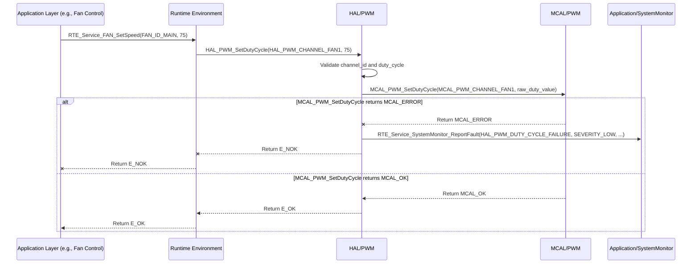

# **Detailed Design Document: HAL_PWM Component**

## **1. Introduction**

### **1.1. Purpose**

This document details the design of the HAL_PWM component, which provides a hardware abstraction layer for Pulse Width Modulation (PWM) peripherals. Its primary purpose is to offer a standardized, microcontroller-independent interface for configuring and controlling PWM outputs, enabling functionalities like motor speed control, LED dimming, and signal generation.

### **1.2. Scope**

The scope of this document covers the HAL_PWM module's architecture, functional behavior, interfaces, dependencies, and resource considerations. It details how the HAL layer interacts with the underlying Microcontroller Abstraction Layer (MCAL) for PWM operations.

### **1.3. References**

* Software Architecture Document (SAD) - Smart Device Firmware (Final Version)  
* MCAL PWM Driver Specification (Conceptual, as it's the lower layer)  
* MCU Datasheet / Reference Manual (for specific PWM capabilities)

## **2. Functional Description**

The HAL_PWM component provides the following core functionalities:

1. **PWM Initialization**: Configure specific PWM channels or timers, including frequency, initial duty cycle, and associated GPIO pins.  
2. **Duty Cycle Control**: Dynamically set the duty cycle for a PWM channel.  
3. **Frequency Control**: Dynamically set the frequency for a PWM channel or timer.  
4. **PWM Start/Stop**: Enable or disable PWM output on a specific channel.  
5. **Error Reporting**: Report any failures during PWM operations (e.g., initialization failure, invalid channel, invalid duty cycle/frequency) to the SystemMonitor via RTE_Service_SystemMonitor_ReportFault().

## **3. Non-Functional Requirements**

### **3.1. Performance**

* **Resolution**: The duty cycle resolution shall be sufficient for smooth control (e.g., 8-bit or 10-bit).  
* **Frequency Accuracy**: PWM output frequencies shall be accurate and stable.  
* **Minimal Jitter**: PWM signals shall exhibit minimal jitter for consistent control.

### **3.2. Memory**

* **Minimal Footprint**: The HAL_PWM code and data shall have a minimal memory footprint.  
* **Configuration Storage**: Configuration data for PWM channels shall be stored efficiently.

### **3.3. Reliability**

* **Robustness**: The module shall handle invalid PWM configurations or hardware access failures gracefully.  
* **Safety**: Ensure that PWM outputs default to a safe state (e.g., off) on initialization or error.

## **4. Architectural Context**

As per the SAD (Section 3.1.2, HAL Layer), HAL_PWM resides in the Hardware Abstraction Layer. It acts as an intermediary between Application Layer components (e.g., Application/fan, Application/lightControl) and the MCAL_PWM driver. HAL_PWM translates generic PWM requests into MCAL-specific calls.

## **5. Design Details**

### **5.1. Module Structure**

The HAL_PWM component will consist of the following files:

* HAL/inc/hal_pwm.h: Public header file containing function prototypes, data types, and error codes.  
* HAL/src/hal_pwm.c: Source file containing the implementation of the HAL_PWM functions.  
* HAL/cfg/hal_pwm_cfg.h: Configuration header for static PWM channel definitions and initial settings.

### **5.2. Public Interface (API)**
```c
// In HAL/inc/hal_pwm.h

// Enum for PWM channel IDs (logical identifiers for each PWM output)  
typedef enum {  
    HAL_PWM_CHANNEL_FAN1,  
    HAL_PWM_CHANNEL_FAN2,  
    HAL_PWM_CHANNEL_LED_DIM,  
    // Add more PWM channels as needed  
    HAL_PWM_CHANNEL_COUNT  
} HAL_PWM_ChannelId_t;

// Structure for initial PWM channel configuration  
typedef struct {  
    HAL_PWM_ChannelId_t channel_id;  
    uint8_t gpio_pin;       // GPIO pin associated with this PWM channel  
    uint32_t frequency_hz;  // PWM frequency in Hz  
    uint32_t initial_duty_cycle_percent; // Initial duty cycle as a percentage (0-100)  
    bool enable_on_init;    // True to start PWM output immediately after init  
} HAL_PWM_Config_t;

/**  
 * @brief Initializes all configured PWM channels based on the predefined array.  
 * This function should be called once during system initialization.  
 * @return E_OK on success, E_NOK if any PWM channel fails to initialize.  
 */  
APP_Status_t HAL_PWM_Init(void);

/**  
 * @brief Sets the duty cycle for a specific PWM channel.  
 * @param channel_id The ID of the PWM channel.  
 * @param duty_cycle_percent The desired duty cycle as a percentage (0-100).  
 * @return E_OK on success, E_NOK on failure.  
 */  
APP_Status_t HAL_PWM_SetDutyCycle(HAL_PWM_ChannelId_t channel_id, uint32_t duty_cycle_percent);

/**  
 * @brief Sets the frequency for a specific PWM channel.  
 * Note: Changing frequency might affect other channels if they share a timer.  
 * @param channel_id The ID of the PWM channel.  
 * @param frequency_hz The desired frequency in Hz.  
 * @return E_OK on success, E_NOK on failure.  
 */  
APP_Status_t HAL_PWM_SetFrequency(HAL_PWM_ChannelId_t channel_id, uint32_t frequency_hz);

/**  
 * @brief Starts PWM output on a specific channel.  
 * @param channel_id The ID of the PWM channel.  
 * @return E_OK on success, E_NOK on failure.  
 */  
APP_Status_t HAL_PWM_Start(HAL_PWM_ChannelId_t channel_id);

/**  
 * @brief Stops PWM output on a specific channel.  
 * @param channel_id The ID of the PWM channel.  
 * @return E_OK on success, E_NOK on failure.  
 */  
APP_Status_t HAL_PWM_Stop(HAL_PWM_ChannelId_t channel_id);
```

### **5.3. Internal Design**

The HAL_PWM module will primarily act as a wrapper around the MCAL_PWM functions. It will perform input validation, parameter translation, and handle error reporting before delegating the actual hardware access to the MCAL layer.

1. **Initialization (HAL_PWM_Init)**:  
   * This function will **loop through the hal_pwm_initial_config array** defined in HAL/cfg/hal_pwm_cfg.h.  
   * For each entry in the array:  
     * Validate the channel_id against HAL_PWM_CHANNEL_COUNT and gpio_pin.  
     * Translate parameters (e.g., duty cycle percentage to raw counts if MCAL expects it).  
     * Call MCAL_PWM_Init(mcal_channel_id, mcal_gpio_pin, mcal_frequency_hz, mcal_initial_duty_cycle).  
     * If MCAL_PWM_Init returns an error for *any* channel, report HAL_PWM_INIT_FAILURE to SystemMonitor. The function should continue to attempt to initialize remaining channels but will ultimately return E_NOK if any initialization fails.  
     * If enable_on_init is true, call MCAL_PWM_Start(mcal_channel_id). If this fails, report HAL_PWM_START_FAILURE.  
   * If all PWM channels are initialized successfully, return E_OK.  
2. **Duty Cycle Control (HAL_PWM_SetDutyCycle)**:  
   * Validate channel_id and duty_cycle_percent (0-100).  
   * Translate duty_cycle_percent to MCAL-specific raw duty cycle value.  
   * Call MCAL_PWM_SetDutyCycle(mcal_channel_id, mcal_duty_cycle).  
   * If MCAL_PWM_SetDutyCycle returns an error, report HAL_PWM_DUTY_CYCLE_FAILURE to SystemMonitor.  
3. **Frequency Control (HAL_PWM_SetFrequency)**:  
   * Validate channel_id and frequency_hz.  
   * Call MCAL_PWM_SetFrequency(mcal_channel_id, mcal_frequency_hz).  
   * If MCAL_PWM_SetFrequency returns an error, report HAL_PWM_FREQUENCY_FAILURE to SystemMonitor.  
4. **PWM Start/Stop (HAL_PWM_Start, HAL_PWM_Stop)**:  
   * Validate channel_id.  
   * Call MCAL_PWM_Start(mcal_channel_id) or MCAL_PWM_Stop(mcal_channel_id).  
   * If the MCAL call returns an error, report HAL_PWM_CONTROL_FAILURE to SystemMonitor.

**Sequence Diagram (Example: HAL_PWM_SetDutyCycle):**

### **5.4. Dependencies**

* **Mcal/pwm/inc/mcal_pwm.h**: For calling low-level PWM driver functions.  
* **Application/logger/inc/logger.h**: For internal logging.  
* **Rte/inc/Rte.h**: For calling RTE_Service_SystemMonitor_ReportFault().  
* **Application/common/inc/common.h**: For APP_Status_t and E_OK/E_NOK.  
* **HAL/cfg/hal_pwm_cfg.h**: For the hal_pwm_initial_config array and HAL_PWM_Config_t structure.

### **5.5. Error Handling**

* **Input Validation**: All public API functions will validate input parameters (e.g., valid channel_id, duty cycle within 0-100).  
* **MCAL Error Propagation**: Errors returned by MCAL_PWM functions will be caught by HAL_PWM.  
* **Fault Reporting**: Upon detection of an error (invalid input, MCAL failure), HAL_PWM will report a specific fault ID (e.g., HAL_PWM_INIT_FAILURE, HAL_PWM_DUTY_CYCLE_FAILURE, HAL_PWM_FREQUENCY_FAILURE, HAL_PWM_CONTROL_FAILURE) to SystemMonitor via the RTE service.  
* **Return Status**: All public API functions will return E_NOK on failure. HAL_PWM_Init will return E_NOK if *any* channel fails to initialize.

### **5.6. Configuration**

The HAL/cfg/hal_pwm_cfg.h file will contain:

* Macros or enums for logical PWM channel IDs.  
* The hal_pwm_initial_config array, which defines the initial configuration for all PWM channels used by the system.  
* The size of the hal_pwm_initial_config array.
```c
// Example: HAL/cfg/hal_pwm_cfg.h  
#define PWM_CHANNEL_FAN_MAIN    HAL_PWM_CHANNEL_FAN1  
#define PWM_CHANNEL_LED_STATUS  HAL_PWM_CHANNEL_LED_DIM

// Initial configuration array  
extern const HAL_PWM_Config_t hal_pwm_initial_config[];  
extern const uint32_t hal_pwm_initial_config_size;
```
### **5.7. Resource Usage**

* **Flash**: Moderate, depending on the number of API functions and the size of the hal_pwm_initial_config array.  
* **RAM**: Minimal for internal state.  
* **CPU**: Very low for basic operations. Can increase slightly during frequency changes or complex initializations.

## **6. Test Considerations**

### **6.1. Unit Testing**

* **Mock MCAL_PWM**: Unit tests for HAL_PWM will mock the MCAL_PWM functions to isolate HAL_PWM's logic.  
* **Test Cases**:  
  * HAL_PWM_Init: Test with a valid hal_pwm_initial_config array. Verify MCAL_PWM_Init calls for each entry. Test scenarios where MCAL calls fail (verify E_NOK return and SystemMonitor fault reporting).  
  * HAL_PWM_SetDutyCycle: Test valid/invalid channel IDs and duty cycle percentages. Verify correct MCAL calls and error propagation.  
  * HAL_PWM_SetFrequency: Test valid/invalid channel IDs and frequencies. Verify correct MCAL calls and error propagation.  
  * HAL_PWM_Start/Stop: Test valid/invalid channel IDs. Verify correct MCAL calls.  
  * Error reporting: Verify that RTE_Service_SystemMonitor_ReportFault() is called with the correct fault ID on various error conditions.

### **6.2. Integration Testing**

* **HAL-MCAL Integration**: Verify that HAL_PWM correctly interfaces with the actual MCAL_PWM driver.  
* **Hardware Verification**: Connect actual fans, LEDs, or other PWM-controlled devices.  
  * Verify fan speed changes with duty cycle.  
  * Verify LED brightness changes with duty cycle.  
  * Verify frequency changes with an oscilloscope.  
* **Fault Reporting**: Trigger MCAL errors (e.g., by simulating hardware issues) and verify that HAL_PWM reports faults to SystemMonitor.

### **6.3. System Testing**

* **End-to-End Functionality**: Verify that all application features relying on PWM (e.g., fan speed control based on temperature, light dimming schedules) work correctly within the integrated system.  
* **Stability under Load**: Test PWM operation under varying system loads and environmental conditions.  
* **Power Modes**: Ensure PWM outputs behave correctly during power mode transitions (e.g., turning off in sleep, re-initializing on wake-up).
