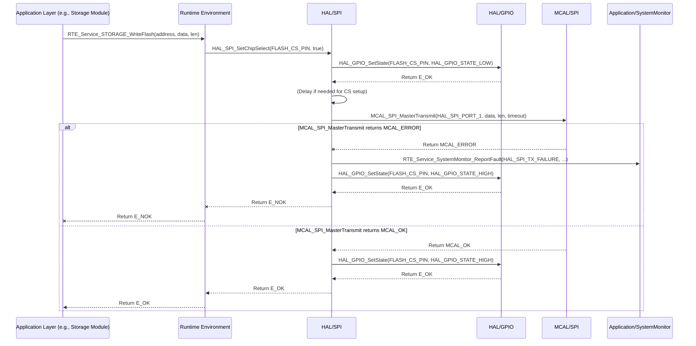

# **Detailed Design Document: HAL_SPI Component**

## **1. Introduction**

### **1.1. Purpose**

This document details the design of the HAL_SPI component, which provides a hardware abstraction layer for Serial Peripheral Interface (SPI) communication peripherals. Its primary purpose is to offer a standardized, microcontroller-independent interface for managing SPI bus operations, abstracting the low-level register access and specific MCU details from higher layers.

### **1.2. Scope**

The scope of this document covers the HAL_SPI module's architecture, functional behavior, interfaces, dependencies, and resource considerations. It details how the HAL layer interacts with the underlying Microcontroller Abstraction Layer (MCAL) for SPI operations.

### **1.3. References**

* Software Architecture Document (SAD) - Smart Device Firmware (Final Version)  
* MCAL SPI Driver Specification (Conceptual, as it's the lower layer)  
* MCU Datasheet / Reference Manual (for specific SPI capabilities)  
* SPI Bus Specification

## **2. Functional Description**

The HAL_SPI component provides the following core functionalities:

1. **SPI Initialization**: Configure specific SPI master units, including clock speed, SPI mode (CPOL/CPHA), bit order (MSB/LSB first), and associated GPIO pins (MOSI, MISO, SCLK).  
2. **Chip Select (CS) Management**: Control the Chip Select (CS) / Slave Select (SS) GPIO pin for selecting specific slave devices.  
3. **Master Transmit**: Send a block of bytes over the SPI bus.  
4. **Master Receive**: Receive a block of bytes from the SPI bus.  
5. **Master Transmit-Receive (Full-Duplex)**: Perform a simultaneous transmit and receive operation.  
6. **Error Reporting**: Report any failures during SPI operations (e.g., initialization failure, timeout, bus error) to the SystemMonitor via RTE_Service_SystemMonitor_ReportFault().

## **3. Non-Functional Requirements**

### **3.1. Performance**

* **Speed**: Support various SPI clock speeds required by connected slave devices.  
* **Reliability**: Ensure robust data transfer over the SPI bus, minimizing data corruption or loss.  
* **Blocking/Non-Blocking (Optional)**: Support both blocking (synchronous) and potentially non-blocking (asynchronous, with callbacks/DMA) operations for flexibility. This design focuses on blocking for simplicity.

### **3.2. Memory**

* **Minimal Footprint**: The HAL_SPI code and data shall have a minimal memory footprint.  
* **Buffer Management**: Efficiently manage transmit and receive buffers for SPI transactions.

### **3.3. Reliability**

* **Robustness**: The module shall handle bus errors (e.g., incorrect timing, slave not responding) gracefully.  
* **Fault Isolation**: Failures in SPI communication should be isolated and reported without crashing the system.  
* **Timeout Handling**: Implement timeouts for SPI transactions to prevent indefinite waiting.

## **4. Architectural Context**

As per the SAD (Section 3.1.2, HAL Layer), HAL_SPI resides in the Hardware Abstraction Layer. It acts as an intermediary between higher layers (e.g., Application/storage for external Flash/EEPROM, Application/display for certain display types) and the MCAL_SPI driver. HAL_SPI translates generic SPI requests into MCAL-specific calls.

## **5. Design Details**

### **5.1. Module Structure**

The HAL_SPI component will consist of the following files:

* HAL/inc/hal_spi.h: Public header file containing function prototypes, data types, and error codes.  
* HAL/src/hal_spi.c: Source file containing the implementation of the HAL_SPI functions.  
* HAL/cfg/hal_spi_cfg.h: Configuration header for static SPI bus definitions and initial settings.

### **5.2. Public Interface (API)**

```c
// In HAL/inc/hal_spi.h

// Enum for SPI port IDs (logical identifiers for each hardware SPI instance)  
typedef enum {  
    HAL_SPI_PORT_0, // Often used for internal flash/debug, might not be exposed  
    HAL_SPI_PORT_1, // General purpose SPI bus  
    // Add more SPI ports as needed based on hardware availability  
    HAL_SPI_PORT_COUNT  
} HAL_SPI_PortId_t;

// Enum for SPI mode (CPOL and CPHA)  
typedef enum {  
    HAL_SPI_MODE_0, // CPOL=0, CPHA=0  
    HAL_SPI_MODE_1, // CPOL=0, CPHA=1  
    HAL_SPI_MODE_2, // CPOL=1, CPHA=0  
    HAL_SPI_MODE_3  // CPOL=1, CPHA=1  
} HAL_SPI_Mode_t;

// Enum for SPI bit order  
typedef enum {  
    HAL_SPI_BIT_ORDER_MSB_FIRST,  
    HAL_SPI_BIT_ORDER_LSB_FIRST  
} HAL_SPI_BitOrder_t;

// Structure for initial SPI bus configuration  
typedef struct {  
    HAL_SPI_PortId_t port_id;  
    uint32_t clk_speed_hz;      // SPI clock speed in Hz  
    HAL_SPI_Mode_t spi_mode;  
    HAL_SPI_BitOrder_t bit_order;  
    uint8_t mosi_gpio_pin;      // GPIO pin for Master Out Slave In  
    uint8_t miso_gpio_pin;      // GPIO pin for Master In Slave Out  
    uint8_t sclk_gpio_pin;      // GPIO pin for Serial Clock  
    uint32_t timeout_ms;        // Default transaction timeout in milliseconds  
} HAL_SPI_Config_t;

/**  
 * @brief Initializes all configured SPI peripherals based on the predefined array.  
 * This function should be called once during system initialization.  
 * @return E_OK on success, E_NOK if any SPI port fails to initialize.  
 */  
APP_Status_t HAL_SPI_Init(void);

/**  
 * @brief Controls a specific Chip Select (CS) / Slave Select (SS) GPIO pin.  
 * This function is used by higher layers to select/deselect SPI slave devices.  
 * @param cs_gpio_pin The GPIO pin number for the Chip Select.  
 * @param active True to assert (active low typically) CS, false to de-assert.  
 * @return E_OK on success, E_NOK on failure.  
 */  
APP_Status_t HAL_SPI_SetChipSelect(uint8_t cs_gpio_pin, bool active);

/**  
 * @brief Performs an SPI master transmit operation.  
 * @param port_id The ID of the SPI port to use.  
 * @param data_out Pointer to the data buffer to transmit.  
 * @param data_out_len Length of the data to transmit.  
 * @return E_OK on success, E_NOK on failure.  
 */  
APP_Status_t HAL_SPI_MasterTransmit(HAL_SPI_PortId_t port_id, const uint8_t *data_out, uint16_t data_out_len);

/**  
 * @brief Performs an SPI master receive operation.  
 * @param port_id The ID of the SPI port to use.  
 * @param data_in Pointer to the buffer to store received data.  
 * @param data_in_len Length of the data to receive.  
 * @return E_OK on success, E_NOK on failure.  
 */  
APP_Status_t HAL_SPI_MasterReceive(HAL_SPI_PortId_t port_id, uint8_t *data_in, uint16_t data_in_len);

/**  
 * @brief Performs a simultaneous SPI master transmit and receive operation.  
 * @param port_id The ID of the SPI port to use.  
 * @param data_out Pointer to the data buffer to transmit.  
 * @param data_in Pointer to the buffer to store received data.  
 * @param data_len Length of the data to transmit and receive.  
 * @return E_OK on success, E_NOK on failure.  
 */  
APP_Status_t HAL_SPI_MasterTransmitReceive(HAL_SPI_PortId_t port_id, const uint8_t *data_out,  
                                           uint8_t *data_in, uint16_t data_len);
```

### **5.3. Internal Design**

The HAL_SPI module will act as a wrapper around the MCAL_SPI functions. It will perform input validation, parameter translation, and handle error reporting before delegating the actual hardware access to the MCAL layer.

1. **Initialization (HAL_SPI_Init)**:  
   * This function will **loop through the hal_spi_initial_config array** defined in HAL/cfg/hal_spi_cfg.h.  
   * For each entry in the array:  
     * Validate the port_id against HAL_SPI_PORT_COUNT and GPIO pins.  
     * Translate HAL_SPI_Mode_t and HAL_SPI_BitOrder_t into MCAL_SPI specific enums/macros.  
     * Call MCAL_SPI_Init(mcal_port_id, mcal_clk_speed, mcal_spi_mode, mcal_bit_order, mcal_mosi_pin, mcal_miso_pin, mcal_sclk_pin).  
     * If MCAL_SPI_Init returns an error for *any* port, report HAL_SPI_INIT_FAILURE to SystemMonitor. The function should continue to attempt to initialize remaining ports but will ultimately return E_NOK if any initialization fails.  
   * If all SPI ports are initialized successfully, return E_OK.  
2. **Chip Select Control (HAL_SPI_SetChipSelect)**:  
   * This function directly calls HAL_GPIO_SetState(cs_gpio_pin, active ? HAL_GPIO_STATE_LOW : HAL_GPIO_STATE_HIGH) (assuming active-low CS, which is common).  
   * It's crucial that the cs_gpio_pin is configured as an output in HAL_GPIO_Init during system startup.  
   * Report HAL_SPI_CS_CONTROL_FAILURE if HAL_GPIO_SetState fails.  
3. **Master Transmit (HAL_SPI_MasterTransmit)**:  
   * Validate port_id, data_out, and data_out_len.  
   * Call MCAL_SPI_MasterTransmit(mcal_port_id, data_out, data_out_len, config->timeout_ms).  
   * If MCAL_SPI_MasterTransmit returns an error, report HAL_SPI_TX_FAILURE to SystemMonitor.  
4. **Master Receive (HAL_SPI_MasterReceive)**:  
   * Validate port_id, data_in, and data_in_len.  
   * Call MCAL_SPI_MasterReceive(mcal_port_id, data_in, data_in_len, config->timeout_ms).  
   * If MCAL_SPI_MasterReceive returns an error, report HAL_SPI_RX_FAILURE to SystemMonitor.  
5. **Master Transmit-Receive (HAL_SPI_MasterTransmitReceive)**:  
   * Validate all input parameters.  
   * Call MCAL_SPI_MasterTransmitReceive(mcal_port_id, data_out, data_in, data_len, config->timeout_ms).  
   * If MCAL_SPI_MasterTransmitReceive returns an error, report HAL_SPI_TRX_FAILURE to SystemMonitor.

**Sequence Diagram (Example: HAL_SPI_MasterTransmit):**



### **5.4. Dependencies**

* **Mcal/spi/inc/mcal_spi.h**: For calling low-level SPI driver functions.  
* **HAL/inc/hal_gpio.h**: For controlling Chip Select (CS) pins.  
* **Application/logger/inc/logger.h**: For internal logging.  
* **Rte/inc/Rte.h**: For calling RTE_Service_SystemMonitor_ReportFault().  
* **Application/common/inc/common.h**: For APP_Status_t and E_OK/E_NOK.  
* **HAL/cfg/hal_spi_cfg.h**: For the hal_spi_initial_config array and HAL_SPI_Config_t structure.

### **5.5. Error Handling**

* **Input Validation**: All public API functions will validate input parameters (e.g., valid port_id, non-NULL pointers, valid lengths).  
* **MCAL Error Propagation**: Errors returned by MCAL_SPI functions will be caught by HAL_SPI.  
* **Fault Reporting**: Upon detection of an error (invalid input, MCAL failure, SPI bus error), HAL_SPI will report a specific fault ID (e.g., HAL_SPI_INIT_FAILURE, HAL_SPI_CS_CONTROL_FAILURE, HAL_SPI_TX_FAILURE, HAL_SPI_RX_FAILURE, HAL_SPI_TRX_FAILURE) to SystemMonitor via the RTE service.  
* **Return Status**: All public API functions will return E_NOK on failure. HAL_SPI_Init will return E_NOK if *any* port fails to initialize.

### **5.6. Configuration**

The HAL/cfg/hal_spi_cfg.h file will contain:

* Macros or enums for logical SPI port IDs.  
* The hal_spi_initial_config array, which defines the initial configuration for all SPI peripherals used by the system.  
* The size of the hal_spi_initial_config array.  
* Macros for specific Chip Select (CS) GPIO pins used by devices connected to SPI (these pins would also be initialized by HAL_GPIO).

```c
// Example: HAL/cfg/hal_spi_cfg.h  
#define SPI_PORT_EXTERNAL_FLASH     HAL_SPI_PORT_1  
#define SPI_PORT_DISPLAY_CONTROLLER HAL_SPI_PORT_2 // If a display uses SPI

#define FLASH_CS_GPIO_PIN           10 // Example GPIO pin for Flash CS  
#define DISPLAY_CS_GPIO_PIN         11 // Example GPIO pin for Display CS

// Initial configuration array  
extern const HAL_SPI_Config_t hal_spi_initial_config[];  
extern const uint32_t hal_spi_initial_config_size;
```

### **5.7. Resource Usage**

* **Flash**: Moderate, depending on the number of API functions and the size of the hal_spi_initial_config array.  
* **RAM**: Minimal for internal state and transaction buffers.  
* **CPU**: Low for individual transactions. Can increase with high data rates, frequent transactions, or complex error recovery.

## **6. Test Considerations**

### **6.1. Unit Testing**

* **Mock MCAL_SPI & HAL_GPIO**: Unit tests for HAL_SPI will mock the MCAL_SPI and HAL_GPIO functions to isolate HAL_SPI's logic.  
* **Test Cases**:  
  * HAL_SPI_Init: Test with a valid hal_spi_initial_config array. Verify MCAL_SPI_Init calls for each entry. Test scenarios where MCAL calls fail (verify E_NOK return and SystemMonitor fault reporting).  
  * HAL_SPI_SetChipSelect: Test valid/invalid CS GPIO pins. Verify correct HAL_GPIO_SetState calls.  
  * HAL_SPI_MasterTransmit: Test valid/invalid parameters. Mock MCAL_SPI_MasterTransmit to simulate success, timeouts, bus errors. Verify correct return status and fault reporting.  
  * HAL_SPI_MasterReceive: Similar to transmit, test valid/invalid parameters and mock MCAL_SPI_MasterReceive for various outcomes.  
  * HAL_SPI_MasterTransmitReceive: Test combined operations, ensuring correct MCAL_SPI_MasterTransmitReceive calls. Test error handling.  
  * Error reporting: Verify that RTE_Service_SystemMonitor_ReportFault() is called with the correct fault ID on various error conditions.

### **6.2. Integration Testing**

* **HAL-MCAL Integration**: Verify that HAL_SPI correctly interfaces with the actual MCAL_SPI driver and HAL_GPIO.  
* **Loopback Test**: Connect SPI MOSI to MISO (either physically or via a software loopback) and send/receive data to verify basic functionality.  
* **External Device Communication**: Connect to actual SPI slave devices (e.g., external Flash, display controller) and verify successful communication (write/read data).  
* **Error Injection**: Introduce SPI bus errors (e.g., incorrect clock, disconnecting lines) to verify that HAL_SPI detects and reports these faults correctly to SystemMonitor.  
* **Throughput Test**: Test communication at different clock speeds with varying data lengths to assess performance and stability.

### **6.3. System Testing**

* **End-to-End Functionality**: Verify that all application features relying on SPI (e.g., saving/loading configuration from external flash, updating SPI-driven displays) work correctly within the integrated system.  
* **Long-Term Stability**: Run the system for extended periods with active SPI communication to detect any issues related to bus hangs, memory leaks, or unhandled errors.  
* **Power Modes**: Ensure SPI peripherals behave correctly during power mode transitions (e.g., low-power states, re-initialization on wake-up).
