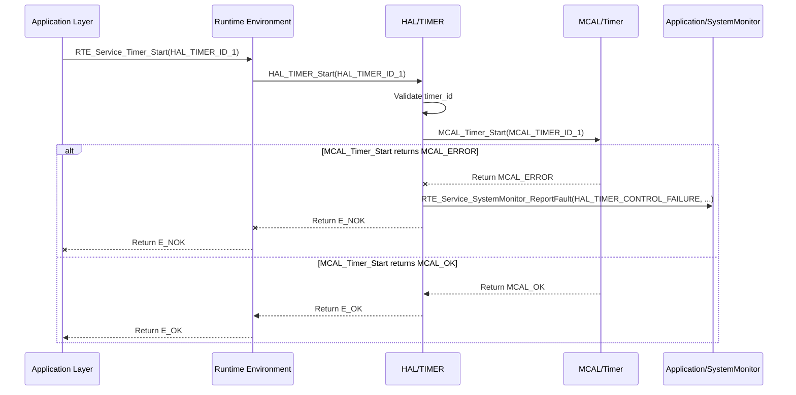

# Detailed Design Document: HAL_TIMER Component

## 1. Introduction

### 1.1. Purpose

This document details the design of the `HAL_TIMER` component, which provides a hardware abstraction layer for microcontroller Timer/Counter peripherals. Its primary purpose is to offer a standardized, microcontroller-independent interface for configuring and managing hardware timers, enabling precise timing, periodic events, and time-based measurements.

### 1.2. Scope

The scope of this document covers the `HAL_TIMER` module's architecture, functional behavior, interfaces, dependencies, and resource considerations. It details how the HAL layer interacts with the underlying Microcontroller Abstraction Layer (MCAL) for timer operations.

### 1.3. References

* Software Architecture Document (SAD) - Environmental Monitoring & Control System (Final Version)

* MCAL Timer Driver Specification (Conceptual, as it's the lower layer)

* MCU Datasheet / Reference Manual (for specific Timer capabilities)

## 2. Functional Description

The `HAL_TIMER` component provides the following core functionalities:

1. **Timer Initialization**: Configure specific hardware timer units (e.g., Timer0, Timer1), including their operating mode (e.g., periodic, one-shot), prescaler, and initial period/count.

2. **Timer Control**: Start, stop, and reset individual timers.

3. **Period/Count Configuration**: Dynamically set the period or target count for a timer.

4. **Interrupt Management**: Enable, disable, and register callback functions for timer overflow/match interrupts.

5. **Time Measurement**: Provide functions to read the current count of a running timer (for time measurement).

6. **Error Reporting**: Report any failures during timer operations (e.g., initialization failure, invalid timer ID, interrupt configuration error) to the `SystemMonitor` via `RTE_Service_SystemMonitor_ReportFault()`.

## 3. Non-Functional Requirements

### 3.1. Performance

* **Precision**: Timers shall operate with high precision, minimizing drift over time.

* **Resolution**: The timer resolution shall be configurable to meet the timing accuracy requirements of various application modules.

* **Minimal Jitter**: Timer interrupts shall exhibit minimal jitter to ensure consistent periodic execution.

### 3.2. Memory

* **Minimal Footprint**: The `HAL_TIMER` code and data shall have a minimal memory footprint.

* **Configuration Storage**: Configuration data for timers shall be stored efficiently.

### 3.3. Reliability

* **Robustness**: The module shall handle invalid timer configurations or hardware access failures gracefully.

* **Stability**: Timer operations shall be stable and not prone to unexpected resets or hangs.

## 4. Architectural Context

As per the SAD (Section 3.1.2, HAL Layer), `HAL_TIMER` resides in the Hardware Abstraction Layer. It acts as an intermediary between Application/Service Layer components (e.g., `RTE` for task scheduling, `Application/common` for uptime tracking, `Application/fan` for PWM timing) and the `MCAL_Timer` driver. `HAL_TIMER` translates generic timer requests into MCAL-specific calls.

## 5. Design Details

### 5.1. Module Structure

The `HAL_TIMER` component will consist of the following files:

* `HAL/inc/hal_timer.h`: Public header file containing function prototypes, data types, and error codes.

* `HAL/src/hal_timer.c`: Source file containing the implementation of the HAL_TIMER functions.

* `HAL/cfg/hal_timer_cfg.h`: Configuration header for static timer definitions and initial settings.

### 5.2. Public Interface (API)

```c
// In HAL/inc/hal_timer.h

// Enum for Timer IDs (logical identifiers for each hardware timer instance)
typedef enum {
    HAL_TIMER_ID_0,      // Used for OS tick or general purpose
    HAL_TIMER_ID_1,      // Used for application specific timing (e.g., fan control)
    // Add more timer IDs as needed based on hardware availability
    HAL_TIMER_ID_COUNT
} HAL_TIMER_ID_t;

// Enum for Timer Mode
typedef enum {
    HAL_TIMER_MODE_PERIODIC,
    HAL_TIMER_MODE_ONE_SHOT
} HAL_TIMER_Mode_t;

// Structure for initial Timer configuration
typedef struct {
    HAL_TIMER_ID_t timer_id;
    HAL_TIMER_Mode_t mode;
    uint32_t period_us; // Period in microseconds
    bool auto_reload;   // True for periodic, false for one-shot (after interrupt)
    bool interrupt_enable_on_init; // Enable interrupt after init
} HAL_TIMER_Config_t;

// Function pointer for Timer interrupt callbacks
typedef void (*HAL_TIMER_Callback_t)(HAL_TIMER_ID_t timer_id);

/**
 * @brief Initializes all configured hardware timers based on the predefined array.
 * This function should be called once during system initialization.
 * @return E_OK on success, E_NOK if any timer fails to initialize.
 */
APP_Status_t HAL_TIMER_Init(void);

/**
 * @brief Starts a specific hardware timer.
 * @param timer_id The ID of the timer to start.
 * @return E_OK on success, E_NOK on failure.
 */
APP_Status_t HAL_TIMER_Start(HAL_TIMER_ID_t timer_id);

/**
 * @brief Stops a specific hardware timer.
 * @param timer_id The ID of the timer to stop.
 * @return E_OK on success, E_NOK on failure.
 */
APP_Status_t HAL_TIMER_Stop(HAL_TIMER_ID_t timer_id);

/**
 * @brief Resets the count of a specific hardware timer to zero.
 * @param timer_id The ID of the timer to reset.
 * @return E_OK on success, E_NOK on failure.
 */
APP_Status_t HAL_TIMER_Reset(HAL_TIMER_ID_t timer_id);

/**
 * @brief Sets the period (or target count) for a specific hardware timer.
 * @param timer_id The ID of the timer.
 * @param period_us The desired period in microseconds.
 * @return E_OK on success, E_NOK on failure.
 */
APP_Status_t HAL_TIMER_SetPeriod(HAL_TIMER_ID_t timer_id, uint32_t period_us);

/**
 * @brief Reads the current count of a specific hardware timer.
 * @param timer_id The ID of the timer.
 * @param current_count Pointer to store the current timer count.
 * @return E_OK on success, E_NOK on failure.
 */
APP_Status_t HAL_TIMER_ReadCount(HAL_TIMER_ID_t timer_id, uint32_t *current_count);

/**
 * @brief Registers a callback function for a timer's interrupt.
 * @param timer_id The ID of the timer.
 * @param callback The function to call when the timer interrupt occurs.
 * @return E_OK on success, E_NOK on failure.
 */
APP_Status_t HAL_TIMER_RegisterCallback(HAL_TIMER_ID_t timer_id, HAL_TIMER_Callback_t callback);

/**
 * @brief Enables the interrupt for a specific hardware timer.
 * @param timer_id The ID of the timer.
 * @return E_OK on success, E_NOK on failure.
 */
APP_Status_t HAL_TIMER_EnableInterrupt(HAL_TIMER_ID_t timer_id);

/**
 * @brief Disables the interrupt for a specific hardware timer.
 * @param timer_id The ID of the timer.
 * @return E_OK on success, E_NOK on failure.
 */
APP_Status_t HAL_TIMER_DisableInterrupt(HAL_TIMER_ID_t timer_id);

```

### 5.3. Internal Design

The HAL_TIMER module will primarily act as a wrapper around the MCAL_Timer functions. It will perform input validation, parameter translation, and manage callbacks before delegating the actual hardware access to the MCAL layer.

* **Initialization (`HAL_TIMER_Init`):**

  This function will loop through the `hal_timer_initial_config` array defined in `HAL/cfg/hal_timer_cfg.h`.

  For each entry in the array:

  * Validate the `timer_id` against `HAL_TIMER_ID_COUNT`.
  * Translate `HAL_TIMER_Mode_t` to MCAL_Timer specific enums/macros.
  * Call `MCAL_Timer_Init(mcal_timer_id, mcal_mode, mcal_period_us, mcal_auto_reload)`.
  * If `MCAL_Timer_Init` returns an error for any timer, report `HAL_TIMER_DRIVER_INIT_FAILURE` to SystemMonitor. The function should continue to attempt to initialize remaining timers but will ultimately return `E_NOK` if any initialization fails.
  * If `interrupt_enable_on_init` is true, call `MCAL_Timer_EnableInterrupt(mcal_timer_id)`. If this fails, report `HAL_TIMER_INTERRUPT_FAILURE`.
  * If all timers are initialized successfully, return `E_OK`.

* **Timer Control (`HAL_TIMER_Start`, `HAL_TIMER_Stop`, `HAL_TIMER_Reset`):**

  * Validate `timer_id`.
  * Call the corresponding `MCAL_Timer_Start()`, `MCAL_Timer_Stop()`, or `MCAL_Timer_Reset()` function.
  * Report `HAL_TIMER_CONTROL_FAILURE` if the MCAL call fails.

* **Period/Count Configuration (`HAL_TIMER_SetPeriod`):**

  * Validate `timer_id` and `period_us`.
  * Call `MCAL_Timer_SetPeriod(mcal_timer_id, mcal_period_us)`.
  * Report `HAL_TIMER_CONFIG_FAILURE` if the MCAL call fails.

* **Time Measurement (`HAL_TIMER_ReadCount`):**

  * Validate `timer_id`.
  * Call `MCAL_Timer_ReadCount(mcal_timer_id, current_count)`.
  * Report `HAL_TIMER_READ_FAILURE` if the MCAL call fails.

* **Interrupt Management (`HAL_TIMER_RegisterCallback`, `HAL_TIMER_EnableInterrupt`, `HAL_TIMER_DisableInterrupt`):**

  * Maintain an internal array (`HAL_TIMER_Callback_t timer_callbacks[HAL_TIMER_ID_COUNT]`) to store registered callback functions.
  * `HAL_TIMER_RegisterCallback`: Validate `timer_id` and store the callback function. This function will also call `MCAL_Timer_RegisterISR(mcal_timer_id, internal_isr_handler)`. The `internal_isr_handler` is a static function within HAL_TIMER that, when called by the MCAL ISR, will look up and execute the user-registered `HAL_TIMER_Callback_t`.
  * `HAL_TIMER_EnableInterrupt` / `HAL_TIMER_DisableInterrupt`: Validate `timer_id`. Call `MCAL_Timer_EnableInterrupt(mcal_timer_id)` / `MCAL_Timer_DisableInterrupt(mcal_timer_id)`.
  * Report `HAL_TIMER_INTERRUPT_FAILURE` if any MCAL call fails.

#### Sequence Diagram (Example: HAL_TIMER_Start)



### 5.4. Dependencies

* **Mcal/timers/inc/mcal_timer.h:** For calling low-level Timer driver functions.

* **Application/logger/inc/logger.h:** For internal logging.

* **Rte/inc/Rte.h:** For calling `RTE_Service_SystemMonitor_ReportFault()`.

* **Application/common/inc/common.h:** For `APP_Status_t` and `E_OK`/`E_NOK`.

* **HAL/cfg/hal_timer_cfg.h:** For the `hal_timer_initial_config` array and `HAL_TIMER_Config_t` structure.

---

### 5.5. Error Handling

* **Input Validation:** All public API functions will validate input parameters (e.g., valid `timer_id`, non-zero `period_us`).

* **MCAL Error Propagation:** Errors returned by `MCAL_Timer` functions will be caught by `HAL_TIMER`.

* **Fault Reporting:** Upon detection of an error (invalid input, MCAL failure), `HAL_TIMER` will report a specific fault ID (e.g., `HAL_TIMER_DRIVER_INIT_FAILURE`, `HAL_TIMER_CONFIG_FAILURE`, `HAL_TIMER_CONTROL_FAILURE`, `HAL_TIMER_INTERRUPT_FAILURE`, `HAL_TIMER_READ_FAILURE`) to SystemMonitor via the RTE service.

* **Return Status:** All public API functions will return `E_NOK` on failure. `HAL_TIMER_Init` will return `E_NOK` if any timer fails to initialize.

---

### 5.6. Configuration

The `HAL/cfg/hal_timer_cfg.h` file will contain:

* Macros or enums for logical timer IDs (e.g., `APP_TIMER_FAN_CONTROL`).

* The `hal_timer_initial_config` array, which defines the initial configuration for all hardware timers used by the system.

* The size of the `hal_timer_initial_config` array.

```c
// Example: HAL/cfg/hal_timer_cfg.h
#define APP_TIMER_OS_TICK_ID            HAL_TIMER_ID_0
#define APP_TIMER_FAN_CONTROL_ID        HAL_TIMER_ID_1
#define APP_TIMER_DISPLAY_UPDATE_ID     HAL_TIMER_ID_2

// Initial configuration array
extern const HAL_TIMER_Config_t hal_timer_initial_config[];
extern const uint32_t hal_timer_initial_config_size;
```

### 5.7. Resource Usage

* **Flash:** Moderate, depending on the number of API functions and the size of the `hal_timer_initial_config` array.

* **RAM:** Minimal for internal state (e.g., callback function pointers array).

* **CPU:** Very low for basic operations (start/stop/read), higher during interrupt handling (executing callbacks).

---

### 6. Test Considerations

#### 6.1. Unit Testing

* **Mock MCAL_Timer:** Unit tests for `HAL_TIMER` will mock the `MCAL_Timer` functions to isolate `HAL_TIMER`'s logic.

* **Test Cases:**
  * `HAL_TIMER_Init`: Test with a valid `hal_timer_initial_config` array. Verify `MCAL_Timer_Init` calls for each entry. Test scenarios where MCAL calls fail (verify `E_NOK` return and SystemMonitor fault reporting).
  * `HAL_TIMER_Start`/`Stop`/`Reset`: Test valid/invalid timer IDs. Verify correct MCAL calls and error propagation.
  * `HAL_TIMER_SetPeriod`: Test valid/invalid timer IDs and periods. Verify correct MCAL calls.
  * `HAL_TIMER_ReadCount`: Test valid/invalid timer IDs. Verify correct MCAL calls and return values.
  * `HAL_TIMER_RegisterCallback`: Test valid/invalid timer IDs. Verify callback registration and `MCAL_Timer_RegisterISR` calls.
  * **Interrupt handling:** Mock `MCAL_Timer_ISR` to trigger `internal_isr_handler` and verify the registered callback is executed.
  * **Error reporting:** Verify that `RTE_Service_SystemMonitor_ReportFault()` is called with the correct fault ID on various error conditions.

#### 6.2. Integration Testing

* **HAL-MCAL Integration:** Verify that `HAL_TIMER` correctly interfaces with the actual `MCAL_Timer` driver.

* **Periodic Events:** Use `HAL_TIMER` to generate periodic interrupts and verify that application tasks (e.g., sensor reading tasks) are triggered at the correct intervals.

* **Time Measurement:** Use `HAL_TIMER_ReadCount` to measure time durations and verify accuracy.

* **Fault Reporting:** Trigger MCAL errors (e.g., by simulating hardware issues) and verify that `HAL_TIMER` reports faults to SystemMonitor.

#### 6.3. System Testing

* **Full System Timing:** Verify that all time-critical application features (e.g., control loop frequencies, display refresh rates, communication timeouts) meet their timing requirements.

* **Long-Term Stability:** Run the system for extended periods to detect any timer drift or unexpected behavior.

* **Power Modes:** Ensure timers behave correctly during power mode transitions (e.g., sleep modes, wake-up from timer).
