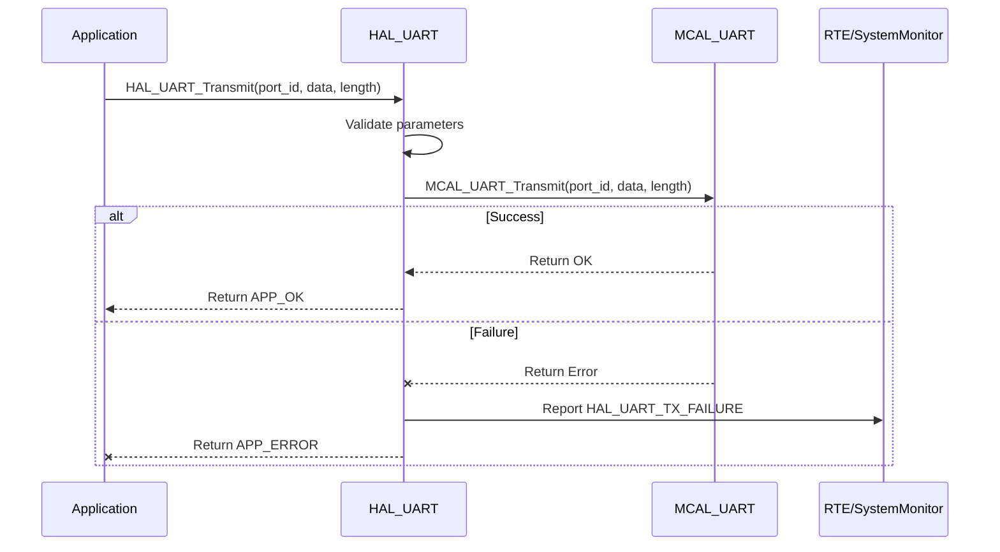

# Detailed Design Document: HAL_UART Component

## 1. Introduction

### 1.1. Purpose
This document details the design of the HAL_UART component, which provides a hardware abstraction layer for Universal Asynchronous Receiver-Transmitter (UART) peripherals. Its primary purpose is to offer a standardized, microcontroller-independent interface for serial communication, abstracting the low-level register access and specific MCU details from higher layers.

### 1.2. Scope
The scope of this document covers the HAL_UART module's architecture, functional behavior, interfaces, dependencies, and resource considerations. It details how the HAL layer interacts with the underlying Microcontroller Abstraction Layer (MCAL) for UART operations.

### 1.3. References
- Software Architecture Document (SAD) - Smart Device Firmware (Final Version)
- MCAL UART Driver Specification
- MCU Datasheet / Reference Manual

---

## 2. Functional Description

The HAL_UART component provides the following core functionalities:
- **UART Initialization**: Configure UART peripherals (baud rate, data bits, stop bits, parity).
- **Byte Transmission**: Send single or multiple bytes.
- **Byte Reception**: Receive single or multiple bytes with optional timeout.
- **Interrupt Management**: Enable/disable interrupts, register callbacks for TX/RX events.
- **Error Reporting**: Report errors (e.g., init failure, timeout) to SystemMonitor via RTE.

---

## 3. Non-Functional Requirements

### 3.1. Performance
- **Throughput**: Efficient communication at specified baud rates.
- **Latency**: Low latency for byte-level operations.
- **Reliability**: Robust against data corruption or loss.

### 3.2. Memory
- **Minimal Footprint**: Optimized code and data size.
- **Buffer Management**: Efficient, if internal buffering is implemented.

### 3.3. Reliability
- **Robustness**: Graceful error handling.
- **Fault Isolation**: Errors reported without crashing the system.
- **Timeout Handling**: Prevents indefinite blocking during reception.

---

## 4. Architectural Context

According to the SAD (Section 3.1.2), `HAL_UART` resides in the HAL layer. It abstracts and mediates communication between upper layers (e.g., HAL_Modbus, ComM) and the `MCAL_UART` driver.

---

## 5. Design Details

### 5.1. Module Structure
- `HAL/inc/hal_uart.h`: Public API definitions.
- `HAL/src/hal_uart.c`: Implementation of HAL_UART functions.
- `HAL/cfg/hal_uart_cfg.h`: Static configuration definitions.

### 5.2. Public Interface (API)
```c
// In HAL/inc/hal_uart.h

// Enum for UART port IDs (logical identifiers for each hardware UART instance)
typedef enum {
    HAL_UART_PORT_0,
    HAL_UART_PORT_1,
    // Add more UART ports as needed based on hardware availability
    HAL_UART_PORT_COUNT
} HAL_UART_PortId_t;

// Enum for UART parity
typedef enum {
    HAL_UART_PARITY_NONE,
    HAL_UART_PARITY_EVEN,
    HAL_UART_PARITY_ODD
} HAL_UART_Parity_t;

// Enum for UART stop bits
typedef enum {
    HAL_UART_STOP_BITS_1,
    HAL_UART_STOP_BITS_1_5, // 1.5 stop bits (if supported)
    HAL_UART_STOP_BITS_2
} HAL_UART_StopBits_t;

// Enum for UART data bits
typedef enum {
    HAL_UART_DATA_BITS_5,
    HAL_UART_DATA_BITS_6,
    HAL_UART_DATA_BITS_7,
    HAL_UART_DATA_BITS_8
} HAL_UART_DataBits_t;

// Structure for initial UART configuration
typedef struct {
    HAL_UART_PortId_t port_id;
    uint32_t baud_rate;
    HAL_UART_Parity_t parity;
    HAL_UART_StopBits_t stop_bits;
    HAL_UART_DataBits_t data_bits;
    // Add more configuration parameters as needed (e.g., flow control, RX/TX buffer sizes)
} HAL_UART_Config_t;

// Function pointer for UART receive callbacks (e.g., byte received, RX buffer full)
typedef void (*HAL_UART_RxCallback_t)(HAL_UART_PortId_t port_id, const uint8_t *data, uint16_t length);

// Function pointer for UART transmit callbacks (e.g., TX buffer empty, transmission complete)
typedef void (*HAL_UART_TxCallback_t)(HAL_UART_PortId_t port_id);

/**
 * @brief Initializes all configured UART peripherals based on the predefined array.
 * This function should be called once during system initialization.
 * @return APP_OK on success, APP_ERROR if any UART fails to initialize.
 */
APP_Status_t HAL_UART_Init(void);

/**
 * @brief Transmits a block of bytes over UART.
 * @param port_id The ID of the UART port to use.
 * @param data Pointer to the data to transmit.
 * @param length The number of bytes to transmit.
 * @return APP_OK on success, APP_ERROR on failure.
 */
APP_Status_t HAL_UART_Transmit(HAL_UART_PortId_t port_id, const uint8_t *data, uint16_t length);

/**
 * @brief Receives a block of bytes from UART with a timeout.
 * This function may block until 'length' bytes are received or timeout occurs.
 * @param port_id The ID of the UART port to use.
 * @param buffer Pointer to the buffer to store received data.
 * @param buffer_size The maximum number of bytes to read into the buffer.
 * @param timeout_ms Timeout in milliseconds.
 * @param bytes_read Pointer to store the actual number of bytes read.
 * @return APP_OK on success, APP_ERROR on timeout or other failure.
 */
APP_Status_t HAL_UART_Receive(HAL_UART_PortId_t port_id, uint8_t *buffer, uint16_t buffer_size,
                              uint32_t timeout_ms, uint16_t *bytes_read);

/**
 * @brief Registers a callback function for UART receive events.
 * @param port_id The ID of the UART port.
 * @param callback The function to call when receive events occur.
 * @return APP_OK on success, APP_ERROR on failure.
 */
APP_Status_t HAL_UART_RegisterRxCallback(HAL_UART_PortId_t port_id, HAL_UART_RxCallback_t callback);

/**
 * @brief Registers a callback function for UART transmit events.
 * @param port_id The ID of the UART port.
 * @param callback The function to call when transmit events occur.
 * @return APP_OK on success, APP_ERROR on failure.
 */
APP_Status_t HAL_UART_RegisterTxCallback(HAL_UART_PortId_t port_id, HAL_UART_TxCallback_t callback);

/**
 * @brief Enables UART interrupts for a specific port.
 * @param port_id The ID of the UART port.
 * @return APP_OK on success, APP_ERROR on failure.
 */
APP_Status_t HAL_UART_EnableInterrupts(HAL_UART_PortId_t port_id);

/**
 * @brief Disables UART interrupts for a specific port.
 * @param port_id The ID of the UART port.
 * @return APP_OK on success, APP_ERROR on failure.
 */
APP_Status_t HAL_UART_DisableInterrupts(HAL_UART_PortId_t port_id);
```

### 5.3. Internal Design

#### Initialization (`HAL_UART_Init`)
- Iterates over `hal_uart_initial_config` array.
- Validates `port_id`.
- Translates HAL enums to MCAL enums.
- Calls `MCAL_UART_Init(...)`.
- Reports `HAL_UART_INIT_FAILURE` to SystemMonitor if init fails.
- Continues initializing remaining ports.
- Registers ISR handlers if required.
- Returns `APP_OK` if all ports succeed, else `APP_ERROR`.

#### Transmission (`HAL_UART_Transmit`)
- Validates parameters.
- Calls `MCAL_UART_Transmit(...)`.
- Reports `HAL_UART_TX_FAILURE` on failure.

#### Reception (`HAL_UART_Receive`)
- Validates parameters.
- Calls `MCAL_UART_Receive(...)`.
- Reports:
  - `HAL_UART_RX_TIMEOUT`
  - `HAL_UART_FRAME_ERROR`
  - `HAL_UART_PARITY_ERROR`
  - depending on error type.

#### Callback Registration
- Functions: `HAL_UART_RegisterRxCallback`, `HAL_UART_RegisterTxCallback`
- Store callbacks in:
  - `rx_callbacks[HAL_UART_PORT_COUNT]`
  - `tx_callbacks[HAL_UART_PORT_COUNT]`
- Call:
  - `MCAL_UART_RegisterRxISR(...)`
  - `MCAL_UART_RegisterTxISR(...)`
- ISR handlers invoke registered user callbacks.

#### Interrupt Control
- Functions:
  - `HAL_UART_EnableInterrupts`
  - `HAL_UART_DisableInterrupts`
- Calls:
  - `MCAL_UART_EnableInterrupts(...)`
  - `MCAL_UART_DisableInterrupts(...)`
- Reports `HAL_UART_INTERRUPT_FAILURE` on failure.

#### Sequence Diagram (Transmit Example)


### 5.4. Dependencies

The `HAL_UART` module depends on the following components and headers:

- **`Mcal/uart/inc/mcal_uart.h`**  
  Provides the low-level UART driver interface from the MCAL layer. All hardware interactions (e.g., transmit, receive, enable/disable interrupts) are delegated to these functions.

- **`Application/logger/inc/logger.h`**  
  Used for internal logging purposes (e.g., debug messages, error logs).

- **`Rte/inc/Rte.h`**  
  Provides access to the RTE service interface, particularly `RTE_Service_SystemMonitor_ReportFault()` for reporting communication or hardware faults detected in the HAL layer.

- **`Application/common/inc/app_common.h`**  
  Defines common data types used across the application, such as `APP_Status_t`, `APP_OK`, and `APP_ERROR`.

- **`HAL/cfg/hal_uart_cfg.h`**  
  Contains static configuration for UART peripherals, including:
  - Logical UART port ID macros/enums (e.g., `UART_PORT_MODBUS`)
  - The `hal_uart_initial_config[]` array
  - The `HAL_UART_Config_t` structure


---

### 5.5. Error Handling

- **Input Validation**  
  All public API functions will validate input parameters (e.g., valid `port_id`, non-NULL pointers, valid lengths).

- **MCAL Error Propagation**  
  Errors returned by `MCAL_UART` functions are caught and handled by `HAL_UART`.

- **Fault Reporting**  
  On detection of any error (e.g., invalid input, MCAL failure, communication error), `HAL_UART` will report a specific fault ID to `SystemMonitor` via the RTE service. Examples include:
  - `HAL_UART_INIT_FAILURE`
  - `HAL_UART_TX_FAILURE`
  - `HAL_UART_RX_TIMEOUT`
  - `HAL_UART_FRAME_ERROR`
  - `HAL_UART_PARITY_ERROR`
  - `HAL_UART_INTERRUPT_FAILURE`

- **Return Status**  
  All public APIs return `APP_ERROR` on failure. `HAL_UART_Init` returns `APP_ERROR` if any port fails to initialize.

---

### 5.6. Configuration

The file `HAL/cfg/hal_uart_cfg.h` will contain:

- Macros or enums for logical UART port IDs (e.g., `UART_PORT_MODBUS`).
- The `hal_uart_initial_config[]` array for static configuration of all UART peripherals.
- A macro or constant indicating the size of the configuration array.

```c
// Example: HAL/cfg/hal_uart_cfg.h
#define UART_PORT_MODBUS        HAL_UART_PORT_0
#define UART_PORT_DEBUG         HAL_UART_PORT_1

// Initial configuration array
extern const HAL_UART_Config_t hal_uart_initial_config[];
extern const uint32_t hal_uart_initial_config_size;
```
---

### 5.7. Resource Usage

- **Flash**  
  Moderate — based on the number of API functions and configuration size.

- **RAM**  
  Minimal — used for internal state (e.g., callback function arrays) and optional TX/RX buffers.

- **CPU**  
  Low for standard operations, but may increase under high baud rates or interrupt-heavy communication.

---

## 6. Test Considerations

### 6.1. Unit Testing

Unit tests will use mocked `MCAL_UART` functions to isolate and verify `HAL_UART` logic.

**Test Cases:**

- **`HAL_UART_Init`**  
  - Validate full initialization with a valid config array.
  - Simulate MCAL failures and verify:
    - `APP_ERROR` return
    - Fault reported via `SystemMonitor`.

- **`HAL_UART_Transmit`**  
  - Test valid/invalid `port_id`, `data`, and `length`.
  - Verify correct propagation to `MCAL_UART_Transmit`.

- **`HAL_UART_Receive`**  
  - Test valid/invalid `port_id`, `buffer`, `buffer_size`, `timeout_ms`.
  - Mock different outcomes: success, timeout, framing/parity errors.
  - Validate correct return status and `bytes_read`.

- **Callback Registration (`HAL_UART_RegisterRxCallback`, `HAL_UART_RegisterTxCallback`)**  
  - Verify correct registration for valid ports.
  - Confirm MCAL ISR registration is triggered.

- **Interrupt Handling**  
  - Mock ISR triggers (`MCAL_UART_RxISR` / `TxISR`) to ensure internal handlers call registered callbacks.

- **Error Reporting**  
  - Confirm `RTE_Service_SystemMonitor_ReportFault()` is called with correct fault ID for each failure type.

---

### 6.2. Integration Testing

**Test Scenarios:**

- **HAL-MCAL Integration**  
  - Verify correct behavior when using real `MCAL_UART` implementation.

- **Loopback Test**  
  - Connect TX and RX lines and validate transmitted data is received correctly.

- **External Device Communication**  
  - Test real-world UART use cases (e.g., Modbus, terminal communication).

- **Error Injection**  
  - Simulate hardware faults (e.g., disconnects, line noise) to validate fault detection and reporting.

- **Throughput Test**  
  - Assess performance at high baud rates and large data blocks.

---

### 6.3. System Testing

**System-Level Test Objectives:**

- **End-to-End Communication**  
  - Confirm all application-level features relying on UART (e.g., Modbus, debugging) function correctly.

- **Long-Term Stability**  
  - Run continuous data exchange to detect issues such as:
    - Memory leaks
    - Buffer overflows
    - Missed interrupts

- **Power Modes**  
  - Validate UART behavior during and after power mode transitions (e.g., sleep, deep sleep, wake-up).
