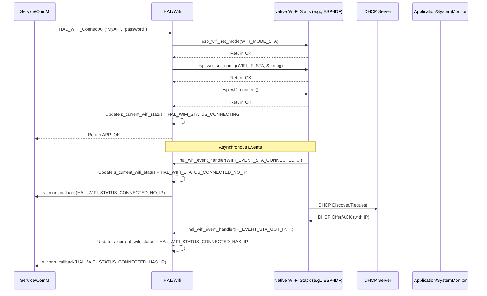

# **Detailed Design Document: HAL_Wifi Component**

## **1. Introduction**

### **1.1. Purpose**

This document details the design of the HAL_WIFI component. Its primary purpose is to provide a **hardware abstraction layer for Wi-Fi functionalities**, specifically managing Wi-Fi station (STA) and access point (AP) modes, network connection/disconnection, and basic TCP/IP socket operations. It abstracts the complexities of the native Wi-Fi SDK/drivers from the higher ComM service layer.

### **1.2. Scope**

The scope of this document covers the HAL_WIFI module's architecture, functional behavior, interfaces, dependencies, and resource considerations. It details how HAL_WIFI interacts with the underlying native Wi-Fi drivers (often part of the MCAL or a vendor SDK) and provides an interface for the ComM module to manage Wi-Fi connections and exchange data over IP sockets.

### **1.3. References**

* Software Architecture Document (SAD) - Environmental Monitoring & Control System (Final Version)  
* System Requirements Specification (SyRS) - Environmental Monitoring & Control System (Updated)  
* Software Requirements Specification (SRS) - Environmental Monitoring & Control System (Updated)  
* Detailed Design Document: RTE  
* Detailed Design Document: ComM  
* Detailed Design Document: SystemMonitor  
* Detailed Design Document: SECURITY  
* Native Wi-Fi SDK Documentation (e.g., ESP-IDF Wi-Fi APIs, lwIP)

## **2. Functional Description**

The HAL_WIFI component provides the following core functionalities:

1. **Initialization (HAL_WIFI_Init)**: Initialize the native Wi-Fi stack (Wi-Fi driver, TCP/IP stack) and configure basic Wi-Fi parameters.  
2. **Mode Selection (HAL_WIFI_SetMode)**: Configure the Wi-Fi module to operate in Station (STA) mode, Access Point (AP) mode, or a combination.  
3. **STA Mode Operations**:  
   * **Connect to AP (HAL_WIFI_ConnectAP)**: Connect to a specified Wi-Fi Access Point using SSID and password.  
   * **Disconnect from AP (HAL_WIFI_DisconnectAP)**: Disconnect from the currently connected Access Point.  
   * **Scan for APs (HAL_WIFI_ScanAPs)**: Scan for available Wi-Fi Access Points.  
4. **AP Mode Operations**:  
   * **Start AP (HAL_WIFI_StartAP)**: Start the Wi-Fi module as an Access Point with a specified SSID, password, and channel.  
   * **Stop AP (HAL_WIFI_StopAP)**: Stop the Wi-Fi Access Point.  
5. **Network Event Handling**: Process Wi-Fi and IP events (e.g., connected to AP, disconnected, IP address obtained, client connected/disconnected in AP mode).  
6. **Socket Management**: Provide basic TCP/UDP socket creation, connection, send, and receive functionalities. This is the primary data exchange mechanism over Wi-Fi.  
7. **Connection State Reporting**: Report changes in Wi-Fi connection status (e.g., connected, disconnected, IP obtained) to ComM.  
8. **Error Reporting**: Detect and report any failures during Wi-Fi operations (e.g., stack initialization failure, connection failure, socket error) to the SystemMonitor via RTE_Service_SystemMonitor_ReportFault().

## **3. Non-Functional Requirements**

### **3.1. Performance**

* **Connection Speed**: Wi-Fi connection establishment shall be responsive.  
* **Throughput**: Capable of handling the expected data rates for configuration, monitoring, and OTA firmware transfer over Wi-Fi.  
* **Latency**: Data exchange over Wi-Fi sockets should have minimal latency.

### **3.2. Memory**

* **Minimal Footprint**: The HAL_WIFI code and data shall have a minimal memory footprint, considering the Wi-Fi stack's own memory requirements.  
* **Buffer Management**: Efficient use of transmit/receive buffers for socket operations.

### **3.3. Reliability**

* **Robustness**: The module shall be robust against connection drops, network errors, or native stack errors, preventing system crashes.  
* **Connection Stability**: Maintain stable Wi-Fi connections under various environmental conditions.  
* **Protocol Conformance**: Adhere to Wi-Fi standards (802.11 b/g/n) and TCP/IP protocols.

## **4. Architectural Context**

As per the SAD (Section 3.1.2, HAL Layer), HAL_WIFI resides in the Hardware Abstraction Layer. It provides the low-level Wi-Fi stack management and TCP/IP socket interaction for the ComM service layer. ComM will call HAL_WIFI_ConnectAP or HAL_WIFI_StartAP to manage connections, and then use HAL_WIFI_SocketSend/HAL_WIFI_SocketReceive for data exchange. HAL_WIFI interacts directly with the native Wi-Fi SDK/drivers provided by the MCU vendor.

## **5. Design Details**

### **5.1. Module Structure**

The HAL_WIFI component will consist of the following files:

* HAL/Wifi/inc/hal_wifi.h: Public header file containing function prototypes, data types (e.g., Wi-Fi modes, connection status), and error codes.  
* HAL/Wifi/src/hal_wifi.c: Source file containing the implementation of Wi-Fi stack initialization, network event handling, and socket management.  
* HAL/Wifi/cfg/hal_wifi_cfg.h: Configuration header for default SSIDs, passwords, AP settings, and socket buffer sizes.

### **5.2. Public Interface (API)**

// In HAL/Wifi/inc/hal_wifi.h
```c
#include "Application/common/inc/app_common.h" // For APP_Status_t  
#include <stdint.h>   // For uint32_t, uint8_t  
#include <stdbool.h>  // For bool

// Enum for Wi-Fi modes  
typedef enum {  
    HAL_WIFI_MODE_OFF = 0,  
    HAL_WIFI_MODE_STA,    // Station (client) mode  
    HAL_WIFI_MODE_AP,     // Access Point mode  
    HAL_WIFI_MODE_APSTA   // Both AP and STA  
} HAL_WIFI_Mode_t;

// Enum for Wi-Fi connection status  
typedef enum {  
    HAL_WIFI_STATUS_DISCONNECTED = 0,  
    HAL_WIFI_STATUS_CONNECTING,  
    HAL_WIFI_STATUS_CONNECTED_NO_IP, // Connected to AP, but no IP yet  
    HAL_WIFI_STATUS_CONNECTED_HAS_IP, // Connected to AP and has IP  
    HAL_WIFI_STATUS_AP_STARTED,       // AP mode started, clients can connect  
    HAL_WIFI_STATUS_ERROR  
} HAL_WIFI_Status_t;

// Structure for network address (simplified)  
typedef struct {  
    uint8_t ip[4];  
    uint16_t port;  
} HAL_WIFI_Addr_t;

// Function pointer for incoming socket data callback (to be registered by ComM)  
typedef void (*HAL_WIFI_RxCallback_t)(int32_t socket_id, const uint8_t *data, uint16_t len, const HAL_WIFI_Addr_t *remote_addr);

// Function pointer for Wi-Fi connection state change callback (to be registered by ComM)  
typedef void (*HAL_WIFI_ConnectionCallback_t)(HAL_WIFI_Status_t status);

/**  
 * @brief Initializes the HAL_WIFI module and the native Wi-Fi stack.  
 * This function should be called once during system initialization.  
 * @return APP_OK on success, APP_ERROR on failure.  
 */  
APP_Status_t HAL_WIFI_Init(void);

/**  
 * @brief Registers callback functions for incoming socket data and connection state changes.  
 * @param rx_callback Function to call when data is received on a socket.  
 * @param conn_callback Function to call when connection state changes.  
 * @return APP_OK on success, APP_ERROR on failure.  
 */  
APP_Status_t HAL_WIFI_RegisterCallbacks(HAL_WIFI_RxCallback_t rx_callback,  
                                        HAL_WIFI_ConnectionCallback_t conn_callback);

/**  
 * @brief Sets the Wi-Fi operational mode (STA, AP, APSTA, OFF).  
 * @param mode The desired Wi-Fi mode.  
 * @return APP_OK on success, APP_ERROR on failure.  
 */  
APP_Status_t HAL_WIFI_SetMode(HAL_WIFI_Mode_t mode);

/**  
 * @brief Connects to a Wi-Fi Access Point in STA mode.  
 * @param ssid The SSID of the Access Point.  
 * @param password The password for the Access Point.  
 * @return APP_OK if connection initiated, APP_ERROR on failure.  
 */  
APP_Status_t HAL_WIFI_ConnectAP(const char *ssid, const char *password);

/**  
 * @brief Disconnects from the current Wi-Fi Access Point.  
 * @return APP_OK on success, APP_ERROR on failure.  
 */  
APP_Status_t HAL_WIFI_DisconnectAP(void);

/**  
 * @brief Starts the Wi-Fi module as an Access Point.  
 * @param ssid The SSID for the AP.  
 * @param password The password for the AP.  
 * @param channel The channel for the AP (1-13).  
 * @return APP_OK if AP started, APP_ERROR on failure.  
 */  
APP_Status_t HAL_WIFI_StartAP(const char *ssid, const char *password, uint8_t channel);

/**  
 * @brief Stops the Wi-Fi Access Point.  
 * @return APP_OK on success, APP_ERROR on failure.  
 */  
APP_Status_t HAL_WIFI_StopAP(void);

/**  
 * @brief Creates a new TCP socket.  
 * @return Socket ID on success (>=0), -1 on failure.  
 */  
int32_t HAL_WIFI_CreateTcpSocket(void);

/**  
 * @brief Connects a TCP socket to a remote address.  
 * @param socket_id The ID of the socket.  
 * @param remote_addr Pointer to the remote address structure.  
 * @return APP_OK on success, APP_ERROR on failure.  
 */  
APP_Status_t HAL_WIFI_TcpConnect(int32_t socket_id, const HAL_WIFI_Addr_t *remote_addr);

/**  
 * @brief Sends data over a TCP socket.  
 * @param socket_id The ID of the socket.  
 * @param data Pointer to the data to send.  
 * @param len Length of the data.  
 * @return Number of bytes sent on success, -1 on failure.  
 */  
int32_t HAL_WIFI_SocketSend(int32_t socket_id, const uint8_t *data, uint16_t len);

/**  
 * @brief Receives data from a socket.  
 * This function should be called periodically to poll for incoming data.  
 * @param socket_id The ID of the socket.  
 * @param buffer Pointer to the buffer to store received data.  
 * @param buffer_len Maximum length of the buffer.  
 * @return Number of bytes received on success, 0 if no data, -1 on error.  
 */  
int32_t HAL_WIFI_SocketReceive(int32_t socket_id, uint8_t *buffer, uint16_t buffer_len);

/**  
 * @brief Closes a socket.  
 * @param socket_id The ID of the socket.  
 * @return APP_OK on success, APP_ERROR on failure.  
 */  
APP_Status_t HAL_WIFI_CloseSocket(int32_t socket_id);

/**  
 * @brief Processes internal Wi-Fi stack events and manages connections.  
 * This function should be called periodically (e.g., by ComM's main function).  
 * It might trigger internal callbacks or update connection states.  
 */  
void HAL_WIFI_Process(void);

/**  
 * @brief Gets the current Wi-Fi connection status.  
 * @return Current Wi-Fi status.  
 */  
HAL_WIFI_Status_t HAL_WIFI_GetStatus(void);
```
### **5.3. Internal Design**

The HAL_WIFI module will wrap the native Wi-Fi SDK's APIs and manage network events. It will use internal event handlers to process asynchronous events from the Wi-Fi stack and then invoke the registered callbacks for ComM.

1. **Internal State Variables**:  
   ```c
   static HAL_WIFI_RxCallback_t s_rx_callback = NULL;  
   static HAL_WIFI_ConnectionCallback_t s_conn_callback = NULL;  
   static bool s_is_initialized = false;  
   static HAL_WIFI_Status_t s_current_wifi_status = HAL_WIFI_STATUS_DISCONNECTED;  
   // Native SDK specific handles/pointers (e.g., esp_netif_t, esp_wifi_config_t, etc.)  
   // Array/list to track open sockets and their associated state  
   // Example: struct { int32_t fd; bool is_tcp; } s_open_sockets[MAX_SOCKETS];
   ```
2. **Initialization (HAL_WIFI_Init)**:  
   * Initialize the native Wi-Fi NVS (Non-Volatile Storage) if required by the SDK (e.g., nvs_flash_init()).  
   * Initialize the TCP/IP stack (e.g., esp_netif_init()).  
   * Initialize the Wi-Fi driver (e.g., esp_wifi_init()).  
   * Register Wi-Fi and IP event handlers with the native SDK (e.g., esp_event_handler_register(WIFI_EVENT, ESP_EVENT_ANY_ID, &hal_wifi_event_handler, NULL)). These hal_wifi_event_handler functions will be internal static functions in hal_wifi.c.  
   * If any step fails, report FAULT_ID_HAL_WIFI_INIT_FAILURE to SystemMonitor and return APP_ERROR.  
   * Set s_is_initialized = true;.  
   * Log LOGI("HAL_WIFI: Initialized successfully.");.  
   * Return APP_OK.  
3. **Register Callbacks (HAL_WIFI_RegisterCallbacks)**:  
   * Validate rx_callback and conn_callback are not NULL.  
   * s_rx_callback = rx_callback;  
   * s_conn_callback = conn_callback;  
   * Return APP_OK.  
4. **Set Mode (HAL_WIFI_SetMode)**:  
   * Validate s_is_initialized.  
   * Call native SDK mode setting function (e.g., esp_wifi_set_mode(mode)).  
   * Report FAULT_ID_HAL_WIFI_MODE_FAILURE on error.  
5. **Connect/Disconnect AP (HAL_WIFI_ConnectAP, HAL_WIFI_DisconnectAP)**:  
   * Validate s_is_initialized, ssid, password.  
   * Configure Wi-Fi STA credentials (e.g., esp_wifi_set_config(WIFI_IF_STA, &wifi_config)).  
   * Call native SDK connect/disconnect functions (e.g., esp_wifi_connect(), esp_wifi_disconnect()).  
   * Update s_current_wifi_status to HAL_WIFI_STATUS_CONNECTING or HAL_WIFI_STATUS_DISCONNECTED.  
   * Report FAULT_ID_HAL_WIFI_CONN_FAILURE on error.  
6. **Start/Stop AP (HAL_WIFI_StartAP, HAL_WIFI_StopAP)**:  
   * Validate s_is_initialized, ssid, password, channel.  
   * Configure Wi-Fi AP credentials (e.g., esp_wifi_set_config(WIFI_IF_AP, &ap_config)).  
   * Call native SDK AP start/stop functions (e.g., esp_wifi_start(), esp_wifi_stop()).  
   * Update s_current_wifi_status to HAL_WIFI_STATUS_AP_STARTED or HAL_WIFI_STATUS_DISCONNECTED.  
   * Report FAULT_ID_HAL_WIFI_AP_FAILURE on error.  
7. **Socket Management (HAL_WIFI_CreateTcpSocket, HAL_WIFI_TcpConnect, HAL_WIFI_SocketSend, HAL_WIFI_SocketReceive, HAL_WIFI_CloseSocket)**:  
   * These functions will wrap the underlying TCP/IP stack's socket APIs (e.g., socket(), connect(), send(), recv(), close()).  
   * Error checks and APP_ERROR / -1 returns on failure.  
   * HAL_WIFI_SocketReceive will typically be non-blocking and return 0 if no data is available. If data is received, it will call s_rx_callback.  
   * Report FAULT_ID_HAL_WIFI_SOCKET_FAILURE on socket errors.  
8. **Process (HAL_WIFI_Process)**:  
   * If !s_is_initialized, return immediately.  
   * This function serves as a periodic trigger for any internal polling or state machine updates within the native Wi-Fi stack that are not purely event-driven. It might iterate through active sockets to check for incoming data or connection status changes if the underlying SDK doesn't provide direct event callbacks for all socket activity.  
   * It's crucial that native Wi-Fi and IP event handlers (e.g., hal_wifi_event_handler) are properly implemented to:  
     * **Handle Wi-Fi Events (e.g., WIFI_EVENT_STA_START, WIFI_EVENT_STA_CONNECTED, WIFI_EVENT_STA_DISCONNECTED, WIFI_EVENT_AP_START, WIFI_EVENT_AP_STACONNECTED)**:  
       * Update s_current_wifi_status.  
       * Call s_conn_callback(new_status) to inform ComM about connection state changes.  
     * **Handle IP Events (e.g., IP_EVENT_STA_GOT_IP)**:  
       * Update s_current_wifi_status to HAL_WIFI_STATUS_CONNECTED_HAS_IP.  
       * Call s_conn_callback(HAL_WIFI_STATUS_CONNECTED_HAS_IP).  
9. **Get Status (HAL_WIFI_GetStatus)**:  
   * Returns s_current_wifi_status.

**Sequence Diagram (Example: HAL_WIFI_ConnectAP and IP Acquisition):**

### **5.4. Dependencies**

* **Native Wi-Fi SDK Headers**: (e.g., esp_wifi.h, esp_event.h, esp_netif.h, lwip/sockets.h for ESP-IDF). These are the direct interface to the MCU's Wi-Fi capabilities and TCP/IP stack.  
* Application/logger/inc/logger.h: For internal logging.  
* Rte/inc/Rte.h: For calling RTE_Service_SystemMonitor_ReportFault().  
* Application/common/inc/app_common.h: For APP_Status_t, APP_OK/APP_ERROR.  
* HAL/Wifi/cfg/hal_wifi_cfg.h: For configuration parameters.  
* Service/ComM/inc/comm.h: For ComM's callback types (though HAL_WIFI defines its own function pointer types).

### **5.5. Error Handling**

* **Native SDK Error Codes**: Errors returned by native Wi-Fi SDK functions will be caught by HAL_WIFI.  
* **Fault Reporting**: Upon detection of an error (e.g., stack initialization failure, connection failure, socket error), HAL_WIFI will report a specific fault ID (e.g., FAULT_ID_HAL_WIFI_INIT_FAILURE, FAULT_ID_HAL_WIFI_CONN_FAILURE, FAULT_ID_HAL_WIFI_SOCKET_FAILURE) to SystemMonitor via the RTE service.  
* **Input Validation**: Public API functions will validate input parameters.  
* **Return Status**: All public API functions will return APP_ERROR on failure. Socket functions return -1 on error.

### **5.6. Configuration**

The HAL/Wifi/cfg/hal_wifi_cfg.h file will contain:

* HAL_WIFI_DEFAULT_MODE: Initial Wi-Fi mode.  
* HAL_WIFI_STA_DEFAULT_SSID, HAL_WIFI_STA_DEFAULT_PASSWORD: Default credentials for STA mode.  
* HAL_WIFI_AP_SSID, HAL_WIFI_AP_PASSWORD, HAL_WIFI_AP_CHANNEL: Settings for AP mode.  
* HAL_WIFI_MAX_SOCKETS: Maximum number of concurrent sockets.  
* HAL_WIFI_SOCKET_RX_BUFFER_SIZE: Buffer size for receiving socket data.  
* HAL_WIFI_CONNECT_TIMEOUT_MS: Timeout for STA connection attempts.
```c
// Example: HAL/Wifi/cfg/hal_wifi_cfg.h  
#ifndef HAL_WIFI_CFG_H  
#define HAL_WIFI_CFG_H

// Default Wi-Fi operational mode  
#define HAL_WIFI_DEFAULT_MODE               HAL_WIFI_MODE_STA

// Station (STA) mode default credentials  
#define HAL_WIFI_STA_DEFAULT_SSID           "YourNetworkSSID"  
#define HAL_WIFI_STA_DEFAULT_PASSWORD       "YourNetworkPassword"  
#define HAL_WIFI_STA_CONNECT_TIMEOUT_MS     10000 // 10 seconds to connect to AP

// Access Point (AP) mode settings  
#define HAL_WIFI_AP_SSID                    "SmartEnvAP"  
#define HAL_WIFI_AP_PASSWORD                "SmartEnvPass"  
#define HAL_WIFI_AP_CHANNEL                 6  
#define HAL_WIFI_AP_MAX_CONNECTIONS         4 // Max clients for the AP

// Socket configuration  
#define HAL_WIFI_MAX_SOCKETS                5 // Max concurrent TCP/UDP sockets  
#define HAL_WIFI_SOCKET_RX_BUFFER_SIZE      1024 // Bytes for each socket's receive buffer

#endif // HAL_WIFI_CFG_H
```
### **5.7. Resource Usage**

* **Flash**: High, as it includes the Wi-Fi stack code (driver, TCP/IP).  
* **RAM**: High, due to the Wi-Fi stack's internal buffers, connection contexts, and socket buffers.  
* **CPU**: Moderate to High, depending on the activity (scanning, active connections, data transfer rates).

## **6. Test Considerations**

### **6.1. Unit Testing**

* **Mock Native Wi-Fi SDK**: Unit tests for HAL_WIFI will heavily mock the native Wi-Fi SDK APIs to isolate HAL_WIFI's logic. This includes mocking esp_wifi_init(), esp_event_handler_register(), esp_wifi_connect(), socket(), send(), recv(), and simulating incoming events via the registered internal event handlers.  
* **Test Cases**:  
  * HAL_WIFI_Init: Test successful initialization and mocked native SDK failures (verify APP_ERROR and fault reporting).  
  * HAL_WIFI_RegisterCallbacks: Test valid/invalid callbacks.  
  * HAL_WIFI_SetMode: Test setting various modes and mocked failures.  
  * HAL_WIFI_ConnectAP/DisconnectAP: Test connection initiation, disconnection. Simulate WIFI_EVENT_STA_CONNECTED, IP_EVENT_STA_GOT_IP, WIFI_EVENT_STA_DISCONNECTED events. Test mocked failures.  
  * HAL_WIFI_StartAP/StopAP: Test AP mode start/stop. Simulate WIFI_EVENT_AP_START, WIFI_EVENT_AP_STOP events. Test mocked failures.  
  * **Socket Operations**:  
    * HAL_WIFI_CreateTcpSocket: Test successful creation, max socket limit.  
    * HAL_WIFI_TcpConnect: Test successful connection and connection failures.  
    * HAL_WIFI_SocketSend: Test sending data, buffer limits, and mocked failures.  
    * HAL_WIFI_SocketReceive: Simulate incoming data and verify s_rx_callback is called. Test no data, partial data, and error conditions.  
    * HAL_WIFI_CloseSocket: Test closing valid/invalid sockets.  
  * HAL_WIFI_Process: Verify it runs without issues. (Primary testing for this module is via event handlers).  
  * HAL_WIFI_GetStatus: Verify it returns the correct internal status.  
  * Error reporting: Verify that RTE_Service_SystemMonitor_ReportFault() is called with the correct fault ID on various error conditions.

### **6.2. Integration Testing**

* **HAL-Native SDK Integration**: Verify that HAL_WIFI correctly interfaces with the actual native Wi-Fi SDK on the target hardware.  
* **STA Mode**: Connect the device to a real Access Point. Verify IP address acquisition.  
* **AP Mode**: Start the device as an Access Point and connect a client (e.g., mobile phone) to it.  
* **Socket Communication**:  
  * Establish TCP connections between the device and an external server/client.  
  * Send/receive data over these sockets.  
  * Test large data transfers (e.g., for OTA).  
  * Test connection drops and re-establishment.  
* **Security (TLS/SSL)**: If SECURITY module is integrated for TLS over Wi-Fi, verify secure socket connections.  
* **Error Injection**: Introduce Wi-Fi communication errors (e.g., disconnect AP, block signals) and verify HAL_WIFI reports faults to SystemMonitor.

### **6.3. System Testing**

* **End-to-End Wi-Fi Communication**: Verify that the entire Wi-Fi communication path (from external client/server through ComM and HAL_WIFI to application logic) functions correctly for monitoring, control, and OTA.  
* **Concurrent Operations**: Test Wi-Fi communication while other system functions (e.g., sensor reading, actuator control, Modbus/Bluetooth communication) are active.  
* **Stress Testing**: Maintain multiple simultaneous Wi-Fi connections (if supported) and high data rates for extended periods to ensure stability.  
* **Power Modes**: Ensure Wi-Fi behaves correctly during power mode transitions (e.g., power saving modes, re-initialization on wake-up).