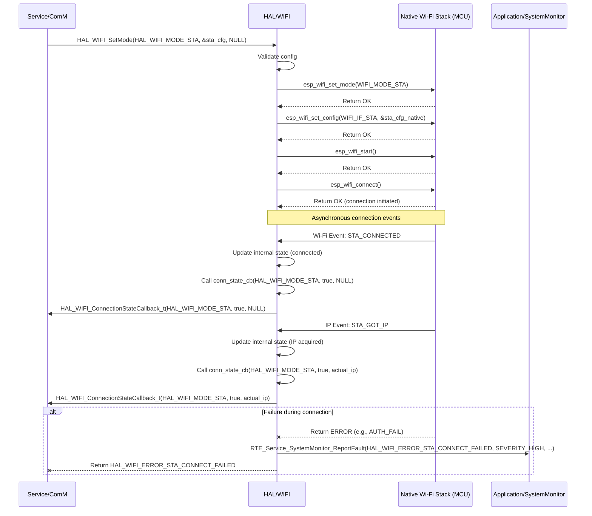

# **Detailed Design Document: HAL_WIFI Component**

## **1. Introduction**

### **1.1. Purpose**

This document details the design of the HAL_WIFI component, which provides a hardware abstraction layer for Wi-Fi functionalities. Its primary purpose is to offer a standardized, microcontroller-independent interface for managing Wi-Fi connectivity (STA/AP mode), network interface management, and basic socket operations, abstracting the complexities of the underlying Wi-Fi driver and specific MCU details from the ComM module in the Service Layer.

### **1.2. Scope**

The scope of this document covers the HAL_WIFI module's architecture, functional behavior, interfaces, dependencies, and resource considerations. It details how the HAL layer interacts with the native Wi-Fi stack (which might be part of the MCAL or a vendor-provided SDK).

### **1.3. References**

* Software Architecture Document (SAD) - Smart Device Firmware (Final Version)  
* IEEE 802.11 Standards (Conceptual)  
* MCU Wi-Fi Stack Documentation (e.g., ESP-IDF Wi-Fi APIs)

## **2. Functional Description**

The HAL_WIFI component provides the following core functionalities:

1. **Wi-Fi Stack Initialization**: Initialize the native Wi-Fi stack, including the driver and network interface.  
2. **Station (STA) Mode**: Connect to an existing Wi-Fi Access Point (AP).  
3. **Access Point (AP) Mode**: Create a soft Access Point for other devices to connect to.  
4. **IP Address Management**: Obtain IP address in STA mode (DHCP client) or assign static IP in AP mode.  
5. **Socket Operations**: Provide basic TCP/UDP socket creation, connection, send, and receive functionalities.  
6. **Event Handling**: Provide a mechanism to register callbacks for key Wi-Fi events (e.g., connection established/lost, IP obtained, AP started/stopped).  
7. **Error Reporting**: Report any failures during Wi-Fi operations (e.g., stack initialization failure, connection failure, IP acquisition failure, socket error) to the SystemMonitor via RTE_Service_SystemMonitor_ReportFault().

## **3. Non-Functional Requirements**

### **3.1. Performance**

* **Connection Speed**: Establish Wi-Fi connections quickly and reliably.  
* **Throughput**: Support data transfer rates adequate for system monitoring, configuration, and OTA updates.  
* **Responsiveness**: Maintain network responsiveness for critical operations.

### **3.2. Memory**

* **Minimal Footprint**: The HAL_WIFI code and data shall have a minimal memory footprint, considering the embedded constraints.  
* **Buffer Management**: Efficiently manage internal buffers for network packets.

### **3.3. Reliability**

* **Robustness**: The module shall handle Wi-Fi stack errors, connection drops, and network issues gracefully.  
* **Fault Isolation**: Failures in Wi-Fi communication should be isolated and reported without crashing the system.  
* **Security**: Support WPA2/WPA3 encryption for secure Wi-Fi connections.

## **4. Architectural Context**

As per the SAD (Section 3.1.2, HAL Layer), HAL_WIFI resides in the Hardware Abstraction Layer. It acts as an intermediary between the Service/ComM module and the native Wi-Fi stack (which is often provided by the MCU vendor and might sit conceptually below MCAL or be integrated with it). HAL_WIFI translates generic Wi-Fi requests from ComM into native stack API calls.

## **5. Design Details**

### **5.1. Module Structure**

The HAL_WIFI component will consist of the following files:

* HAL/inc/hal_wifi.h: Public header file containing function prototypes, data types, and error codes.  
* HAL/src/hal_wifi.c: Source file containing the implementation of the HAL_WIFI functions.  
* HAL/cfg/hal_wifi_cfg.h: Configuration header for static Wi-Fi parameters (e.g., default SSID/password, IP settings).

### **5.2. Public Interface (API)**
```c
// In HAL/inc/hal_wifi.h

// Enum for Wi-Fi status/error codes  
typedef enum {  
    HAL_WIFI_OK = 0,  
    HAL_WIFI_ERROR_INIT_FAILED,  
    HAL_WIFI_ERROR_STA_CONNECT_FAILED,  
    HAL_WIFI_ERROR_AP_START_FAILED,  
    HAL_WIFI_ERROR_IP_ACQUISITION_FAILED,  
    HAL_WIFI_ERROR_SOCKET_FAILED,  
    HAL_WIFI_ERROR_INVALID_PARAM,  
    HAL_WIFI_ERROR_NOT_CONNECTED,  
    // Add more specific errors as needed  
} HAL_WIFI_Status_t;

// Enum for Wi-Fi mode  
typedef enum {  
    HAL_WIFI_MODE_OFF,  
    HAL_WIFI_MODE_STA, // Station mode (connect to AP)  
    HAL_WIFI_MODE_AP   // Access Point mode (create own AP)  
} HAL_WIFI_Mode_t;

// Structure for STA mode configuration  
typedef struct {  
    const char *ssid;  
    const char *password;  
    bool use_dhcp; // True for DHCP, false for static IP  
    // Add static IP details if use_dhcp is false  
} HAL_WIFI_StaConfig_t;

// Structure for AP mode configuration  
typedef struct {  
    const char *ssid;  
    const char *password;  
    uint8_t channel;  
    uint8_t max_connections;  
} HAL_WIFI_ApConfig_t;

// Function pointer for Wi-Fi connection state changes  
typedef void (*HAL_WIFI_ConnectionStateCallback_t)(HAL_WIFI_Mode_t mode, bool connected, const char *ip_address);

/**  
 * @brief Initializes the HAL_WIFI module and the underlying Wi-Fi stack.  
 * This function should be called once during system initialization.  
 * @param conn_state_cb Callback for Wi-Fi connection state changes.  
 * @return HAL_WIFI_OK on success, an error code on failure.  
 */  
HAL_WIFI_Status_t HAL_WIFI_Init(HAL_WIFI_ConnectionStateCallback_t conn_state_cb);

/**  
 * @brief Sets the Wi-Fi operating mode (STA, AP, or OFF).  
 * @param mode The desired Wi-Fi mode.  
 * @param sta_config Pointer to STA configuration (NULL if not STA mode).  
 * @param ap_config Pointer to AP configuration (NULL if not AP mode).  
 * @return HAL_WIFI_OK on success, an error code on failure.  
 */  
HAL_WIFI_Status_t HAL_WIFI_SetMode(HAL_WIFI_Mode_t mode,  
                                   const HAL_WIFI_StaConfig_t *sta_config,  
                                   const HAL_WIFI_ApConfig_t *ap_config);

/**  
 * @brief Sends data over a TCP socket.  
 * @param socket_fd The socket file descriptor.  
 * @param data Pointer to the data to send.  
 * @param len Length of the data.  
 * @return Number of bytes sent on success, -1 on error.  
 */  
int32_t HAL_WIFI_TcpSend(int socket_fd, const uint8_t *data, uint16_t len);

/**  
 * @brief Receives data from a TCP socket.  
 * @param socket_fd The socket file descriptor.  
 * @param buffer Pointer to the buffer to store received data.  
 * @param buffer_size Size of the buffer.  
 * @param timeout_ms Timeout for reception in milliseconds.  
 * @return Number of bytes received on success, 0 on timeout, -1 on error.  
 */  
int32_t HAL_WIFI_TcpReceive(int socket_fd, uint8_t *buffer, uint16_t buffer_size, uint32_t timeout_ms);

/**  
 * @brief Creates and connects a TCP client socket.  
 * @param remote_ip Remote IP address string.  
 * @param remote_port Remote port number.  
 * @return Socket file descriptor on success, -1 on error.  
 */  
int HAL_WIFI_TcpConnect(const char *remote_ip, uint16_t remote_port);

/**  
 * @brief Closes a TCP socket.  
 * @param socket_fd The socket file descriptor.  
 * @return HAL_WIFI_OK on success, an error code on failure.  
 */  
HAL_WIFI_Status_t HAL_WIFI_TcpClose(int socket_fd);

// Add UDP functions if required
```

### **5.3. Internal Design**

The HAL_WIFI module will wrap the native Wi-Fi stack APIs and network interface APIs. It will manage Wi-Fi modes, connection attempts, IP address acquisition, and provide a simplified socket interface.

1. **Initialization (HAL_WIFI_Init)**:  
   * Validate input callback pointer.  
   * Store the provided callback internally.  
   * Call native Wi-Fi stack initialization functions (e.g., esp_netif_init(), esp_event_loop_create_default(), esp_wifi_init()).  
   * Register internal native Wi-Fi event handlers (e.g., wifi_event_handler, ip_event_handler). These handlers will process raw Wi-Fi/IP events and then call the appropriate HAL_WIFI registered callbacks.  
   * If any native Wi-Fi API call fails, report HAL_WIFI_ERROR_INIT_FAILED to SystemMonitor.  
2. **Set Mode (HAL_WIFI_SetMode)**:  
   * Validate input mode and corresponding configuration pointers.  
   * Based on mode:  
     * **HAL_WIFI_MODE_OFF**: Call native functions to stop Wi-Fi (e.g., esp_wifi_stop()).  
     * **HAL_WIFI_MODE_STA**:  
       * Configure STA parameters (SSID, password) using native APIs (e.g., esp_wifi_set_config()).  
       * Start Wi-Fi in STA mode (esp_wifi_start()).  
       * Initiate connection (esp_wifi_connect()).  
       * If using DHCP, ensure DHCP client is enabled.  
       * If using static IP, configure the network interface with static IP details.  
       * Report HAL_WIFI_ERROR_STA_CONNECT_FAILED or HAL_WIFI_ERROR_IP_ACQUISITION_FAILED on failure.  
     * **HAL_WIFI_MODE_AP**:  
       * Configure AP parameters (SSID, password, channel, max connections) using native APIs.  
       * Start Wi-Fi in AP mode.  
       * Configure DHCP server for connected clients.  
       * Report HAL_WIFI_ERROR_AP_START_FAILED on failure.  
   * Update internal Wi-Fi state and call HAL_WIFI_ConnectionStateCallback_t on state changes.  
3. **TCP Socket Operations (HAL_WIFI_TcpSend, HAL_WIFI_TcpReceive, HAL_WIFI_TcpConnect, HAL_WIFI_TcpClose)**:  
   * These functions will wrap standard socket APIs (socket(), connect(), send(), recv(), close()).  
   * Perform basic validation of socket descriptors and buffer sizes.  
   * Set socket options as needed (e.g., SO_RCVTIMEO for receive timeout).  
   * Report HAL_WIFI_ERROR_SOCKET_FAILED to SystemMonitor for any socket API failures.  
4. **Internal Event Handling**:  
   * The HAL_WIFI module will have internal static functions that act as the direct callbacks for the native Wi-Fi stack's events (e.g., wifi_event_handler, ip_event_handler for ESP-IDF).  
   * These internal handlers will:  
     * Process the native event data.  
     * Update internal HAL_WIFI state (e.g., connection status, IP address).  
     * Translate native event data into HAL_WIFI specific formats.  
     * Call the HAL_WIFI_ConnectionStateCallback_t registered by ComM.  
     * Report any unexpected native errors to SystemMonitor.

**Sequence Diagram (Example: HAL_WIFI_SetMode to STA):**



### **5.4. Dependencies**

* **Native Wi-Fi Stack Headers**: Specific to the MCU/SDK (e.g., esp_wifi.h, esp_event.h, esp_netif.h, lwip/sockets.h for ESP-IDF). These are considered part of the MCAL or an integrated vendor driver.  
* **Application/logger/inc/logger.h**: For internal logging.  
* **Rte/inc/Rte.h**: For calling RTE_Service_SystemMonitor_ReportFault().  
* **Application/common/inc/app_common.h**: For APP_Status_t (though HAL_WIFI_Status_t is more specific).  
* **HAL/cfg/hal_wifi_cfg.h**: For default Wi-Fi configurations.

### **5.5. Error Handling**

* **Input Validation**: All public API functions will validate input parameters.  
* **Native Stack Error Propagation**: Errors returned by native Wi-Fi stack APIs or socket APIs will be caught by HAL_WIFI.  
* **Fault Reporting**: Upon detection of an error (invalid input, native stack failure, connection error, IP error, socket error), HAL_WIFI will report a specific fault ID (e.g., HAL_WIFI_ERROR_INIT_FAILED, HAL_WIFI_ERROR_STA_CONNECT_FAILED, HAL_WIFI_ERROR_AP_START_FAILED, HAL_WIFI_ERROR_IP_ACQUISITION_FAILED, HAL_WIFI_ERROR_SOCKET_FAILED) to SystemMonitor via the RTE service.  
* **Return Status**: HAL_WIFI_Status_t for configuration/control functions, and standard int32_t for socket send/receive (bytes sent/received or -1 for error).

### **5.6. Configuration**

The HAL/cfg/hal_wifi_cfg.h file will contain:

* Default STA SSID and password.  
* Default AP SSID, password, channel, and max connections.  
* Static IP configuration details (if used).
* 
```c
// Example: HAL/cfg/hal_wifi_cfg.h  
#define WIFI_DEFAULT_STA_SSID       "MyHomeAP"  
#define WIFI_DEFAULT_STA_PASSWORD   "my_ap_password"

#define WIFI_DEFAULT_AP_SSID        "SmartDevice_AP"  
#define WIFI_DEFAULT_AP_PASSWORD    "smartdevice_pw"  
#define WIFI_DEFAULT_AP_CHANNEL     6  
#define WIFI_DEFAULT_AP_MAX_CONN    4

// If static IP is used for STA mode  
#define WIFI_STA_STATIC_IP          "192.168.1.100"  
#define WIFI_STA_STATIC_GW          "192.168.1.1"  
#define WIFI_STA_STATIC_NETMASK     "255.255.255.0"
```
### **5.7. Resource Usage**

* **Flash**: Moderate to high, depending on the complexity of the Wi-Fi stack and included features (e.g., mDNS, HTTP server).  
* **RAM**: High, as the Wi-Fi stack and network buffers often require significant RAM.  
* **CPU**: Moderate to high, especially during connection establishment, data transfer, and scanning.

## **6. Test Considerations**

### **6.1. Unit Testing**

* **Mock Native Wi-Fi Stack**: Unit tests for HAL_WIFI will mock the native Wi-Fi stack APIs and socket APIs to isolate HAL_WIFI's logic.  
* **Test Cases**:  
  * HAL_WIFI_Init: Test valid callback registration. Verify native stack initialization calls. Test error propagation.  
  * HAL_WIFI_SetMode: Test setting various modes (OFF, STA, AP) with valid/invalid configurations. Verify native Wi-Fi mode and config calls. Simulate connection success/failure and IP acquisition.  
  * HAL_WIFI_TcpSend/TcpReceive: Test valid/invalid socket FDs, data, lengths. Mock send()/recv() to simulate success, partial send/receive, timeouts, and errors.  
  * HAL_WIFI_TcpConnect: Test valid/invalid IP/port. Mock socket()/connect() calls.  
  * HAL_WIFI_TcpClose: Test valid/invalid socket FDs. Mock close() calls.  
  * Internal Event Handlers: Simulate native Wi-Fi/IP events (e.g., STA_CONNECTED, STA_DISCONNECTED, STA_GOT_IP, AP_START) and verify that the correct HAL_WIFI callbacks are invoked with the correct data.  
  * Error reporting: Verify that RTE_Service_SystemMonitor_ReportFault() is called with the correct fault ID on various error conditions.

### **6.2. Integration Testing**

* **HAL-Native Stack Integration**: Verify that HAL_WIFI correctly interfaces with the actual native Wi-Fi stack.  
* **Network Connectivity**:  
  * **STA Mode**: Connect the device to a real Access Point. Ping external servers, access web pages, establish TCP connections.  
  * **AP Mode**: Connect a mobile device/PC to the device's soft AP. Verify connectivity.  
* **Socket Communication**: Develop simple client/server applications on a PC to test TCP/UDP communication with the device.  
* **Error Injection**: Introduce Wi-Fi errors (e.g., incorrect password, AP going down, network cable unplugged for server) and verify that HAL_WIFI detects and reports these faults correctly to SystemMonitor.  
* **Throughput Test**: Test data transfer rates for large files (e.g., OTA updates) over Wi-Fi.

### **6.3. System Testing**

* **End-to-End Communication**: Verify that all application features relying on Wi-Fi (e.g., cloud connectivity, remote configuration, OTA updates) work correctly within the integrated system.  
* **Security Compliance**: Verify that Wi-Fi security (WPA2/WPA3) works as specified.  
* **Coexistence**: If other wireless protocols (BLE) are active, verify that Wi-Fi performance is not significantly degraded.  
* **Power Modes**: Ensure Wi-Fi behaves correctly during power mode transitions (e.g., low-power modes, quick wake-up and reconnection).
