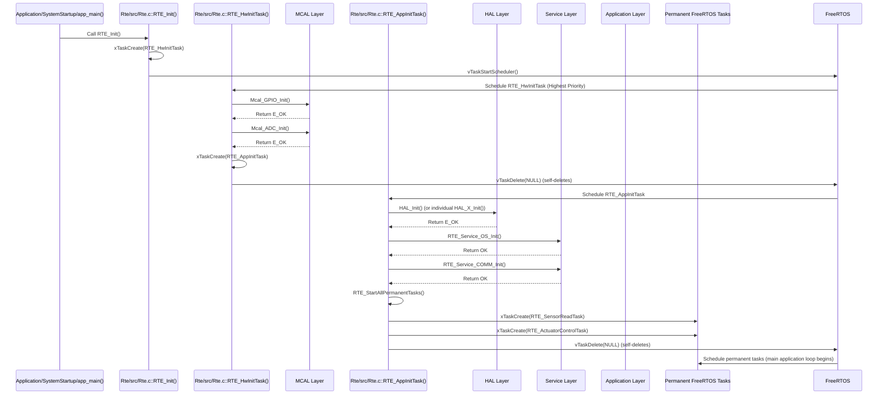

# **Detailed Design Document: RTE Component**

## **1. Introduction**

### **1.1. Purpose**

This document details the design of the RTE (Runtime Environment) component. As the core of the system's architecture, its primary purpose is to act as the central communication hub and task manager. It strictly decouples application and service layer modules from each other, ensuring all inter-module communication occurs exclusively through well-defined service interfaces. This design promotes modularity, testability, and scalability.

### **1.2. Scope**

The scope of this document covers the RTE module's architecture, functional behavior, interfaces, dependencies, and resource considerations. It details how RTE manages FreeRTOS tasks, orchestrates the system's initialization sequence, and routes service calls between various software components.

### **1.3. References**

* Software Architecture Document (SAD) - Smart Device Firmware (Final Version)  
* FreeRTOS Documentation

## **2. Functional Description**

The RTE component provides the following core functionalities:

1. **System Initialization Orchestration**: Manages the multi-stage initialization process (MCAL, HAL, Service, Application layers) through dedicated, self-deleting FreeRTOS tasks.  
2. **Task Management**: Creates and manages all permanent FreeRTOS tasks for the application, defining their priorities and ensuring their periodic execution.  
3. **Inter-Module Communication Routing**: Provides a set of public "RTE Service Functions" that serve as the *only* allowed interface for modules to interact. It acts as a dispatcher, internally routing calls from one module's RTE service to the target module's actual function.  
4. **Error Propagation**: Acts as a conduit for error reporting from lower layers to SystemMonitor and propagates return status back to the calling module.  
5. **Watchdog Feeding**: A dedicated task within RTE is responsible for periodically feeding the hardware watchdog timer.

## **3. Non-Functional Requirements**

### **3.1. Performance**

* **Low Overhead**: RTE service calls shall have minimal performance overhead to ensure real-time responsiveness.  
* **Determinism**: Task scheduling and service call routing shall be predictable and deterministic.

### **3.2. Memory**

* **Minimal Footprint**: The RTE code and data shall have a minimal memory footprint.  
* **Efficient Task Stack Usage**: Task stack sizes should be optimized to prevent overflows while minimizing RAM consumption.

### **3.3. Reliability**

* **Robustness**: The RTE shall handle invalid service calls or task management requests gracefully.  
* **Fault Containment**: Ensure that a fault in one module does not directly cause a crash in another module due to direct coupling.  
* **Watchdog Assurance**: The watchdog feeding mechanism must be robust to prevent unintended system resets.

## **4. Architectural Context**

As per the SAD (Section 3.1.1, Logical View), the RTE layer sits between the Application Layer and the Service Layer. It is the central communication hub and task manager. Application modules call RTE Services, and RTE directly calls functions in both the Application and Service Layers. It also creates and manages all FreeRTOS tasks.

## **5. Design Details**

### **5.1. Module Structure**

The RTE component will consist of the following files:

* Rte/inc/Rte.h: Public header file containing all RTE_Service_...() function prototypes, task prototypes, and common RTE-specific data types.  
* Rte/src/Rte.c: Source file containing the implementation of all RTE service functions, task implementations, and the core initialization logic.  
* Rte/cfg/Rte_cfg.h: Configuration header for task priorities, stack sizes, and initialization sequences.

### **5.2. Public Interface (API)**

// In Rte/inc/Rte.h
```c
#include "Application/common/inc/common.h" // For APP_Status_t

// --- RTE Initialization ---  
/**  
 * @brief Initializes the RTE and starts the hardware initialization task.  
 * This is the first FreeRTOS task created by the application's main entry point.  
 */  
void RTE_Init(void);

// --- RTE Service Functions (Examples - comprehensive list would be long) ---

// System Manager Services  
APP_Status_t RTE_Service_SYS_MGR_Init(void);  
APP_Status_t RTE_Service_SYS_MGR_ProcessSensorReadings(void);  
APP_Status_t RTE_Service_SYS_MGR_ControlActuators(void);  
APP_Status_t RTE_Service_SYS_MGR_UpdateDisplayAndAlarm(void);  
APP_Status_t RTE_Service_SYS_MGR_SetOperationalTemperature(float min_temp, float max_temp);  
APP_Status_t RTE_Service_SYS_MGR_GetOperationalTemperature(float *min_temp, float *max_temp);  
APP_Status_t RTE_Service_SYS_MGR_SetFailSafeMode(bool enable);  
APP_Status_t RTE_Service_SYS_MGR_CheckPowerReadinessForOTA(bool *ready);

// Sensor Services  
APP_Status_t RTE_Service_TEMP_SENSOR_Read(float *temperature);  
APP_Status_t RTE_Service_HUMIDITY_SENSOR_Read(float *humidity);

// Actuator Services  
APP_Status_t RTE_Service_FAN_SetSpeed(uint8_t speed_percent);  
APP_Status_t RTE_Service_HEATER_SetState(bool on);  
APP_Status_t RTE_Service_PUMP_SetState(bool on);  
APP_Status_t RTE_Service_VENTILATOR_SetState(bool on);  
APP_Status_t RTE_Service_LIGHT_SetState(bool on);

// Display & Indication Services  
APP_Status_t RTE_Service_DISPLAY_Init(void);  
APP_Status_t RTE_Service_DISPLAY_UpdateLine(uint8_t line_num, const char *text);  
APP_Status_t RTE_Service_DISPLAY_ClearScreen(void);  
APP_Status_t RTE_Service_DISPLAY_SetBacklight(bool enable);  
APP_Status_t RTE_Service_LIGHT_INDICATION_Init(void);  
APP_Status_t RTE_Service_LIGHT_INDICATION_On(uint32_t indicator_id);  
APP_Status_t RTE_Service_LIGHT_INDICATION_Off(uint32_t indicator_id);

// System Monitor Services  
APP_Status_t RTE_Service_SystemMonitor_Init(void);  
APP_Status_t RTE_Service_SystemMonitor_ReportFault(uint32_t fault_id, uint32_t severity, uint32_t data);  
APP_Status_t RTE_Service_SystemMonitor_GetCPULoad(float *cpu_load);  
APP_Status_t RTE_Service_SystemMonitor_GetTotalMinFreeStack(uint32_t *min_free_stack_bytes);  
APP_Status_t RTE_Service_SystemMonitor_GetFaultStatus(uint32_t *active_faults_bitmap, uint32_t *fault_history_count, void *fault_history_buffer, uint32_t buffer_size);  
APP_Status_t RTE_Service_SystemMonitor_ClearFault(uint32_t fault_id);

// Diagnostic Services  
APP_Status_t RTE_Service_DIAGNOSTIC_Init(void);  
APP_Status_t RTE_Service_DIAGNOSTIC_ProcessCommand(const uint8_t *command, uint16_t len, uint8_t *response_buffer, uint16_t response_buffer_len, uint16_t *actual_response_len);  
APP_Status_t RTE_Service_DIAGNOSTIC_RequestReboot(void);  
APP_Status_t RTE_Service_DIAGNOSTIC_RunSelfTest(uint32_t test_id);

// Storage Services  
APP_Status_t RTE_Service_STORAGE_Init(void);  
APP_Status_t RTE_Service_STORAGE_ReadConfig(uint32_t config_id, uint8_t *buffer, uint32_t buffer_len);  
APP_Status_t RTE_Service_STORAGE_WriteConfig(uint32_t config_id, const uint8_t *data, uint32_t data_len);

// Power Services  
APP_Status_t RTE_Service_POWER_Init(void);  
APP_Status_t RTE_Service_POWER_SetMode(uint32_t mode);  
APP_Status_t RTE_Service_POWER_GetConsumption(float *current_ma, float *voltage_mv, float *power_mw);

// Communication Services (ComM)  
APP_Status_t RTE_Service_COMM_Init(void);  
APP_Status_t RTE_Service_COMM_Send(uint32_t protocol, const uint8_t *data, uint16_t len, void *destination_info);  
APP_Status_t RTE_Service_COMM_GetConnectionState(uint32_t protocol, uint32_t *state);  
APP_Status_t RTE_Service_COMM_RequestConnection(uint32_t protocol, bool connect, void *config_info);

// OS Services (wrapper for FreeRTOS)  
APP_Status_t RTE_Service_OS_Init(void);  
// ... other OS services like task creation, mutexes, delays, etc. (refer to Service_OS DDD)

// OTA Service  
APP_Status_t RTE_Service_OTA_Init(void);  
APP_Status_t RTE_Service_OTA_StartUpdate(const char *download_url);  
APP_Status_t RTE_Service_OTA_RequestRollback(void);  
APP_Status_t RTE_Service_OTA_GetCurrentState(uint32_t *state);

// Security Service  
APP_Status_t RTE_Service_SECURITY_Init(void);  
APP_Status_t RTE_Service_SECURITY_VerifySignature(uint32_t algo, uint32_t public_key_id, const uint8_t *data, uint32_t data_len, const uint8_t *signature, uint32_t signature_len);  
// ... other security services (refer to Service_Security DDD)

// NvM Service  
APP_Status_t RTE_Service_NVM_Init(void);  
APP_Status_t RTE_Service_NVM_ReadBlock(uint32_t block_id, uint8_t *buffer, uint32_t buffer_len);  
APP_Status_t RTE_Service_NVM_WriteBlock(uint32_t block_id, const uint8_t *data, uint32_t data_len);  
APP_Status_t RTE_Service_NVM_RestoreDefaults(uint32_t block_id);  
APP_Status_t RTE_Service_NVM_GetBlockSize(uint32_t block_id, uint32_t *size);

// --- FreeRTOS Task Prototypes (declared here, implemented in Rte.c) ---  
void RTE_HwInitTask(void *pvParameters);  
void RTE_AppInitTask(void *pvParameters);  
void RTE_SensorReadTask(void *pvParameters);  
void RTE_ActuatorControlTask(void *pvParameters);  
void RTE_DisplayAlarmTask(void *pvParameters);  
void RTE_MainLoopTask(void *pvParameters);  
void SYS_MON_Task(void *pvParameters); // SystemMonitor's task  
void COMMUNICATION_STACK_MainTask(void *pvParameters); // ComM's task  
void POWER_MONITOR_Task(void *pvParameters); // Power module's task
```

### **5.3. Internal Design**

The RTE module's internal design focuses on the implementation of the initialization tasks, the permanent application tasks, and the routing logic for all RTE Service functions.

1. **RTE_Init()**:  
   * Called from Application/SystemStartup/startup.c::app_main().  
   * Creates RTE_HwInitTask using xTaskCreate().  
   * Starts the FreeRTOS scheduler (vTaskStartScheduler()).  
2. **RTE_HwInitTask(void *pvParameters)**:  
   * **Responsibility**: Initializes all MCAL modules.  
   * **Sequence**:  
     * Call Mcal_GPIO_Init().  
     * Call Mcal_ADC_Init().  
     * Call Mcal_UART_Init().  
     * Call Mcal_I2C_Init().  
     * Call Mcal_PWM_Init().  
     * Call Mcal_SPI_Init().  
     * Call Mcal_Timers_Init().  
     * Call Mcal_Flash_Init().  
     * Call Mcal_EEPROM_Init() (if applicable).  
     * Perform basic hardware watchdog initialization (e.g., Mcal_WDG_Init()).  
     * Create RTE_AppInitTask.  
     * Self-delete: vTaskDelete(NULL).  
   * **Error Handling**: If any MCAL _Init() call returns E_NOK, log the error via logger and potentially halt the system or enter a critical fault state via SystemMonitor.  
3. **RTE_AppInitTask(void *pvParameters)**:  
   * **Responsibility**: Initializes HAL, Service, and Application layer modules. Creates and starts permanent application tasks.  
   * **Sequence**:  
     * Call HAL_Init() (a general HAL initializer if it exists, or individual HAL_Modbus_Init(), HAL_Bluetooth_Init(), HAL_Wifi_Init()).  
     * Call RTE_Service_OS_Init().  
     * Call RTE_Service_COMM_Init() (this will internally initialize HAL_Modbus, HAL_BLE, HAL_WIFI via ComM's initialization).  
     * Call RTE_Service_OTA_Init().  
     * Call RTE_Service_SECURITY_Init().  
     * Call RTE_Service_NVM_Init().  
     * Call RTE_Service_STORAGE_Init().  
     * Call RTE_Service_POWER_Init().  
     * Call RTE_Service_SYS_MGR_Init().  
     * Call RTE_Service_SystemMonitor_Init().  
     * Call RTE_Service_DIAGNOSTIC_Init().  
     * Call RTE_Service_FAN_Init(), RTE_Service_HEATER_Init(), RTE_Service_PUMP_Init(), RTE_Service_VENTILATOR_Init(), RTE_Service_LIGHT_Init(), RTE_Service_TEMP_SENSOR_Init(), RTE_Service_HUMIDITY_SENSOR_Init(), RTE_Service_DISPLAY_Init(), RTE_Service_LIGHT_INDICATION_Init().  
     * Call RTE_StartAllPermanentTasks().  
     * Self-delete: vTaskDelete(NULL).  
   * **Error Handling**: Similar to RTE_HwInitTask, log errors and potentially halt if critical initialization fails.  
4. **RTE_StartAllPermanentTasks()**:  
   * Contains all xTaskCreate() calls for:  
     * RTE_SensorReadTask  
     * RTE_ActuatorControlTask  
     * RTE_DisplayAlarmTask  
     * RTE_MainLoopTask (responsible for feeding hardware watchdog)  
     * SYS_MON_Task (SystemMonitor's dedicated task)  
     * COMMUNICATION_STACK_MainTask (ComM's dedicated task)  
     * POWER_MONITOR_Task (Power module's dedicated task)  
   * Task priorities and stack sizes are defined in Rte_cfg.h.  
5. **Permanent Application Tasks (Implementations in Rte.c)**:  
   * Each task (RTE_SensorReadTask, RTE_ActuatorControlTask, etc.) will typically contain an infinite loop (for(;;)) with a vTaskDelay() to achieve its periodicity.  
   * Inside the loop, they call the appropriate RTE_Service_...() functions.  
   * Example RTE_SensorReadTask structure:  
     void RTE_SensorReadTask(void *pvParameters) {  
         const TickType_t xDelay = pdMS_TO_TICKS(RTE_SENSOR_READ_TASK_PERIOD_MS);  
         for (;;) {  
             // Call the application layer service to process sensor readings  
             RTE_Service_SYS_MGR_ProcessSensorReadings();  
             vTaskDelay(xDelay);  
         }  
     }

   * RTE_MainLoopTask will include Mcal_WDG_Feed() (or equivalent) to pet the hardware watchdog.  
6. **RTE_Service_...() Functions (Routing Logic)**:  
   * Each RTE_Service_ModuleName_FunctionName() function acts as a wrapper.  
   * It performs minimal parameter validation (e.g., non-NULL pointers).  
   * It then calls the actual target module's function (e.g., SYS_MGR_SetOperationalTemperature(min_temp, max_temp)).  
   * It propagates the return status from the target module back to the caller.  
   * Example RTE_Service_SetOperationalTemperature() structure:  
     APP_Status_t RTE_Service_SYS_MGR_SetOperationalTemperature(float min_temp, float max_temp) {  
         // Optional: Parameter validation  
         if (min_temp > max_temp) {  
             // Log error, report fault to SystemMonitor if severe enough  
             RTE_Service_SystemMonitor_ReportFault(FAULT_ID_INVALID_TEMP_RANGE, FAULT_SEVERITY_LOW, 0);  
             return E_NOK;  
         }  
         // Call the actual application module function  
         return SYS_MGR_SetOperationalTemperature(min_temp, max_temp);  
     }

**Sequence Diagram (Example: System Startup via RTE Tasks):**


### **5.4. Dependencies**

* **Application/common/inc/common.h**: For APP_Status_t.  
* **FreeRTOS Headers**: FreeRTOS.h, task.h, semphr.h (for mutexes if RTE manages any internal to itself).  
* **All MCAL Headers**: Mcal/*/inc/*.h (e.g., Mcal/gpio/inc/mcal_gpio.h).  
* **All HAL Headers**: HAL/*/inc/*.h (e.g., HAL/modbus/inc/hal_modbus.h).  
* **All Service Headers**: Service/*/inc/*.h (e.g., Service/os/inc/service_os.h, Service/ComM/inc/service_comm.h).  
* **All Application Headers**: Application/*/inc/*.h (e.g., Application/systemMgr/inc/sys_mgr.h, Application/SystemMonitor/inc/system_monitor.h).  
* **Application/logger/inc/logger.h**: For logging initialization and errors.

### **5.5. Error Handling**

* **Initialization Errors**: During RTE_HwInitTask and RTE_AppInitTask, if a critical _Init() function from a lower layer or service returns an error, RTE will log the error using logger and potentially halt the system (e.g., enter an infinite loop or trigger a system reset via watchdog) to prevent undefined behavior.  
* **Service Call Errors**: RTE_Service_...() functions will propagate errors returned by the target module back to the caller. They may also perform basic input validation and report invalid parameters as faults to SystemMonitor.  
* **Watchdog Management**: RTE_MainLoopTask is critical for feeding the hardware watchdog. If this task is blocked or fails to run, the watchdog will reset the system, providing a robust recovery mechanism from system-wide deadlocks.

### **5.6. Configuration**

The Rte/cfg/Rte_cfg.h file will contain:
```c
* **Task Periods**: Macros defining the periodicity of each permanent FreeRTOS task (e.g., RTE_SENSOR_READ_TASK_PERIOD_MS).  
* **Task Priorities**: Macros defining the FreeRTOS priority for each task (e.g., RTE_SENSOR_READ_TASK_PRIORITY).  
* **Task Stack Sizes**: Macros defining the stack size (in words) for each task (e.g., RTE_SENSOR_READ_TASK_STACK_SIZE_WORDS).  
* **Initialization Sequence Flags**: (Optional) Macros to enable/disable certain initialization steps or modules for flexible builds.

// Example: Rte/cfg/Rte_cfg.h

// Task Periods (in milliseconds)  
#define RTE_SENSOR_READ_TASK_PERIOD_MS          20  
#define RTE_ACTUATOR_CONTROL_TASK_PERIOD_MS     100  
#define RTE_DISPLAY_ALARM_TASK_PERIOD_MS        1000  
#define RTE_MAIN_LOOP_TASK_PERIOD_MS            5000  
#define RTE_SYS_MON_TASK_PERIOD_MS              5000  
#define RTE_COMMUNICATION_STACK_TASK_PERIOD_MS  100  
#define RTE_POWER_MONITOR_TASK_PERIOD_MS        1000

// Task Priorities (FreeRTOS priorities, higher number = higher priority)  
#define RTE_HW_INIT_TASK_PRIORITY               (configMAX_PRIORITIES - 1)  
#define RTE_APP_INIT_TASK_PRIORITY              (configMAX_PRIORITIES - 2)  
#define RTE_SENSOR_READ_TASK_PRIORITY           5  
#define RTE_ACTUATOR_CONTROL_TASK_PRIORITY      4  
#define RTE_DISPLAY_ALARM_TASK_PRIORITY         3  
#define RTE_MAIN_LOOP_TASK_PRIORITY             2  
#define RTE_SYS_MON_TASK_PRIORITY               1  
#define RTE_COMMUNICATION_STACK_TASK_PRIORITY   2 // Can be adjusted based on needs  
#define RTE_POWER_MONITOR_TASK_PRIORITY         3

// Task Stack Sizes (in words, typically 4 bytes per word on 32-bit MCU)  
#define RTE_HW_INIT_TASK_STACK_SIZE_WORDS       2048  
#define RTE_APP_INIT_TASK_STACK_SIZE_WORDS      3072  
#define RTE_SENSOR_READ_TASK_STACK_SIZE_WORDS   1536  
#define RTE_ACTUATOR_CONTROL_TASK_STACK_SIZE_WORDS 2048  
#define RTE_DISPLAY_ALARM_TASK_STACK_SIZE_WORDS 1536  
#define RTE_MAIN_LOOP_TASK_STACK_SIZE_WORDS     1024  
#define RTE_SYS_MON_TASK_STACK_SIZE_WORDS       2048  
#define RTE_COMMUNICATION_STACK_TASK_STACK_SIZE_WORDS 4096 // Can be larger due to network stacks  
#define RTE_POWER_MONITOR_TASK_STACK_SIZE_WORDS 1536
```

### **5.7. Resource Usage**

* **Flash**: Moderate, for the RTE core logic, task implementations, and the routing table for service calls.  
* **RAM**: Moderate to high, primarily for task stacks. The RTE itself adds minimal static RAM overhead.  
* **CPU**: Low. The RTE's role is primarily dispatching and scheduling, which are efficient operations. CPU usage is dominated by the actual work done by the application and service modules.

## **6. Test Considerations**

### **6.1. Unit Testing**

* **Mock Dependencies**: Unit tests for RTE will extensively mock all underlying MCAL, HAL, Service, and Application module functions that RTE calls during initialization and service routing.  
* **Test Cases**:  
  * RTE_Init: Verify that RTE_HwInitTask is created and scheduler starts.  
  * RTE_HwInitTask: Mock all Mcal_X_Init() calls. Test success path and failure paths (where an Mcal_X_Init() returns E_NOK). Verify RTE_AppInitTask creation and self-deletion.  
  * RTE_AppInitTask: Mock all HAL_X_Init(), Service_X_Init(), App_X_Init() calls. Test success/failure paths. Verify permanent task creation and self-deletion.  
  * RTE_Service_...() functions: For each service, test:  
    * Valid parameters: Verify that the correct target module function is called with the correct parameters and its return value is propagated.  
    * Invalid parameters: Verify appropriate error logging/fault reporting (e.g., to SystemMonitor) and E_NOK return.  
    * Target module failure: Mock the target module function to return E_NOK and verify RTE propagates it.  
  * Permanent Tasks: Mock the application/service calls within each task's loop. Verify the task's periodicity and that it calls its intended services. Verify watchdog feeding in RTE_MainLoopTask.

### **6.2. Integration Testing**

* **Layer-by-Layer Integration**: Integrate RTE with actual MCAL, then HAL, then Service, then Application layers incrementally.  
* **Full Startup Sequence**: Verify the entire initialization sequence from app_main through RTE_HwInitTask and RTE_AppInitTask to the start of all permanent tasks.  
* **Inter-Task Communication**: Verify that tasks correctly interact via RTE services (e.g., RTE_SensorReadTask calls RTE_Service_SYS_MGR_ProcessSensorReadings(), and SYS_MGR correctly updates state).  
* **Watchdog Functionality**: Verify that the hardware watchdog is correctly fed and that if it stops being fed (e.g., by suspending RTE_MainLoopTask in a test), the system resets.  
* **Error Propagation**: Introduce errors at lower layers (e.g., by forcing an Mcal_X_Init() to fail) and verify that RTE correctly logs and propagates these errors.

### **6.3. System Testing**

* **Overall System Stability**: Run the entire system for extended periods under various loads and conditions to ensure stability, responsiveness, and correct task scheduling.  
* **Resource Monitoring**: Use FreeRTOS tools (e.g., vTaskList, uxTaskGetStackHighWaterMark) to monitor CPU load and stack usage of all tasks in the deployed system to ensure they remain within safe limits.  
* **Fault Recovery**: Test scenarios where critical faults occur (e.g., power fluctuations, communication link failures) and verify that the system recovers gracefully, potentially via watchdog resets.
