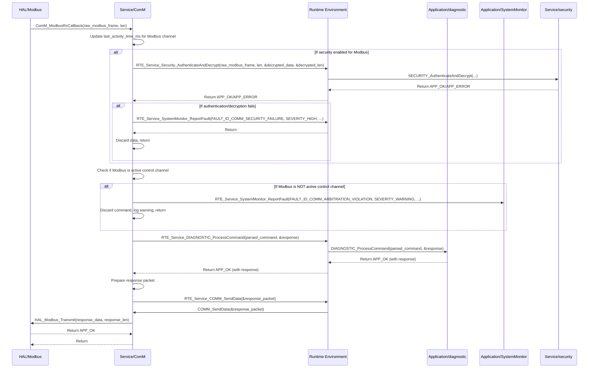

# **Detailed Design Document: ComM (Communication Manager) Component**

## **1. Introduction**

### **1.1. Purpose**

This document details the design of the ComM component. Its primary purpose is to act as the **central communication stack, managing and orchestrating all external communication protocols** (Modbus, Bluetooth, Wi-Fi). It provides a unified interface to the Application and RTE layers for sending/receiving data, handling connection states, and routing messages. This fulfills requirements like SRS-05-01-01, SRS-05-01-02, and SyRS-05-01-01 (ensuring only one active control interface).

### **1.2. Scope**

The scope of this document covers the ComM module's architecture, functional behavior, interfaces, dependencies, and resource considerations. It details how ComM manages communication channels, arbitrates control between them, routes incoming commands to diagnostic or systemMgr (via RTE), and provides a generic interface for sending data outwards. It interacts with lower-level communication drivers in the HAL layer.

### **1.3. References**

* Software Architecture Document (SAD) - Environmental Monitoring & Control System (Final Version)  
* Detailed Design Document: RTE  
* Detailed Design Document: HAL_Modbus  
* Detailed Design Document: HAL_Bluetooth  
* Detailed Design Document: HAL_Wifi  
* Detailed Design Document: SystemMonitor  
* Detailed Design Document: diagnostic  
* Detailed Design Document: systemMgr  
* Detailed Design Document: security

## **2. Functional Description**

The ComM component provides the following core functionalities:

1. **Initialization (ComM_Init)**: Initialize internal data structures, communication channel states, and the underlying HAL communication drivers (Modbus, Bluetooth, Wi-Fi).  
2. **Channel Management (ComM_ActivateChannel, ComM_DeactivateChannel)**: Control the activation and deactivation of individual communication channels. This is crucial for SyRS-05-01-01 (only one active control interface).  
3. **Command Reception and Routing (COMM_ProcessIncomingData)**: This is a central function. It receives raw incoming data from active HAL communication drivers, parses it (or delegates parsing to a sub-component), and routes recognized commands to the appropriate Application Layer modules (e.g., diagnostic for diagnostic commands, systemMgr for configuration changes) via RTE services.  
4. **Data Transmission (COMM_SendData)**: Provides a generic interface for Application Layer modules to send data outwards over a specified communication channel. ComM will select the appropriate HAL driver.  
5. **Connection State Management**: Tracks the connection status of each communication interface (connected, disconnected, advertising, busy).  
6. **Control Arbitration**: Implements the logic to ensure that only one external communication interface is actively controlling the system at any given time (SyRS-05-01-01). This involves prioritizing interfaces or rejecting control requests from inactive ones.  
7. **Error Reporting**: Detect and report any failures during communication operations (e.g., HAL driver errors, communication timeouts, arbitration conflicts) to the SystemMonitor via RTE_Service_SystemMonitor_ReportFault().  
8. **Security Integration**: Interacts with the security module for authentication and encryption of sensitive communication (SRS-06-01-05).

## **3. Non-Functional Requirements**

### **3.1. Performance**

* **Responsiveness**: Communication operations shall be highly responsive, with minimal latency for command processing and data transmission.  
* **Throughput**: Capable of handling the expected data rates for Modbus, Bluetooth, and Wi-Fi.  
* **Non-Blocking**: Communication processing should be largely non-blocking to avoid stalling other system tasks. This might involve internal queues or asynchronous HAL driver interactions.

### **3.2. Memory**

* **Efficient Buffer Management**: Efficient use of transmit/receive buffers for each communication channel.  
* **Minimal Footprint**: The ComM module shall have a minimal memory footprint for its internal state and channel management tables.

### **3.3. Reliability**

* **Robustness**: The module shall be robust against communication errors, malformed messages, or unexpected disconnections, preventing system crashes.  
* **Data Integrity**: Ensure data transmitted and received is uncorrupted (e.g., by leveraging CRC checks in Modbus, and checksums/encryption in other protocols).  
* **Security**: Must enforce the "only one active control interface" constraint (SyRS-05-01-01).  
* **Fault Tolerance**: Implement retry mechanisms for transient communication failures.

## **4. Architectural Context**

As per the SAD (Section 3.1.2, Service Layer), ComM resides in the Service Layer. It acts as the central communication manager. It is called by the COMMUNICATION_STACK_MainTask (within RTE) to process communication. It interacts with HAL communication drivers (HAL_Modbus, HAL_Bluetooth, HAL_Wifi) and provides services to Application Layer modules (systemMgr, diagnostic) via RTE. It also interfaces with the security module.

## **5. Design Details**

### **5.1. Module Structure**

The ComM component will consist of the following files:

* Service/ComM/inc/comm.h: Public header file containing function prototypes, channel IDs, and data types.  
* Service/ComM/src/comm.c: Source file containing the implementation of ComM functions, channel management, arbitration, and data routing.  
* Service/ComM/cfg/comm_cfg.h: Configuration header for channel priorities, timeouts, and buffer sizes.

### **5.2. Public Interface (API)**
```c
// In Service/ComM/inc/comm.h

#include "Application/common/inc/app_common.h" // For APP_Status_t  
#include <stdint.h>   // For uint32_t, uint8_t  
#include <stdbool.h>  // For bool

// --- Communication Channel IDs ---  
typedef enum {  
    COMM_CHANNEL_MODBUS = 0,  
    COMM_CHANNEL_BLUETOOTH,  
    COMM_CHANNEL_WIFI,  
    COMM_CHANNEL_COUNT // Total number of supported channels  
} ComM_ChannelId_t;

// --- Communication Status ---  
typedef enum {  
    COMM_STATUS_DISCONNECTED = 0,  
    COMM_STATUS_CONNECTING,  
    COMM_STATUS_CONNECTED,  
    COMM_STATUS_BUSY,  
    COMM_STATUS_ERROR  
} ComM_Status_t;

// --- Communication Data Packet Structure ---  
typedef struct {  
    ComM_ChannelId_t channel_id;  
    uint16_t         data_len;  
    uint8_t          data[COMM_MAX_PACKET_SIZE]; // Max size defined in config  
} ComM_Packet_t;

/**  
 * @brief Initializes the ComM module and all configured communication channels.  
 * This function should be called once during system initialization.  
 * @return APP_OK on success, APP_ERROR on failure.  
 */  
APP_Status_t ComM_Init(void);

/**  
 * @brief Activates a specific communication channel.  
 * This function handles arbitration to ensure only one control interface is active.  
 * @param channel_id The ID of the channel to activate.  
 * @return APP_OK on success, APP_ERROR if activation fails or arbitration prevents it.  
 */  
APP_Status_t COMM_ActivateChannel(ComM_ChannelId_t channel_id);

/**  
 * @brief Deactivates a specific communication channel.  
 * @param channel_id The ID of the channel to deactivate.  
 * @return APP_OK on success, APP_ERROR on failure.  
 */  
APP_Status_t COMM_DeactivateChannel(ComM_ChannelId_t channel_id);

/**  
 * @brief Processes incoming data for all active communication channels.  
 * This function is called periodically by the RTE's COMMUNICATION_STACK_MainTask.  
 * It polls HAL drivers for new data and routes commands.  
 */  
void COMM_MainFunction(void);

/**  
 * @brief Sends data over a specified communication channel.  
 * @param packet Pointer to the ComM_Packet_t structure containing data and channel ID.  
 * @return APP_OK on successful transmission, APP_ERROR on failure.  
 */  
APP_Status_t COMM_SendData(const ComM_Packet_t *packet);

/**  
 * @brief Gets the current status of a communication channel.  
 * @param channel_id The ID of the channel to query.  
 * @param status Pointer to a ComM_Status_t variable to store the status.  
 * @return APP_OK on success, APP_ERROR if channel_id is invalid.  
 */  
APP_Status_t COMM_GetChannelStatus(ComM_ChannelId_t channel_id, ComM_Status_t *status);

// --- Internal Callback Prototypes (called by HAL drivers) ---  
// These functions are called by the respective HAL communication drivers  
// when new data is received or a connection state changes.  
/**  
 * @brief Callback for incoming Modbus data.  
 * @param data Pointer to received data.  
 * @param len Length of received data.  
 */  
void ComM_ModbusRxCallback(const uint8_t *data, uint16_t len);

/**  
 * @brief Callback for incoming Bluetooth data.  
 * @param data Pointer to received data.  
 * @param len Length of received data.  
 */  
void ComM_BluetoothRxCallback(const uint8_t *data, uint16_t len);

/**  
 * @brief Callback for incoming Wi-Fi data.  
 * @param data Pointer to received data.  
 * @param len Length of received data.  
 */  
void ComM_WifiRxCallback(const uint8_t *data, uint16_t len);

/**  
 * @brief Callback for Bluetooth connection status changes.  
 * @param connected True if connected, false if disconnected.  
 */  
void ComM_BluetoothConnectionCallback(bool connected);

/**  
 * @brief Callback for Wi-Fi connection status changes.  
 * @param connected True if connected, false if disconnected.  
 */  
void ComM_WifiConnectionCallback(bool connected);
```
### **5.3. Internal Design**

The ComM module will manage the state of each communication channel, implement arbitration logic, and route data.

1. **Internal State**:  
   ```c
   // Structure to hold state for each communication channel  
   typedef struct {  
       ComM_Status_t   status;  
       bool            is_active_control_interface; // True if this channel has control priority  
       uint32_t        last_activity_time_ms;       // For activity timeout  
       // Add Tx/Rx buffers/queues if needed for asynchronous HAL drivers  
   } ComM_ChannelState_t;

   static ComM_ChannelState_t s_comm_channel_states[COMM_CHANNEL_COUNT];  
   static ComM_ChannelId_t    s_active_control_channel = COMM_CHANNEL_COUNT; // No channel active by default  
   static bool s_is_initialized = false;
   ```
   * ComM_Init() will initialize these variables.  
2. **Initialization (ComM_Init)**:  
   * Initialize s_comm_channel_states to COMM_STATUS_DISCONNECTED and is_active_control_interface = false.  
   * Initialize s_active_control_channel = COMM_CHANNEL_COUNT.  
   * Call HAL_Modbus_Init(), HAL_Bluetooth_Init(), HAL_Wifi_Init().  
   * Register ComM's Rx and connection callbacks with the HAL drivers (e.g., HAL_Modbus_RegisterRxCallback(ComM_ModbusRxCallback)).  
   * If any HAL initialization fails, report FAULT_ID_COMM_INIT_FAILURE to SystemMonitor and return APP_ERROR.  
   * Set s_is_initialized = true;.  
   * Return APP_OK.  
3. **Activate Channel (COMM_ActivateChannel)**:  
   * If !s_is_initialized or channel_id is invalid, return APP_ERROR.  
   * **Arbitration Logic (SyRS-05-01-01)**:  
     * If s_active_control_channel != COMM_CHANNEL_COUNT (another channel is active):  
       * **Check Priority**: If the requested channel_id has higher priority (defined in comm_cfg.h) than s_active_control_channel:  
         * Deactivate current active channel: COMM_DeactivateChannel(s_active_control_channel).  
         * Proceed to activate the new channel.  
       * Else (requested channel has lower or equal priority):  
         * Return APP_ERROR (activation denied). Log a warning.  
     * Else (no channel currently active):  
       * Proceed to activate.  
   * **Activate HAL Driver**:  
     * switch (channel_id):  
       * COMM_CHANNEL_MODBUS: Call HAL_Modbus_Activate().  
       * COMM_CHANNEL_BLUETOOTH: Call HAL_Bluetooth_Activate().  
       * COMM_CHANNEL_WIFI: Call HAL_Wifi_Activate().  
   * If HAL activation fails, report FAULT_ID_COMM_CHANNEL_ACT_FAILURE and return APP_ERROR.  
   * Set s_comm_channel_states[channel_id].is_active_control_interface = true;.  
   * Set s_active_control_channel = channel_id;.  
   * Update s_comm_channel_states[channel_id].status = COMM_STATUS_CONNECTED; (or CONNECTING if non-blocking).  
   * Log LOGI("ComM: Channel %d activated for control.", channel_id);.  
   * Return APP_OK.  
4. **Deactivate Channel (COMM_DeactivateChannel)**:  
   * If !s_is_initialized or channel_id is invalid, return APP_ERROR.  
   * **Deactivate HAL Driver**:  
     * switch (channel_id):  
       * COMM_CHANNEL_MODBUS: Call HAL_Modbus_Deactivate().  
       * COMM_CHANNEL_BLUETOOTH: Call HAL_Bluetooth_Deactivate().  
       * COMM_CHANNEL_WIFI: Call HAL_Wifi_Deactivate().  
   * If HAL deactivation fails, report FAULT_ID_COMM_CHANNEL_DEACT_FAILURE and return APP_ERROR.  
   * Set s_comm_channel_states[channel_id].is_active_control_interface = false;.  
   * If s_active_control_channel == channel_id, set s_active_control_channel = COMM_CHANNEL_COUNT;.  
   * Update s_comm_channel_states[channel_id].status = COMM_STATUS_DISCONNECTED;.  
   * Log LOGI("ComM: Channel %d deactivated.", channel_id);.  
   * Return APP_OK.  
5. **Main Function (COMM_MainFunction)**:  
   * If !s_is_initialized, return immediately.  
   * **Poll HAL Drivers for Incoming Data**:  
     * For each channel (Modbus, Bluetooth, Wi-Fi):  
       * Call HAL_Modbus_ProcessRx(), HAL_Bluetooth_ProcessRx(), HAL_Wifi_ProcessRx(). These functions should internally call ComM_ModbusRxCallback, etc., if data is available.  
       * Also call HAL_Bluetooth_ProcessConnectionState() and HAL_Wifi_ProcessConnectionState() to update ComM's internal status via callbacks.  
   * **Check for Activity Timeout (for active control interface)**:  
     * If s_active_control_channel != COMM_CHANNEL_COUNT and (APP_COMMON_GetUptimeMs() - s_comm_channel_states[s_active_control_channel].last_activity_time_ms) > COMM_ACTIVITY_TIMEOUT_MS:  
       * Log warning: LOGW("ComM: Active control channel %d timed out due to inactivity.", s_active_control_channel);.  
       * Call COMM_DeactivateChannel(s_active_control_channel).  
   * **Process Internal Queues (if any)**: If ComM uses internal queues for received data, process them here.  
6. **Send Data (COMM_SendData)**:  
   * Validate packet pointer, channel_id, data_len.  
   * **Security Integration (SRS-06-01-05)**:  
     * If packet->channel_id is a secure channel (e.g., Bluetooth for config/OTA) and packet->data contains sensitive data:  
       * Call RTE_Service_Security_Encrypt(packet->data, packet->data_len, encrypted_data_buffer, &encrypted_len);.  
       * Call RTE_Service_Security_Authenticate(encrypted_data_buffer, encrypted_len, auth_tag_buffer);.  
       * Use encrypted_data_buffer and auth_tag_buffer for transmission.  
   * **Transmit via HAL Driver**:  
     * switch (packet->channel_id):  
       * COMM_CHANNEL_MODBUS: Call HAL_Modbus_Transmit(packet->data, packet->data_len).  
       * COMM_CHANNEL_BLUETOOTH: Call HAL_Bluetooth_Transmit(packet->data, packet->data_len).  
       * COMM_CHANNEL_WIFI: Call HAL_Wifi_Transmit(packet->data, packet->data_len).  
   * If HAL transmission fails, report FAULT_ID_COMM_TX_FAILURE and return APP_ERROR.  
   * Return APP_OK.  
7. **Rx Callbacks (ComM_ModbusRxCallback, ComM_BluetoothRxCallback, ComM_WifiRxCallback)**:  
   * These are called by the respective HAL drivers when new data arrives.  
   * **Update Activity Time**: s_comm_channel_states[current_channel].last_activity_time_ms = APP_COMMON_GetUptimeMs();.  
   * **Security Decryption/Authentication**: If data is expected to be secure:  
     * Call RTE_Service_Security_AuthenticateAndDecrypt(data, len, decrypted_buffer, &decrypted_len);.  
     * If authentication/decryption fails, report FAULT_ID_COMM_SECURITY_FAILURE and discard data.  
   * **Command Parsing/Routing**:  
     * Identify if the incoming data is a command (e.g., "Set Temp Range", "Run Self-Test", "Get Faults").  
     * If it's a command, check if s_comm_channel_states[current_channel].is_active_control_interface is true. If not, discard command and log warning (SyRS-05-01-01).  
     * If it's a valid command from the active channel:  
       * **Route to Diagnostic**: If DIAGNOSTIC_ProcessCommand can handle it: RTE_Service_DIAGNOSTIC_ProcessCommand(parsed_command, &response);  
       * **Route to systemMgr**: If SYS_MGR_ProcessCommand can handle it: RTE_Service_SYS_MGR_ProcessCommand(parsed_command, &response);  
       * (Note: The actual command parsing logic might be complex and reside in a sub-module or within ComM itself, passing a structured command to diagnostic/systemMgr).  
   * **Generate Response**: Based on the processing, create a response ComM_Packet_t and call COMM_SendData(&response_packet);.  
8. **Connection Callbacks (ComM_BluetoothConnectionCallback, ComM_WifiConnectionCallback)**:  
   * Update s_comm_channel_states[channel_id].status.  
   * If a connection is established, consider activating the channel for control if no other is active and this channel has priority.  
   * If a connection is lost, deactivate the channel and potentially attempt to activate another.  
   * Report FAULT_ID_COMM_CONNECTION_LOST if a critical connection drops.

**Sequence Diagram (Example: Modbus Command Received):**

### **5.4. Dependencies**

* Application/common/inc/app_common.h: For APP_Status_t, APP_OK/APP_ERROR, and APP_COMMON_GetUptimeMs().  
* Application/logger/inc/logger.h: For internal logging.  
* Rte/inc/Rte.h: For calling RTE_Service_SystemMonitor_ReportFault(), RTE_Service_DIAGNOSTIC_ProcessCommand(), RTE_Service_SYS_MGR_ProcessCommand(), RTE_Service_Security_Encrypt(), RTE_Service_Security_AuthenticateAndDecrypt().  
* Application/SystemMonitor/inc/system_monitor.h: For FAULT_ID_COMM_... definitions.  
* Application/diagnostic/inc/diagnostic.h: For DIAGNOSTIC_ProcessCommand().  
* Application/systemMgr/inc/sys_mgr.h: For SYS_MGR_ProcessCommand().  
* Service/security/inc/security.h: For security services (encryption, authentication).  
* HAL/inc/hal_modbus.h, HAL/inc/hal_bluetooth.h, HAL/inc/hal_wifi.h: For underlying communication drivers.  
* Service/ComM/cfg/comm_cfg.h: For configuration parameters.

### **5.5. Error Handling**

* **Initialization Failure**: If any underlying HAL communication driver fails to initialize, ComM_Init() reports FAULT_ID_COMM_INIT_FAILURE to SystemMonitor.  
* **Channel Activation/Deactivation Failures**: If HAL_Modbus_Activate/Deactivate() etc. fail, COMM_ActivateChannel/COMM_DeactivateChannel report FAULT_ID_COMM_CHANNEL_ACT_FAILURE/FAULT_ID_COMM_CHANNEL_DEACT_FAILURE.  
* **Transmission Failures**: If HAL_Modbus_Transmit() etc. fail, COMM_SendData() reports FAULT_ID_COMM_TX_FAILURE.  
* **Arbitration Violations**: If an incoming command is received from a non-active control interface, ComM will discard it and report FAULT_ID_COMM_ARBITRATION_VIOLATION to SystemMonitor.  
* **Security Failures**: If authentication or decryption fails, ComM reports FAULT_ID_COMM_SECURITY_FAILURE and discards the data.  
* **Connection Loss**: ComM_BluetoothConnectionCallback/ComM_WifiConnectionCallback can report FAULT_ID_COMM_CONNECTION_LOST if a critical connection drops.  
* **Activity Timeout**: If the active control channel becomes inactive for too long, ComM will automatically deactivate it and log a warning.  
* **Input Validation**: All public API functions validate input parameters.  
* **Return Status**: All public API functions return APP_ERROR on failure.

### **5.6. Configuration**

The Service/ComM/cfg/comm_cfg.h file will contain:

* COMM_MAX_PACKET_SIZE: Maximum size for a communication packet payload.  
* COMM_ACTIVITY_TIMEOUT_MS: Timeout for the active control interface due to inactivity.  
* COMM_CHANNEL_PRIORITY_MODBUS, COMM_CHANNEL_PRIORITY_BLUETOOTH, COMM_CHANNEL_PRIORITY_WIFI: Numerical priorities for each channel (higher number = higher priority for control arbitration).  
* COMM_ENABLE_SECURITY_MODBUS, COMM_ENABLE_SECURITY_BLUETOOTH, COMM_ENABLE_SECURITY_WIFI: Macros to enable/disable security for each channel.  
* COMM_POLLING_PERIOD_MS: The frequency at which COMM_MainFunction() is called by RTE.
```c
// Example: Service/ComM/cfg/comm_cfg.h  
#ifndef COMM_CFG_H  
#define COMM_CFG_H

// Max size for a single communication packet payload (e.g., Modbus frame, BLE characteristic value)  
#define COMM_MAX_PACKET_SIZE            256

// Timeout for active control interface due to inactivity (in milliseconds)  
#define COMM_ACTIVITY_TIMEOUT_MS        60000 // 60 seconds

// Priorities for control arbitration (higher value = higher priority)  
#define COMM_CHANNEL_PRIORITY_MODBUS    10  
#define COMM_CHANNEL_PRIORITY_BLUETOOTH 20  
#define COMM_CHANNEL_PRIORITY_WIFI      30 // Wi-Fi might be highest for remote access

// Enable/Disable security for specific channels (requires Service/security module)  
#define COMM_ENABLE_SECURITY_MODBUS     0  
#define COMM_ENABLE_SECURITY_BLUETOOTH  1 // SyRS-05-01-04, SRS-06-01-05  
#define COMM_ENABLE_SECURITY_WIFI       1 // SRS-06-01-05

// Periodic update rate for COMM_MainFunction  
#define COMM_POLLING_PERIOD_MS          50 // 50 ms

#endif // COMM_CFG_H
```
### **5.7. Resource Usage**

* **Flash**: Moderate, for communication logic, arbitration, and data routing.  
* **RAM**: Moderate, for internal channel state structures and transmit/receive buffers (proportional to COMM_MAX_PACKET_SIZE and COMM_CHANNEL_COUNT).  
* **CPU**: Moderate, as it involves polling HAL drivers, parsing incoming data, and potentially encryption/decryption. COMM_MainFunction's execution time needs careful monitoring.

## **6. Test Considerations**

### **6.1. Unit Testing**

* **Mock Dependencies**: Unit tests for ComM will mock HAL_Modbus_Init/Activate/Deactivate/Transmit/ProcessRx/RegisterRxCallback(), HAL_Bluetooth_Init/Activate/Deactivate/Transmit/ProcessRx/RegisterRxCallback/ProcessConnectionState(), HAL_Wifi_Init/Activate/Deactivate/Transmit/ProcessRx/RegisterRxCallback/ProcessConnectionState(), RTE_Service_SystemMonitor_ReportFault(), RTE_Service_DIAGNOSTIC_ProcessCommand(), RTE_Service_SYS_MGR_ProcessCommand(), RTE_Service_Security_Encrypt(), RTE_Service_Security_AuthenticateAndDecrypt(), and APP_COMMON_GetUptimeMs().  
* **Test Cases**:  
  * ComM_Init: Verify all HAL drivers are initialized and callbacks registered. Test initialization failures.  
  * COMM_ActivateChannel:  
    * Test activating each channel when no other is active.  
    * Test activating a higher priority channel when a lower priority one is active (verify deactivation of lower, activation of higher).  
    * Test activating a lower/equal priority channel when a higher priority one is active (verify denial).  
    * Test invalid channel_id.  
    * Test HAL activation failures.  
  * COMM_DeactivateChannel: Test deactivating active/inactive channels. Test HAL deactivation failures.  
  * COMM_MainFunction:  
    * Mock HAL_X_ProcessRx() to simulate incoming data. Verify ComM_XRxCallback is called.  
    * Mock APP_COMMON_GetUptimeMs() to simulate activity timeout. Verify channel deactivation.  
    * Test HAL_X_ProcessConnectionState() to verify status updates.  
  * COMM_SendData: Test sending data over each channel. Test NULL data/zero length. Test HAL transmission failures. Test security integration (mock encryption/decryption).  
  * Rx Callbacks (ComM_ModbusRxCallback, etc.):  
    * Simulate incoming commands from active/inactive control channels. Verify correct routing to diagnostic/systemMgr or discarding.  
    * Test data with/without security (if enabled). Verify authentication/decryption success/failure.  
    * Verify last_activity_time_ms is updated.  
  * Connection Callbacks: Verify ComM_Status_t updates.  
  * Error reporting: Verify RTE_Service_SystemMonitor_ReportFault() is called with correct fault IDs.

### **6.2. Integration Testing**

* **ComM-HAL Integration**: Verify ComM correctly interfaces with the actual HAL communication drivers (Modbus, Bluetooth, Wi-Fi).  
* **ComM-Application Integration**: Verify ComM correctly routes commands to diagnostic and systemMgr and sends responses back.  
* **ComM-Security Integration**: Verify ComM correctly uses security module for encryption/decryption/authentication.  
* **Arbitration Logic**: Perform end-to-end tests with multiple external tools attempting to control the system simultaneously, verifying that only one gains control based on priority and timeouts.  
* **Data Integrity**: Send/receive large amounts of data to verify integrity.  
* **Connection Management**: Test connection/disconnection scenarios, including unexpected drops.

### **6.3. System Testing**

* **End-to-End Communication**: Verify that all external communication interfaces (Modbus, Bluetooth, Wi-Fi) can successfully send commands, retrieve data, and facilitate OTA updates (when integrated with ota and diagnostic).  
* **Control Arbitration**: Use actual external tools to test the single-active-control-interface constraint.  
* **Security Validation**: Test secure communication channels, including failed authentication attempts and session timeouts.  
* **Fault Injection**: Introduce communication errors (e.g., noisy Modbus line, weak Bluetooth signal, Wi-Fi disconnect) and verify ComM's error handling and fault reporting.  
* **Long-Term Operation**: Run the system for extended periods with continuous communication, monitoring for stability, memory leaks, and performance degradation.