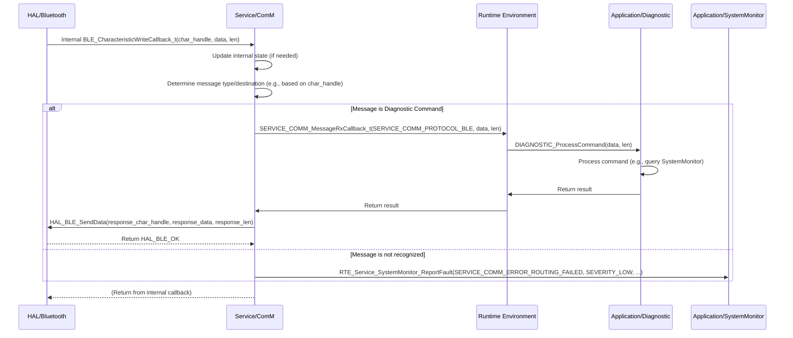

# **Detailed Design Document: ComM Component**

## **1. Introduction**

### **1.1. Purpose**

This document details the design of the ComM (Communication Manager) component, which resides in the Service Layer. Its primary purpose is to act as the central orchestrator for all external communication protocols (Modbus, Bluetooth, Wi-Fi). It provides a unified, protocol-agnostic interface to the Application and RTE layers for sending/receiving data and managing connection states, abstracting the complexities of individual communication technologies.

### **1.2. Scope**

The scope of this document covers the ComM module's architecture, functional behavior, interfaces, dependencies, and resource considerations. It details how ComM interacts with the HAL layer communication drivers (HAL/modbus, HAL/Bluetooth, HAL/Wifi) and provides services to the Application layer via RTE.

### **1.3. References**

* Software Architecture Document (SAD) - Smart Device Firmware (Final Version)  
* Detailed Design Document: HAL_Modbus  
* Detailed Design Document: HAL_BLE  
* Detailed Design Document: HAL_WIFI

## **2. Functional Description**

The ComM component provides the following core functionalities:

1. **Communication Initialization**: Initialize all underlying communication HAL drivers (Modbus, BLE, Wi-Fi).  
2. **Protocol Orchestration**: Periodically call the Process() functions of each active communication HAL driver to handle their internal state machines (e.g., Modbus frame processing, BLE advertising/connection management, Wi-Fi connection attempts).  
3. **Unified Data Interface**: Provide generic functions for higher layers to send and receive data, regardless of the underlying communication protocol.  
4. **Message Routing**: Route incoming messages from any communication protocol to the appropriate Application layer module (e.g., systemMgr for control commands, diagnostic for diagnostic requests).  
5. **Connection State Management**: Monitor and report the connection status of each communication interface (e.g., BLE connected, Wi-Fi connected to AP).  
6. **Bus Arbitration (Optional)**: If multiple protocols share a physical bus (e.g., Modbus RTU and a debug UART on the same physical UART peripheral), ComM would manage arbitration. (For this design, assume separate physical interfaces or that lower layers handle this).  
7. **Error Reporting**: Report any failures during communication management (e.g., HAL driver initialization failure, routing error, unhandled message) to the SystemMonitor via RTE_Service_SystemMonitor_ReportFault().

## **3. Non-Functional Requirements**

### **3.1. Performance**

* **Responsiveness**: Ensure timely processing and routing of incoming and outgoing messages.  
* **Throughput**: Support the aggregate data rates required by all active communication protocols.  
* **Minimal Latency**: Minimize latency for critical command/response exchanges.

### **3.2. Memory**

* **Minimal Footprint**: The ComM code and data shall have a minimal memory footprint.  
* **Buffer Management**: Efficiently manage internal message queues or buffers for inter-protocol communication within ComM.

### **3.3. Reliability**

* **Robustness**: The module shall handle communication errors or invalid messages gracefully, without affecting other protocols.  
* **Fault Isolation**: Failures in one communication protocol should not propagate to others or crash the system.  
* **Protocol Coexistence**: Ensure that multiple communication protocols can operate concurrently without significant interference or performance degradation.

## **4. Architectural Context**

As per the SAD (Section 3.1.2, Service Layer), ComM resides in the Service Layer. It is the central communication hub. It interacts with HAL/modbus, HAL/Bluetooth, and HAL/Wifi for low-level communication. It provides its services to the RTE layer, which then exposes them to the Application layer (e.g., systemMgr, diagnostic, ota).

## **5. Design Details**

### **5.1. Module Structure**

The ComM component will consist of the following files:

* Service/ComM/inc/service_comm.h: Public header file containing function prototypes, data types, and error codes.  
* Service/ComM/src/service_comm.c: Source file containing the implementation of the ComM functions.  
* Service/ComM/cfg/service_comm_cfg.h: Configuration header for enabling/disabling protocols, message routing rules.

### **5.2. Public Interface (API)**

// In Service/ComM/inc/service_comm.h
```c
// Enum for ComM status/error codes  
typedef enum {  
    SERVICE_COMM_OK = 0,  
    SERVICE_COMM_ERROR_INIT_FAILED,  
    SERVICE_COMM_ERROR_TX_FAILED,  
    SERVICE_COMM_ERROR_RX_FAILED,  
    SERVICE_COMM_ERROR_ROUTING_FAILED,  
    SERVICE_COMM_ERROR_INVALID_PARAM,  
    SERVICE_COMM_ERROR_PROTOCOL_NOT_ENABLED,  
    // Add more specific errors as needed  
} SERVICE_COMM_Status_t;

// Enum for communication protocols  
typedef enum {  
    SERVICE_COMM_PROTOCOL_MODBUS,  
    SERVICE_COMM_PROTOCOL_BLE,  
    SERVICE_COMM_PROTOCOL_WIFI,  
    SERVICE_COMM_PROTOCOL_COUNT  
} SERVICE_COMM_Protocol_t;

// Enum for connection states (generic across protocols)  
typedef enum {  
    SERVICE_COMM_STATE_DISCONNECTED,  
    SERVICE_COMM_STATE_CONNECTING,  
    SERVICE_COMM_STATE_CONNECTED,  
    SERVICE_COMM_STATE_ERROR  
} SERVICE_COMM_ConnectionState_t;

// Function pointer for generic incoming message routing  
typedef void (*SERVICE_COMM_MessageRxCallback_t)(SERVICE_COMM_Protocol_t protocol, const uint8_t *data, uint16_t len);

// Function pointer for connection state changes  
typedef void (*SERVICE_COMM_ConnectionStateCallback_t)(SERVICE_COMM_Protocol_t protocol, SERVICE_COMM_ConnectionState_t state, const char *info);

/**  
 * @brief Initializes the ComM module and all enabled communication HAL drivers.  
 * This function should be called once during system initialization.  
 * @param msg_rx_cb Callback for routing incoming messages.  
 * @param conn_state_cb Callback for connection state changes.  
 * @return SERVICE_COMM_OK on success, an error code on failure.  
 */  
SERVICE_COMM_Status_t SERVICE_COMM_Init(SERVICE_COMM_MessageRxCallback_t msg_rx_cb,  
                                        SERVICE_COMM_ConnectionStateCallback_t conn_state_cb);

/**  
 * @brief Main processing function for the Communication Manager.  
 * This function should be called periodically by the COMMUNICATION_STACK_MainTask.  
 * It processes all enabled communication protocols.  
 */  
void SERVICE_COMM_Process(void);

/**  
 * @brief Sends data via a specified communication protocol.  
 * The ComM module handles the underlying HAL driver call.  
 * @param protocol The communication protocol to use.  
 * @param data Pointer to the data to send.  
 * @param len Length of the data.  
 * @param destination_info Optional: Protocol-specific destination info (e.g., BLE char handle, Wi-Fi socket FD, Modbus slave ID).  
 * @return SERVICE_COMM_OK on success, an error code on failure.  
 */  
SERVICE_COMM_Status_t SERVICE_COMM_Send(SERVICE_COMM_Protocol_t protocol,  
                                        const uint8_t *data, uint16_t len,  
                                        void *destination_info);

/**  
 * @brief Gets the current connection state of a specific communication protocol.  
 * @param protocol The communication protocol.  
 * @return The current connection state.  
 */  
SERVICE_COMM_ConnectionState_t SERVICE_COMM_GetConnectionState(SERVICE_COMM_Protocol_t protocol);

/**  
 * @brief Requests a specific communication protocol to connect/disconnect.  
 * @param protocol The communication protocol.  
 * @param connect True to connect, false to disconnect.  
 * @param config_info Optional: Protocol-specific configuration (e.g., Wi-Fi STA config, AP config).  
 * @return SERVICE_COMM_OK on success, an error code on failure.  
 */  
SERVICE_COMM_Status_t SERVICE_COMM_RequestConnection(SERVICE_COMM_Protocol_t protocol, bool connect, void *config_info);
```

### **5.3. Internal Design**

The ComM module will maintain internal state for each communication protocol (e.g., connection status, internal buffers). It will register itself as the callback handler for all HAL communication drivers and then dispatch these events to the higher-layer SERVICE_COMM_MessageRxCallback_t or SERVICE_COMM_ConnectionStateCallback_t provided during Init.

1. **Initialization (SERVICE_COMM_Init)**:  
   * Validate input callback pointers and store them internally.  
   * **Initialize HAL Drivers**:  
     * If SERVICE_COMM_MODBUS_ENABLED is true: Call HAL_Modbus_Init() with its specific config and register internal HAL_Modbus callbacks. If fails, report SERVICE_COMM_ERROR_INIT_FAILED.  
     * If SERVICE_COMM_BLE_ENABLED is true: Call HAL_BLE_Init() with its specific config and register internal HAL_BLE callbacks. If fails, report SERVICE_COMM_ERROR_INIT_FAILED.  
     * If SERVICE_COMM_WIFI_ENABLED is true: Call HAL_WIFI_Init() with its specific config and register internal HAL_WIFI callbacks. If fails, report SERVICE_COMM_ERROR_INIT_FAILED.  
   * Initialize internal state variables (e.g., connection_states[SERVICE_COMM_PROTOCOL_COUNT]).  
   * Return SERVICE_COMM_OK.  
2. **Main Processing Loop (SERVICE_COMM_Process)**:  
   * This function is called periodically by RTE_COMMUNICATION_STACK_MainTask().  
   * **Call HAL Driver Processors**:  
     * If SERVICE_COMM_MODBUS_ENABLED: Call HAL_Modbus_Process() (if such a function exists in HAL_Modbus for periodic tasks).  
     * If SERVICE_COMM_BLE_ENABLED: Call HAL_BLE_Process() (if such a function exists in HAL_BLE).  
     * If SERVICE_COMM_WIFI_ENABLED: Call HAL_WIFI_Process() (if such a function exists in HAL_WIFI).  
   * **Process Internal Queues (if any)**: If ComM uses internal queues to decouple reception from routing, process those here.  
3. **Sending Data (SERVICE_COMM_Send)**:  
   * Validate protocol, data, len.  
   * Use a switch statement based on protocol:  
     * SERVICE_COMM_PROTOCOL_MODBUS: Call HAL_Modbus_TransmitFrame(data, len). destination_info might be used to indicate a specific Modbus slave ID if HAL_Modbus supports it.  
     * SERVICE_COMM_PROTOCOL_BLE: Cast destination_info to uint16_t char_handle. Call HAL_BLE_SendData(char_handle, data, len).  
     * SERVICE_COMM_PROTOCOL_WIFI: Cast destination_info to int socket_fd. Call HAL_WIFI_TcpSend(socket_fd, data, len) or HAL_WIFI_UdpSend().  
   * If the specific HAL send function returns an error, translate it to SERVICE_COMM_ERROR_TX_FAILED and report to SystemMonitor.  
4. **Request Connection (SERVICE_COMM_RequestConnection)**:  
   * Validate protocol, connect.  
   * Use a switch statement based on protocol:  
     * SERVICE_COMM_PROTOCOL_MODBUS: (Modbus RTU is usually always "connected" if UART is up). This might just enable/disable the Modbus processing loop or bus arbitration.  
     * SERVICE_COMM_PROTOCOL_BLE: Call HAL_BLE_StartAdvertising() or HAL_BLE_Disconnect(). config_info might be used for advertising parameters.  
     * SERVICE_COMM_PROTOCOL_WIFI: Cast config_info to HAL_WIFI_StaConfig_t or HAL_WIFI_ApConfig_t. Call HAL_WIFI_SetMode(HAL_WIFI_MODE_STA/AP/OFF, config_info, NULL/config_info).  
   * Update internal connection state and report to SystemMonitor.  
5. **Internal HAL Callbacks (e.g., comm_hal_ble_conn_state_cb, comm_hal_modbus_rx_cb)**:  
   * These static functions are registered with the respective HAL drivers during SERVICE_COMM_Init.  
   * When invoked by a HAL driver (e.g., HAL_BLE reports a connection change, HAL_Modbus reports a received frame):  
     * Update ComM's internal state (e.g., connection_states[]).  
     * Call the SERVICE_COMM_MessageRxCallback_t (for received data) or SERVICE_COMM_ConnectionStateCallback_t (for connection changes) provided by the higher layer (RTE).  
     * Report any unexpected errors from the HAL layer to SystemMonitor.

**Sequence Diagram (Example: Incoming BLE Data):**


### **5.4. Dependencies**

* **HAL/modbus/inc/hal_modbus.h**: For Modbus communication.  
* **HAL/Bluetooth/inc/hal_ble.h**: For BLE communication.  
* **HAL/Wifi/inc/hal_wifi.h**: For Wi-Fi communication.  
* **Application/logger/inc/logger.h**: For internal logging.  
* **Rte/inc/Rte.h**: For calling RTE_Service_SystemMonitor_ReportFault() and for calling higher-layer callbacks.  
* **Application/common/inc/app_common.h**: For APP_Status_t.  
* **Service/ComM/cfg/service_comm_cfg.h**: For configuration.

### **5.5. Error Handling**

* **Input Validation**: All public API functions will validate input parameters.  
* **HAL Driver Error Propagation**: Errors returned by underlying HAL communication drivers will be caught by ComM.  
* **Fault Reporting**: Upon detection of an error (e.g., HAL driver initialization failure, send/receive failure, message routing error, protocol not enabled), ComM will report a specific fault ID (e.g., SERVICE_COMM_ERROR_INIT_FAILED, SERVICE_COMM_ERROR_TX_FAILED, SERVICE_COMM_ERROR_RX_FAILED, SERVICE_COMM_ERROR_ROUTING_FAILED, SERVICE_COMM_ERROR_PROTOCOL_NOT_ENABLED) to SystemMonitor via the RTE service.  
* **Return Status**: All public API functions will return SERVICE_COMM_Status_t indicating success or specific error.

### **5.6. Configuration**

The Service/ComM/cfg/service_comm_cfg.h file will contain:

* Macros to enable/disable each communication protocol (SERVICE_COMM_MODBUS_ENABLED, SERVICE_COMM_BLE_ENABLED, SERVICE_COMM_WIFI_ENABLED).  
* Any protocol-specific routing rules or message ID mappings (if not handled by Diagnostic directly).
```c
// Example: Service/ComM/cfg/service_comm_cfg.h  
#define SERVICE_COMM_MODBUS_ENABLED     1  
#define SERVICE_COMM_BLE_ENABLED        1  
#define SERVICE_COMM_WIFI_ENABLED       0 // Wi-Fi optional, disabled by default
```

### **5.7. Resource Usage**

* **Flash**: Moderate, for protocol orchestration logic and message routing.  
* **RAM**: Moderate, for internal state variables and potentially small message queues.  
* **CPU**: Low to moderate, depending on the number of active protocols and message traffic.

## **6. Test Considerations**

### **6.1. Unit Testing**

* **Mock HAL Drivers**: Unit tests for ComM will mock the HAL_Modbus, HAL_BLE, and HAL_WIFI functions to isolate ComM's logic.  
* **Test Cases**:  
  * SERVICE_COMM_Init: Test with various enabled/disabled protocols. Verify correct HAL driver initialization calls and error propagation. Verify callback registration.  
  * SERVICE_COMM_Process: Test periodic calls and ensure it calls the Process() functions of enabled HAL drivers.  
  * SERVICE_COMM_Send: Test sending data via each enabled protocol. Mock HAL send functions to simulate success/failure. Verify correct routing and error reporting.  
  * SERVICE_COMM_RequestConnection: Test requesting connection/disconnection for each protocol. Mock HAL connection functions.  
  * Internal HAL Callbacks: Simulate HAL driver callbacks (e.g., HAL_BLE reports a connection, HAL_Modbus reports a received frame) and verify that ComM correctly updates its internal state and invokes the higher-layer MessageRxCallback or ConnectionStateCallback.  
  * Error reporting: Verify that RTE_SystemMonitor_ReportFault() is called with the correct fault ID on various error conditions.

### **6.2. Integration Testing**

* **ComM-HAL Integration**: Verify that ComM correctly interfaces with the actual HAL_Modbus, HAL_BLE, and HAL_WIFI drivers.  
* **Protocol Coexistence**: Test simultaneous operation of multiple enabled protocols (e.g., BLE connected while Modbus is active) to ensure no interference.  
* **End-to-End Message Flow (ComM to App)**: Simulate incoming messages from external devices (via actual HAL drivers) and verify that ComM correctly routes them to the MessageRxCallback and that the Application layer processes them.  
* **End-to-End Message Flow (App to ComM)**: Simulate Application layer requests to send data and verify that ComM correctly uses the appropriate HAL driver to transmit.  
* **Connection State Transitions**: Verify that ComM accurately tracks and reports connection state changes for each protocol.  
* **Fault Injection**: Introduce errors at the HAL layer (e.g., cause HAL_BLE_SendData to fail) and verify that ComM detects and reports these faults correctly to SystemMonitor.

### **6.3. System Testing**

* **Full System Communication**: Verify that all external communication features (Modbus control, BLE status updates, Wi-Fi cloud connectivity, OTA updates) work correctly within the integrated system.  
* **Robustness under Network Stress**: Test ComM's behavior under high network traffic, frequent connection/disconnection events, and noisy environments.  
* **Performance Metrics**: Measure overall communication latency and throughput.  
* **Resource Utilization**: Monitor CPU load and memory usage (especially for communication buffers) during active communication.
