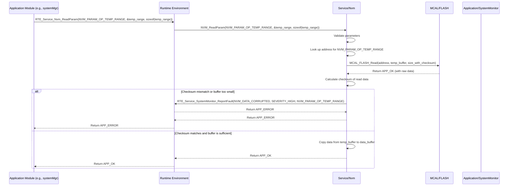

# **Detailed Design Document: Nvm (Non-Volatile Memory) Component**

## **1. Introduction**

### **1.1. Purpose**

This document details the design of the Nvm component. Its primary purpose is to provide a high-level, **non-volatile configuration storage** service for Application Layer modules to persistently store and retrieve critical system parameters and application data. It abstracts the complexities of the underlying Flash or EEPROM memory access (via MCAL_FLASH or MCAL_EEPROM). This module ensures that essential settings persist across reboots, fulfilling requirements like SyRS-02-07-03 and SRS-04-08-02.

### **1.2. Scope**

The scope of this document covers the Nvm module's architecture, functional behavior, interfaces, dependencies, and resource considerations. It details how Nvm manages data organization, read/write operations, and error handling for non-volatile memory, interacting directly with MCAL Flash/EEPROM drivers.

### **1.3. References**

* Software Architecture Document (SAD) - Environmental Monitoring & Control System (Final Version)  
* Detailed Design Document: RTE  
* Detailed Design Document: MCAL_FLASH  
* Detailed Design Document: MCAL_EEPROM (if applicable)  
* Flash/EEPROM Memory Datasheet (for specific memory characteristics)

## **2. Functional Description**

The Nvm component provides the following core functionalities:

1. **Initialization (Nvm_Init)**: Initialize the underlying non-volatile memory system (e.g., Flash partitions, EEPROM). This includes verifying the integrity of stored data (e.g., checksums) and loading default values if data is corrupted or missing.  
2. **Read Parameter (NVM_ReadParam)**: Retrieve a specific configuration parameter or data block from non-volatile memory.  
3. **Write Parameter (NVM_WriteParam)**: Store a specific configuration parameter or data block to non-volatile memory. This operation should be robust against power loss during write cycles.  
4. **Manage Data Integrity**: Implement mechanisms (e.g., checksums, redundant storage) to ensure the integrity and validity of stored data.  
5. **Error Reporting**: Report any failures during NVM operations (e.g., read/write errors, data corruption) to the SystemMonitor via RTE_Service_SystemMonitor_ReportFault().

## **3. Non-Functional Requirements**

### **3.1. Performance**

* **Read/Write Speed**: Read and write operations shall be performed efficiently, with acceptable latency, especially for frequently accessed parameters.  
* **Wear Leveling (if Flash)**: If using Flash memory, the underlying MCAL/HAL should ideally implement wear-leveling to extend the lifespan of the memory. The Nvm module should be designed to support this.

### **3.2. Memory**

* **Efficient Storage**: Data shall be stored efficiently to minimize the required non-volatile memory size.  
* **RAM Footprint**: Minimal RAM usage for internal buffers during read/write operations.

### **3.3. Reliability**

* **Data Persistence**: Stored data must persist across power cycles and system reboots.  
* **Data Integrity**: Stored data must remain uncorrupted, even in the event of unexpected power loss during write operations.  
* **Robustness**: The module shall be robust against invalid parameter IDs or memory access failures.  
* **Fail-Safe Defaults**: If stored data is corrupted or invalid, the module shall revert to known-good default values.

## **4. Architectural Context**

As per the SAD (Section 3.1.2, Service Layer), Nvm resides in the **Service Layer**. It provides persistent storage services to Application Layer modules (e.g., systemMgr for operational parameters, diagnostic for fault history). It interacts directly with MCAL_FLASH and/or MCAL_EEPROM.

## **5. Design Details**

### **5.1. Module Structure**

The Nvm component will consist of the following files:

* Service/nvm/inc/nvm.h: Public header file containing function prototypes, data types for parameters, and error codes.  
* Service/nvm/src/nvm.c: Source file containing the implementation of NVM logic, data serialization/deserialization, and memory access.  
* Service/nvm/cfg/nvm_cfg.h: Configuration header for parameter IDs, memory addresses/offsets, and default values.

### **5.2. Public Interface (API)**

// In Service/nvm/inc/nvm.h
```c
#include "Application/common/inc/app_common.h" // For APP_Status_t  
#include <stdint.h>   // For uint32_t, uint8_t  
#include <stdbool.h>  // For bool

// --- Nvm Parameter IDs ---  
// These IDs map to specific data structures or individual parameters  
typedef enum {  
    NVM_PARAM_OP_TEMP_RANGE = 0,    // Operational temperature range (min/max)  
    NVM_PARAM_FAN_SCHEDULE,         // Fan scheduling data  
    NVM_PARAM_HEATER_SETTINGS,      // Heater configuration  
    NVM_PARAM_PUMP_SETTINGS,        // Pump configuration  
    NVM_PARAM_VENT_SETTINGS,        // Ventilator configuration  
    NVM_PARAM_LIGHT_SETTINGS,       // Light configuration  
    NVM_PARAM_ALARM_THRESHOLDS,     // Alarm thresholds  
    NVM_PARAM_SYSTEM_MODE,          // Last saved system mode (Auto/Manual/Hybrid)  
    NVM_PARAM_FAULT_HISTORY,        // Pointer/offset for fault history log  
    // Add more parameters as needed  
    NVM_PARAM_COUNT  
} Nvm_ParamId_t;

/**  
 * @brief Initializes the Nvm module and the underlying non-volatile memory.  
 * This includes verifying data integrity and loading defaults if needed.  
 * @return APP_OK on success, APP_ERROR on failure.  
 */  
APP_Status_t Nvm_Init(void);

/**  
 * @brief Reads a specific configuration parameter or data block from non-volatile memory.  
 * @param param_id The ID of the parameter to read.  
 * @param data_buffer Pointer to the buffer where the read data will be stored.  
 * @param buffer_len The size of the provided buffer.  
 * @return APP_OK on success, APP_ERROR on failure (e.g., invalid ID, read error, data corruption).  
 */  
APP_Status_t NVM_ReadParam(Nvm_ParamId_t param_id, void *data_buffer, uint16_t buffer_len);

/**  
 * @brief Writes a specific configuration parameter or data block to non-volatile memory.  
 * This operation should be robust against power loss during write cycles.  
 * @param param_id The ID of the parameter to write.  
 * @param data_buffer Pointer to the data to write.  
 * @param data_len The number of bytes to write.  
 * @return APP_OK on success, APP_ERROR on failure (e.g., invalid ID, write error, memory full).  
 */  
APP_Status_t NVM_WriteParam(Nvm_ParamId_t param_id, const void *data_buffer, uint16_t data_len);
```
### **5.3. Internal Design**

The Nvm module will manage memory allocation within the non-volatile storage, handle data serialization/deserialization, and implement data integrity checks. It will call MCAL_FLASH (and/or MCAL_EEPROM) directly.

1. **Internal Data Structure (Conceptual)**:  
   * The non-volatile memory will be organized into logical "records" or "blocks," each corresponding to a Nvm_ParamId_t.  
   * Each record will include:  
     * A unique identifier (param_id).  
     * Data length.  
     * The actual data.  
     * A checksum (e.g., CRC) for integrity verification.  
     * (Optional) A version number for data structure changes.  
   * A "header" or "lookup table" might be stored at a fixed location to quickly find the start address and size of each parameter block.  
2. **Initialization (Nvm_Init)**:  
   * Call MCAL_FLASH_Init() (and/or MCAL_EEPROM_Init()). If this fails, report NVM_INIT_FAILURE to SystemMonitor via RTE and return APP_ERROR.  
   * **Read Storage Header/Lookup Table**: Attempt to read the main storage header/lookup table from a known Flash/EEPROM address.  
   * **Integrity Check**: Calculate the checksum of the header. If invalid, or if the header is empty/corrupted:  
     * Report NVM_DATA_CORRUPTED to SystemMonitor via RTE.  
     * **Load Defaults**: Initialize the storage with all default parameters as defined in nvm_cfg.h. This involves calling NVM_WriteParam for each default.  
   * Else (header is valid):  
     * Mark s_is_initialized = true;.  
   * Return APP_OK.  
3. **Read Parameter (NVM_ReadParam)**:  
   * If !s_is_initialized, return APP_ERROR.  
   * Validate param_id, data_buffer, buffer_len.  
   * **Find Parameter Location**: Look up the param_id in the internal storage map (or by reading the header). This gives the memory address and stored length.  
   * **Read Raw Data**: Call MCAL_FLASH_Read(address, temp_buffer, stored_len + checksum_len).  
   * **Verify Checksum**: Calculate the checksum of the read data and compare it with the stored checksum.  
   * If checksum matches and stored_len <= buffer_len:  
     * Copy data from temp_buffer to data_buffer.  
     * Set response_code = APP_OK;.  
   * Else (checksum mismatch or buffer too small):  
     * Report NVM_DATA_CORRUPTED (for checksum) or NVM_BUFFER_TOO_SMALL (for size) to SystemMonitor via RTE.  
     * Set response_code = APP_ERROR;.  
   * Return response_code.  
4. **Write Parameter (NVM_WriteParam)**:  
   * If !s_is_initialized, return APP_ERROR.  
   * Validate param_id, data_buffer, data_len.  
   * **Prepare Data Block**: Create a temporary buffer containing param_id, data_len, data_buffer content, and calculated checksum.  
   * **Find Write Location**: Determine the optimal location to write the new block. This might involve:  
     * Erasing the old block (if Flash).  
     * Finding the next available free space.  
     * (For wear-leveling) Distributing writes across different memory sectors.  
   * **Write Raw Data**: Call MCAL_FLASH_Write(address, prepared_block, total_block_len).  
   * **Update Storage Header/Lookup Table**: After a successful write, update the main storage header/lookup table to reflect the new location/length of the parameter. This update itself should be atomic or redundant to prevent corruption of the lookup table.  
   * If any MCAL_FLASH_Write or header update fails, report NVM_WRITE_FAILURE to SystemMonitor via RTE.  
   * Return APP_OK or APP_ERROR.

**Sequence Diagram (Example: NVM_ReadParam):**

### **5.4. Dependencies**

* Application/common/inc/app_common.h: For APP_Status_t and APP_OK/APP_ERROR.  
* Application/logger/inc/logger.h: For internal logging.  
* Rte/inc/Rte.h: For calling RTE_Service_SystemMonitor_ReportFault().  
* Application/SystemMonitor/inc/system_monitor.h: For FAULT_ID_NVM_... definitions.  
* Mcal/flash/inc/mcal_flash.h: For Flash memory access.  
* Mcal/eeprom/inc/mcal_eeprom.h (optional): For EEPROM memory access.  
* Service/nvm/cfg/nvm_cfg.h: For the Nvm_Config_t structure and any predefined bus configurations.

### **5.5. Error Handling**

* **Input Validation**: All public API functions will validate input parameters (e.g., valid param_id, non-NULL pointers, non-zero lengths).  
* **MCAL Error Propagation**: Errors returned by MCAL_FLASH (or MCAL_EEPROM) functions will be caught by Nvm.  
* **Data Integrity Checks**: Checksums (or other error detection codes) will be used to verify data integrity upon reading. If data is corrupted, Nvm_Init will load defaults, and NVM_ReadParam will return APP_ERROR and report a fault.  
* **Fault Reporting**: Upon detection of an error (invalid input, MCAL failure, data corruption), Nvm will report a specific fault ID (e.g., NVM_INIT_FAILURE, NVM_READ_FAILURE, NVM_WRITE_FAILURE, NVM_DATA_CORRUPTED) to SystemMonitor via the RTE service.  
* **Power-Loss Robustness**: Write operations should be designed to be atomic or use techniques (e.g., write-erase-verify cycles, redundant writes) to ensure data integrity even if power is lost during the write process. This is largely dependent on the underlying MCAL_FLASH implementation.  
* **Return Status**: All public API functions will return APP_ERROR on failure.

### **5.6. Configuration**

The Service/nvm/cfg/nvm_cfg.h file will contain:

* NVM_FLASH_START_ADDRESS, NVM_FLASH_SIZE: Define the dedicated region in Flash memory for NVM.  
* NVM_USE_EEPROM: A macro to enable/disable EEPROM usage if both Flash and EEPROM are options.  
* NVM_MAX_PARAM_SIZE: Maximum size for any single parameter.  
* Default values for all Nvm_ParamId_t parameters. These defaults will be loaded if the stored data is invalid or missing.  
* A lookup table or array mapping Nvm_ParamId_t to their expected sizes and default data.
```c
// Example: Service/nvm/cfg/nvm_cfg.h  
#ifndef NVM_CFG_H  
#define NVM_CFG_H

#include "Service/nvm/inc/nvm.h" // For Nvm_ParamId_t

// --- Memory Allocation ---  
// Define the region in Flash dedicated for NVM  
#define NVM_FLASH_START_ADDRESS     0x100000 // Example address in Flash  
#define NVM_FLASH_SIZE              0x10000  // 64KB example size

// Option to use EEPROM instead of/in addition to Flash (if supported by MCU)  
#define NVM_USE_EEPROM              0 // Set to 1 to enable EEPROM

// Max size for any single parameter to help with buffer allocation  
#define NVM_MAX_PARAM_SIZE          256

// --- Default Values for Parameters ---  
// Example structures for parameters  
typedef struct {  
    int16_t min_temp; // scaled by 100 (e.g., 2050 for 20.50 C)  
    int16_t max_temp;  
} Nvm_OpTempRange_t;

typedef struct {  
    uint8_t fan_speed_percent;  
    uint8_t on_hour;  
    uint8_t off_hour;  
} Nvm_FanSchedule_t;

// Default values for each parameter ID  
const Nvm_OpTempRange_t NVM_DEFAULT_OP_TEMP_RANGE = { .min_temp = 2000, .max_temp = 2500 };  
const Nvm_FanSchedule_t NVM_DEFAULT_FAN_SCHEDULE = { .fan_speed_percent = 50, .on_hour = 8, .off_hour = 20 };  
// ... define defaults for all other Nvm_ParamId_t

// --- Parameter Metadata (Size and Default Pointer) ---  
// This array maps each Nvm_ParamId_t to its size and default value.  
typedef struct {  
    Nvm_ParamId_t id;  
    uint16_t          size;  
    const void* default_value_ptr;  
} Nvm_ParamMetadata_t;

const Nvm_ParamMetadata_t NVM_PARAM_METADATA[NVM_PARAM_COUNT] = {  
    { NVM_PARAM_OP_TEMP_RANGE, sizeof(Nvm_OpTempRange_t), &NVM_DEFAULT_OP_TEMP_RANGE },  
    { NVM_PARAM_FAN_SCHEDULE, sizeof(Nvm_FanSchedule_t), &NVM_DEFAULT_FAN_SCHEDULE },  
    // Add entries for all other Nvm_ParamId_t  
};

#endif // NVM_CFG_H
```
### **5.7. Resource Usage**

* **Flash**: Moderate, for the module's code and the dedicated NVM region.  
* **RAM**: Low, for internal buffers (e.g., temp_buffer for read/write operations) and the NVM_PARAM_METADATA lookup table.  
* **CPU**: Low for reads. Writes can be CPU-intensive due to erase/write cycles, especially for Flash, but these are typically infrequent.

## **6. Test Considerations**

### **6.1. Unit Testing**

* **Mock MCAL_FLASH/MCAL_EEPROM**: Unit tests for Nvm will mock the underlying MCAL memory access functions (MCAL_FLASH_Read, MCAL_FLASH_Write, MCAL_FLASH_Erase, etc.) and RTE_Service_SystemMonitor_ReportFault().  
* **Test Cases**:  
  * Nvm_Init:  
    * Test successful initialization when memory is clean (verify defaults are written).  
    * Test initialization when memory has valid data (verify data is read, not overwritten).  
    * Test initialization when memory has corrupted data (verify data corruption fault is reported, and defaults are loaded/written).  
    * Test scenarios where MCAL_FLASH_Init fails.  
  * NVM_ReadParam:  
    * Test reading valid parameters with correct buffer sizes.  
    * Test reading invalid param_id.  
    * Test reading with NULL buffer or insufficient buffer_len.  
    * Test scenarios where MCAL_FLASH_Read fails.  
    * Test scenarios where checksum verification fails (data corruption).  
  * NVM_WriteParam:  
    * Test writing valid parameters.  
    * Test writing invalid param_id.  
    * Test writing with NULL data or zero data_len.  
    * Test scenarios where MCAL_FLASH_Write fails.  
    * Test power loss simulation during write (verify data integrity after simulated reboot). This might require specific test harness capabilities.  
  * Data Integrity: Test writing a value, then corrupting the mocked memory, then reading to ensure corruption is detected.

### **6.2. Integration Testing**

* **Nvm-MCAL_FLASH/EEPROM Integration**: Verify that Nvm correctly interfaces with the actual MCAL memory drivers.  
* **Nvm-systemMgr Integration**: Verify systemMgr can successfully store and retrieve its operational parameters (e.g., temperature ranges, schedules) across reboots using Nvm via RTE services.  
* **Nvm-Diagnostic Integration**: If Diagnostic stores fault history, verify it can use Nvm correctly via RTE services.  
* **Power Cycling Tests**: Perform numerous power cycles (including abrupt power-offs during write operations if safe) to verify data persistence and integrity.  
* **Wear Leveling (if applicable)**: Monitor memory usage and write patterns over long-term tests to ensure wear-leveling is effective.

### **6.3. System Testing**

* **End-to-End Persistence**: Configure system settings (e.g., via Bluetooth), power cycle the device, and verify that the settings are retained and the system operates according to the persisted configuration.  
* **Fault Recovery**: Simulate memory corruption (if possible in a test environment) and verify the system recovers by loading default settings and reporting a fault.  
* **Long-Term Reliability**: Run the system for extended periods under various operational conditions, continuously verifying that stored data remains consistent and uncorrupted.