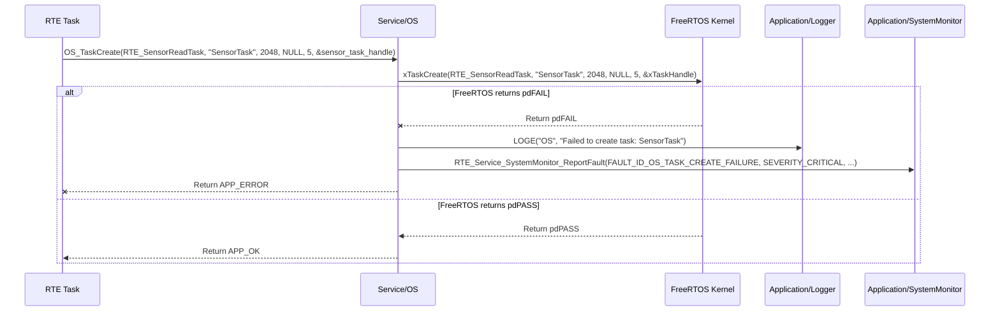

# **Detailed Design Document: OS (Operating System) Component**

## **1. Introduction**

### **1.1. Purpose**

This document details the design of the OS component. Its primary purpose is to provide a **thin abstraction layer over FreeRTOS APIs**, encapsulating OS-dependent logic within the Service Layer. This design choice aims to enhance modularity and portability, making it easier to potentially swap out FreeRTOS for another RTOS in the future with minimal impact on higher layers. It provides a standardized interface for tasks, queues, semaphores, and timers.

### **1.2. Scope**

The scope of this document covers the OS module's architecture, functional behavior, interfaces, dependencies, and resource considerations. It details how OS wraps FreeRTOS functionalities and exposes them to the RTE and other Service/Application layers (primarily via RTE services).

### **1.3. References**

* Software Architecture Document (SAD) - Environmental Monitoring & Control System (Final Version)  
* FreeRTOS Documentation (Official API Reference)  
* Detailed Design Document: RTE

## **2. Functional Description**

The OS component provides wrapped functionalities for common RTOS operations:

1. **Task Management**: Create, delete, suspend, resume, and set priority for tasks.  
2. **Time Management**: Provide delay functions and retrieve system tick count/uptime.  
3. **Synchronization Primitives**:  
   * **Mutexes**: Create, acquire, and release mutexes for protecting shared resources.  
   * **Semaphores**: Create, give, and take binary and counting semaphores for signaling and resource counting.  
4. **Queue Management**: Create, send to, and receive from queues for inter-task communication.  
5. **Software Timer Management**: Create, start, stop, and reset software timers.  
6. **Memory Management**: Provide wrapped functions for dynamic memory allocation within the RTOS heap.  
7. **Error Reporting**: While OS itself is foundational, critical internal errors (e.g., failed mutex creation) might be reported to SystemMonitor via RTE_Service_SystemMonitor_ReportFault() if the system is stable enough to do so.

## **3. Non-Functional Requirements**

### **3.1. Performance**

* **Minimal Overhead**: The wrapper functions shall introduce minimal performance overhead compared to direct FreeRTOS API calls.  
* **Determinism**: OS operations shall be deterministic, crucial for real-time performance.

### **3.2. Memory**

* **Efficient Resource Usage**: The OS module itself shall have a minimal memory footprint. It will manage FreeRTOS-allocated resources (tasks, queues, semaphores) efficiently.

### **3.3. Reliability**

* **Robustness**: The wrapper functions shall handle invalid inputs gracefully (e.g., NULL pointers) and propagate FreeRTOS errors where appropriate.  
* **Portability**: The abstraction layer should facilitate easier migration to a different RTOS in the future.

## **4. Architectural Context**

As per the SAD (Section 3.1.2, Service Layer), OS resides in the Service Layer. It encapsulates FreeRTOS APIs. Modules in the RTE and Application Layers (via RTE services) will interact with the OS through this OS module's public interface, rather than directly calling FreeRTOS functions.

## **5. Design Details**

### **5.1. Module Structure**

The OS component will consist of the following files:

* Service/os/inc/os.h: Public header file containing function prototypes and data types.  
* Service/os/src/os.c: Source file containing the implementation of the FreeRTOS API wrappers.  
* Service/os/cfg/os_cfg.h: Configuration header for OS-specific settings (e.g., default stack sizes, queue lengths).

### **5.2. Public Interface (API)**

// In Service/os/inc/os.h
```c
#include "Application/common/inc/app_common.h" // For APP_Status_t  
#include <stdint.h>   // For uint32_t, uint8_t  
#include <stdbool.h>  // For bool

// Forward declarations for FreeRTOS types (to avoid including FreeRTOS.h directly in public header)  
typedef void *OS_TaskHandle_t;  
typedef void *OS_MutexHandle_t;  
typedef void *OS_SemaphoreHandle_t;  
typedef void *OS_QueueHandle_t;  
typedef void *OS_TimerHandle_t;

// Function pointer for task entry point  
typedef void (*OS_TaskFunction_t)(void *pvParameters);

// Function pointer for software timer callback  
typedef void (*OS_TimerCallback_t)(OS_TimerHandle_t xTimer);

/**  
 * @brief Initializes the OS module (primarily internal setup, FreeRTOS is typically started by RTE).  
 * @return APP_OK on success, APP_ERROR on failure.  
 */  
APP_Status_t OS_Init(void);

// --- Task Management ---

/**  
 * @brief Creates a new FreeRTOS task.  
 * @param pxTaskCode Pointer to the task entry function.  
 * @param pcName A descriptive name for the task.  
 * @param usStackDepth The stack depth in words.  
 * @param pvParameters Parameters to pass to the task function.  
 * @param uxPriority The priority of the task.  
 * @param pxCreatedTask Handle to the created task.  
 * @return APP_OK on success, APP_ERROR on failure.  
 */  
APP_Status_t OS_TaskCreate(OS_TaskFunction_t pxTaskCode, const char *const pcName,  
                           const uint16_t usStackDepth, void *const pvParameters,  
                           UBaseType_t uxPriority, OS_TaskHandle_t *const pxCreatedTask);

/**  
 * @brief Deletes a FreeRTOS task.  
 * @param xTaskToDelete Handle of the task to delete (NULL for calling task).  
 */  
void OS_TaskDelete(OS_TaskHandle_t xTaskToDelete);

/**  
 * @brief Delays the calling task for a specified number of milliseconds.  
 * @param delay_ms The delay duration in milliseconds.  
 */  
void OS_DelayMs(uint32_t delay_ms);

/**  
 * @brief Gets the current system uptime in milliseconds.  
 * @return Current uptime in milliseconds.  
 */  
uint32_t OS_GetUptimeMs(void);

// --- Mutex Management ---

/**  
 * @brief Creates a new recursive mutex.  
 * @return Handle to the created mutex, or NULL on failure.  
 */  
OS_MutexHandle_t OS_MutexCreateRecursive(void);

/**  
 * @brief Acquires a recursive mutex.  
 * @param xMutex The handle of the mutex to acquire.  
 * @param xBlockTimeMs The maximum time to wait for the mutex in milliseconds.  
 * @return APP_OK on success, APP_ERROR on failure (e.g., timeout).  
 */  
APP_Status_t OS_MutexTakeRecursive(OS_MutexHandle_t xMutex, uint32_t xBlockTimeMs);

/**  
 * @brief Releases a recursive mutex.  
 * @param xMutex The handle of the mutex to release.  
 * @return APP_OK on success, APP_ERROR on failure.  
 */  
APP_Status_t OS_MutexGiveRecursive(OS_MutexHandle_t xMutex);

// --- Semaphore Management ---

/**  
 * @brief Creates a new binary semaphore.  
 * @return Handle to the created semaphore, or NULL on failure.  
 */  
OS_SemaphoreHandle_t OS_SemaphoreCreateBinary(void);

/**  
 * @brief Gives a semaphore.  
 * @param xSemaphore The handle of the semaphore to give.  
 * @return APP_OK on success, APP_ERROR on failure.  
 */  
APP_Status_t OS_SemaphoreGive(OS_SemaphoreHandle_t xSemaphore);

/**  
 * @brief Takes a semaphore.  
 * @param xSemaphore The handle of the semaphore to take.  
 * @param xBlockTimeMs The maximum time to wait for the semaphore in milliseconds.  
 * @return APP_OK on success, APP_ERROR on failure (e.g., timeout).  
 */  
APP_Status_t OS_SemaphoreTake(OS_SemaphoreHandle_t xSemaphore, uint32_t xBlockTimeMs);

// --- Queue Management ---

/**  
 * @brief Creates a new queue.  
 * @param uxQueueLength The maximum number of items the queue can hold.  
 * @param uxItemSize The size in bytes of each item in the queue.  
 * @return Handle to the created queue, or NULL on failure.  
 */  
OS_QueueHandle_t OS_QueueCreate(uint32_t uxQueueLength, uint32_t uxItemSize);

/**  
 * @brief Sends an item to the back of a queue.  
 * @param xQueue The handle of the queue to send to.  
 * @param pvItemToQueue Pointer to the item to send.  
 * @param xBlockTimeMs The maximum time to wait for space in the queue in milliseconds.  
 * @return APP_OK on success, APP_ERROR on failure.  
 */  
APP_Status_t OS_QueueSend(OS_QueueHandle_t xQueue, const void *pvItemToQueue, uint32_t xBlockTimeMs);

/**  
 * @brief Receives an item from the front of a queue.  
 * @param xQueue The handle of the queue to receive from.  
 * @param pvBuffer Pointer to the buffer to copy the received item into.  
 * @param xBlockTimeMs The maximum time to wait for an item in the queue in milliseconds.  
 * @return APP_OK on success, APP_ERROR on failure.  
 */  
APP_Status_t OS_QueueReceive(OS_QueueHandle_t xQueue, void *pvBuffer, uint32_t xBlockTimeMs);

// --- Software Timer Management ---

/**  
 * @brief Creates a new software timer.  
 * @param pcTimerName A descriptive name for the timer.  
 * @param xTimerPeriodInMs The period of the timer in milliseconds.  
 * @param uxAutoReload True for auto-reload, false for one-shot.  
 * @param pvTimerID A value to be passed to the timer's callback function.  
 * @param pxCallbackFunction The function to call when the timer expires.  
 * @return Handle to the created timer, or NULL on failure.  
 */  
OS_TimerHandle_t OS_TimerCreate(const char *const pcTimerName, const uint32_t xTimerPeriodInMs,  
                                const UBaseType_t uxAutoReload, void *const pvTimerID,  
                                OS_TimerCallback_t pxCallbackFunction);

/**  
 * @brief Starts a software timer.  
 * @param xTimer The handle of the timer to start.  
 * @param xBlockTimeMs The maximum time to wait for the command to be sent to the timer service.  
 * @return APP_OK on success, APP_ERROR on failure.  
 */  
APP_Status_t OS_TimerStart(OS_TimerHandle_t xTimer, uint32_t xBlockTimeMs);

/**  
 * @brief Stops a software timer.  
 * @param xTimer The handle of the timer to stop.  
 * @param xBlockTimeMs The maximum time to wait for the command to be sent to the timer service.  
 * @return APP_OK on success, APP_ERROR on failure.  
 */  
APP_Status_t OS_TimerStop(OS_TimerHandle_t xTimer, uint32_t xBlockTimeMs);

/**  
 * @brief Resets a software timer (restarts its period from now).  
 * @param xTimer The handle of the timer to reset.  
 * @param xBlockTimeMs The maximum time to wait for the command to be sent to the timer service.  
 * @return APP_OK on success, APP_ERROR on failure.  
 */  
APP_Status_t OS_TimerReset(OS_TimerHandle_t xTimer, uint32_t xBlockTimeMs);

// --- Memory Management ---

/**  
 * @brief Allocates memory from the FreeRTOS heap.  
 * @param xWantedSize The number of bytes to allocate.  
 * @return Pointer to the allocated memory, or NULL on failure.  
 */  
void *OS_Malloc(size_t xWantedSize);

/**  
 * @brief Frees memory allocated from the FreeRTOS heap.  
 * @param pv FreeRTOS heap memory to free.  
 */  
void OS_Free(void *pv);
```
### **5.3. Internal Design**

The OS module's implementation (os.c) will primarily consist of direct calls to the corresponding FreeRTOS APIs. It will handle error checking and return APP_OK/APP_ERROR where appropriate, and potentially log failures.

1. **Initialization (OS_Init)**:  
   * This function is primarily a placeholder for future OS-specific internal setup or checks. For a basic FreeRTOS wrapper, it might not do much beyond confirming FreeRTOS is ready.  
   * It should return APP_OK.  
2. **Task Management**:  
   * OS_TaskCreate: Calls xTaskCreate(). Checks pxCreatedTask for NULL after creation and returns APP_ERROR if task creation failed.  
   * OS_TaskDelete: Calls vTaskDelete().  
   * OS_DelayMs: Calls vTaskDelay(pdMS_TO_TICKS(delay_ms)).  
   * OS_GetUptimeMs: Calls xTaskGetTickCount() * portTICK_PERIOD_MS.  
3. **Mutex Management**:  
   * OS_MutexCreateRecursive: Calls xSemaphoreCreateRecursiveMutex(). Returns NULL if creation fails.  
   * OS_MutexTakeRecursive: Calls xSemaphoreTakeRecursive(xMutex, pdMS_TO_TICKS(xBlockTimeMs)). Returns APP_OK if pdPASS, APP_ERROR otherwise.  
   * OS_MutexGiveRecursive: Calls xSemaphoreGiveRecursive(xMutex). Returns APP_OK if pdPASS, APP_ERROR otherwise.  
4. **Semaphore Management**:  
   * OS_SemaphoreCreateBinary: Calls xSemaphoreCreateBinary(). Returns NULL if creation fails.  
   * OS_SemaphoreGive: Calls xSemaphoreGive(xSemaphore). Returns APP_OK if pdPASS, APP_ERROR otherwise.  
   * OS_SemaphoreTake: Calls xSemaphoreTake(xSemaphore, pdMS_TO_TICKS(xBlockTimeMs)). Returns APP_OK if pdPASS, APP_ERROR otherwise.  
5. **Queue Management**:  
   * OS_QueueCreate: Calls xQueueCreate(). Returns NULL if creation fails.  
   * OS_QueueSend: Calls xQueueSend(xQueue, pvItemToQueue, pdMS_TO_TICKS(xBlockTimeMs)). Returns APP_OK if pdPASS, APP_ERROR otherwise.  
   * OS_QueueReceive: Calls xQueueReceive(xQueue, pvBuffer, pdMS_TO_TO_TICKS(xBlockTimeMs)). Returns APP_OK if pdPASS, APP_ERROR otherwise.  
6. **Software Timer Management**:  
   * OS_TimerCreate: Calls xTimerCreate(). Returns NULL if creation fails.  
   * OS_TimerStart: Calls xTimerStart(). Returns APP_OK if pdPASS, APP_ERROR otherwise.  
   * OS_TimerStop: Calls xTimerStop(). Returns APP_OK if pdPASS, APP_ERROR otherwise.  
   * OS_TimerReset: Calls xTimerReset(). Returns APP_OK if pdPASS, APP_ERROR otherwise.  
7. **Memory Management**:  
   * OS_Malloc: Calls pvPortMalloc().  
   * OS_Free: Calls vPortFree().

**Sequence Diagram (Example: Task Creation via OS Module):**

### **5.4. Dependencies**

* FreeRTOS.h, task.h, semphr.h, queue.h, timers.h: Core FreeRTOS headers. These are included directly in os.c but are abstracted in os.h using forward declarations.  
* Application/common/inc/app_common.h: For APP_Status_t.  
* Application/logger/inc/logger.h: For internal logging.  
* Rte/inc/Rte.h: For calling RTE_Service_SystemMonitor_ReportFault() (for critical OS failures).  
* Service/os/cfg/os_cfg.h: For configuration parameters.

### **5.5. Error Handling**

* **API Return Values**: All OS_ functions that can fail (e.g., creation, take/send with timeout) return APP_OK or APP_ERROR.  
* **Logging**: Failures (e.g., task creation failure, mutex acquisition timeout) are logged using LOGE or LOGW.  
* **Fault Reporting**: For critical OS resource allocation failures (e.g., OS_TaskCreate returning APP_ERROR), the OS module will report a FAULT_ID_OS_RESOURCE_FAILURE to SystemMonitor via RTE.  
* **Input Validation**: Basic input validation (e.g., checking for NULL handles) is performed where appropriate.

### **5.6. Configuration**

The Service/os/cfg/os_cfg.h file will contain:

* Default stack sizes for common task types.  
* Default queue lengths.  
* Default block times for blocking operations.  
* Any FreeRTOS configuration macros that need to be exposed or customized from a higher level (though most FreeRTOS config is in FreeRTOSConfig.h).
```c
// Example: Service/os/cfg/os_cfg.h  
#ifndef OS_CFG_H  
#define OS_CFG_H

// Default stack sizes for tasks (in words, adjust based on MCU architecture)  
#define OS_DEFAULT_TASK_STACK_SIZE_WORDS        2048  
#define OS_SENSOR_TASK_STACK_SIZE_WORDS         1536  
#define OS_COMM_TASK_STACK_SIZE_WORDS           4096 // Communication tasks often need more stack

// Default block times for OS operations (in milliseconds)  
#define OS_DEFAULT_BLOCK_TIME_MS                100  
#define OS_MUTEX_BLOCK_TIME_MS                  500

// Default queue lengths  
#define OS_DEFAULT_QUEUE_LENGTH                 5

#endif // OS_CFG_H
```
### **5.7. Resource Usage**

* **Flash**: Low, as it's mostly wrapper functions.  
* **RAM**: Minimal for the module's own data. The actual RAM usage for tasks, queues, etc., is managed by FreeRTOS and depends on how other modules use the OS API.  
* **CPU**: Very low, as it's a thin wrapper.

## **6. Test Considerations**

### **6.1. Unit Testing**

* **Mock FreeRTOS**: Unit tests for OS will mock the underlying FreeRTOS API calls (e.g., xTaskCreate, xSemaphoreCreateMutex). This allows testing the wrapper's logic and error handling.  
* **Test Cases**:  
  * OS_Init: Verify it returns APP_OK.  
  * OS_TaskCreate: Test successful task creation, NULL task code, NULL handle pointer, and mocked FreeRTOS failure (verify APP_ERROR and logging).  
  * OS_DelayMs: Verify vTaskDelay is called with correct tick count.  
  * OS_GetUptimeMs: Verify correct conversion from ticks to milliseconds.  
  * OS_MutexCreateRecursive, OS_SemaphoreCreateBinary, OS_QueueCreate, OS_TimerCreate: Test successful creation and mocked FreeRTOS failures (verify NULL return).  
  * OS_MutexTakeRecursive, OS_MutexGiveRecursive, OS_SemaphoreTake, OS_SemaphoreGive, OS_QueueSend, OS_QueueReceive, OS_TimerStart, OS_TimerStop, OS_TimerReset: Test successful operations, timeout scenarios, and mocked FreeRTOS failures (verify APP_OK/APP_ERROR returns).  
  * OS_Malloc, OS_Free: Test allocation and deallocation.  
  * Error reporting: Verify RTE_Service_SystemMonitor_ReportFault() is called for critical failures.

### **6.2. Integration Testing**

* **OS-RTE Integration**: Verify that RTE tasks are successfully created and managed using OS_TaskCreate.  
* **Inter-Task Communication**: Create simple tasks that use OS_MutexTakeRecursive/GiveRecursive, OS_SemaphoreTake/Give, OS_QueueSend/Receive to communicate, ensuring correct synchronization and data exchange.  
* **Software Timers**: Verify software timers trigger their callbacks at the correct intervals.  
* **Memory Allocation**: Stress test dynamic memory allocation and deallocation to detect fragmentation or leaks.  
* **Fault Reporting**: Trigger mocked FreeRTOS failures in integration tests and verify that OS reports faults to SystemMonitor via RTE.

### **6.3. System Testing**

* **Overall System Stability**: Monitor the entire system for extended periods to ensure no OS-related crashes, deadlocks, or resource starvation occur.  
* **Task Scheduling**: Verify that tasks run at their expected priorities and periodicities.  
* **Resource Usage**: Monitor CPU load and stack High Water Marks (HWM) using SystemMonitor to ensure efficient resource utilization and detect potential overflows.  
* **Power Modes**: Verify OS behavior during power mode transitions (e.g., tasks suspending/resuming correctly in sleep mode).

Which module would you like to design next? We still have ota, security, and various HAL/MCAL communication drivers and application modules pending.